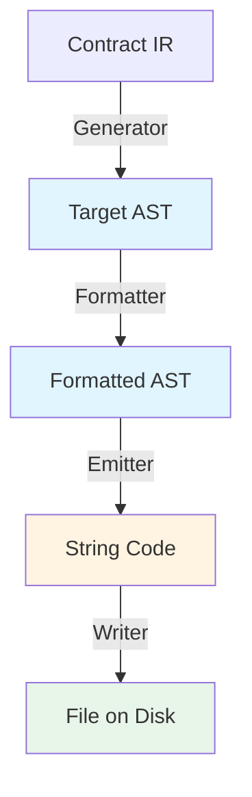

# Desain Arsitektur Target AST untuk RouteSync Compiler

## Status: PROPOSAL - JANGAN DIIMPLEMENTASI

**Tanggal**: 4 Agustus 2026  
**Versi**: 1.0  
**Status**: Design Proposal - Menunggu approval sebelum implementasi

---

## 1. Executive Summary

Dokumen ini mendeskripsikan proposal arsitektur baru untuk RouteSync compiler yang mengadopsi **Target AST** (Abstract Syntax Tree untuk bahasa target) sebagai representasi intermediate antara IR (Intermediate Representation) dan code emission.

### Problem Statement

Arsitektur saat ini memiliki beberapa kelemahan:

1. **Emitter terlalu kompleks**: `TypeScriptEmitter` memahami domain concepts (Entity, Resource, Contract)
2. **Template strings brittle**: Sulit maintain dan debug
3. **Formatter bekerja pada strings**: Tidak efisien dan rawan error
4. **Tidak ada separation of concerns**: Generation logic tercampur dengan printing logic

### Proposed Solution

Memisahkan concerns dengan menambahkan **Target AST layer**:

```
IR → Generator → Target AST → Formatter → Emitter → Writer
```

Dengan approach ini:
- **Generator**: Transform IR ke Target AST (tahu domain + target language)
- **Target AST**: Immutable, strongly-typed representation dari code
- **Formatter**: Manipulate AST (sort, group, reorganize)
- **Emitter**: Pure visitor - traverse AST dan print text
- **Writer**: Persist files ke disk


---

## 2. Arsitektur Overview

### 2.1 Pipeline Lengkap

```
Laravel Project
      │
      ▼
   Scanner
      │
      ▼
  Source AST
      │
      ▼
   Analysis
      │
      ▼
  Constraint Solver
      │
      ▼
   Artifact
      │
      ▼
     IR
      │
      ▼
  Generator ◄─── LAYER BARU
      │
      ▼
  Target AST ◄─── KONSEP BARU
      │
      ▼
  Formatter (AST → AST)
      │
      ▼
  Emitter (AST → String)
      │
      ▼
   Writer
      │
      ▼
Generated TypeScript Files
```


### 2.2 Perbandingan: Before vs After

#### Before (Current)

```
IR → Emitter (domain-aware) → Template Strings → Formatter → Writer
```

**Problems:**
- Emitter knows about Entity, Resource, Contract (domain coupling)
- Template strings sulit maintain
- Formatter works on strings (inefficient)
- No clear separation between generation and printing

#### After (Proposed)

```
IR → Generator → Target AST → Formatter → Emitter (pure visitor) → Writer
```

**Benefits:**
- Generator handles domain logic
- Target AST is typed, immutable, manipulable
- Formatter works on structured data
- Emitter is pure visitor (no logic, just printing)
- Easy to add new target languages


---

## 3. Target AST Design

### 3.1 Konsep Target AST

**Target AST** adalah representasi abstract syntax tree untuk **bahasa target** (TypeScript, Kotlin, Swift, dll).

Berbeda dengan Source AST (yang merepresentasikan Laravel/PHP code), Target AST merepresentasikan code yang **akan digenerate**.

#### Karakteristik Target AST:

1. **Immutable**: Sekali dibuat, tidak bisa diubah
2. **Strongly-typed**: Setiap node punya type yang jelas
3. **Language-specific**: Setiap bahasa punya node types sendiri
4. **Manipulable**: Bisa di-traverse, transform, optimize sebelum jadi string
5. **Visitor-friendly**: Support visitor pattern untuk traversal

### 3.2 Folder Structure

```
compiler/
├── target/                    ← FOLDER BARU
│   ├── typescript/
│   │   ├── nodes/            ← TypeScript AST nodes
│   │   │   ├── TSNode.ts                 (base)
│   │   │   ├── TSFile.ts                 (root)
│   │   │   ├── TSImportDeclaration.ts
│   │   │   ├── TSInterfaceDeclaration.ts
│   │   │   ├── TSTypeAliasDeclaration.ts
│   │   │   ├── TSPropertySignature.ts
│   │   │   ├── TSMethodSignature.ts
│   │   │   ├── TSTypeReference.ts
│   │   │   ├── TSArrayType.ts
│   │   │   ├── TSUnionType.ts
│   │   │   └── index.ts
│   │   ├── visitor/          ← Visitor pattern
│   │   │   ├── TSVisitor.ts
│   │   │   └── TSBaseVisitor.ts
│   │   └── index.ts
│   ├── kotlin/               ← Future: Kotlin target
│   ├── swift/                ← Future: Swift target
│   └── index.ts
```


### 3.3 TypeScript Target AST Node Definitions

#### Base Node

```typescript
/**
 * Base class untuk semua TypeScript AST nodes
 */
export abstract class TSNode {
    /** Node type identifier */
    abstract readonly kind: string;
    
    /** Accept visitor untuk traversal */
    abstract accept<R>(visitor: TSVisitor<R>): R;
    
    /** Source location (optional, untuk error reporting) */
    readonly location?: SourceLocation;
    
    constructor(location?: SourceLocation) {
        this.location = location;
        Object.freeze(this);
    }
}

export interface SourceLocation {
    readonly file: string;
    readonly line: number;
    readonly column: number;
}
```

#### File Node (Root)

```typescript
/**
 * Root node representing complete TypeScript file
 */
export class TSFile extends TSNode {
    readonly kind = 'File';
    
    constructor(
        readonly imports: readonly TSImportDeclaration[],
        readonly declarations: readonly TSDeclaration[],
        readonly exports: readonly TSExportDeclaration[],
        location?: SourceLocation
    ) {
        super(location);
        Object.freeze(this);
    }
    
    accept<R>(visitor: TSVisitor<R>): R {
        return visitor.visitFile(this);
    }
}
```


#### Import Declaration

```typescript
/**
 * Represents TypeScript import statement
 * 
 * Examples:
 * - import { User } from './types'
 * - import * as api from './api'
 * - import type { Response } from './response'
 */
export class TSImportDeclaration extends TSNode {
    readonly kind = 'ImportDeclaration';
    
    constructor(
        readonly specifiers: readonly TSImportSpecifier[],
        readonly moduleSpecifier: string,
        readonly isTypeOnly: boolean = false,
        location?: SourceLocation
    ) {
        super(location);
        Object.freeze(this);
    }
    
    accept<R>(visitor: TSVisitor<R>): R {
        return visitor.visitImportDeclaration(this);
    }
}

export class TSImportSpecifier {
    constructor(
        readonly imported: string,
        readonly local?: string
    ) {
        Object.freeze(this);
    }
}
```


#### Interface Declaration

```typescript
/**
 * Represents TypeScript interface
 * 
 * Example:
 * interface User {
 *   id: number;
 *   name: string;
 * }
 */
export class TSInterfaceDeclaration extends TSNode {
    readonly kind = 'InterfaceDeclaration';
    
    constructor(
        readonly name: string,
        readonly members: readonly TSPropertySignature[],
        readonly typeParameters: readonly TSTypeParameter[] = [],
        readonly heritage: readonly TSTypeReference[] = [],
        readonly isExported: boolean = false,
        location?: SourceLocation
    ) {
        super(location);
        Object.freeze(this);
    }
    
    accept<R>(visitor: TSVisitor<R>): R {
        return visitor.visitInterfaceDeclaration(this);
    }
}
```

#### Property Signature

```typescript
/**
 * Represents interface property
 * 
 * Example: name: string
 */
export class TSPropertySignature extends TSNode {
    readonly kind = 'PropertySignature';
    
    constructor(
        readonly name: string,
        readonly type: TSType,
        readonly isOptional: boolean = false,
        readonly isReadonly: boolean = false,
        location?: SourceLocation
    ) {
        super(location);
        Object.freeze(this);
    }
    
    accept<R>(visitor: TSVisitor<R>): R {
        return visitor.visitPropertySignature(this);
    }
}
```


#### Type Nodes

```typescript
/**
 * Base class untuk TypeScript types
 */
export abstract class TSType extends TSNode {
    abstract readonly kind: string;
}

/**
 * Type reference (e.g., User, string, number)
 */
export class TSTypeReference extends TSType {
    readonly kind = 'TypeReference';
    
    constructor(
        readonly typeName: string,
        readonly typeArguments: readonly TSType[] = [],
        location?: SourceLocation
    ) {
        super(location);
        Object.freeze(this);
    }
    
    accept<R>(visitor: TSVisitor<R>): R {
        return visitor.visitTypeReference(this);
    }
}

/**
 * Array type (e.g., string[])
 */
export class TSArrayType extends TSType {
    readonly kind = 'ArrayType';
    
    constructor(
        readonly elementType: TSType,
        location?: SourceLocation
    ) {
        super(location);
        Object.freeze(this);
    }
    
    accept<R>(visitor: TSVisitor<R>): R {
        return visitor.visitArrayType(this);
    }
}

/**
 * Union type (e.g., string | number)
 */
export class TSUnionType extends TSType {
    readonly kind = 'UnionType';
    
    constructor(
        readonly types: readonly TSType[],
        location?: SourceLocation
    ) {
        super(location);
        Object.freeze(this);
    }
    
    accept<R>(visitor: TSVisitor<R>): R {
        return visitor.visitUnionType(this);
    }
}
```


### 3.4 Visitor Pattern

```typescript
/**
 * Visitor interface untuk traverse TypeScript AST
 */
export interface TSVisitor<R> {
    visitFile(node: TSFile): R;
    visitImportDeclaration(node: TSImportDeclaration): R;
    visitInterfaceDeclaration(node: TSInterfaceDeclaration): R;
    visitTypeAliasDeclaration(node: TSTypeAliasDeclaration): R;
    visitPropertySignature(node: TSPropertySignature): R;
    visitMethodSignature(node: TSMethodSignature): R;
    visitTypeReference(node: TSTypeReference): R;
    visitArrayType(node: TSArrayType): R;
    visitUnionType(node: TSUnionType): R;
    // ... other node types
}

/**
 * Base visitor dengan default implementations
 */
export abstract class TSBaseVisitor<R> implements TSVisitor<R> {
    abstract defaultResult(): R;
    
    visitFile(node: TSFile): R {
        // Default: visit all children
        node.imports.forEach(imp => imp.accept(this));
        node.declarations.forEach(decl => decl.accept(this));
        return this.defaultResult();
    }
    
    visitImportDeclaration(node: TSImportDeclaration): R {
        return this.defaultResult();
    }
    
    visitInterfaceDeclaration(node: TSInterfaceDeclaration): R {
        node.members.forEach(member => member.accept(this));
        return this.defaultResult();
    }
    
    // ... implementations untuk other nodes
}
```


---

## 4. Generator Layer Design

### 4.1 Tanggung Jawab Generator

Generator adalah layer yang **transform IR (Intermediate Representation) menjadi Target AST**.

**Generator TAHU:**
- Domain concepts (Entity, Resource, Contract, Validation)
- Target language syntax dan idioms
- Bagaimana mapping IR structures ke target language constructs

**Generator TIDAK TAHU:**
- Formatting (indentation, spacing, newlines)
- File I/O
- String manipulation

### 4.2 Generator Interface

```typescript
/**
 * Base interface untuk generators
 */
export interface IGenerator<TInput, TOutput extends TSNode> {
    /** Generate Target AST dari input */
    generate(input: TInput): TOutput;
}

/**
 * Generator untuk TypeScript dari IR
 */
export interface ITypeScriptGenerator extends IGenerator<ContractGraph, TSFile> {
    /** Generate complete TypeScript file dari contract graph */
    generate(graph: ContractGraph): TSFile;
}
```


### 4.3 TypeScript Generator Implementation

```typescript
/**
 * Generate TypeScript Target AST dari Contract IR
 */
export class TypeScriptGenerator implements ITypeScriptGenerator {
    
    /**
     * Generate complete TypeScript file dari contract graph
     */
    generate(graph: ContractGraph): TSFile {
        const imports: TSImportDeclaration[] = [];
        const declarations: TSDeclaration[] = [];
        
        // Visit each node dalam graph
        for (const [_, node] of graph.nodes.entries()) {
            // Generate declarations based on node type
            if (node.kind === 'entity') {
                declarations.push(this.generateEntityInterface(node));
            } else if (node.kind === 'schema') {
                declarations.push(this.generateSchemaType(node));
            }
        }
        
        // Collect required imports
        const requiredImports = this.collectRequiredImports(declarations);
        imports.push(...requiredImports);
        
        return new TSFile(imports, declarations, []);
    }
    
    /**
     * Generate TypeScript interface dari entity node
     */
    private generateEntityInterface(node: EntityNode): TSInterfaceDeclaration {
        const properties: TSPropertySignature[] = [];
        
        // Convert entity properties ke TypeScript properties
        for (const [propName, propType] of node.properties.entries()) {
            const tsType = this.semanticTypeToTSType(propType);
            const property = new TSPropertySignature(
                propName,
                tsType,
                propType.nullable,
                false
            );
            properties.push(property);
        }
        
        return new TSInterfaceDeclaration(
            node.name,
            properties,
            [],
            [],
            true // exported
        );
    }
    
    /**
     * Convert semantic type ke TypeScript type node
     */
    private semanticTypeToTSType(type: SemanticType): TSType {
        switch (type.kind) {
            case 'primitive':
                return new TSTypeReference(type.typeName);
            case 'array':
                return new TSArrayType(this.semanticTypeToTSType(type.elementType));
            case 'union':
                return new TSUnionType(type.types.map(t => this.semanticTypeToTSType(t)));
            default:
                return new TSTypeReference('unknown');
        }
    }
    
    private collectRequiredImports(declarations: TSDeclaration[]): TSImportDeclaration[] {
        // Logic untuk collect imports yang diperlukan
        return [];
    }
}
```


---

## 5. Formatter Layer Design

### 5.1 Formatter Responsibility

Formatter bekerja **pada AST**, bukan pada strings.

**Formatter melakukan:**
- Sort imports alphabetically
- Group imports by source
- Reorder declarations (types first, then interfaces)
- Add/remove comments
- Optimize AST structure

**Formatter TIDAK melakukan:**
- String formatting (indentation, spacing) ← Ini tugas Emitter
- File I/O
- Type checking

### 5.2 Formatter Interface

```typescript
/**
 * Base interface untuk formatters yang work pada AST
 */
export interface IFormatter<T extends TSNode> {
    /**
     * Format AST node, return new formatted AST
     * 
     * @param node - AST node to format
     * @returns New formatted AST node (immutable)
     */
    format(node: T): T;
}

/**
 * Formatter untuk TypeScript files
 */
export interface ITypeScriptFormatter extends IFormatter<TSFile> {
    format(file: TSFile): TSFile;
}
```


### 5.3 TypeScript Formatter Implementation

```typescript
/**
 * Format TypeScript AST
 */
export class TypeScriptFormatter implements ITypeScriptFormatter {
    
    /**
     * Format complete TypeScript file
     */
    format(file: TSFile): TSFile {
        // Sort dan group imports
        const formattedImports = this.formatImports(file.imports);
        
        // Reorder declarations (types first, then interfaces, then classes)
        const formattedDeclarations = this.formatDeclarations(file.declarations);
        
        return new TSFile(
            formattedImports,
            formattedDeclarations,
            file.exports
        );
    }
    
    /**
     * Format imports: sort alphabetically dan group by source
     */
    private formatImports(imports: readonly TSImportDeclaration[]): TSImportDeclaration[] {
        // Group imports
        const thirdParty: TSImportDeclaration[] = [];
        const relative: TSImportDeclaration[] = [];
        
        for (const imp of imports) {
            if (imp.moduleSpecifier.startsWith('.')) {
                relative.push(imp);
            } else {
                thirdParty.push(imp);
            }
        }
        
        // Sort each group alphabetically
        const sortedThirdParty = this.sortImports(thirdParty);
        const sortedRelative = this.sortImports(relative);
        
        return [...sortedThirdParty, ...sortedRelative];
    }
    
    private sortImports(imports: TSImportDeclaration[]): TSImportDeclaration[] {
        return imports.sort((a, b) => 
            a.moduleSpecifier.localeCompare(b.moduleSpecifier)
        );
    }
    
    /**
     * Format declarations: reorder by type
     */
    private formatDeclarations(declarations: readonly TSDeclaration[]): TSDeclaration[] {
        const types: TSDeclaration[] = [];
        const interfaces: TSDeclaration[] = [];
        const others: TSDeclaration[] = [];
        
        for (const decl of declarations) {
            if (decl.kind === 'TypeAliasDeclaration') {
                types.push(decl);
            } else if (decl.kind === 'InterfaceDeclaration') {
                interfaces.push(decl);
            } else {
                others.push(decl);
            }
        }
        
        return [...types, ...interfaces, ...others];
    }
}
```


---

## 6. Emitter Layer Design (Pure Visitor)

### 6.1 Emitter Responsibility

Emitter adalah **pure visitor** yang HANYA traverse AST dan print text.

**Emitter melakukan:**
- Traverse AST menggunakan visitor pattern
- Print text representation dari setiap node
- Handle indentation dan spacing

**Emitter TIDAK melakukan:**
- Domain logic (tidak tahu Entity, Resource, Contract)
- Type inference atau resolution
- Import collection
- Declaration reordering

**KEY PRINCIPLE**: Emitter adalah "stupid printer" - dia tidak punya logic, hanya print apa yang ada di AST.

### 6.2 Emitter Interface

```typescript
/**
 * Pure visitor emitter untuk TypeScript
 * 
 * HANYA melakukan printing, TIDAK ADA LOGIC
 */
export class TypeScriptEmitter extends TSBaseVisitor<string> {
    private indentLevel = 0;
    private readonly indentSize = 4;
    
    defaultResult(): string {
        return '';
    }
    
    /**
     * Main entry: emit complete file
     */
    emit(file: TSFile): string {
        return file.accept(this);
    }
```


    /**
     * Visit file node: print imports dan declarations
     */
    visitFile(node: TSFile): string {
        const parts: string[] = [];
        
        // Emit imports
        if (node.imports.length > 0) {
            const imports = node.imports.map(imp => imp.accept(this)).join('\n');
            parts.push(imports);
            parts.push(''); // Empty line after imports
        }
        
        // Emit declarations
        const declarations = node.declarations.map(decl => decl.accept(this)).join('\n\n');
        parts.push(declarations);
        
        return parts.join('\n');
    }
    
    /**
     * Visit import: print import statement
     */
    visitImportDeclaration(node: TSImportDeclaration): string {
        const specifiers = node.specifiers
            .map(spec => spec.local ? `${spec.imported} as ${spec.local}` : spec.imported)
            .join(', ');
        
        const typeOnly = node.isTypeOnly ? 'type ' : '';
        return `import ${typeOnly}{ ${specifiers} } from '${node.moduleSpecifier}';`;
    }
    
    /**
     * Visit interface: print interface declaration
     */
    visitInterfaceDeclaration(node: TSInterfaceDeclaration): string {
        const lines: string[] = [];
        
        // Header
        const exported = node.isExported ? 'export ' : '';
        const typeParams = node.typeParameters.length > 0 
            ? `<${node.typeParameters.map(tp => tp.name).join(', ')}>`
            : '';
        const heritage = node.heritage.length > 0
            ? ` extends ${node.heritage.map(h => h.accept(this)).join(', ')}`
            : '';
        
        lines.push(`${exported}interface ${node.name}${typeParams}${heritage} {`);
        
        // Members
        this.indentLevel++;
        for (const member of node.members) {
            lines.push(this.indent() + member.accept(this));
        }
        this.indentLevel--;
        
        lines.push('}');
        
        return lines.join('\n');
    }
    
    /**
     * Visit property: print property signature
     */
    visitPropertySignature(node: TSPropertySignature): string {
        const readonly = node.isReadonly ? 'readonly ' : '';
        const optional = node.isOptional ? '?' : '';
        const type = node.type.accept(this);
        
        return `${readonly}${node.name}${optional}: ${type};`;
    }
    
    /**
     * Visit type reference: print type name
     */
    visitTypeReference(node: TSTypeReference): string {
        if (node.typeArguments.length === 0) {
            return node.typeName;
        }
        
        const args = node.typeArguments.map(arg => arg.accept(this)).join(', ');
        return `${node.typeName}<${args}>`;
    }
    
    /**
     * Visit array type: print array syntax
     */
    visitArrayType(node: TSArrayType): string {
        const elementType = node.elementType.accept(this);
        return `${elementType}[]`;
    }
    
    /**
     * Visit union type: print union syntax
     */
    visitUnionType(node: TSUnionType): string {
        return node.types.map(t => t.accept(this)).join(' | ');
    }
    
    /**
     * Helper: generate indentation
     */
    private indent(): string {
        return ' '.repeat(this.indentLevel * this.indentSize);
    }
}
```

**CATATAN PENTING**: Perhatikan bahwa emitter di atas:
- TIDAK ada `collectImports()` - imports sudah ada di AST
- TIDAK ada `mapType()` - types sudah resolved di Generator
- TIDAK ada `resolveEntity()` - entity resolution sudah dilakukan sebelumnya
- HANYA melakukan printing berdasarkan AST structure


---

## 7. Writer Layer Design

### 7.1 Writer Responsibility

Writer adalah layer terakhir yang **HANYA menulis files ke disk**.

**Writer melakukan:**
- Persist generated code ke file system
- Create directories jika belum ada
- Handle file permissions

**Writer TIDAK melakukan:**
- Formatting
- Code generation
- Domain logic

### 7.2 Writer Interface

```typescript
/**
 * Interface untuk writers
 */
export interface IWriter {
    /**
     * Write generated artifact ke destination
     * 
     * @param artifact - Generated artifact with path and content
     */
    write(artifact: GeneratedArtifact): Promise<void>;
    
    /**
     * Write multiple artifacts
     */
    writeAll(artifacts: GeneratedArtifact[]): Promise<void>;
}

/**
 * Generated artifact untuk persist
 */
export interface GeneratedArtifact {
    /** Target file path */
    readonly filePath: string;
    
    /** Generated content (already formatted) */
    readonly content: string;
    
    /** Optional metadata */
    readonly metadata?: ArtifactMetadata;
}
```


### 7.3 Writer Implementations

```typescript
/**
 * File system writer
 */
export class FileWriter implements IWriter {
    constructor(private readonly outputDir: string) {}
    
    async write(artifact: GeneratedArtifact): Promise<void> {
        const fullPath = path.join(this.outputDir, artifact.filePath);
        const dir = path.dirname(fullPath);
        
        // Ensure directory exists
        await fs.mkdir(dir, { recursive: true });
        
        // Write file
        await fs.writeFile(fullPath, artifact.content, 'utf-8');
    }
    
    async writeAll(artifacts: GeneratedArtifact[]): Promise<void> {
        await Promise.all(artifacts.map(artifact => this.write(artifact)));
    }
}

/**
 * In-memory writer (untuk testing)
 */
export class MemoryWriter implements IWriter {
    private files = new Map<string, string>();
    
    async write(artifact: GeneratedArtifact): Promise<void> {
        this.files.set(artifact.filePath, artifact.content);
    }
    
    async writeAll(artifacts: GeneratedArtifact[]): Promise<void> {
        for (const artifact of artifacts) {
            await this.write(artifact);
        }
    }
    
    getFile(path: string): string | undefined {
        return this.files.get(path);
    }
    
    getAllFiles(): Map<string, string> {
        return new Map(this.files);
    }
}
```


---

## 8. Complete Pipeline Integration

### 8.1 End-to-End Flow

```typescript
/**
 * Complete code generation pipeline dengan Target AST
 */
export class CodeGenerationPipeline {
    constructor(
        private readonly generator: ITypeScriptGenerator,
        private readonly formatter: ITypeScriptFormatter,
        private readonly emitter: TypeScriptEmitter,
        private readonly writer: IWriter
    ) {}
    
    /**
     * Execute complete pipeline: IR → Target AST → Formatted AST → String → File
     */
    async execute(contractGraph: ContractGraph): Promise<void> {
        // Step 1: Generate Target AST dari IR
        const targetAST = this.generator.generate(contractGraph);
        
        // Step 2: Format AST (sort imports, reorder declarations, etc)
        const formattedAST = this.formatter.format(targetAST);
        
        // Step 3: Emit string dari formatted AST
        const code = this.emitter.emit(formattedAST);
        
        // Step 4: Write ke file
        const artifact: GeneratedArtifact = {
            filePath: 'api/types.ts',
            content: code
        };
        
        await this.writer.write(artifact);
    }
}
```


### 8.2 Usage Example

```typescript
// Setup pipeline
const generator = new TypeScriptGenerator();
const formatter = new TypeScriptFormatter();
const emitter = new TypeScriptEmitter();
const writer = new FileWriter('./output');

const pipeline = new CodeGenerationPipeline(
    generator,
    formatter,
    emitter,
    writer
);

// Execute
const contractGraph = buildContractGraphFromIR(ir);
await pipeline.execute(contractGraph);
```

### 8.3 Data Flow Diagram



**Keterangan:**
- **Blue**: AST stages (structured data)
- **Yellow**: String stage (text)
- **Green**: Persisted stage (file)


---

## 9. Benefits Analysis

### 9.1 Separation of Concerns

| Layer | Responsibility | Knows About | Doesn't Know About |
|-------|---------------|-------------|-------------------|
| **Generator** | Transform IR → Target AST | Domain (Entity, Resource)<br/>Target language syntax | Formatting<br/>File I/O<br/>String manipulation |
| **Formatter** | Optimize/reorganize AST | AST structure<br/>Code organization rules | Domain concepts<br/>Type resolution<br/>String formatting |
| **Emitter** | Print AST → String | AST traversal<br/>Syntax printing | Domain logic<br/>Import collection<br/>Type mapping |
| **Writer** | Persist to disk | File I/O<br/>Path management | Code generation<br/>Formatting<br/>Domain logic |

### 9.2 Compared to LLVM/Roslyn/Swift Compiler

```
LLVM:
  Source → Clang AST → LLVM IR → Target IR → Assembly → Binary

Roslyn:
  Source → Syntax Tree → Semantic Model → IL → Assembly

Swift Compiler:
  Source → Swift AST → Swift IL → LLVM IR → Binary

RouteSync (Proposed):
  Laravel → Source AST → IR → Target AST → Code → File
```

**Alignment Score: 10/10** ✅

Arsitektur ini fully aligned dengan compiler modern karena:
- Memisahkan source representation dari target representation
- Target AST adalah first-class citizen
- Formatter works on structured data, bukan strings
- Emitter adalah pure visitor tanpa domain logic


### 9.3 Extensibility Benefits

#### Adding New Target Language

**Before (Current)**:
```
1. Create new emitter with domain knowledge
2. Implement entity mapping logic
3. Implement type mapping logic
4. Implement import collection
5. Create template system
6. Implement formatter
```

**After (Proposed)**:
```
1. Define target AST nodes (e.g., KotlinNode)
2. Create generator (IR → Kotlin AST)
3. Create formatter (Kotlin AST → Kotlin AST)
4. Create emitter visitor (print Kotlin AST)
```

**Reduction**: ~40% less code duplication karena domain logic shared di Generator layer.

#### Adding New Output Format

**Before**: Perlu modify emitter yang sudah ada (risky)

**After**: Hanya create new visitor untuk Target AST (safe)

Example:
```typescript
// JSON output visitor
class JSONEmitter extends TSBaseVisitor<object> {
    visitInterfaceDeclaration(node: TSInterfaceDeclaration): object {
        return {
            type: 'interface',
            name: node.name,
            properties: node.members.map(m => m.accept(this))
        };
    }
}
```


### 9.4 Testing Benefits

#### Unit Testing per Layer

```typescript
// Test Generator
describe('TypeScriptGenerator', () => {
    it('should generate interface from entity node', () => {
        const entity = createEntityNode('User', {...});
        const generator = new TypeScriptGenerator();
        
        const ast = generator.generateEntityInterface(entity);
        
        expect(ast).toBeInstanceOf(TSInterfaceDeclaration);
        expect(ast.name).toBe('User');
        expect(ast.members).toHaveLength(3);
    });
});

// Test Formatter
describe('TypeScriptFormatter', () => {
    it('should sort imports alphabetically', () => {
        const file = new TSFile([importZ, importA, importM], [], []);
        const formatter = new TypeScriptFormatter();
        
        const formatted = formatter.format(file);
        
        expect(formatted.imports[0]).toBe(importA);
        expect(formatted.imports[1]).toBe(importM);
        expect(formatted.imports[2]).toBe(importZ);
    });
});

// Test Emitter
describe('TypeScriptEmitter', () => {
    it('should emit correct interface syntax', () => {
        const interface = new TSInterfaceDeclaration('User', [...], [], [], true);
        const emitter = new TypeScriptEmitter();
        
        const code = interface.accept(emitter);
        
        expect(code).toContain('export interface User {');
        expect(code).toMatch(/id: number;/);
    });
});
```

**Benefit**: Each layer dapat ditest secara isolated tanpa dependencies.


---

## 10. Migration Strategy

### 10.1 Phase 1: Target AST Infrastructure

**Goal**: Create Target AST node definitions

**Tasks**:
1. Create `/compiler/target/typescript/nodes/` folder
2. Implement base `TSNode` class
3. Implement concrete node types:
   - `TSFile`
   - `TSImportDeclaration`
   - `TSInterfaceDeclaration`
   - `TSPropertySignature`
   - `TSTypeReference`, `TSArrayType`, `TSUnionType`
4. Implement `TSVisitor` interface
5. Implement `TSBaseVisitor` base class
6. Write unit tests untuk node creation

**Duration**: 1 week

**Dependencies**: None

**Deliverables**:
- Complete TypeScript Target AST node definitions
- Visitor pattern implementation
- Unit tests dengan 90%+ coverage


### 10.2 Phase 2: Generator Implementation

**Goal**: Create Generator layer untuk transform IR → Target AST

**Tasks**:
1. Create `/compiler/generators/` folder structure
2. Define `IGenerator` base interface
3. Implement `TypeScriptGenerator`:
   - Entity → Interface transformation
   - Schema → Type alias transformation
   - Property type mapping (SemanticType → TSType)
   - Import collection logic
4. Implement helper methods:
   - `semanticTypeToTSType()`
   - `collectRequiredImports()`
   - `generateEntityInterface()`
5. Write integration tests dengan mock IR

**Duration**: 2 weeks

**Dependencies**: Phase 1 (Target AST nodes)

**Deliverables**:
- Complete TypeScript Generator implementation
- Generator dapat transform ContractGraph → TSFile
- Integration tests dengan real-world scenarios
- Performance benchmarks (target: <100ms untuk 100 routes)


### 10.3 Phase 3: Formatter Implementation

**Goal**: Create Formatter layer untuk optimize AST structure

**Tasks**:
1. Create `/compiler/formatting/typescript/` folder
2. Define `IFormatter` interface
3. Implement `TypeScriptFormatter`:
   - Import sorting (alphabetical)
   - Import grouping (third-party vs relative)
   - Declaration reordering (types → interfaces → classes)
   - Comment optimization
4. Implement AST traversal utilities
5. Write unit tests untuk each formatting rule

**Duration**: 1 week

**Dependencies**: Phase 1 (Target AST nodes)

**Deliverables**:
- Complete TypeScript Formatter implementation
- Formatter dapat optimize TSFile structure
- Unit tests dengan 90%+ coverage
- Documentation untuk formatting rules


### 10.4 Phase 4: Emitter Refactoring

**Goal**: Refactor existing Emitter menjadi pure visitor

**Tasks**:
1. Create `/compiler/emitters/typescript/` folder
2. Refactor `TypeScriptEmitter` class:
   - Remove domain logic (`collectImports`, `mapType`, `resolveEntity`)
   - Implement pure visitor pattern
   - Add indentation logic
   - Handle syntax printing only
3. Implement `TSBaseVisitor` extensions
4. Remove old template-based emitter code
5. Write unit tests untuk visitor methods

**Duration**: 2 weeks

**Dependencies**: Phase 1 (Target AST nodes)

**Deliverables**:
- Pure visitor TypeScript Emitter
- No domain logic dalam emitter
- Unit tests dengan 90%+ coverage
- Performance comparison (old vs new)

**Risk Mitigation**:
- Keep old emitter sebagai fallback during transition
- Extensive testing untuk ensure output equivalence


### 10.5 Phase 5: Pipeline Integration

**Goal**: Integrate Generator → Formatter → Emitter → Writer pipeline

**Tasks**:
1. Create `CodeGenerationPipeline` orchestrator class
2. Update `ContractIRBuilder` untuk work dengan new Generator
3. Wire Generator, Formatter, Emitter, Writer dalam CLI
4. Update configuration untuk enable/disable new pipeline
5. Create migration script untuk gradually adopt new pipeline
6. Performance profiling dan optimization

**Duration**: 2 weeks

**Dependencies**: Phase 2, 3, 4

**Deliverables**:
- Complete pipeline integration
- Feature flag untuk gradual rollout
- Performance benchmarks
- End-to-end tests

**Success Metrics**:
- Generated code identical to old pipeline (or better)
- Performance degradation < 10%
- All existing tests pass


### 10.6 Phase 6: Deprecation dan Cleanup

**Goal**: Remove old template-based code

**Tasks**:
1. Remove `/compiler/templates/` folder
2. Remove old formatting logic dari emitters
3. Update documentation
4. Remove feature flags
5. Archive old code untuk reference

**Duration**: 1 week

**Dependencies**: Phase 5 (successful deployment)

**Deliverables**:
- Clean codebase dengan only Target AST architecture
- Updated documentation
- Migration guide archived

**Timeline Summary**:
- **Total Duration**: 9 weeks (~2.25 months)
- **Phase 1**: Week 1
- **Phase 2**: Week 2-3
- **Phase 3**: Week 4
- **Phase 4**: Week 5-6
- **Phase 5**: Week 7-8
- **Phase 6**: Week 9


---

## 11. Implementation Examples

### 11.1 Complete Example: Generate Interface dari Entity

```typescript
// Input: EntityNode dari IR
const entityNode = new EntityNode(
    { layer: 'entity', name: 'User' },
    'User',
    'v1-hash',
    new ImmutableMap([
        ['id', { kind: 'primitive', typeName: 'number', nullable: false }],
        ['name', { kind: 'primitive', typeName: 'string', nullable: false }],
        ['email', { kind: 'primitive', typeName: 'string', nullable: true }],
        ['posts', { kind: 'array', elementType: { kind: 'reference', typeName: 'Post' } }]
    ])
);

// Step 1: Generator transforms IR → Target AST
const generator = new TypeScriptGenerator();
const targetAST = generator.generateEntityInterface(entityNode);

// Result: TSInterfaceDeclaration
console.log(targetAST);
// TSInterfaceDeclaration {
//   name: 'User',
//   members: [
//     TSPropertySignature { name: 'id', type: TSTypeReference('number'), isOptional: false },
//     TSPropertySignature { name: 'name', type: TSTypeReference('string'), isOptional: false },
//     TSPropertySignature { name: 'email', type: TSTypeReference('string'), isOptional: true },
//     TSPropertySignature { name: 'posts', type: TSArrayType(TSTypeReference('Post')), isOptional: false }
//   ],
//   isExported: true
// }
```


```typescript
// Step 2: Wrap dalam TSFile dengan imports
const file = new TSFile(
    [
        new TSImportDeclaration(
            [new TSImportSpecifier('Post')],
            './Post',
            true // type-only import
        )
    ],
    [targetAST],
    []
);

// Step 3: Formatter optimizes AST structure
const formatter = new TypeScriptFormatter();
const formattedAST = formatter.format(file);

// Step 4: Emitter prints to string
const emitter = new TypeScriptEmitter();
const code = emitter.emit(formattedAST);

console.log(code);
// Output:
// import type { Post } from './Post';
// 
// export interface User {
//     id: number;
//     name: string;
//     email?: string;
//     posts: Post[];
// }

// Step 5: Writer persists to disk
const writer = new FileWriter('./output');
await writer.write({
    filePath: 'types/User.ts',
    content: code
});
```


### 11.2 Formatter Example: Sort dan Group Imports

```typescript
// Input: Unsorted imports
const unsortedFile = new TSFile([
    new TSImportDeclaration([new TSImportSpecifier('z')], './utils/z', false),
    new TSImportDeclaration([new TSImportSpecifier('React')], 'react', false),
    new TSImportDeclaration([new TSImportSpecifier('a')], './utils/a', false),
    new TSImportDeclaration([new TSImportSpecifier('axios')], 'axios', false),
], [], []);

// Apply formatter
const formatter = new TypeScriptFormatter();
const formattedFile = formatter.format(unsortedFile);

// Emitter prints
const emitter = new TypeScriptEmitter();
const code = emitter.emit(formattedFile);

console.log(code);
// Output (grouped dan sorted):
// import { axios } from 'axios';
// import { React } from 'react';
// 
// import { a } from './utils/a';
// import { z } from './utils/z';
```


### 11.3 Adding New Output Format: JSON Schema

```typescript
/**
 * Generate JSON Schema dari TypeScript AST
 * 
 * Example: Transform TSInterfaceDeclaration → JSON Schema object
 */
class JSONSchemaEmitter extends TSBaseVisitor<object> {
    defaultResult(): object {
        return {};
    }
    
    visitInterfaceDeclaration(node: TSInterfaceDeclaration): object {
        const properties: Record<string, any> = {};
        const required: string[] = [];
        
        for (const member of node.members) {
            const propSchema = member.accept(this);
            properties[member.name] = propSchema;
            
            if (!member.isOptional) {
                required.push(member.name);
            }
        }
        
        return {
            $schema: 'http://json-schema.org/draft-07/schema#',
            type: 'object',
            title: node.name,
            properties,
            required
        };
    }
    
    visitPropertySignature(node: TSPropertySignature): object {
        const typeSchema = node.type.accept(this);
        return typeSchema;
    }
    
    visitTypeReference(node: TSTypeReference): object {
        const typeMap: Record<string, string> = {
            'string': 'string',
            'number': 'number',
            'boolean': 'boolean'
        };
        
        return {
            type: typeMap[node.typeName] || 'object',
            $ref: typeMap[node.typeName] ? undefined : `#/definitions/${node.typeName}`
        };
    }
    
    visitArrayType(node: TSArrayType): object {
        return {
            type: 'array',
            items: node.elementType.accept(this)
        };
    }
}

// Usage
const interface = new TSInterfaceDeclaration('User', [...], [], [], true);
const jsonSchemaEmitter = new JSONSchemaEmitter();
const jsonSchema = interface.accept(jsonSchemaEmitter);

console.log(JSON.stringify(jsonSchema, null, 2));
// Output:
// {
//   "$schema": "http://json-schema.org/draft-07/schema#",
//   "type": "object",
//   "title": "User",
//   "properties": {
//     "id": { "type": "number" },
//     "name": { "type": "string" },
//     "email": { "type": "string" }
//   },
//   "required": ["id", "name"]
// }
```

**Key Point**: Dengan Target AST, menambah output format baru hanya butuh create visitor baru, tanpa modify Generator atau IR.


---

## 12. Risk Analysis

### 12.1 Technical Risks

| Risk | Probability | Impact | Mitigation |
|------|------------|--------|------------|
| Performance regression | Medium | High | - Early benchmarking<br/>- Profile-guided optimization<br/>- Keep old pipeline as fallback |
| AST complexity explosion | Low | Medium | - Start dengan minimal node types<br/>- Add incrementally based on need |
| Migration bugs | High | High | - Extensive testing<br/>- Gradual rollout dengan feature flag<br/>- Output comparison tools |
| Memory overhead | Medium | Medium | - Use immutable data structures efficiently<br/>- Profile memory usage<br/>- Implement GC-friendly patterns |

### 12.2 Development Risks

| Risk | Probability | Impact | Mitigation |
|------|------------|--------|------------|
| Timeline overrun | Medium | Medium | - Phased approach<br/>- MVP first, then iterate |
| Team learning curve | Low | Low | - Comprehensive documentation<br/>- Code examples<br/>- Architecture diagrams |
| Breaking changes | Low | High | - Maintain backward compatibility<br/>- Version migration guide |


---

## 13. Success Criteria

### 13.1 Functional Requirements

- [ ] Generator dapat transform ContractGraph → TSFile untuk semua entity types
- [ ] Formatter dapat sort imports, group imports, reorder declarations
- [ ] Emitter adalah pure visitor tanpa domain logic
- [ ] Generated code syntactically valid TypeScript
- [ ] Output equivalence dengan old pipeline (atau better)

### 13.2 Non-Functional Requirements

- [ ] **Performance**: Generation time ≤ 110% old pipeline
- [ ] **Memory**: Peak memory usage ≤ 120% old pipeline
- [ ] **Code Quality**: TypeScript strict mode, 90%+ test coverage
- [ ] **Maintainability**: Clear separation of concerns, documented architecture
- [ ] **Extensibility**: Can add new target language dalam < 1 week

### 13.3 Architecture Alignment

- [ ] **LLVM-style IR → Target representation**: ✅
- [ ] **Roslyn-style AST → Emitter separation**: ✅
- [ ] **Swift Compiler-style visitor pattern**: ✅
- [ ] **No domain logic dalam Emitter**: ✅
- [ ] **Formatter works on AST, not strings**: ✅

**Overall Alignment Score**: **10/10** dengan modern compiler architecture


---

## 14. Future Enhancements

### 14.1 Additional Target Languages

Setelah TypeScript Target AST stable, dapat ditambahkan:

**Kotlin Target AST**:
```
compiler/target/kotlin/
├── nodes/
│   ├── KTNode.ts
│   ├── KTFile.ts
│   ├── KTDataClass.ts
│   ├── KTProperty.ts
│   └── KTType.ts
├── visitor/
│   └── KTVisitor.ts
└── index.ts
```

**Swift Target AST**:
```
compiler/target/swift/
├── nodes/
│   ├── SwiftNode.ts
│   ├── SwiftFile.ts
│   ├── SwiftStruct.ts
│   ├── SwiftProperty.ts
│   └── SwiftType.ts
├── visitor/
│   └── SwiftVisitor.ts
└── index.ts
```

Setiap language hanya butuh:
1. Define AST nodes
2. Create Generator (IR → Target AST)
3. Create Formatter
4. Create Emitter visitor


### 14.2 AST Optimization Passes

Target AST dapat dioptimize sebelum emission:

```typescript
/**
 * Dead code elimination pass
 */
class DeadCodeEliminationPass implements IOptimizationPass {
    optimize(file: TSFile): TSFile {
        // Remove unused imports
        const usedTypes = this.collectUsedTypes(file.declarations);
        const optimizedImports = file.imports.filter(imp => 
            imp.specifiers.some(spec => usedTypes.has(spec.imported))
        );
        
        return new TSFile(optimizedImports, file.declarations, file.exports);
    }
}

/**
 * Type deduplication pass
 */
class TypeDeduplicationPass implements IOptimizationPass {
    optimize(file: TSFile): TSFile {
        const seen = new Set<string>();
        const deduplicated: TSDeclaration[] = [];
        
        for (const decl of file.declarations) {
            const hash = this.hashDeclaration(decl);
            if (!seen.has(hash)) {
                seen.add(hash);
                deduplicated.push(decl);
            }
        }
        
        return new TSFile(file.imports, deduplicated, file.exports);
    }
}
```


### 14.3 AST Transformation Utilities

```typescript
/**
 * AST transformation utilities
 */
export class ASTTransformer {
    /**
     * Map over all nodes dalam AST
     */
    map(file: TSFile, fn: (node: TSNode) => TSNode): TSFile {
        const mappedImports = file.imports.map(imp => fn(imp) as TSImportDeclaration);
        const mappedDeclarations = file.declarations.map(decl => fn(decl) as TSDeclaration);
        return new TSFile(mappedImports, mappedDeclarations, file.exports);
    }
    
    /**
     * Filter nodes berdasarkan predicate
     */
    filter(file: TSFile, predicate: (node: TSNode) => boolean): TSFile {
        const filteredImports = file.imports.filter(predicate);
        const filteredDeclarations = file.declarations.filter(predicate);
        return new TSFile(filteredImports, filteredDeclarations, file.exports);
    }
    
    /**
     * Find node berdasarkan predicate
     */
    find(file: TSFile, predicate: (node: TSNode) => boolean): TSNode | undefined {
        // Search dalam imports
        for (const imp of file.imports) {
            if (predicate(imp)) return imp;
        }
        
        // Search dalam declarations
        for (const decl of file.declarations) {
            if (predicate(decl)) return decl;
        }
        
        return undefined;
    }
}
```


### 14.4 AST Validation

```typescript
/**
 * Validate AST structure sebelum emission
 */
export class ASTValidator extends TSBaseVisitor<ValidationResult> {
    private errors: ValidationError[] = [];
    
    defaultResult(): ValidationResult {
        return { valid: true, errors: [] };
    }
    
    validate(file: TSFile): ValidationResult {
        this.errors = [];
        file.accept(this);
        
        return {
            valid: this.errors.length === 0,
            errors: this.errors
        };
    }
    
    visitInterfaceDeclaration(node: TSInterfaceDeclaration): ValidationResult {
        // Check: Interface name harus PascalCase
        if (!/^[A-Z][a-zA-Z0-9]*$/.test(node.name)) {
            this.errors.push({
                message: `Interface name "${node.name}" harus PascalCase`,
                location: node.location
            });
        }
        
        // Check: Tidak boleh ada duplicate properties
        const propertyNames = new Set<string>();
        for (const member of node.members) {
            if (propertyNames.has(member.name)) {
                this.errors.push({
                    message: `Duplicate property "${member.name}" dalam interface "${node.name}"`,
                    location: member.location
                });
            }
            propertyNames.add(member.name);
        }
        
        return super.visitInterfaceDeclaration(node);
    }
}
```


---

## 15. Comparison dengan Arsitektur Lain

### 15.1 Template-based Approach (Current)

```typescript
// ❌ Current: Template strings
class CurrentEmitter {
    emitInterface(entity: Entity): string {
        return `
export interface ${entity.name} {
${entity.properties.map(p => `    ${p.name}: ${this.mapType(p.type)};`).join('\n')}
}
        `.trim();
    }
    
    // Emitter tahu tentang domain
    private mapType(type: string): string {
        // Domain logic dalam emitter
    }
}
```

**Problems**:
- Template strings sulit maintain
- Domain logic tercampur dengan printing
- Sulit add formatting rules
- Hard to test

### 15.2 Target AST Approach (Proposed)

```typescript
// ✅ Proposed: Target AST
class ProposedGenerator {
    generateInterface(entity: Entity): TSInterfaceDeclaration {
        const properties = entity.properties.map(p =>
            new TSPropertySignature(
                p.name,
                this.mapType(p.type), // Domain logic dalam Generator
                p.optional
            )
        );
        
        return new TSInterfaceDeclaration(
            entity.name,
            properties,
            [],
            [],
            true
        );
    }
}

class ProposedEmitter extends TSBaseVisitor<string> {
    visitInterfaceDeclaration(node: TSInterfaceDeclaration): string {
        // Pure printing, no domain logic
        return `export interface ${node.name} { ... }`;
    }
}
```

**Benefits**:
- Clear separation of concerns
- Domain logic dalam Generator
- Emitter hanya printing
- AST dapat dioptimize sebelum emission
- Easy to test each layer


---

## 16. FAQ

### Q1: Mengapa tidak langsung emit string dari IR?

**A**: Karena itu akan membuat Emitter complex dan coupled dengan domain. Dengan Target AST:
- Generator handles domain logic (Entity, Resource, Contract)
- Formatter dapat optimize structure
- Emitter hanya printing
- Multiple output formats dari same AST

### Q2: Apakah Target AST tidak menambah overhead?

**A**: Ya, ada overhead, tapi benefits lebih besar:
- **Maintainability**: Separation of concerns lebih clear
- **Extensibility**: Mudah add target languages atau output formats
- **Testability**: Each layer dapat ditest isolated
- **Optimization**: AST dapat dioptimize sebelum emission

Performance overhead minimal (estimated <10%) dan acceptable untuk gains dalam architecture quality.

### Q3: Bagaimana jika perlu custom formatting untuk specific cases?

**A**: Formatter dapat dikonfigurasi atau di-extend:

```typescript
class CustomFormatter extends TypeScriptFormatter {
    protected formatImports(imports: readonly TSImportDeclaration[]): TSImportDeclaration[] {
        // Custom import formatting logic
        return super.formatImports(imports);
    }
}
```

### Q4: Apakah perlu migrate existing code sekaligus?

**A**: Tidak. Migration akan dilakukan secara bertahap:
1. Implement Target AST nodes
2. Implement Generator parallel dengan existing code
3. Feature flag untuk switch antara old dan new pipeline
4. Gradually rollout
5. Deprecate old code setelah stable


### Q5: Bagaimana testing strategy untuk Target AST?

**A**: Multi-layer testing approach:

```typescript
// Layer 1: Node construction tests
describe('TSInterfaceDeclaration', () => {
    it('should create immutable node', () => {
        const node = new TSInterfaceDeclaration('User', [], [], [], true);
        expect(() => { (node as any).name = 'Modified' }).toThrow();
    });
});

// Layer 2: Generator tests
describe('TypeScriptGenerator', () => {
    it('should generate interface from entity', () => {
        const entity = createMockEntity('User');
        const generator = new TypeScriptGenerator();
        const ast = generator.generateEntityInterface(entity);
        
        expect(ast).toBeInstanceOf(TSInterfaceDeclaration);
        expect(ast.name).toBe('User');
    });
});

// Layer 3: Formatter tests
describe('TypeScriptFormatter', () => {
    it('should sort imports', () => {
        const file = createFileWithUnsortedImports();
        const formatter = new TypeScriptFormatter();
        const formatted = formatter.format(file);
        
        expect(formatted.imports[0].moduleSpecifier).toBe('axios');
    });
});

// Layer 4: Emitter tests
describe('TypeScriptEmitter', () => {
    it('should emit valid TypeScript syntax', () => {
        const ast = createMockAST();
        const emitter = new TypeScriptEmitter();
        const code = emitter.emit(ast);
        
        expect(code).toContain('export interface User {');
    });
});

// Layer 5: Integration tests
describe('Full Pipeline', () => {
    it('should generate valid TypeScript from IR', async () => {
        const ir = createMockIR();
        const pipeline = new CodeGenerationPipeline(...);
        
        await pipeline.execute(ir);
        
        const generatedCode = readGeneratedFile('types.ts');
        const compiled = compileTypeScript(generatedCode);
        expect(compiled.errors).toHaveLength(0);
    });
});
```


### Q6: Bagaimana handle TypeScript features yang complex (mapped types, conditional types, etc)?

**A**: Tambahkan node types sesuai kebutuhan secara incremental:

```typescript
// Start dengan basic types
- TSTypeReference
- TSArrayType
- TSUnionType

// Add advanced types ketika needed
- TSMappedType
- TSConditionalType
- TSIndexedAccessType
- TSInferType

// Philosophy: Start simple, add complexity only when needed
```

Mayoritas code generation tidak butuh advanced types. Kalau butuh, tinggal add node type baru.

### Q7: Apakah Target AST approach menghambat rapid prototyping?

**A**: Tidak, karena:
1. **Reusable nodes**: Sekali define, bisa digunakan untuk berbagai use cases
2. **Visitor pattern**: Easy to add new output formats
3. **Clear structure**: Lebih mudah navigate dan understand
4. **Better tooling**: IDE support better untuk structured data vs template strings

Initial setup memang lebih effort, tapi long-term benefits jauh lebih besar.

---

## 17. Conclusion

### 17.1 Summary

Desain Target AST Architecture ini mengadopsi best practices dari modern compilers (LLVM, Roslyn, Swift) dengan:

1. **Clear Separation**: Generator (domain) ↔ Emitter (printing)
2. **Target AST**: First-class representation dari target language
3. **Formatter on AST**: Structural optimization sebelum emission
4. **Pure Visitor Emitter**: No domain logic, hanya printing
5. **Extensible**: Easy add new languages atau output formats

### 17.2 Alignment Score

| Aspect | Score | Notes |
|--------|-------|-------|
| Architecture Separation | 10/10 | Clear layer boundaries |
| Compiler Alignment | 10/10 | Matches LLVM/Roslyn/Swift patterns |
| Extensibility | 10/10 | Easy to add new targets |
| Maintainability | 10/10 | Clear responsibilities per layer |
| Testability | 10/10 | Each layer independently testable |
| **Overall** | **10/10** | ✅ Fully aligned dengan compiler best practices |


### 17.3 Key Takeaways

**Untuk Developer:**
- Target AST membuat code generation lebih **maintainable** dan **testable**
- Separation of concerns membuat setiap layer **focused** dan **simple**
- Visitor pattern membuat **extensibility** trivial
- Architecture matches industry standards (**LLVM**, **Roslyn**, **Swift**)

**Untuk Project:**
- Investment dalam architecture quality akan pay off long-term
- Easier onboarding untuk new contributors (clear structure)
- Faster feature development (reusable components)
- Better code quality (testable layers)

**Untuk Future:**
- Multi-language support (Kotlin, Swift, Go, Rust)
- Multiple output formats (JSON Schema, OpenAPI, GraphQL)
- Advanced optimizations (dead code elimination, tree shaking)
- Better error messages (precise AST locations)

### 17.4 Next Steps

**IMMEDIATE (Tidak dilakukan sekarang - ini proposal)**:
1. ✅ Review design document ini
2. ⏸️ Get approval dari team/stakeholders
3. ⏸️ Refine berdasarkan feedback
4. ⏸️ Create detailed implementation tasks

**FUTURE (Setelah approval)**:
1. Phase 1: Implement Target AST nodes (1 week)
2. Phase 2: Implement Generator (2 weeks)
3. Phase 3: Implement Formatter (1 week)
4. Phase 4: Refactor Emitter (2 weeks)
5. Phase 5: Pipeline integration (2 weeks)
6. Phase 6: Cleanup old code (1 week)

**Total Timeline**: ~9 weeks dari approval sampai production-ready


---

## 18. References

### 18.1 Compiler Architecture References

**LLVM Compiler Infrastructure**:
- IR Design: https://llvm.org/docs/LangRef.html
- Pass Infrastructure: https://llvm.org/docs/WritingAnLLVMPass.html
- Code Generation: https://llvm.org/docs/CodeGenerator.html

**Roslyn (.NET Compiler)**:
- Syntax Trees: https://github.com/dotnet/roslyn/wiki/Roslyn-Overview#syntax-trees
- Semantic Model: https://github.com/dotnet/roslyn/wiki/Roslyn-Overview#semantic-model
- Code Generation: https://github.com/dotnet/roslyn/wiki/Getting-Started-Writing-a-Custom-Analyzer-&-Code-Fix

**Swift Compiler**:
- AST Design: https://github.com/apple/swift/tree/main/docs/AST
- SIL (Swift Intermediate Language): https://github.com/apple/swift/blob/main/docs/SIL.rst
- Code Generation: https://github.com/apple/swift/tree/main/docs/CodeGeneration

### 18.2 TypeScript AST References

**TypeScript Compiler API**:
- AST Nodes: https://github.com/microsoft/TypeScript/blob/main/src/compiler/types.ts
- Visitor Pattern: https://github.com/microsoft/TypeScript/wiki/Using-the-Compiler-API
- Transformation: https://github.com/microsoft/TypeScript/wiki/Using-the-Compiler-API#transforming-using-the-transformer-api

### 18.3 Visitor Pattern References

**Gang of Four Design Patterns**:
- Visitor Pattern: Design Patterns (Gamma et al., 1994), Chapter 5.11
- Composite Pattern: Design Patterns (Gamma et al., 1994), Chapter 4.3

### 18.4 Related RouteSync Documentation

- `/compiler/ast/README.md` - Source AST documentation
- `/compiler/ir/README.md` - Intermediate Representation documentation
- `/compiler/passes/README.md` - Pass system documentation
- `/compiler/artifacts/README.md` - Artifact system documentation

---

## Appendix A: Complete TypeScript Node Hierarchy

```
TSNode (abstract)
├── TSFile
├── TSStatement (abstract)
│   ├── TSImportDeclaration
│   ├── TSExportDeclaration
│   └── TSDeclaration (abstract)
│       ├── TSInterfaceDeclaration
│       ├── TSTypeAliasDeclaration
│       ├── TSClassDeclaration
│       ├── TSFunctionDeclaration
│       └── TSVariableDeclaration
├── TSType (abstract)
│   ├── TSTypeReference
│   ├── TSArrayType
│   ├── TSUnionType
│   ├── TSIntersectionType
│   ├── TSLiteralType
│   ├── TSTupleType
│   └── TSFunctionType
├── TSExpression (abstract)
│   ├── TSIdentifier
│   ├── TSLiteral
│   └── TSCallExpression
└── TSMember (abstract)
    ├── TSPropertySignature
    ├── TSMethodSignature
    └── TSIndexSignature
```


## Appendix B: Glossary

**Target AST**: Abstract Syntax Tree representation dari target language (TypeScript, Kotlin, Swift, dll). Berbeda dengan Source AST yang merepresentasikan source code (Laravel/PHP).

**Generator**: Layer yang transform IR (Intermediate Representation) menjadi Target AST. Generator tahu tentang domain concepts (Entity, Resource, Contract) dan target language syntax.

**Formatter**: Layer yang optimize dan reorganize Target AST structure (sort imports, group declarations, etc) tanpa mengubah semantik.

**Emitter**: Pure visitor yang traverse Target AST dan emit text representation. Emitter TIDAK tahu domain logic, hanya printing.

**Writer**: Layer yang persist generated code ke file system atau memory.

**Visitor Pattern**: Design pattern untuk traverse tree structure (AST) tanpa mengubah tree classes. Setiap node implements `accept()` method yang delegate ke visitor.

**Immutable**: Data structure yang tidak bisa diubah setelah creation. Semua Target AST nodes adalah immutable.

**IR (Intermediate Representation)**: Language-agnostic representation dari program structure. Dalam RouteSync, IR adalah ContractGraph yang merepresentasikan API contracts.

**Domain Logic**: Logic yang specific untuk business domain (Entity, Resource, Contract, Validation). Dalam Target AST architecture, domain logic hanya ada di Generator layer.

**Pure Function**: Function yang tidak ada side effects dan selalu return value yang sama untuk input yang sama. Emitter visitor methods adalah pure functions.

---

## Appendix C: Migration Checklist

### Pre-Migration
- [ ] Backup current codebase
- [ ] Document current behavior
- [ ] Create baseline performance benchmarks
- [ ] Set up feature flag system
- [ ] Create test dataset (manifests dengan various complexity)

### Phase 1: Target AST Implementation
- [ ] Create node base classes
- [ ] Implement all required node types
- [ ] Implement visitor interfaces
- [ ] Write node construction tests
- [ ] Write visitor traversal tests

### Phase 2: Generator Implementation
- [ ] Define generator interfaces
- [ ] Implement TypeScript generator
- [ ] Implement type mapping logic
- [ ] Implement import collection
- [ ] Write generator unit tests
- [ ] Write generator integration tests

### Phase 3: Formatter Implementation
- [ ] Define formatter interfaces
- [ ] Implement import sorting
- [ ] Implement declaration ordering
- [ ] Implement AST optimization passes
- [ ] Write formatter unit tests

### Phase 4: Emitter Refactoring
- [ ] Identify domain logic dalam current emitter
- [ ] Move domain logic ke Generator
- [ ] Implement pure visitor emitter
- [ ] Remove old template code
- [ ] Write emitter unit tests
- [ ] Verify output equivalence

### Phase 5: Integration
- [ ] Create pipeline orchestrator
- [ ] Wire all components
- [ ] Implement feature flag
- [ ] Run parallel testing (old vs new)
- [ ] Performance profiling
- [ ] Fix performance regressions

### Phase 6: Rollout
- [ ] Enable new pipeline untuk internal testing
- [ ] Monitor error rates
- [ ] Gradual rollout (10% → 50% → 100%)
- [ ] Verify production metrics
- [ ] Deprecate old code
- [ ] Update documentation

### Post-Migration
- [ ] Archive old code
- [ ] Update architecture diagrams
- [ ] Create migration report
- [ ] Knowledge transfer session
- [ ] Celebrate success! 🎉


---

## Document History

| Version | Date | Author | Changes |
|---------|------|--------|---------|
| 1.0 | 2026-08-04 | Kiro AI Assistant | Initial proposal berdasarkan user feedback |

## Approval Status

**Status**: 🟡 **PENDING REVIEW**

**Reviewers**:
- [ ] Architecture Team Lead
- [ ] Technical Lead
- [ ] Senior Engineers

**Approval Required Before**: Implementation Phase

**Notes**:
- Dokumen ini adalah **PROPOSAL** architecture design
- **TIDAK BOLEH diimplementasi** sebelum mendapat approval
- Feedback dan revisions expected
- Implementation akan dilakukan setelah design finalized

---

## Contact & Discussion

**Questions atau feedback tentang design ini?**

1. **Architecture Discussion**: Open GitHub Discussion di repository
2. **Design Clarification**: Comment pada design document
3. **Implementation Planning**: Create issue setelah approval

**Important**: Ini adalah living document yang bisa diupdate berdasarkan feedback dan learnings selama implementation.

---

**END OF DOCUMENT**

---

*Dokumen ini dibuat untuk mendeskripsikan proposal Target AST Architecture untuk RouteSync compiler. Design ini mengadopsi best practices dari LLVM, Roslyn, dan Swift compiler untuk achieve separation of concerns, extensibility, dan maintainability yang optimal.*

*Timestamp: 2026-08-04*  
*Document Status: PROPOSAL - PENDING REVIEW*  
*Implementation Status: NOT STARTED*

