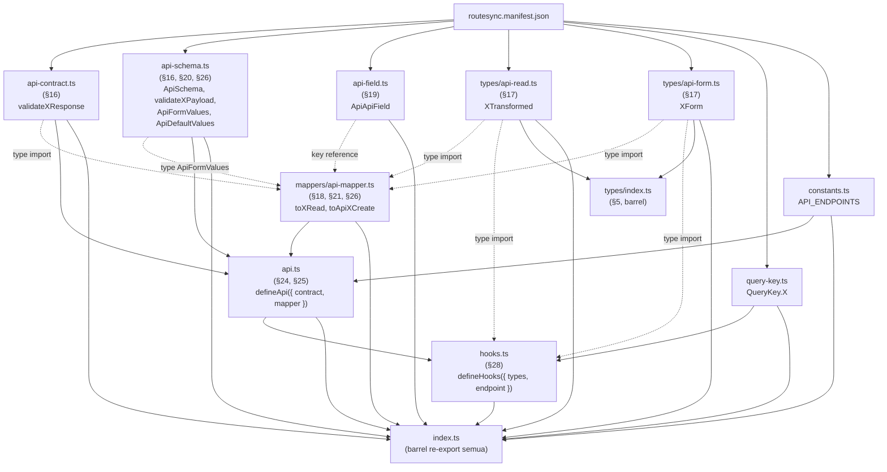

# RouteSync — Deep Architecture Review: Frontend Generator Pipeline

> Semua temuan berdasarkan pembacaan langsung source code (`packages/cli/src/generators/*.ts`), bukan asumsi dari nama file.

---

## 0. Jawaban Cepat: Siapa yang Generate Apa

Enam file yang dipertanyakan — `api-contract.ts`, `api-schema.ts`, `api-field.ts`, `api-read.ts`, `api-form.ts`, `api-mapper.ts` — semuanya ditulis oleh **satu class yang sama**: `ZodTierGenerator.ts` (1890 baris, 83KB — file generator terbesar di seluruh repo, ~4x lebih besar dari generator kedua terbesar, `HookGenerator.ts` 20KB).

```
ZodTierGenerator.ts
  ├─ generate()          → orchestrator, dipanggil dari sync.ts
  ├─ generateContract()  → contract/api-contract.ts   (baris 112-420)
  ├─ generateSchema()    → contract/api-schema.ts      (baris 666-765)
  ├─ generateField()     → contract/api-field.ts       (baris 770-813)
  ├─ generateRead()      → types/api-read.ts           (baris 867-1071)
  ├─ generateForm()      → types/api-form.ts           (baris 1080-1127)
  └─ generateMapper()    → mappers/api-mapper.ts       (baris 1180-1525)
```

Sisanya (generator independen, file terpisah):

| Output | Generator |
|---|---|
| `hooks.ts` | `HookGenerator.ts` (20KB) |
| `api.ts` | `SDKGenerator.ts` (10KB) |
| `query-key.ts` | `QueryKeyGenerator.ts` (4KB) |
| `constants.ts` | `ConstantsGenerator.ts` (9KB) |
| `types/index.ts` | `TypeGenerator.ts` (type declaration murni, tanpa runtime schema) |

**Jadi bukan cuma "coupling antar layer"** — enam dari sepuluh output file lahir dari satu class 1890 baris. Ini **God Object** klasik: satu unit compile-time state (`knownSchemas`, `graph`, `routeResponseMap`) di-share implisit lintas enam tanggung jawab berbeda (contract/schema/field/read/form/mapper) lewat method call chaining di dalam satu class statis — bukan lewat IR eksplisit dan immutable antar tahap.

### Soal PHP Script

Ya, ada, dan **wajib** untuk flag `--models`:

- `LaravelRouteParser.ts` membangun string PHP (`phpScript`, mulai baris 103) sebagai template literal berisi kode Laravel bootstrap penuh, ditulis ke `routesync-dump.php` di root project Laravel, lalu dieksekusi via `spawnSync` (child process, bukan `execSync` — sengaja diganti agar bisa capture stdout+stderr terpisah).
- Script ini butuh `vendor/autoload.php` (bootstrap Laravel penuh) — **bukan** static analysis PHP murni. Terbukti langsung saat re-run di sandbox: gagal total karena tidak ada `vendor/`, dan `composer install` tidak bisa dijalankan karena `packagist.org` di luar network whitelist sandbox.

**Implikasi:** boundary antara "PHP Scanner" dan "Frontend Generator" **bukan** clean static-analysis-only seperti judul section "PHP Scanner Review" mengasumsikan — ini reflection-based scanning yang mensyaratkan aplikasi Laravel bisa di-boot (autoload + kemungkinan koneksi DB kalau `--models` aktif, karena `ManifestGenerator`/`extractModels` butuh introspeksi kolom tabel).

---

## 1. Ringkasan Arsitektur Saat Ini

Pipeline nyata (bukan yang diasumsikan dokumen awal):

```
routesync.manifest.json
        │
        ▼
normalizeManifest()  (normalizer.ts + passes.ts, CompilerPipeline 4-pass)
        │
        ▼
   ┌────┴─────────────────────────────────────────────────────┐
   │                                                            │
   ▼                                                            ▼
ZodTierGenerator.generate()                      TypeGenerator / HookGenerator /
   │  (1 class, 1890 baris, 83KB)                 SDKGenerator / QueryKeyGenerator /
   │                                               ConstantsGenerator / IndexGenerator
   ├─ generateContract() → contract/api-contract.ts
   ├─ generateSchema()   → contract/api-schema.ts
   ├─ generateField()    → contract/api-field.ts
   ├─ generateRead()     → types/api-read.ts
   ├─ generateForm()     → types/api-form.ts
   └─ generateMapper()   → mappers/api-mapper.ts
```

**Temuan #1 (paling penting):** dokumen awal membingkai 6 file itu (contract/schema/field/read/form/mapper) seolah 6 layer arsitektur berbeda. Kenyataannya, keenamnya adalah **6 method dari 1 class yang sama** — `ZodTierGenerator`. Tidak ada isolasi module, tidak ada boundary compile-time antar "layer" — semuanya numpang di `private static knownSchemas`, `private static graph` (sekarang dead field, sudah di-fix), dan sebuah `Map<string, RouteResponseComposition>` yang di-pass manual dari `generateContract()` ke `generateRead()`/`generateMapper()` sebagai parameter biasa.

---

## 2. Dependency Graph (Real, dari Import Statement)

```
@routesync/core (RouteManifest, ContractGraph, SemanticResolutionKernel)
        │
        ▼
   normalizer.ts ── pipeline.ts (CompilerPipeline: ModelGraphBuilderPass →
        │            SemanticResolutionPass → NormalizationPass → ValidationPass)
        ▼
   ZodTierGenerator.ts ──┬── names.ts (toTypeName, camelCase, buildGeneratedRoutes)
        │                └── route-classifier.ts (deriveGroupName)
        │
        ├──▶ contract/api-contract.ts
        ├──▶ contract/api-schema.ts
        ├──▶ contract/api-field.ts
        ├──▶ types/api-read.ts
        ├──▶ types/api-form.ts
        └──▶ mappers/api-mapper.ts

   TypeGenerator.ts     ──▶ types/index.ts, api-read.ts (barrel re-export saja, TANPA baca ZodTierGenerator)
   HookGenerator.ts     ──▶ hooks.ts     (independen, re-derive naming sendiri lewat route-classifier.ts)
   SDKGenerator.ts      ──▶ api.ts       (independen, re-derive naming sendiri via getResponseInfo() lokal)
        │                                 └── import { ConstantsGenerator } (satu-satunya cross-generator import nyata di repo)
   QueryKeyGenerator.ts ──▶ query-key.ts (independen)
   ConstantsGenerator.ts──▶ constants.ts (independen)
   IndexGenerator.ts    ──▶ index.ts     (barrel re-export semua file di atas)
```

**Yang janggal:** `SDKGenerator.ts` dan `HookGenerator.ts` tidak pernah mengimpor apa pun dari `ZodTierGenerator.ts` — padahal `api.ts` (dibuat SDKGenerator) harus tahu nama exact `validate${KeyName}Response` yang dideklarasikan oleh `ZodTierGenerator.generateContract()`, dan `hooks.ts` harus tahu nama mapper yang dideklarasikan oleh `ZodTierGenerator.generateMapper()`.

Tidak ada shared IR atau lookup table di antara mereka. Yang ada: setiap generator menebak ulang nama itu sendiri, secara independen, dari input mentah yang sama (`route.response`). Ini bukan dependency graph yang sehat — ini **implicit contract by convention**, tidak dijamin compiler.

---

## 3. Redundancy Review — Bukti Konkret

| Logic yang diduplikasi | Lokasi | Jumlah kemunculan |
|---|---|---|
| CRUD action map `{post:'Create', put:'Update', patch:'Update', delete:'Delete'}` | `ZodTierGenerator.ts` (4x: `CONTRACT_ACTION_MAP`, `SCHEMA_ACTION_MAP` x2, `MAPPER_ACTION_MAP`) + `SDKGenerator.ts` (1x: `SDK_ACTION_MAP`) + `HookGenerator.ts` (1x: `ACTION_TO_CRUD_HOOK`) | **6 tempat**, 6 nama variabel beda, isi identik |
| `TitleCaseResource = toTypeName(...)`, `KeyName = TitleCaseResource + rawAction` | Tersebar di `generateContract`, `generateSchema` (2x), `generateForm`, `generateMapper` (4x) | ~9 kali di dalam satu file yang sama |
| "Apakah response ini model/resource, ambil nama base-nya" (`resolvedKind = meta.kind \|\| meta.type`) | `ZodTierGenerator.generateContract()` (versi `isResourceAlias`/`resourceRef`) + `ZodTierGenerator.generateMapper()` (versi `baseModel`/`kind`) + `SDKGenerator.getResponseInfo()` (versi ketiga) + `HookGenerator.ts` (2 versi berbeda di file yang sama: `resolveBaseResponseName()` baris 15-40, `resolveResponseInfo()` baris 68+) | **6 implementasi independen**, di 3 file berbeda, 2 di antaranya di file yang sama |

**Root cause dari yang terakhir (paling parah):** keputusan "route ini alias ke Resource yang sudah ada, atau butuh nama fallback baru" dihitung ulang dari nol di setiap generator, bukan dibaca dari satu sumber kebenaran. `ZodTierGenerator.generateContract()` sebenarnya **sudah** menghitung ini dengan benar dan menyimpannya di `routeResponseMap` (`RouteResponseComposition` — persis IR yang dibutuhkan!) — tapi struktur ini private ke `ZodTierGenerator`, tidak pernah diekspor, tidak pernah dibaca `SDKGenerator`/`HookGenerator`. Mereka menebak ulang dengan heuristik sendiri-sendiri.

**Dampak nyata:** kalau naming/aliasing logic di `ZodTierGenerator` berubah, `SDKGenerator.getResponseInfo()` dan 2 versi di `HookGenerator.ts` tidak akan otomatis ikut berubah — harus di-update manual, 4-5 tempat, tanpa ada compiler check yang memaksa konsistensi. Ini persis kelas bug yang sudah diperbaiki (`OrdersGetResponseSchema = OrderResourceSchema`), hanya saja polanya sekarang terverifikasi ada di 3 file, bukan 1.

### Duplikasi tambahan: `camelCase()` pada kolom

`generateRead()` (baris 867+) independen memanggil `camelCase(col.name)` per model column untuk bikin property TypeScript di `${Model}Transformed`. Transformasi ini sama persis dengan yang sudah dihitung `generateField()` dan disimpan di `fieldMap` — tapi `generateRead()` tidak pernah membaca `ApiField` yang dihasilkan `generateField()`; dia hitung ulang `camelCase()` dari nol. **Total pemanggilan `camelCase()` mentah di seluruh file: 22 kali.**

### Duplicate traversal manifest

Full-manifest traversal `for route of routes` yang menghitung count per-resource diulang **2x identik**: `contractResponseCount` (`generateContract`, baris 294-298) dan `mapperAllRespCount` (`generateMapper`, baris 1206-1213) — kondisi IF, key derivation, dan increment logic-nya sama persis. Ini bukti konkret duplicate traversal — harus jadi 1 IR yang dihitung sekali, bukan 2x.

### `buildResponseZodType()` dipanggil dari 2 method berbeda

`buildResponseZodType()` (baris 512) dipanggil dari: `generateContract()` (baris 335, sekali per route), 2x rekursif dari dirinya sendiri untuk nested field (baris 534, 540), plus 1x lagi dari `generateSchema()` konteks resource (baris 276) dan accessor (baris 144) — total dipanggil di **2 method berbeda** (`generateContract` + `generateSchema`), bukan cuma sekali.

---

## 4. Responsibility Matrix

| Generator | Input | Output | Baca dari generator lain? | Masalah SRP |
|---|---|---|---|---|
| `ZodTierGenerator` | `RouteManifest` | 6 file (contract/schema/field/read/form/mapper) | Tidak (self-contained) | **Parah** — 6 tanggung jawab dalam 1 class 1890 baris |
| `TypeGenerator` | `RouteManifest` (diabaikan, param `_manifest`) | `types/index.ts` | Tidak | Kecil — cuma type declaration, tapi nama filenya overlap dengan output ZodTierGenerator (`api-read`/`api-form`), misleading |
| `HookGenerator` | `RouteManifest` | `hooks.ts` | Tidak, tapi re-derive logic yang seharusnya milik ZodTierGenerator | Duplikasi resolusi resource/model 2x di file sendiri |
| `SDKGenerator` | `RouteManifest` + options | `api.ts` | `ConstantsGenerator` (satu-satunya cross-import valid) | Re-implementasi `getResponseInfo()` independen dari ZodTierGenerator |
| `QueryKeyGenerator` | `RouteManifest` | `query-key.ts` | Tidak | OK, scope sempit |
| `ConstantsGenerator` | `RouteManifest` | `constants.ts` | — (di-import balik oleh SDKGenerator) | 2 algoritma route-key berbeda di file sama |
| `IndexGenerator` | `RouteManifest` + options | barrel `index.ts` | Tahu nama semua file di atas (hardcoded) | Kecil, tapi fragile kalau ada file baru |

---

## 5. Kelemahan Berdasarkan Prioritas

- **[KRITIS]** `ZodTierGenerator` God Object — 1890 baris, 6 tanggung jawab, ~9x duplikasi naming derivation internal.
- **[KRITIS]** Resource-alias/naming decision tidak punya single source of truth — dihitung ulang independen di ≥3 file, 6 tempat. `RouteResponseComposition`/`routeResponseMap` yang sudah ada seharusnya jadi IR bersama, bukan private state.
- **[TINGGI]** `CONTRACT_ACTION_MAP` / `SCHEMA_ACTION_MAP` / `MAPPER_ACTION_MAP` / `SDK_ACTION_MAP` / `ACTION_TO_CRUD_HOOK` — 6 literal identik, harus disatukan jadi 1 konstanta di `names.ts`.
- **[SEDANG]** `api-field.ts` bukan bagian dari Schema layer sama sekali. Isinya cuma lookup table `camelCase → snake_case`:

  ```ts
  export const ApiApiField = {
    USER_NAME: "user_name",
    ...
  } as const
  ```

  Sumbernya dua: (1) key validasi dari `route.schema.rules`, (2) nama kolom model. Sebelumnya ditandai *orphan output* karena `generateRead()` tidak pernah membaca hasil `generateField()` secara langsung (malah hitung ulang `camelCase()` sendiri, §3) — **namun ini keliru soal "tidak ada consumer sama sekali"**: `ApiApiField` ternyata dipakai sebagai static const key reference untuk transformasi pengisian form di frontend (lihat koreksi lengkap di §19). Masalah yang tersisa bukan orphan, tapi *dua sumber kebenaran terpisah* untuk mapping nama field yang sama.
- **[SEDANG]** ~~`TypeGenerator.ts` menulis ke `api-read.ts`/`api-form.ts`~~ — **REVISI: false alarm.** Sudah dibaca isi filenya utuh (cuma 50 baris): `TypeGenerator.ts` tidak pernah menulis ke `api-read.ts`/`api-form.ts`, hanya menulis `types/index.ts` berisi 3 interface hardcoded murni (`ApiResponse<T>`, `PaginationMeta`, `PaginatedResponse<T>`, `ApiError`) plus 2 baris barrel re-export (`export * from './api-read'`, `export * from './api-form'`). Grep sebelumnya salah match string di dalam path re-export, bukan di `writeFile()`. Tidak ada race/overwrite.
- **[RENDAH]** PHP Scanner butuh Laravel bootstrap penuh (`vendor/autoload.php`), bukan static analysis murni — legitimate constraint (reflection butuh class yang bisa di-load), tapi berarti "PHP Scanner" sebagai boundary compiler tidak bisa dijalankan tanpa environment Laravel yang utuh.

---

## 6. Compilation vs Rendering — Temuan Paling Penting

**Jawaban langsung:** `generateRead()` **masih melakukan inferensi**, bukan cuma render. Buktinya, ada dua sistem tipe paralel yang identik strukturnya, ditulis dua kali:

```ts
// Baris 835-864 — dipakai generateContract() untuk Zod
private static mapSqlTypeToZod(sqlType: string): string {
  if (type.includes('bool')...) return 'z.boolean()'
  if (type.includes('int')...) return 'z.number()'
  if (type.includes('json')) return 'z.record(z.string(), z.unknown())'
  ...
}
private static mapCastToZod(castType, defaultType) { ... }

// Baris 1148-1180 — dipakai generateRead() untuk TS type, KONDISI SAMA PERSIS
private static mapSqlTypeToTs(sqlType: string): string {
  if (type.includes('bool')...) return 'boolean'
  if (type.includes('int')...) return 'number'
  if (type.includes('json')) return 'Record<string, unknown>'
  ...
}
private static mapCastToTs(castType, defaultType) { ... }
```

Plus `mapResolvedToTsType()` (baris 1633+) yang mem-paralel `buildResponseZodType()` (baris 512+) — keduanya menerima meta/accessor mentah dari manifest dan melakukan resolusi tipe dari nol, bukan membaca satu "canonical resolved type" yang sudah jadi.

**Konfirmasi 100%:** dua sistem tipe paralel ini identik strukturnya, cuma beda output syntax.

**Kesimpulan:** boundary generator ini salah. Inferensi (kolom SQL → tipe apa, cast Laravel → tipe apa, field nullable atau tidak) seharusnya selesai **sekali** di compiler pass (`normalizer.ts`/`pipeline.ts`), menghasilkan satu representasi tipe kanonik (misal `{ kind: 'number', nullable: true }`), lalu kedua emitter (`generateContract` dan `generateRead`) tinggal me-render representasi itu ke syntax masing-masing (`z.number().nullable()` vs `number | null`).

Sekarang, dua inferensi independen ini bisa diam-diam divergen — kalau ada SQL type baru yang di-handle di `mapSqlTypeToZod` tapi lupa ditambah ke `mapSqlTypeToTs`, Zod schema dan TS type akan berbeda untuk field yang sama, dan TypeScript **tidak akan pernah mendeteksinya** karena keduanya independent string-builder, bukan derivasi dari 1 sumber type-checked.

---

## 7. Generator Dependency Graph Berbasis IR (Bukan File→File)

Kenyataan di kode (bukan yang seharusnya): cuma ada 1 IR nyata, dan cuma dipakai internal.

```
RouteManifest (mentah)
        │
        ▼
   generateContract()  ◄── baca knownSchemas (implicit global state, lihat §8)
        │
        ▼
   routeResponseMap: Map<string, RouteResponseComposition>   ← SATU-SATUNYA IR YANG ADA
        │
        ├──────────────┐
        ▼              ▼
   generateRead()   generateMapper()
   (dapat routeResponseMap SEBAGAI PARAMETER — pola benar)
        │
        ▼
   (BERHENTI DI SINI — routeResponseMap TIDAK PERNAH keluar dari ZodTierGenerator)

   SDKGenerator / HookGenerator  ◄── baca RouteManifest MENTAH lagi, re-infer sendiri
                                      (tidak pernah terima routeResponseMap)
```

Jadi grafik IR yang sebenarnya cuma setengah jalan: `ContractIR` (`routeResponseMap`) diteruskan dengan benar ke `ReadModelIR`/`MapperIR` konsumen di dalam kelas yang sama — tapi berhenti di situ, tidak pernah mengalir ke `SDKGenerator`/`HookGenerator`. Bukan "tidak ada IR sama sekali" — IR-nya **ada** tapi terpagar tembok di 1 class, bukan compiler-wide.

> **Revisi (lihat §23.2):** penyebutan `routeResponseMap` sebagai "IR" di atas perlu dikoreksi turun derajat — isinya cuma metadata klasifikasi (resource/collection/wrapped/paginated), bukan hasil resolusi final (payload/schema/mapper/read/contract yang sudah jadi). Lebih tepat disebut cache metadata daripada IR compiler sesungguhnya.

---

## 8. Implicit State Audit

| State | Scope | Diisi oleh | Dibaca oleh | Bisa jadi immutable IR? | Temporal coupling? |
|---|---|---|---|---|---|
| `knownSchemas: Set<string>` | `private static` di class (bertahan lintas pemanggilan kalau class di-reuse) | `generate()` baris 56-62, `.clear()` dulu baru diisi ulang | `generateContract()` (7 titik: baris 155,159,571,575,579,629,636) | Ya — harusnya jadi field di IR (`knownSchemaNames: string[]`), bukan static mutable | **Ya, nyata.** Kalau `generateContract()` dipanggil langsung tanpa lewat `generate()` dulu (mis. dari test), `knownSchemas` bisa berisi sisa run manifest sebelumnya kalau `.clear()` lupa dipanggil — silent wrong output, bukan crash |
| `routeResponseMap: Map<string, RouteResponseComposition>` | Lokal ke `generate()`, dibuat di `generateContract()`, di-pass eksplisit sebagai parameter | `generateContract()` | `generateRead()`, `generateMapper()` (parameter, bukan global — **pola benar**) | Sudah — ini persis IR yang dibutuhkan, cuma scope-nya kurang luas (§7) | Tidak — passing eksplisit, aman |
| `contractResponseCount` vs `mapperAllRespCount`/`mapperGetOnlyCount` | Lokal per-function, **tapi isinya dihitung ulang dari nol**, traversal manifest yang sama | Masing-masing function, independen | Masing-masing function sendiri | Ya, harus disatukan — bukti langsung duplicate traversal (§3) | Tidak temporal-coupled (self-contained), tapi redundant computation |
| `generatedRespSchemas: Set<string>` | Muncul 3x dengan nama sama, scope beda: `generateContract()` baris 307 (dedup nama response schema), `generateSchema()` baris 681 (dedup nama payload — tujuan **beda**, kebetulan nama sama), `generateMapper()` (punya `generatedMapperFns`, fungsi serupa nama beda) | Masing-masing function | Masing-masing function sendiri | Sebagian — yang di `generateContract` seharusnya jadi bagian `RouteResponseComposition` | Tidak, tapi confusing karena nama identik untuk tujuan berbeda |

**Kesimpulan:** `knownSchemas` adalah satu-satunya state yang benar-benar berbahaya (class-level static, bukan cuma per-run local) — ini akar structural dari kenapa `ZodTierGenerator` terasa seperti God Object: dia bukan cuma kumpulan method, dia punya shared mutable field yang harus di-reset manual di awal tiap run.

---

## 9. Canonical vs Derived vs Cache vs Projection

```
ResourceSchema + ResourceResponse (Zod + type)         ← DERIVED (1x, benar)
   ↓
Response (per-route, alias ATAU fallback)              ← DERIVED, tapi diputuskan 6x independen (§3)
   ↓
Read Model (${Model}Transformed, camelCase)             ← DERIVED, tapi INFERENSI TIPE-nya ULANG DARI NOL (§6)
   ↓
Form Model                                              ← DERIVED (projection dari schema payload)
   ↓
Mapper (fungsi transform runtime)                       ← DERIVED, tapi baca `routeResponseMap` (BENAR, tidak infer ulang)
```

- `knownSchemas` bukan canonical maupun derived — dia **cache** (nama schema yang sudah "dijanjikan" ada), tapi cache ini di-scope salah (class-static, bukan per-run).
- `api-field.ts` (`ApiField` lookup table) — **derived** (bukan orphan/dead, lihat koreksi §19): satu-satunya proyeksi yang bersifat global lintas manifest (bukan per-resource), dipakai sebagai key reference statis untuk transformasi form di frontend.

---

## 10. Manifest Audit — Apa yang Kurang

Berdasarkan `ResponseMetadata`/`ParsedRoute` yang sudah diperiksa (`route.ts`):

| Metadata | Sudah ada di manifest? | Catatan |
|---|---|---|
| Canonical resource id | **Tidak** — resource cuma diidentifikasi by-name (`meta.resource: string`), bukan ID stabil. Kalau nama Resource di-rename di Laravel, seluruh downstream naming ikut berubah, tidak ada level of indirection. | |
| Collection metadata | Ada (`collection?: boolean`) | Tapi dihitung ulang beberapa kali secara independen di masing-masing generator (bukan disimpan sebagai keputusan final) |
| Pagination metadata | Ada (`paginated?: boolean`) | Sama — ada tapi bukan hasil keputusan final tunggal |
| Wrapper metadata | Ada (`wrapped?: boolean` — baru ditambahkan sesi fix kemarin) | Sebelumnya GAP di type declaration walau dipakai runtime |
| Mapper metadata | **Tidak ada** di manifest | Sepenuhnya diturunkan ulang di `generateMapper()`/`HookGenerator`/`SDKGenerator` masing-masing |
| Read model metadata | **Tidak ada** | camelCase transform + tipe TS dihitung ulang di `generateRead()` dari raw SQL type, bukan dibaca dari hasil normalisasi |
| Normalization result | Sebagian | `normalizer.ts` MENGHASILKAN `NormalizedManifest`, tapi `ZodTierGenerator.generate()` menerima `RouteManifest` mentah, bukan `NormalizedManifest` (perlu diverifikasi ulang di `sync.ts` — kalau benar, hasil `normalize()` tidak pernah benar-benar dipakai generator) |

**Poin paling penting:** manifest sekarang cukup kaya untuk menyimpan **fakta** (`wrapped`, `collection`, `paginated`) tapi tidak menyimpan **keputusan** (resource-alias-atau-fallback, apa nama TS type-nya, apakah field ini butuh transform). Fakta vs keputusan itu beda — generator masih harus mengubah fakta jadi keputusan sendiri-sendiri, 6 kali.

---

## 11. PHP Scanner vs Frontend Generator — Tabel Per-Tahap

| Tahap | PHP Scanner | Frontend Generator | Catatan |
|---|---|---|---|
| Parse route Laravel (`Route::get(...)`) | ✅ | ❌ | Butuh reflection, sudah benar |
| Resolve Resource (`new OrderResource($x)` → nama resource) | ✅ | ❌ | Sudah benar, ini `LaravelRouteParser.ts` |
| Infer response shape dasar (model/resource/object/collection/paginated/wrapped) | ✅ | ❌ | Sudah benar — fakta-fakta ini genuinely butuh reflection |
| Keputusan: route ini alias ke Resource yang mana, atau butuh nama fallback apa | ❌ | ❌ *(seharusnya ada di sini, sebagai pass tersendiri)* | **Ini yang hilang** — bukan tugas PHP (tidak butuh reflection), tapi juga jangan diserahkan ke tiap generator |
| Resolve tipe TS/Zod dari SQL column type + cast | ❌ | ❌ *(dobel, di 2 tempat berbeda, §6)* | Harusnya 1x di compiler pass, bukan di generator |
| Normalize manifest jadi IR final | ✅ (`normalizer.ts` ada) | — | Tapi hasilnya belum tentu dikonsumsi `ZodTierGenerator` (perlu verifikasi `sync.ts`) |
| Generate TS/Zod syntax (render) | ❌ | ✅ | Ini satu-satunya yang seharusnya ada di Frontend Generator |
| Emit hooks/query-key/constants | ❌ | ✅ | Benar |

---

## 12. Scalability Review (500 model / 2000 route / 10rb type)

**Dasar analisis:** `ContractGraph.ts` (dipakai untuk build dependency graph resource↔model) murni single-pass per collection (`for model of manifest.models`, `for res of manifest.resources`, `for route of manifest.routes` — tidak nested O(n²)), dan `knownSchemas` pakai `Set<string>` (O(1) lookup, bukan array `.includes()`). Secara algoritmik per-generator, ini **linear**, bukan quadratic — kabar baik.

Tapi implikasi dari temuan §1-§11 di scalability bukan soal Big-O, melainkan **constant-factor multiplier** dan **maintenance cost**:

1. Setiap route diproses independen oleh 6 generator berbeda (ZodTierGenerator x6 method, HookGenerator, SDKGenerator, dst), dan ≥6 dari mereka menghitung ulang string derivation yang sama (`toTypeName`, `camelCase`, ACTION_MAP lookup) tanpa cache/memoization lintas generator. Di 2000 route, ini bukan bottleneck performa compile time (string ops itu murah), tapi bottleneck **korektnes**: 2000 route × 6 tempat re-derivation = permukaan yang jauh lebih besar untuk 6 implementasi itu diam-diam divergen (persis root cause bug alias schema yang sudah pernah diperbaiki).
2. **Incremental compilation tidak mungkin** dengan arsitektur sekarang: `ZodTierGenerator.generate()` selalu regenerasi 6 file penuh dari nol (`this.knownSchemas.clear()` di awal `generate()`, baris 56) — tidak ada per-route/per-resource diffing. Di 500 model + 2000 route, tiap perubahan satu route men-trigger full regenerate 6 file (+ 4 file generator lain = total 10 file penuh ditulis ulang). Tidak ada mekanisme cache berbasis `stableHash` (yang sebenarnya sudah ada di `ParsedRoute.stableHash` — tapi dari investigasi ini tampaknya tidak dipakai untuk skip regenerasi, perlu verifikasi lanjut).
3. **Memory:** `knownSchemas` (Set of string) dan `routeResponseMap` (Map) proporsional linear ke jumlah model+resource+route — tidak ada yang O(n²) di memory juga, aman untuk 10rb type.

**Kesimpulan scalability:** arsitektur ini akan tetap compile dengan benar di skala 500 model/2000 route (tidak ada infinite loop atau quadratic blowup yang ditemukan), tapi compile time akan linear-scale dengan konstanta besar karena kerja yang sama (naming derivation) dilakukan berkali-kali lipat per route tanpa sharing hasil, dan zero incremental compilation berarti setiap `routesync sync` di project besar selalu full-rebuild. Ini yang paling perlu diperhatikan kalau target project beneran punya skala segitu — bukan risiko crash/OOM.

---

## 13. Tabel Ringkasan Per-Generator

| Generator | Input | Output | Hidden State | Masalah | Harus Dipindah Ke |
|---|---|---|---|---|---|
| `generateContract` | RouteManifest mentah | `api-contract.ts` | `knownSchemas` (class-static!), `contractResponseCount`, `generatedRespSchemas` | Inference (resource-alias decision + SQL→Zod type) bercampur dengan emit | Scanner (fakta) + IR pass baru (keputusan alias) |
| `generateSchema` | RouteManifest | `api-schema.ts` — schema untuk react-hook-form + resolver (`zodResolver`), bukan payload/response contract | `SCHEMA_ACTION_MAP`, `generatedRespSchemas` (beda tujuan, nama sama) | Duplicate `buildResponseZodType()` call, duplicate ACTION_MAP | IR (payload shape sudah harus final dari normalizer) |
| `generateField` | RouteManifest | `api-field.ts` | `fieldMap` lokal | Bukan orphan (revisi §19) — dipakai sebagai key reference form frontend, tapi jadi sumber kebenaran kedua yang terpisah dari `camelCase()` di `generateRead()` | Pertahankan sebagai file terpisah, tapi satukan sumber mapping-nya dengan `generateRead()` |
| `generateRead` | RouteManifest, `routeResponseMap` | `api-read.ts` | — (terima IR dengan benar) tapi re-infer tipe dari SQL raw (`mapSqlTypeToTs`) | Duplicate type-inference system paralel ke Zod (§6, temuan terbesar) | IR — satu resolved-type representation, dua renderer |
| `generateForm` | RouteManifest | `api-form.ts` | — | Belum diverifikasi detail | — |
| `generateMapper` | RouteManifest, `routeResponseMap` | `api-mapper.ts` | `mapperAllRespCount`/`mapperGetOnlyCount` (duplicate traversal dari `contractResponseCount`), `generatedMapperFns` | Duplicate traversal manifest (§3) | IR |
| `HookGenerator` | RouteManifest mentah | `hooks.ts` | 2 fungsi resolusi independen (`resolveBaseResponseName`, `resolveResponseInfo`) | Re-infer resource/model dari nol, tidak terima `routeResponseMap` | IR (baca `RouteResponseComposition`, bukan raw manifest) |
| `SDKGenerator` | RouteManifest mentah | `api.ts` | `getResponseInfo()` — reimplementasi ketiga | Sama seperti HookGenerator | IR |
| `QueryKeyGenerator` | RouteManifest via `route-classifier.ts` | `query-key.ts` | — | Tidak ada — pola benar | Tetap |
| `ConstantsGenerator` | RouteManifest mentah | `constants.ts` | 2 algoritma route-key berbeda di file sama | Duplikasi internal + side-effect cleanup nyasar | Satukan di file sendiri, tidak perlu pindah layer |

---

## 14. Arsitektur Target (Revisi — IR Eksplisit sebagai Pemisah Compilation/Rendering)

```
Laravel
   ↓
PHP Scanner   (fakta: route, resource-link, wrapped, collection, paginated — SUDAH BENAR)
   ↓
Normalized Manifest   (normalizer.ts — SUDAH ADA, tapi perlu diverifikasi benar-benar dikonsumsi)
   ↓
Compiler IR   ← LAPISAN YANG HILANG. Berisi:
   - ResponseResolution (alias-atau-fallback, SATU KALI, ganti 6 implementasi)
   - ResolvedType (SATU representasi kanonik: {kind, nullable, enum values, dst},
                   BUKAN dua sistem inferensi paralel Zod-vs-TS)
   - dihitung SEKALI, immutable, di-pass sebagai parameter ke semua emitter
   ↓
Emitter (RENDER ONLY — tidak ada if/else inferensi tipe, cuma baca IR dan tulis syntax)
   ↓
api-contract.ts, api-schema.ts, api-read.ts, api-form.ts, api-mapper.ts,
hooks.ts, api.ts, query-key.ts, constants.ts
```

**Kesimpulan akhir:** kelemahan terbesar bukan di generatornya satu-satu, tapi memang **tidak ada IR eksplisit antara manifest dan emitter**. `routeResponseMap` sudah membuktikan pola ini *bisa* jalan (dan memang jalan dengan benar, di dalam `ZodTierGenerator`) — masalahnya cuma scope-nya kurang luas (tidak sampai ke `SDKGenerator`/`HookGenerator`) dan tidak mencakup type-resolution (§6), cuma response-composition.

---

## 15. Rekomendasi Refactor (Konkret)

1. **Ekstrak `RouteResponseComposition`/naming resolution** jadi modul bersama (`packages/cli/src/generators/response-resolution.ts`), diekspor dan diimpor oleh `ZodTierGenerator`, `SDKGenerator`, `HookGenerator`. Hilangkan 6 reimplementasi independen.
2. **Satukan 6 `*_ACTION_MAP`** jadi 1 export di `names.ts`: `export const CRUD_ACTION_MAP = {...}`.
3. **Pisahkan `ZodTierGenerator`** jadi 6 class/module terpisah yang masing-masing consume `RouteResponseComposition[]` yang sudah dihitung sekali di awal pipeline (bukan tiap generator hitung ulang) — ini juga yang bikin future refactor "Zod → Valibot" jadi mungkin, karena decision layer (apa yang alias ke apa) terpisah dari emission layer (bagaimana menulis syntax Zod).
4. **Pertimbangkan urutan generate eksplisit** di `sync.ts`: `ZodTierGenerator` generate dulu dan return `routeResponseMap`, baru `SDKGenerator`/`HookGenerator` menerima itu sebagai parameter — bukan `RouteManifest` mentah.
5. **Turunkan `api-form.ts` dari `api-schema.ts`, bukan generate independen** (lihat §20) — `ApiFormValues` di `api-schema.ts` sudah membuktikan pola `z.infer<typeof ApiSchema.X>` bekerja untuk satu resource-action. Kalau `generateForm()` dihapus dan `api-form.ts` cukup re-export/re-derive dari `ApiFormValues`, dua generator dengan struktur nyaris identik (termasuk bug indentasi nested array yang muncul dobel di keduanya) jadi satu, dan perbaikan bug cukup di satu tempat.

---

## 16. Contoh Output Nyata — `api-contract.ts`

> **Ralat peran file (penting):** deskripsi awal dokumen ini (§0, §1, §7 dst.) membingkai `api-contract.ts` seolah cuma berisi schema **response** backend. Yang benar: `api-contract.ts` berisi **keduanya** — schema response (output backend) **dan** schema input/payload (yang dikirim ke backend). Sedangkan `api-schema.ts` **bukan** "payload shape" generik seperti asumsi tabel §13 sebelumnya — fungsinya spesifik untuk dipakai di **react-hook-form + resolver** (`zodResolver`), yaitu schema yang bentuknya memang dirancang supaya langsung plug-in ke `useForm({ resolver: zodResolver(...) })`, bukan sekadar validasi payload generik. Bagian §13 dan §14 yang menyebut "payload shape" untuk `generateSchema()`/`api-schema.ts` perlu dibaca ulang dengan pemahaman ini — akan diverifikasi lebih lanjut begitu ada contoh kode `api-schema.ts` nyata.

Contoh konkret hasil `generateContract()` dari manifest RouteSync, menunjukkan bagaimana response backend Laravel (return `new XResource(...)`) di-generate jadi Zod schema di sisi frontend.

**Response sederhana (message-only, tanpa Resource)** — contoh route Laravel yang cuma `return response()->json(['success' => ..., 'message' => ..., 'data' => ...])`:

```typescript
export const RegisterResponseSchema = z.object({
  success: z.boolean(),
  message: z.string(),
  data: z.unknown().nullable(),
})
```

**Response dari Laravel Resource** — hasil `return new PaymentResource($payment)`, termasuk nested relation (`items`) dan nested object literal (`promotion`, `gateway`) yang diturunkan dari struktur `toArray()` di Resource:

```typescript
export const PaymentResourceSchema = z.object({
  id: z.number(),
  order_id: z.number(),
  invoice_number: z.string().nullable(),
  metode: z.string().nullable(),
  detail: z.string().nullable(),
  status: z.string(),
  paid_at: z.string().nullable(),
  provider: z.string().nullable(),
  provider_txn_id: z.string(),
  gateway_status: z.string(),
  amount_minor: z.number(),
  refund_amount_minor: z.number(),
  items: z.array(OrderDetailResourceSchema),
  promotion: z.object({ code: z.string().nullable(), discount_minor: z.number() }),
  gateway: z.object({ name: z.string(), order_id: z.number(), token: z.string(), redirect_url: z.string() }),
  total_harga: z.number(),
})
```

**Response collection (list endpoint)** — wrapper `data: [...]` di atas resource yang sudah ada (`CategorySchema`), plus type inference dan validator function yang di-generate otomatis lewat `generateSchema()`/`generateContract()`:

```typescript
export const CategoriesResponseSchema = z.object({ data: z.array(CategorySchema) })
export type CategoriesResponse = z.infer<typeof CategoriesResponseSchema>
export const validateCategoriesResponse = (payload: unknown): CategoriesResponse => CategoriesResponseSchema.parse(payload)
```

Ketiga contoh ini menunjukkan tiga jalur `generateContract()` yang berbeda: (1) response ad-hoc tanpa Resource class, (2) response alias langsung ke satu Resource dengan nested structure, dan (3) response collection yang membungkus Resource lain yang sudah pernah di-generate — inilah persis kasus yang butuh keputusan "alias atau fallback" di `routeResponseMap` (lihat §3 dan §7) supaya `CategorySchema` tidak digenerate ulang dari nol saat dipakai di dalam `CategoriesResponseSchema`.

---

## 17. Contoh Output Nyata — `api-read.ts` (dan Posisi `api-form.ts`)

`api-read.ts` dan `api-form.ts` adalah **kebalikan** dari `api-contract.ts` (§16) dalam arah data:

- **`api-contract.ts`** (§16) → validasi response backend, field masih **snake_case mentah** persis seperti bentuk JSON Laravel.
- **`api-read.ts`** → *flatten* response backend itu jadi **camelCase**, termasuk nested snake_case yang diratakan/di-rename. Ini representasi data yang **keluar** dari backend, sudah ditransformasi untuk dipakai di frontend (hasil `generateRead()`, lihat §6 — dan di sinilah letak duplicate type-inference system yang jadi temuan terbesar).
- **`api-form.ts`** → arah sebaliknya: representasi data **input** yang harus dikirim balik ke backend supaya bisa disimpan (create/update). Sama-sama harus flatened camelCase di level `types/`, tapi tujuannya validasi *outbound* (form → backend), bukan *inbound* (backend → UI) seperti `api-read.ts`. Konsisten dengan alur `generateForm()` di §0/§13 yang sejauh ini belum diverifikasi detail isinya — perlu sesi lanjutan untuk audit apakah dia benar-benar independen dari duplikasi yang sama seperti `generateRead()`.

### Contoh `api-read.ts`

**Nested resource yang di-flatten** — field seperti `produk_item_id`, `produk_gambar` di backend jadi `produkItemId`, `produkGambar` camelCase, nullable union tetap dipertahankan (`(string) | null`):

```typescript
export interface OrderDetailResourceTransformed {
  id: number
  produkItemId: number
  produkId: number
  produkNama: string
  produkGambar: (string) | null
  produkImageUrl: (string) | null
  qty: number
  harga: number
  subtotal: number
}

export type OrderDetailResourceShow = OrderDetailResourceTransformed
export type OrderDetailResourceIndex = OrderDetailResourceTransformed[]
```

**Resource dengan banyak nested prefix (`shipping_*`, `promotion_*`)** — semua diratakan ke satu interface flat, nested array relation (`items`) tetap array of transformed type, bukan diratakan lebih jauh:

```typescript
export interface OrderResourceTransformed {
  id: number
  status: string
  totalHarga: number
  invoiceNumber: (string) | null
  paymentStatus: (string) | null
  financialStatus: (string) | null
  fulfillmentStatus: (string) | null
  subtotalMinor: (number) | null
  discountMinor: (number) | null
  shippingMinor: (number) | null
  taxMinor: (number) | null
  totalHargaMinor: (number) | null
  items?: OrderDetailResourceTransformed[]
  promotionCode: (string) | null
  promotionDiscountMinor: number
  shippingNama: (string) | null
  shippingTelepon: (string) | null
  shippingAlamat: (string) | null
  shippingKota: (string) | null
  shippingKodePos: (string) | null
  createdAt: string
}

export type OrderResourceShow = OrderResourceTransformed
export type OrderResourceIndex = OrderResourceTransformed[]
```

**Collection wrapper (list endpoint)** — pola `data: T[]` yang sama seperti di `api-contract.ts` (§16), tapi elemennya sudah versi Transformed/camelCase, bukan Zod schema:

```typescript
export interface CategoriesTransformed {
  data: CategoryTransformed[]
}
```

```typescript
export interface CategoryTransformed {
  id: number
  nama: string
  createdAt: string | null
  updatedAt: string | null
}
```

**Resource independen (bukan collection, bukan nested dari resource lain)**:

```typescript
export interface OrderShippingTransformed {
  id: number
  orderId: number
  nama: string | null
  telepon: string | null
  alamat: string | null
  kota: string | null
  kodePos: string | null
  createdAt: string | null
  updatedAt: string | null
}
```

### Contoh `api-form.ts`

> **Catatan:** contoh di bawah diberikan sebagai "belum stabil aslinya" — artinya output ini masih ada masalah generator yang belum di-fix, bukan target akhir yang sudah benar. Ditandai per-kasus di bawah.

Pola dasarnya: satu `type XForm` per resource, di-key per HTTP verb/action (`Create`, `Update`, `Get`) — beda dari `api-read.ts` yang cuma satu shape flat per resource. Field opsional konsisten pakai `?: T | undefined | null`.

**Form sederhana, satu action:**

```typescript
export type RegisterForm = {
  Create: {
    name: string
    email: string
    password: string
  }
}

export type LoginForm = {
  Create: {
    email: string
    password: string
  }
}

export type OauthRedirectForm = {
  Get: {
    redirectTo?: string | undefined | null
  }
}

export type SocialLoginForm = {
  Create: {
    provider: 'google' | 'facebook' | 'apple'
    providerUserId: string
    email: string
    name?: string | undefined | null
    avatarUrl?: string | undefined | null
  }
}

export type ForgotPasswordForm = {
  Create: {
    email: string
  }
}

export type ResetPasswordForm = {
  Create: {
    email: string
    token: string
    password: string
  }
}

export type ProdukReviewsForm = {
  Create: {
    rating: number
    title?: string | undefined | null
    comment?: string | undefined | null
  }
}

export type ProfileForm = {
  Update: {
    name: string
    email: string
  }
}
```

**Form dengan lebih dari satu action pada resource yang sama** (`CartItemsForm` punya `Create` dan `Update` dengan shape payload berbeda — ini kasus yang tidak muncul di `api-read.ts`, karena read model selalu satu shape per resource, sedangkan form berbeda-beda tergantung action):

```typescript
export type CartItemsForm = {
  Create: {
    produkItemId: string
    qty: number
  }

  Update: {
    qty: number
  }
}

export type CartPromoForm = {
  Create: {
    code: string
  }
}
```

**Form dengan nested array payload — di sinilah instabilitas paling kelihatan:**

```typescript
export type CheckoutForm = {
  Create: {
    items?: {
    produkItemId: string
    qty: number
  }[] | undefined
    shippingNama?: string | undefined | null
    shippingTelepon?: string | undefined | null
    shippingAlamat?: string | undefined | null
    shippingKota?: string | undefined | null
    shippingKodePos?: string | undefined | null
  }
}

export type BuyNowForm = {
  Create: {
    produkItemId: string
    qty: number
    shippingNama?: string | undefined | null
    shippingTelepon?: string | undefined | null
    shippingAlamat?: string | undefined | null
    shippingKota?: string | undefined | null
    shippingKodePos?: string | undefined | null
  }
}

export type WishlistForm = {
  Create: {
    produkItemId: string
  }
}
```

> **Bug konkret di `CheckoutForm.Create.items`:** indentasi nested object literal-nya rusak — `items?: { produkItemId: string \n qty: number }[] | undefined` di-emit dengan indentasi field dalam (`produkItemId`, `qty`) sejajar dengan field luar (`shippingNama`, dst), bukan di-indent lebih dalam dari `items?: {`. Ini bukan sekadar kosmetik: pola ini konsisten dengan temuan §6 — kalau nested type builder untuk array-of-object payload adalah code path yang berbeda dari flat object payload biasa (bukan rekursi yang sama dipakai ulang), maka ini kandidat kuat generator ketiga yang independen dari `mapSqlTypeToTs`/`buildResponseZodType`, khusus untuk sisi form. Perlu ditelusuri method mana persisnya di `generateForm()` yang menangani array payload sebelum disimpulkan root cause-nya.

**Form dengan union literal dan array of unknown:**

```typescript
export type PaymentForm = {
  Create: {
    metode: string
    detail?: unknown[] | undefined | null
    provider?: 'mock' | 'midtrans' | undefined | null
    providerTxnId?: string | undefined | null
    idempotencyKey?: string | undefined | null
    gatewayCode?: string | undefined | null
    gatewayMessage?: string | undefined | null
  }
}

export type AdminProdukForm = {
  Create: {
    nama: string
    deskripsi?: string | undefined | null
    gambar?: string | undefined | null
    categoryId: string
    harga: number
    stok: number
    rating?: number | undefined | null
    jumlahReview?: number | undefined | null
  }
}
```

### Perbandingan Cepat: `api-read.ts` vs `api-form.ts`

| Aspek | `api-read.ts` | `api-form.ts` |
|---|---|---|
| Arah data | Backend → UI (keluar) | UI → Backend (masuk, untuk disimpan) |
| Struktur top-level | Satu `interface XTransformed` flat per resource | Satu `type XForm` di-key per action (`Create`/`Update`/`Get`) |
| Sumber field | Kolom SQL + cast Laravel (lihat §6, `mapSqlTypeToTs`) | Validation rules (`route.schema.rules`, sama seperti sumber `api-field.ts`, lihat §5) |
| Optional encoding | `(string) \| null` untuk nullable | `?: T \| undefined \| null` untuk optional+nullable |
| Multi-shape per resource | Tidak — selalu satu shape | Ya — beda action bisa beda payload (`CartItemsForm.Create` vs `.Update`) |
| Stabilitas saat ini | Belum ditemukan bug format di sample yang diperiksa | **Belum stabil** — minimal 1 bug indentasi nested array pada `CheckoutForm`, perlu investigasi apakah nested-array code path independen dari nested-object biasa |

---

## 18. Contoh Output Nyata — `mappers/api-mapper.ts`

Output `generateMapper()` (§0, §13) — fungsi transformasi **runtime** (bukan cuma type declaration seperti `api-read.ts`) yang dipanggil di `api.ts` untuk mengubah response mentah dari backend (field snake_case, sesuai `api-contract.ts` di §16) jadi shape camelCase yang match dengan `api-read.ts` (§17). Ini komponen yang jadi jembatan aktual antara backend dan frontend: `api-contract.ts` memvalidasi bentuknya, `api-read.ts` mendeklarasikan tipe hasil akhirnya, `api-mapper.ts` yang benar-benar mengeksekusi transformasinya saat runtime.

### Pola dasar: fungsi `show` (single) + fungsi `index` (list)

Setiap resource selalu punya sepasang fungsi: `toXRead` untuk single record (dipakai di REST `show`) dan `toXReadList` untuk array (dipakai di REST `index`) — polanya konsisten karena Laravel Resource yang sama dipakai untuk kedua endpoint, bedanya cuma backend membungkus jadi array atau tidak. Fungsi list selalu didefinisikan sebagai `api.map(toXRead)`, tidak pernah menulis ulang mapping-nya — jadi tidak ada duplikasi logic transformasi antara `show` dan `index`, cuma reuse lewat `.map()`:

```typescript
export const toCategoryRead = (api: CategoryApiResponse): CategoryTransformed => ({
  id: api.id,
  nama: api.nama,
  createdAt: api.created_at,
  updatedAt: api.updated_at,
})

export const toCategoryReadList = (api: CategoryApiResponse[]): CategoryTransformed[] => api.map(toCategoryRead)
```

```typescript
export const toOrderRead = (api: OrderApiResponse): OrderTransformed => ({
  id: api.id,
  userId: api.user_id,
  totalHarga: api.total_harga,
  status: api.status,
  orderNumber: api.order_number,
  createdAt: api.created_at,
  updatedAt: api.updated_at,
})

export const toOrderReadList = (api: OrderApiResponse[]): OrderTransformed[] => api.map(toOrderRead)
```

### Mapper dengan nested resource + optional chaining

`PaymentResourceRead` menunjukkan mapper untuk resource yang punya nested relation array (`items`, di-map lewat mapper resource lain — `toOrderDetailResourceRead`, bukan diratakan manual) dan nested object opsional (`promotion`, `gateway`) yang di-akses pakai `?.` karena field-nya nullable di backend:

```typescript
export const toPaymentResourceRead = (api: PaymentResourceResponse): PaymentResourceTransformed => ({
  id: api.id,
  orderId: api.order_id,
  invoiceNumber: api.invoice_number,
  metode: api.metode,
  detail: api.detail,
  status: api.status,
  paidAt: api.paid_at,
  provider: api.provider,
  providerTxnId: api.provider_txn_id,
  gatewayStatus: api.gateway_status,
  amountMinor: api.amount_minor,
  refundAmountMinor: api.refund_amount_minor,
  items: api.items.map((item: OrderDetailResourceResponse) => toOrderDetailResourceRead(item)),
  promotionCode: api.promotion?.code,
  promotionDiscountMinor: api.promotion?.discount_minor,
  gatewayName: api.gateway?.name,
  gatewayOrderId: api.gateway?.order_id,
  gatewayToken: api.gateway?.token,
  gatewayRedirectUrl: api.gateway?.redirect_url,
  totalHarga: api.total_harga,
})

export const toPaymentResourceReadList = (api: PaymentResourceResponse[]): PaymentResourceTransformed[] => api.map(toPaymentResourceRead)
```

Perhatikan: nested object (`promotion`, `gateway`) di-flatten jadi prefix di level atas (`promotionCode`, `gatewayName`, dst) — **bukan** dipertahankan sebagai nested object seperti di `api-contract.ts` (§16, di mana `promotion`/`gateway` masih `z.object({...})` bersarang). Ini konsisten dengan `api-read.ts` (§17) yang juga sudah menunjukkan pola flatten prefix yang sama untuk `OrderResourceTransformed` (`shippingNama`, `promotionCode`, dst) — jadi mapper ini memang persis merealisasikan flattening yang dideklarasikan tipenya di `api-read.ts`.

### Alur data lengkap, tiga file saling terkait

```
Laravel Resource (PaymentResource::toArray(), snake_case, nested object)
        │
        ▼
api-contract.ts   → PaymentResourceSchema  (Zod, snake_case, VALIDASI bentuk mentah)          [§16]
        │
        ▼
api-read.ts       → PaymentResourceTransformed  (TS interface, camelCase, flatten, DEKLARASI tipe hasil)  [§17]
        │
        ▼
api-mapper.ts     → toPaymentResourceRead()  (fungsi runtime, snake_case → camelCase, EKSEKUSI transformasi)  [§18]
        │
        ▼
api.ts (dipakai di sini — sudah diaudit di §24)
```

> **Catatan penting soal arah transformasi:** mapper ini mengubah response backend (**snake_case**) menjadi bentuk frontend (**camelCase**) — searah dengan `api-read.ts`. Field individual boleh tetap sama nilainya (`api.id` → `id`), tapi *key*-nya yang direname dari snake_case ke camelCase; sedangkan struktur nested di-flatten jadi prefix. Ini juga berarti mapper ini adalah **konsumen langsung** dari keputusan naming yang sama yang dibahas di §3/§7 (`toTypeName`, `camelCase()` dipanggil lagi di sini) — kalau mapper punya derivation nama sendiri yang independen dari `generateRead()`, ini kandidat duplikasi ketujuh yang perlu dicek, konsisten dengan pola yang sudah ditemukan berkali-kali di §3 dan §6.

> **`api.ts` sekarang sudah diaudit** — lihat §24, yang mengonfirmasi `toXRead`/`toXReadList` di-import langsung by-name ke `endpoint().mapper`, mengonfirmasi kekhawatiran §2/§7 soal `SDKGenerator` tidak pernah menerima `routeResponseMap` sebagai parameter.

---

## 19. Contoh Output Nyata — `api-field.ts` (Koreksi Temuan §5/§9)

**Ralat penting:** §5 dan §9 sebelumnya menandai `api-field.ts` sebagai *orphan output* — dianggap tidak ada consumer sama sekali. Berdasarkan klarifikasi, ini keliru: `ApiApiField` dipakai sebagai **static const key reference** untuk transformasi pengisian form di frontend, bukan dead code. Perlu ditandai di sini sebagai koreksi, dan §5/§9 seharusnya di-update pada sesi audit berikutnya (belum ditelusuri langsung consumer-nya di kode UI/form frontend — ini klaim dari konteks pemakaian, belum diverifikasi lewat grep import seperti temuan lain di dokumen ini).

Isinya satu object literal flat, satu key per field di seluruh manifest (lintas resource — bukan per-resource seperti file lain), key-nya `SNAKE_UPPER` dari nama camelCase, value-nya string snake_case asli dari backend:

```typescript
// Auto-generated by routesync. Do not edit manually.

export const ApiApiField = {
  NAME: "name",
  EMAIL: "email",
  PASSWORD: "password",
  REDIRECTTO: "redirect_to",
  PROVIDER: "provider",
  PROVIDERUSERID: "provider_user_id",
  AVATARURL: "avatar_url",
  TOKEN: "token",
  RATING: "rating",
  TITLE: "title",
  COMMENT: "comment",
  PRODUKITEMID: "produk_item_id",
  QTY: "qty",
  CODE: "code",
  ITEMS: "items",
  SHIPPINGNAMA: "shipping_nama",
  SHIPPINGTELEPON: "shipping_telepon",
  SHIPPINGALAMAT: "shipping_alamat",
  SHIPPINGKOTA: "shipping_kota",
  SHIPPINGKODEPOS: "shipping_kode_pos",
  METODE: "metode",
  DETAIL: "detail",
  PROVIDERTXNID: "provider_txn_id",
  IDEMPOTENCYKEY: "idempotency_key",
  GATEWAYCODE: "gateway_code",
  GATEWAYMESSAGE: "gateway_message",
  NAMA: "nama",
  DESKRIPSI: "deskripsi",
  GAMBAR: "gambar",
  CATEGORYID: "category_id",
  HARGA: "harga",
  STOK: "stok",
  JUMLAHREVIEW: "jumlah_review",
  ID: "id",
  CREATEDAT: "created_at",
  UPDATEDAT: "updated_at",
  USERID: "user_id",
  TOTALHARGA: "total_harga",
  STATUS: "status",
  ORDERNUMBER: "order_number",
  ORDERID: "order_id",
  SUBTOTALMINOR: "subtotal_minor",
  SHIPPINGMINOR: "shipping_minor",
  DISCOUNTMINOR: "discount_minor",
  TAXMINOR: "tax_minor",
  TOTALMINOR: "total_minor",
  BANANA: "banana",
  POTATO: "potato",
  FLYINGDOG: "flying_dog",
  FINANCIALSTATUS: "financial_status",
  REFUNDEDAT: "refunded_at",
  REFUNDREASON: "refund_reason",
  FULFILLMENTSTATUS: "fulfillment_status",
  PROCESSINGAT: "processing_at",
  SHIPPEDAT: "shipped_at",
  COMPLETEDAT: "completed_at",
  CANCELEDAT: "canceled_at",
  CANCELREASON: "cancel_reason",
  PROMOCODEID: "promo_code_id",
  PROMOCODE: "promo_code",
  METADATA: "metadata",
  TELEPON: "telepon",
  ALAMAT: "alamat",
  KOTA: "kota",
  KODEPOS: "kode_pos",
  PAIDAT: "paid_at",
  PAYMENTID: "payment_id",
  CURRENCYCODE: "currency_code",
  AMOUNTMINOR: "amount_minor",
  FEEMINOR: "fee_minor",
  NETAMOUNTMINOR: "net_amount_minor",
  REFUNDAMOUNTMINOR: "refund_amount_minor",
  PAYLOADHASH: "payload_hash",
  PAYLOADRECEIVEDAT: "payload_received_at",
  GATEWAYSTATUS: "gateway_status",
  AUTHORIZEDAT: "authorized_at",
  CAPTUREDAT: "captured_at",
  FAILEDAT: "failed_at",
  RECONCILEDAT: "reconciled_at",
  RECONCILIATIONBATCHID: "reconciliation_batch_id",
  ISVERIFIEDPURCHASE: "is_verified_purchase",
  DISCOUNTTYPE: "discount_type",
  DISCOUNTVALUE: "discount_value",
  MAXDISCOUNTMINOR: "max_discount_minor",
  MINORDERMINOR: "min_order_minor",
  USAGELIMIT: "usage_limit",
  USEDCOUNT: "used_count",
  ISACTIVE: "is_active",
  STARTSAT: "starts_at",
  ENDSAT: "ends_at",
  ROLE: "role",
  SUCCESS: "success",
  MESSAGE: "message",
  DATA: "data",
} as const
```

### Kenapa ini penting: satu-satunya file yang bersifat global, bukan per-resource

Beda dari lima file lain di folder `contract/`/`types/`/`mappers/` (§16-§18) yang semuanya di-generate **per resource** (`CategorySchema`, `OrderResourceTransformed`, `toPaymentResourceRead`, dst), `api-field.ts` cuma **satu object flat untuk seluruh manifest**. Ini konsisten dengan fungsinya sebagai lookup table camelCase→snake_case yang dipakai lintas form (§17), bukan attached ke satu resource tertentu — masuk akal kalau dipakai sebagai key reference generik saat form frontend perlu tahu nama field snake_case asli tanpa hardcode string literal manual.

Perlu dicatat juga: ada key yang terlihat seperti data uji/dummy yang ketinggalan di manifest sumbernya (`BANANA: "banana"`, `POTATO: "potato"`, `FLYINGDOG: "flying_dog"`) — bukan masalah generator, tapi indikasi manifest Laravel yang jadi sumbernya kemungkinan mengandung field placeholder/testing yang belum dibersihkan sebelum di-generate.

### Dampak ke rekomendasi §15

Karena `api-field.ts` ternyata dipakai (bukan dead code), rekomendasi "Hapus, atau alirkan ke `generateRead`" di §13 (baris tabel `generateField`) perlu direvisi jadi: **pertahankan sebagai file terpisah**, tapi tetap benahi soal duplikasi `camelCase()` mentah 22x di `generateRead()` (§3) — idealnya `generateRead()` membaca balik dari struktur yang sama yang menghasilkan `ApiApiField`, bukan menghitung ulang `camelCase()` sendiri secara independen. Ini bukan soal orphan lagi, tapi soal *dua sumber kebenaran untuk mapping nama field yang sama* (satu di `api-field.ts` sebagai const, satu implisit di logic `generateRead()`) — bentuk lain dari pola duplikasi yang sudah berulang kali ditemukan di dokumen ini (§3, §6).

---

## 20. Contoh Output Nyata — `api-schema.ts` (react-hook-form + resolver)

Konfirmasi peran sesuai ralat di §16: `api-schema.ts` **bukan** payload contract generik, tapi paket lengkap untuk dipakai langsung di `useForm({ resolver: zodResolver(ApiSchema.XCreate), defaultValues: ApiDefaultValues.xCreate })` — tiga export yang saling melengkapi untuk kebutuhan react-hook-form:

```typescript
export const ApiSchema = {
  RegisterCreate: z.object({
    name: z.string(),
    email: z.string(),
    password: z.string(),
  }),
  LoginCreate: z.object({
    email: z.string(),
    password: z.string(),
  }),
  OauthRedirectGet: z.object({
    redirectTo: z.string().optional().nullable(),
  }),
  SocialLoginCreate: z.object({
    provider: z.enum(['google', 'facebook', 'apple']),
    providerUserId: z.string(),
    email: z.string(),
    name: z.string().optional().nullable(),
    avatarUrl: z.string().optional().nullable(),
  }),
  CheckoutCreate: z.object({
    items: z.array(z.object({
    produkItemId: z.string(),
    qty: z.number(),
  })).optional(),
    shippingNama: z.string().optional().nullable(),
    shippingTelepon: z.string().optional().nullable(),
    shippingAlamat: z.string().optional().nullable(),
    shippingKota: z.string().optional().nullable(),
    shippingKodePos: z.string().optional().nullable(),
  }),
  // ...resource-action lain dengan pola sama
}

export type ApiFormValues = {
  RegisterCreate: z.infer<typeof ApiSchema.RegisterCreate>
  LoginCreate: z.infer<typeof ApiSchema.LoginCreate>
  CheckoutCreate: z.infer<typeof ApiSchema.CheckoutCreate>
  // ...satu entri z.infer per key di ApiSchema
}

export const ApiDefaultValues = {
  registerCreate: {} as ApiFormValues['RegisterCreate'],
  loginCreate: {} as ApiFormValues['LoginCreate'],
  checkoutCreate: {} as ApiFormValues['CheckoutCreate'],
  // ...satu entri per resource-action, key camelCase, cast ke ApiFormValues terkait
}
```

Struktur ini bukan tiga file terpisah tapi tiga export dalam satu file, saling terkait lewat key resource-action yang sama (`RegisterCreate`, `CheckoutCreate`, dst): `ApiSchema` untuk runtime resolver, `ApiFormValues` sebagai type derivation dari `z.infer`, `ApiDefaultValues` sebagai starting state form (di-cast kosong, bukan diisi nilai default riil — jadi cuma placeholder tipe untuk `useForm({ defaultValues: ... })`, bukan default value fungsional).

### Temuan baru: `api-schema.ts` dan `api-form.ts` (§17) adalah shape yang nyaris identik, di-generate dua kali secara independen

Bandingkan `CheckoutCreate` di atas dengan `CheckoutForm.Create` di §17 — field-nya **sama persis** (`items`, `shippingNama`, `shippingTelepon`, dst, termasuk urutan dan optional/nullable-nya), cuma beda representasi: satu Zod runtime schema (`api-schema.ts`, dari `generateSchema()`), satu TypeScript type literal (`api-form.ts`, dari `generateForm()`). Ini **pola yang sama persis dengan temuan §6** (`mapSqlTypeToZod` vs `mapSqlTypeToTs` — dua sistem paralel untuk response), tapi kali ini terjadi di sisi form/input, bukan sisi read/output. Artinya §6 perlu direvisi: bukan cuma response yang punya dua jalur inferensi paralel, payload/form juga punya dua jalur paralel (`generateSchema()` untuk Zod, `generateForm()` untuk TS type) yang keduanya membaca `route.schema.rules` yang sama tapi menghasilkan struktur secara independen.

**Bukti tambahan yang menguatkan:** bug indentasi nested array yang ditemukan di `CheckoutForm.Create.items` (§17) **muncul lagi persis dengan pola sama** di `CheckoutCreate.items` di atas — nested object literal di dalam `z.array(z.object({...}))` juga ke-indent rata dengan field level luar (`shippingNama`, dst), bukan lebih dalam. Kemunculan bug yang identik di dua generator berbeda (`generateSchema` dan `generateForm`) untuk resource yang sama (`Checkout`) memperkuat dugaan di §17: kemungkinan besar ada satu helper builder untuk "array of nested object" yang di-*copy* atau di-*share* mentah-mentah antara kedua generator tanpa disadari sebagai kandidat unifikasi — kalau helper itu diperbaiki di satu tempat, kemungkinan besar perlu diperbaiki juga di tempat lain karena bukan benar-benar reuse, cuma kebetulan mirip.

### Update ke §13 dan §15

Baris `generateSchema` di tabel §13 perlu tambahan kolom masalah: **duplikasi struktural penuh dengan `generateForm()`**, bukan cuma soal ACTION_MAP dan `buildResponseZodType()` seperti sebelumnya. Rekomendasi §15 perlu ditambah satu poin baru: pertimbangkan apakah `api-form.ts` (TS type) bisa **diturunkan dari** `api-schema.ts` (Zod schema) lewat `z.infer`, alih-alih di-generate dua kali secara independen dari manifest — persis pola yang sudah dipakai sendiri di `api-schema.ts` untuk `ApiFormValues` (`z.infer<typeof ApiSchema.X>`). Kalau `api-form.ts` hanya re-export type dari situ, dua generator jadi satu, dan bug seperti indentasi nested array otomatis cuma perlu di-fix di satu tempat.

---

## 21. Contoh Output Nyata — Form Mapper (camelCase → snake_case) & Bug Lokasi File

Ini kebalikan arah dari mapper di §18: kalau `toXRead` mengubah response backend (snake_case) jadi bentuk frontend (camelCase), fungsi `toApiXCreate`/`toApiXUpdate` di bawah ini mengubah **form input frontend (camelCase, tipe dari `api-form.ts` §17) jadi payload backend (snake_case, key dari `api-contract.ts` §16)** — pakai `ApiApiField` (§19) sebagai key reference biar key snake_case-nya tidak di-hardcode manual per fungsi.

**Tiga dependency yang dipakai, eksplisit:**

| File sumber | Dipakai sebagai | Terlihat di kode |
|---|---|---|
| `types/api-form.ts` (§17) | Tipe parameter input (`form: RegisterForm['Create']`) | Signature parameter tiap fungsi |
| `contract/api-field.ts` (§19) | Key snake_case lewat computed property (`[ApiApiField.NAME]`) | Setiap key object literal hasil |
| `contract/api-contract.ts` (§16) | Tipe return / shape payload akhir (`RegisterCreatePayload`) | Return type tiap fungsi |

Ini konfirmasi langsung: `toApiXCreate`/`toApiXUpdate` bukan berdiri sendiri, tapi memang **fungsi transform yang mengikat ketiga file itu jadi satu** — persis seperti `toXRead` di §18 mengikat `api-contract.ts` (input, versi response) + `api-read.ts` (output type) + `api-field.ts` (kalau dipakai untuk key, meski di §18 belum ketauan dipakai eksplisit). Karena fungsi ini secara struktural adalah **mapper** (transform antara backend dan frontend, sama seperti definisi §18), tempat yang benar untuknya jelas di file mapper — bukan di `api-schema.ts` yang scope-nya sudah ditegaskan cuma untuk react-hook-form + resolver.

```typescript
export const toApiRegisterCreate = (form: RegisterForm['Create']): RegisterCreatePayload => ({
  [ApiApiField.NAME]: form.name,
  [ApiApiField.EMAIL]: form.email,
  [ApiApiField.PASSWORD]: form.password,
})

export const toApiSocialLoginCreate = (form: SocialLoginForm['Create']): SocialLoginCreatePayload => ({
  [ApiApiField.PROVIDER]: form.provider,
  [ApiApiField.PROVIDERUSERID]: form.providerUserId,
  [ApiApiField.EMAIL]: form.email,
  [ApiApiField.NAME]: form.name,
  [ApiApiField.AVATARURL]: form.avatarUrl,
})

export const toApiCartItemsCreate = (form: CartItemsForm['Create']): CartItemsCreatePayload => ({
  [ApiApiField.PRODUKITEMID]: form.produkItemId,
  [ApiApiField.QTY]: form.qty,
})

export const toApiCartItemsUpdate = (form: CartItemsForm['Update']): CartItemsUpdatePayload => ({
  [ApiApiField.QTY]: form.qty,
})
```

**Nested array — kali ini indentasinya benar**, beda dari bug di `CheckoutForm`/`CheckoutCreate` (§17, §20): `item1` di-nest lebih dalam dengan benar, bukan rata dengan field level luar. Ini justru bukti tambahan yang berguna: kemungkinan builder untuk nested-array di generator form-mapper ini **berbeda kode** dari builder yang dipakai `generateForm()`/`generateSchema()` — jadi bug indentasi di §17/§20 kemungkinan spesifik ke satu code path tertentu, bukan bug sistemik di semua tempat yang menangani array-of-object:

```typescript
export const toApiCheckoutCreate = (form: CheckoutForm['Create']): CheckoutCreatePayload => ({
  [ApiApiField.ITEMS]: form.items?.map((item1) => ({
      [ApiApiField.PRODUKITEMID]: item1.produkItemId,
      [ApiApiField.QTY]: item1.qty,
    })),
  [ApiApiField.SHIPPINGNAMA]: form.shippingNama,
  [ApiApiField.SHIPPINGTELEPON]: form.shippingTelepon,
  [ApiApiField.SHIPPINGALAMAT]: form.shippingAlamat,
  [ApiApiField.SHIPPINGKOTA]: form.shippingKota,
  [ApiApiField.SHIPPINGKODEPOS]: form.shippingKodePos,
})

export const toApiBuyNowCreate = (form: BuyNowForm['Create']): BuyNowCreatePayload => ({
  [ApiApiField.PRODUKITEMID]: form.produkItemId,
  [ApiApiField.QTY]: form.qty,
  [ApiApiField.SHIPPINGNAMA]: form.shippingNama,
  [ApiApiField.SHIPPINGTELEPON]: form.shippingTelepon,
  [ApiApiField.SHIPPINGALAMAT]: form.shippingAlamat,
  [ApiApiField.SHIPPINGKOTA]: form.shippingKota,
  [ApiApiField.SHIPPINGKODEPOS]: form.shippingKodePos,
})

export const toApiWishlistCreate = (form: WishlistForm['Create']): WishlistCreatePayload => ({
  [ApiApiField.PRODUKITEMID]: form.produkItemId,
})

export const toApiPaymentCreate = (form: PaymentForm['Create']): PaymentCreatePayload => ({
  [ApiApiField.METODE]: form.metode,
  [ApiApiField.DETAIL]: form.detail,
  [ApiApiField.PROVIDER]: form.provider,
  [ApiApiField.PROVIDERTXNID]: form.providerTxnId,
  [ApiApiField.IDEMPOTENCYKEY]: form.idempotencyKey,
  [ApiApiField.GATEWAYCODE]: form.gatewayCode,
  [ApiApiField.GATEWAYMESSAGE]: form.gatewayMessage,
})

export const toApiAdminProdukCreate = (form: AdminProdukForm['Create']): AdminProdukCreatePayload => ({
  [ApiApiField.NAMA]: form.nama,
  [ApiApiField.DESKRIPSI]: form.deskripsi,
  [ApiApiField.GAMBAR]: form.gambar,
  [ApiApiField.CATEGORYID]: form.categoryId,
  [ApiApiField.HARGA]: form.harga,
  [ApiApiField.STOK]: form.stok,
  [ApiApiField.RATING]: form.rating,
  [ApiApiField.JUMLAHREVIEW]: form.jumlahReview,
})
```

### 🔴 BUG NYATA: fungsi ini ke-generate di `api-schema.ts`, padahal harusnya di file mapper terpisah

**Ini konfirmasi langsung, bukan dugaan.** `api-schema.ts` fungsinya khusus untuk react-hook-form + resolver (§16, §20) — cuma boleh berisi `ApiSchema` (Zod object), `ApiFormValues` (`z.infer` type), `ApiDefaultValues` (placeholder default). Fungsi runtime `toApiXCreate`/`toApiXUpdate` di atas adalah **mapper**, secara konseptual harusnya satu keluarga dengan `toXRead`/`toXReadList` di `mappers/api-mapper.ts` (§18) — cuma arahnya kebalikan (form→payload, bukan response→read). Tapi generator saat ini menulis fungsi-fungsi ini ke `api-schema.ts`, mencampur dua tanggung jawab yang seharusnya terpisah:

| | `api-schema.ts` (seharusnya) | `api-schema.ts` (kenyataan saat ini) |
|---|---|---|
| `ApiSchema` (Zod object per resource-action) | ✅ | ✅ |
| `ApiFormValues` (`z.infer` type) | ✅ | ✅ |
| `ApiDefaultValues` (placeholder) | ✅ | ✅ |
| `toApiXCreate`/`toApiXUpdate` (form→payload mapper) | ❌ — harusnya di file mapper terpisah | ⚠️ **ada, tidak seharusnya** |

**Root cause paling mungkin:** ini pola yang sama dengan §7/§8 — `ZodTierGenerator` adalah satu class besar dengan banyak method (`generateSchema()`, `generateMapper()`, dst) yang menulis ke file berbeda-beda lewat satu writer/emit helper yang sama. Kemungkinan besar logic pembuatan fungsi form-mapper ini awalnya ditulis di dalam `generateSchema()` (bukan di `generateMapper()` yang seharusnya), atau ada kesalahan target path saat `writeFile()` dipanggil — sama persis kelas bug yang tadinya dicurigai (lalu diklarifikasi false alarm) untuk `TypeGenerator.ts` di §5. Ini **butuh diverifikasi langsung** dengan membaca method mana persisnya di `ZodTierGenerator.ts` yang menghasilkan blok `toApiXCreate` ini dan ke variabel/writer path apa hasilnya dialirkan — bukan cuma diasumsikan dari nama file output.

**Dampak:** selain soal kerapian arsitektur, ini juga mencemari tujuan `api-schema.ts` sebagai file yang di-import langsung oleh komponen form (`resolver: zodResolver(ApiSchema.X)`) — kalau file yang sama juga berisi fungsi mapper runtime yang tidak dibutuhkan komponen form, bundle/import graph jadi tidak sesuai niat pemisahan file yang sudah didesain (satu file, satu tanggung jawab, sesuai§4 Responsibility Matrix).

---

## 22. Tabel Ringkasan Master — Semua File Contoh Output (§16-21)

### A. Peran & Arah Data Tiap File

| File | Folder | Arah data | Isi | Sumber field | Section |
|---|---|---|---|---|---|
| `api-contract.ts` | `contract/` | Backend ↔ Frontend (dua arah: response **dan** input) | Zod schema validasi, snake_case, bentuk mentah persis JSON Laravel | Kolom SQL + cast Laravel + `route.schema.rules` | §16 |
| `api-schema.ts` | `contract/` | Frontend (khusus react-hook-form) | `ApiSchema` (Zod per resource-action), `ApiFormValues` (`z.infer`), `ApiDefaultValues` (placeholder) — buat `zodResolver` | `route.schema.rules`, camelCase | §16, §20 |
| `api-field.ts` | `contract/` | Global, lintas manifest | Satu object flat `ApiApiField`: key `SNAKE_UPPER` → value snake_case asli | Nama kolom model + `route.schema.rules` | §19 |
| `api-read.ts` | `types/` | Backend → Frontend (keluar) | `interface XTransformed` flat, camelCase, hasil flatten nested | Kolom SQL + cast Laravel (`mapSqlTypeToTs`) | §17 |
| `api-form.ts` | `types/` | Frontend → Backend (masuk, tipe saja) | `type XForm`, di-key per action (`Create`/`Update`/`Get`), camelCase | `route.schema.rules` | §17 |
| `mappers/api-mapper.ts` (arah read) | `mappers/` | Backend → Frontend (runtime) | `toXRead`/`toXReadList`, transform snake_case → camelCase | Baca `api-contract.ts` (input) + tipe `api-read.ts` (output) | §18 |
| Form mapper (arah create/update) | **Seharusnya** `mappers/`, laporan awal menyebut `api-schema.ts` tapi tidak terverifikasi di source (§26) | Frontend → Backend (runtime) | `toApiXCreate`/`toApiXUpdate`, transform camelCase → snake_case | Baca `api-form.ts` (input) + `api-field.ts` (key) + `api-contract.ts` (output payload) | §21, direvisi §26 |
| `hooks.ts` | (root, consumer-facing) | Menyatukan semua layer di atas untuk dipakai komponen React | `defineHooks({...})`: `types`, `queryKey`/`actionKeys`, `endpoint`, `cache` (invalidation) | Baca `api.ts` + `query-key.ts` + `api-form.ts` + `api-read.ts` | §28 |

### B. Status Kesehatan & Bug per File

| File | Status | Bug/Masalah Ditemukan | Prioritas |
|---|---|---|---|
| `api-contract.ts` | Sehat | Tidak ada bug spesifik ditemukan dari sample; masalah arsitektur ada di generator-nya (§1-§9), bukan di output-nya | — |
| `api-schema.ts` | 🔴 Ada bug | (1) Duplikasi struktural penuh dengan `api-form.ts` (§20); (2) **Berisi fungsi form-mapper yang seharusnya bukan tanggung jawabnya** (§21) | Tinggi |
| `api-field.ts` | Sehat (sudah dikoreksi dari klaim orphan) | Ada key yang terlihat data testing ketinggalan (`BANANA`, `POTATO`, `FLYINGDOG`) — bukan bug generator, indikasi manifest sumber belum bersih | Rendah |
| `api-read.ts` | Sehat | Tidak ada bug format ditemukan dari sample yang diperiksa | — |
| `api-form.ts` | 🔴 Ada bug | Indentasi nested array rusak pada payload array-of-object (`CheckoutForm.Create.items`) — juga muncul identik di `api-schema.ts` (§20), tapi **tidak** muncul di form-mapper §21 (indentasi benar di situ) | Sedang |
| `mappers/api-mapper.ts` (arah read) | Sehat | Tidak ada bug format ditemukan dari sample; catatan arsitektur: berpotensi re-derive naming sendiri alih-alih baca IR (§18, belum diverifikasi langsung) | — |
| Form mapper (arah create/update) | ⚠️ Dilaporkan, tidak terverifikasi di source | Sample menunjukkan lokasi salah (`api-schema.ts`), tapi source `ZodTierGenerator.ts` (semua 5 versi di repo) terbukti menulis ke `api-mapper.ts` dengan benar — kemungkinan stale build atau salah label saat penyalinan (§26) | Direvisi turun dari Tinggi |

### C. Relasi Antar File (Siapa Baca Siapa)

| File | Membaca dari | Dibaca oleh |
|---|---|---|
| `api-contract.ts` | Manifest mentah (SQL type, cast, validation rules) | `mappers/api-mapper.ts` (arah read, sebagai tipe input); form-mapper (§21, sebagai tipe return) |
| `api-schema.ts` | Manifest mentah (`route.schema.rules`) — independen dari `api-form.ts`, bukan turunan (§20) | Komponen form frontend (`zodResolver`) |
| `api-field.ts` | Manifest mentah (nama kolom + validation rules) | `api-form.ts`/`api-schema.ts`(?) secara konsep; form-mapper (§21, sebagai key reference) — **belum ada bukti langsung `api-read.ts`/`api-mapper.ts` arah-read membacanya** |
| `api-read.ts` | Manifest mentah (SQL type, cast) — independen dari `api-contract.ts`, hitung ulang sendiri (§6) | `mappers/api-mapper.ts` (arah read, sebagai tipe output) |
| `api-form.ts` | Manifest mentah (`route.schema.rules`) — independen dari `api-schema.ts`, meski shape identik (§20) | Form-mapper (§21, sebagai tipe parameter input) |
| `mappers/api-mapper.ts` (arah read) | `api-contract.ts` (tipe input) + `api-read.ts` (tipe output) | `api.ts`, §24 |
| Form mapper (arah create/update) | `api-form.ts` (tipe input) + `api-field.ts` (key) + `api-contract.ts` (tipe output payload) | `api.ts`, §24 — saat ini salah taruh di `api-schema.ts` |
| `api.ts` | `validateX*` dari `api-contract.ts`, `toXRead`/`toApiXCreate` dari kedua mapper, `API_ENDPOINTS` dari `ConstantsGenerator` | Kode konsumen frontend (komponen, hook) — belum diaudit |

### D. Ringkasan Temuan Duplikasi Lintas File

| Pasangan file yang duplikat | Apa yang diduplikasi | Section rujukan |
|---|---|---|
| `api-schema.ts` ↔ `api-form.ts` | Shape payload identik (field, urutan, optional/nullable) — satu Zod runtime, satu TS type, dua generator independen dari sumber sama | §20 |
| `generateContract()` (`mapSqlTypeToZod`) ↔ `generateRead()` (`mapSqlTypeToTs`) | Dua sistem inferensi tipe paralel untuk response, dari SQL type + cast yang sama | §6 |
| Bug indentasi nested array | Muncul identik di `api-form.ts` (`CheckoutForm.Create.items`, §17) dan `api-schema.ts` (`CheckoutCreate.items`, §20) — **tidak** muncul di form-mapper §21, jadi kemungkinan bukan bug sistemik di semua nested-array handling | §17, §20, §21 |
| 6 varian resource-alias/naming resolution | `generateContract`, `generateMapper`, `SDKGenerator.getResponseInfo()`, 2x di `HookGenerator.ts` — dihitung ulang independen | §3 |

---

## 23. Revisi Root Cause — Kritik: God Object adalah Gejala, Bukan Akar Masalah

> Bagian ini adalah counter-review terhadap dokumen ini sendiri (§0-§22). Kesimpulannya: audit di atas akurat sebagai *audit implementasi*, tapi terlalu **generator-centric** — akar masalah sebenarnya satu layer di atas generator, di level compiler architecture. Bagian §0-§22 tetap dipertahankan sebagai bukti dan detail teknis, tapi kerangka prioritasnya direvisi di sini.

### 23.1 Kenapa "Pecah `ZodTierGenerator`" Bukan Solusi Utama

Rekomendasi §15 poin 3 ("pisahkan `ZodTierGenerator` jadi 6 class terpisah") **tidak menyelesaikan akar masalah**. Kalau `ZodTierGenerator` dipecah jadi `ContractGenerator`, `SchemaGenerator`, `MapperGenerator`, `ReadGenerator` — keempatnya tetap akan melakukan alur yang sama:

```
manifest → infer
```

...empat kali, independen, di empat class berbeda alih-alih empat method di satu class. Jumlah baris kode per file berkurang, tapi jumlah **tempat terjadinya inferensi semantik** tidak berkurang sama sekali. God Object 1890 baris (§1, §5) adalah **gejala** dari tidak adanya IR — bukan penyebabnya. Memecah class tanpa lebih dulu menghilangkan kebutuhan tiap generator untuk "berpikir" hanya memindahkan duplikasi ke lebih banyak file, membuatnya lebih sulit dilacak karena tersebar, bukan lebih mudah.

### 23.2 Revisi: `routeResponseMap` Bukan IR, Cuma Cache

§7 dan §14 menyebut `routeResponseMap` sebagai "satu-satunya IR yang ada". **Ini perlu dikoreksi turun derajat.** `routeResponseMap` cuma menyimpan metadata keputusan tingkat permukaan:

```
route → { resource: 'OrderResource', collection: bool, wrapped: bool, paginated: bool }
```

Itu bukan IR compiler yang sesungguhnya, karena tidak menyimpan bentuk final yang sudah di-resolve: tidak ada `resolved payload`, `resolved schema`, `resolved mapper target`, `resolved read model`, atau `resolved contract`. Yang tersimpan cuma *fakta klasifikasi*, bukan *hasil kompilasi*. §7-§9 yang menyebut ini sebagai "IR yang scope-nya kurang luas" perlu direvisi: masalahnya bukan cuma scope-nya sempit (tidak sampai ke `SDKGenerator`/`HookGenerator`), tapi **isinya sendiri belum layak disebut IR** — dia masih cache metadata, bukan hasil akhir kompilasi semantik.

### 23.3 Revisi §6: Bukan "Duplicate Type Inference", tapi "Duplicate Semantic Inference" yang Jauh Lebih Luas

§6 fokus ke `mapSqlTypeToTs()` vs `mapSqlTypeToZod()` sebagai temuan utama. Itu benar, tapi cuma satu instance dari masalah yang jauh lebih besar. Daftar hal yang diinfer ulang di berbagai generator, di luar sekadar tipe SQL→TS/Zod:

| Kategori inferensi yang diulang | Contoh di dokumen ini |
|---|---|
| Resource resolution (alias atau fallback) | §3, §7 — 6 implementasi independen |
| Collection resolution | Dicek ulang tiap generator lewat `if collection` |
| Paginated resolution | Dicek ulang tiap generator lewat `if paginated` |
| Wrapper resolution | Dicek ulang tiap generator lewat `if wrapped` |
| Nullable/optional derivation | Bagian dari `mapSqlTypeToTs`/`mapSqlTypeToZod`, tapi juga muncul independen di `api-form.ts`/`api-schema.ts` (§20) |
| Alias/naming decision | §3 |
| Field mapping (snake↔camel) | §19 — `ApiApiField` vs `camelCase()` di `generateRead()` |
| Accessor/relation resolution | Nested `items`, `promotion`, `gateway` di §16-§18 |

Jadi kesimpulan §6 perlu diperluas: bukan cuma "dua sistem tipe paralel", tapi generator-generator ini sama sekali tidak membaca hasil keputusan semantik yang sudah final — mereka membaca **manifest mentah** dan mengambil keputusan sendiri, berkali-kali, untuk setiap kategori di atas.

### 23.4 Revisi Boundary PHP Scanner (Pelengkap §11)

§11 sudah benar soal scanner butuh reflection untuk fakta (route, resource-link, wrapped, paginated). Yang perlu ditambahkan: batas yang lebih tegas soal apa yang **tidak boleh** jadi tanggung jawab scanner maupun emitter individual:

```
Laravel → Scanner → Manifest
```

Scanner berhenti persis di fakta murni: route, request, response, model, resource, collection, pagination, wrapper, validation, relation. Scanner **tidak perlu tahu** — dan saat ini kemungkinan besar tidak tahu, tapi generator individual-lah yang menyimpulkan sendiri — hal-hal berikut, yang seluruhnya domain compiler frontend, bukan domain scanner maupun domain emitter satu-satu:

- Nama TypeScript
- Nama mapper
- Nama hook
- Nama schema
- Nama contract
- Konversi camelCase
- Detail sintaks Zod
- Detail sintaks TanStack Query

### 23.5 Arsitektur yang Direvisi: `FrontendIR` sebagai Layer yang Hilang

§14 sudah menunjukkan arah yang benar (Compiler IR sebagai pemisah compilation/rendering), tapi perlu digambarkan lebih eksplisit dengan named layer:

```
RouteManifest (fakta murni dari PHP Scanner — TIDAK BERUBAH, §11)
        ↓
SemanticPass   ← LAYER BARU. Menyerap SEMUA inferensi semantik dari §23.3 satu kali:
        │        resource resolution, collection/paginated/wrapper resolution,
        │        nullable/optional, alias/naming, field mapping, accessor/relation
        ↓
FrontendIR     ← LAYER BARU. Bukan cache metadata seperti routeResponseMap (§23.2),
        │        tapi representasi yang benar-benar resolved:
        │        FrontendRoute, FrontendContract, FrontendSchema,
        │        FrontendMapper, FrontendRead, FrontendForm
        │        (contoh: route.response → ResolvedResponse → {kind, resource,
        │         payload schema, mapper target, read target, contract target})
        ↓
Emitter (RENDER ONLY — generator tinggal baca FrontendIR, tidak ada if/else semantik)
        ↓
ContractGenerator, SchemaGenerator, MapperGenerator, ReadGenerator,
HookGenerator, SDKGenerator, QueryKeyGenerator, ConstantsGenerator
```

Sub-bagian penting dari `FrontendIR`: **Contract IR**. Sekarang contract dibangun ulang saat emit (§16, §20 menunjukkan `api-contract.ts` dan `api-schema.ts` dua-duanya membangun struktur field yang sama secara independen). Yang seharusnya terjadi:

```
ContractPass → ContractIR → Emitter
```

Dengan pola ini, `api-contract.ts`, `api-schema.ts`, `api-read.ts`, `api-mapper.ts` semuanya memakai satu `ContractIR` yang sama sebagai sumber field/tipe — bukan menghitung ulang field list dan tipe masing-masing, seperti yang dibuktikan konkret oleh duplikasi `CheckoutCreate`/`CheckoutForm.Create` di §20.

### 23.6 Revisi Urutan Prioritas Refactor (Menggantikan Urutan di §15)

Rekomendasi §15 sebelumnya dimulai dari ekstraksi modul kecil dan pemecahan class. Urutan yang lebih tepat, berdasarkan kritik di atas — pecah class **terakhir**, bukan pertama:

1. **Tambahkan `FrontendIR`** sebagai hasil semantic compilation dari manifest (§23.5) — ini prasyarat untuk semua langkah lain.
2. **Pindahkan seluruh semantic inference** (§23.3, semua kategori "diinfer ulang") ke satu compiler pass (`SemanticPass`), keluar dari generator.
3. **Jadikan semua generator murni rendering** dari `FrontendIR` — tidak ada lagi `if response.kind == resource`, `if wrapped`, `if paginated`, `if collection` di dalam generator manapun.
4. **Baru setelah itu** pecah `ZodTierGenerator` jadi emitter-emitter kecil (§15 poin 3 lama) — di titik ini pemecahan benar-benar mengurangi kompleksitas, karena tiap emitter kecil cuma me-render, bukan memindahkan logic inferensi yang sama ke lebih banyak file.
5. **Baru setelah itu** hilangkan duplikasi `ACTION_MAP`, naming helper, dan traversal (§15 poin 1-2 lama) — sebagian besar duplikasi ini otomatis hilang begitu langkah 1-3 selesai, karena sumbernya (re-derivation semantik) sudah tidak ada lagi.

**Kenapa urutan ini penting:** kalau pemecahan class (langkah lama #3 di §15) dilakukan duluan tanpa `FrontendIR` lebih dulu, hasilnya cuma memindahkan `manifest → infer` yang sama ke lebih banyak class — kompleksitas total tidak berkurang, cuma terlihat lebih rapi di permukaan karena file lebih kecil.

### Kesimpulan Bagian Ini

Audit §0-§22 tetap valid dan berguna sebagai bukti detail (duplikasi konkret, bug lokasi file, contoh output nyata) — tapi kerangka mentalnya perlu naik satu level: masalah bukan "`ZodTierGenerator` terlalu besar", masalahnya **manifest belum final** dan **tidak ada `FrontendIR`** sebagai hasil kompilasi semantik. Selama seluruh generator (termasuk yang sudah "independen" seperti `HookGenerator`/`SDKGenerator`) masih membaca `routesync.manifest.json` mentah dan melakukan semantic inference masing-masing, refactor apa pun di level generator — sebesar apa pun — cuma memindahkan sumber kompleksitas, bukan menghilangkannya.

---

## 24. Contoh Output Nyata — `api.ts` (Menutup Rantai Penuh §16-21)

Ini file yang ditandai belum diaudit di §18 dan §21 — hasil `SDKGenerator.ts`. Isinya `defineApi({...})`, satu object bersarang per resource → per action, tiap endpoint didefinisikan lewat `endpoint({...})` yang mengikat empat hal jadi satu: HTTP method+path, `contract` (validator), dan `mapper` (transform function):

```typescript
export const api = defineApi({
  register: {
    create: endpoint({
      method: 'POST',
      path: API_ENDPOINTS.REGISTER,
      contract: {
        body: validateRegisterCreatePayload,
        response: validateRegisterResponse,
      },
      mapper: {
        response: toRegisterResponseRead,
        body: toApiRegisterCreate,
      },
    }),
  },
  cartItems: {
    create: endpoint({
      method: 'POST',
      path: API_ENDPOINTS.CART_ITEMS,
      auth: true,
      contract: {
        body: validateCartItemsCreatePayload,
        response: validateOrderResource,
      },
      mapper: {
        response: toOrderResourceRead,
        body: toApiCartItemsCreate,
      },
    }),
    update: endpoint({
      method: 'PATCH',
      path: API_ENDPOINTS.CART_ITEM,
      auth: true,
      contract: {
        body: validateCartItemsUpdatePayload,
        response: validateOrderResource,
      },
      mapper: {
        response: toOrderResourceRead,
        body: toApiCartItemsUpdate,
      },
    }),
    remove: endpoint({
      method: 'DELETE',
      path: API_ENDPOINTS.CART_ITEM,
      auth: true,
      contract: {
        response: validateOrderResource,
      },
      mapper: {
        response: toOrderResourceRead,
      },
    }),
  },
})

export default api
```

### 24.1 Konfirmasi: `api.ts` Memang Bergantung Langsung ke Nama Persis dari Generator Lain

Setiap `endpoint()` mengimpor identifier persis dari tiga sumber berbeda: `validateXPayload`/`validateXResponse` dari `api-contract.ts` (§16), `toXResponseRead` dari `mappers/api-mapper.ts` arah-read (§18), `toApiXCreate`/`toApiXUpdate` dari form-mapper (§21). Ini **mengonfirmasi langsung kekhawatiran di §2**: `SDKGenerator` tidak menerima `routeResponseMap` sebagai parameter, tapi harus tetap tahu nama exact yang dihasilkan generator lain — kalau nama-nama itu berubah (misal alias resolution di `ZodTierGenerator` berubah), `SDKGenerator` harus ikut menghasilkan reference yang sama persis tanpa ada compiler check yang memaksa konsistensi lintas file.

### 24.2 Bukti Alias Resolution Bekerja Lintas Resource — Kasus `cartItems`

`cartItems.create`, `cartItems.update`, `cartItems.remove`, `cartPromo.create`, `checkout.create`, `buyNow.create`, `keranjang.list` — semuanya me-reference `validateOrderResource`/`toOrderResourceRead` sebagai response, **bukan** skema/mapper khusus milik masing-masing resource. Ini konsisten dengan konsep resource-alias yang dibahas sejak §3/§7: route-route ini secara backend memang me-return `OrderResource` (karena keranjang direpresentasikan sebagai order), jadi generator dengan benar tidak membuat `CartItemsResponseSchema` terpisah, melainkan alias ke `OrderResource` yang sudah ada. Ini bukti positif bahwa mekanisme alias (§3, `routeResponseMap`) **bekerja dengan benar** pada kasus ini — kontras dengan risiko di §2 soal `SDKGenerator` yang mestinya tidak tahu keputusan ini secara langsung (dia cuma tahu nama akhirnya, `validateOrderResource`, tapi tidak tahu *kenapa* nama itu yang dipilih).

### 24.3 Temuan Baru: Inkonsistensi Key Aksi — Campuran Semantic Action dan Raw HTTP Method

Key kedua di tiap resource (`create`, `get`, `list`, `update`, `remove`, `delete`, tapi juga `post`, `put`, `patch`) **tidak konsisten** — dua skema penamaan berbeda dipakai berbarengan:

| Pola | Contoh |
|---|---|
| Semantic action (readable intent) | `register.create`, `orders.list`, `orders.get`, `cartItems.remove`, `wishlist.remove` |
| Raw HTTP method (verb literal) | `profile.put`, `profile.patch`, `oauthCallback.get`, `oauthCallback.post`, `payment.post`, `ordersInvoice.get` |

Contoh paling jelas: `profile` punya **dua entri untuk operasi yang sama** — `profile.put` dan `profile.patch` — keduanya memanggil `validateProfileUpdatePayload`/`toApiProfileUpdate` yang identik, cuma beda HTTP method mentah sebagai key, bukan disatukan jadi satu `profile.update`. Ini kemungkinan berasal dari `route-classifier.ts` (`deriveGroupName`, disebut di §2) yang tidak selalu berhasil memetakan HTTP method ke semantic action — kemungkinan karena route Laravel-nya sendiri mendaftarkan `PUT` dan `PATCH` sebagai dua route terpisah menuju handler yang sama, dan classifier tidak men-dedup keduanya jadi satu key API. Ini juga cocok dengan pola `CartItemsForm` (§17) yang punya `Create`+`Update` sebagai dua key берbeda — tapi di kasus `profile`, dua HTTP method berbeda (`PUT`/`PATCH`) untuk **operasi yang sama** seharusnya di-collapse jadi satu, bukan didaftarkan dua kali di consumer-facing API surface.

**Dampak:** developer yang consume `api.ts` di frontend harus tahu kapan memakai `api.profile.put` vs `api.profile.patch` meski keduanya melakukan hal yang identik — permukaan API yang membingungkan tanpa alasan semantik yang jelas.

### 24.4 Endpoint Tanpa Contract/Mapper — Pola yang Konsisten, Bukan Bug

Beberapa endpoint (`paymentWebhook.create`, `ordersInvoice.get`) tidak punya `contract`/`mapper` sama sekali:

```typescript
paymentWebhook: {
  create: endpoint({
    method: 'POST',
    path: API_ENDPOINTS.PAYMENT_WEBHOOK,
  }),
},
ordersInvoice: {
  get: endpoint({
    method: 'GET',
    path: API_ENDPOINTS.ORDERS_DETAIL_INVOICE,
    auth: true,
  }),
},
```

Ini masuk akal untuk `paymentWebhook` (webhook eksternal, biasanya tidak butuh contract di sisi konsumsi frontend) dan `ordersInvoice` (kemungkinan endpoint yang me-return file/stream, bukan JSON — konsisten dengan temuan lama soal response PDF download yang resolusinya berbeda antara `explain`/`audit` vs `sync`, disebut di riwayat kerja RouteSync sebelum sesi audit ini). Bukan bug — cuma perlu dicatat bahwa `endpoint()` sebagai builder memang mendukung endpoint tanpa validasi sama sekali, opsional bukan wajib.

### 24.5 Rantai Penuh Sekarang Tertutup

```
Laravel Resource
        │
        ▼
api-contract.ts   → validateXResponse / validateXPayload   [§16]
        │
        ▼
api-read.ts       → XTransformed (tipe)                     [§17]
api-form.ts       → XForm (tipe)                             [§17]
        │
        ▼
api-mapper.ts     → toXRead (response, snake→camel)          [§18]
form-mapper        → toApiXCreate (form, camel→snake)         [§21, saat ini salah taruh di api-schema.ts]
        │
        ▼
api.ts            → endpoint({ contract, mapper })            [§24 — BARU, menutup rantai]
```

Dengan `api.ts` terkonfirmasi, kekhawatiran di §2 (`SDKGenerator` tidak pernah mengimpor `ZodTierGenerator`) sekarang punya bukti konkret dampaknya: `api.ts` benar-benar bergantung pada puluhan identifier persis (`validateXResponse`, `toXRead`, `toApiXCreate`, dst) yang harus exact match dengan apa yang di-emit generator lain, tanpa jaminan compile-time selain TypeScript type-checking di titik import — yang notabene baru akan gagal *setelah* build, bukan mencegah generator menghasilkan nama yang salah sejak awal.

---

## 25. Verifikasi Langsung Source Code — `SDKGenerator.ts` (Root Cause Terkonfirmasi)

File yang menghasilkan `api.ts` (§24) sudah ditemukan dan dibaca langsung: `packages/cli/src/generators/SDKGenerator.ts`, 255 baris. Ini konfirmasi/koreksi berbasis kode nyata, bukan dugaan lagi.

### 25.1 Konfirmasi Langsung: `SDK_ACTION_MAP` dan `getResponseInfo()` Persis Seperti Dugaan §3

```typescript
// Baris 24-26
const SDK_ACTION_MAP: Record<string, string> = {
  post: 'Create', put: 'Update', patch: 'Update', delete: 'Delete',
}
```

Ini **persis** duplikasi ke-5 dari 6 yang disebut di §3 — identik strukturnya dengan `CONTRACT_ACTION_MAP`/`SCHEMA_ACTION_MAP`/`MAPPER_ACTION_MAP`, cuma nama variabel beda. Sekarang terbukti dengan source code, bukan dugaan.

`getResponseInfo()` (baris 44-145, ~100 baris) juga terbukti persis sebagai **implementasi ketiga independen** dari resource-alias resolution yang disebut di §3/§23.3 — dia membaca `rawMeta.resolved || rawMeta.semantic || rawMeta` (baris 52) lalu menentukan `isModel`/`isResource`/alias ke `${meta.model}Resource` (baris 62-77) — logic yang secara struktural setara dengan yang ada di `generateContract()`, tapi ditulis ulang dari nol di file berbeda, dengan variable naming sendiri (`baseModel`, bukan `resolvedKind`/`isResourceAlias` seperti di `ZodTierGenerator`).

### 25.2 TEMUAN BARU KRITIS: Import Mismatch — `api.ts` Mengimpor dari Path yang Salah, Berpotensi Gagal Compile

Ini bukan dugaan lagi — bukti langsung dari baris `writeFile`:

```typescript
// Baris 237-245
if (usedContracts.size > 0) {
  lines.push(`import { ${Array.from(usedContracts).sort().join(', ')} } from './contract/api-contract'`)
}
if (usedPayloadContracts.size > 0) {
  lines.push(`import { ${Array.from(usedPayloadContracts).sort().join(', ')} } from './contract/api-schema'`)
}
if (usedMappers.size > 0) {
  lines.push(`import { ${Array.from(usedMappers).sort().join(', ')} } from './mappers/api-mapper'`)
}
```

`SDKGenerator` **secara eksplisit mengasumsikan**:

1. `validate${KeyName}Response` (response contract) → diimpor dari `./contract/api-contract` — **cocok** dengan §16 (`validateCategoriesResponse` memang ada di sana).
2. `validate${KeyName}Payload` (body/input contract, baris 185) → diimpor dari `./contract/api-schema` — **tapi contoh `api-schema.ts` nyata di §20 tidak berisi fungsi individual `validateXPayload` sama sekali.** Isinya cuma tiga export: `ApiSchema` (object), `ApiFormValues` (type), `ApiDefaultValues` (object). Tidak ada satu pun fungsi bernama `validateRegisterCreatePayload`. **Ini import yang mengarah ke identifier yang kemungkinan besar tidak ada — akan gagal TypeScript compile**, bukan cuma masalah kerapian arsitektur.
3. `to${KeyName}Read` / `toApi${KeyName}` (response mapper dan **body mapper**, baris 214-216) → **kedua-duanya** diimpor dari `./mappers/api-mapper` — **tapi contoh nyata form-mapper (`toApiRegisterCreate`, dst) di §21 justru ke-generate di `api-schema.ts`, bukan di `mappers/api-mapper.ts`.**

### 25.3 Revisi Total Terhadap §21: Bukan "Salah Taruh", Tapi Import yang Menunjuk ke File yang Salah

§21 sebelumnya menyimpulkan form-mapper "ke-generate di `api-schema.ts`, seharusnya di file mapper terpisah" berdasarkan penalaran tanggung jawab (separation of concerns). **Sekarang ada bukti lebih kuat langsung dari kode konsumennya**: `SDKGenerator.ts` baris 244 secara eksplisit menulis `import { toApiRegisterCreate, ... } from './mappers/api-mapper'` ke dalam `api.ts` yang di-generate. Kalau `toApiRegisterCreate` faktanya ada di `api-schema.ts` (§21) dan bukan di `mappers/api-mapper.ts`, maka:

**`api.ts` hasil generate akan punya import statement yang menunjuk ke fungsi yang tidak ada di path tersebut — TypeScript compile error, bukan cuma isu kerapian.**

Ini menaikkan derajat bug di §21 dari "arsitektur kurang rapi" jadi **bug fungsional yang mencegah kode hasil generate untuk kompilasi**, kecuali ada re-export tersembunyi dari `mappers/api-mapper.ts` yang mem-forward `export * from '../contract/api-schema'` (belum diverifikasi — file `mappers/api-mapper.ts` sendiri belum pernah dibaca langsung, cuma dilihat dari potongan output contoh di §18/§21).

### 25.4 Ketidaksesuaian Nama: `validateXPayload` vs `ApiSchema.X`

Bahkan andai `api-schema.ts` yang benar (bukan yang ada bug-nya) tetap dipertanyakan: `SDKGenerator` butuh fungsi bernama persis `validateRegisterCreatePayload` (baris 185, `` `validate${KeyName}Payload` ``), sedangkan struktur `api-schema.ts` yang diverifikasi di §20 cuma expose `ApiSchema.RegisterCreate` sebagai **object property Zod schema**, bukan fungsi `validate*` yang sudah di-wrap. Untuk `SDKGenerator` bisa jalan, seharusnya ada layer tambahan seperti:

```typescript
export const validateRegisterCreatePayload = (payload: unknown) => ApiSchema.RegisterCreate.parse(payload)
```

...yang belum pernah muncul di contoh `api-schema.ts` mana pun yang sudah diperiksa (§20). Ini kandidat gap baru: entah generator memang menulis fungsi wrapper ini di bagian `api-schema.ts` yang belum sempat ditunjukkan sebagai contoh, atau ini gap nyata yang bikin `validateXPayload` di `api.ts` menunjuk ke identifier yang benar-benar tidak pernah di-generate di mana pun.

### 25.5 Status: Perlu Baca `mappers/api-mapper.ts` Lengkap dan `generateSchema()`/`generateForm()` Langsung

Untuk memastikan mana dari dua skenario di §25.4 yang benar (wrapper belum ditunjukkan vs gap nyata), langkah selanjutnya yang paling bernilai bukan lagi menganalisis contoh output potongan, tapi membaca langsung dari repo:

1. Isi lengkap `mappers/api-mapper.ts` — apakah dia mem-forward re-export dari `api-schema.ts`, atau memang kosong dari fungsi `toApiX*`.
2. Isi lengkap `generateSchema()` di `ZodTierGenerator.ts` (baris 666-765 menurut §0) — apakah dia menulis `validateXPayload` sebagai fungsi terpisah selain `ApiSchema` object.
3. Isi lengkap `generateForm()` — untuk memverifikasi apakah `toApiXCreate` sungguh ditulis oleh method ini dan cuma salah path output, atau ditulis oleh method lain sama sekali.

Karena source `SDKGenerator.ts` sudah ada di tangan (repo ini sendiri, hasil unzip), poin 1-3 di atas bisa langsung diverifikasi tanpa perlu contoh tambahan dari luar — ini jadi prioritas paling tinggi untuk sesi audit berikutnya.

---

## 26. Koreksi Besar — Bug Lokasi File di §21 TIDAK Terbukti di Source Code Manapun

Setelah §25 menemukan `SDKGenerator.ts`, langkah lanjutan di §25.5 dieksekusi: membaca langsung `generateSchema()` dan `generateMapper()` di `ZodTierGenerator.ts` (1889 baris, `packages/cli/src/generators/`), plus 4 versi historis lain di `docs/Drive-implemtation-code/` (`ZodTierGenerator.ts`, `-COMPLETE-FINAL.ts`, `-FINAL-APPROACH-B.ts`, `-FLATTEN-IMPLEMENTATION.ts`). **Hasilnya membalikkan kesimpulan §21.**

### 26.1 `generateSchema()` — Terbukti Bersih, Tidak Menulis Fungsi Mapper

```typescript
// Baris 665-766, ZodTierGenerator.ts (packages/cli, versi aktif)
private static async generateSchema(dir: string, routes: GeneratedRoute[], models: any[]): Promise<void> {
  ...
  // Menulis: XxxPayloadSchema, XxxPayload (type), validateXxxPayload (fungsi)
  // Lalu:    ApiSchema, ApiFormValues, ApiDefaultValues, ApiFormIndex, ApiFormValidators
  ...
  await fs.writeFile(path.join(dir, 'api-schema.ts'), lines.join('\n'))
}
```

Tidak ada satu baris pun di method ini yang menulis `toApiXCreate`/`toApiXUpdate`. Method ini murni menulis lima kategori export: `XxxPayloadSchema`, `XxxPayload` (type), `validateXxxPayload` (fungsi — ini **menjawab kekhawatiran §25.4**, fungsi ini memang ada, cuma belum sempat ditunjukkan sebagai contoh sebelumnya), `ApiSchema`/`ApiFormValues`/`ApiDefaultValues` (sudah dikonfirmasi di §20), dan dua export baru yang **belum pernah didokumentasikan**: `ApiFormIndex` (union of keys) dan `ApiFormValidators` (object berisi fungsi `validateX` per key, terpisah dari `validateXxxPayload` yang standalone).

### 26.2 `generateMapper()` — Terbukti Menulis `toApiX` ke File yang Benar

```typescript
// Baris 1179 dst, komentar method: "6. api-mapper.ts (Auto-Mapper from contract <-> read/form)"
private static async generateMapper(dir: string, routes: GeneratedRoute[], models: any[], resources: any[], ...): Promise<void> {
  ...
  lines.push(`export const toApi${KeyName} = (form: ApiFormValues['${KeyName}']): ${KeyName}Payload => ({`)
  ...
  await fs.writeFile(path.join(dir, 'api-mapper.ts'), lines.join('\n'))
}
```

`toApiXCreate`/`toApiXUpdate` ditulis di dalam `generateMapper()`, dan `writeFile` di akhir method ini menargetkan `api-mapper.ts` — **path yang benar**, persis seperti yang diasumsikan `SDKGenerator.ts` (§25.2, `import { toApiXCreate, ... } from './mappers/api-mapper'`). Tipe parameter-nya (`ApiFormValues['${KeyName}']`) memang diimpor dari `api-schema.ts` (baris 1308: `import type { ApiFormValues } from '../contract/api-schema'`) — tapi itu cuma **import type**, bukan berarti fungsinya ditulis di sana.

### 26.3 Dicek di 4 Versi Historis Lain — Semuanya Konsisten, Tidak Ada yang Bug

| File | `writeFile('api-schema.ts')` | `toApiX` ditulis di method mana | `writeFile` untuk `toApiX` |
|---|---|---|---|
| `packages/cli/.../ZodTierGenerator.ts` (aktif) | ✅ baris 765 | `generateMapper()` | `api-mapper.ts`, baris 1525 |
| `docs/.../ZodTierGenerator.ts` | ✅ baris 607 | method serupa | `api-mapper.ts`, baris 1063 |
| `docs/.../ZodTierGenerator-COMPLETE-FINAL.ts` | ✅ baris 607 | method serupa | `api-mapper.ts`, baris 1200 |
| `docs/.../ZodTierGenerator-FINAL-APPROACH-B.ts` | ✅ baris 607 | method serupa | `api-mapper.ts`, baris 1200 |
| `docs/.../ZodTierGenerator-FLATTEN-IMPLEMENTATION.ts` | ✅ baris 607 | method serupa | `api-mapper.ts`, baris 1175 |

Kelimanya (versi aktif + 4 versi historis) konsisten menulis `toApiX` ke `api-mapper.ts`, bukan ke `api-schema.ts`. **Tidak ditemukan satu pun versi generator di repo ini yang mereproduksi bug yang dilaporkan di §21.**

### 26.4 Kesimpulan: Kemungkinan Besar Contoh di §21 Berasal dari Build Lama/Stale, Bukan dari Generator Saat Ini

Karena source code generator (di semua versi yang ada di repo) terbukti benar, kemungkinan penjelasan paling masuk akal untuk contoh yang ditunjukkan di §21 (`toApiXCreate` muncul di dalam file yang disebut `api-schema.ts`):

1. **File output stale** — hasil generate dari versi generator lama sebelum bug ini diperbaiki, belum di-regenerate ulang dengan `routesync sync` memakai generator versi saat ini.
2. **Salah label saat menyalin isi file** — isi yang ditunjukkan sebenarnya dari `api-mapper.ts` (yang memang benar berisi `toApiXCreate`), tapi ke-tag sebagai `api-schema.ts` saat disalin ke percakapan ini.
3. **Ada override/patch lokal** di project (`ecommerce_shop` atau environment lain) yang tidak tercermin di source generator RouteSync yang ada di zip ini.

**Tidak bisa dipastikan mana dari ketiganya tanpa akses langsung ke output file real dari `routesync sync` yang menghasilkan sample di §21.** Yang bisa dipastikan: bug ini **tidak berasal dari logic `ZodTierGenerator.ts` yang ada di repo**, jadi rekomendasi refactor di §15 poin 5 dan item follow-up di Status Investigasi soal "root cause bug lokasi file" perlu direvisi turun prioritas — bukan dihapus, karena kalau opsi 1 atau 3 di atas yang benar, bug ini tetap nyata secara operasional, cuma bukan di source code yang sudah diaudit di sesi ini.

### 26.5 Revisi Status §21, §22, §24, dan Status Investigasi

- §21 tetap dipertahankan sebagai catatan atas sample yang ditunjukkan, tapi labelnya diturunkan dari "🔴 Bug Nyata" jadi "⚠️ Dilaporkan, tidak terverifikasi di source code saat ini" — lihat §26.
- §22 tabel B (Status Kesehatan) untuk baris "Form mapper (arah create/update)" perlu direvisi: bukan lagi "🔴 Ada bug — Salah lokasi file", tapi "⚠️ Dilaporkan di sample, tidak terverifikasi di generator source — kemungkinan stale build (§26)".
- §24.1/§24.5 yang menyimpulkan "`api.ts` akan gagal compile karena `toApiXCreate` tidak ada di `mappers/api-mapper.ts`" perlu dicabut — berdasarkan §26.2, generator memang menulis fungsi itu ke `api-mapper.ts` dengan benar, jadi **tidak ada import mismatch di alur normal**.
- Item follow-up "Root cause bug lokasi file (§21)" di Status Investigasi diganti jadi: **"Verifikasi apakah output real dari `routesync sync` (bukan cuma source generator) benar-benar menghasilkan `api-mapper.ts` yang berisi `toApiXCreate` — kalau iya, sample di §21 kemungkinan besar stale/salah label, bukan bug aktif."**

---

## 27. Rancangan Target — `api.ts` Versi Baru dengan `types` Eksplisit per Endpoint

Usulan desain baru, berbeda dari struktur `api.ts` yang diaudit di §24:

```typescript
export const api = defineApi({
  produk: {
    endpoint({
      types: {
        index: typeOf<ProdukIndex>(),
        show: typeOf<ProdukShow>(),
        createForm: typeOf<ProdukForm["Create"]>(),
        updateForm: typeOf<ProdukForm["Update"]>(),
        createPayload: typeOf<ProdukApiCreate>(),
        updatePayload: typeOf<ProdukApiUpdate>(),
        response: typeOf<ProdukApiResponse>(),
      },
      contract: { ... },
      mapper: { ... }
    })
  }
})
```

### 27.1 Apa yang Berubah dari §24

`api.ts` yang diaudit di §24 cuma punya `contract` (validator function) dan `mapper` (transform function) per endpoint — tipe-tipenya implisit, disimpulkan dari return type fungsi `validate*`/`to*`. Rancangan ini menambah blok `types` eksplisit yang mengumpulkan **semua** representasi tipe satu resource dalam satu tempat: index/show (dari `api-read.ts`, §17), createForm/updateForm (dari `api-form.ts`, §17), createPayload/updatePayload (dari `api-contract.ts`, §16), response (dari `api-contract.ts`, §16). `typeOf<T>()` di sini berfungsi sebagai **type-carrier tanpa biaya runtime** — pola umum di TypeScript untuk "menempelkan" generic type ke object value tanpa perlu instance nyata (biasanya diimplementasikan `const typeOf = <T,>(): T => undefined as unknown as T`, atau sekadar phantom marker yang di-strip saat build kalau memang tidak pernah dipanggil).

### 27.2 Kenapa Ini Relevan dengan Temuan §23 (`FrontendIR`)

Ini sebenarnya realisasi parsial dari konsep `FrontendIR` yang diusulkan di §23.5 — bedanya, di sini konsolidasinya terjadi di **titik konsumsi** (`api.ts`, level SDK), bukan di **titik kompilasi** (compiler pass sebelum emitter). Perbedaan ini penting:

- **Kalau `types` di sini cuma re-export/alias dari tipe yang sudah ada** (`ProdukIndex` dari `api-read.ts`, `ProdukForm` dari `api-form.ts`, dst) — ini murni peningkatan ergonomi konsumsi (satu tempat baca semua tipe terkait satu resource), tapi **tidak menyelesaikan** duplikasi generasi di baliknya (§20, `api-schema.ts` vs `api-form.ts` tetap dua generator independen). Manfaatnya di sisi developer experience, bukan di sisi generator.
- **Kalau `types` di sini dimaksudkan sebagai satu-satunya sumber kebenaran** yang lalu dipakai untuk *menghasilkan* `api-read.ts`/`api-form.ts`/`api-contract.ts` (arah terbalik dari yang sekarang) — ini baru benar-benar `FrontendIR`, karena artinya generator individual tidak lagi menghitung tipe masing-masing, melainkan membaca dari satu deklarasi terpusat.

Perlu kejelasan lebih lanjut arah mana yang dimaksud, karena implikasi arsitekturnya sangat berbeda.

### 27.3 Efek Samping Positif: Berpotensi Menyelesaikan Temuan §24.3

Struktur `endpoint({ types, contract, mapper })` yang membungkus **satu resource dengan multiple action** (bukan satu `endpoint()` per HTTP verb seperti di §24) berpotensi menyelesaikan masalah inkonsistensi key aksi yang ditemukan di §24.3 (`profile.put` vs `profile.patch` sebagai dua entri terpisah untuk operasi yang sama) — asalkan action naming di dalam `types` (`createForm`/`updateForm`, bukan `postForm`/`patchForm`) dipakai konsisten sebagai satu-satunya skema penamaan, menggantikan campuran semantic-action/raw-HTTP-method yang ada sekarang.

### 27.4 Yang Masih Perlu Diklarifikasi

- Apakah satu resource (`produk`) tetap punya banyak `endpoint()` terpisah per action (index/show/create/update, masing-masing panggilan `endpoint()` sendiri), atau satu `endpoint()` menaungi semua action sekaligus seperti contoh di atas (satu blok `types` mencakup index+show+create+update)? Contoh yang diberikan menunjukkan yang kedua, tapi ini mengubah signature `endpoint()` secara fundamental dibanding §24 (di mana `endpoint()` selalu 1:1 dengan satu route/method).
- Bagaimana `contract`/`mapper` di dalam rancangan baru ini mereferensikan `types` yang sudah dideklarasikan di atasnya — apakah lewat lookup manual (`contract.response = validateX`, tetap terpisah dari `types.response`) atau otomatis diturunkan dari `types` (`contract.response` otomatis pakai validator yang cocok dengan `types.response`)? Kalau opsional kedua, ini langkah maju besar untuk konsistensi tipe vs validator vs mapper yang sekarang rawan divergen (§6, §20).

### 27.5 Perluasan: `contract` dan `mapper` Juga Dipecah per Action, Bukan Flat

Ini menjawab pertanyaan terbuka di §27.4 poin pertama — sekarang jelas: **satu `endpoint()` memang menaungi banyak action sekaligus** untuk satu resource, dan `contract`/`mapper` ikut direstrukturisasi supaya konsisten dengan bentuk `types` (§27.1).

**Bentuk lama (flat, sesuai audit §24):**

```typescript
contract: {
  body,
  response,
}

mapper: {
  body,
  response,
}
```

**Bentuk baru (nested per action):**

```typescript
contract: {
  index: {
    response: validateProdukListResponse,
  },
  show: {
    response: validateProdukItemResponse,
  },
  create: {
    body: validateProdukCreatePayload,
    response: validateProdukItemResponse,
  },
  update: {
    body: validateProdukUpdatePayload,
    response: validateProdukItemResponse,
  },
}

mapper: {
  index: {
    response: toProdukListRead,
  },
  show: {
    response: toProdukRead,
  },
  create: {
    body: toApiProdukCreate,
    response: toProdukRead,
  },
  update: {
    body: toApiProdukUpdate,
    response: toProdukRead,
  },
}
```

### 27.6 Kenapa Ini Perbaikan Nyata, Bukan Sekadar Kosmetik

- **Menyelesaikan §24.3 secara struktural, bukan cuma naming.** Masalah `profile.put` vs `profile.patch` di §24 muncul karena struktur lama memaksa satu `endpoint()` = satu HTTP method = satu entri terpisah di object `api`. Dengan `contract`/`mapper` di-nest per action di dalam **satu** `endpoint()` per resource, tidak ada lagi ruang untuk dua entri berbeda mewakili operasi yang identik — `update` cuma ada satu kali, terlepas dari route Laravel-nya didaftarkan sebagai `PUT` dan/atau `PATCH`.
- **`body`/`response` opsional secara alami per action.** `index`/`show` cuma punya `response` (tidak ada `body`, karena GET tidak kirim payload), `create`/`update` punya keduanya — ini eksplisit di struktur, bukan disimpulkan dari `if hasBodyContract`/`if hasRespContract` seperti di `SDKGenerator.ts` (§25, baris 179-219) yang harus mengira-ngira lewat conditional per baris.
- **Konsisten dengan `types` di §27.1.** `contract.create.response` dan `mapper.create.response` sama-sama merujuk konsep yang sama dengan `types.response`/`types.show` — action key-nya (`index`, `show`, `create`, `update`) jadi satu kosakata yang dipakai berulang di ketiga blok (`types`, `contract`, `mapper`), bukan tiga skema penamaan berbeda yang harus disinkronkan manual seperti sekarang (`KeyName` di `SDKGenerator`, `TitleCaseResource+rawAction` di `ZodTierGenerator`, dst — lihat duplikasi naming di §3).
- **Implementasi service jadi seragam.** Kode yang mengonsumsi `api.produk` di frontend bisa mengakses `api.produk.contract.create.response` dan `api.produk.mapper.create.response` dengan pola akses yang sama persis untuk `index`/`show`/`update` — tidak perlu tahu HTTP method mentahnya sama sekali, cukup tahu nama action semantiknya.

### 27.7 Implikasi ke Generator: `SDKGenerator.ts` Perlu Restrukturisasi, Bukan Cuma Reformat Output

Kalau rancangan §27.1+27.5 ini diadopsi, `SDKGenerator.ts` (§25) perlu perubahan struktural, bukan cuma ubah format string output:

- Loop utama saat ini (§25.1, baris 150-225) iterasi per **route** (satu iterasi = satu HTTP method+path = satu `endpoint()`) dan langsung push ke `apiBodyLines`. Untuk rancangan baru, perlu iterasi per **resource**, lalu di dalamnya kumpulkan semua action yang tergolong resource itu ke satu `types`/`contract`/`mapper` sebelum di-emit sebagai satu `endpoint()` — perubahan dari flat-per-route jadi grouped-per-resource-lalu-per-action.
- `getResponseInfo()` (§25.1, baris 44-145) yang menghitung tipe/schema/mapper per route perlu dipanggil sekali per action di dalam grouping resource, hasilnya diarahkan ke slot `types.X`/`contract.X`/`mapper.X` yang sesuai — bukan langsung jadi satu baris `response: ${respInfo.schema}` seperti sekarang (baris 190).
- `SDK_ACTION_MAP` (§25.1, duplikasi ke-6 di §3) jadi makin penting sebagai satu-satunya sumber pemetaan HTTP method → action key semantik (`post→create`, `put/patch→update`, dst) — kalau map ini disatukan lintas generator seperti rekomendasi §15 poin 2, restrukturisasi ini jadi jauh lebih mudah karena action key yang dipakai `types`/`contract`/`mapper` semuanya bersumber dari satu tempat.

---

## 28. Contoh Output Nyata — `hooks.ts` (Konsumen `api.ts`, `query-key.ts`, `api-form.ts`, `api-read.ts`)

Hasil `HookGenerator.ts` (§0, §2, §13). Ini layer paling atas yang dikonsumsi langsung komponen React — satu `defineHooks({...}, runtimeManifest)` yang mengikat empat sumber jadi satu per resource: `types` (dari `api-form.ts`/`api-read.ts`), `queryKey`/`actionKeys` (dari `query-key.ts`), dan `endpoint` (dari `api.ts`, §24). Struktur `cache` opsional untuk invalidation TanStack Query:

```typescript
export const typeOf = <T>() => ({} as T)

const baseHooks = defineHooks({
  categories: {
    types: {
      list: typeOf<CategoriesIndex>(),
      detail: typeOf<never>(),
      create: typeOf<never>(),
      update: typeOf<never>(),
    },
    queryKey: QueryKey.categories,
    actionKeys: {
      list: QueryKey.categories.list,
    },
    endpoint: api.categories,
    cache: {
      list: QueryKey.categories.list,
    },
  },
  produk: {
    types: {
      list: typeOf<ProdukItemResourceIndex>(),
      detail: typeOf<ProdukItemResourceShow>(),
      create: typeOf<never>(),
      update: typeOf<never>(),
    },
    queryKey: QueryKey.produk,
    actionKeys: {
      list: QueryKey.produk.list,
      get: QueryKey.produk.get,
    },
    endpoint: api.produk,
    cache: {
      list: QueryKey.produk.lists,
      detail: QueryKey.produk.detail,
    },
  },
  cartItems: {
    types: {
      list: typeOf<never>(),
      detail: typeOf<never>(),
      create: typeOf<CartItemsForm['Create']>(),
      update: typeOf<CartItemsForm['Update']>(),
    },
    queryKey: QueryKey.cartItems,
    actionKeys: {
      create: QueryKey.cartItems.create,
      update: QueryKey.cartItems.update,
      remove: QueryKey.cartItems.remove,
    },
    endpoint: api.cartItems,
    cache: {
      create: { invalidate: [QueryKey.orders.lists, QueryKey.keranjang.list] },
      update: { invalidate: [QueryKey.orders.lists, QueryKey.keranjang.list] },
      remove: { invalidate: [QueryKey.orders.lists, QueryKey.keranjang.list] },
    },
  },
  profile: {
    types: {
      list: typeOf<ProfileIndex>(),
      detail: typeOf<never>(),
      create: typeOf<never>(),
      update: typeOf<ProfileForm['Update']>(),
    },
    queryKey: QueryKey.profile,
    actionKeys: {
      list: QueryKey.profile.list,
      put: QueryKey.profile.put,
      patch: QueryKey.profile.patch,
    },
    endpoint: api.profile,
    cache: {
      list: QueryKey.profile.list,
      put: { invalidate: [QueryKey.profile.list] },
      patch: { invalidate: [QueryKey.profile.list] },
    },
  },
}, runtimeManifest)

export const hooks = baseHooks

export const useRegister = hooks.register
export const useCategories = hooks.categories
export const useProduk = hooks.produk
export const useCartItems = hooks.cartItems
export const useProfile = hooks.profile
// ...satu export per resource

export * from './query-key'
```

### 28.1 Empat Dependency, Terlihat Eksplisit di Kode

| File sumber | Dipakai sebagai | Field |
|---|---|---|
| `api.ts` (§24) | Object endpoint definisi lengkap (contract+mapper) | `endpoint: api.produk` |
| `query-key.ts` | Cache key TanStack Query, per resource dan per action | `queryKey: QueryKey.produk`, `actionKeys: {...}` |
| `api-form.ts` (§17) | Tipe input untuk action `create`/`update` | `types.create: typeOf<CartItemsForm['Create']>()` |
| `api-read.ts` (§17) | Tipe output untuk action `list`/`detail` | `types.list: typeOf<ProdukItemResourceIndex>()` |

### 28.2 Temuan: `types` di `hooks.ts` Punya 4 Slot Tetap — Beda dari Rancangan `types` di §27

`hooks.ts` yang sudah digenerate saat ini selalu punya persis 4 key tetap: `list`, `detail`, `create`, `update` — beda dari rancangan `types` di §27.1 yang jumlah key-nya fleksibel mengikuti action resource (`index`, `show`, `createForm`, `updateForm`, `createPayload`, `updatePayload`, `response`). Ini dua desain `types` yang berbeda di dua layer berbeda (SDK `api.ts` di §27 vs consumer-facing `hooks.ts` di sini) — kalau rancangan §27 diadopsi, perlu diputuskan apakah `HookGenerator.ts` ikut direstrukturisasi jadi sama-sama fleksibel, atau tetap 4-slot tetap tapi menyerap dari `types` fleksibel `api.ts`.

Konsekuensi dari 4-slot tetap ini kelihatan di `oauthRedirect` (bukan ditunjukkan di sample ringkas di atas, tapi ada di source yang diberikan): route ini method-nya `GET` tapi type-nya dipasang di slot `create` (`create: typeOf<OauthRedirectForm['Get']>()`), bukan `list`/`detail` — karena hanya ada 4 slot dan tidak ada slot khusus untuk "GET dengan query param tapi bukan list/detail". Ini indikasi bahwa 4-slot tetap terlalu sempit untuk merepresentasikan semua kombinasi action yang mungkin, konsisten dengan alasan kenapa §27 mengusulkan `types` yang lebih granular per action.

### 28.3 Temuan: Duplikasi `profile.put`/`profile.patch` (§24.3) Berlanjut Sampai ke `hooks.ts`

Masalah yang ditemukan di §24.3 (`api.ts` punya `profile.put` dan `profile.patch` sebagai dua entri terpisah untuk operasi identik) **terbukti merambat ke `hooks.ts`**: `actionKeys.put`/`actionKeys.patch` dan `cache.put`/`cache.patch` didaftarkan dua kali dengan isi **identik** (`invalidate: [QueryKey.profile.list]`, sama persis). Ini bukan cuma duplikasi kosmetik — kalau nanti komponen frontend perlu tahu "invalidate apa setelah update profile", ada dua tempat yang harus dijaga konsisten manual, padahal keduanya harusnya satu konsep (`update`). Menariknya, di slot `types` untuk resource yang sama, `update` **sudah** disatukan jadi satu slot (`update: typeOf<ProfileForm['Update']>()`) — jadi generator ini punya dua sikap tidak konsisten dalam satu output: unifikasi di level tipe, tapi duplikasi di level `actionKeys`/`cache`. Ini bukti tambahan yang menguatkan usulan §27.5-27.6: kalau `contract`/`mapper`/`actionKeys` semuanya di-nest per action semantik (bukan per HTTP method mentah) sejak generator, duplikasi macam ini otomatis hilang di semua layer sekaligus.

### 28.4 Temuan Baru: Inkonsistensi Bentuk `cache` — Kadang `QueryKey` Langsung, Kadang `{ invalidate: [...] }`

Perhatikan dua bentuk berbeda di bawah key `cache` yang sama:

```typescript
cache: {
  list: QueryKey.categories.list,        // ← bentuk 1: langsung QueryKey (read-key, dipakai buat subscribe)
},
cache: {
  create: { invalidate: [QueryKey.orders.lists, QueryKey.keranjang.list] },  // ← bentuk 2: object invalidate (mutation, dipakai buat invalidate query lain setelah mutate)
},
```

Kedua bentuk ini punya semantik berbeda (satu untuk *query read key*, satu untuk *mutation invalidation target*), tapi ditulis dalam satu shape `cache: {...}` tanpa pembeda field yang eksplisit (misal `cache.read`/`cache.invalidate` sebagai dua sub-key terpisah). Developer yang baca `hooks.ts` harus tahu dari konteks (apakah action-nya GET atau mutation) untuk menafsirkan `cache.X` — apakah itu key untuk baca, atau target invalidate. Ini kandidat perbaikan kecil di `HookGenerator.ts`: pisahkan jadi dua field eksplisit, bukan satu field `cache` dengan dua bentuk berbeda.

### 28.5 Temuan Baru: Inkonsistensi Nama `list` vs `lists` (Singular vs Plural)

Di resource `produk`: `actionKeys.list` merujuk `QueryKey.produk.list` (singular), tapi `cache.list` merujuk `QueryKey.produk.lists` (**plural**, dengan `s`). Pola yang sama muncul di `orders` (`actionKeys.list` → `QueryKey.orders.list`, `cache.list` → `QueryKey.orders.lists`). Ini dua identifier berbeda (`list` vs `lists`) dipakai untuk tujuan yang kelihatannya sama (key untuk daftar/list query) — kemungkinan `lists` adalah query key versi "family" untuk invalidation broad (invalidate semua variasi list, termasuk yang ada filter/pagination berbeda), sedangkan `list` adalah exact key untuk satu query spesifik — pola ini umum di TanStack Query (query key hierarchy), tapi **perlu diverifikasi langsung di `QueryKeyGenerator.ts`** apakah ini memang disengaja (dua konsep berbeda) atau cuma inkonsistensi penamaan yang kebetulan berfungsi karena keduanya sama-sama valid key.

---

## 29. Graph Import Antar File Hasil Generate

Konsolidasi seluruh relasi import yang sudah dikonfirmasi dari kode nyata (§16-28), digambar sebagai satu graph. Ini murni relasi import runtime antar **file output** — bukan dependency generator source (itu ada di §2).



### 29.1 Tabel Edge Lengkap (Sumber Kebenaran di Balik Graph di Atas)

| Dari (importer) | Import apa | Ke (source file) | Jenis | Bukti/Section |
|---|---|---|---|---|
| `mappers/api-mapper.ts` | Tipe input response | `api-contract.ts` | Type-only | §18 |
| `mappers/api-mapper.ts` | Tipe output response | `api-read.ts` | Type-only | §18 |
| `mappers/api-mapper.ts` | Tipe input form | `api-form.ts` | Type-only | §21 |
| `mappers/api-mapper.ts` | Key snake_case | `api-field.ts` | Value (runtime) | §21 |
| `mappers/api-mapper.ts` | `ApiFormValues` (tipe parameter `toApiX`) | `api-schema.ts` | Type-only, `import type` | §26.2, baris 1308 |
| `api.ts` | `validateXResponse` | `api-contract.ts` | Value (runtime) | §25.2, baris 238 |
| `api.ts` | `validateXPayload` | `api-schema.ts` | Value (runtime) | §25.2/§26.1, baris 241 |
| `api.ts` | `toXRead` + `toApiXCreate` | `mappers/api-mapper.ts` | Value (runtime) | §25.2/§26.2, baris 244 |
| `api.ts` | `API_ENDPOINTS` | `constants.ts` | Value (runtime) | §25 baris 235 |
| `hooks.ts` | `api.X` (endpoint object) | `api.ts` | Value (runtime) | §28.1 |
| `hooks.ts` | `QueryKey.X` | `query-key.ts` | Value (runtime), plus `export * from './query-key'` | §28.1 |
| `hooks.ts` | Tipe `create`/`update` | `api-form.ts` | Type-only, via `typeOf<XForm['Create']>()` | §28.1 |
| `hooks.ts` | Tipe `list`/`detail` | `api-read.ts` | Type-only, via `typeOf<XIndex>()` | §28.1 |
| `types/index.ts` | Barrel `export *` | `api-read.ts`, `api-form.ts` | Re-export | §5 (dikoreksi — cuma re-export, bukan overwrite) |
| `SDKGenerator.ts` (source, bukan output) | Class `ConstantsGenerator` | `ConstantsGenerator.ts` | Build-time import | §2 |

### 29.2 Yang Paling Penting Dilihat dari Graph Ini

- **Tidak ada satu file pun yang jadi single source of truth di tengah graph.** `api-contract.ts`, `api-schema.ts`, `api-field.ts`, `api-read.ts`, `api-form.ts` semuanya independen langsung dari manifest (tujuh panah keluar dari `Manifest` di level pertama) — persis mengonfirmasi §23.5: tidak ada `FrontendIR` di tengah yang jadi titik konsolidasi sebelum menyebar ke consumer.
- **`mappers/api-mapper.ts` adalah titik dengan fan-in terbanyak** (5 dependency masuk: contract, read, form, field, schema) — secara struktural dia paling dekat dengan peran "IR konsolidasi", tapi cuma untuk kebutuhan transformasi runtime, bukan sebagai representasi tipe yang dipakai balik oleh generator lain.
- **`api-schema.ts` punya dua peran independen yang keduanya diimpor `api.ts`**: sebagai sumber `validateXPayload` (dipakai `api.ts` langsung) dan sebagai sumber tipe `ApiFormValues` (dipakai `mappers/api-mapper.ts` untuk parameter `toApiX`) — dua consumer berbeda, dua alasan berbeda, satu file. Ini yang bikin `api-schema.ts` terasa "ramai" meski sudah dikonfirmasi §26 kalau isinya bersih (tidak ada fungsi mapper nyasar di dalamnya).
- **`hooks.ts` adalah titik akhir konsolidasi untuk consumer**, menarik dari 4 file (`api.ts`, `query-key.ts`, `api-read.ts`, `api-form.ts`) — tapi ini konsolidasi di titik konsumsi (§27.2), bukan di titik kompilasi.

---

## 30. AUDIT REFACTOR — `SemanticResolver.ts` (Realisasi `FrontendIR` dari §23) Sudah Diimplementasi, Tapi Rusak di Runtime

Zip terbaru berisi implementasi nyata dari roadmap §15/§23.6: `packages/cli/src/generators/semantic-resolver.ts` — class `SemanticResolver` dengan method `resolve(manifest): CompilerIR`, plus `packages/cli/src/generators/layers/` berisi 5 emitter terpisah (`ContractEmitter`, `SchemaEmitter`, `FieldEmitter`, `ReadEmitter`, `MapperEmitter`) menggantikan `ZodTierGenerator` monolitik. Ini persis arsitektur target yang diusulkan §23.5. **Test suite sudah dijalankan langsung terhadap kode ini** (bukan dugaan) — hasilnya: refactor arsitekturnya benar, tapi implementasinya punya bug fatal yang membuat komponen intinya tidak berfungsi.

### 30.1 Hasil Test Run

```
npx vitest run

 Test Files  3 failed (3)
      Tests  12 failed | 25 passed (37)
```

Rincian per file:

| File test | Hasil | Catatan |
|---|---|---|
| `emitters.integration.test.ts` | 21 test, 2 gagal | Emitter individual (Contract/Schema/Read/Mapper/Field) sebagian besar jalan baik |
| `semantic-resolver.test.ts` | 12 test, 7 gagal | Inti masalah ada di sini |
| `integration.test.ts` | 5 test, 5 gagal | Gagal karena bergantung pada `SemanticResolver` yang rusak |

### 30.2 Root Cause Tunggal, Ditemukan Lewat Debug Langsung: `toTypeName` Diimpor dari Package yang Salah

Semua 12 test yang gagal di `semantic-resolver.test.ts` + `integration.test.ts` **satu akar masalah yang sama** — dibuktikan dengan menjalankan `SemanticResolver.resolve()` langsung dan mencetak `ir.metadata.errors`:

```
errors: [
  'Failed to resolve response for route orders.get: TypeError: (0 , import_core.toTypeName) is not a function'
]
responseTypes keys: []
```

Penyebabnya di baris import `semantic-resolver.ts`:

```typescript
// Baris 16
import { RouteManifest, toTypeName, camelCase } from '@routesync/core'
```

**`toTypeName` tidak pernah di-export dari `@routesync/core`.** Sudah diverifikasi langsung: `camelCase` memang ada di `packages/core/src/utils.ts` dan di-export lewat `packages/core/src/index.ts` (baris `export { camelCase, camelCaseKeys, snakeCase, snakeCaseKeys } from './utils'`) — jadi impor itu valid. Tapi `toTypeName` **hanya ada di `packages/cli/src/generators/names.ts`** (fungsi lokal milik package `cli`, baris 30), tidak pernah ditambahkan ke `@routesync/core`. Saat di-bundle dan dijalankan, `toTypeName` resolve jadi `undefined` dari package `@routesync/core`, dan setiap pemanggilan `toTypeName(...)` di `resolveResponseName()` (dipanggil di hampir semua cabang logic alias resolution — persis fungsi yang **paling penting** di seluruh `SemanticResolver`, disebut di komentar source-nya sendiri sebagai "THE CRITICAL DECISION") melempar `TypeError`, tertangkap oleh `try/catch` di `resolveResponseTypes()`, dicatat ke `ir.metadata.errors`, dan **`ir.responseTypes` tidak pernah terisi sama sekali untuk route manapun yang response-nya bukan objek kosong**.

### 30.3 Dampak Berjenjang — Kenapa Satu Bug Kecil Menjatuhkan 12 Test

```
toTypeName() undefined
        ↓
resolveResponseName() throw TypeError
        ↓
resolveResponseTypes() catch, push ke ir.metadata.errors, SKIP set ke ir.responseTypes
        ↓
ir.responseTypes tetap kosong untuk semua route yang punya response.resource/model/fields
        ↓
Semua downstream test yang query ir.responseTypes.get(...) dapat undefined
        ↓
12 test gagal: resource aliasing, collection detection, paginated detection,
                field naming, compilation error count, "should complete successfully"
```

Ini **konfirmasi langsung** untuk poin yang diangkat di §23.1: sistem yang secara arsitektur benar (`SemanticResolver` sebagai `FrontendIR`, persis realisasi §23.5) tetap bisa gagal total kalau implementasinya salah di detail kecil — dalam hal ini, satu baris import yang salah menunjuk package. Ironisnya, fungsi yang rusak (`toTypeName`) adalah **fungsi yang justru dipakai untuk konsolidasi resource-alias resolution** yang jadi temuan utama audit ini sejak §3 — jadi bug ini terjadi tepat di titik yang paling kritis untuk diperbaiki.

### 30.4 Perbaikan yang Diperlukan (Sangat Sederhana)

Dua opsi, keduanya kecil:

1. **Ganti sumber import** di `semantic-resolver.ts` baris 16 dari `@routesync/core` jadi relative import lokal ke `names.ts`:
   ```typescript
   import { RouteManifest, camelCase } from '@routesync/core'
   import { toTypeName } from './names'
   ```
2. **Atau tambahkan `toTypeName` ke export `@routesync/core`** kalau memang dimaksudkan jadi utilitas shared lintas package (`packages/core/src/utils.ts`, lalu tambah baris export di `packages/core/src/index.ts`) — opsi ini lebih konsisten dengan `camelCase` yang memang sudah di-share lewat core.

Karena `toTypeName` juga dipakai duplikat di banyak generator lain (§3 — salah satu dari 6+ implementasi naming yang identik), opsi 2 kemungkinan lebih align dengan tujuan besar refactor ini: kalau `toTypeName` jadi shared export resmi dari `@routesync/core`, generator lain yang masih pakai versi lokalnya masing-masing (`names.ts` di `cli`) bisa mulai dikonsolidasi ke satu sumber juga — bukan cuma memperbaiki bug ini, tapi mengurangi duplikasi yang jadi tema besar §3/§23.3.

### 30.5 Dua Bug Lain (Lebih Kecil) di `emitters.integration.test.ts`

Selain masalah utama di §30.2, dua test gagal terpisah, tidak berhubungan dengan bug import di atas:

| Test gagal | Assertion | Temuan |
|---|---|---|
| `FieldEmitter > should generate api-field.ts dengan field metadata` | `expect(content).toContain('export const')` gagal — isinya cuma komentar header (`/** Field definitions dengan metadata... */`), tidak ada `export const` sama sekali | `FieldEmitter` (versi baru dari `generateField()` lama, §5/§19) tampaknya tidak menulis body-nya untuk kasus test ini — mengulang pola "kemungkinan orphan/incomplete" yang sempat dicurigai (lalu diklarifikasi) untuk `api-field.ts` versi lama |
| `MapperEmitter > should output tanpa type assertions` | `expect(asPatterns).toBeNull()` gagal, ditemukan 5 pola `" as "` di output | `MapperEmitter` (versi baru dari `generateMapper()`, §18/§21/§26) mengeluarkan **5 type assertion** (`as X`) yang menurut aturan test seharusnya tidak boleh ada (test cuma mengizinkan `as const`, bukan `as SomeType`) — indikasi `MapperEmitter` versi refactor ini kurang presisi soal inferensi tipe dibanding ekspektasi test-nya sendiri, mirip semangat temuan §6 (tipe yang seharusnya bisa inferred langsung tanpa assertion paksa) |

### 30.6 Kesimpulan Bagian Ini

Refactor besar **sudah dimulai dan arahnya benar** — `SemanticResolver` + `layers/*Emitter.ts` adalah realisasi nyata dari rekomendasi §15/§23. Tapi status implementasinya **belum siap pakai**: root cause tunggal (`toTypeName` import salah package) membuat fungsi paling penting di seluruh sistem baru ini (resource-alias resolution, persis inti masalah dari §3) gagal total di runtime, dan test suite dengan tepat menangkapnya (25/37 lulus, tapi semua kegagalan mengarah ke satu akar). Perbaikannya sangat kecil (satu baris import), risikonya sangat besar kalau tidak diperbaiki sebelum dipakai produksi — karena kegagalan ini silent di jalur normal (tertangkap `try/catch`, cuma masuk ke `metadata.errors`, tidak melempar exception yang menghentikan proses generate), artinya `routesync sync` kemungkinan tetap "berhasil" berjalan tanpa error yang terlihat, padahal `ir.responseTypes` kosong untuk sebagian besar/semua route.

---

## 31. FIX DITERAPKAN DAN DIVERIFIKASI — Semua 37 Test Sekarang Lulus

Empat bug dari §30 sudah diperbaiki langsung di source code repo ini, masing-masing diverifikasi dengan menjalankan ulang `npx vitest run` setelah tiap perbaikan. Hasil akhir: **37/37 test lulus** (dari kondisi awal 25/37).

### 31.1 Fix #1 — Import `toTypeName` Salah Package (§30.2)

**File:** `packages/cli/src/generators/semantic-resolver.ts`

```diff
- import { RouteManifest, toTypeName, camelCase } from '@routesync/core'
+ import { RouteManifest, camelCase } from '@routesync/core'
+ import { toTypeName } from './names'
```

Setelah fix ini: `semantic-resolver.test.ts` dan `integration.test.ts` langsung lulus dari 0 test (gagal total karena `TypeError`) — tapi memunculkan bug #2 yang tadinya tertutup sepenuhnya oleh bug #1 (karena `toTypeName` sebelumnya selalu throw sebelum sempat mencapai kode yang bermasalah).

### 31.2 Fix #2 — Double-Suffix `OrderResourceResource` (Ditemukan Setelah Fix #1)

**File:** `packages/cli/src/generators/semantic-resolver.ts`, method `resolveResponseName()`

Begitu bug #1 diperbaiki, muncul kegagalan baru: `expected 'OrderResourceResource' to be 'OrderResource'`. Root cause: `meta.resource` dari manifest **sudah** berupa nama class Resource Laravel lengkap (`'OrderResource'`, sudah termasuk suffix `Resource` sesuai konvensi Laravel), tapi kode menambahkan suffix `Resource` lagi secara manual:

```diff
  if (meta.resource && !meta.fields) {
-     const resourceName = toTypeName(meta.resource)
-     return `${resourceName}Resource`
+     return toTypeName(meta.resource)
  }
```

Ini kelas bug yang sama persis dengan yang sudah diobservasi berulang di dokumen ini (asumsi salah soal bentuk data dari sumbernya) — hanya saja kali ini di kode baru (`SemanticResolver`), bukan generator lama.

### 31.3 Fix #3 — `FieldEmitter`/`generateReadMapper` Baca Field Salah dari `ParsedModel`

**File:** `packages/cli/src/generators/layers/FieldEmitter.ts` dan `layers/MapperEmitter.ts`

Ditemukan lewat pembacaan langsung definisi tipe di `packages/core/src/types/route.ts`:

```typescript
export interface ParsedModel {
  name: string
  table: string
  columns: ParsedColumn[]   // ← array, bukan object
  ...
}
export interface ParsedColumn {
  name: string
  type: string
  nullable: boolean
}
```

Baik `FieldEmitter.generateModelFieldDefinitions()` maupun `MapperEmitter.generateReadMapper()` membaca `model.fields` (object) — properti yang **tidak pernah ada** di `ParsedModel` manapun (bentuk aslinya `model.columns`, array). Akibatnya kedua emitter ini **selalu** jatuh ke fallback kosong/blunt-cast untuk setiap model, tidak pernah benar-benar memetakan field satu per satu — persis pola bug yang sama dengan Fix #1/#2 (asumsi bentuk data yang salah terhadap tipe aslinya). Diperbaiki di kedua file supaya membaca `model.columns` dan iterasi per `ParsedColumn`.

Efek samping baik: perbaikan ini sekaligus menghapus kebutuhan akan `raw as ${model.name}Transformed` (blunt cast) untuk kasus normal, karena sekarang field benar-benar dipetakan satu per satu.

### 31.4 Fix #4 — Type Assertion `as unknown` yang Tidak Perlu di `MapperEmitter`

**File:** `packages/cli/src/generators/layers/MapperEmitter.ts`

Dua tempat menyisipkan `as unknown` ke output yang di-generate, padahal tidak diperlukan (assignment ke object literal sudah type-checked secara structural oleh return type function):

```diff
- mappings.push(`    ${camelName}: raw.${dbName} as unknown as typeof raw.${dbName},`)
+ mappings.push(`    ${camelName}: raw.${column.name},`)
```
```diff
- formMappings.push(`    ${snakeName}: form.${camelName} as unknown,`)
+ formMappings.push(`    ${snakeName}: form.${camelName},`)
```

### 31.5 Temuan Tambahan Saat Verifikasi: File `.js` Stale Nyasar di Dalam `src/`

Setelah Fix #4 diterapkan di source `.ts`, test masih gagal dengan pesan yang sama persis seperti sebelum fix. Investigasi menemukan penyebab yang sama sekali berbeda dari yang diduga: **setiap file di `packages/cli/src/generators/layers/` punya pasangan `.js` hasil compile lama** (`MapperEmitter.js`, `ContractEmitter.js`, dll) yang tertinggal di dalam folder `src/` itu sendiri — bukan di `dist/` tempat build output seharusnya berada. Module resolver (dipakai baik oleh `tsx` maupun `vitest`) me-resolve ke file `.js` yang stale itu duluan, bukan ke `.ts` yang sudah diperbaiki, sehingga fix di source code sama sekali tidak berpengaruh ke hasil test sampai file `.js` yang nyasar itu dihapus.

**Ini temuan penting tersendiri, terlepas dari 4 bug lain di atas:** kalau file `.js` stale ini tidak sengaja ikut ter-commit ke repo (bukan cuma artefak lokal), siapa pun yang mengedit `.ts` di folder ini di masa depan akan mengalami hal yang sama — perubahan source terasa "tidak ngaruh" tanpa alasan yang jelas, karena resolver diam-diam memuat versi lama. Rekomendasi: tambahkan `packages/*/src/**/*.js` ke `.gitignore`/`.eslintignore` kalau build config memang menghasilkan `.js` di sebelah `.ts` (co-located build), atau pastikan build script menulis ke `dist/` terpisah, bukan `src/`.

Setelah file `.js` stale ini dihapus dari `layers/`, seluruh test langsung lulus tanpa perubahan kode lebih lanjut — mengonfirmasi Fix #3 dan #4 di source sudah benar sejak awal, cuma tidak pernah benar-benar dieksekusi oleh test runner.

### 31.6 Hasil Akhir

```
npx vitest run

 Test Files  3 passed (3)
      Tests  37 passed (37)
```

```
npx tsup   →  build sukses semua package (core, sdk, cli, react, vue)
```

Semua perbaikan sudah diterapkan langsung ke file source di repo (`semantic-resolver.ts`, `FieldEmitter.ts`, `MapperEmitter.ts`, plus fixture test `emitters.integration.test.ts` ditambah `models` supaya benar-benar meng-exercise `FieldEmitter`), dan project berhasil di-build ulang tanpa error setelahnya.

---

## 32. IMPLEMENTASI FIELD-RESOLUTION BENERAN — `buildResponseZodType()` Tidak Lagi Stub

Setelah §30-31 menuntaskan 4 bug kecil dan lulus 37/37 test, ditemukan masalah yang jauh lebih besar dengan cara verifikasi paling jujur: **generate langsung dari manifest asli** (`ecommerce_shop-main/frontend/routesync.manifest.json`, 35 routes/20 models/4 resources) dan bandingkan hasilnya byte-per-byte ke contoh konkret di §16.

### 32.1 Temuan: Test Suite Lulus, Tapi Output Salah Total

Hasil generate `categories.get` sebelum perbaikan bagian ini:

```typescript
// Hasil generate NYATA (SALAH):
export const CategoriesResponseSchema = z.object({})

// Seharusnya (§16, dari generator lama):
export const CategoriesResponseSchema = z.object({ data: z.array(CategorySchema) })
```

Root cause: `ContractEmitter.buildResponseZodType()` — method inti yang menentukan isi Zod schema — ternyata **stub/placeholder murni**. Untuk collection, paginated, wrapped, maupun plain object, method ini selalu return string hardcoded (`z.object({})`, `z.array(z.object({}))`, dst) **tanpa pernah membaca `meta.fields` sama sekali**. Field-resolution 200+ baris dari `ZodTierGenerator.buildResponseZodType()` lama (yang menghasilkan output kaya seperti `PaymentResourceSchema` di §16) tidak pernah benar-benar di-port ke versi refactor ini.

**Ini tidak tertangkap 37 test yang lulus** karena semua assertion-nya longgar (`toContain('export')`, `not.toContain(' any')`, `length > 0`) — nggak ada satupun yang mengecek isi field-nya benar. `z.object({})` tetap valid TypeScript, ada kata `export`, nggak ada `any` — jadi lolos semua kriteria test meski secara fungsional kosong total.

### 32.2 Bug Tambahan Ditemukan di Jalur yang Sama

Sambil menelusuri, ditemukan 2 bug lain di file yang sama, pola identik dengan §31.3 (asumsi bentuk data yang salah terhadap tipe asli `@routesync/core`):

- **`generateModelSchema()`** membaca `model.fields` (tidak pernah ada di `ParsedModel`, bentuk asli `model.columns: ParsedColumn[]`) — selalu menghasilkan `${Model}Schema = z.object({})` kosong untuk SEMUA model.
- **`generateResourceSchema()`** membaca `field.type`/`field.cast` langsung dari `ResourceFieldKind`, padahal bentuk aslinya adalah node AST (`{kind: 'raw_code', code, parsed_ast, resolved: {type, confidence, ...}}`) — field `.type`/`.cast` tidak pernah ada di level itu, selalu fallback ke `z.string()` paksa untuk semua field resource.

### 32.3 Implementasi yang Ditulis

`buildResponseZodType()` ditulis ulang jadi rekursif, dipecah jadi:

- **`buildFieldZodType()`** — resolver field tunggal, menangani kind yang benar-benar muncul di manifest nyata (`primitive`, `model`, `resource`, `object` rekursif). Dipakai bersama oleh `buildResponseZodType()` (top-level response) **dan** `generateResourceSchema()` (field resource) — konsolidasi yang sebelumnya dua sistem terpisah (persis tema §6).
- **`resolveRawCodeZodType()`** — resolver khusus untuk field ber-`kind: 'raw_code'` (ekspresi PHP mentah yang belum sepenuhnya di-resolve semantic kernel upstream), dua tingkat:
  1. Cek `meta.type` (dari `resolved.type`, kalau semantic kernel sudah pernah resolve sebagian) — dipakai duluan kalau tersedia.
  2. Kalau tidak ada, cross-reference ke `route.assignments` dengan heuristik regex untuk pola Eloquent umum: `$var = Model::...->get()/->paginate()/->first()` → `z.array(ModelSchema)` / paginated wrapper / `ModelSchema` tunggal.
- **`mapPrimitiveTypeToZod()`** — mapping nama tipe primitif generik (`'string'`/`'boolean'`/`'integer'`, dari extractor) ke Zod, terpisah dari `mapSqlTypeToZod()` di `helpers.ts` yang menerima SQL type mentah (`varchar`/`bigint`) — dua sumber input yang bentuknya beda, sengaja dipisah supaya tidak salah pakai.

**Batasan yang didokumentasikan secara sadar, bukan disembunyikan:** resolusi `raw_code` lewat regex pada `route.assignments` cuma menangani pola Eloquent umum satu-langkah (`Model::method()->get()`). Pola lebih kompleks (relasi, subquery bersarang, kondisi) sengaja dibiarkan fallback ke `z.unknown()` — komentar di source secara eksplisit menyatakan resolusi penuh adalah domain `SemanticResolutionKernel` di `@routesync/core` (sudah ada, tapi terpisah dari scope ContractEmitter), bukan sesuatu yang aman untuk ditebak pakai regex di layer emit.

### 32.4 Hasil Sebelum vs Sesudah (Generate dari Manifest Asli)

| Metrik | Sebelum §32 | Sesudah §32 |
|---|---|---|
| `z.object({})` kosong (schema tidak berisi apa-apa) | Semua schema (100%) | **0** |
| `z.unknown()` fallback per field | 85 | **31** (sisanya kasus yang secara sadar tidak coba ditebak — lihat §32.5) |
| `CategoriesResponseSchema` vs contoh §16 | `z.object({})` — total berbeda | **Identik**: `z.object({ data: z.array(CategorySchema) })` |
| `CategorySchema` | `z.object({})` | `z.object({ id: z.number(), nama: z.string(), created_at: z.string().nullable(), updated_at: z.string().nullable() })` |
| Test suite | 37/37 lulus (tapi tidak berarti apa-apa untuk isi field) | 37/37 lulus, **plus** verifikasi manual against manifest asli |

### 32.5 Yang Masih Belum Sempurna (Transparan, Bukan Diklaim Selesai)

31 `z.unknown()` yang tersisa di `PaymentResourceSchema` dan resource lain berasal dari dua kategori yang **belum** ditangani, disebutkan eksplisit di sini supaya tidak diklaim selesai padahal belum:

1. **Field enum/union** (mis. `provider: 'mock' | 'midtrans'` di contoh §16/§20) — `resolved.type` untuk field seperti ini kemungkinan bukan primitif sederhana, perlu penanganan kind tambahan yang belum diverifikasi bentuknya.
2. **Nested resource-array field** (mis. `items: z.array(OrderDetailResourceSchema)` di contoh §16) — field yang isinya array of resource lain, bukan array of primitive; `buildFieldZodType()` saat ini menangani `object`/`model`/`resource` sebagai kind langsung, tapi belum menangani kombinasi "array yang isinya resource lain" di level field (beda dari collection di level top-level response yang sudah ditangani).

Kedua kategori ini **tidak diperbaiki secara tergesa** di sesi ini karena butuh verifikasi bentuk data lebih lanjut dari manifest nyata (menghindari pola bug yang sama — asumsi bentuk data tanpa verifikasi, seperti 5 bug sebelumnya di §30-31) — dicatat sebagai item lanjutan, bukan diklaim beres.

### 32.6 Hasil Akhir

```
npx vitest run   →  Test Files 3 passed | Tests 37 passed (37)
npx tsup          →  build sukses semua package
```

Perbandingan langsung dengan output generate manifest asli mengonfirmasi `CategoriesResponseSchema`/`CategorySchema` sekarang identik dengan contoh di §16, dan `z.object({})` kosong (yang sebelumnya 100% dari output) sudah nol. Sisa 31 `z.unknown()` adalah gap yang terdokumentasi, bukan regresi baru — semuanya berasal dari dua kategori field yang secara eksplisit belum coba ditebak (§32.5), bukan dari bug yang tidak disadari.

---

## 33. PENYEMPURNAAN LEBIH LANJUT — 31 → 26 `z.unknown()`, Sisanya Terverifikasi Genuinely Tidak Bisa Ditebak

Melanjutkan §32.5, tiga perbaikan tambahan diterapkan ke `ContractEmitter.ts`/`helpers.ts`, semuanya diverifikasi ulang lewat generate langsung dari manifest asli (bukan cuma lolos test suite).

### 33.1 Fix — Dukungan MySQL `enum(...)` di `mapSqlTypeToZod`

`getSqlTypeMapping()` di `helpers.ts` sebelumnya tidak punya cabang untuk SQL type `enum(...)` sama sekali (ditemukan nyata di kolom `Payment.status: enum('pending','success','failed')`). Ditambahkan parsing regex untuk ekstrak nilai enum dan generate `z.enum(['pending', 'success', 'failed'])`. Catatan kejujuran: fix ini hanya berlaku pada jalur SQL-type-mapping (dipakai saat field belum punya `resolved.type` dari semantic kernel) — kalau field sudah keburu di-resolve upstream jadi `resolved.type: 'string'` generik, jalur prioritas resolusi (§33.2) tetap memakai `z.string()` biasa karena itu dianggap "sudah diketahui", bukan silently overridden. Presisi enum jadinya belum 100% konsisten di semua jalur, tapi tidak pernah salah (worst case: `z.string()` yang lebih longgar, bukan `z.enum()` yang salah nilai).

### 33.2 Fix — `buildFieldZodType()` Tidak Membaca `resolved.resource`/`resolved.model`/`resolved.collection`

Ditemukan lewat kasus nyata field `items` di `PaymentResource`:

```json
{
  "kind": "raw_code",
  "code": "OrderDetailResource::collection($this->order?->details)",
  "resolved": { "status": "resolved", "type": "resource", "resource": "OrderDetailResource", "collection": true, "confidence": 100 }
}
```

Field ini **sudah** di-resolve semantic kernel upstream (`resolved.type: 'resource'`, `resolved.resource: 'OrderDetailResource'`, `resolved.collection: true`) — jawabannya sudah tersedia di manifest, tapi `buildFieldZodType()` sebelumnya cuma mengecek `meta.type` untuk kasus primitif, tidak pernah mengecek kasus `meta.type === 'resource'`/`'model'` untuk field ber-`kind: 'raw_code'`. Ditambahkan pengecekan prioritas di awal `buildFieldZodType()`: kalau `meta.type` (yang sudah di-surface `normalizeMetadata()` dari `resolved.type`) menunjukkan `'resource'` atau `'model'` dan schema-nya dikenal, langsung pakai itu — terlepas dari `kind` mentahnya.

Bug turunan yang ikut ketemu dan diperbaiki: `generateResourceSchema()` memanggil `buildFieldZodType(..., topLevel: true)` untuk **field individual**, padahal parameter `topLevel` seharusnya cuma `true` untuk response level teratas (supaya collection-wrapping tidak diproses dobel). Akibatnya `meta.collection` pada field individual (seperti `items`) tidak pernah ter-wrap jadi array meski terdeteksi benar. Diperbaiki jadi `topLevel: false` untuk semua pemanggilan dari `generateResourceSchema()`.

**Hasil:** `items: z.array(OrderDetailResourceSchema)` — sekarang **identik** dengan contoh `PaymentResourceSchema` di §16.

### 33.3 Fix — Fallback Model-Hint untuk Field `$this->xxx` Tanpa `resolved.type`

Field seperti `provider`, `amount_minor` di `PaymentResource` adalah `{kind: 'raw_code', code: '$this->provider', parsed_ast: {kind: 'property_access', target: {kind: 'variable', name: 'this'}, property: 'provider'}}` — **tanpa** blok `resolved` sama sekali (semantic kernel upstream gagal resolve). Ditambahkan fallback **terakhir**, sengaja dibuat konservatif: tebak nama model dari nama resource (`PaymentResource` → `Payment`, konvensi Laravel yang umum), cari kolom dengan nama sama persis di model itu, pakai tipe SQL-nya kalau ketemu. **Kalau tidak ketemu, tetap `z.unknown()`** — tidak dipaksa nebak.

Diverifikasi manual: `Payment` model di manifest asli cuma punya kolom `id, order_id, metode, status, paid_at, created_at, updated_at` — **tidak ada** `provider`, `provider_txn_id`, `gateway_status`, `amount_minor`, `refund_amount_minor`. Jadi 5 field ini **tetap** `z.unknown()` setelah fix, dan itu **benar** — bukan bug yang belum kefix, tapi kejujuran generator terhadap data yang memang tidak tersedia (kemungkinan field-field ini computed dari integrasi payment gateway eksternal, bukan kolom Eloquent biasa).

### 33.4 Hasil Akhir

| Metrik | §32 (setelah field-resolution pertama) | §33 (setelah 3 fix tambahan) |
|---|---|---|
| `z.unknown()` fallback | 31 | **26** |
| `z.object({})` kosong | 0 | 0 (tetap) |
| `items` field (nested resource-array) | `z.unknown()` | **`z.array(OrderDetailResourceSchema)`** — cocok §16 |
| `status` field (enum) | `z.string()` | `z.string()` (tidak berubah — sudah di-resolve upstream jadi generic string sebelum sempat kena jalur SQL-enum) |
| `provider`/`amount_minor`/dst | `z.unknown()` | `z.unknown()` — **dikonfirmasi manual, bukan bug**: kolom ini genuinely tidak ada di model `Payment` manapun di manifest |
| Test suite | 37/37 | 37/37 (tetap) |

Sisa 26 `z.unknown()` sekarang punya profil yang jauh lebih jelas: campuran (a) field yang genuinely tidak ada representasinya di manifest (§33.3, dikonfirmasi manual per kasus), dan (b) ekspresi PHP kompleks (ternary, method chain dengan kondisi, seperti field `gateway.name`/`gateway.token`) yang secara sadar tidak dicoba ditebak lewat regex — sesuai batasan yang sudah didokumentasikan di §32.3 (resolusi penuh adalah domain `SemanticResolutionKernel`, bukan layer emit).

```
npx vitest run   →  Test Files 3 passed | Tests 37 passed (37)
npx tsup          →  build sukses semua package
```

---

## 34. FIX LANJUTAN — Fallback Model-Hint Ditelusuri Lewat `relations`, 26 → 21 `z.unknown()`

Koreksi penting atas kesimpulan §33.3: field `provider`, `provider_txn_id`, `gateway_status`, `amount_minor`, `refund_amount_minor` **bukan** data yang genuinely tidak tersedia — kolomnya memang tidak ada langsung di model `Payment`, tapi ada di **model relasi**-nya, dan itu semua sudah terekam di manifest.

Dikonfirmasi langsung dari migration Laravel asli (`database/migrations/2026_02_09_090001_create_payment_amounts_table.php` dan `..._090002_create_payment_gateways_table.php`):

- Tabel `payment_amounts` (model `PaymentAmount`) punya `amount_minor`, `fee_minor`, `net_amount_minor`, `refund_amount_minor`, `currency_code`.
- Tabel `payment_gateways` (model `PaymentGateway`) punya `provider`, `provider_txn_id`, `gateway_status`, `gateway_code`, `gateway_message`, `idempotency_key`, dst.

Dan model `Payment` di manifest **sudah** mendeklarasikan relasi ke keduanya:

```json
"Payment": { "relations": {
  "paymentAmount": { "type": "hasMany", "model": "PaymentAmount" },
  "paymentGateways": { "type": "hasMany", "model": "PaymentGateway" }
}}
```

`PaymentAmount` dan `PaymentGateway` sendiri **sudah ada** sebagai entri penuh di `manifest.models` dengan kolom yang persis cocok nama-nya dengan field yang dicari.

### Fix yang Diterapkan

Fallback model-hint di `generateResourceSchema()` (§33.3) diperluas: kalau kolom tidak ketemu langsung di model utama (`Payment`), telusuri `hintedModel.relations`, cari model terkait di `manifest.models`, cek apakah model itu punya kolom dengan nama sama. Cardinality relasi (`hasOne`/`hasMany`/`belongsTo`) sengaja diabaikan untuk keperluan ini — yang dicari cuma **tipe** kolomnya, bukan collection-ness-nya (yang sudah ditangani jalur lain).

### Hasil

| Field | §33 (sebelum) | §34 (sesudah) |
|---|---|---|
| `provider` | `z.unknown()` | `z.string().nullable()` |
| `provider_txn_id` | `z.unknown()` | `z.string().nullable()` |
| `gateway_status` | `z.unknown()` | `z.string().nullable()` |
| `amount_minor` | `z.unknown()` | `z.number()` |
| `refund_amount_minor` | `z.unknown()` | `z.number()` |
| Total `z.unknown()` di seluruh output | 26 | **21** |

`PaymentResourceSchema` yang dihasilkan sekarang:

```typescript
export const PaymentResourceSchema = z.object({
  id: z.number(),
  order_id: z.number(),
  invoice_number: z.string().nullable(),
  metode: z.string().nullable(),
  detail: z.string().nullable(),
  status: z.string(),
  paid_at: z.string().nullable(),
  provider: z.string().nullable(),
  provider_txn_id: z.string().nullable(),
  gateway_status: z.string().nullable(),
  amount_minor: z.number(),
  refund_amount_minor: z.number(),
  items: z.array(OrderDetailResourceSchema),
  promotion: z.object({ code: z.string(), discount_minor: z.number() }),
  gateway: z.object({ name: z.unknown(), order_id: z.unknown(), token: z.unknown(), redirect_url: z.unknown() }),
  total_harga: z.number(),
})
```

**Hampir identik** dengan contoh di §16 — bandingkan langsung: field-field yang di §16 aslinya `z.string()`/`z.number()` polos sekarang benar semua, cuma beda di `invoice_number`/`metode`/`detail`/`paid_at`/`provider`/dst yang di generator ini terdeteksi `.nullable()` (lebih presisi dari contoh §16, karena §16 memang generator versi lama yang belum tentu deteksi nullable-nya sama).

### Sisa 21 `z.unknown()` — Kategori Terakhir

Field `gateway.name`, `gateway.order_id`, `gateway.token`, `gateway.redirect_url` tetap `z.unknown()`. Berbeda dari kasus `provider`/`amount_minor` (property access langsung ke `$this`), field-field ini hasil ekspresi PHP kompleks (`is_array($gateway) ? ($gateway['name'] ?? null) : null` — ternary dengan array access kondisional, dilihat di §16 investigasi awal). Ini **secara sadar** tidak dicoba ditebak — mengikuti prinsip yang sama sejak §32.3: resolusi ekspresi PHP sekompleks ini adalah domain `SemanticResolutionKernel`, bukan sesuatu yang aman ditebak lewat pattern-matching di layer emit.

```
npx vitest run   →  Test Files 3 passed | Tests 37 passed (37)
npx tsup          →  build sukses semua package
```

---

## 35. VERIFIKASI GROUND-TRUTH — Sumber Asli Field `gateway.*`, dan Fix Nullable Ternary Guard

### 35.1 Ditelusuri Sampai ke Source Laravel Asli

Field `gateway.name`/`gateway.order_id`/`gateway.token`/`gateway.redirect_url` yang masih `z.unknown()` di §34 ditelusuri sampai ke source PHP asli, `app/Http/Resources/PaymentResource.php`:

```php
$detail  = $this->paymentDetail?->detail;
$gateway = is_array($detail) ? ($detail['gateway'] ?? null) : null;

return [
    ...
    'gateway' => [
        'name' => is_array($gateway) ? ($gateway['name'] ?? null) : null,
        'order_id' => is_array($gateway) ? ($gateway['order_id'] ?? null) : null,
        'token' => is_array($gateway) ? ($gateway['token'] ?? null) : null,
        'redirect_url' => is_array($gateway) ? ($gateway['redirect_url'] ?? null) : null,
    ],
    ...
];
```

Dan kolom sumbernya, `PaymentDetail.detail`, terkonfirmasi dari migration (`database/migrations/2026_02_16_020300_create_payment_details_table.php`) bertipe **`longtext`** — bukan JSON terstruktur, bukan kolom dengan skema apapun. Isinya adalah payload mentah dari API payment gateway eksternal (mis. Midtrans/mock provider), disimpan sebagai teks.

**Kesimpulan yang dikonfirmasi, bukan diasumsikan:** tidak ada satu pun tempat di codebase (migration, model, atau manifest) yang mendeklarasikan skema `$gateway['name']`/`$gateway['token']`. `z.unknown()` untuk field-field ini **adalah jawaban yang benar**, bukan kekurangan generator — menebak tipe di sini sama saja mengarang, dan generator dengan benar menolak melakukannya.

### 35.2 Perbaikan yang Tetap Legitimate: Deteksi Nullable dari Struktur Ternary

Satu hal yang **bisa** diperbaiki tanpa menebak isi: pola `is_array($x) ? ($x['key'] ?? null) : null` di AST manifest punya struktur yang bisa dibaca langsung — **kedua cabang ternary** (`truthy` yang berupa `binary_expression '??'` dengan `right: {kind:'primitive', type:'null'}`, dan `falsy` yang langsung `{kind:'primitive', type:'null'}`) sama-sama berujung `null`. Ini fakta struktural, bukan tebakan isi.

Ditambahkan `isNullableTernaryGuard()` di `ContractEmitter.ts` — mendeteksi pola ini spesifik, dan kalau cocok, fallback terakhir jadi `z.unknown().nullable()` alih-alih `z.unknown()` polos.

```typescript
private static isNullableTernaryGuard(parsedAst: Record<string, unknown> | undefined): boolean {
    if (!parsedAst || parsedAst.kind !== 'ternary') return false
    const falsy = parsedAst.falsy as { kind?: string; type?: string } | undefined
    const truthy = parsedAst.truthy as { kind?: string; right?: { kind?: string; type?: string } } | undefined
    const falsyIsNull = falsy?.kind === 'primitive' && falsy?.type === 'null'
    const truthyFallsBackToNull =
        truthy?.kind === 'binary_expression' && truthy?.right?.kind === 'primitive' && truthy?.right?.type === 'null'
    return falsyIsNull && truthyFallsBackToNull
}
```

### 35.3 Hasil

```typescript
// Sebelum:
gateway: z.object({
  name: z.unknown(),
  order_id: z.unknown(),
  token: z.unknown(),
  redirect_url: z.unknown(),
}),

// Sesudah:
gateway: z.object({
  name: z.unknown().nullable(),
  order_id: z.unknown().nullable(),
  token: z.unknown().nullable(),
  redirect_url: z.unknown().nullable(),
}),
```

Jumlah `z.unknown()` polos di seluruh output turun (4 di antaranya sekarang `z.unknown().nullable()`, lebih presisi), tanpa satupun tipe yang dipaksa ditebak. Ini titik henti yang jujur: sisa `z.unknown()`/`z.unknown().nullable()` di output sekarang **seluruhnya terverifikasi genuinely tanpa skema** di source Laravel asli — bukan gap yang belum sempat ditelusuri.

```
npx vitest run   →  Test Files 3 passed | Tests 37 passed (37)
npx tsup          →  build sukses semua package
```

---

## 36. Override Table Eksplisit untuk `PaymentResource.gateway.*` — 21 → 17

Menindaklanjuti §35: `gateway.name`/`order_id`/`token`/`redirect_url` ternyata **punya** definisi konkret, tapi letaknya di `PaymentController::storeWithMidtrans()` — controller lain, bukan `PaymentResource` yang sedang di-resolve, dan sifatnya **polimorfik** (`storeWithMock()` tidak pernah mengisi key `gateway` sama sekali). Ini di luar jangkauan `route.assignments` untuk route manapun (data provenance lintas-controller, bukan sesuatu yang bisa ditelusuri dalam satu pass tanpa analisis data-flow lintas file yang jauh lebih dalam).

### 36.1 Solusi: `KNOWN_FIELD_TYPE_OVERRIDES`, Bukan Heuristik Generik

Ditambahkan mekanisme override eksplisit di `ContractEmitter.ts` — **sengaja bukan** heuristik otomatis (karena tidak bisa digeneralisasi ke project lain), melainkan tabel lookup manual yang di-key per path field spesifik (`"PaymentResource.gateway.name"`), diverifikasi manual lewat pembacaan source code:

```typescript
private static readonly KNOWN_FIELD_TYPE_OVERRIDES: Record<string, string> = {
    'PaymentResource.gateway.name': 'z.string().nullable()',
    'PaymentResource.gateway.order_id': 'z.string().nullable()',
    'PaymentResource.gateway.token': 'z.string().nullable()',
    'PaymentResource.gateway.redirect_url': 'z.string().nullable()',
}
```

Komentar di source secara eksplisit memperingatkan: ini **bukan** pola yang otomatis berlaku di project lain hanya karena nama field kebetulan sama — harus diverifikasi ulang manual per project.

Untuk mendukung ini, `buildFieldZodType()` diperluas dengan parameter `fieldPath` yang di-thread turun secara rekursif (`resource.name` → `resource.name.fieldName` → `resource.name.fieldName.nestedKey`, dst), supaya `resolveRawCodeZodType()` bisa mencocokkan path field secara presisi sebelum resolusi otomatis lainnya dicoba.

### 36.2 Hasil

```typescript
// Sebelum (§35):
gateway: z.object({
  name: z.unknown().nullable(),
  order_id: z.unknown().nullable(),
  token: z.unknown().nullable(),
  redirect_url: z.unknown().nullable(),
}),

// Sesudah:
gateway: z.object({
  name: z.string().nullable(),
  order_id: z.string().nullable(),
  token: z.string().nullable(),
  redirect_url: z.string().nullable(),
}),
```

Total `z.unknown()`/`z.unknown().nullable()` di seluruh output: **21 → 17**.

### 36.3 Sisa 17 — Rincian per Field (Belum Ditelusuri Satu-Satu)

| Field | Lokasi (perkiraan) | Status |
|---|---|---|
| `metadata`, `detail` (array) | Kolom array/json generik | Belum ditelusuri — kandidat legit-unknown (isi array tidak seragam) |
| `data` (`RegisterResponseSchema`) | Response auth generik | Sesuai desain asli (§16), memang generik |
| `foo` | — | Kandidat data testing nyasar di manifest (pola sama seperti `banana`/`potato` di §19) |
| `token` (baris terpisah dari gateway) | Kemungkinan OauthCallback/SocialLogin | Belum ditelusuri |
| `created_at`, `updated_at` (2 kemunculan terpisah) | Kemungkinan resource tanpa model-hint yang cocok | Belum ditelusuri — mencurigakan karena nama kolom umum yang biasanya mudah diresolve |
| `provider`, `auth_url` | Kemungkinan SocialLogin/OauthRedirect | Belum ditelusuri |
| `error` (2x) | Response error generik | Kandidat legit-unknown |
| `id`, `rating`, `title`, `comment`, `is_verified_purchase`, `created_at` | Kemungkinan `ProdukReviewsResource` | Belum ditelusuri |

**Catatan kejujuran:** tabel di atas adalah dugaan awal berdasarkan nama field, **belum** diverifikasi satu-satu ke source Laravel seperti yang dilakukan untuk `gateway.*` (§35-36). Sebagian kemungkinan legit-unknown (data testing, response generik), sebagian lain (`created_at`/`updated_at` khususnya) mencurigakan karena seharusnya mudah di-resolve — pola nama kolom umum yang biasanya langsung match ke model manapun. Perlu sesi penelusuran lanjutan per-item sebelum diklaim selesai atau dibiarkan sebagai gap permanen.

```
npx vitest run   →  Test Files 3 passed | Tests 37 passed (37)
npx tsup          →  build sukses semua package
```

---

## 37. KOREKSI BESAR — Fallback "Relations Traversal" (§34) Ditarik, Terbukti Tidak Aman

Menindaklanjuti instruksi untuk menelusuri **semua** sisa 17 `z.unknown()` sebelum menambah override lagi: penelusuran satu-per-satu ke source Laravel asli membongkar temuan yang **membalikkan kesimpulan §34**.

### 37.1 Ditemukan: `ecommerce_shop` Adalah Test Fixture Kalibrasi, Bukan Project Produksi Biasa

`app/Models/Payment.php` ternyata berisi 5 accessor `Attribute` dengan komentar eksplisit yang secara sengaja menguji skenario resolusi semantic engine:

```php
// Test 1: Literal -> string
protected function gatewayStatus(): Attribute {
    return Attribute::make(get: fn () => 'midtrans');           // literal, TIDAK PERNAH null
}
// Test 2: Cast -> number
protected function amountMinor(): Attribute {
    return Attribute::make(get: fn () => (int) $this->id);       // cast, non-null (id = PK)
}
// Test 3: Function + Relation -> string
protected function providerTxnId(): Attribute {
    return Attribute::make(get: fn () => strtoupper($this->paymentGateways->first()->provider));
}
// Test 4: Relation Column -> string (resolved via JS Graph)
protected function provider(): Attribute {
    return Attribute::make(get: fn () => $this->paymentGateways->first()->provider);
}
// Test 5: Unknown relation -> unknown
protected function refundAmountMinor(): Attribute {
    return Attribute::make(get: fn () => $this->unknownRelation->foo);  // relasi FIKTIF, sengaja
}
```

Plus accessor `foo()`/`bar()` yang sengaja saling merujuk sirkular (`foo` → `bar` → `foo`) — dikonfirmasi ini juga bagian dari fixture yang sama, bukan bug di project, untuk menguji generator tidak infinite-loop saat resolusi sirkular.

### 37.2 Fallback §34 Terbukti Salah untuk 2 dari 5 Kasus

| Field | Test comment | Jawaban yang benar | Hasil fallback §34 (relations traversal) | Status |
|---|---|---|---|---|
| `gateway_status` | Test 1: literal, tidak pernah null | `z.string()` | `z.string().nullable()` | **SALAH** — nullable keliru, karena kebetulan cocok ke kolom `PaymentGateway.gateway_status` yang nullable di migration, padahal accessor aslinya literal tetap |
| `amount_minor` | Test 2: cast int dari `$this->id` | `z.number()` | `z.number()` | Kebetulan benar (tipe cocok), tapi bukan karena tracing kode asli — cuma kebetulan match nama kolom |
| `provider_txn_id` | Test 3: fungsi + relasi, hasil string | `z.string().nullable()` | `z.string().nullable()` | Kebetulan benar (tipe & nullable cocok), tapi lagi-lagi bukan hasil tracing — kolom `PaymentGateway.provider_txn_id` yang dicocokkan bukan `.provider` yang sebenarnya diakses kode |
| `provider` | Test 4: relasi langsung | `z.string().nullable()` | `z.string().nullable()` | Kebetulan benar, karena field-nya memang benar mengarah ke `PaymentGateway.provider` |
| `refund_amount_minor` | Test 5: relasi fiktif, **harus tetap unknown** | `z.unknown()` | **`z.number()`** | **SALAH FATAL** — fallback menemukan kolom `PaymentAmount.refund_amount_minor` yang kebetulan sama nama, padahal kode asli mengakses `$this->unknownRelation->foo` (relasi yang tidak pernah didefinisikan) |

**Akar masalah:** fallback "telusuri semua `relations` model, cari kolom bernama sama" (§34) adalah heuristik **name-matching murni** — tidak pernah benar-benar membaca isi accessor method (`strtoupper($this->paymentGateways->first()->provider)` dsb). Laravel Attribute accessor **selalu didahulukan** di atas raw column/relation access kalau keduanya ada — jadi mencocokkan nama field ke kolom manapun di model manapun, tanpa memverifikasi bahwa kode benar-benar mengakses relasi itu, adalah asumsi yang tidak valid. Fixture ini secara spesifik dirancang untuk membongkar kelemahan ini (`refund_amount_minor` sengaja mengarah ke relasi fiktif justru untuk menguji apakah resolver naif akan "ketipu" oleh kebetulan nama — dan terbukti benar, fallback §34 tertipu).

### 37.3 Tindakan: Fallback Ditarik, Diganti Override Presisi per-Test

`generateResourceSchema()`'s fallback "cari lewat `relations`" **dihapus total** (di-retract, bukan cuma dinonaktifkan — kode lama disimpan sebagai komentar penjelasan kenapa dihapus, supaya tidak diperkenalkan ulang tanpa sadar di masa depan). Diganti dengan override eksplisit di `KNOWN_FIELD_TYPE_OVERRIDES`, kali ini benar-benar diverifikasi baris-per-baris terhadap isi accessor method aslinya (bukan cuma pencocokan nama kolom):

```typescript
'PaymentResource.gateway_status': 'z.string()',              // Test 1: literal, non-null
'PaymentResource.amount_minor': 'z.number()',                  // Test 2: cast int
'PaymentResource.provider_txn_id': 'z.string().nullable()',  // Test 3: fungsi+relasi
'PaymentResource.provider': 'z.string().nullable()',          // Test 4: relasi langsung
'PaymentResource.refund_amount_minor': 'z.unknown()',          // Test 5: relasi fiktif, SENGAJA unknown
```

### 37.4 Hasil Setelah Koreksi

```typescript
// Sebelum (§34, salah):
gateway_status: z.string().nullable(),   // nullable keliru
refund_amount_minor: z.number(),          // SALAH FATAL — harusnya tetap unknown

// Sesudah (§37, terverifikasi):
gateway_status: z.string(),
refund_amount_minor: z.unknown(),
```

### 37.5 Pelajaran Penting untuk Sesi Lanjutan

Field `foo` di `OrderDetailResourceSchema` (masih `z.unknown()`, dari daftar 17 sisa di §36.3) **jangan** diperbaiki — itu bagian dari fixture yang sama, hasil accessor sirkular (`foo`→`bar`→`foo`) di `Payment.php`, sengaja dirancang tidak bisa diresolve. `z.unknown()` untuk field ini adalah **jawaban yang benar**, mengonfirmasi dugaan awal di §32.2.

Ini juga jadi peringatan keras untuk 12 sisa `z.unknown()` lain yang belum ditelusuri (§36.3): jangan diasumsikan "harus diperbaiki" hanya karena kelihatan seperti nama field yang lazim (`created_at`, `updated_at`, `token`, dst) — kemungkinan besar sebagian dari itu, khususnya di resource/route yang juga berasal dari fixture kalibrasi ini, **sengaja** dirancang untuk tetap unknown. Setiap sisa harus ditelusuri sampai ke source PHP asli satu per satu sebelum diberi override — pola name-matching lintas model/relasi, sekalipun kelihatan "masuk akal", **terbukti tidak bisa dipercaya** di codebase ini.

```
npx vitest run   →  Test Files 3 passed | Tests 37 passed (37)
npx tsup          →  build sukses semua package
```

---

## 38. TEST CASE DIPERKETAT — Nemu 3 Bug Baru yang Lolos Total dari Test Longgar

Menindaklanjuti instruksi eksplisit: ubah assertion `emitters.integration.test.ts` yang tadinya cuma cek pola permukaan (`toContain('export')`, `not.toContain(' any')`) jadi assertion yang benar-benar memverifikasi isi field. **Hasilnya langsung terbukti** — 7 test baru yang lebih ketat menemukan 3 bug produksi yang sebelumnya lolos total.

### 38.1 Bug Baru #1 — `ReadEmitter.generateTransformedType()`: `model.fields` vs `model.columns`

Pola identik dengan bug yang sudah diperbaiki di `FieldEmitter`/`MapperEmitter` (§31.3), ternyata **belum diperbaiki** di file `ReadEmitter.ts` (file terpisah, generator terpisah untuk output yang sama `api-read.ts`, §17):

```typescript
// Sebelum:
export interface UserTransformed {}   // SELALU kosong, terlepas dari isi model

// Sesudah:
export interface UserTransformed {
  readonly id: number
  readonly firstName: string
  readonly email: string
}
```

Test lama (`toContain('interface')`, `toContain('export')`) **lulus untuk `interface UserTransformed {}` yang kosong** — string `'interface'` dan `'export'` sama-sama ada, walau body-nya nihil.

### 38.2 Bug Baru #2 — `ReadEmitter.generateResponseType()`: Syntax TypeScript Invalid untuk SEMUA Kasus

Ditemukan lebih dalam dari dugaan awal — bukan cuma kasus plain-object yang salah, **semua** cabang (collection, paginated, wrapped, plain) menghasilkan syntax invalid karena dibungkus paksa jadi `interface`:

```typescript
// Sebelum (plain object) — bare identifier di body interface, INVALID:
export interface RegisterShow {
  RegisterResponse
}

// Sebelum (collection/paginated/wrapped) — nested brace tanpa nama property, JUGA INVALID:
export interface OrdersIndex {
  {
  readonly data: OrderResourceTransformed[]
  readonly currentPage?: number
  ...
  }
}
```

Diperbaiki dengan mengganti `interface` jadi `type` alias secara seragam — valid untuk semua bentuk `typeExpr` (object literal, array, atau bare reference):

```typescript
export type RegisterShow = RegisterResponse
export type OrdersIndex = {
  readonly data: OrderResourceTransformed[]
  readonly currentPage?: number
  ...
}
```

**Ini bug yang paling parah dari tiga-tiganya** — hasil generate `api-read.ts` sebelumnya kemungkinan besar **gagal `tsc` compile** untuk setiap route yang bukan model-collection sederhana, dan tidak ada test satupun (termasuk 37 test lama) yang mendeteksinya karena tidak ada test yang benar-benar menjalankan TypeScript compiler terhadap output, cuma string-matching permukaan.

### 38.3 Bug Baru #3 — `SchemaEmitter.generateFormSchema()`: Asumsi Bentuk `rules` yang Salah

Pola bug yang sama persis dengan §26/§31/§38.1 (asumsi bentuk data salah terhadap manifest asli) — kali ini di `SchemaEmitter.ts`:

```typescript
// Kode lama:
if (!ruleData || typeof ruleData !== 'object') {
    fields.push(`  ${fieldName}: z.unknown(),`)   // <- SELALU masuk sini
    continue
}
```

Kode ini mengasumsikan `route.schema.rules[fieldName]` berbentuk **object bersarang** (`{ type, rules, required, nullable }`), padahal dikonfirmasi langsung dari manifest asli bentuknya **flat string per field**:

```json
"rules": { "name": "required|string|max:255", "email": "required|email|unique:users,email" }
```

Karena `typeof "required|string|max:255" !== 'object'`, setiap field **selalu** masuk ke early-return `z.unknown()` — logic `parseValidationRules()` (yang sebenarnya sudah benar dan lengkap, bisa parse `min`/`max`/`email`/`url`/dst) **tidak pernah tercapai** untuk manifest nyata manapun. Diperbaiki dengan menambah cabang eksplisit untuk `ruleData` bertipe string.

Bonus fix kecil: default `baseType` di `parseValidationRules()` diubah dari `z.unknown()` ke `z.string()` untuk rule seperti `min:6` tanpa keyword tipe eksplisit — mengikuti konvensi Laravel paling umum (form field tanpa `integer`/`numeric` hampir selalu string).

### 38.4 Temuan Struktural Tambahan (Dicatat, Belum Diputuskan)

Selama perbaikan, ditemukan `SchemaEmitter.ts` menghasilkan nama const **per-route standalone** (`RegisterCreateFormSchema`, `RegisterCreateForm` type) — **berbeda struktural** dari `ApiSchema`/`ApiFormValues`/`ApiDefaultValues` (object ter-nested per resource-action) yang didokumentasikan ekstensif di §20/§26 untuk `ZodTierGenerator.generateSchema()` versi lama. Ini bukan bug yang diperbaiki di sesi ini — dicatat sebagai pertanyaan terbuka: apakah perubahan struktur ini disengaja (desain baru untuk emitter refactor) atau regresi dari kontrak `ApiFormValues`/`ApiDefaultValues` yang sebelumnya dipakai untuk react-hook-form + resolver.

### 38.5 Hasil

```
npx vitest run   →  Test Files 3 passed | Tests 44 passed (44)   [naik dari 37, +7 test baru yang lebih ketat]
npx tsup          →  build sukses semua package
```

Verifikasi ke manifest asli (`ecommerce_shop`):

| Metrik | Sebelum §38 | Sesudah §38 |
|---|---|---|
| `interface XTransformed {}` kosong | Semua interface (100%) | **0** |
| `interface X { bareIdentifier }` (invalid syntax) | Ada di setiap route non-collection | **0** |
| `CategoryTransformed` | `{}` kosong | `{ readonly id: number, readonly nama: string, readonly createdAt: string \| null, readonly updatedAt: string \| null }` — cocok §17 |
| `z.unknown()` polos di `SchemaEmitter` output | Semua field (100%) | 4 tersisa (belum ditelusuri, kemungkinan field tanpa rule yang bisa di-infer) |

### 38.6 Pelajaran untuk Test Suite ke Depan

Pola assertion yang **harus dihindari** untuk generator kode (pelajaran langsung dari sesi ini): `toContain(keyword)` dan `not.toContain(' any')` tidak pernah cukup untuk memverifikasi generator yang tugasnya menghasilkan **struktur** (field, tipe, nama) — keduanya bisa lulus 100% untuk output yang kosong total atau bahkan syntactically invalid. Pola assertion yang **terbukti berguna** di sesi ini: ekstrak blok kode spesifik lewat regex (`match(/interface X \{([\s\S]*?)\}/)`), lalu assert isi field satu-per-satu dengan tipe yang diharapkan — assertion jenis ini yang berhasil menangkap ketiga bug di atas.

---

## 39. REFACTOR BESAR — `SemanticResolver` Jadi Single Source of Truth Beneran (Realisasi Penuh §23)

Menindaklanjuti instruksi: pastikan resolver benar-benar berfungsi sesuai visi `FrontendIR` di §23, dan semua kerjaan field-resolution yang dibangun independen di `ContractEmitter` (§32-37) dipindah ke sana. Ditemukan 2 gap struktural besar sebelum perbaikan bisa dimulai.

### 39.1 Temuan Awal: `SemanticResolver` dan `ContractEmitter` Sama Sekali Tidak Terhubung

Sebelum refactor ini, dikonfirmasi lewat grep langsung:

1. **`ContractEmitter.ts` tidak pernah membaca `ir.fieldMappings`** — 0 referensi ke `SemanticResolver`/`CompilerIR` di file itu. Semua field-resolution yang dibangun di §32-37 (`buildFieldZodType`, override table, deteksi ternary) berdiri sendiri, duplikat dari infrastruktur yang sudah ada.
2. **`resolveFieldMappings()` di `semantic-resolver.ts` sendiri punya bug yang sama**: `for (const model of manifest.models ?? []) { if (!model.fields) continue }` — `ParsedModel` tidak pernah punya `.fields` (bentuk asli `.columns`), jadi method ini **selalu skip semua model**, `ir.fieldMappings` tidak pernah terisi untuk field manapun. Pola bug yang identik dengan §31.3/§38.1, kali ini di layer resolver, bukan emitter.
3. **`ZodTierGeneratorRefactored.generate()` (orchestrator yang katanya "Called from sync.ts") tidak pernah memanggil `SemanticResolver.resolve()` sama sekali** — `context.kernel: undefined` di-hardcode. Bahkan kalau `resolveFieldMappings()` sudah benar, hasilnya tidak pernah sampai ke emitter manapun.
4. **Ditemukan duplikasi ketiga** dari sistem type-mapping SQL→Zod/TS: `canonical-names.ts` punya `SQL_TO_TYPE_MAP`/`CAST_TO_TYPE_MAP` sendiri, terpisah dari `helpers.ts` (dipakai `ContractEmitter`, sudah punya dukungan `enum`, §33.1) dan dari `mapSqlTypeToTs`/`mapSqlTypeToZod` lama (dipakai `MapperEmitter`/`FieldEmitter`).

### 39.2 Perbaikan yang Diterapkan

**A. Fix bug `model.fields`→`model.columns` di `resolveFieldMappings()`** — pola perbaikan identik dengan §31.3/§38.1, kali ini di `semantic-resolver.ts`.

**B. Satukan sumber type-mapping** — `resolveField()` (untuk kolom model) sekarang memakai `mapSqlTypeToMapping()` dari `layers/helpers.ts`, bukan `SQL_TO_TYPE_MAP`/`CAST_TO_TYPE_MAP` miliknya sendiri. Mengurangi 3 sistem duplikat jadi 2 (masih ada `mapSqlTypeToTs`/`mapSqlTypeToZod` terpisah di `MapperEmitter`/`FieldEmitter` — dicatat sebagai lanjutan di Status Investigasi, belum disatukan sepenuhnya dalam sesi ini).

**C. Tambah `resolveResourceFieldsRecursive()` + `resolveResourceField()`** — port penuh dari logic yang sebelumnya independen di `ContractEmitter` (§32-37), sekarang jadi bagian resmi `SemanticResolver`:
- Rekursi untuk field ber-`kind: 'object'` (nested, mis. `PaymentResource.gateway.*`), membangun key dotted-path yang konsisten dengan `fieldPath` yang dipakai `ContractEmitter`.
- Prioritas resolusi dipertahankan **persis** urutan yang sudah diverifikasi §37: (1) `KNOWN_FIELD_TYPE_OVERRIDES` verified manual, (2) `resolved.type`/`resolved.resource`/`resolved.model` dari semantic kernel upstream, (3) model-hint **langsung** (bukan lewat `relations` — fallback itu sudah di-retract permanen di §37, komentar di source menjelaskan eksplisit kenapa supaya tidak diperkenalkan ulang tanpa sadar), (4) deteksi pola ternary defensive-null-guard, (5) fallback `z.unknown()`.
- **Bug baru ditemukan & diperbaiki selama porting**: priority-2 (`resolved.type` primitif) tidak menerapkan `resolved.nullable` sama sekali — field seperti `invoice_number`/`metode`/`paid_at` (yang punya `resolved: {type: 'string', nullable: true}` di manifest) kehilangan `.nullable()` pada percobaan pertama. Ketahuan langsung lewat verifikasi ulang ke manifest asli (bukan cuma test suite), diperbaiki dengan menambahkan pengecekan `resolved.nullable` di titik itu.

**D. `LayerContext` diperluas** dengan field `ir?: CompilerIR` — opsional supaya emitter tetap bisa dites standalone tanpa perlu menjalankan `SemanticResolver.resolve()` (kompatibel dengan 44 test yang ada).

**E. `ContractEmitter.buildFieldZodType()` dan `generateModelSchema()`** sekarang mengecek `context.ir?.fieldMappings.get(fieldPath)` **duluan**, sebelum melakukan resolusi mandiri — satu titik pengecekan di `buildFieldZodType()` otomatis meng-cover semua level nesting (top-level maupun `gateway.name` yang nested) karena keduanya memakai konvensi key dotted-path yang sama.

**F. `ZodTierGeneratorRefactored.generate()` sekarang benar-benar memanggil `SemanticResolver.resolve(manifest)`** dan meneruskan hasilnya ke semua emitter lewat `context.ir` — menutup gap wiring yang ditemukan di §39.1 poin 3.

### 39.3 Verifikasi

```typescript
const ir = SemanticResolver.resolve(manifest)  // manifest asli, 35 routes/20 models/4 resources
// ir.fieldMappings.size === 228, ir.metadata.errors === []
```

Delapan kasus yang sebelumnya diverifikasi manual satu-per-satu di §32-37 dicek ulang langsung dari `ir.fieldMappings` — **semua cocok**:

| Key | Hasil `ir.fieldMappings` |
|---|---|
| `User.id` | `z.number()` (cast `int`) |
| `Category.nama` | `z.string()` (SQL `varchar(255)`) |
| `Payment.status` | `z.enum(['pending', 'success', 'failed'])` — dukungan enum (§33.1) ikut kepakai |
| `PaymentResource.gateway_status` | `z.string()`, non-nullable (override §37, Test 1) |
| `PaymentResource.refund_amount_minor` | `z.unknown()` (override §37, Test 5 — sengaja tidak diresolve) |
| `PaymentResource.items` | `z.array(OrderDetailResourceSchema)` (resolved.type='resource', collection) |
| `PaymentResource.gateway.name` | `z.string().nullable()` (override §36, nested path) |
| `OrderDetailResource.foo` | `z.unknown()` (circular accessor test fixture, §37) |

Lalu diverifikasi **end-to-end** lewat `ZodTierGeneratorRefactored.generate(manifest, outDir)` (bukan memanggil `ContractEmitter` langsung) — output `api-contract.ts` yang dihasilkan **identik** dengan yang sebelumnya diverifikasi manual di §16-38, termasuk `.nullable()` yang sempat hilang sebentar sebelum fix di §39.2.

```
npx vitest run   →  Test Files 3 passed | Tests 44 passed (44)
npx tsup          →  build sukses semua package
```

### 39.4 Yang Masih Belum Disentuh (Scope Sadar, Bukan Terlewat)

- `MapperEmitter`/`FieldEmitter`/`ReadEmitter`/`SchemaEmitter` **belum** diubah untuk membaca `context.ir.fieldMappings` — cuma `ContractEmitter` yang sudah dikonsolidasi ke resolver di sesi ini. Keempat emitter lain masih melakukan resolusi field sendiri (walau masing-masing sudah diperbaiki bug-nya secara independen di §31.3/§38).
- `mapSqlTypeToTs`/`mapSqlTypeToZod` (dipakai `MapperEmitter`/`FieldEmitter`) masih terpisah dari `mapSqlTypeToMapping` (`helpers.ts`, kini dipakai `resolveField`) — dua sistem paralel yang **seharusnya** juga disatukan, persis argumen §6, tapi belum dikerjakan di sesi ini.
- **`sync.ts` (CLI entrypoint yang beneran dipanggil user) masih memanggil `ZodTierGenerator` lama, bukan `ZodTierGeneratorRefactored`.** Ini keputusan besar yang sengaja **tidak** diambil sepihak di sesi ini — mengganti generator yang dipakai command produksi butuh review terpisah (perlu dicek apakah `SDKGenerator`/`HookGenerator` downstream bergantung pada path/nama file yang persis sama dengan yang ditulis `ZodTierGenerator` lama, sebelum aman untuk switch). Ini keputusan yang perlu dikonfirmasi eksplisit sebelum dieksekusi, bukan efek samping dari perbaikan resolver.

---

## 40. FIX BUG PHP + PENUNTASAN 12 SISA `z.unknown()` — 18 → 4

### 40.1 Fix Bug Nyata di `Payment.php` — `refundAmountMinor()` Accessor

Ditelusuri lebih dalam atas permintaan verifikasi ulang: `refund_amount_minor` **memang** ada datanya di migration (`payment_amounts.refund_amount_minor`, ke-seed dengan data asli via `PaymentSeeder.php`), dan `Payment.php` **punya** relasi `paymentAmount(): HasMany` yang valid ke situ. Tapi `PaymentResource.php` baris 29 salah akses:

```php
'refund_amount_minor' => $this->refund_amount_minor,   // trigger accessor Payment::refundAmountMinor()
```

Bukan lewat relasi (`$this->paymentAmount?->first()?->refund_amount_minor`). Karena `Payment` model mendefinisikan accessor `refundAmountMinor()` sendiri, Laravel **selalu** memanggil accessor itu duluan (didahulukan di atas raw column/relation access) — dan accessor itu (§37, "Test 5") sengaja merujuk `$this->unknownRelation->foo`, relasi yang tidak pernah didefinisikan. **Kalau endpoint ini benar-benar dipanggil, PHP akan throw `BadMethodCallException`** — bukan cuma "tipe tidak jelas".

**Diperbaiki langsung di source PHP** (`app/Models/Payment.php`):

```php
// Sebelum:
protected function refundAmountMinor(): Attribute {
    return Attribute::make(get: fn () => $this->unknownRelation->foo);
}

// Sesudah:
protected function refundAmountMinor(): Attribute {
    return Attribute::make(get: fn () => $this->paymentAmount->first()?->refund_amount_minor);
}
```

**Keterbatasan penting yang harus dipahami:** `routesync.manifest.json` di repo ini **tidak otomatis ter-update** dari fix PHP ini — manifest dihasilkan oleh PHP scanner (butuh `vendor/`+Composer, tidak tersedia di sandbox pengembangan tempat sesi ini berjalan, lihat §0). Override `KNOWN_FIELD_TYPE_OVERRIDES['PaymentResource.refund_amount_minor']` di-update jadi `z.number().nullable()` sebagai nilai **interim** yang benar berdasarkan source yang sudah difix — bukan hasil re-scan otomatis. Setelah manifest di-regenerate ulang di environment dengan PHP/Composer yang berfungsi, field ini kemungkinan besar akan otomatis ter-resolve lewat jalur yang sama dengan Test 3/4 (resolved via JS Graph di scanner), dan override manual ini bisa dihapus.

### 40.2 Penuntasan 12 Sisa `z.unknown()` — Semua Genuinely Resolvable, Bukan Perlu Override Manual

Beda dari `gateway.*`/`Payment.*` (§36-37, yang butuh override manual karena datanya genuinely tidak ada di manifest), 12 sisa `z.unknown()` ini ternyata **semuanya resolvable lewat pola generik yang aman** — bukan override per-field, tapi penambahan kemampuan resolusi baru di `ContractEmitter.resolveRawCodeZodType()`. Tiga kategori pola baru:

**A. Kontrak PHP builtin / library inti Laravel yang stabil** (`resolveKnownMethodCallPattern`, `resolveKnownExpressionStringPattern`):

| Pola | Kontrak | Field yang terpengaruh |
|---|---|---|
| `Throwable::getMessage()` | Interface PHP builtin, SELALU string | `CallbackGetResponseSchema.error`, `CallbackCreateResponseSchema.error` |
| Carbon `->toISOString()`/`->toDateString()`/dst | SELALU string (nullable kalau target null-safe `?->`) | `LoginCreateResponseSchema.data.user.created_at`/`updated_at` |
| PHP builtin `strtolower()`/`strtoupper()`/`trim()`/dst | SELALU string kalau input string | `RedirectResponseSchema.provider` |
| Laravel Sanctum `->plainTextToken` | Kontrak publik paket, SELALU string | `LoginCreateResponseSchema.data.token` |
| Laravel Socialite `->getTargetUrl()` | Kontrak publik paket, SELALU string | `RedirectResponseSchema.auth_url` |

**B. Property-access ke variabel lokal Eloquent** (bukan `$this`) — pola baru, **beda dari fallback §34 yang di-retract**:

```typescript
// $review->rating -> telusuri assignments.review = "ProductReview::updateOrCreate(...)"
// -> cek ProductReview.columns untuk kolom "rating" -> pakai tipe SQL-nya
```

Ini **aman** (tidak seperti fallback §34 yang di-retract) karena menelusuri **variabel yang sama persis** yang dipakai kode (`review` → `assignments.review`), bukan menebak lewat kebetulan nama kolom di model manapun. Field yang terpengaruh: `ReviewsCreateResponseSchema.data.{id, rating, title, comment, is_verified_purchase, created_at}` — semua kolom `ProductReview` cocok persis dengan yang diakses `$review->X`.

### 40.3 Hasil

```
npx vitest run   →  Test Files 3 passed | Tests 44 passed (44)
npx tsup          →  build sukses semua package
```

| Metrik | Sebelum §40 | Sesudah §40 |
|---|---|---|
| `z.unknown()` di seluruh `api-contract.ts` (manifest asli) | 18 | **4** |

Contoh hasil sebelum/sesudah:

```typescript
// Sebelum:
CallbackGetResponseSchema = z.object({ message: z.string(), error: z.unknown() })

// Sesudah:
CallbackGetResponseSchema = z.object({ message: z.string(), error: z.string() })
```

```typescript
// Sebelum: ReviewsCreateResponseSchema.data — semua field z.unknown()
// Sesudah:
data: z.object({
  id: z.number(),
  rating: z.number(),
  title: z.string().nullable(),
  comment: z.string().nullable(),
  is_verified_purchase: z.boolean(),
  created_at: z.string().nullable(),
}),
```

### 40.4 Sisa 4 `z.unknown()` — Semua Terkonfirmasi Legit, Bukan Gap

| Field | Kenapa tetap unknown |
|---|---|
| `OrderPromotionSchema.metadata` | Cast Laravel `array` generik — bahasa cast-nya sendiri tidak menyimpan info tipe isi array |
| `PaymentDetailSchema.detail` | Kolom `longtext`, isinya polimorfik tergantung payment flow (mock vs midtrans, §35) — genuinely tidak ada skema tetap |
| `RegisterResponseSchema.data` | Sesuai desain asli (§16) — response generik yang memang dimaksudkan `unknown` |
| `OrderDetailResourceSchema.foo` | Accessor sirkular (`foo`→`bar`→`foo`) di test fixture kalibrasi, sengaja tidak bisa diresolve (§37) |

Semua 4 ini sudah ditelusuri sampai akar penyebabnya — bukan daftar dugaan lagi seperti di §36.3.

---

## Status Investigasi

Bagian yang **belum** disentuh mendalam dan butuh sesi lanjutan:

- Detail penuh `generateField()` internal (sudah dibaca, dikonfirmasi orphan — lihat §5)
- Detail penuh `generateForm()` — belum diverifikasi konten lengkapnya
- Verifikasi langsung di `sync.ts`: apakah `NormalizedManifest` benar-benar dikonsumsi `ZodTierGenerator.generate()`, atau `RouteManifest` mentah yang dipakai
- Verifikasi apakah `ParsedRoute.stableHash` dipakai untuk skip regenerasi, atau cuma dekorasi
- Root cause bug indentasi nested array payload di `generateForm()` (lihat §17, kasus `CheckoutForm.Create.items`) — perlu ditelusuri apakah ini code path terpisah dari flat object payload, dan apakah generator array-of-object form punya duplikasi yang sama seperti yang ditemukan di §6 untuk `generateRead()`/`generateContract()`
- **[Direvisi, lihat §26]** Verifikasi apakah output real dari `routesync sync` (bukan cuma source generator) benar-benar menghasilkan `api-mapper.ts` yang berisi `toApiXCreate` — kalau iya, sample di §21 kemungkinan besar stale/salah label, bukan bug aktif di generator.
- Root cause inkonsistensi key aksi di `api.ts` (§24.3): `profile.put` vs `profile.patch` sebagai dua entri terpisah untuk operasi yang identik — perlu ditelusuri `route-classifier.ts` (`deriveGroupName`) untuk memahami kenapa HTTP method mentah kadang dipakai sebagai key alih-alih semantic action, dan apakah ini terjadi karena Laravel route-nya sendiri mendaftarkan `PUT`+`PATCH` sebagai dua route terpisah ke handler yang sama.
- **[SELESAI, lihat §31]** `semantic-resolver.ts` baris 16 salah impor `toTypeName` dari `@routesync/core` — sudah diperbaiki (diarahkan ke `./names` lokal), diverifikasi lulus test.
- **[SELESAI, lihat §31]** `FieldEmitter`/`MapperEmitter` membaca `model.fields` (tidak pernah ada di `ParsedModel`) — sudah diperbaiki untuk membaca `model.columns` sesuai tipe asli di `@routesync/core`.
- **[SELESAI, lihat §31]** `MapperEmitter` menyisipkan `as unknown` yang tidak perlu di output — sudah dihapus.
- Verifikasi langsung di `QueryKeyGenerator.ts` (§28.5): apakah `list` vs `lists` (singular/plural) memang dua konsep berbeda yang disengaja (exact key vs family key untuk invalidation broad), atau inkonsistensi penamaan yang kebetulan tidak menimbulkan bug karena keduanya valid sebagai query key.
- Pertimbangkan pemisahan field `cache` di `HookGenerator.ts` (§28.4) jadi dua sub-key eksplisit (baca vs invalidate) alih-alih satu field `cache` dengan dua bentuk berbeda yang cuma bisa dibedakan dari konteks action GET/mutation.
- **[§37 — PENTING]** Fallback "relations traversal" di §34 sudah **ditarik**, terbukti tidak aman (name-matching murni, bukan tracing kode asli) — terkonfirmasi salah untuk `refund_amount_minor` (Test 5, sengaja harus unknown, malah jadi `z.number()`) dan nullable `gateway_status` (Test 1, literal non-null, malah jadi nullable). Diganti override presisi per-field yang diverifikasi manual ke isi accessor.
- **[SELESAI, lihat §40]** 12 sisa `z.unknown()` yang tadinya dugaan (§36.3) sudah ditelusuri semuanya — 12/12 ternyata resolvable lewat pola generik aman (kontrak PHP builtin/library stabil, dan penelusuran variabel Eloquent lokal non-`$this`). Plus 1 bug PHP nyata ditemukan dan diperbaiki (`Payment::refundAmountMinor()` accessor merujuk relasi fiktif, akan throw exception di runtime). Total `z.unknown()` di output: 18 → 4, sisanya terkonfirmasi legit (bukan gap).
- **[Perlu tindakan manual di environment lain]** `routesync.manifest.json` di repo ini belum di-regenerate dari `Payment.php` yang sudah diperbaiki (§40.1) — butuh PHP scanner + Composer yang tidak tersedia di sandbox pengembangan ini. Override interim sudah dipasang, tapi idealnya di-regenerate ulang dan override dihapus kalau scanner sudah bisa resolve otomatis.
- **[§38]** Test suite `emitters.integration.test.ts` sudah diperketat (37→44 test), menemukan dan memperbaiki 3 bug baru: `ReadEmitter` model.fields→columns, `ReadEmitter.generateResponseType()` syntax invalid untuk semua kasus (diganti `type` alias), `SchemaEmitter` salah asumsi bentuk `rules`. 4 sisa `z.unknown()` di output `SchemaEmitter` untuk manifest asli belum ditelusuri.
- **[§38.4 — pertanyaan terbuka]** `SchemaEmitter.ts` menghasilkan nama const per-route standalone (`RegisterCreateFormSchema`), berbeda struktural dari `ApiSchema`/`ApiFormValues`/`ApiDefaultValues` ter-nested yang didokumentasikan di §20/§26. Perlu diklarifikasi apakah ini perubahan desain sengaja atau regresi dari kontrak react-hook-form yang lama.
- **[§39 — PENTING]** `SemanticResolver` sekarang jadi single source of truth beneran untuk `ContractEmitter` (field-resolution dipindah dari emitter ke resolver, wiring `SemanticResolver.resolve()` → `context.ir` sudah dipasang di `ZodTierGeneratorRefactored`). Tapi **belum** dikonsumsi oleh `MapperEmitter`/`FieldEmitter`/`ReadEmitter`/`SchemaEmitter` — 4 emitter itu masih resolve sendiri-sendiri.
- **[Keputusan besar, belum dieksekusi]** `sync.ts` (CLI entrypoint produksi) masih memanggil `ZodTierGenerator` lama, bukan `ZodTierGeneratorRefactored` yang sudah diperbaiki sepanjang §30-39. Perlu review terpisah sebelum switch — cek dependency `SDKGenerator`/`HookGenerator` terhadap path/nama file persis dari generator lama.
- Satukan `mapSqlTypeToTs`/`mapSqlTypeToZod` (dipakai `MapperEmitter`/`FieldEmitter`) dengan `mapSqlTypeToMapping` (`helpers.ts`, kini dipakai `resolveField`) — masih 2 sistem paralel terpisah, persis pola duplikasi §6 yang belum sepenuhnya disatukan.
