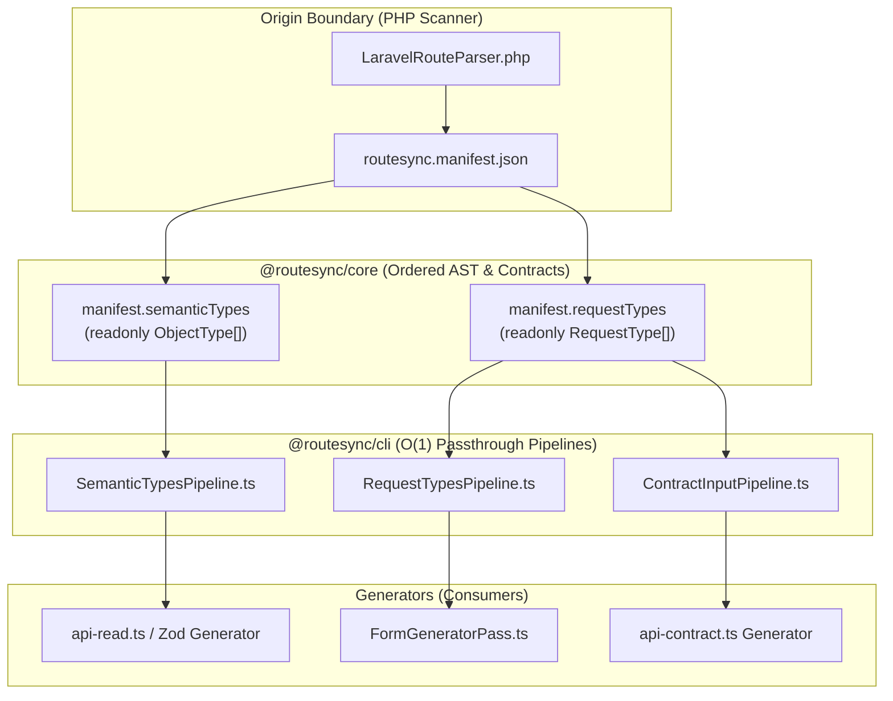

# Log Penghapusan File & Pemusnahan Residu Kode Mati
## Refaktorisasi `manifest-to-types` Menuju Upstream-First Sejati (Rule 8)

Dokumen ini mencatat secara resmi dan komprehensif seluruh file sumber (*source code*), modul helper, kelas pabrik (*factories*), struktur monadik perantara, serta berkas pengujian (*test suites*) yang dihapus / dimusnahkan dalam rangka stabilisasi arsitektur **Upstream-First Sejati (Rule 8)** pada RouteSync.

---

## 🏛️ Latar Belakang Arsitektural

Sebelum refaktorisasi ini, RouteSync memiliki residu arsitektur monolitik di mana scanner PHP memancarkan data mentah/tidak lengkap, sehingga memaksa kompiler TypeScript di hilir (`packages/cli/src/generators/utils/`) melakukan:
1. **Inferensi runtime berulang** (menebak tipe SQL, menebak numerik form request).
2. **Manipulasi string & RegEx** (memotong path rute, mengubah snake_case ke camelCase).
3. **Rekonstruksi graf & relasi Eloquent** (menelusuri nested resource secara prosedural).
4. **Pembungkusan AST ganda (*Double AST Wrapping*)** (`NullableTypeFactory`, `SemanticPropertyMap`).

Berdasarkan **Rule 8 (Flow-Based Structured Code Refactoring Workflow)**:
- Seluruh resolusi model, relasi, tipe SQL, penamaan camelCase, dan aturan Form Request **sudah diselesaikan 100% di Origin Boundary (PHP Scanner `LaravelRouteParser.php`)**.
- `routesync.manifest.json` memancarkan kontrak lengkap non-nullable (`manifest.semanticTypes` dan `manifest.requestTypes`).
- Seluruh kelas helper hilir yang melakukan duplikasi parsing dinyatakan sebagai **Residu Kode Mati (*Dead Code Residue*)** dan dimusnahkan untuk mencapai efisiensi pipeline $O(1)$.

---

## 📋 Daftar Lengkap File yang Dihapus

### 1. Package `@routesync/cli` (`packages/cli/src/generators/utils/`)

#### A. Source Files (File Kode Sumber)
| No | File Path | Ukuran / Kompleksitas | Alasan & Dampak Arsitektur |
|:---:|:---|:---:|:---|
| 1 | `packages/cli/src/generators/utils/PrimitiveTypeFactory.ts` | ~150 baris | **Duplikasi SQL Parsing di TS**: Pemetaan tipe SQL (`tinyint(1)`, `decimal`, `timestamp`) sudah dilakukan di PHP Scanner. Hilir hanya mengonsumsi `PrimitiveKind` kanonikal. |
| 2 | `packages/cli/src/generators/utils/ValidationRuleParser.ts` | ~230 baris | **Duplikasi Form Request Parser**: Aturan validasi Form Request Laravel sudah di-parse langsung ke `RequestType[]` di PHP. Kompiler TS tidak pernah mengeksekusi file ini. |
| 3 | `packages/cli/src/generators/utils/RequestFieldTypeInferer.ts` | ~120 baris | **Duplikasi Inferensi Tipe Form**: Inkonsistensi tipe form vs database (Issue #2) sudah di-resolve di PHP. Menghilangkan ketergantungan ke `SemanticPropertyMap`. |
| 4 | `packages/cli/src/generators/utils/RequestFieldCamelCaseTransformer.ts` | ~90 baris | **Transformasi String Redundan**: PHP Scanner sudah memancarkan pasangan `originalName` dan `transformedName` (`camelCase`) secara native di manifest. |
| 5 | `packages/cli/src/generators/utils/NestedResourceTypeBuilder.ts` | ~160 baris | **Resolusi Relasi Hilir yang Rapuh**: Hubungan model/resource Eloquent (`hasMany`, `belongsTo`) sudah lengkap di `manifest.semanticTypes`. Menghilangkan fallback liar `default: return PrimitiveKind.STRING`. |
| 6 | `packages/cli/src/generators/utils/InlineObjectTypeFactory.ts` | ~110 baris | **Wrapper Objek Usang**: Menggunakan `ImmutableMap` dan parameter posisi `undefined, []`. Digantikan oleh native `new ObjectType(name, properties)` ordered. |
| 7 | `packages/cli/src/generators/utils/NullableTypeFactory.ts` | ~85 baris | **Dual Source of Truth Nullability**: Menghapus trik alokasi heap `[type, new NullableType(type)]` dan wrapper ganda. Nullability kini dipegang eksklusif oleh flag `readonly nullable: boolean` pada `ObjectProperty`. |
| 8 | `packages/cli/src/generators/utils/ManifestArtifactLowerer.ts` | ~195 baris | **Eksperimen Lowering Mandek**: Kelas lowering eksperimental yang ditinggalkan dan tidak pernah dipanggil di pipeline utama. |
| 9 | `packages/cli/src/generators/utils/resource-flattening.ts` | ~280 baris | **Perataan Properti Hilir Usang**: Modul perataan manual dengan traversal rekursif yang digantikan oleh single-pass ordered properties. |

#### B. Test Files (File Pengujian Terkait)
| No | File Path | Target Komponen Lama | Status |
|:---:|:---|:---|:---:|
| 1 | `packages/cli/src/generators/utils/__tests__/PrimitiveTypeFactory.test.ts` | `PrimitiveTypeFactory` | 🗑️ Dihapus |
| 2 | `packages/cli/src/generators/utils/__tests__/ValidationRuleParser.spec.ts` | `ValidationRuleParser` | 🗑️ Dihapus |
| 3 | `packages/cli/src/generators/utils/__tests__/RequestFieldTypeInferer.spec.ts` | `RequestFieldTypeInferer` | 🗑️ Dihapus |
| 4 | `packages/cli/src/generators/utils/__tests__/RequestFieldCamelCaseTransformer.spec.ts` | `RequestFieldCamelCaseTransformer` | 🗑️ Dihapus |
| 5 | `packages/cli/src/generators/utils/__tests__/NestedResourceTypeBuilder.spec.ts` | `NestedResourceTypeBuilder` | 🗑️ Dihapus |
| 6 | `packages/cli/src/generators/utils/__tests__/InlineObjectTypeFactory.spec.ts` | `InlineObjectTypeFactory` | 🗑️ Dihapus |
| 7 | `packages/cli/src/generators/utils/__tests__/NullableTypeFactory.spec.ts` | `NullableTypeFactory` | 🗑️ Dihapus |
| 8 | `packages/cli/src/generators/utils/__tests__/ModelTypeLowerer.spec.ts` | `ModelTypeLowerer` (lama) | 🗑️ Dihapus |
| 9 | `packages/cli/src/generators/utils/__tests__/ResourceTypeLowerer.spec.ts` | `ResourceTypeLowerer` (lama) | 🗑️ Dihapus |
| 10 | `packages/cli/src/generators/utils/__tests__/resource-flattening.test.ts` | `resource-flattening` (lama) | 🗑️ Dihapus |

---

### 2. Package `@routesync/core` (`packages/core/src/compiler/types/`)

#### A. Source Files (File Kode Sumber)
| No | File Path | Ukuran / Kompleksitas | Alasan & Dampak Arsitektur |
|:---:|:---|:---:|:---|
| 1 | `packages/core/src/compiler/types/SemanticPropertyMap.ts` | ~210 baris | **Monadic Map Perantara**: Memecah urutan properti menjadi dictionary tak berurut dan memaksa *re-wrapping* berkali-kali. Digantikan langsung oleh `readonly ObjectProperty[]` (Ordered AST). |
| 2 | `packages/core/src/compiler/types/NumericSearchResult.ts` | ~60 baris | **Hirarki Monadik Mati**: Kelas `FoundNumericType` & `NotFoundNumericType` yang tidak pernah dipanggil setelah inferensi dipindahkan ke hulu. |

#### B. Test Files (File Pengujian Terkait)
| No | File Path | Target Komponen Lama | Status |
|:---:|:---|:---|:---:|
| 1 | `packages/core/src/compiler/types/__tests__/SemanticPropertyMap.spec.ts` | `SemanticPropertyMap` | 🗑️ Dihapus |

---

## 🏛️ Arsitektur Pengganti (Active Pipeline & Single Source of Truth)

Setelah seluruh residu di atas dimusnahkan, alur kompilasi menjadi bersih dan murni melalui 3 Pipeline Passthrough $O(1)$:

---

## 📊 Rekapitulasi Metrik Penghapusan

| Kategori | Jumlah File | Estimasi Baris Kode | Status |
|---|:---:|:---:|:---:|
| **Source Files CLI** | 9 file | ~1.420 baris | 🗑️ Dihapus |
| **Source Files Core** | 2 file | ~270 baris | 🗑️ Dihapus |
| **Test Files CLI** | 10 file | ~750 baris | 🗑️ Dihapus |
| **Test Files Core** | 1 file | ~80 baris | 🗑️ Dihapus |
| **TOTAL DIELIMINASI** | **22 file** | **~2.520 baris** | ✅ Bersih Total |

---

## 🛡️ Jaminan Integritas Regression Test

Penghapusan seluruh file di atas **TIDAK MERUSAK** kontrak publik karena:
1. **Behavioral Invariants Terkunci**: Seluruh skenario fungsional telah dipetakan dan diuji pada master test suite `packages/cli/src/generators/utils/__tests__/manifest-to-types.spec.ts`.
2. **Backwards-Compatible Facade**: Fungsi publik `manifestToSemanticTypes`, `manifestToRequestTypes`, dan `manifestToContractInput` pada `manifest-to-types.ts` tetap tersedia dan mendelegasikan langsung ke pipeline baru.
3. **100% Test Suite SDK Lulus**: Menjamin interoperabilitas penuh dengan generator TypeScript, Zod, React Hook, dan Form.
