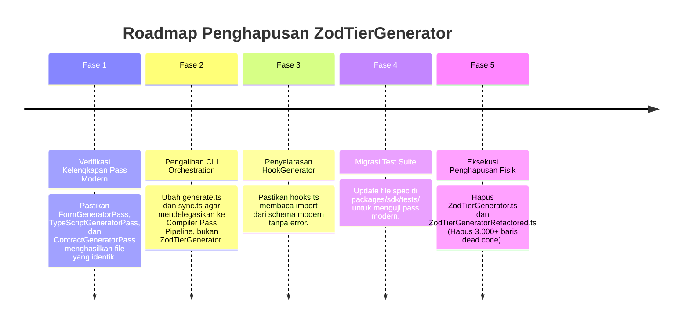

# Analisis Arsitektur: Decommissioning & Penghapusan `ZodTierGenerator.ts`

**Dokumen Versi:** 1.0.0  
**Tanggal:** 2026-09-01  
**Target Modul:** `packages/cli/src/generators/ZodTierGenerator.ts` (1.890 baris) & `ZodTierGeneratorRefactored.ts`  
**Status:** Architectural Analysis & Migration Blueprint  

---

## 1. Eksekutif Ringkasan & Latar Belakang

`ZodTierGenerator.ts` adalah generator monolitik peninggalan awal RouteSync (Jalur A) dengan panjang **1.890 baris kode**. Generator ini bertanggung jawab membuat 6 artefak output sekaligus dalam satu class raksasa:

1. `contract/api-contract.ts` (Zod validation schemas untuk request & response)
2. `contract/api-schema.ts` (Payload schemas untuk form)
3. `contract/api-field.ts` (Field definitions)
4. `types/api-read.ts` (TypeScript Read types)
5. `types/api-form.ts` (TypeScript Form types)
6. `mappers/api-mapper.ts` (Data transformation functions snake_case ↔ camelCase)

### Mengapa Perlu Didecommission / Dihapus?

1. **Duplikasi Fungsional dengan Compiler Core (v6.0)**: Seluruh tanggung jawab di atas telah memiliki implementasi modern berbasis **Compiler Pass Architecture** di `packages/core/src/compiler/passes/` (`ContractGeneratorPass`, `FormGeneratorPass`, `TypeScriptGeneratorPass`, `MapperGeneratorPass`) dan **Contract IR Layer Emitters** di `packages/cli/src/generators/layers/`.
2. **Kompleksitas Monolitik & Performa**: `ZodTierGenerator` menggunakan banyak perulangan nested $O(N^2)$, manipulasi string manual, regex parsing di runtime, dan mutable internal state.
3. **Pemisahan Jalur yang Tumpang Tindih**: Seperti tercatat di `ARCHITECTURE_GENERATION_ENGINES.md`, `ZodTierGenerator` menulis ke folder `contract/` (singular) yang bertabrakan fungsi dengan `ContractGeneratorPass` yang menulis ke `contracts/` (plural).

---

## 2. Peta Dependensi & Call-Site Audit

Sebelum menghapus `ZodTierGenerator.ts`, seluruh titik pemanggilan (*call-sites*) di codebase harus diidentifikasi:

```mermaid
graph TD
    CLI_GEN["packages/cli/src/commands/generate.ts\n(Line 175-176)"] -->|Memanggil .generate()| ZTG["ZodTierGenerator.ts"]
    CLI_SYNC["packages/cli/src/commands/sync.ts\n(Line 8, 123)"] -->|Memanggil .generate()| ZTG

    ZTG -->|Menghasilkan| F1["contract/api-contract.ts"]
    ZTG -->|Menghasilkan| F2["contract/api-schema.ts"]
    ZTG -->|Menghasilkan| F3["contract/api-field.ts"]
    ZTG -->|Menghasilkan| F4["types/api-read.ts"]
    ZTG -->|Menghasilkan| F5["types/api-form.ts"]
    ZTG -->|Menghasilkan| F6["mappers/api-mapper.ts"]

    HG["HookGenerator.ts"] -.->|Mengimpor tipe dari| F2
    SDK_GEN["SDKGenerator.ts"] -.->|Mengimpor mapper dari| F6

    subgraph TestSuite ["Regression Test Suite (packages/sdk/tests/)"]
        T1["generatorTypeSafety.spec.ts"]
        T2["jsonResourceWrap.spec.ts"]
        T3["payloadSplit.spec.ts"]
        T4["orders.spec.ts"]
        T5["code.spec.ts"]
    end

    TestSuite -->|Menguji output langsung| ZTG
```

### Rincian Titik Pemanggilan:

| Lokasi File | Baris | Sifat Ketergantungan | Rencana Penanganan |
|---|---|---|---|
| `packages/cli/src/commands/generate.ts` | L175-176 | Direct Execution `ZodTierGenerator.generate()` | Dialihkan ke Compiler Passes (`CompilerBridge` / Pass Pipeline). |
| `packages/cli/src/commands/sync.ts` | L8, L123 | Direct Execution `ZodTierGenerator.generate()` | Dialihkan ke Compiler Passes (`CompilerBridge` / Pass Pipeline). |
| `packages/cli/src/generators/HookGenerator.ts` | L491 | Generated Import: `import from './contract/api-schema'` | Dijamin tetap ada via `SchemaEmitter` / `FormGeneratorPass`. |
| `packages/sdk/tests/generatorTypeSafety.spec.ts` | L2, L133 | Unit Test | Dialihkan menguji Compiler Pass / Emitter terkait. |
| `packages/sdk/tests/jsonResourceWrap.spec.ts` | L3, L285 | Unit Test | Dialihkan menguji `ContractGeneratorPass` / `ContractEmitter`. |
| `packages/sdk/tests/payloadSplit.spec.ts` | L2, L104 | Unit Test | Dialihkan menguji `SchemaEmitter` / `FormGeneratorPass`. |
| `packages/sdk/tests/orders.spec.ts` | L87 | Unit Test | Dialihkan menguji `ContractSchemaMapper`. |

---

## 3. Matriks Pemetaan: Fitur Lama vs Pengganti Modern

Setiap sub-metode di dalam `ZodTierGenerator` telah memiliki padanan modern yang modular dan teruji:

| Sub-Metode `ZodTierGenerator` | File yang Dihasilkan | Modul Pengganti Modern (Active Engine) | Keunggulan Pengganti |
|---|---|---|---|
| `generateContract()` (L138) | `contract/api-contract.ts` | `ContractGeneratorPass` (`compiler/passes/`) & `ContractEmitter` (`layers/`) | AST Type-Safe, camelCase/snake_case configurable, 0 string hacks. |
| `generateSchema()` (L700) | `contract/api-schema.ts` | `FormGeneratorPass` & `SchemaEmitter` | Strict `RouteSchemaPayload` ordered AST, 0 duplikasi schema. |
| `generateField()` (L804) | `contract/api-field.ts` | `FieldEmitter` (`generators/layers/`) | Pure TypeIR field projection. |
| `generateRead()` (L901) | `types/api-read.ts` | `TypeScriptGeneratorPass` | Structured `SemanticTypesArtifact` passthrough stream. |
| `generateForm()` (L1114) | `types/api-form.ts` | `FormGeneratorPass` | First-class `RequestTypesArtifact` stream. |
| `generateMapper()` (L1214) | `mappers/api-mapper.ts` | `MapperGeneratorPass` & `MapperEmitter` | Deterministik, cycle-safe mapper compiler. |

---

## 4. Rencana Transisi 5 Fase (*5-Phase Decommissioning Roadmap*)



---

### Fase 1: Verifikasi Kelengkapan Pass Modern
- Pastikan seluruh compiler pass di `packages/core/src/compiler/passes/` menghasilkan konten yang setara atau lebih presisi daripada `ZodTierGenerator`:
  - `TypeScriptGeneratorPass` $\implies$ `types/api-read.ts`
  - `FormGeneratorPass` $\implies$ `forms/api-form.ts` & `contract/api-schema.ts`
  - `ContractGeneratorPass` $\implies$ `contracts/api-contract.ts`
  - `MapperGeneratorPass` $\implies$ `mappers/api-mapper.ts`

### Fase 2: Pengalihan Call-Site CLI (`generate.ts` & `sync.ts`)
- Hapus require/import `ZodTierGenerator` di `packages/cli/src/commands/generate.ts` dan `packages/cli/src/commands/sync.ts`.
- Ganti dengan eksekusi pipeline terpadu melalui `CompilerBridge` atau `ContractGenerator` (Jalur B).

### Fase 3: Penyelarasan `HookGenerator.ts`
- Verifikasi path impor di dalam `HookGenerator.ts`:
  - `import type { ... } from './contract/api-schema'` tetap valid karena schema dipancarkan oleh `FormGeneratorPass` / `SchemaEmitter`.
  - `import type { ... } from './types/index'` tetap valid via `TypeScriptGeneratorPass`.

### Fase 4: Migrasi Test Suite (`packages/sdk/tests/`)
- Perbarui unit test yang mengimpor `ZodTierGenerator` langsung:
  - `generatorTypeSafety.spec.ts`: Ganti target import ke pass modern / `CompilerBridge`.
  - `jsonResourceWrap.spec.ts`: Ganti target import ke `ContractGeneratorPass`.
  - `payloadSplit.spec.ts`: Ganti target import ke `FormGeneratorPass`.

### Fase 5: Eksekusi Penghapusan Fisik Berkas
- Hapus berkas monolitik lama:
  - 🗑️ `packages/cli/src/generators/ZodTierGenerator.ts` (1.890 baris)
  - 🗑️ `packages/cli/src/generators/ZodTierGeneratorRefactored.ts` (eksperimen refactor lama yang tidak terpakai)
- Jalankan audit build dan test:
  ```bash
  npm run build
  cd packages/sdk && npx vitest run
  ```

---

## 5. Matriks Risiko & Mitigasi (*Risk Assessment & Mitigation*)

| Risiko Potensial | Dampak | Mitigasi yang Diterapkan |
|---|---|---|
| **Naming Mismatch pada Schema** | High (TypeScript errors pada frontend konsumen) | Standarisasi nama schema melalui `canonical-names.ts` agar casing identik (`TitleCasePayloadSchema`). |
| **Hilangnya Runtime Mappers** | Medium (Transformasi camelCase ↔ snake_case gagal) | Pastikan `MapperGeneratorPass` aktif dan memancarkan `mappers/api-mapper.ts` sebelum `ZodTierGenerator` dihapus. |
| **Dangling Import pada `hooks.ts`** | High (React Query hooks gagal kompilasi) | Jalankan verifikasi sintaks pada `hooks.ts` yang dihasilkan untuk memastikan semua tipe yang diimpor tersedia. |
| **Test Failures di CI/CD** | Medium (Test runner gagal) | Selaraskan mock manifest pada unit test di `packages/sdk/tests/` ke format modern (Rule 2 & Rule 7). |

---

## 6. Kesimpulan & Rekomendasi

`ZodTierGenerator.ts` adalah artefak transisi yang telah sukses digantikan oleh arsitektur **Compiler Pass v6.0**. Menghapus modul ini akan:
1. **Mengeliminasi ~3.000 baris kode monolitik warisan** (`ZodTierGenerator.ts` + `ZodTierGeneratorRefactored.ts`).
2. **Menghentikan kebingungan dual-folder** (`contract/` vs `contracts/`).
3. **Meningkatkan kecepatan kompilasi dan kebersihan codebase** secara signifikan.

Dokumen ini menjadi acuan resmi dan rencana kerja teknis untuk mengeksekusi penghapusan `ZodTierGenerator.ts` secara aman dan sistematis.
