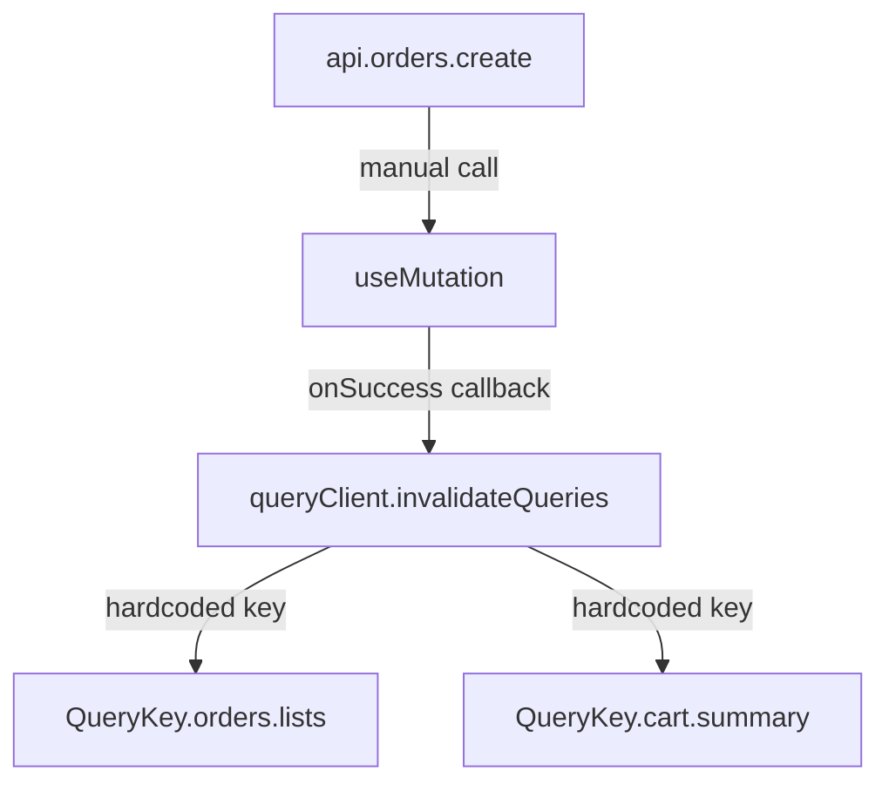

# RouteSync — Declarative Hooks & Cache Architecture

RouteSync features a declarative Domain Specific Language (DSL) that unifies client-side API calls, TypeScript type definitions, and TanStack Query state management. 

Instead of treating React Query hooks as simple API wrappers, RouteSync models your endpoints as **First-Class Frontend Resources** using a resource schema metadata registry.

---

## The Architecture: Why Declarative Metadata?

In traditional frontend architectures, you write endpoints, manually define type assertions, create custom hooks, and manage query invalidation rules on mutation success callbacks:



This spreads domain logic across components. RouteSync unifies this into a single declarative manifest inside `hooks.ts`:

```typescript
export const hooks = defineHooks({
  orders: {
    // 1. Compile-Time Resource Schema Metadata (Type Registry)
    types: {
      list: typeOf<OrderResourceIndex>(),
      detail: typeOf<OrderResourceShow>(),
      create: typeOf<OrderForm['Create']>(),
      update: typeOf<never>(),
    },
    
    // 2. Direct mapping to API client endpoints
    endpoint: api.orders,

    // 3. Centralized Query Key Factory
    queryKey: QueryKey.orders,

    // 4. Declarative Cache Invalidation metadata
    cache: {
      create: {
        invalidate: [
          QueryKey.orders.lists,
          QueryKey.cart.summary,
        ]
      }
    }
  }
})
```

---

## 1. Resource Schema Registry (`types`)

The `types` block registers compile-time TypeScript contracts. Because metadata is represented at runtime via the `typeOf<T>()` Type Factory helper, it incurs **zero runtime cost** while retaining type information.

```typescript
export const typeOf = <T>() => ({} as T)
```

### Compile-Time Hook Disabling
If an action is mapped to `never` (e.g. `update: typeOf<never>()`), RouteSync disables the corresponding hook:
```typescript
const updateMutation = useOrders.update() // ❌ TypeScript Compile Error: Property 'update' does not exist
```

---

## 2. Declarative Cache Invalidation (`cache`)

Often, creating or modifying a resource invalidates multiple unrelated queries. For example, checking out an order should refresh:
- The orders history list
- The cart items count
- The user's account balance summary

Under the hood, RouteSync intercepts the mutation lifecycle and executes query invalidations based on your `cache` config:

```typescript
const crudHooks = createCrudHooks({
  service: {
    create: api.orders.create,
  },
  cache: {
    create: {
      invalidate: [
        QueryKey.orders.lists,
        QueryKey.cart.summary,
      ]
    }
  }
})
```

On mutation success, RouteSync automatically maps these keys to TanStack's `queryClient`:

```typescript
// RouteSync Core Runtime (onSuccess)
onSuccess: () => {
  // 1. Standard auto-invalidation of list query
  qc.invalidateQueries({ queryKey: queryKey.list() })
  
  // 2. Cross-resource declarative invalidations
  config.cache.create.invalidate.forEach(inv => {
    const key = typeof inv === 'function' ? inv() : inv
    qc.invalidateQueries({ queryKey: key })
  })
}
```

---

## 3. How to Use the Generated Hooks

RouteSync generates a single namespace hook per resource group (e.g. `useProduk`, `useOrders`, `useCartItems`).

### Standard CRUD Actions

```tsx
import { useProduk } from '@/api/hooks'

function ProductCatalog() {
  // Query Index (GET /produk) -> Inferred as ProdukItemResourceIndex
  const { data: products } = useProduk.index()

  // Query Show (GET /produk/:id) -> Inferred as ProdukItemResourceShow
  const { data: detail } = useProduk.show(42)

  // Create Mutation (POST /produk) -> Expects AdminProdukForm['Create'] payload
  const createMutation = useProduk.create()
  
  const handleCreate = (data: any) => {
    createMutation.mutate(data) // Fully typechecked payload
  }

  return (
    <div>
      {products?.map(p => <div key={p.id}>{p.nama}</div>)}
    </div>
  )
}
```

### Custom Non-CRUD Actions

Non-RESTful actions (e.g. `POST /login`, `DELETE /cart/promo`) are automatically exposed on the same resource hook namespace prefixed with `use`:

```tsx
import { useLogin, useCartPromo } from '@/api/hooks'

function AuthForm() {
  const loginMutation = useLogin.useCreate() // custom POST /login hook

  const handleLogin = () => {
    loginMutation.mutate({ email, password })
  }
}

function PromoCode() {
  const applyPromo = useCartPromo.useCreate() // custom POST /cart/promo hook
  const removePromo = useCartPromo.useDelete() // custom DELETE /cart/promo hook
}
```

---

## Benefits of the DSL Pattern

- **Single Source of Truth**: All endpoint structures, validators, query keys, types, and caching rules are grouped together.
- **Zero Boilerplate**: You never have to manually wire `useQuery` or `useMutation` callbacks for standard CRUD.
- **Robust Type-safety**: Payloads and response payloads are compiled and checked against database tables and validator rules at compile-time.
