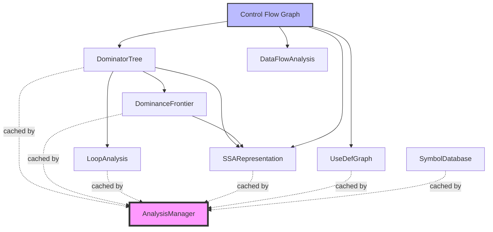
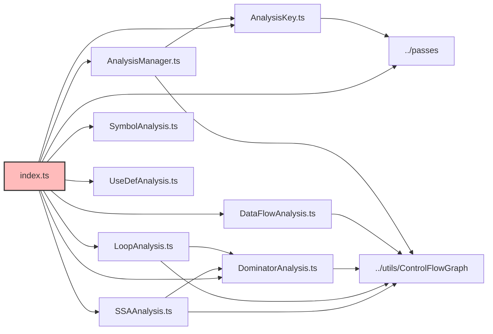
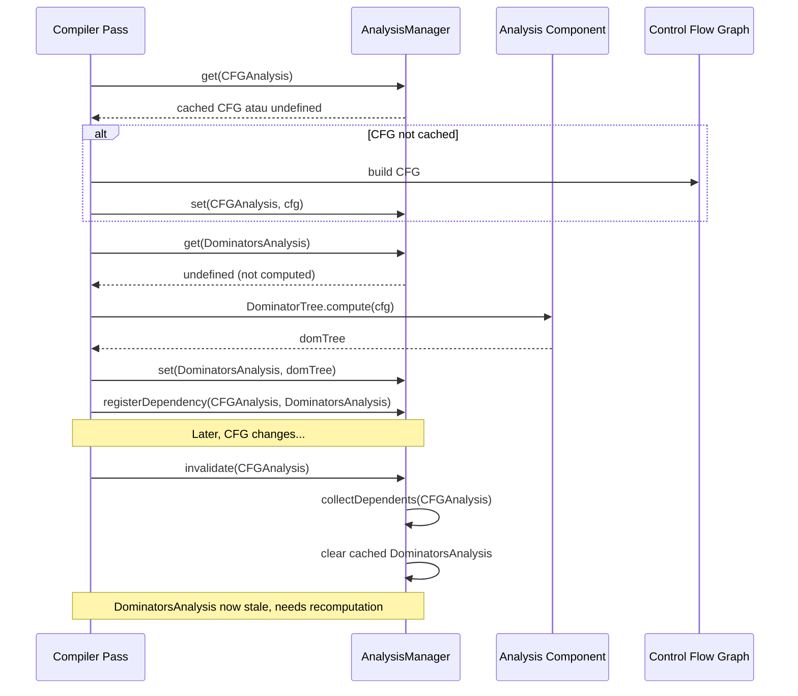

# Compiler Analysis

## Pendahuluan

### Apa itu Compiler Analysis?

Folder `compiler/analysis` berisi komponen-komponen untuk melakukan **analisis statis** terhadap program dalam compiler RouteSync. Analysis adalah tahap dalam compiler pipeline yang bertanggung jawab untuk mengumpulkan informasi tentang struktur dan perilaku program tanpa menjalankannya.

Analysis merupakan fondasi untuk optimisasi compiler dan verifikasi kebenaran program. Komponen-komponen dalam folder ini menyediakan berbagai jenis analisis yang digunakan oleh pass-pass optimisasi untuk membuat keputusan transformasi yang aman dan efektif.

### Tujuan Folder `compiler/analysis`

Folder ini menyediakan:

1. **Data Flow Analysis Framework** - Framework generik untuk menganalisis aliran data dalam program
2. **Control Flow Analysis** - Analisis struktur kontrol program (dominance, loops)
3. **SSA Form Construction** - Konstruksi Static Single Assignment form
4. **Symbol Tracking** - Database simbol dan pelacakan referensi
5. **Use-Def Chains** - Pelacakan hubungan antara penggunaan dan definisi variabel
6. **Analysis Management** - Caching dan dependency tracking untuk hasil analisis

### Peran Analysis dalam Pipeline Compiler

Analysis berada di tengah-tengah pipeline compiler RouteSync:

```
Scanner → Parser → Analysis → Optimization → IR Building → Emission
                      ↑           ↓
                      └─── Feedback Loop ───┘
```


Peran utama Analysis dalam pipeline:

- **Mengumpulkan Informasi Program** - Mengekstrak metadata seperti control flow, data flow, dan symbol relationships
- **Memvalidasi Kebenaran** - Memastikan program memenuhi invariants yang diperlukan
- **Mendukung Optimisasi** - Menyediakan informasi untuk pass optimisasi seperti dead code elimination, constant propagation, loop optimizations
- **Caching Hasil** - Menyimpan hasil analisis untuk menghindari rekomputasi yang mahal

### Mengapa Tahap Analysis Diperlukan?

Tanpa analisis yang proper, compiler tidak dapat:

1. **Melakukan Optimisasi Aman** - Optimisasi membutuhkan informasi tentang bagaimana data mengalir dan kontrol berpindah
2. **Mendeteksi Error** - Banyak error hanya dapat dideteksi melalui analisis statis (undefined variables, unreachable code)
3. **Membangun IR yang Baik** - Intermediate representation yang berkualitas membutuhkan informasi dari analisis
4. **Incremental Compilation** - Dependency tracking memungkinkan recompilation hanya pada bagian yang berubah

Analysis adalah jembatan antara representasi program mentah (AST/CFG) dan representasi yang dioptimasi (optimized IR).

## Arsitektur

### Struktur Folder

Folder `compiler/analysis` berisi 9 file utama:

```
compiler/analysis/
├── AnalysisKey.ts          # Type-safe keys untuk analysis results
├── AnalysisManager.ts      # Caching dan dependency management
├── DataFlowAnalysis.ts     # Generic data flow framework
├── DominatorAnalysis.ts    # Dominator tree computation
├── LoopAnalysis.ts         # Loop detection dan normalization
├── SSAAnalysis.ts          # SSA form construction
├── SymbolAnalysis.ts       # Symbol database dan tracking
├── UseDefAnalysis.ts       # Use-definition chain analysis
└── index.ts                # Public API exports
```


### Komponen Utama

#### 1. AnalysisKey.ts

File ini mendefinisikan **type-safe keys** untuk mengidentifikasi hasil analisis dalam analysis manager.

**Type yang Tersedia:**

```typescript
// Imported dari '../passes'
import { AnalysisKey } from '../passes';
```

**Standard Analysis Keys:**

- `CFGAnalysis` - Key untuk Control Flow Graph analysis
- `DominatorsAnalysis` - Key untuk Dominator Tree analysis  
- `LoopInfoAnalysis` - Key untuk Loop information analysis
- `SSAAnalysis` - Key untuk SSA representation analysis
- `UseDefAnalysis` - Key untuk Use-Def graph analysis

**Fungsi:** Menyediakan identifikasi yang type-safe untuk menyimpan dan mengambil hasil analisis dari `AnalysisManager`. Setiap key dikaitkan dengan tipe hasil analisis tertentu melalui generic type parameter.

#### 2. AnalysisManager.ts

File ini mengimplementasikan **analysis result caching** dan **dependency tracking**.

**Class yang Tersedia:**

**a) `AnalysisDependencyGraph`**

Melacak dependency antar analisis untuk invalidation yang tepat.

```typescript
class AnalysisDependencyGraph {
  addDependency(parent: AnalysisKey<unknown>, child: AnalysisKey<unknown>): void
  removeDependency(parent: AnalysisKey<unknown>, child: AnalysisKey<unknown>): void
  dependents(key: AnalysisKey<unknown>): ReadonlySet<AnalysisKey<unknown>>
  dependencies(key: AnalysisKey<unknown>): ReadonlySet<AnalysisKey<unknown>>
  clear(): void
}
```


**b) `AnalysisManager`**

Manager utama untuk caching dan invalidation hasil analisis.

```typescript
class AnalysisManager {
  get<T>(key: AnalysisKey<T>): T | undefined
  set<T>(key: AnalysisKey<T>, value: T): void
  has<T>(key: AnalysisKey<T>): boolean
  registerDependency(parent: AnalysisKey<unknown>, child: AnalysisKey<unknown>): void
  collectDependents(key: AnalysisKey<unknown>): ReadonlySet<AnalysisKey<unknown>>
  invalidate(key: AnalysisKey<unknown>): void
  clear(): void
  getStats(): { cachedAnalyses: number; dependencies: number }
}
```

**Fungsi:**
- Menyimpan hasil analisis dalam cache untuk menghindari rekomputasi
- Melacak dependency graph untuk invalidation otomatis
- Ketika analisis A di-invalidate, semua analisis yang bergantung pada A juga di-invalidate
- Menggunakan BFS untuk mengumpulkan semua dependent analyses secara transitif

#### 3. DataFlowAnalysis.ts

Framework **generik** untuk data flow analysis menggunakan worklist algorithm.

**Interface:**

```typescript
interface FlowState<T> {
  readonly inState: T    // State at block entry
  readonly outState: T   // State at block exit
}
```

**Class:**

```typescript
class DataFlowAnalysis<T> {
  analyze(
    cfg: ControlFlowGraph,
    initialState: T,
    transfer: (block: BasicBlock, state: T) => T,
    merge: (states: readonly T[]) => T
  ): ReadonlyMap<number, FlowState<T>>
  
  analyzeBackward(
    cfg: ControlFlowGraph,
    initialState: T,
    transfer: (block: BasicBlock, state: T) => T,
    merge: (states: readonly T[]) => T
  ): ReadonlyMap<number, FlowState<T>>
}
```


**Fungsi:**
- Menyediakan framework untuk forward dan backward data flow analysis
- Menggunakan iterative worklist algorithm untuk mencapai fixed point
- Transfer function menghitung state output dari state input untuk setiap block
- Merge function menggabungkan state dari multiple predecessors/successors
- Dapat digunakan untuk reaching definitions, live variables, available expressions, constant propagation

#### 4. DominatorAnalysis.ts

Implementasi **dominator tree** computation dan **dominance frontier**.

**Class yang Tersedia:**

**a) `DominatorTree`**

Menghitung dominator relationships dalam CFG.

```typescript
class DominatorTree {
  compute(cfg: ControlFlowGraph): void
  getImmediateDominator(blockId: number): number | undefined
  getChildren(blockId: number): ReadonlySet<number>
  dominates(ancestor: number, descendant: number): boolean
  clear(): void
}
```

**Konsep:** Node A **dominates** node B jika semua path dari entry ke B harus melalui A.

**b) `DominanceFrontier`**

Menghitung dominance frontiers untuk phi node placement dalam SSA construction.

```typescript
class DominanceFrontier {
  compute(cfg: ControlFlowGraph, dom: DominatorTree): void
  getFrontier(blockId: number): ReadonlySet<number>
  clear(): void
}
```

**Konsep:** Dominance frontier dari node N adalah set of nodes dimana:
- N dominates predecessor dari node tersebut
- N tidak strictly dominate node tersebut

**Fungsi:**
- Menggunakan algorithm Lengauer-Tarjan variant untuk efficient computation
- Reverse postorder traversal untuk faster convergence
- Digunakan untuk SSA construction dan loop optimization


#### 5. LoopAnalysis.ts

Detection dan normalization dari **natural loops** dalam CFG.

**Interface:**

```typescript
interface LoopInfo {
  readonly header: number                    // Loop header block ID
  readonly backEdges: readonly number[]      // Back edge sources
  readonly loopBlocks: ReadonlySet<number>   // All blocks in loop
}
```

**Class yang Tersedia:**

**a) `LoopAnalysis`**

Static class untuk loop detection.

```typescript
class LoopAnalysis {
  static analyze(cfg: ControlFlowGraph, dom: DominatorTree): readonly LoopInfo[]
}
```

**b) `LoopNormalizer`**

Utilities untuk transformasi loop ke canonical form.

```typescript
class LoopNormalizer {
  static ensurePreHeader(
    cfg: ControlFlowGraph,
    loopBlocks: ReadonlySet<number>,
    headerId: number
  ): { cfg: ControlFlowGraph; preHeaderId: number }
}
```

**Fungsi:**
- Mendeteksi natural loops berdasarkan back edges (edge dari N ke H dimana H dominates N)
- Pre-header adalah block dengan single successor (loop header) untuk hoisting loop-invariant code
- Loop normalization memudahkan optimisasi seperti loop-invariant code motion

#### 6. SSAAnalysis.ts

Konstruksi **Static Single Assignment (SSA)** form.

**Type dan Class:**

```typescript
type SSABasicBlock = BasicBlock

class SSARepresentation {
  constructor(
    public readonly entryBlock: number,
    public readonly blocks: ReadonlyMap<number, SSABasicBlock>
  )
  
  getBlock(id: number): SSABasicBlock | undefined
  get blockIds(): readonly number[]
}
```


**SSA Builders:**

```typescript
class SSABuilder {
  static insertPhiNodes(
    cfg: ControlFlowGraph,
    df: DominanceFrontier,
    variables: readonly number[]
  ): ControlFlowGraph
}

class SSARenamer {
  rename(cfg: ControlFlowGraph, dom: DominatorTree): ControlFlowGraph
}
```

**Fungsi:**
- Dalam SSA form, setiap variabel didefinisikan tepat satu kali
- Phi nodes ditempatkan di join points untuk merge values dari multiple paths
- SSA form menyederhankan banyak optimisasi dan analisis
- Konstruksi SSA menggunakan classic algorithm: phi insertion → variable renaming

#### 7. SymbolAnalysis.ts

Database simbol dan pelacakan referensi.

**Interface:**

```typescript
interface SymbolNode {
  readonly id: string
  readonly kind: 'class' | 'method' | 'property'
  readonly name: string
  readonly namespace: string
  readonly parentId?: string
  readonly extendsId?: string
  readonly implementsIds: readonly string[]
}
```

**Class:**

```typescript
class SymbolDatabase {
  registerSymbol(node: SymbolNode): void
  addReference(fromId: string, toId: string): void
  getSymbol(id: string): SymbolNode | undefined
  getReferences(fromId: string): ReadonlySet<string>
  findReferencingSymbols(symbolId: string): ReadonlySet<string>
  getSymbolsByKind(kind: SymbolNode['kind']): readonly SymbolNode[]
  getSymbolsInNamespace(namespace: string): readonly SymbolNode[]
  getChildren(parentId: string): readonly SymbolNode[]
  getClassHierarchy(classId: string): readonly string[]
  isUnused(symbolId: string): boolean
  clear(): void
  getStats(): { totalSymbols, classes, methods, properties, totalReferences }
}
```


**Fungsi:**
- Menyimpan metadata tentang semua simbol dalam program (classes, methods, properties)
- Melacak reference graph untuk cross-reference analysis
- Mendukung hierarchy traversal untuk inheritance relationships
- Mendeteksi unused symbols untuk dead code elimination

#### 8. UseDefAnalysis.ts

Pelacakan **use-definition chains** untuk data flow.

**Class:**

```typescript
class UseDefGraph {
  recordDef(valueId: number, instructionId: number): void
  recordUse(valueId: number, instructionId: number): void
  getDefinition(valueId: number): number | undefined
  getUses(valueId: number): ReadonlySet<number>
  isUsed(valueId: number): boolean
  removeUse(valueId: number, instructionId: number): void
  clear(): void
  getStats(): { totalDefs, totalUses, unusedValues }
}
```

**Fungsi:**
- Melacak dimana setiap value didefinisikan dan digunakan
- Mendukung dead code elimination (definitions yang tidak pernah digunakan)
- Digunakan untuk copy propagation dan constant folding
- Essential untuk liveness analysis

#### 9. index.ts

File ini meng-export semua public API dari module analysis:

```typescript
// Exports semua classes, types, dan constants
export {
  DominatorTree, DominanceFrontier,
  LoopInfo, LoopAnalysis, LoopNormalizer,
  SSABasicBlock, SSARepresentation, SSABuilder, SSARenamer,
  UseDefGraph,
  SymbolNode, SymbolDatabase,
  FlowState, DataFlowAnalysis,
  AnalysisDependencyGraph, AnalysisManager,
  AnalysisKey
}

// Standard analysis keys
export { 
  CFGAnalysis, DominatorsAnalysis, LoopInfoAnalysis, 
  SSAAnalysis, UseDefAnalysis 
}
```


### Hubungan Antar Komponen



**Dependency Chain:**

1. **CFG** adalah input dasar untuk semua analisis
2. **DominatorTree** bergantung pada CFG
3. **DominanceFrontier** bergantung pada CFG dan DominatorTree
4. **LoopAnalysis** bergantung pada CFG dan DominatorTree
5. **SSA Construction** bergantung pada CFG, DominatorTree, dan DominanceFrontier
6. **AnalysisManager** meng-cache semua hasil analisis dan mengelola dependencies

### Dependency Antar File




## Cara Kerja

### Proses Analysis

Analysis dalam RouteSync compiler dijalankan dalam beberapa tahap:

#### 1. Initialization

Analysis manager diinisialisasi untuk menyimpan hasil analisis:

```typescript
import { AnalysisManager } from './compiler/analysis';

const analysisManager = new AnalysisManager();
```

#### 2. Control Flow Analysis

Pertama, control flow graph (CFG) dibangun dan dominator tree dihitung:

```typescript
import { ControlFlowGraph } from './compiler/utils/ControlFlowGraph';
import { DominatorTree, CFGAnalysis, DominatorsAnalysis } from './compiler/analysis';

// CFG sudah tersedia dari tahap sebelumnya
const cfg: ControlFlowGraph = /* ... */;

// Compute dominator tree
const domTree = new DominatorTree();
domTree.compute(cfg);

// Cache hasil
analysisManager.set(CFGAnalysis, cfg);
analysisManager.set(DominatorsAnalysis, domTree);

// Register dependency
analysisManager.registerDependency(CFGAnalysis, DominatorsAnalysis);
```

#### 3. Loop Detection

Setelah dominator tree tersedia, loops dapat dideteksi:

```typescript
import { LoopAnalysis, LoopInfoAnalysis } from './compiler/analysis';

// Detect loops
const loops = LoopAnalysis.analyze(cfg, domTree);

// Cache hasil
analysisManager.set(LoopInfoAnalysis, loops);

// Register dependencies
analysisManager.registerDependency(CFGAnalysis, LoopInfoAnalysis);
analysisManager.registerDependency(DominatorsAnalysis, LoopInfoAnalysis);
```


#### 4. SSA Construction

SSA form dibangun menggunakan dominance frontiers:

```typescript
import { 
  DominanceFrontier, 
  SSABuilder, 
  SSARenamer,
  SSAAnalysis 
} from './compiler/analysis';

// Compute dominance frontiers
const df = new DominanceFrontier();
df.compute(cfg, domTree);

// Identify all variables to convert
const variables = [1, 2, 3, 4]; // Variable IDs

// Insert phi nodes
const cfgWithPhis = SSABuilder.insertPhiNodes(cfg, df, variables);

// Recompute dominator tree for modified CFG
const domTree2 = new DominatorTree();
domTree2.compute(cfgWithPhis);

// Rename variables
const renamer = new SSARenamer();
const ssaCfg = renamer.rename(cfgWithPhis, domTree2);

// Wrap dalam SSARepresentation
const ssaRep = new SSARepresentation(ssaCfg.entryBlock, ssaCfg.blocks);

// Cache hasil
analysisManager.set(SSAAnalysis, ssaRep);
analysisManager.registerDependency(DominatorsAnalysis, SSAAnalysis);
```

#### 5. Data Flow Analysis

Generic data flow analysis dapat dijalankan untuk berbagai tujuan:

```typescript
import { DataFlowAnalysis, FlowState } from './compiler/analysis';

// Contoh: Reaching Definitions Analysis
interface ReachingDefs {
  definitions: Set<number>;
}

const dfa = new DataFlowAnalysis<ReachingDefs>();

const results = dfa.analyze(
  cfg,
  { definitions: new Set() }, // Initial state
  
  // Transfer function: compute output state dari input state
  (block, inState) => {
    const newDefs = new Set(inState.definitions);
    // Update based on block instructions
    block.instructions.forEach(inst => {
      if (inst.kind === 'Assign') {
        newDefs.add(inst.target);
      }
    });
    return { definitions: newDefs };
  },
  
  // Merge function: combine states dari predecessors
  (states) => {
    const merged = new Set<number>();
    states.forEach(s => s.definitions.forEach(d => merged.add(d)));
    return { definitions: merged };
  }
);

// Query hasil
results.forEach((flowState, blockId) => {
  console.log(`Block ${blockId} reaching defs:`, flowState.inState.definitions);
});
```


#### 6. Use-Def Chain Construction

Use-def chains dibangun untuk tracking variable lifetimes:

```typescript
import { UseDefGraph, UseDefAnalysis } from './compiler/analysis';

const useDefGraph = new UseDefGraph();

// Build use-def graph dari CFG
cfg.blocks.forEach((block, blockId) => {
  block.instructions.forEach((inst, instId) => {
    const instructionId = blockId * 1000 + instId; // Unique instruction ID
    
    if (inst.kind === 'Assign') {
      // Record definition
      useDefGraph.recordDef(inst.target, instructionId);
      
      // Record use jika value digunakan
      if (inst.value.kind === 'Variable') {
        useDefGraph.recordUse(inst.value.id, instructionId);
      }
    }
  });
});

// Cache hasil
analysisManager.set(UseDefAnalysis, useDefGraph);
```

#### 7. Symbol Tracking

Symbol database dibangun untuk pelacakan referensi:

```typescript
import { SymbolDatabase, SymbolNode } from './compiler/analysis';

const symbolDb = new SymbolDatabase();

// Register symbols
symbolDb.registerSymbol({
  id: 'User',
  kind: 'class',
  name: 'User',
  namespace: 'App\\Models',
  implementsIds: ['Authenticatable']
});

symbolDb.registerSymbol({
  id: 'UserController',
  kind: 'class',
  name: 'UserController',
  namespace: 'App\\Http\\Controllers',
  extendsIds: 'Controller'
});

// Add cross-references
symbolDb.addReference('UserController', 'User');

// Query
const userClass = symbolDb.getSymbol('User');
const references = symbolDb.getReferences('UserController');
console.log('UserController references:', Array.from(references));
```


### Input dan Output Analysis

**Input:**
- **Control Flow Graph (CFG)** - Representasi control flow dari program
- **Basic Blocks** - Sequence of instructions
- **Variable IDs** - Identifiers untuk variables
- **Symbol Information** - Metadata tentang classes, methods, properties

**Output:**
- **DominatorTree** - Hierarchical dominance relationships
- **LoopInfo[]** - Informasi tentang detected loops
- **SSARepresentation** - Program dalam SSA form
- **FlowState Map** - Data flow information per block
- **UseDefGraph** - Use-definition chains
- **SymbolDatabase** - Populated symbol registry

### Lifecycle Analysis




## Cara Penggunaan

### Contoh 1: Basic Dominator Analysis

```typescript
import { 
  ControlFlowGraph,
  DominatorTree,
  AnalysisManager,
  CFGAnalysis,
  DominatorsAnalysis
} from '@routesync/core';

// Assume CFG already built
const cfg: ControlFlowGraph = /* ... */;

// Initialize analysis manager
const manager = new AnalysisManager();
manager.set(CFGAnalysis, cfg);

// Compute dominator tree
const domTree = new DominatorTree();
domTree.compute(cfg);

// Cache result
manager.set(DominatorsAnalysis, domTree);
manager.registerDependency(CFGAnalysis, DominatorsAnalysis);

// Query dominance
const blockA = 1;
const blockB = 5;

if (domTree.dominates(blockA, blockB)) {
  console.log(`Block ${blockA} dominates block ${blockB}`);
}

// Get immediate dominator
const idom = domTree.getImmediateDominator(blockB);
console.log(`Immediate dominator of ${blockB}: ${idom}`);

// Get dominated children
const children = domTree.getChildren(blockA);
console.log(`Blocks dominated by ${blockA}:`, Array.from(children));
```

### Contoh 2: Loop Detection dan Normalization

```typescript
import {
  ControlFlowGraph,
  DominatorTree,
  LoopAnalysis,
  LoopNormalizer
} from '@routesync/core';

const cfg: ControlFlowGraph = /* ... */;

// Compute prerequisites
const domTree = new DominatorTree();
domTree.compute(cfg);

// Detect loops
const loops = LoopAnalysis.analyze(cfg, domTree);

console.log(`Found ${loops.length} loops`);

loops.forEach(loop => {
  console.log(`Loop header: ${loop.header}`);
  console.log(`Back edges from:`, loop.backEdges);
  console.log(`Loop blocks:`, Array.from(loop.loopBlocks));
  
  // Normalize loop (ensure pre-header exists)
  const { cfg: normalizedCfg, preHeaderId } = LoopNormalizer.ensurePreHeader(
    cfg,
    loop.loopBlocks,
    loop.header
  );
  
  console.log(`Pre-header created: ${preHeaderId}`);
  
  // Now dapat hoist loop-invariant code ke pre-header
});
```


### Contoh 3: SSA Construction

```typescript
import {
  ControlFlowGraph,
  DominatorTree,
  DominanceFrontier,
  SSABuilder,
  SSARenamer,
  SSARepresentation
} from '@routesync/core';

const cfg: ControlFlowGraph = /* ... */;

// Step 1: Compute dominator tree
const domTree = new DominatorTree();
domTree.compute(cfg);

// Step 2: Compute dominance frontiers
const df = new DominanceFrontier();
df.compute(cfg, domTree);

// Step 3: Identify variables
const variables = [1, 2, 3]; // Variable IDs to convert to SSA

// Step 4: Insert phi nodes
const cfgWithPhis = SSABuilder.insertPhiNodes(cfg, df, variables);

// Step 5: Recompute dominator tree for modified CFG
const domTree2 = new DominatorTree();
domTree2.compute(cfgWithPhis);

// Step 6: Rename variables
const renamer = new SSARenamer();
const ssaCfg = renamer.rename(cfgWithPhis, domTree2);

// Step 7: Create SSA representation
const ssa = new SSARepresentation(ssaCfg.entryBlock, ssaCfg.blocks);

// Use SSA form
console.log('Entry block:', ssa.entryBlock);
console.log('Total blocks:', ssa.blockIds.length);

ssa.blocks.forEach((block, blockId) => {
  console.log(`\nBlock ${blockId}:`);
  block.instructions.forEach(inst => {
    if (inst.kind === 'Phi') {
      console.log(`  φ(${inst.target}) ← ${Array.from(inst.incoming.values()).join(', ')}`);
    } else {
      console.log(`  ${JSON.stringify(inst)}`);
    }
  });
});
```

### Contoh 4: Generic Data Flow Analysis

```typescript
import { DataFlowAnalysis, FlowState } from '@routesync/core';

// Define state type untuk live variable analysis
interface LiveVars {
  liveVariables: Set<number>;
}

const cfg: ControlFlowGraph = /* ... */;
const analysis = new DataFlowAnalysis<LiveVars>();

// Backward analysis untuk live variables
const results = analysis.analyzeBackward(
  cfg,
  { liveVariables: new Set() }, // Initial: no variables live at exit
  
  // Transfer function (backward): compute IN dari OUT
  (block, outState) => {
    const live = new Set(outState.liveVariables);
    
    // Process instructions in reverse
    for (let i = block.instructions.length - 1; i >= 0; i--) {
      const inst = block.instructions[i];
      
      if (inst.kind === 'Assign') {
        // Kill: remove defined variable
        live.delete(inst.target);
        
        // Gen: add used variables
        if (inst.value.kind === 'Variable') {
          live.add(inst.value.id);
        }
      }
    }
    
    return { liveVariables: live };
  },
  
  // Merge: union of successor states
  (states) => {
    const merged = new Set<number>();
    states.forEach(s => 
      s.liveVariables.forEach(v => merged.add(v))
    );
    return { liveVariables: merged };
  }
);

// Check results
results.forEach((state, blockId) => {
  console.log(`Block ${blockId}:`);
  console.log(`  Live at entry:`, Array.from(state.inState.liveVariables));
  console.log(`  Live at exit:`, Array.from(state.outState.liveVariables));
});
```


### Contoh 5: Use-Def Chain Analysis

```typescript
import { UseDefGraph } from '@routesync/core';

const useDefGraph = new UseDefGraph();
const cfg: ControlFlowGraph = /* ... */;

// Build use-def graph
cfg.blocks.forEach((block, blockId) => {
  block.instructions.forEach((inst, instIdx) => {
    const instId = blockId * 1000 + instIdx;
    
    if (inst.kind === 'Assign') {
      // Record definition
      useDefGraph.recordDef(inst.target, instId);
      
      // Record use
      if (inst.value.kind === 'Variable') {
        useDefGraph.recordUse(inst.value.id, instId);
      }
    } else if (inst.kind === 'Return' && inst.value?.kind === 'Variable') {
      useDefGraph.recordUse(inst.value.id, instId);
    }
  });
});

// Find dead definitions
const allValueIds = new Set<number>();
cfg.blocks.forEach(block => {
  block.instructions.forEach(inst => {
    if (inst.kind === 'Assign') {
      allValueIds.add(inst.target);
    }
  });
});

allValueIds.forEach(valueId => {
  if (!useDefGraph.isUsed(valueId)) {
    const defInst = useDefGraph.getDefinition(valueId);
    console.log(`Dead definition: value ${valueId} defined at instruction ${defInst}`);
  }
});

// Get statistics
const stats = useDefGraph.getStats();
console.log('Use-Def Statistics:');
console.log(`  Total definitions: ${stats.totalDefs}`);
console.log(`  Total uses: ${stats.totalUses}`);
console.log(`  Unused values: ${stats.unusedValues}`);
```

### Contoh 6: Symbol Database

```typescript
import { SymbolDatabase, SymbolNode } from '@routesync/core';

const symbolDb = new SymbolDatabase();

// Register class symbols
symbolDb.registerSymbol({
  id: 'Model',
  kind: 'class',
  name: 'Model',
  namespace: 'Illuminate\\Database\\Eloquent',
  implementsIds: []
});

symbolDb.registerSymbol({
  id: 'User',
  kind: 'class',
  name: 'User',
  namespace: 'App\\Models',
  extendsId: 'Model',
  implementsIds: ['Authenticatable']
});

symbolDb.registerSymbol({
  id: 'UserController',
  kind: 'class',
  name: 'UserController',
  namespace: 'App\\Http\\Controllers',
  implementsIds: []
});

// Register method symbols
symbolDb.registerSymbol({
  id: 'UserController.index',
  kind: 'method',
  name: 'index',
  namespace: 'App\\Http\\Controllers',
  parentId: 'UserController',
  implementsIds: []
});

// Add cross-references
symbolDb.addReference('UserController', 'User');
symbolDb.addReference('UserController.index', 'User');

// Query class hierarchy
const hierarchy = symbolDb.getClassHierarchy('User');
console.log('User class hierarchy:', hierarchy);
// Output: ['User', 'Model']

// Find referencing symbols
const refs = symbolDb.findReferencingSymbols('User');
console.log('Symbols referencing User:', Array.from(refs));
// Output: ['UserController', 'UserController.index']

// Check unused symbols
const allClasses = symbolDb.getSymbolsByKind('class');
allClasses.forEach(cls => {
  if (symbolDb.isUnused(cls.id)) {
    console.log(`Unused class: ${cls.namespace}\\${cls.name}`);
  }
});

// Statistics
const stats = symbolDb.getStats();
console.log('\nSymbol Database Statistics:');
console.log(`  Classes: ${stats.classes}`);
console.log(`  Methods: ${stats.methods}`);
console.log(`  Properties: ${stats.properties}`);
console.log(`  Total references: ${stats.totalReferences}`);
```


### Contoh 7: Analysis Manager dengan Dependency Tracking

```typescript
import {
  AnalysisManager,
  CFGAnalysis,
  DominatorsAnalysis,
  LoopInfoAnalysis,
  SSAAnalysis
} from '@routesync/core';

const manager = new AnalysisManager();

// Store initial analyses
manager.set(CFGAnalysis, cfg);

const domTree = new DominatorTree();
domTree.compute(cfg);
manager.set(DominatorsAnalysis, domTree);

// Register dependency
manager.registerDependency(CFGAnalysis, DominatorsAnalysis);

const loops = LoopAnalysis.analyze(cfg, domTree);
manager.set(LoopInfoAnalysis, loops);

// Register multiple dependencies
manager.registerDependency(CFGAnalysis, LoopInfoAnalysis);
manager.registerDependency(DominatorsAnalysis, LoopInfoAnalysis);

// Later: CFG changes, need to invalidate
console.log('Before invalidation:');
console.log('  Has CFGAnalysis:', manager.has(CFGAnalysis));
console.log('  Has DominatorsAnalysis:', manager.has(DominatorsAnalysis));
console.log('  Has LoopInfoAnalysis:', manager.has(LoopInfoAnalysis));

// Invalidate CFG - automatically invalidates dependents
manager.invalidate(CFGAnalysis);

console.log('\nAfter invalidation:');
console.log('  Has CFGAnalysis:', manager.has(CFGAnalysis));
console.log('  Has DominatorsAnalysis:', manager.has(DominatorsAnalysis));
console.log('  Has LoopInfoAnalysis:', manager.has(LoopInfoAnalysis));
// All should be false - CFG and all dependents invalidated

// Get statistics
const stats = manager.getStats();
console.log('\nManager Statistics:');
console.log(`  Cached analyses: ${stats.cachedAnalyses}`);
console.log(`  Dependencies: ${stats.dependencies}`);
```

### Kapan Menggunakan Setiap Komponen

**DominatorTree & DominanceFrontier:**
- Gunakan ketika perlu mengetahui dominance relationships
- Required untuk SSA construction
- Berguna untuk optimisasi berbasis dominance (hoisting, sinking)

**LoopAnalysis:**
- Gunakan untuk mendeteksi loops dalam program
- Diperlukan untuk loop optimizations (unrolling, invariant code motion)
- Loop normalization memudahkan transformasi

**SSA Construction:**
- Gunakan untuk memudahkan data flow analysis
- Diperlukan untuk banyak optimisasi (constant propagation, dead code elimination)
- Menyederhanakan reasoning tentang variable values

**DataFlowAnalysis:**
- Gunakan untuk custom data flow problems
- Framework generik untuk forward/backward analysis
- Dapat disesuaikan untuk berbagai use cases

**UseDefGraph:**
- Gunakan untuk melacak variable lifetimes
- Essential untuk dead code elimination
- Berguna untuk copy propagation

**SymbolDatabase:**
- Gunakan untuk melacak program symbols
- Berguna untuk cross-reference analysis
- Mendukung unused code detection

**AnalysisManager:**
- Selalu gunakan untuk meng-cache hasil analisis
- Otomatis invalidation menghemat rekomputasi
- Dependency tracking memastikan consistency


## Panduan Pengembangan

### Kapan Membuat Analysis Baru

Buat analysis baru ketika:

1. **New Optimization Pass** - Pass optimisasi baru membutuhkan informasi yang belum disediakan
2. **Different Analysis Algorithm** - Algorithm existing tidak efisien untuk use case tertentu
3. **Specialized Information** - Membutuhkan informasi domain-specific yang tidak covered oleh generic framework
4. **Performance Critical** - Generic data flow analysis terlalu lambat, butuh specialized implementation

### Best Practices

#### 1. Gunakan AnalysisManager

**✅ Good:**
```typescript
class MyOptimizationPass {
  run(manager: AnalysisManager, cfg: ControlFlowGraph) {
    // Try to get cached result
    let domTree = manager.get(DominatorsAnalysis);
    
    if (!domTree) {
      // Compute jika belum cached
      domTree = new DominatorTree();
      domTree.compute(cfg);
      manager.set(DominatorsAnalysis, domTree);
      manager.registerDependency(CFGAnalysis, DominatorsAnalysis);
    }
    
    // Use domTree...
  }
}
```

**❌ Bad:**
```typescript
class MyOptimizationPass {
  run(cfg: ControlFlowGraph) {
    // Recompute every time - expensive!
    const domTree = new DominatorTree();
    domTree.compute(cfg);
    // ...
  }
}
```

#### 2. Register Dependencies Correctly

**✅ Good:**
```typescript
// Clear dependency chain
manager.set(CFGAnalysis, cfg);

const domTree = computeDominators(cfg);
manager.set(DominatorsAnalysis, domTree);
manager.registerDependency(CFGAnalysis, DominatorsAnalysis);

const loops = detectLoops(cfg, domTree);
manager.set(LoopInfoAnalysis, loops);
manager.registerDependency(CFGAnalysis, LoopInfoAnalysis);
manager.registerDependency(DominatorsAnalysis, LoopInfoAnalysis);
```

**❌ Bad:**
```typescript
// Missing dependencies - invalidation won't work correctly
manager.set(CFGAnalysis, cfg);
manager.set(DominatorsAnalysis, domTree);
// Forgot to register dependency!

// Later when CFG changes, domTree won't be invalidated
manager.invalidate(CFGAnalysis);
// domTree masih cached tapi stale!
```


#### 3. Immutable Analysis Results

**✅ Good:**
```typescript
class ImmutableDominatorTree {
  private readonly idoms: ReadonlyMap<number, number>;
  
  constructor(idoms: Map<number, number>) {
    this.idoms = new Map(idoms); // Copy untuk immutability
  }
  
  getImmediateDominator(blockId: number): number | undefined {
    return this.idoms.get(blockId);
  }
  
  // Tidak ada mutation methods!
}
```

**❌ Bad:**
```typescript
class MutableDominatorTree {
  private idoms = new Map<number, number>();
  
  // Allows external mutation - breaks caching!
  addDominator(block: number, dominator: number) {
    this.idoms.set(block, dominator);
  }
}
```

#### 4. Efficient Fixed-Point Iteration

**✅ Good:**
```typescript
// Use worklist untuk efficient iteration
const worklist = Array.from(cfg.blocks.keys());

while (worklist.length > 0) {
  const blockId = worklist.shift()!;
  
  // Compute new state
  const changed = updateBlockState(blockId);
  
  // Only add successors jika changed
  if (changed) {
    for (const succ of block.successors) {
      if (!worklist.includes(succ)) {
        worklist.push(succ);
      }
    }
  }
}
```

**❌ Bad:**
```typescript
// Reprocess all blocks every iteration - slow!
let changed = true;
while (changed) {
  changed = false;
  
  for (const blockId of cfg.blocks.keys()) {
    changed = updateBlockState(blockId) || changed;
  }
}
```

#### 5. Type-Safe Analysis Keys

**✅ Good:**
```typescript
// Define typed analysis key
export const MyAnalysisKey = new AnalysisKey<MyAnalysisResult>('MyAnalysis');

// Type-safe get
const result: MyAnalysisResult | undefined = manager.get(MyAnalysisKey);
```

**❌ Bad:**
```typescript
// String-based lookup - no type safety
const result = manager.get('my-analysis') as any;
```


### Anti-Patterns yang Harus Dihindari

#### ❌ Anti-Pattern 1: Tidak Meng-cache Hasil

```typescript
// Bad: Recompute setiap kali dibutuhkan
function optimizeFunction(cfg: ControlFlowGraph) {
  const domTree = new DominatorTree();
  domTree.compute(cfg); // Expensive!
  
  // Use domTree
  
  const loops = LoopAnalysis.analyze(cfg, domTree);
  // ...
}

function anotherOptimization(cfg: ControlFlowGraph) {
  const domTree = new DominatorTree();
  domTree.compute(cfg); // Recompute again!
  // ...
}
```

**Fix:** Gunakan AnalysisManager untuk sharing results.

#### ❌ Anti-Pattern 2: Circular Dependencies

```typescript
// Bad: Circular dependency
manager.registerDependency(AnalysisA, AnalysisB);
manager.registerDependency(AnalysisB, AnalysisA); // Circular!
```

**Fix:** Restructure analyses untuk eliminate cycles.

#### ❌ Anti-Pattern 3: Over-Invalidation

```typescript
// Bad: Invalidate too much
function updateSingleBlock(blockId: number) {
  // Minor change to one block
  updateBlock(blockId);
  
  // Clear everything!
  manager.clear(); // Overkill!
}
```

**Fix:** Invalidate hanya analyses yang affected.

#### ❌ Anti-Pattern 4: Mutation Setelah Caching

```typescript
// Bad: Mutate setelah cached
const domTree = new DominatorTree();
domTree.compute(cfg);
manager.set(DominatorsAnalysis, domTree);

// Later: mutate cached object
domTree.clear(); // Breaks cache!
domTree.compute(newCfg); // Cache now inconsistent
```

**Fix:** Invalidate dan set ulang, atau gunakan immutable data structures.

#### ❌ Anti-Pattern 5: Ignoring Dependencies

```typescript
// Bad: Tidak register dependencies
manager.set(CFGAnalysis, cfg);
const ssa = buildSSA(cfg);
manager.set(SSAAnalysis, ssa);
// Missing: registerDependency(CFGAnalysis, SSAAnalysis)

// Later: CFG changes
manager.invalidate(CFGAnalysis);
// SSA masih cached tapi built dari old CFG!
```

**Fix:** Selalu register dependencies antara analyses.


### Konvensi Penamaan

#### Analysis Classes

- Gunakan suffix `Analysis` untuk analysis classes: `LoopAnalysis`, `DominatorAnalysis`
- Gunakan suffix `Tree` atau `Graph` untuk result structures: `DominatorTree`, `UseDefGraph`
- Gunakan suffix `Database` untuk storage structures: `SymbolDatabase`

#### Analysis Keys

- Gunakan suffix `Analysis` untuk analysis keys: `CFGAnalysis`, `SSAAnalysis`
- Ekspor sebagai const dari `AnalysisKey.ts` atau `index.ts`

#### Methods

- `compute()` - Untuk main computation methods
- `analyze()` - Untuk static analysis methods
- `get*()` - Untuk query methods
- `set*()` - Untuk update methods (jika mutable)
- `register*()` - Untuk registration methods
- `clear()` - Untuk cleanup methods

### Prinsip Modular dan Independen

#### Separation of Concerns

Setiap analysis component harus:

1. **Single Responsibility** - Satu analysis, satu tanggung jawab
2. **Clear Interface** - Public API yang minimal dan well-defined
3. **No Side Effects** - Tidak modify input data
4. **Composable** - Dapat dikombinasikan dengan analyses lain

#### Example: Modular Design

```typescript
// Good: Each analysis is independent
class DominatorTree {
  // Self-contained, no external state
  compute(cfg: ControlFlowGraph): void { /* ... */ }
}

class LoopAnalysis {
  // Takes dependencies as parameters
  static analyze(cfg: ControlFlowGraph, dom: DominatorTree): LoopInfo[] {
    // ...
  }
}

// Can compose freely
const domTree = new DominatorTree();
domTree.compute(cfg);

const loops = LoopAnalysis.analyze(cfg, domTree);
```


## Struktur Folder Detail

### File-by-File Breakdown

| File | Lines | Tanggung Jawab | Dependencies |
|------|-------|----------------|--------------|
| `AnalysisKey.ts` | ~50 | Type-safe analysis keys | `../passes` |
| `AnalysisManager.ts` | ~200 | Caching dan dependency tracking | `AnalysisKey`, `../utils/Queue` |
| `DataFlowAnalysis.ts` | ~150 | Generic data flow framework | `../utils/ControlFlowGraph` |
| `DominatorAnalysis.ts` | ~250 | Dominator tree computation | `../utils/ControlFlowGraph` |
| `LoopAnalysis.ts` | ~200 | Loop detection | `ControlFlowGraph`, `DominatorTree` |
| `SSAAnalysis.ts` | ~300 | SSA construction | `ControlFlowGraph`, `DominatorTree` |
| `SymbolAnalysis.ts` | ~200 | Symbol tracking | None (standalone) |
| `UseDefAnalysis.ts` | ~100 | Use-def chains | None (standalone) |
| `index.ts` | ~80 | Public exports | All above |

### Dependency Hierarchy

```
Level 0 (No Dependencies):
  - SymbolAnalysis.ts
  - UseDefAnalysis.ts

Level 1 (Depend on Utils):
  - DataFlowAnalysis.ts → ControlFlowGraph
  - DominatorAnalysis.ts → ControlFlowGraph
  - AnalysisKey.ts → ../passes

Level 2 (Depend on Level 1):
  - LoopAnalysis.ts → ControlFlowGraph, DominatorAnalysis
  - SSAAnalysis.ts → ControlFlowGraph, DominatorAnalysis
  - AnalysisManager.ts → AnalysisKey, Queue

Level 3 (Aggregator):
  - index.ts → All components
```

### Tanggung Jawab Detail

**AnalysisKey.ts:**
- Mendefinisikan type-safe keys untuk hasil analisis
- Meng-export standard analysis keys (CFG, Dominators, Loop, SSA, UseDef)
- Dependency minimal (hanya import AnalysisKey class dari passes)

**AnalysisManager.ts:**
- Menyimpan hasil analisis dalam cache (Map<AnalysisKey, result>)
- Melacak dependency graph antar analyses
- Mengimplementasikan automatic invalidation saat dependencies berubah
- Menggunakan BFS untuk transitive dependency collection

**DataFlowAnalysis.ts:**
- Framework generik untuk forward/backward data flow analysis
- Iterative worklist algorithm untuk fixed-point computation
- Transfer function: (block, state) → state
- Merge function: (states[]) → state
- Dapat disesuaikan untuk berbagai analyses (reaching defs, live vars, etc.)


**DominatorAnalysis.ts:**
- Menghitung dominator tree menggunakan iterative data-flow
- Reverse postorder traversal untuk fast convergence
- Dominance frontier computation untuk SSA
- Mendukung dominance queries: dominates(), getImmediateDominator()

**LoopAnalysis.ts:**
- Mendeteksi natural loops via back edges
- Back edge: edge (N → H) dimana H dominates N
- Loop normalization: ensure pre-header exists
- Pre-header digunakan untuk loop-invariant code motion

**SSAAnalysis.ts:**
- SSA construction via phi insertion dan variable renaming
- Phi nodes ditempatkan di dominance frontiers
- Variable renaming menggunakan counter dan stack per variable
- Implementasi classic algorithm dari Cytron et al.

**SymbolAnalysis.ts:**
- Symbol registry: Map<symbolId, SymbolNode>
- Reference tracking: Map<fromId, Set<toId>>
- Mendukung hierarchy traversal (extends, implements)
- Unused symbol detection

**UseDefAnalysis.ts:**
- Use-def chain tracking: valueId → definition instruction
- Def-use chain tracking: valueId → Set<use instructions>
- Mendukung dead definition detection
- Essential untuk liveness dan copy propagation

**index.ts:**
- Public API aggregator
- Re-exports semua components
- Menyediakan standard analysis keys
- Entry point untuk external consumers

## Referensi Implementasi

### Komponen Analysis Utama

#### 1. Control Flow Analysis

**DominatorTree** adalah komponen paling fundamental. Semua analyses lain yang kompleks bergantung padanya:

```typescript
// Dependency chain
CFG → DominatorTree → DominanceFrontier → SSA
CFG → DominatorTree → LoopAnalysis
```

Implementasi menggunakan iterative algorithm dengan reverse postorder traversal untuk efisiensi.


#### 2. Data Flow Framework

**DataFlowAnalysis** menyediakan worklist algorithm yang dapat disesuaikan:

- Forward analysis: untuk reaching definitions, available expressions
- Backward analysis: untuk live variables
- Generic transfer dan merge functions
- Automatic fixed-point iteration

#### 3. SSA Construction

**SSA Construction** terdiri dari dua tahap:

1. **Phi Insertion** (SSABuilder) - Tempatkan phi nodes di dominance frontiers
2. **Variable Renaming** (SSARenamer) - Rename variables untuk SSA form

SSA form menyederhanakan banyak optimisasi karena:
- Setiap variable defined exactly once
- Use-def chains implicit dalam SSA names
- Dataflow dependencies explicit

#### 4. Analysis Caching

**AnalysisManager** menggunakan dependency graph untuk smart invalidation:

```typescript
// Internal structures
private cache: Map<AnalysisKey, result>
private graph: AnalysisDependencyGraph

// Invalidation uses BFS
collectDependents(key) → Set<dependent keys>
```

Ketika analysis di-invalidate, semua dependents secara transitif juga di-invalidate.

### Interaksi dengan Komponen Lain

#### Dengan Compiler Pipeline

Analysis components digunakan oleh:

- **Optimization Passes** - Membutuhkan analysis results untuk membuat keputusan transformasi
- **Verification Passes** - Menggunakan analysis untuk validate program properties
- **IR Builders** - Dapat menggunakan SSA form untuk build optimized IR

#### Dengan Type System

Berdasarkan implementasi yang ada, analysis components tidak directly berinteraksi dengan type system. Mereka fokus pada control flow dan data flow analysis di level instructions.

#### Dengan Artifacts

Analysis results tidak disimpan sebagai artifacts dalam implementasi saat ini. Mereka di-cache dalam AnalysisManager yang bersifat transient (runtime only).


### Limitations dan Considerations

Berdasarkan implementasi yang ada:

1. **CFG Dependency** - Semua analyses membutuhkan ControlFlowGraph yang sudah dibangun
2. **No Incremental Updates** - Analysis tidak mendukung incremental updates; invalidation memerlukan full recomputation
3. **Memory Overhead** - Caching semua results dapat menggunakan significant memory untuk large programs
4. **No Persistence** - Analysis results tidak persisted; hilang setelah compiler session berakhir

### Performance Characteristics

**DominatorTree:**
- Time Complexity: O(V × E) dalam worst case, O(V + E) dengan RPO optimization
- Space Complexity: O(V) untuk storing dominator relationships

**LoopAnalysis:**
- Time Complexity: O(V + E) untuk back edge detection
- Space Complexity: O(V) untuk loop blocks sets

**SSA Construction:**
- Time Complexity: O(V + E + φ) dimana φ adalah jumlah phi nodes
- Space Complexity: O(V) untuk counter/stack per variable

**DataFlowAnalysis:**
- Time Complexity: Depends on lattice height dan transfer function complexity
- Typically O(iterations × (V + E) × transfer_cost)
- Space Complexity: O(V × state_size)

**UseDefGraph:**
- Time Complexity: O(instructions) untuk construction
- Space Complexity: O(values + uses)

**SymbolDatabase:**
- Time Complexity: O(1) untuk get/set operations
- O(symbols) untuk filtering operations
- Space Complexity: O(symbols + references)

## Kesimpulan

Folder `compiler/analysis` menyediakan infrastruktur analysis yang komprehensif untuk compiler RouteSync. Components di dalamnya mengimplementasikan algorithms dari compiler theory klasik (dominator trees, SSA construction, data flow analysis) dengan API yang modern dan type-safe.

Key takeaways:

1. **AnalysisManager adalah central hub** - Gunakan untuk semua analysis caching
2. **Dependencies harus di-track** - Untuk automatic invalidation
3. **Results harus immutable** - Untuk cache correctness
4. **Generic framework tersedia** - DataFlowAnalysis untuk custom analyses
5. **Standard analyses included** - Dominators, loops, SSA, use-def, symbols

Analysis components ini adalah foundation untuk optimization dan verification dalam compiler pipeline RouteSync.

