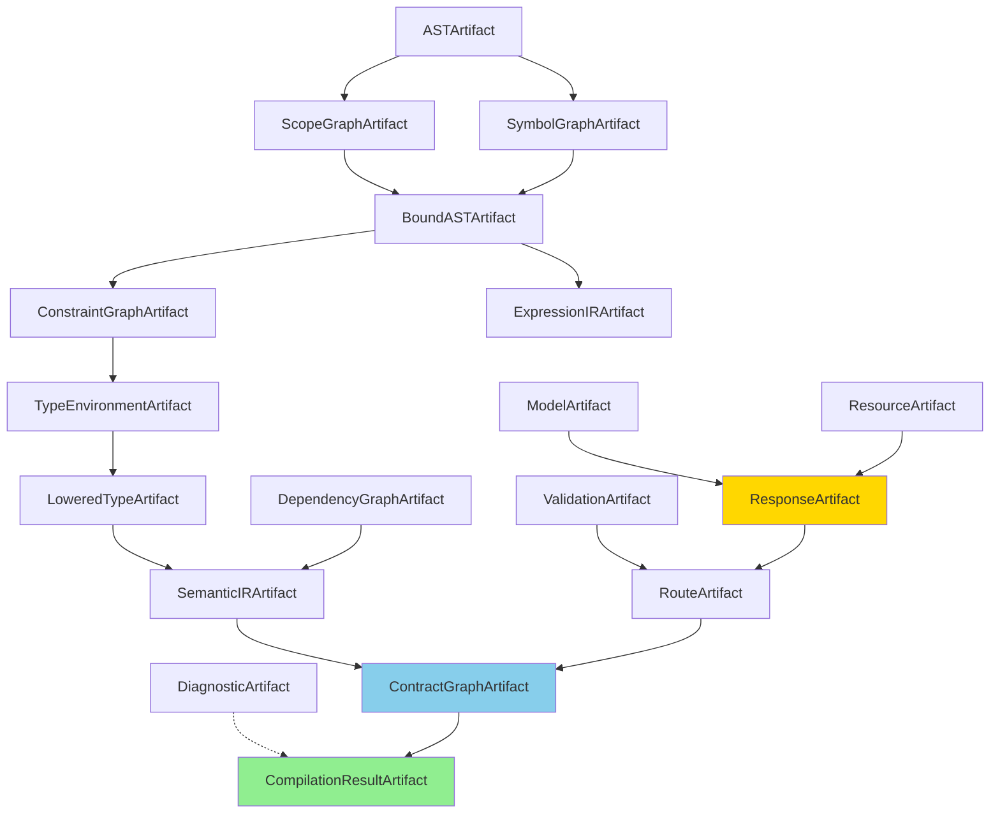
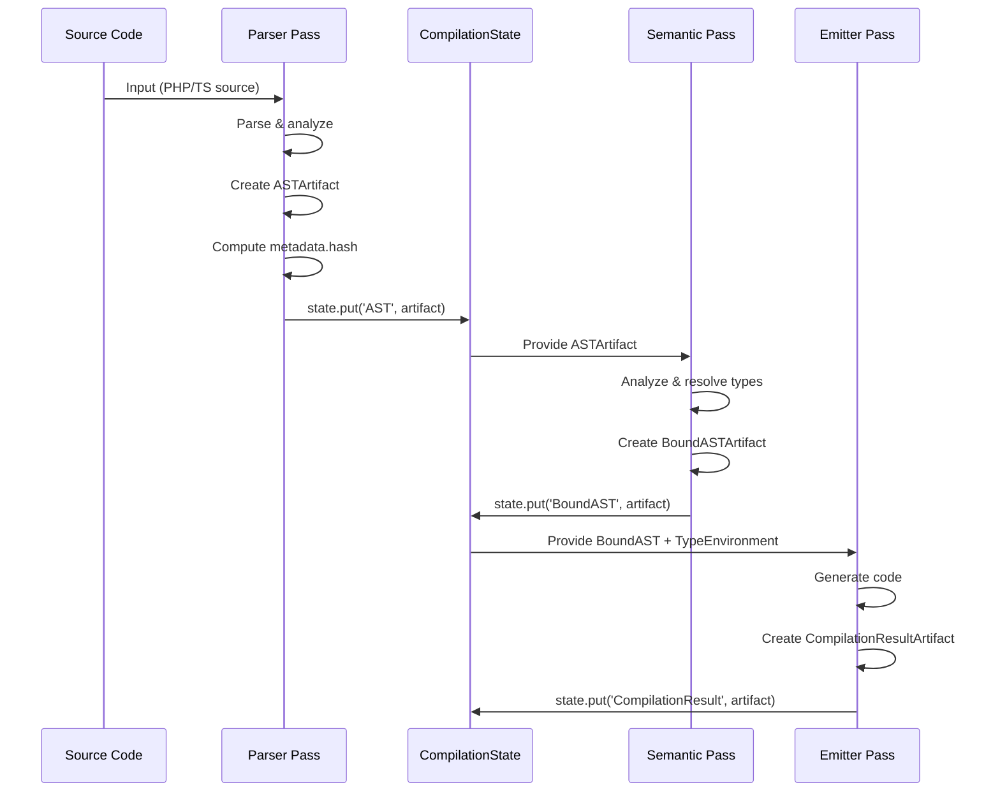

# Compiler Artifacts

## 1. Pendahuluan

### Apa Itu Artifact?

**Artifact** adalah representasi immutable dari hasil analisis compiler pada tahap tertentu dalam pipeline kompilasi. Dalam arsitektur compiler RouteSync, artifact berfungsi sebagai **Single Source of Truth (SSOT)** untuk informasi yang dihasilkan oleh setiap tahap kompilasi.

Artifact berbeda dengan struktur data biasa karena:
- **Immutable**: Tidak dapat diubah setelah dibuat
- **Versioned**: Memiliki metadata tentang kapan dan oleh siapa artifact dibuat
- **Traceable**: Dapat dilacak melalui dependency graph
- **Reproducible**: Menghasilkan hash yang sama untuk input yang sama

### Tujuan Folder `compiler/artifacts`

Folder ini berisi definisi semua jenis artifact yang digunakan dalam compiler pipeline RouteSync. Setiap artifact merepresentasikan output dari tahap kompilasi tertentu:

- **AST (Abstract Syntax Tree)**: Hasil parsing kode sumber
- **Scope Graph**: Hierarki scope lexical untuk resolusi nama
- **Bound AST**: AST dengan referensi symbol yang sudah ter-resolve
- **Symbol Graph**: Tabel symbol global untuk resolusi cross-module
- **Constraint Graph**: Constraint tipe untuk type inference
- **Type Environment**: Hasil solving constraint tipe
- **Expression IR**: Intermediate representation untuk expression
- **Semantic IR**: Representasi semantik untuk optimasi
- **Contract Graph**: Graph contract API untuk code generation


### Peran Artifact dalam Pipeline Compiler

Artifact berfungsi sebagai **media komunikasi** antar tahap compiler. Setiap compiler pass:

1. **Membaca** artifact yang diproduksi oleh pass sebelumnya
2. **Menganalisis** informasi dalam artifact
3. **Memproduksi** artifact baru sebagai hasil analisis
4. **Tidak memodifikasi** artifact yang sudah ada (immutability)

Dengan desain ini, setiap pass compiler menjadi **independent** dan **testable** karena hanya berkomunikasi melalui artifact, bukan melalui direct function calls atau shared mutable state.

### Mengapa Artifact Digunakan?

Artifact architecture memberikan beberapa keuntungan fundamental:

**1. Single Source of Truth**
Setiap informasi hanya memiliki satu pemilik (artifact). Tidak ada duplikasi atau inkonsistensi data antar tahap compiler.

**2. Incremental Compilation**
Dengan fingerprinting (content-based hashing), compiler dapat mendeteksi artifact mana yang berubah dan hanya merecompile bagian yang terpengaruh.

**3. Caching & Reproducibility**
Artifact yang sama selalu menghasilkan hash yang sama. Ini memungkinkan caching yang efektif dan build yang reproducible.

**4. Testability**
Setiap pass dapat ditest secara isolated dengan membuat mock artifact sebagai input.

**5. Debugging**
Artifact dapat diserialisasi dan diinspeksi untuk debugging. Developer dapat melihat state compiler pada setiap tahap.


**6. Parallel Execution**
Pass yang tidak memiliki dependency dapat dijalankan secara paralel karena artifact menjamin immutability.

**7. Pass Coordination**
PassManager dapat mengkoordinasikan execution order berdasarkan artifact dependencies tanpa perlu mengetahui internal logic setiap pass.

## 2. Arsitektur

### Overview Struktur File

Folder `compiler/artifacts` berisi file-file berikut:

```
artifacts/
├── types.ts                        # Type registry & artifact keys
├── Artifact.ts                     # Base classes & interfaces
├── ASTArtifact.ts                  # Abstract Syntax Tree
├── ScopeGraphArtifact.ts           # Lexical scope hierarchy
├── BoundASTArtifact.ts             # AST with symbol bindings
├── SymbolGraphArtifact.ts          # Global symbol table
├── ConstraintGraphArtifact.ts      # Type constraints
├── TypeEnvironmentArtifact.ts      # Solved types
├── ExpressionIRArtifact.ts         # Expression IR
├── LoweredTypeArtifact.ts          # Lowered type representations
├── SemanticIRArtifact.ts           # Semantic IR
├── DiagnosticArtifact.ts           # Compilation diagnostics
├── DependencyGraphArtifact.ts      # Module dependencies
├── ContractGraphArtifact.ts        # API contract graph
├── CompilationResultArtifact.ts    # Final compilation result
└── index.ts                        # Public API exports
```


### Artifact Type System (types.ts)

File `types.ts` mendefinisikan **central type registry** yang memetakan artifact keys ke concrete types mereka.

#### ArtifactRegistry Interface

```typescript
export interface ArtifactRegistry {
    AST: ASTArtifact;
    ScopeGraph: ScopeGraphArtifact;
    BoundAST: BoundASTArtifact;
    SymbolGraph: SymbolGraphArtifact;
    ConstraintGraph: ConstraintGraphArtifact;
    TypeEnvironment: TypeEnvironmentArtifact;
    ExpressionIR: ExpressionIRArtifact;
    LoweredTypeGraph: LoweredTypeArtifact;
    DiagnosticSnapshot: DiagnosticArtifact;
    DependencyGraph: DependencyGraphArtifact;
    SemanticIR: SemanticIRArtifact;
    ContractGraph: ContractGraphArtifact;
    CompilationResult: CompilationResultArtifact;
    
    // Laravel-specific artifacts
    ResponseAnalysis: ResponseArtifact;
    ValidationAnalysis: ValidationArtifact;
    ModelAnalysis: ModelArtifact;
    ResourceAnalysis: ResourceArtifact;
    RouteAnalysis: RouteArtifact;
}
```

Registry ini memastikan **type safety** pada compile-time. TypeScript compiler akan error jika kita mencoba mengakses artifact dengan key yang salah atau jika type artifact tidak match.

#### ArtifactKey Type

```typescript
export type ArtifactKey = keyof ArtifactRegistry;
```

String literal union yang valid sebagai artifact keys.


#### ArtifactStorage Type

```typescript
export type ArtifactStorage = {
    [K in ArtifactKey]?: ArtifactRegistry[K];
};
```

Partial storage yang memungkinkan **incremental artifact accumulation**. Tidak semua artifact perlu present pada saat yang bersamaan. CompilationState menggunakan tipe ini untuk menyimpan artifact secara gradual.

### Base Artifact Classes (Artifact.ts)

#### CompilerArtifact (Abstract Base)

```typescript
export abstract class CompilerArtifact {
    private readonly __brand: typeof artifactBrand = artifactBrand;
    public abstract readonly typeId: ArtifactKey;
    public abstract readonly metadata: ArtifactMetadata;
}
```

Base class untuk semua artifact. Memiliki:
- **Brand**: Symbol unik untuk runtime type safety
- **typeId**: Identifier yang menunjukkan jenis artifact
- **metadata**: Informasi provenance dan versioning

#### TypedArtifact<K> (Generic Base)

```typescript
export abstract class TypedArtifact<K extends ArtifactKey> extends CompilerArtifact {
    public abstract readonly typeId: K;
}
```

Generic artifact yang terikat ke specific artifact key. Ini memberikan **compile-time type safety** sehingga artifact selalu consistent dengan registry.


#### ArtifactMetadata Interface

```typescript
export interface ArtifactMetadata {
    readonly hash: string;           // Content-based hash
    readonly producer: string;       // Pass name yang membuat artifact
    readonly dependencies: readonly string[];  // Artifact dependencies
    readonly timestamp: number;      // Waktu pembuatan (Unix timestamp)
    readonly revision: string;       // Compiler revision
}
```

Setiap artifact membawa metadata tentang:
- **Hash**: Fingerprint untuk change detection
- **Producer**: Pass yang memproduksi artifact ini
- **Dependencies**: Artifact keys yang menjadi dependency
- **Timestamp**: Untuk ordering dan invalidation
- **Revision**: Untuk compatibility checking

#### ArtifactOrigin

```typescript
export type ArtifactOriginKind = 'source' | 'pass' | 'cache';

export interface ArtifactOrigin {
    readonly kind: ArtifactOriginKind;
    readonly producerName?: string;
}
```

Tracking dari mana artifact berasal:
- **source**: Langsung dari source code
- **pass**: Hasil transformasi oleh compiler pass
- **cache**: Loaded dari cache

#### ArtifactEdge

```typescript
export interface ArtifactEdge {
    readonly producer: string;   // Pass producer
    readonly artifact: ArtifactKey;  // Artifact yang diproduksi
    readonly consumer: string;   // Pass consumer
}
```

Merepresentasikan dependency edge dalam compilation graph.


### Concrete Artifact Types

#### ASTArtifact (ASTArtifact.ts)

Artifact pertama dalam pipeline, berisi Abstract Syntax Tree hasil parsing.

```typescript
export class ASTArtifact extends TypedArtifact<'AST'> {
    public readonly typeId = 'AST';
    
    constructor(
        public readonly root: ASTNode,
        public readonly metadata: ArtifactMetadata
    ) {
        super();
    }
}
```

**AST Nodes** yang didukung:
- `ClassDeclaration`: Deklarasi class
- `MethodDeclaration`: Deklarasi method
- `PropertyDeclaration`: Deklarasi property
- `CallExpression`: Function call expression

Setiap node memiliki `FileSpan` untuk melacak source location.

#### ScopeGraphArtifact (ScopeGraphArtifact.ts)

Berisi hierarki lexical scope untuk name resolution.

```typescript
export interface ScopeNode {
    readonly scopeId: number;
    readonly parentId?: number;
    readonly bindings: ReadonlyMap<string, number>;
}

export class ScopeGraphArtifact extends TypedArtifact<'ScopeGraph'> {
    public readonly typeId = 'ScopeGraph';
    
    constructor(
        public readonly scopes: ReadonlyMap<number, ScopeNode>,
        public readonly metadata: ArtifactMetadata
    ) {
        super();
    }
}
```

Scope graph memungkinkan compiler untuk resolve names ke symbols berdasarkan lexical scoping rules.


#### BoundASTArtifact (BoundASTArtifact.ts)

AST dengan symbol references yang sudah di-resolve dan type information.

```typescript
export interface BoundASTNode extends ASTBaseNode {
    readonly kind: 'BoundASTNode';
    readonly symbolId: number;         // Symbol binding
    readonly resolvedType: SemanticType;  // Resolved type
    readonly scopeId: number;          // Scope membership
    readonly references: readonly SymbolReference[];
    readonly children: readonly BoundASTNode[];
}

export class BoundASTArtifact extends TypedArtifact<'BoundAST'> {
    public readonly typeId = 'BoundAST';
    
    constructor(
        public readonly root: BoundASTNode,
        public readonly metadata: ArtifactMetadata
    ) {
        super();
    }
}
```

BoundAST diproduksi setelah semantic analysis. Setiap node sudah tahu:
- Symbol apa yang direferensikan
- Type apa yang dimiliki
- Scope mana yang dimiliki

#### SymbolGraphArtifact (SymbolGraphArtifact.ts)

Global symbol table untuk cross-module resolution.

```typescript
export interface Symbol {
    readonly name: string;
    readonly kind: 'class' | 'method' | 'property';
    readonly type?: SemanticType;
}

export interface SymbolTable {
    readonly symbols: ReadonlyMap<string, Symbol>;
}

export class SymbolGraphArtifact extends TypedArtifact<'SymbolGraph'> {
    public readonly typeId = 'SymbolGraph';
    
    constructor(
        public readonly symbols: SymbolTable,
        public readonly metadata: ArtifactMetadata
    ) {
        super();
    }
}
```

Symbol graph menyimpan **global symbol table** yang dapat diakses oleh semua passes.


#### ConstraintGraphArtifact (ConstraintGraphArtifact.ts)

Type constraints untuk constraint-based type inference.

```typescript
export class ConstraintGraphArtifact extends TypedArtifact<'ConstraintGraph'> {
    public readonly typeId = 'ConstraintGraph';
    
    constructor(
        public readonly constraints: readonly Constraint[],
        public readonly metadata: ArtifactMetadata
    ) {
        super();
    }
}
```

Berisi constraint seperti:
- `T1 = T2` (equality constraint)
- `T1 <: T2` (subtyping constraint)
- `T1 has property P` (structural constraint)

Constraint solver akan memproses artifact ini untuk menghasilkan TypeEnvironmentArtifact.

#### TypeEnvironmentArtifact (TypeEnvironmentArtifact.ts)

Hasil solving type constraints.

```typescript
export class TypeEnvironmentArtifact extends TypedArtifact<'TypeEnvironment'> {
    public readonly typeId = 'TypeEnvironment';
    
    constructor(
        public readonly environment: TypeEnvironment,
        public readonly metadata: ArtifactMetadata
    ) {
        super();
    }
}
```

TypeEnvironment berisi mapping dari type variables ke inferred types. Ini adalah **solved type system** yang digunakan untuk code generation.

#### ExpressionIRArtifact (ExpressionIRArtifact.ts)

Intermediate representation untuk expressions.

```typescript
export class ExpressionIRArtifact extends TypedArtifact<'ExpressionIR'> {
    public readonly typeId = 'ExpressionIR';
    
    constructor(
        public readonly expressions: ReadonlyMap<string, Expression>,
        public readonly metadata: ArtifactMetadata
    ) {
        super();
    }
}
```

Maps expression IDs ke IR representation. Digunakan untuk optimization passes.


#### LoweredTypeArtifact (LoweredTypeArtifact.ts)

Lowered type representations setelah high-level features di-desugar.

```typescript
export class LoweredTypeArtifact extends TypedArtifact<'LoweredTypeGraph'> {
    public readonly typeId = 'LoweredTypeGraph';
    
    constructor(
        public readonly types: ReadonlyMap<string, SemanticType>,
        public readonly metadata: ArtifactMetadata
    ) {
        super();
    }
}
```

High-level type features seperti generics, union types, intersection types di-lower menjadi simpler forms yang lebih mudah untuk code generation.

#### SemanticIRArtifact (SemanticIRArtifact.ts)

Semantic intermediate representation untuk optimization dan code generation.

```typescript
export class SemanticIRArtifact extends TypedArtifact<'SemanticIR'> {
    public readonly typeId = 'SemanticIR';
    
    constructor(
        public readonly rootNodes: readonly SemanticIRNode[],
        public readonly metadata: ArtifactMetadata
    ) {
        super();
    }
}
```

Semantic IR adalah **typed, lowered representation** yang ready untuk optimizations dan backend code generation.

#### DiagnosticArtifact (DiagnosticArtifact.ts)

Compilation diagnostics (errors, warnings).

```typescript
export class DiagnosticArtifact extends TypedArtifact<'DiagnosticSnapshot'> {
    public readonly typeId = 'DiagnosticSnapshot';
    
    constructor(
        public readonly diagnostics: DiagnosticBag,
        public readonly metadata: ArtifactMetadata
    ) {
        super();
    }
}
```

Accumulates diagnostics dari semua passes. DiagnosticBag adalah append-only collection untuk thread safety.


#### DependencyGraphArtifact (DependencyGraphArtifact.ts)

Module dependency graph untuk incremental compilation.

```typescript
export class DependencyGraphArtifact extends TypedArtifact<'DependencyGraph'> {
    public readonly typeId = 'DependencyGraph';
    
    constructor(
        public readonly graph: DependencyGraph,
        public readonly metadata: ArtifactMetadata
    ) {
        super();
    }
}
```

Tracks forward dan reverse dependencies antar modules. Digunakan untuk:
- Incremental compilation (recompile only affected modules)
- Parallel compilation (independent modules dapat parallel)
- Cycle detection

#### ContractGraphArtifact (ContractGraphArtifact.ts)

API contract graph, artifact terakhir sebelum code generation.

```typescript
export class ContractGraphArtifact extends TypedArtifact<'ContractGraph'> {
    public readonly typeId = 'ContractGraph';
    
    constructor(
        public readonly graph: ContractGraph,
        public readonly metadata: ArtifactMetadata
    ) {
        super();
    }
}
```

ContractGraph merepresentasikan **complete API contracts** dengan type information, validation rules, dan dependencies. Backend emitters menggunakan artifact ini untuk generate code.

#### CompilationResultArtifact (CompilationResultArtifact.ts)

Final artifact berisi complete compilation result.

```typescript
export class CompilationResultArtifact extends TypedArtifact<'CompilationResult'> {
    public readonly typeId = 'CompilationResult';
    
    constructor(
        public readonly result: CompilationResult,
        public readonly metadata: ArtifactMetadata
    ) {
        super();
    }
}
```

Aggregates semua artifacts dan provides access ke final output.


### Laravel-Specific Artifacts

RouteSync juga mendefinisikan artifacts khusus untuk Laravel analysis dalam `ResponseArtifact.ts`:

#### ResponseArtifact

Artifact untuk HTTP response analysis.

```typescript
export class ResponseArtifact extends TypedArtifact<'ResponseAnalysis'> {
    public readonly typeId = 'ResponseAnalysis';
    
    constructor(
        public readonly id: string,
        public readonly descriptor: ResponseDescriptor,
        public readonly body: ResponseBody | undefined,
        public readonly confidence: ConfidenceScore,
        public readonly span: FileSpan | undefined,
        public readonly metadata: ArtifactMetadata
    ) {
        super();
    }
}
```

ResponseArtifact memisahkan concerns:
- **Descriptor**: HOW response dikirim (HTTP transport)
- **Body**: WHAT response berisi (data structure)

#### ValidationArtifact

Untuk Laravel FormRequest validation rules.

```typescript
export class ValidationArtifact extends TypedArtifact<'ValidationAnalysis'> {
    public readonly typeId = 'ValidationAnalysis';
    
    constructor(
        public readonly id: string,
        public readonly rules: Record<string, readonly string[]>,
        public readonly messages: Record<string, string> | undefined,
        public readonly span: FileSpan | undefined,
        public readonly metadata: ArtifactMetadata
    ) {
        super();
    }
}
```

Pure analysis of validation rules tanpa generation logic.


#### ModelArtifact

Eloquent model metadata.

```typescript
export class ModelArtifact extends TypedArtifact<'ModelAnalysis'> {
    public readonly typeId = 'ModelAnalysis';
    
    constructor(
        public readonly id: string,
        public readonly name: string,
        public readonly table: string,
        public readonly attributes: readonly ModelAttribute[],
        public readonly relationships: readonly RelationshipDescriptor[] | undefined,
        public readonly span: FileSpan | undefined,
        public readonly metadata: ArtifactMetadata
    ) {
        super();
    }
}
```

Berisi model structure, attributes, dan relationships.

#### ResourceArtifact

Laravel Resource metadata.

```typescript
export class ResourceArtifact extends TypedArtifact<'ResourceAnalysis'> {
    public readonly typeId = 'ResourceAnalysis';
    
    constructor(
        public readonly id: string,
        public readonly name: string,
        public readonly model: string | undefined,
        public readonly properties: readonly PropertyDescriptor[],
        public readonly conditionalAttributes: readonly ConditionalAttribute[] | undefined,
        public readonly span: FileSpan | undefined,
        public readonly metadata: ArtifactMetadata
    ) {
        super();
    }
}
```

#### RouteArtifact

Umbrella artifact combining all route analysis.

```typescript
export class RouteArtifact extends TypedArtifact<'RouteAnalysis'> {
    public readonly typeId = 'RouteAnalysis';
    
    constructor(
        public readonly id: string,
        public readonly method: string,
        public readonly path: string,
        public readonly controller: string,
        public readonly action: string,
        public readonly middleware: readonly string[] | undefined,
        public readonly parameters: readonly RouteParameter[] | undefined,
        public readonly responseRef: string | undefined,
        public readonly validationRef: string | undefined,
        public readonly span: FileSpan | undefined,
        public readonly metadata: ArtifactMetadata
    ) {
        super();
    }
}
```

RouteArtifact berisi references ke artifacts lain (by ID), bukan nested objects. Ini mempertahankan **flat structure** dan **referential transparency**.


### Hubungan Antar Artifact

Berikut adalah diagram Mermaid yang menunjukkan dependency graph antar artifacts:



**Keterangan**:
- **Solid arrows**: Data dependency (artifact A depends on artifact B)
- **Dashed arrows**: Aggregation (artifact A includes artifact B)
- **Green**: Final output artifact
- **Blue**: Pre-code-generation artifact
- **Yellow**: Laravel-specific artifacts


## 3. Cara Kerja

### Lifecycle Artifact dalam Compiler Pipeline

Berikut adalah alur lengkap lifecycle artifact dari pembuatan hingga digunakan:



### Proses Pembuatan Artifact

Setiap compiler pass mengikuti pattern berikut untuk membuat artifact:

**1. Collect Analysis Data**
Pass menganalisis input (bisa dari source atau artifact sebelumnya).

**2. Build Artifact Data Structure**
Pass membuat data structure yang immutable.

**3. Compute Metadata**
- Generate content-based hash
- Record producer name
- List dependencies
- Add timestamp dan revision

**4. Instantiate Artifact**
Create artifact instance dengan typed class.

**5. Store in CompilationState**
Put artifact ke state dengan appropriate key.


### Bagaimana Artifact Digunakan oleh Compiler Components

#### Analysis Phase

Analysis passes membaca artifact untuk mendapatkan informasi:

```typescript
class SemanticAnalysisPass implements CompilerPass {
    async execute(state: CompilationState): Promise<CompilationState> {
        // Read AST artifact
        const astArtifact = state.require(ArtifactKeyWitness.for('AST'));
        const ast = astArtifact.root;
        
        // Analyze
        const boundAST = this.analyzeAndBind(ast);
        
        // Create new artifact
        const metadata: ArtifactMetadata = {
            hash: this.computeHash(boundAST),
            producer: 'SemanticAnalysisPass',
            dependencies: ['AST', 'SymbolGraph'],
            timestamp: Date.now(),
            revision: '1.0.0'
        };
        
        const artifact = new BoundASTArtifact(boundAST, metadata);
        
        // Store in state
        return state.put('BoundAST', artifact);
    }
}
```

#### Verification Phase

Verification passes membaca multiple artifacts untuk validasi:

```typescript
class TypeCheckPass implements CompilerPass {
    async execute(state: CompilationState): Promise<CompilationState> {
        const boundAST = state.require(ArtifactKeyWitness.for('BoundAST'));
        const typeEnv = state.require(ArtifactKeyWitness.for('TypeEnvironment'));
        
        // Verify type consistency
        const diagnostics = this.typeCheck(boundAST.root, typeEnv.environment);
        
        // Create diagnostic artifact
        const artifact = new DiagnosticArtifact(diagnostics, metadata);
        
        return state.put('DiagnosticSnapshot', artifact);
    }
}
```


#### IR Building Phase

IR builders transform artifacts ke intermediate representation:

```typescript
class IRBuildingPass implements CompilerPass {
    async execute(state: CompilationState): Promise<CompilationState> {
        const semanticIR = state.require(ArtifactKeyWitness.for('SemanticIR'));
        const typeEnv = state.require(ArtifactKeyWitness.for('TypeEnvironment'));
        
        // Build contract graph
        const contractGraph = this.buildContractGraph(semanticIR, typeEnv);
        
        const artifact = new ContractGraphArtifact(contractGraph, metadata);
        
        return state.put('ContractGraph', artifact);
    }
}
```

#### Code Emission Phase

Emitters menggunakan final artifacts untuk generate code:

```typescript
class TypeScriptEmitter {
    emit(state: CompilationState): GeneratedFile[] {
        const contractGraph = state.require(ArtifactKeyWitness.for('ContractGraph'));
        const typeEnv = state.require(ArtifactKeyWitness.for('TypeEnvironment'));
        
        // Generate TypeScript code
        return this.generateTypeScript(contractGraph.graph, typeEnv.environment);
    }
}
```

### Alur Data Flow dalam Pipeline

```mermaid
flowchart LR
    A[Source Code] --> B[Parser Pass]
    B --> C[AST Artifact]
    C --> D[Scope Analysis Pass]
    D --> E[ScopeGraph Artifact]
    C --> F[Symbol Analysis Pass]
    F --> G[SymbolGraph Artifact]
    E --> H[Binding Pass]
    G --> H
    H --> I[BoundAST Artifact]
    I --> J[Constraint Generation]
    J --> K[ConstraintGraph Artifact]
    K --> L[Type Solver]
    L --> M[TypeEnvironment Artifact]
    M --> N[IR Builder]
    I --> N
    N --> O[SemanticIR Artifact]
    O --> P[Contract Builder]
    P --> Q[ContractGraph Artifact]
    Q --> R[Code Emitters]
    R --> S[Generated Code]
    
    style C fill:#FFE4B5
    style E fill:#FFE4B5
    style G fill:#FFE4B5
    style I fill:#FFE4B5
    style K fill:#FFE4B5
    style M fill:#FFE4B5
    style O fill:#FFE4B5
    style Q fill:#87CEEB
    style S fill:#90EE90
```



**Legend**:
- **Tan boxes**: Artifacts (immutable snapshots)
- **White boxes**: Passes (transformations)
- **Blue box**: Pre-emission artifact
- **Green box**: Final output


## 4. Cara Penggunaan

### Membuat Artifact Baru

#### Contoh 1: Creating ASTArtifact

```typescript
import { ASTArtifact, ClassDeclaration, ArtifactMetadata } from './artifacts';
import { FileSpan } from '../types/FileSpan';

function createASTArtifact(sourceCode: string): ASTArtifact {
    // Parse source code
    const rootNode = new ClassDeclaration(
        new FileSpan('/path/to/file.ts', 0, 100),
        'UserController'
    );
    
    // Create metadata
    const metadata: ArtifactMetadata = {
        hash: computeContentHash(rootNode),
        producer: 'ParserPass',
        dependencies: [],
        timestamp: Date.now(),
        revision: '1.0.0'
    };
    
    // Create artifact
    return new ASTArtifact(rootNode, metadata);
}

function computeContentHash(node: any): string {
    const content = JSON.stringify(node);
    // Use crypto for real hash
    return require('crypto')
        .createHash('sha256')
        .update(content)
        .digest('hex');
}
```

#### Contoh 2: Creating ResponseArtifact dengan Builder

```typescript
import { ResponseArtifactBuilder } from './artifacts/ResponseArtifact';

function createResponseArtifact(): ResponseArtifact {
    return new ResponseArtifactBuilder()
        .id('users.show.Response')
        .resource('UserResource', 'User', 'single', 1.0, 'Explicit return')
        .status(200)
        .contentType('application/json')
        .confidence({
            score: 1.0,
            reasons: ['Explicit UserResource return type'],
            method: 'explicit'
        })
        .metadata({
            producer: 'ResponseAnalysisPass',
            dependencies: ['UserModel', 'UserResource'],
            revision: '1.0.0'
        })
        .build();
}
```


### Mengakses Artifact dari CompilationState

#### Contoh 3: Reading Artifact Safely

```typescript
import { CompilationState } from '../passes/CompilationState';
import { ArtifactKeyWitness } from '../passes/ArtifactKeyWitness';

function processSemanticAnalysis(state: CompilationState): void {
    // Type-safe artifact access
    const astArtifact = state.require(ArtifactKeyWitness.for('AST'));
    
    // Access artifact data
    const rootNode = astArtifact.root;
    const producer = astArtifact.metadata.producer;
    
    console.log(`Processing AST from ${producer}`);
    console.log(`Hash: ${astArtifact.metadata.hash}`);
    
    // Work with the artifact
    analyzeAST(rootNode);
}
```

#### Contoh 4: Creating and Storing New Artifact

```typescript
class MyAnalysisPass implements CompilerPass {
    async execute(state: CompilationState): Promise<CompilationState> {
        // Read existing artifacts
        const ast = state.require(ArtifactKeyWitness.for('AST'));
        const scopeGraph = state.require(ArtifactKeyWitness.for('ScopeGraph'));
        
        // Perform analysis
        const analysisResult = this.performAnalysis(ast, scopeGraph);
        
        // Create metadata
        const metadata: ArtifactMetadata = {
            hash: this.computeHash(analysisResult),
            producer: 'MyAnalysisPass',
            dependencies: ['AST', 'ScopeGraph'],
            timestamp: Date.now(),
            revision: '1.0.0'
        };
        
        // Create artifact (example: BoundAST)
        const artifact = new BoundASTArtifact(analysisResult, metadata);
        
        // Store in state (returns NEW state, doesn't mutate)
        return state.put('BoundAST', artifact);
    }
}
```


### Kapan Setiap Artifact Digunakan

| Artifact | Dibuat Oleh | Digunakan Oleh | Timing |
|----------|-------------|----------------|---------|
| **ASTArtifact** | Parser | Semantic Analysis, Scope Analysis | Awal pipeline |
| **ScopeGraphArtifact** | Scope Analysis Pass | Binding Pass | Setelah parsing |
| **SymbolGraphArtifact** | Symbol Analysis Pass | Binding Pass, Type Checking | Setelah parsing |
| **BoundASTArtifact** | Binding Pass | Constraint Generation, IR Building | Setelah binding |
| **ConstraintGraphArtifact** | Constraint Generation | Type Solver | Sebelum type inference |
| **TypeEnvironmentArtifact** | Type Solver | IR Lowering, Verification | Setelah solving |
| **ExpressionIRArtifact** | Expression Lowering | Optimization Passes | Mid-pipeline |
| **LoweredTypeArtifact** | Type Lowering Pass | Semantic IR Building | Mid-pipeline |
| **SemanticIRArtifact** | Semantic IR Builder | Contract Building, Optimization | Pre-emission |
| **DiagnosticArtifact** | All Passes | Final Report, IDE Integration | Throughout pipeline |
| **DependencyGraphArtifact** | Dependency Analysis | Incremental Compilation | Throughout pipeline |
| **ContractGraphArtifact** | Contract Builder | Code Emitters | Pre-emission |
| **CompilationResultArtifact** | Final Pass | Output/Cache | End pipeline |
| **ResponseArtifact** | Response Analysis Pass | Contract Builder, Emitters | Laravel analysis |
| **ValidationArtifact** | Validation Analysis Pass | Contract Builder, Emitters | Laravel analysis |
| **ModelArtifact** | Model Scanner | Response Analysis, Contract Builder | Laravel analysis |
| **ResourceArtifact** | Resource Scanner | Response Analysis, Contract Builder | Laravel analysis |
| **RouteArtifact** | Route Scanner | Contract Builder | Laravel analysis |


## 5. Panduan Pengembangan

### Kapan Perlu Menambahkan Artifact Baru

Pertimbangkan menambahkan artifact baru ketika:

1. **New Analysis Phase**: Anda menambahkan phase analisis baru yang menghasilkan informasi structural yang akan digunakan oleh passes lain.

2. **Caching Requirement**: Informasi perlu di-cache untuk incremental compilation.

3. **Cross-Pass Communication**: Multiple passes perlu berbagi informasi complex yang tidak fit dalam existing artifacts.

4. **Verification Needs**: Anda perlu menyimpan snapshot untuk verification atau debugging.

5. **Independent Concern**: Informasi merepresentasikan concern yang orthogonal dengan existing artifacts.

**JANGAN** buat artifact baru untuk:
- Temporary intermediate data dalam single pass
- Data yang hanya digunakan oleh satu pass dan tidak perlu di-cache
- Simple aggregations dari existing artifacts (use composition instead)

### Best Practices dalam Mendesain Artifact

#### 1. Immutability

**✅ GOOD**: All fields readonly

```typescript
export class MyArtifact extends TypedArtifact<'MyAnalysis'> {
    constructor(
        public readonly data: ReadonlyArray<Data>,
        public readonly metadata: ArtifactMetadata
    ) {
        super();
    }
}
```

**❌ BAD**: Mutable fields

```typescript
export class MyArtifact extends TypedArtifact<'MyAnalysis'> {
    public data: Data[];  // ❌ Can be mutated!
    public metadata: ArtifactMetadata;
}
```


#### 2. Type Safety

**✅ GOOD**: Strongly typed with discriminated unions

```typescript
export type ResponseBody =
    | { type: 'resource'; resource: string; model?: string }
    | { type: 'model'; model: string; attributes: Attribute[] }
    | { type: 'primitive'; primitiveType: string };

export function isResourceBody(body: ResponseBody): body is { type: 'resource'; resource: string } {
    return body.type === 'resource';
}
```

**❌ BAD**: Loose typing with optional fields

```typescript
export interface ResponseBody {
    type?: string;
    resource?: string;
    model?: string;
    primitiveType?: string;
}
```

#### 3. Pure Analysis (No Backend Concerns)

**✅ GOOD**: Artifact contains only analysis results

```typescript
export class ResponseArtifact extends TypedArtifact<'ResponseAnalysis'> {
    constructor(
        public readonly id: string,
        public readonly descriptor: ResponseDescriptor,  // WHAT we found
        public readonly body: ResponseBody | undefined,  // WHAT the structure is
        public readonly confidence: ConfidenceScore,     // HOW sure we are
        public readonly metadata: ArtifactMetadata
    ) {
        super();
    }
}
```

**❌ BAD**: Artifact contains generation decisions

```typescript
export class ResponseArtifact extends TypedArtifact<'ResponseAnalysis'> {
    constructor(
        public readonly descriptor: ResponseDescriptor,
        public readonly derivedNames: {              // ❌ Backend concern!
            typeName: string,
            hookName: string,
            schemaName: string
        },
        public readonly generationOptions: {         // ❌ Backend concern!
            includeZod: boolean,
            includeHooks: boolean
        }
    ) {
        super();
    }
}
```


#### 4. Deterministic Hashing

**✅ GOOD**: Content-based hash (no timestamp in hash computation)

```typescript
private computeHash(): string {
    const content = JSON.stringify({
        id: this._id,
        descriptor: this._descriptor,
        body: this._body,
        confidence: this._confidence,
        // NO timestamp here!
    });
    return crypto.createHash('sha256').update(content).digest('hex');
}
```

**❌ BAD**: Including timestamp or random data in hash

```typescript
private computeHash(): string {
    const content = JSON.stringify({
        ...this._data,
        timestamp: Date.now(),  // ❌ Non-deterministic!
        random: Math.random()   // ❌ Non-deterministic!
    });
    return crypto.createHash('sha256').update(content).digest('hex');
}
```

#### 5. Flat References (No Deep Nesting)

**✅ GOOD**: References by ID

```typescript
export class RouteArtifact extends TypedArtifact<'RouteAnalysis'> {
    constructor(
        public readonly id: string,
        public readonly method: string,
        public readonly path: string,
        public readonly responseRef: string | undefined,    // ✅ Reference by ID
        public readonly validationRef: string | undefined,  // ✅ Reference by ID
        public readonly metadata: ArtifactMetadata
    ) {
        super();
    }
}
```

**❌ BAD**: Nested artifacts

```typescript
export class RouteArtifact extends TypedArtifact<'RouteAnalysis'> {
    constructor(
        public readonly id: string,
        public readonly method: string,
        public readonly response: ResponseArtifact,      // ❌ Nested object
        public readonly validation: ValidationArtifact,  // ❌ Nested object
        public readonly metadata: ArtifactMetadata
    ) {
        super();
    }
}
```


### Anti-Patterns yang Harus Dihindari

#### 1. ❌ Mutating Artifacts

```typescript
// NEVER do this
const artifact = state.require(ArtifactKeyWitness.for('AST'));
artifact.root.name = 'Modified';  // ❌ Mutation!
```

Artifacts harus **immutable**. Jika perlu "modify", create new artifact.

#### 2. ❌ Circular Dependencies

```typescript
// ❌ BAD: Circular reference
export class ArtifactA extends TypedArtifact<'A'> {
    constructor(
        public readonly refToB: ArtifactB  // References B
    ) { super(); }
}

export class ArtifactB extends TypedArtifact<'B'> {
    constructor(
        public readonly refToA: ArtifactA  // References A back!
    ) { super(); }
}
```

Use references by ID instead of direct object references.

#### 3. ❌ Business Logic dalam Artifacts

```typescript
// ❌ BAD: Artifact should not contain logic
export class ResponseArtifact extends TypedArtifact<'ResponseAnalysis'> {
    constructor(
        public readonly descriptor: ResponseDescriptor,
        public readonly metadata: ArtifactMetadata
    ) {
        super();
    }
    
    // ❌ Business logic belongs in Pass, not Artifact
    generateTypeName(): string {
        return this.descriptor.transport === 'resource' 
            ? `${this.descriptor.resource}Type`
            : 'UnknownType';
    }
}
```

Artifacts hanya **data containers**. Business logic harus di Pass atau Builder.


#### 4. ❌ Implicit Dependencies

```typescript
// ❌ BAD: Dependencies not declared
export class MyArtifact extends TypedArtifact<'MyAnalysis'> {
    constructor(
        public readonly data: MyData,
        public readonly metadata: ArtifactMetadata
    ) {
        super();
    }
}

// MyData internally uses AST and SymbolGraph but not declared!
```

**✅ GOOD**: Explicit dependencies

```typescript
const metadata: ArtifactMetadata = {
    hash: computeHash(data),
    producer: 'MyPass',
    dependencies: ['AST', 'SymbolGraph'],  // ✅ Explicit!
    timestamp: Date.now(),
    revision: '1.0.0'
};
```

#### 5. ❌ Non-Serializable Data

```typescript
// ❌ BAD: Function references, closures, class instances
export class BadArtifact extends TypedArtifact<'Bad'> {
    constructor(
        public readonly callback: () => void,      // ❌ Can't serialize
        public readonly classInstance: MyClass,    // ❌ Can't serialize
        public readonly metadata: ArtifactMetadata
    ) {
        super();
    }
}
```

Artifacts harus **serializable** untuk caching dan debugging. Only use plain data structures.

### Konvensi Penamaan Artifact

1. **Artifact Class**: `<Domain><Purpose>Artifact`
   - Example: `ResponseArtifact`, `ValidationArtifact`, `ASTArtifact`

2. **Artifact Key**: `<Domain><Purpose>`
   - Example: `'ResponseAnalysis'`, `'ValidationAnalysis'`, `'AST'`

3. **Supporting Types**: `<Domain><Concept>`
   - Example: `ResponseDescriptor`, `ResponseBody`, `ConfidenceScore`

4. **Builder Class**: `<ArtifactName>Builder`
   - Example: `ResponseArtifactBuilder`, `ASTArtifactBuilder`


### Prinsip SSOT (Single Source of Truth)

Artifact architecture menegakkan **Single Source of Truth** principle:

**Setiap informasi hanya memiliki satu pemilik (artifact).**

#### Contoh: Response Type Information

**❌ BAD**: Multiple sources of truth

```typescript
// In Parser
const parsedResponse = { type: 'UserResource', isCollection: true };

// In Semantic Analyzer (re-detects!)
const semanticResponse = inferResponseType(controller);  // Duplicate detection

// In Generator (re-detects again!)
const generatorResponse = analyzeResponse(route);  // Triple detection
```

**✅ GOOD**: Single source of truth (ResponseArtifact)

```typescript
// Response Analysis Pass creates ResponseArtifact (ONLY place that detects)
const artifact = new ResponseArtifactBuilder()
    .resource('UserResource', 'User', 'collection')
    .build();

// All other passes READ from artifact
const semanticPass = state.require(ArtifactKeyWitness.for('ResponseAnalysis'));
const generatorPass = state.require(ArtifactKeyWitness.for('ResponseAnalysis'));
```

### Immutability Enforcement

Artifacts enforce immutability di multiple levels:

1. **Readonly Properties**: TypeScript `readonly` modifier
2. **Readonly Collections**: `ReadonlyArray`, `ReadonlyMap`, `ReadonlySet`
3. **Frozen Objects**: `Object.freeze()` untuk runtime enforcement (optional)
4. **Structural Sharing**: Reuse unchanged parts saat create new artifacts

```typescript
// Example: Creating new artifact with partial changes
function updateMetadata(
    artifact: ResponseArtifact, 
    newHash: string
): ResponseArtifact {
    // Create NEW artifact, don't mutate
    return new ResponseArtifact(
        artifact.id,
        artifact.descriptor,     // ✅ Reuse unchanged
        artifact.body,           // ✅ Reuse unchanged
        artifact.confidence,     // ✅ Reuse unchanged
        artifact.span,           // ✅ Reuse unchanged
        {
            ...artifact.metadata,
            hash: newHash         // Only hash changed
        }
    );
}
```


## 6. Struktur Folder

### Penjelasan Fungsi Setiap File

| File | Tanggung Jawab | Dependencies |
|------|----------------|--------------|
| **types.ts** | Central type registry, artifact keys, storage types | None |
| **Artifact.ts** | Base classes, metadata interface, origin tracking | types.ts |
| **ASTArtifact.ts** | Abstract syntax tree artifact | Artifact.ts, FileSpan |
| **ScopeGraphArtifact.ts** | Lexical scope hierarchy artifact | Artifact.ts |
| **BoundASTArtifact.ts** | AST with symbol bindings artifact | Artifact.ts, SemanticType |
| **SymbolGraphArtifact.ts** | Global symbol table artifact | Artifact.ts, SemanticType |
| **ConstraintGraphArtifact.ts** | Type constraint artifact | Artifact.ts, Constraint |
| **TypeEnvironmentArtifact.ts** | Solved type environment artifact | Artifact.ts, TypeEnvironment |
| **ExpressionIRArtifact.ts** | Expression IR artifact | Artifact.ts, Expression |
| **LoweredTypeArtifact.ts** | Lowered type artifact | Artifact.ts, SemanticType |
| **SemanticIRArtifact.ts** | Semantic IR artifact | Artifact.ts, SemanticIR |
| **DiagnosticArtifact.ts** | Compilation diagnostics artifact | Artifact.ts, DiagnosticBag |
| **DependencyGraphArtifact.ts** | Module dependency graph artifact | Artifact.ts, Graph |
| **ContractGraphArtifact.ts** | API contract graph artifact | Artifact.ts, ContractGraph |
| **CompilationResultArtifact.ts** | Final compilation result artifact | Artifact.ts, CompilationResult |
| **index.ts** | Public API exports | All artifacts |

### Dependency Flow

```
types.ts (foundation)
    ↓
Artifact.ts (base classes)
    ↓
Concrete Artifacts (AST, Scope, Symbol, etc.)
    ↓
index.ts (barrel exports)
```

Semua concrete artifacts depend on `Artifact.ts` untuk base classes dan `types.ts` untuk registry types.


### Ringkasan Tanggung Jawab File

**types.ts**: Type System Foundation
- Defines `ArtifactRegistry` mapping keys to types
- Provides `ArtifactKey` type alias
- Defines `ArtifactStorage` for partial storage

**Artifact.ts**: Base Infrastructure
- `CompilerArtifact` abstract base class
- `TypedArtifact<K>` generic base with type safety
- `ArtifactMetadata` interface for provenance
- `ArtifactOrigin` for tracking artifact creation
- `ArtifactEdge` for dependency graph

**Concrete Artifacts**: Domain-Specific Data
- Each file defines one primary artifact class
- Contains supporting types specific to that artifact
- Implements `TypedArtifact<K>` with correct key
- May include builder classes for complex construction

**index.ts**: Public API
- Re-exports all artifact types
- Single entry point untuk consumers
- Maintains clean public API surface

## 7. Referensi Implementasi

### Artifact Registry Summary

RouteSync compiler menggunakan **18 artifact types** yang diorganisir dalam registry:

**Core Compiler Artifacts (13)**:
1. `AST` → `ASTArtifact`: Abstract syntax tree
2. `ScopeGraph` → `ScopeGraphArtifact`: Lexical scopes
3. `BoundAST` → `BoundASTArtifact`: Bound AST with symbols
4. `SymbolGraph` → `SymbolGraphArtifact`: Global symbol table
5. `ConstraintGraph` → `ConstraintGraphArtifact`: Type constraints
6. `TypeEnvironment` → `TypeEnvironmentArtifact`: Solved types
7. `ExpressionIR` → `ExpressionIRArtifact`: Expression IR
8. `LoweredTypeGraph` → `LoweredTypeArtifact`: Lowered types
9. `SemanticIR` → `SemanticIRArtifact`: Semantic IR
10. `DiagnosticSnapshot` → `DiagnosticArtifact`: Diagnostics
11. `DependencyGraph` → `DependencyGraphArtifact`: Module deps
12. `ContractGraph` → `ContractGraphArtifact`: API contracts
13. `CompilationResult` → `CompilationResultArtifact`: Final result


**Laravel-Specific Artifacts (5)**:
14. `ResponseAnalysis` → `ResponseArtifact`: HTTP response analysis
15. `ValidationAnalysis` → `ValidationArtifact`: FormRequest validation
16. `ModelAnalysis` → `ModelArtifact`: Eloquent model metadata
17. `ResourceAnalysis` → `ResourceArtifact`: Laravel Resource metadata
18. `RouteAnalysis` → `RouteArtifact`: Route metadata with refs

### Artifact Usage dalam Compiler Pipeline

#### Phase 1: Parsing & AST Building

**Inputs**: Source code files

**Artifacts Created**:
- `ASTArtifact`: Parsed syntax tree

**Used By**: All subsequent phases

#### Phase 2: Scope & Symbol Analysis

**Inputs**: `ASTArtifact`

**Artifacts Created**:
- `ScopeGraphArtifact`: Scope hierarchy
- `SymbolGraphArtifact`: Global symbols

**Used By**: Binding, Type checking

#### Phase 3: Binding & Type Inference

**Inputs**: `ASTArtifact`, `ScopeGraphArtifact`, `SymbolGraphArtifact`

**Artifacts Created**:
- `BoundASTArtifact`: AST with resolved symbols
- `ConstraintGraphArtifact`: Type constraints

**Used By**: Type solver, IR building

#### Phase 4: Type Solving

**Inputs**: `ConstraintGraphArtifact`, `BoundASTArtifact`

**Artifacts Created**:
- `TypeEnvironmentArtifact`: Solved types

**Used By**: Type lowering, verification


#### Phase 5: IR Lowering

**Inputs**: `BoundASTArtifact`, `TypeEnvironmentArtifact`

**Artifacts Created**:
- `ExpressionIRArtifact`: Expression IR
- `LoweredTypeArtifact`: Simplified types
- `SemanticIRArtifact`: Semantic IR

**Used By**: Optimization, Contract building

#### Phase 6: Laravel Analysis (Optional)

**Inputs**: Source PHP files, Database schema

**Artifacts Created**:
- `ModelArtifact`: Eloquent models
- `ResourceArtifact`: Laravel Resources
- `ValidationArtifact`: FormRequest rules
- `ResponseArtifact`: Response analysis
- `RouteArtifact`: Route metadata

**Used By**: Contract building

#### Phase 7: Contract Building

**Inputs**: `SemanticIRArtifact`, Laravel artifacts (if present)

**Artifacts Created**:
- `ContractGraphArtifact`: Complete API contracts

**Used By**: Code emitters

#### Phase 8: Diagnostics & Dependencies

**Throughout Pipeline**:
- `DiagnosticArtifact`: Accumulated errors/warnings
- `DependencyGraphArtifact`: Module dependencies

**Used By**: Reporting, Incremental compilation

#### Phase 9: Final Output

**Inputs**: `ContractGraphArtifact`, `DiagnosticArtifact`

**Artifacts Created**:
- `CompilationResultArtifact`: Complete result

**Used By**: Output writer, Cache


### Hubungan dengan Komponen Compiler Lainnya

#### Dengan Analysis

Analysis passes **membaca** artifacts dan **menghasilkan** insights:

```typescript
// Analysis reads AST artifact
const astArtifact = state.require(ArtifactKeyWitness.for('AST'));

// Performs analysis
const scopeGraph = analyzeScopeStructure(astArtifact.root);

// Creates new artifact
const artifact = new ScopeGraphArtifact(scopeGraph, metadata);
return state.put('ScopeGraph', artifact);
```

#### Dengan Verification

Verification passes **membaca** multiple artifacts untuk validasi:

```typescript
// Read multiple artifacts
const boundAST = state.require(ArtifactKeyWitness.for('BoundAST'));
const typeEnv = state.require(ArtifactKeyWitness.for('TypeEnvironment'));

// Cross-verify
const errors = verifyTypeConsistency(boundAST, typeEnv);

// Update diagnostics artifact
const diagnostics = state.require(ArtifactKeyWitness.for('DiagnosticSnapshot'));
const updated = diagnostics.diagnostics.addAll(errors);
return state.put('DiagnosticSnapshot', new DiagnosticArtifact(updated, metadata));
```

#### Dengan IR Building

IR builders **transform** artifacts ke intermediate representation:

```typescript
// Read semantic artifacts
const semanticIR = state.require(ArtifactKeyWitness.for('SemanticIR'));
const typeEnv = state.require(ArtifactKeyWitness.for('TypeEnvironment'));

// Build contract graph
const contractGraph = buildContractGraph(semanticIR, typeEnv);

// Create contract artifact
const artifact = new ContractGraphArtifact(contractGraph, metadata);
return state.put('ContractGraph', artifact);
```


#### Dengan PassManager

PassManager **mengkoordinasikan** artifact flow:

```typescript
class PassManager {
    async runPipeline(initialState: CompilationState): Promise<CompilationState> {
        let state = initialState;
        
        // Execute passes in dependency order
        for (const pass of this.orderedPasses) {
            // Pass reads artifacts from state
            // Pass produces new artifacts
            // State is updated immutably
            state = await pass.execute(state);
            
            // Check for errors
            const diagnostics = state.require(ArtifactKeyWitness.for('DiagnosticSnapshot'));
            if (diagnostics.diagnostics.hasErrors()) {
                break;  // Stop on errors
            }
        }
        
        return state;
    }
}
```

#### Dengan Registry

ArtifactRegistry provides **type-safe storage** untuk artifacts:

```typescript
// CompilationState uses ArtifactRegistry for type safety
class CompilationState {
    private constructor(
        private readonly artifacts: Readonly<ArtifactStorage>
    ) {}
    
    // Type-safe put
    public put<K extends ArtifactKey>(
        key: K,
        value: ArtifactRegistry[K]  // Type enforced here
    ): CompilationState {
        return new CompilationState({
            ...this.artifacts,
            [key]: value
        });
    }
    
    // Type-safe get
    public require<K extends ArtifactKey>(
        witness: ArtifactKeyWitness<K>
    ): ArtifactRegistry[K] {  // Return type enforced
        const value = this.artifacts[witness.key];
        if (!value) {
            throw new Error(`Missing artifact: ${witness.key}`);
        }
        return value;
    }
}
```


## 8. Advanced Topics

### Incremental Compilation dengan Artifacts

Artifacts mendukung **incremental compilation** melalui fingerprinting:

```typescript
class IncrementalCompiler {
    private cache = new Map<string, CompilerArtifact>();
    
    async compileIncremental(
        source: SourceFile,
        previousState: CompilationState
    ): Promise<CompilationState> {
        // Compute source fingerprint
        const sourceHash = this.computeHash(source);
        
        // Check if AST artifact exists and unchanged
        const cachedAST = this.cache.get(`AST:${sourceHash}`);
        if (cachedAST) {
            // Reuse cached artifact
            return previousState.put('AST', cachedAST as ASTArtifact);
        }
        
        // Parse and create new artifact
        const ast = this.parse(source);
        const artifact = new ASTArtifact(ast, metadata);
        
        // Cache for future
        this.cache.set(`AST:${sourceHash}`, artifact);
        
        return previousState.put('AST', artifact);
    }
}
```

### Parallel Pass Execution

Artifacts memungkinkan **parallel execution** untuk independent passes:

```typescript
class ParallelPassManager {
    async runParallel(state: CompilationState): Promise<CompilationState> {
        // Identify independent passes (no shared dependencies)
        const independentGroups = this.partitionByDependencies(this.passes);
        
        // Execute each group in parallel
        for (const group of independentGroups) {
            const results = await Promise.all(
                group.map(pass => pass.execute(state))
            );
            
            // Merge results (artifacts are immutable, so safe)
            state = results.reduce((acc, result) => acc.merge(result), state);
        }
        
        return state;
    }
}
```


### Artifact Serialization & Debugging

Artifacts dapat di-serialize untuk debugging dan inspection:

```typescript
class ArtifactSerializer {
    serialize(artifact: CompilerArtifact): string {
        return JSON.stringify({
            typeId: artifact.typeId,
            metadata: artifact.metadata,
            data: this.extractData(artifact)
        }, null, 2);
    }
    
    saveToFile(artifact: CompilerArtifact, path: string): void {
        const json = this.serialize(artifact);
        fs.writeFileSync(path, json);
    }
    
    visualize(state: CompilationState): void {
        console.log('=== Compilation State ===');
        for (const [key, artifact] of Object.entries(state['artifacts'])) {
            console.log(`\n${key}:`);
            console.log(`  Producer: ${artifact.metadata.producer}`);
            console.log(`  Hash: ${artifact.metadata.hash.substring(0, 8)}...`);
            console.log(`  Dependencies: ${artifact.metadata.dependencies.join(', ')}`);
        }
    }
}
```

### Type Guards & Helpers

Implementasi menyediakan type guards untuk discriminated unions:

```typescript
// Response body type guards
export function isResourceBody(body: ResponseBody): body is ResourceBody {
    return body.type === 'resource';
}

export function isModelBody(body: ResponseBody): body is ModelBody {
    return body.type === 'model';
}

// Usage
const artifact = state.require(ArtifactKeyWitness.for('ResponseAnalysis'));
if (artifact.body && isResourceBody(artifact.body)) {
    console.log(`Resource: ${artifact.body.resource}`);
    console.log(`Model: ${artifact.body.model}`);
}
```


## 9. Testing Artifacts

### Unit Testing Artifact Creation

```typescript
import { describe, it, expect } from 'vitest';
import { ASTArtifact, ClassDeclaration, FileSpan } from './artifacts';

describe('ASTArtifact', () => {
    it('should create artifact with correct typeId', () => {
        const node = new ClassDeclaration(
            new FileSpan('test.ts', 0, 10),
            'TestClass'
        );
        
        const metadata = {
            hash: 'abc123',
            producer: 'TestParser',
            dependencies: [],
            timestamp: Date.now(),
            revision: '1.0.0'
        };
        
        const artifact = new ASTArtifact(node, metadata);
        
        expect(artifact.typeId).toBe('AST');
        expect(artifact.root.name).toBe('TestClass');
        expect(artifact.metadata.producer).toBe('TestParser');
    });
    
    it('should be immutable', () => {
        const artifact = createTestArtifact();
        
        // @ts-expect-error - Should not allow mutation
        expect(() => { artifact.root = null; }).toThrow();
    });
});
```

### Integration Testing Pass with Artifacts

```typescript
describe('SemanticAnalysisPass', () => {
    it('should produce BoundASTArtifact from ASTArtifact', async () => {
        const pass = new SemanticAnalysisPass();
        
        // Create initial state with AST
        const astArtifact = createMockASTArtifact();
        const initialState = CompilationState.empty()
            .put('AST', astArtifact);
        
        // Execute pass
        const resultState = await pass.execute(initialState);
        
        // Verify new artifact created
        const boundAST = resultState.require(ArtifactKeyWitness.for('BoundAST'));
        expect(boundAST.typeId).toBe('BoundAST');
        expect(boundAST.metadata.producer).toBe('SemanticAnalysisPass');
        expect(boundAST.metadata.dependencies).toContain('AST');
    });
});
```


### Testing Artifact Immutability

```typescript
describe('Artifact Immutability', () => {
    it('should not allow modification of artifact properties', () => {
        const artifact = new ResponseArtifact(
            'test.Response',
            { transport: 'resource' },
            { type: 'resource', resource: 'UserResource', model: 'User', shape: 'single' },
            { score: 1.0, reasons: ['test'], method: 'explicit' },
            undefined,
            mockMetadata
        );
        
        // TypeScript should prevent these at compile time
        // @ts-expect-error
        expect(() => { artifact.id = 'changed'; }).toThrow();
        
        // @ts-expect-error
        expect(() => { artifact.descriptor.transport = 'json'; }).toThrow();
    });
    
    it('should create new artifact when "modifying"', () => {
        const original = createTestArtifact();
        
        // Create "modified" version (actually creates new artifact)
        const modified = new ResponseArtifact(
            original.id,
            { ...original.descriptor, status: 404 },
            original.body,
            original.confidence,
            original.span,
            original.metadata
        );
        
        // Original unchanged
        expect(original.descriptor.status).toBeUndefined();
        expect(modified.descriptor.status).toBe(404);
        
        // Different instances
        expect(modified).not.toBe(original);
    });
});
```

### Testing Artifact Dependencies

```typescript
describe('Artifact Dependencies', () => {
    it('should track dependencies in metadata', () => {
        const artifact = new BoundASTArtifact(
            mockBoundNode,
            {
                hash: 'abc123',
                producer: 'BindingPass',
                dependencies: ['AST', 'ScopeGraph', 'SymbolGraph'],
                timestamp: Date.now(),
                revision: '1.0.0'
            }
        );
        
        expect(artifact.metadata.dependencies).toHaveLength(3);
        expect(artifact.metadata.dependencies).toContain('AST');
        expect(artifact.metadata.dependencies).toContain('ScopeGraph');
        expect(artifact.metadata.dependencies).toContain('SymbolGraph');
    });
});
```


## 10. Migration Guide

### Migrating from Legacy Systems

Jika Anda memiliki kode yang tidak menggunakan artifact architecture, berikut adalah langkah migrasi:

#### Step 1: Identify Current State Management

**Before (Legacy)**:
```typescript
class SemanticAnalyzer {
    private ast: ASTNode;
    private symbolTable: Map<string, Symbol>;
    private scopeStack: Scope[];
    
    analyze(source: string): AnalysisResult {
        this.ast = this.parse(source);
        this.buildSymbolTable();
        this.resolveScopes();
        return this.generateResult();
    }
}
```

**After (Artifact-Based)**:
```typescript
class SemanticAnalysisPass implements CompilerPass {
    async execute(state: CompilationState): Promise<CompilationState> {
        // Read artifacts
        const ast = state.require(ArtifactKeyWitness.for('AST'));
        const symbols = state.require(ArtifactKeyWitness.for('SymbolGraph'));
        
        // Perform analysis
        const boundAST = this.analyzeAndBind(ast.root, symbols.symbols);
        
        // Create artifact
        const artifact = new BoundASTArtifact(boundAST, metadata);
        
        // Return new state
        return state.put('BoundAST', artifact);
    }
}
```

#### Step 2: Convert Mutable State to Artifacts

**Before (Mutable)**:
```typescript
class TypeInferencer {
    private types: Map<string, Type> = new Map();
    
    inferType(expr: Expression): Type {
        const inferred = this.performInference(expr);
        this.types.set(expr.id, inferred);  // ❌ Mutation
        return inferred;
    }
}
```

**After (Immutable Artifacts)**:
```typescript
class TypeInferencePass implements CompilerPass {
    async execute(state: CompilationState): Promise<CompilationState> {
        const constraints = state.require(ArtifactKeyWitness.for('ConstraintGraph'));
        
        // Solve constraints (pure function)
        const solvedTypes = this.solveConstraints(constraints.constraints);
        
        // Create artifact
        const typeEnv = new TypeEnvironment(solvedTypes);
        const artifact = new TypeEnvironmentArtifact(typeEnv, metadata);
        
        return state.put('TypeEnvironment', artifact);
    }
}
```


#### Step 3: Replace Direct Function Calls with Artifact Passing

**Before (Direct Calls)**:
```typescript
class CompilerPipeline {
    compile(source: string): Output {
        const ast = this.parser.parse(source);
        const symbols = this.symbolAnalyzer.analyze(ast);  // Direct call
        const types = this.typeChecker.check(ast, symbols);  // Direct call
        return this.codeGen.generate(ast, types);  // Direct call
    }
}
```

**After (Artifact-Based Pipeline)**:
```typescript
class CompilerPipeline {
    async compile(source: string): Promise<CompilationState> {
        let state = CompilationState.empty();
        
        // Each pass reads artifacts and produces new ones
        state = await this.parserPass.execute(state);
        state = await this.symbolPass.execute(state);
        state = await this.typeCheckPass.execute(state);
        state = await this.codeGenPass.execute(state);
        
        return state;
    }
}
```

#### Step 4: Add Metadata and Fingerprinting

```typescript
class ArtifactBuilder {
    createWithMetadata<T extends CompilerArtifact>(
        artifactClass: new (data: any, metadata: ArtifactMetadata) => T,
        data: any,
        producer: string,
        dependencies: ArtifactKey[]
    ): T {
        const metadata: ArtifactMetadata = {
            hash: this.computeHash(data),
            producer,
            dependencies,
            timestamp: Date.now(),
            revision: this.getCompilerVersion()
        };
        
        return new artifactClass(data, metadata);
    }
    
    private computeHash(data: any): string {
        return crypto
            .createHash('sha256')
            .update(JSON.stringify(data))
            .digest('hex');
    }
}
```


## 11. Performance Considerations

### Memory Management

Artifacts bersifat immutable, yang berarti setiap perubahan membuat artifact baru. Ini dapat menyebabkan memory overhead jika tidak di-manage dengan baik.

**Optimization Strategies**:

1. **Structural Sharing**: Reuse unchanged parts
```typescript
// Good: Only creates new wrapper, reuses internal data
const updated = new ResponseArtifact(
    artifact.id,
    artifact.descriptor,      // Reused
    artifact.body,            // Reused
    artifact.confidence,      // Reused
    artifact.span,            // Reused
    { ...artifact.metadata, hash: newHash }  // Only metadata changed
);
```

2. **Lazy Artifact Creation**: Create only when needed
```typescript
class LazyArtifactPass implements CompilerPass {
    async execute(state: CompilationState): Promise<CompilationState> {
        // Check if artifact already exists
        try {
            const existing = state.require(ArtifactKeyWitness.for('MyArtifact'));
            if (this.isStillValid(existing)) {
                return state;  // Reuse existing
            }
        } catch {
            // Artifact doesn't exist, create new one
        }
        
        const newArtifact = this.createArtifact();
        return state.put('MyArtifact', newArtifact);
    }
}
```

3. **Garbage Collection Hints**: Clear old states
```typescript
class CompilerDriver {
    async compile(source: string): Promise<CompilationResult> {
        let state = CompilationState.empty();
        
        for (const pass of this.passes) {
            const oldState = state;
            state = await pass.execute(state);
            
            // Allow GC to collect old state if not needed
            // (oldState goes out of scope automatically)
        }
        
        return this.extractResult(state);
    }
}
```


### Caching Strategy

Artifacts dengan content-based hashing memungkinkan efficient caching:

```typescript
class ArtifactCache {
    private cache = new Map<string, CompilerArtifact>();
    
    get<K extends ArtifactKey>(
        key: K,
        hash: string
    ): ArtifactRegistry[K] | undefined {
        const cacheKey = `${key}:${hash}`;
        return this.cache.get(cacheKey) as ArtifactRegistry[K] | undefined;
    }
    
    set<K extends ArtifactKey>(
        key: K,
        artifact: ArtifactRegistry[K]
    ): void {
        const cacheKey = `${key}:${artifact.metadata.hash}`;
        this.cache.set(cacheKey, artifact);
    }
    
    invalidate(predicate: (artifact: CompilerArtifact) => boolean): void {
        for (const [key, artifact] of this.cache.entries()) {
            if (predicate(artifact)) {
                this.cache.delete(key);
            }
        }
    }
}
```

### Fingerprint Computation Performance

Hash computation bisa menjadi bottleneck untuk large artifacts:

```typescript
class OptimizedHasher {
    private hashCache = new WeakMap<object, string>();
    
    computeHash(data: any): string {
        // Check cache first
        if (typeof data === 'object' && data !== null) {
            const cached = this.hashCache.get(data);
            if (cached) return cached;
        }
        
        // Compute hash
        const hash = this.actuallyComputeHash(data);
        
        // Cache for future
        if (typeof data === 'object' && data !== null) {
            this.hashCache.set(data, hash);
        }
        
        return hash;
    }
    
    private actuallyComputeHash(data: any): string {
        // Use fast hashing algorithm
        return crypto
            .createHash('sha256')
            .update(JSON.stringify(data))
            .digest('hex');
    }
}
```


## 12. Troubleshooting

### Common Issues dan Solutions

#### Issue 1: "Missing artifact" Error

**Symptom**:
```
Error: Missing artifact: BoundAST
```

**Cause**: Pass mencoba mengakses artifact yang belum dibuat.

**Solution**:
```typescript
// Check if artifact exists before requiring
try {
    const artifact = state.require(ArtifactKeyWitness.for('BoundAST'));
    // Use artifact
} catch (error) {
    // Handle missing artifact
    console.error('BoundAST not available, skipping this pass');
    return state;
}
```

#### Issue 2: Type Mismatch saat Accessing Artifact

**Symptom**:
```typescript
const ast = state.require(ArtifactKeyWitness.for('AST'));
// TypeScript error: Property 'someField' does not exist
console.log(ast.someField);
```

**Cause**: Artifact type tidak match dengan yang diexpect.

**Solution**: Verify artifact type dan structure
```typescript
const ast = state.require(ArtifactKeyWitness.for('AST'));
console.log('Artifact typeId:', ast.typeId);  // Should be 'AST'
console.log('Available fields:', Object.keys(ast));

// Type guard jika perlu
if (ast.typeId === 'AST') {
    // Now safe to access AST-specific fields
    console.log(ast.root);
}
```

#### Issue 3: Circular Dependency dalam Artifacts

**Symptom**: Stack overflow atau infinite loop saat creating artifacts.

**Cause**: Artifact A references Artifact B yang references Artifact A.

**Solution**: Use ID references instead of direct references
```typescript
// ❌ BAD: Direct circular reference
class ArtifactA extends TypedArtifact<'A'> {
    constructor(
        public readonly refToB: ArtifactB  // Direct reference
    ) { super(); }
}

// ✅ GOOD: ID reference
class ArtifactA extends TypedArtifact<'A'> {
    constructor(
        public readonly refToBId: string  // ID reference
    ) { super(); }
}

// Resolve when needed
const refToB = state.require(ArtifactKeyWitness.for('B'));
```


#### Issue 4: Hash Mismatch saat Caching

**Symptom**: Cache tidak hit meskipun input sama.

**Cause**: Hash computation tidak deterministic (includes timestamp, random, etc).

**Solution**: Ensure deterministic hashing
```typescript
// ❌ BAD: Non-deterministic
private computeHash(): string {
    const content = JSON.stringify({
        ...this.data,
        timestamp: Date.now()  // Different every time!
    });
    return crypto.createHash('sha256').update(content).digest('hex');
}

// ✅ GOOD: Deterministic
private computeHash(): string {
    const content = JSON.stringify({
        // Only include content-based fields
        id: this.data.id,
        descriptor: this.data.descriptor,
        body: this.data.body
        // NO timestamp, NO random values
    });
    return crypto.createHash('sha256').update(content).digest('hex');
}
```

#### Issue 5: Memory Leak dari Artifact Accumulation

**Symptom**: Memory usage terus meningkat selama compilation.

**Cause**: Old artifacts tidak di-clean up.

**Solution**: Implement artifact cleanup strategy
```typescript
class ManagedCompilationState {
    private artifacts: ArtifactStorage = {};
    private artifactHistory: CompilerArtifact[] = [];
    
    put<K extends ArtifactKey>(
        key: K,
        value: ArtifactRegistry[K]
    ): this {
        // Store old artifact in history (for debugging)
        const old = this.artifacts[key];
        if (old) {
            this.artifactHistory.push(old);
        }
        
        // Keep history bounded
        if (this.artifactHistory.length > 100) {
            this.artifactHistory.shift();  // Remove oldest
        }
        
        this.artifacts[key] = value;
        return this;
    }
    
    clearHistory(): void {
        this.artifactHistory = [];
    }
}
```


## 13. Best Practices Summary

### DO ✅

1. **Use TypedArtifact base class** untuk semua artifacts
2. **Make all fields readonly** untuk enforce immutability
3. **Use discriminated unions** untuk type-safe variants
4. **Include comprehensive metadata** (hash, producer, dependencies)
5. **Use content-based hashing** tanpa timestamp
6. **Reference by ID** untuk avoid circular dependencies
7. **Keep artifacts pure data** (no business logic)
8. **Test artifact immutability** dalam unit tests
9. **Document artifact purpose** dan usage
10. **Use builders** untuk complex artifact construction

### DON'T ❌

1. **Don't mutate artifacts** setelah creation
2. **Don't include non-deterministic data** dalam hash
3. **Don't nest artifacts directly** (use ID refs)
4. **Don't add business logic** ke artifact classes
5. **Don't use implicit any types**
6. **Don't create circular references**
7. **Don't skip metadata** (always include)
8. **Don't mix concerns** (keep artifacts focused)
9. **Don't break SSOT** (one owner per information)
10. **Don't ignore dependencies** (always declare)

## 14. Resources & References

### Related Documentation

- **`compiler/passes/README.md`**: Pass system documentation
- **`compiler/types/README.md`**: Type system documentation
- **`compiler/ir/README.md`**: IR system documentation
- **`compiler/verification/README.md`**: Verification system

### External References

- [LLVM Pass Infrastructure](https://llvm.org/docs/WritingAnLLVMPass.html)
- [Roslyn Compiler Architecture](https://github.com/dotnet/roslyn/blob/main/docs/wiki/Roslyn-Overview.md)
- [TypeScript Compiler Internals](https://github.com/microsoft/TypeScript/wiki/Architectural-Overview)
- [Rust Compiler Query System](https://rustc-dev-guide.rust-lang.org/query.html)


### Key Takeaways

1. **Artifacts are immutable snapshots** of compiler state at specific stages
2. **Single Source of Truth** - each information has exactly one owner
3. **Type-safe by design** - TypeScript enforces correct artifact usage
4. **Content-based fingerprinting** enables incremental compilation
5. **Pass coordination** happens through artifact dependencies
6. **Pure analysis results** - no backend or generation concerns
7. **Flat references** - use IDs instead of nested objects
8. **Structural sharing** - reuse unchanged parts for efficiency
9. **Testable & debuggable** - artifacts can be serialized and inspected
10. **Compiler-grade architecture** - follows proven compiler design patterns

## 15. Conclusion

Artifact system dalam RouteSync compiler menyediakan **foundation yang solid** untuk:

- **Modularity**: Setiap pass independent dan communicates via artifacts
- **Type Safety**: Compile-time guarantees untuk artifact access
- **Incremental Compilation**: Content-based hashing untuk change detection
- **Debugging**: Artifact inspection dan visualization
- **Testing**: Isolated pass testing dengan mock artifacts
- **Scalability**: Parallel execution dan efficient caching
- **Maintainability**: Clear separation of concerns

Dengan mengikuti principles dan best practices yang dijelaskan dalam dokumentasi ini, developer dapat:

1. **Memahami** artifact architecture secara mendalam
2. **Menggunakan** existing artifacts dengan benar
3. **Membuat** artifacts baru sesuai kebutuhan
4. **Maintain** artifact system dengan confidence
5. **Extend** compiler dengan pass baru yang artifact-aware

Artifact system bukan hanya implementasi detail, tetapi **architectural choice** yang membentuk cara RouteSync compiler bekerja. Dengan memahami artifacts, Anda memahami jantung dari compiler architecture.

---

**Versi Dokumentasi**: 1.0.0  
**Terakhir Diperbarui**: 2024  
**Maintainer**: RouteSync Compiler Team

Untuk pertanyaan, bug reports, atau kontribusi, silakan buka issue di repository GitHub atau hubungi maintainer team.
