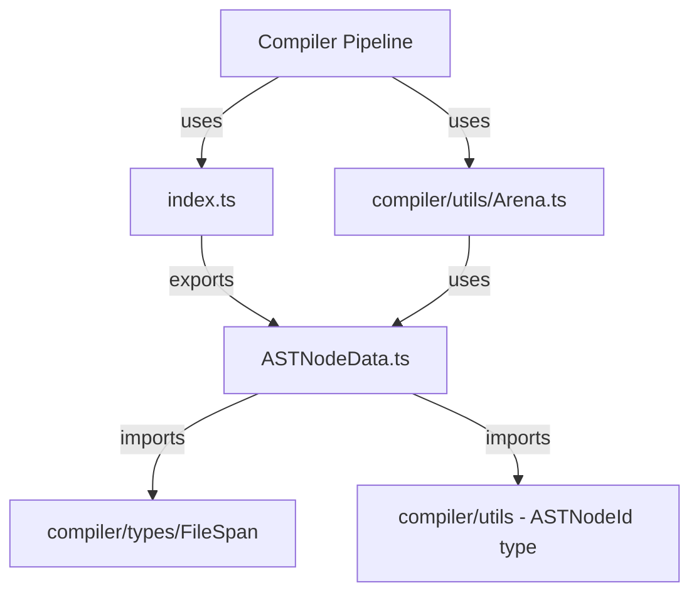
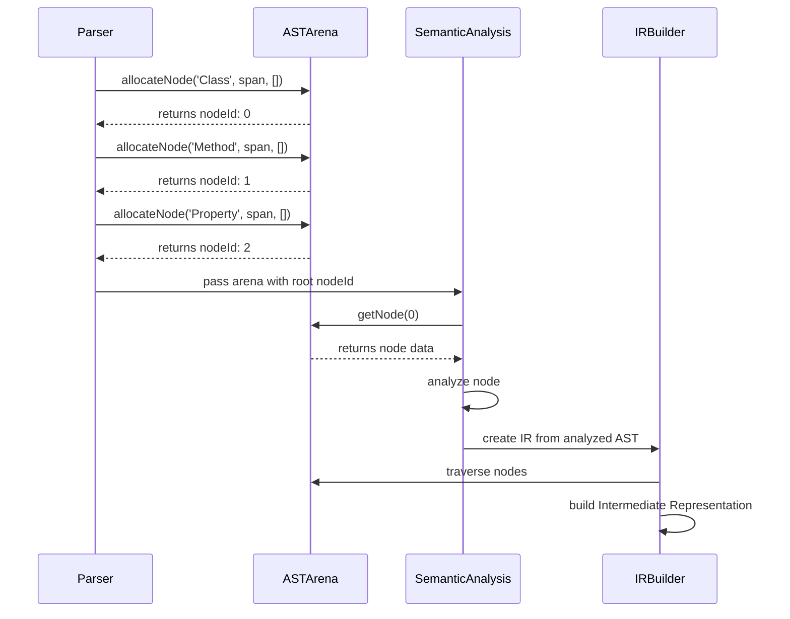
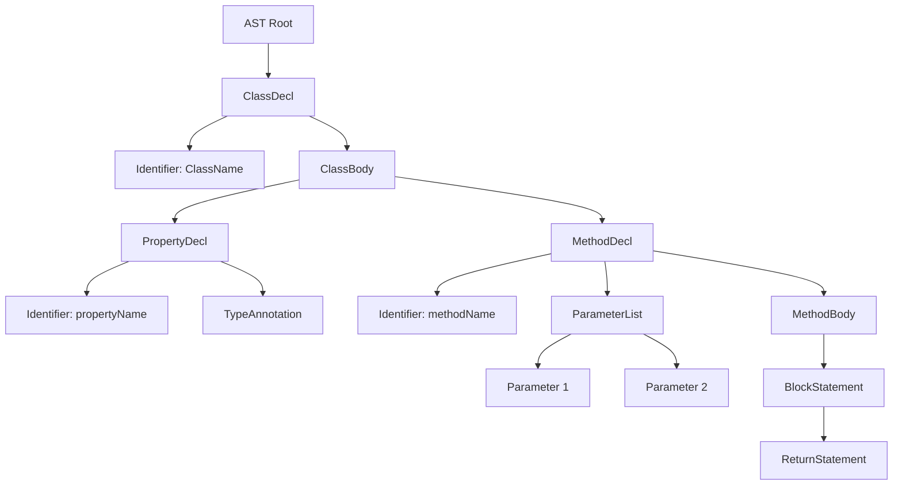
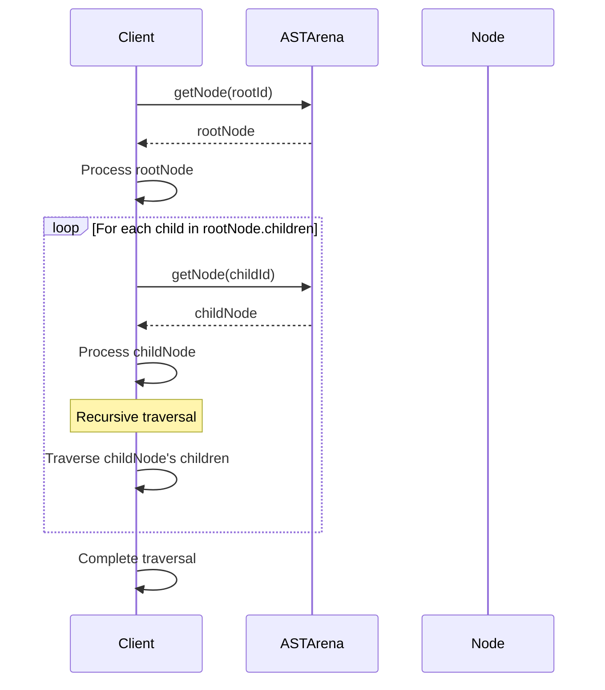
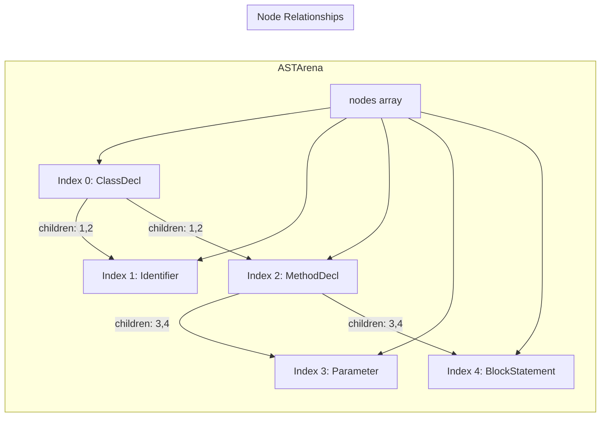
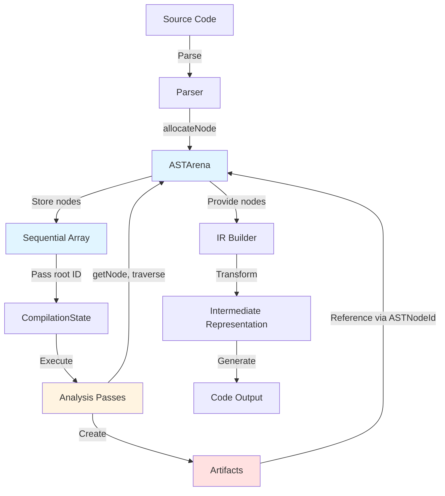

# Compiler AST Module

## Pendahuluan

Folder `compiler/ast` berisi implementasi struktur **Abstract Syntax Tree (AST)** yang digunakan dalam arsitektur compiler RouteSync. AST adalah representasi hirarkis dari struktur program yang telah di-parse, yang memfasilitasi analisis semantik, transformasi, dan code generation.

### Apa itu Abstract Syntax Tree (AST)?

AST adalah struktur data pohon yang merepresentasikan sintaks program dalam bentuk abstrak. Setiap node dalam pohon merepresentasikan konstruksi yang terjadi di source code (misalnya class declaration, method declaration, property access). Berbeda dengan Concrete Syntax Tree (CST), AST tidak menyimpan detail seperti whitespace, komentar, atau karakter sintaks yang tidak penting untuk semantik program.

Dalam arsitektur compiler ini, AST berfungsi sebagai:

1. **Representasi Terstruktur**: Mengubah source code linear menjadi struktur pohon hirarkis yang mudah ditraverse
2. **Input untuk Analisis**: Menyediakan struktur yang dapat dianalisis oleh semantic analysis passes
3. **Foundation untuk IR**: Menjadi dasar untuk membangun Intermediate Representation (IR) yang lebih tingkat tinggi
4. **Source Location Tracking**: Menyimpan informasi lokasi source code untuk diagnostic dan error reporting

### Peran AST dalam Pipeline Compiler


AST berada di tahap awal pipeline kompilasi RouteSync:

```
Source Code → Lexer → Parser → AST → Semantic Analysis → IR → Code Generation
```

**Mengapa AST digunakan?**

1. **Separation of Concerns**: Memisahkan parsing dari analisis semantik. Parser fokus pada struktur sintaks, semantic analyzer fokus pada type checking dan resolusi symbol
2. **Memory Efficiency**: Implementasi AST menggunakan arena allocator untuk efficient memory management dan ID-based referencing
3. **Immutability**: AST nodes bersifat immutable setelah dibuat, mendukung incremental compilation dan caching
4. **Language Agnostic**: Struktur AST cukup generic untuk mendukung berbagai input languages (saat ini PHP/Laravel)
5. **Source Mapping**: Setiap node menyimpan `FileSpan` yang memungkinkan error reporting yang akurat

## Arsitektur

Folder `compiler/ast` terdiri dari dua file utama:

### File Structure

```
compiler/ast/
├── ASTNodeData.ts    # Definisi interface dan utility untuk AST nodes
└── index.ts          # Public exports untuk AST module
```

### 1. ASTNodeData.ts

File ini mendefinisikan struktur data core untuk AST nodes dan utility functions untuk bekerja dengan nodes.

#### Interface: `ASTNodeData`


Interface utama yang merepresentasikan single node dalam AST:

```typescript
export interface ASTNodeData {
    readonly kind: string;
    readonly span: FileSpan;
    readonly children: readonly ASTNodeId[];
}
```

**Property Descriptions:**

- **`kind`**: String discriminator yang mengidentifikasi tipe node (contoh: `'FunctionDeclaration'`, `'PropertyDecl'`, `'Identifier'`, `'MethodDecl'`)
- **`span`**: Object `FileSpan` yang menyimpan informasi lokasi source code untuk node ini
- **`children`**: Array readonly dari `ASTNodeId` yang merepresentasikan child nodes dalam struktur pohon

**Design Rationale:**

1. **`kind` sebagai string**: Memberikan fleksibilitas untuk menambah node types baru tanpa mengubah type system
2. **`readonly` properties**: Menjamin immutability setelah node creation
3. **ID-based children**: Menggunakan numeric IDs daripada object references untuk memory efficiency dan serialization

#### Type: `ASTNodeId`

```typescript
export type ASTNodeId = number;
```

Unique identifier numeric untuk setiap AST node dalam arena. ID diberikan secara sequential saat node dialokasikan.


#### Function: `createASTNodeData`

Factory function untuk membuat AST node data:

```typescript
export function createASTNodeData(
    kind: string,
    span: FileSpan,
    children: readonly ASTNodeId[] = []
): ASTNodeData
```

**Parameters:**
- `kind`: String identifier untuk node type
- `span`: Source location information
- `children`: Optional array of child node IDs (default: empty array)

**Returns:** Immutable `ASTNodeData` object

**Example:**
```typescript
const span: FileSpan = {
    filePath: 'routes/api.php',
    start: 0,
    length: 50,
    line: 1,
    column: 0
};

const node = createASTNodeData('MethodDeclaration', span, []);
```

#### Function: `isSameKind`

Utility untuk membandingkan jenis dua AST nodes:

```typescript
export function isSameKind(a: ASTNodeData, b: ASTNodeData): boolean
```

Mengecek apakah dua nodes memiliki `kind` yang sama.


**Example:**
```typescript
const node1 = createASTNodeData('PropertyDecl', span1, []);
const node2 = createASTNodeData('PropertyDecl', span2, []);
const node3 = createASTNodeData('MethodDecl', span3, []);

isSameKind(node1, node2); // true
isSameKind(node1, node3); // false
```

#### Function: `hasChildren`

Utility untuk mengecek apakah node memiliki children:

```typescript
export function hasChildren(node: ASTNodeData): boolean
```

**Returns:** `true` jika node memiliki satu atau lebih children, `false` jika tidak

**Example:**
```typescript
const leafNode = createASTNodeData('Identifier', span, []);
const parentNode = createASTNodeData('PropertyAccess', span, [1, 2]);

hasChildren(leafNode);   // false
hasChildren(parentNode); // true
```

### 2. index.ts

File ini mengexport public API dari AST module:

```typescript
export type { ASTNodeId, ASTNodeData } from './ASTNodeData';
export {
    createASTNodeData,
    isSameKind,
    hasChildren
} from './ASTNodeData';
```


### FileSpan Type

AST nodes bergantung pada type `FileSpan` dari `compiler/types/FileSpan.ts`:

```typescript
export interface FileSpan {
    readonly filePath: string;    // Path to source file
    readonly start: number;        // Zero-indexed UTF-16 offset
    readonly length: number;       // Length in UTF-16 code units
    readonly line: number;         // One-indexed line number
    readonly column: number;       // Zero-indexed column number
}
```

**Design Note**: Implementasi menggunakan byte offsets sebagai canonical representation (bukan line/column) karena:
- Lexer/parser naturally produce byte offsets
- Incremental compilation requires byte-level granularity
- Offset-to-line conversion adalah O(1) dengan line map
- Cocok dengan design compiler industry-standard (Rust, TypeScript, LLVM)

### Hubungan dengan Arena Allocator

AST nodes disimpan dalam `ASTArena` (dari `compiler/utils/Arena.ts`) yang menyediakan efficient memory management:

```typescript
export class ASTArena {
    private nodes: ASTNodeData[] = [];

    public allocateNode(
        kind: string,
        span: FileSpan,
        children: readonly ASTNodeId[]
    ): ASTNodeId;

    public getNode(id: ASTNodeId): ASTNodeData;
    public get size(): number;
    public clear(): void;
    public forEach(callback: (node: ASTNodeData, id: ASTNodeId) => void): void;
}
```


**Mengapa Arena?**

1. **Memory Efficiency**: Semua nodes disimpan dalam single contiguous array
2. **ID Stability**: Node IDs tidak berubah selama lifetime compilation session
3. **Fast Access**: O(1) array lookup by ID
4. **Cache Friendly**: Sequential memory layout meningkatkan CPU cache hits
5. **Simple Serialization**: Array-based storage mudah di-serialize untuk caching

### Dependency Graph



## Cara Kerja

### 1. Pembentukan AST

AST dibentuk melalui proses parsing yang mengalokasikan nodes dalam arena:

```typescript
import { ASTArena } from '@routesync/core/compiler';
import type { FileSpan } from '@routesync/core/compiler';

// 1. Create arena for storing AST nodes
const arena = new ASTArena();

// 2. Define source location
const span: FileSpan = {
    filePath: 'app/Http/Controllers/UserController.php',
    start: 100,
    length: 50,
    line: 5,
    column: 0
};

// 3. Allocate leaf nodes (identifiers, literals)
const identifierId = arena.allocateNode('Identifier', span, []);


// 4. Allocate parent nodes with children
const propertyDeclId = arena.allocateNode('PropertyDecl', span, [identifierId]);

// 5. Build complex hierarchies
const methodParamId1 = arena.allocateNode('Parameter', span, []);
const methodParamId2 = arena.allocateNode('Parameter', span, []);
const methodBodyId = arena.allocateNode('BlockStatement', span, []);

const methodDeclId = arena.allocateNode(
    'MethodDecl',
    span,
    [methodParamId1, methodParamId2, methodBodyId]
);

// 6. Access nodes by ID
const methodNode = arena.getNode(methodDeclId);
console.log(methodNode.kind);      // 'MethodDecl'
console.log(methodNode.children);  // [paramId1, paramId2, bodyId]
```

### 2. Traversal AST

AST dapat di-traverse secara recursive menggunakan node IDs:

```typescript
function traverseAST(arena: ASTArena, nodeId: ASTNodeId, depth: number = 0): void {
    const node = arena.getNode(nodeId);
    
    // Process current node
    console.log(' '.repeat(depth * 2) + node.kind);
    
    // Recursively traverse children
    for (const childId of node.children) {
        traverseAST(arena, childId, depth + 1);
    }
}

// Usage
traverseAST(arena, methodDeclId);
```


**Output contoh:**
```
MethodDecl
  Parameter
  Parameter
  BlockStatement
```

### 3. Pattern Matching pada Node Kinds

Karena `kind` adalah string, pattern matching dilakukan dengan string comparison:

```typescript
function analyzeNode(arena: ASTArena, nodeId: ASTNodeId): void {
    const node = arena.getNode(nodeId);
    
    switch (node.kind) {
        case 'MethodDecl':
            console.log('Found method declaration');
            // Process method-specific logic
            break;
            
        case 'PropertyDecl':
            console.log('Found property declaration');
            // Process property-specific logic
            break;
            
        case 'Identifier':
            console.log('Found identifier');
            break;
            
        default:
            console.warn(`Unknown node kind: ${node.kind}`);
    }
}
```

### 4. Visitor Pattern untuk AST

Implementasi visitor pattern untuk AST traversal:

```typescript
interface ASTVisitor {
    visitMethodDecl?(arena: ASTArena, nodeId: ASTNodeId): void;
    visitPropertyDecl?(arena: ASTArena, nodeId: ASTNodeId): void;
    visitIdentifier?(arena: ASTArena, nodeId: ASTNodeId): void;
}

function visitAST(arena: ASTArena, nodeId: ASTNodeId, visitor: ASTVisitor): void {
    const node = arena.getNode(nodeId);
    
    // Dispatch to appropriate visitor method
    const methodName = `visit${node.kind}` as keyof ASTVisitor;
    const visitorMethod = visitor[methodName];
    
    if (typeof visitorMethod === 'function') {
        visitorMethod.call(visitor, arena, nodeId);
    }
    
    // Visit children
    for (const childId of node.children) {
        visitAST(arena, childId, visitor);
    }
}
```


**Usage:**
```typescript
const collector: ASTVisitor = {
    visitMethodDecl(arena, nodeId) {
        const node = arena.getNode(nodeId);
        console.log(`Method at ${node.span.line}:${node.span.column}`);
    },
    
    visitPropertyDecl(arena, nodeId) {
        const node = arena.getNode(nodeId);
        console.log(`Property at ${node.span.line}:${node.span.column}`);
    }
};

visitAST(arena, rootNodeId, collector);
```

### 5. Lifecycle AST dalam Kompilasi




### 6. Integration dengan Compiler Passes

AST digunakan oleh compiler passes melalui `CompilationState`:

```typescript
import { CompilationState, ASTArena } from '@routesync/core/compiler';

class MyAnalysisPass {
    async execute(state: CompilationState): Promise<void> {
        // Access AST arena from compilation state
        const arena = state.arena; // atau state.astArena tergantung implementasi
        
        // Get root AST node ID dari state
        const rootNodeId = state.rootASTNodeId;
        
        // Traverse dan analyze
        this.analyzeNode(arena, rootNodeId);
    }
    
    private analyzeNode(arena: ASTArena, nodeId: ASTNodeId): void {
        const node = arena.getNode(nodeId);
        
        // Perform semantic analysis
        if (node.kind === 'MethodDecl') {
            // Extract method information
            // Create artifacts
            // Store in artifact registry
        }
        
        // Process children
        for (const childId of node.children) {
            this.analyzeNode(arena, childId);
        }
    }
}
```

## Cara Penggunaan

### Membuat AST Node Baru

#### Pendekatan 1: Menggunakan Arena Directly

```typescript
import { ASTArena } from '@routesync/core/compiler';

const arena = new ASTArena();

// Create span information
const span = {
    filePath: 'src/Controller.php',
    start: 0,
    length: 100,
    line: 1,
    column: 0
};

// Allocate nodes
const nodeId = arena.allocateNode('CustomNodeKind', span, []);
```


#### Pendekatan 2: Menggunakan Helper Functions

```typescript
import { createASTNodeData, hasChildren } from '@routesync/core/compiler/ast';

// Create node data
const nodeData = createASTNodeData('PropertyDecl', span, [childId]);

// Check properties
if (hasChildren(nodeData)) {
    console.log('Node has children');
}
```

### Melakukan Traversal AST

#### Depth-First Traversal

```typescript
function depthFirstTraversal(
    arena: ASTArena,
    nodeId: ASTNodeId,
    callback: (node: ASTNodeData, id: ASTNodeId) => void
): void {
    const node = arena.getNode(nodeId);
    
    // Pre-order: process current node first
    callback(node, nodeId);
    
    // Then process children
    for (const childId of node.children) {
        depthFirstTraversal(arena, childId, callback);
    }
}

// Usage
depthFirstTraversal(arena, rootNodeId, (node, id) => {
    console.log(`Node ${id}: ${node.kind}`);
});
```

#### Breadth-First Traversal

```typescript
function breadthFirstTraversal(
    arena: ASTArena,
    rootNodeId: ASTNodeId,
    callback: (node: ASTNodeData, id: ASTNodeId) => void
): void {
    const queue: ASTNodeId[] = [rootNodeId];
    
    while (queue.length > 0) {
        const nodeId = queue.shift()!;
        const node = arena.getNode(nodeId);
        
        callback(node, nodeId);
        
        // Add children to queue
        queue.push(...node.children);
    }
}
```


### Filtering Nodes by Kind

```typescript
function findNodesByKind(
    arena: ASTArena,
    rootNodeId: ASTNodeId,
    targetKind: string
): ASTNodeId[] {
    const results: ASTNodeId[] = [];
    
    function traverse(nodeId: ASTNodeId): void {
        const node = arena.getNode(nodeId);
        
        if (node.kind === targetKind) {
            results.push(nodeId);
        }
        
        for (const childId of node.children) {
            traverse(childId);
        }
    }
    
    traverse(rootNodeId);
    return results;
}

// Usage
const methodNodes = findNodesByKind(arena, rootNodeId, 'MethodDecl');
console.log(`Found ${methodNodes.length} method declarations`);
```

### Memperluas AST dengan Node Types Baru

Untuk menambahkan node type baru, cukup gunakan `kind` string yang unik:

```typescript
// Define semantic constants untuk node kinds (optional)
export const AST_NODE_KINDS = {
    // Declaration nodes
    CLASS_DECL: 'ClassDecl',
    METHOD_DECL: 'MethodDecl',
    PROPERTY_DECL: 'PropertyDecl',
    
    // Expression nodes
    IDENTIFIER: 'Identifier',
    LITERAL: 'Literal',
    PROPERTY_ACCESS: 'PropertyAccess',
    
    // Statement nodes
    BLOCK_STATEMENT: 'BlockStatement',
    RETURN_STATEMENT: 'ReturnStatement',
    
    // Custom domain-specific nodes
    ROUTE_DEFINITION: 'RouteDefinition',
    CONTROLLER_ACTION: 'ControllerAction'
} as const;

// Usage
const routeNodeId = arena.allocateNode(
    AST_NODE_KINDS.ROUTE_DEFINITION,
    span,
    [controllerActionNodeId]
);
```


### Extracting Source Text dari AST Node

```typescript
function getNodeSourceText(
    node: ASTNodeData,
    sourceCode: string
): string {
    const { start, length } = node.span;
    return sourceCode.slice(start, start + length);
}

// Usage
const sourceCode = readFileSync('src/Controller.php', 'utf-8');
const node = arena.getNode(methodNodeId);
const methodSource = getNodeSourceText(node, sourceCode);
console.log(methodSource);
```

### Kapan Menggunakan Setiap Node

| Node Kind | Kapan Digunakan | Example Use Case |
|-----------|----------------|------------------|
| `ClassDecl` | Merepresentasikan class declaration | Laravel Controller class |
| `MethodDecl` | Merepresentasikan method dalam class | Controller action methods |
| `PropertyDecl` | Merepresentasikan class property | Model attributes |
| `Identifier` | Merepresentasikan nama variable/function | Variable names, type names |
| `PropertyAccess` | Merepresentasikan akses property | `$user->name` |
| `MethodCall` | Merepresentasikan pemanggilan method | `$user->save()` |
| `Literal` | Merepresentasikan nilai literal | String, number, boolean literals |
| `BlockStatement` | Merepresentasikan block kode | Method body, if blocks |

## Panduan Pengembangan

### Kapan Menambahkan AST Node Baru

Tambahkan node type baru ketika:

1. **Konstruksi Sintaks Baru**: Ada konstruksi sintaks dalam source language yang belum direpresentasikan
2. **Semantic Distinction**: Perlu membedakan secara semantik antara konstruksi yang mirip
3. **Analysis Requirements**: Semantic analysis atau IR generation membutuhkan informasi struktural spesifik
4. **Optimization Opportunities**: Node type baru memungkinkan optimizations yang lebih baik


**Contoh:**
```typescript
// BAD: Too many node types untuk simple variations
arena.allocateNode('PublicMethodDecl', span, []);
arena.allocateNode('PrivateMethodDecl', span, []);
arena.allocateNode('ProtectedMethodDecl', span, []);

// GOOD: Single node type dengan metadata di artifacts
arena.allocateNode('MethodDecl', span, []);
// Visibility disimpan di semantic artifacts, bukan di AST
```

### Best Practices dalam Mendesain Struktur AST

#### 1. Keep AST Simple dan Structural

AST harus merepresentasikan **struktur sintaks**, bukan semantik:

```typescript
// ✅ GOOD: Structural representation
const methodNode = createASTNodeData('MethodDecl', span, [paramNodes, bodyNode]);

// ❌ BAD: Semantic information in AST
const methodNode = {
    kind: 'MethodDecl',
    span,
    children: [paramNodes, bodyNode],
    returnType: 'string',          // ❌ Semantic info
    isStatic: true,                // ❌ Semantic info
    visibility: 'public'           // ❌ Semantic info
};
```

**Reasoning**: Semantic information harus disimpan dalam **Artifacts** dan **Symbol Table**, bukan di AST. Ini memungkinkan semantic analysis berjalan independently dan mendukung incremental compilation.

#### 2. Immutability

AST nodes harus immutable setelah dibuat:

```typescript
// ✅ GOOD: Create new node untuk modifications
const originalNode = arena.getNode(nodeId);
const newNodeId = arena.allocateNode(
    originalNode.kind,
    originalNode.span,
    [...originalNode.children, newChildId]
);

// ❌ BAD: Mutate existing node (impossible dengan readonly properties)
// node.children.push(newChildId); // Compile error!
```


#### 3. ID-Based References

Gunakan `ASTNodeId` untuk referensi, bukan direct object pointers:

```typescript
// ✅ GOOD: ID-based reference
interface SymbolInfo {
    name: string;
    declarationNodeId: ASTNodeId;  // Reference by ID
}

// ❌ BAD: Direct object reference
interface SymbolInfo {
    name: string;
    declarationNode: ASTNodeData;  // Direct reference
}
```

**Benefits:**
- Enables efficient serialization
- Supports lazy loading
- Prevents circular references
- Memory efficient (numbers vs objects)

#### 4. Consistent Spanning

Setiap node harus memiliki accurate `FileSpan`:

```typescript
// ✅ GOOD: Accurate span covering entire construct
const methodSpan = {
    filePath: 'Controller.php',
    start: 100,    // Start of 'public'
    length: 250,   // Until closing brace
    line: 10,
    column: 4
};

// ❌ BAD: Incomplete span
const methodSpan = {
    filePath: 'Controller.php',
    start: 100,
    length: 10,    // Only covers method name, not full body!
    line: 10,
    column: 4
};
```

#### 5. Hierarchical Structure

Maintain proper parent-child relationships:

```typescript
// ✅ GOOD: Proper hierarchy
const paramId = arena.allocateNode('Parameter', paramSpan, []);
const bodyId = arena.allocateNode('BlockStatement', bodySpan, [statementIds]);
const methodId = arena.allocateNode('MethodDecl', methodSpan, [paramId, bodyId]);

// ❌ BAD: Flat structure losing relationships
const paramId = arena.allocateNode('Parameter', paramSpan, []);
const bodyId = arena.allocateNode('BlockStatement', bodySpan, []);
const methodId = arena.allocateNode('MethodDecl', methodSpan, []); // Lost children!
```


### Anti-Patterns yang Harus Dihindari

#### ❌ Anti-Pattern 1: Storing Computed Values in AST

```typescript
// BAD: Storing computed/derived information
const node = {
    kind: 'MethodDecl',
    span,
    children: [],
    // ❌ These are computed, not structural:
    computedReturnType: 'string',
    numberOfParameters: 3,
    isAsync: true
};
```

**Why it's bad:** Computed values harus dihitung oleh semantic analysis passes dan disimpan di artifacts. AST harus hanya structure, bukan analysis results.

#### ❌ Anti-Pattern 2: Deep Nesting in Single Node

```typescript
// BAD: Encoding too much in single node's kind
arena.allocateNode('PublicStaticAsyncMethodWithVoidReturnType', span, []);
```

**Solution:** Gunakan simple node kinds + semantic artifacts:
```typescript
// GOOD
const methodId = arena.allocateNode('MethodDecl', span, children);
// Store modifiers dalam artifacts
```

#### ❌ Anti-Pattern 3: Circular Node References

```typescript
// BAD: Impossible dengan design saat ini, tapi jika di-extend:
const parentId = arena.allocateNode('Parent', span, [childId]);
const childId = arena.allocateNode('Child', span, [parentId]); // Circular!
```

**Prevention:** Arena allocation adalah sequential, child IDs harus exist sebelum parent allocation.


#### ❌ Anti-Pattern 4: Inconsistent Node Kinds

```typescript
// BAD: Inconsistent naming
arena.allocateNode('method_declaration', span, []);  // snake_case
arena.allocateNode('PropertyDecl', span, []);        // PascalCase
arena.allocateNode('identifier', span, []);          // lowercase
```

**Solution:** Establish dan follow naming convention:
```typescript
// GOOD: Consistent PascalCase
arena.allocateNode('MethodDecl', span, []);
arena.allocateNode('PropertyDecl', span, []);
arena.allocateNode('Identifier', span, []);
```

### Konvensi Penamaan

**Node Kinds Naming Convention:**

1. **PascalCase**: Semua node kinds menggunakan PascalCase
2. **Descriptive**: Names harus deskriptif dan self-documenting
3. **Suffix Convention**:
   - `Decl` untuk declarations: `ClassDecl`, `MethodDecl`, `PropertyDecl`
   - `Expr` untuk expressions: `CallExpr`, `BinaryExpr`, `LiteralExpr`
   - `Stmt` untuk statements: `BlockStmt`, `ReturnStmt`, `IfStmt`

**Examples:**
```typescript
// Declarations
'ClassDecl', 'InterfaceDecl', 'FunctionDecl', 'VariableDecl'

// Expressions
'BinaryExpr', 'UnaryExpr', 'CallExpr', 'MemberExpr', 'LiteralExpr'

// Statements
'IfStmt', 'WhileStmt', 'ForStmt', 'ReturnStmt', 'BlockStmt'

// Identifiers & Literals
'Identifier', 'StringLiteral', 'NumberLiteral', 'BooleanLiteral'

// Domain-specific (RouteSync)
'RouteDefinition', 'ControllerAction', 'ResourceMapping'
```


### Prinsip-Prinsip Menjaga AST Tetap Sederhana

#### 1. Single Responsibility

Setiap node kind harus merepresentasikan **satu** konstruksi sintaks:

```typescript
// ✅ GOOD: Single responsibility
'MethodDecl'      // Represents method declaration
'PropertyDecl'    // Represents property declaration
'Identifier'      // Represents identifier

// ❌ BAD: Multiple responsibilities
'MethodOrPropertyDecl'  // Ambiguous
```

#### 2. Consistency

Maintain consistent structure across similar node types:

```typescript
// ✅ GOOD: Consistent structure
const methodId = arena.allocateNode('MethodDecl', span, [paramsId, bodyId]);
const functionId = arena.allocateNode('FunctionDecl', span, [paramsId, bodyId]);

// Both have same child structure: parameters, body
```

#### 3. Extensibility

Design untuk future extensions:

```typescript
// ✅ GOOD: Extensible through new node kinds
arena.allocateNode('AsyncMethodDecl', span, children);  // New async variant

// ❌ BAD: Requiring changes to existing structure
// Adding new field to ASTNodeData interface breaks immutability
```

#### 4. Analyzability

AST harus mudah dianalisis oleh compiler passes:

```typescript
// ✅ GOOD: Clear structure untuk analysis
function analyzeMethod(arena: ASTArena, methodId: ASTNodeId): MethodInfo {
    const node = arena.getNode(methodId);
    
    // Clear traversal pattern
    const params = node.children[0]; // Parameters
    const body = node.children[1];   // Body
    
    return { params, body };
}
```


## Struktur Folder

### Ringkasan File

```
compiler/ast/
├── ASTNodeData.ts    # 69 lines - Core AST node definition
│                     # - ASTNodeData interface
│                     # - ASTNodeId type alias
│                     # - createASTNodeData factory
│                     # - isSameKind utility
│                     # - hasChildren utility
│
└── index.ts          # 11 lines - Public exports
                      # - Re-exports types
                      # - Re-exports utilities
```

### Tanggung Jawab Masing-Masing File

#### ASTNodeData.ts

**Responsibilities:**
1. Mendefinisikan struktur data `ASTNodeData` untuk AST nodes
2. Menyediakan type alias `ASTNodeId` untuk node identifiers
3. Menyediakan factory function `createASTNodeData`
4. Menyediakan utility functions untuk node operations

**Dependencies:**
- `compiler/types/FileSpan` - untuk source location tracking
- `compiler/utils` - untuk `ASTNodeId` type (re-exported)

**Used By:**
- `compiler/utils/Arena.ts` - ASTArena menggunakan ASTNodeData
- Compiler passes - untuk accessing dan analyzing AST nodes
- Parser implementations - untuk constructing AST

#### index.ts

**Responsibilities:**
1. Public API surface untuk AST module
2. Re-export types dan functions dari internal modules
3. Enforce encapsulation boundary

**Pattern:** Barrel export pattern untuk clean module interface


## Referensi Implementasi

### Komponen AST Utama

#### 1. ASTNodeData Interface

**Location:** `compiler/ast/ASTNodeData.ts`

**Type Definition:**
```typescript
export interface ASTNodeData {
    readonly kind: string;
    readonly span: FileSpan;
    readonly children: readonly ASTNodeId[];
}
```

**Properties:**
- `kind`: String discriminator untuk node type
- `span`: Source location information (`FileSpan` dari `compiler/types`)
- `children`: Array of child node IDs (readonly untuk immutability)

**Design Patterns:**
- **Immutability**: All properties readonly
- **Structural Typing**: Interface-based, tidak menggunakan classes
- **ID-based References**: Children sebagai IDs, bukan object pointers

#### 2. ASTNodeId Type

**Location:** `compiler/ast/ASTNodeData.ts` (imported from `compiler/utils`)

**Type Definition:**
```typescript
export type ASTNodeId = number;
```

**Purpose:** Unique numeric identifier untuk AST nodes dalam arena

**Range:** 0 to N-1 (sequential allocation)

**Benefits:**
- Memory efficient (4-8 bytes vs object pointers)
- Serialization friendly
- Arena locality (sequential IDs → cache friendly)


#### 3. ASTArena Class

**Location:** `compiler/utils/Arena.ts`

**Class Definition:**
```typescript
export class ASTArena {
    private nodes: ASTNodeData[] = [];

    public allocateNode(
        kind: string,
        span: FileSpan,
        children: readonly ASTNodeId[]
    ): ASTNodeId;

    public getNode(id: ASTNodeId): ASTNodeData;
    public get size(): number;
    public clear(): void;
    public forEach(callback: (node: ASTNodeData, id: ASTNodeId) => void): void;
}
```

**Operations:**
- `allocateNode()`: Allocate new node, returns unique ID
- `getNode()`: Retrieve node by ID, O(1) access
- `size`: Get total number of nodes
- `clear()`: Remove all nodes
- `forEach()`: Iterate over all nodes

**Storage Model:**
- Contiguous array storage
- Sequential ID allocation
- No gaps in ID space
- No node deletion (immutable)

**Memory Characteristics:**
- Initial capacity: 0 (grows dynamically)
- Growth strategy: JavaScript array automatic growth
- Memory layout: Sequential, cache-friendly
- Overhead: Minimal (just array indexing)


### Hubungan dengan Komponen Compiler Lain

#### 1. Integration dengan Analysis Passes

Berdasarkan implementasi yang ada, AST digunakan sebagai input untuk analysis passes. Analysis passes mengakses AST melalui `ASTArena`:

```typescript
// Conceptual example berdasarkan architecture
class SemanticAnalysisPass {
    async execute(state: CompilationState): Promise<void> {
        // Access AST arena dari compilation state
        const arena = state.astArena;
        
        // Get root node
        const rootId = state.rootNodeId;
        
        // Traverse dan analyze
        this.analyzeNode(arena, rootId);
    }
    
    private analyzeNode(arena: ASTArena, nodeId: ASTNodeId): void {
        const node = arena.getNode(nodeId);
        
        // Pattern match on node kind
        switch (node.kind) {
            case 'MethodDecl':
                // Extract semantic information
                // Store in artifacts
                break;
            // ... other cases
        }
    }
}
```

**Data Flow:**
```
Parser → ASTArena → CompilationState → Analysis Passes → Artifacts
```

#### 2. Integration dengan Artifacts System

AST nodes referenced dalam artifacts menggunakan `ASTNodeId`:

```typescript
// Example artifact yang reference AST node
interface SymbolArtifact {
    name: string;
    declarationNodeId: ASTNodeId;  // Reference ke AST
    type: SemanticType;
}
```

**Pattern:** Artifacts menyimpan IDs, bukan direct node references untuk maintain immutability dan support serialization.


#### 3. Integration dengan IR (Intermediate Representation)

AST adalah input untuk IR building. IR builders traverse AST untuk construct higher-level representation:

```typescript
// Conceptual IR building dari AST
class IRBuilder {
    buildFromAST(arena: ASTArena, rootId: ASTNodeId): IR {
        const node = arena.getNode(rootId);
        
        // Transform AST ke IR
        switch (node.kind) {
            case 'MethodDecl':
                return this.buildMethodIR(arena, node);
            // ... other transformations
        }
    }
}
```

**Transformation Flow:**
```
AST (syntax-focused) → IR (semantic-focused) → Code Generation
```

#### 4. Integration dengan Constraint System

Type constraints dapat reference AST nodes untuk source location:

```typescript
// Example constraint dengan AST node reference
interface Constraint {
    kind: 'Equality';
    source: TypeVariable;
    target: TypeVariable;
    span?: FileSpan;  // Dari AST node
}
```

**Usage:** Error reporting menggunakan span information dari AST nodes untuk menunjukkan exact location di source code.

#### 5. Integration dengan Verification

Verification passes dapat check AST structure invariants:

```typescript
// Example verification check
function verifyASTInvariants(arena: ASTArena): VerificationResult {
    const errors: string[] = [];
    
    arena.forEach((node, id) => {
        // Check all child IDs are valid
        for (const childId of node.children) {
            if (childId < 0 || childId >= arena.size) {
                errors.push(`Invalid child ID ${childId} in node ${id}`);
            }
        }
    });
    
    return errors.length === 0
        ? { success: true }
        : { success: false, errors };
}
```


### Contoh Implementasi Real-World

#### Parser Integration Example

Berdasarkan `proof-of-concept.ts` dari specs:

```typescript
import { ASTArena, type ASTNodeId } from '@routesync/core/compiler';

class PHPTokenizationLayer {
    private arena = new ASTArena();
    
    tokenize(phpSource: string): ASTNodeId[] {
        // Parse PHP source dan create AST nodes
        const tokens: ASTNodeId[] = [];
        
        // Example: Tokenize class declaration
        const classNameSpan = this.extractSpan(phpSource, 'ClassName');
        const classNameId = this.arena.allocateNode('Identifier', classNameSpan, []);
        
        const classBodySpan = this.extractSpan(phpSource, '{...}');
        const classBodyId = this.arena.allocateNode('ClassBody', classBodySpan, []);
        
        const classSpan = this.extractSpan(phpSource, 'class ClassName {...}');
        const classId = this.arena.allocateNode('ClassDecl', classSpan, [
            classNameId,
            classBodyId
        ]);
        
        tokens.push(classId);
        return tokens;
    }
    
    private extractSpan(source: string, target: string): FileSpan {
        const start = source.indexOf(target);
        return {
            filePath: 'source.php',
            start,
            length: target.length,
            line: this.calculateLine(source, start),
            column: this.calculateColumn(source, start)
        };
    }
}
```


#### Test Example

Dari `compiler.spec.ts`:

```typescript
import { ASTArena } from '@routesync/core/compiler';

describe('AST Arena', () => {
    it('should allocate and retrieve nodes correctly', () => {
        const arena = new ASTArena();
        
        const span = {
            filePath: 'test.php',
            start: 0,
            length: 10,
            line: 1,
            column: 1
        };
        
        // Allocate leaf node
        const nodeId1 = arena.allocateNode('Class', span, []);
        
        // Allocate parent node with child
        const nodeId2 = arena.allocateNode('Method', span, [nodeId1]);
        
        // Verify IDs are sequential
        expect(nodeId1).toBe(0);
        expect(nodeId2).toBe(1);
        
        // Verify node retrieval
        expect(arena.getNode(nodeId2).kind).toBe('Method');
        expect(arena.getNode(nodeId2).children[0]).toBe(nodeId1);
    });
});
```

## Diagram Arsitektur AST

### Struktur AST Hierarchical




### Alur Traversal AST



### Storage Model dalam Arena



**Key Points:**
- Sequential allocation (0, 1, 2, ...)
- O(1) access by index
- Immutable after allocation
- No gaps in ID space


### Integration dalam Compiler Pipeline



**Pipeline Stages:**
1. **Parsing**: Source code → AST nodes dalam arena
2. **Compilation State**: Root node ID passed ke passes
3. **Analysis**: Passes traverse AST, create artifacts
4. **Artifacts**: Reference AST nodes by ID
5. **IR Building**: Transform AST → IR
6. **Code Generation**: IR → Output code

## Performance Considerations

### Memory Efficiency

**Arena Benefits:**
- **Contiguous allocation**: All nodes dalam single array
- **No fragmentation**: Sequential allocation prevents memory fragmentation
- **Cache locality**: Sequential access patterns improve CPU cache hits
- **Minimal overhead**: Just array + IDs, no object pointers


**Memory Calculation Example:**
```typescript
// Per AST node memory footprint
interface ASTNodeData {
    kind: string;      // 8 bytes (pointer) + string content
    span: FileSpan;    // 40 bytes (5 numbers + 1 string pointer)
    children: number[] // 8 bytes (array pointer) + 8 bytes per child ID
}

// Approximate: ~60 bytes base + 8 bytes per child
// For 1000 nodes with avg 2 children: ~76 KB
```

**Comparison dengan alternative structures:**
- **Object pointers**: ~2-3x memory overhead
- **Tree with parent pointers**: ~4x memory overhead
- **Arena allocation**: Minimal overhead, best cache locality

### Access Patterns

**O(1) Operations:**
- `arena.getNode(id)` - Direct array index
- `arena.allocateNode(...)` - Append to array
- `arena.size` - Array length property

**O(N) Operations:**
- `arena.forEach(callback)` - Iterate all nodes
- Full tree traversal - Visit each node once

**No Operations with complexity > O(N)**

### Traversal Performance

**Depth-First Traversal Complexity:**
- Time: O(N) where N = number of nodes
- Space: O(H) where H = tree height (recursion stack)

**Breadth-First Traversal Complexity:**
- Time: O(N)
- Space: O(W) where W = maximum tree width (queue size)


**Optimization Tips:**

```typescript
// ✅ GOOD: Cache node lookups dalam tight loops
const node = arena.getNode(nodeId);
for (const childId of node.children) {
    processChild(arena.getNode(childId));
}

// ❌ BAD: Repeated lookups
for (let i = 0; i < arena.getNode(nodeId).children.length; i++) {
    const childId = arena.getNode(nodeId).children[i]; // Repeated lookup!
    processChild(arena.getNode(childId));
}
```

## Advanced Patterns

### AST Transformation

Meskipun AST immutable, transformations dapat dilakukan dengan allocating new nodes:

```typescript
function transformAST(
    arena: ASTArena,
    nodeId: ASTNodeId,
    transformer: (node: ASTNodeData) => ASTNodeData | null
): ASTNodeId | null {
    const node = arena.getNode(nodeId);
    
    // Transform current node
    const transformed = transformer(node);
    if (transformed === null) return null;
    
    // Recursively transform children
    const newChildren: ASTNodeId[] = [];
    for (const childId of node.children) {
        const newChildId = transformAST(arena, childId, transformer);
        if (newChildId !== null) {
            newChildren.push(newChildId);
        }
    }
    
    // Allocate new node dengan transformed data
    return arena.allocateNode(
        transformed.kind,
        transformed.span,
        newChildren
    );
}
```


### AST Diffing

Untuk incremental compilation, dapat compare AST structures:

```typescript
function compareASTs(
    arena: ASTArena,
    id1: ASTNodeId,
    id2: ASTNodeId
): boolean {
    const node1 = arena.getNode(id1);
    const node2 = arena.getNode(id2);
    
    // Compare kinds
    if (node1.kind !== node2.kind) return false;
    
    // Compare spans (optional, depending on requirements)
    if (!spansEqual(node1.span, node2.span)) return false;
    
    // Compare children count
    if (node1.children.length !== node2.children.length) return false;
    
    // Recursively compare children
    for (let i = 0; i < node1.children.length; i++) {
        if (!compareASTs(arena, node1.children[i], node2.children[i])) {
            return false;
        }
    }
    
    return true;
}
```

### AST Serialization

Arena structure memudahkan serialization:

```typescript
function serializeAST(arena: ASTArena): string {
    const nodes: ASTNodeData[] = [];
    
    arena.forEach((node, id) => {
        nodes[id] = node;
    });
    
    return JSON.stringify(nodes);
}

function deserializeAST(json: string): ASTArena {
    const nodes: ASTNodeData[] = JSON.parse(json);
    const arena = new ASTArena();
    
    for (const node of nodes) {
        arena.allocateNode(node.kind, node.span, node.children);
    }
    
    return arena;
}
```


## Testing AST

### Unit Testing Node Creation

```typescript
import { createASTNodeData, hasChildren, isSameKind } from '@routesync/core/compiler/ast';

describe('AST Node Creation', () => {
    const span: FileSpan = {
        filePath: 'test.php',
        start: 0,
        length: 10,
        line: 1,
        column: 0
    };
    
    it('should create leaf node', () => {
        const node = createASTNodeData('Identifier', span);
        
        expect(node.kind).toBe('Identifier');
        expect(node.span).toBe(span);
        expect(node.children).toHaveLength(0);
        expect(hasChildren(node)).toBe(false);
    });
    
    it('should create parent node', () => {
        const node = createASTNodeData('MethodDecl', span, [1, 2, 3]);
        
        expect(node.kind).toBe('MethodDecl');
        expect(hasChildren(node)).toBe(true);
        expect(node.children).toEqual([1, 2, 3]);
    });
    
    it('should compare node kinds', () => {
        const node1 = createASTNodeData('MethodDecl', span);
        const node2 = createASTNodeData('MethodDecl', span);
        const node3 = createASTNodeData('PropertyDecl', span);
        
        expect(isSameKind(node1, node2)).toBe(true);
        expect(isSameKind(node1, node3)).toBe(false);
    });
});
```

### Integration Testing Arena

```typescript
import { ASTArena } from '@routesync/core/compiler';

describe('AST Arena Integration', () => {
    let arena: ASTArena;
    
    beforeEach(() => {
        arena = new ASTArena();
    });
    
    it('should allocate nodes sequentially', () => {
        const id1 = arena.allocateNode('Node1', span, []);
        const id2 = arena.allocateNode('Node2', span, []);
        const id3 = arena.allocateNode('Node3', span, []);
        
        expect(id1).toBe(0);
        expect(id2).toBe(1);
        expect(id3).toBe(2);
        expect(arena.size).toBe(3);
    });
    
    it('should retrieve nodes correctly', () => {
        const id = arena.allocateNode('TestNode', span, []);
        const node = arena.getNode(id);
        
        expect(node.kind).toBe('TestNode');
        expect(node.span).toBe(span);
    });
    
    it('should throw on invalid ID', () => {
        expect(() => arena.getNode(999)).toThrow('Invalid ASTNodeId');
    });
});
```


### Testing Traversal Algorithms

```typescript
describe('AST Traversal', () => {
    let arena: ASTArena;
    
    beforeEach(() => {
        arena = new ASTArena();
        
        // Build test tree:
        //     0 (root)
        //    / \
        //   1   2
        //  / \
        // 3   4
        
        const id3 = arena.allocateNode('Leaf3', span, []);
        const id4 = arena.allocateNode('Leaf4', span, []);
        const id1 = arena.allocateNode('Branch1', span, [id3, id4]);
        const id2 = arena.allocateNode('Leaf2', span, []);
        arena.allocateNode('Root', span, [id1, id2]);
    });
    
    it('should traverse depth-first', () => {
        const visited: string[] = [];
        
        function traverse(id: ASTNodeId): void {
            const node = arena.getNode(id);
            visited.push(node.kind);
            
            for (const childId of node.children) {
                traverse(childId);
            }
        }
        
        traverse(0); // Start from root
        
        expect(visited).toEqual(['Root', 'Branch1', 'Leaf3', 'Leaf4', 'Leaf2']);
    });
    
    it('should find nodes by kind', () => {
        const leaves = findNodesByKind(arena, 0, 'Leaf3');
        expect(leaves).toEqual([3]);
    });
});
```

## Debugging Tips

### Visualizing AST

```typescript
function printAST(arena: ASTArena, nodeId: ASTNodeId, indent: number = 0): void {
    const node = arena.getNode(nodeId);
    const prefix = '  '.repeat(indent);
    
    console.log(`${prefix}${node.kind} (ID: ${nodeId})`);
    console.log(`${prefix}  Span: ${node.span.filePath}:${node.span.line}:${node.span.column}`);
    console.log(`${prefix}  Children: [${node.children.join(', ')}]`);
    
    for (const childId of node.children) {
        printAST(arena, childId, indent + 1);
    }
}

// Usage
printAST(arena, rootNodeId);
```


**Output Example:**
```
Root (ID: 0)
  Span: Controller.php:1:0
  Children: [1, 2]
  MethodDecl (ID: 1)
    Span: Controller.php:5:4
    Children: [3, 4]
    Parameter (ID: 3)
      Span: Controller.php:5:20
      Children: []
    BlockStatement (ID: 4)
      Span: Controller.php:6:4
      Children: [5]
  PropertyDecl (ID: 2)
    Span: Controller.php:10:4
    Children: []
```

### Debugging Invalid Node References

```typescript
function validateASTIntegrity(arena: ASTArena): void {
    const errors: string[] = [];
    
    arena.forEach((node, id) => {
        // Validate children IDs
        for (const childId of node.children) {
            if (childId < 0 || childId >= arena.size) {
                errors.push(`Node ${id} has invalid child ID: ${childId}`);
            }
        }
        
        // Validate span
        if (node.span.length < 0) {
            errors.push(`Node ${id} has negative span length`);
        }
        
        // Validate kind is non-empty
        if (!node.kind || node.kind.length === 0) {
            errors.push(`Node ${id} has empty kind`);
        }
    });
    
    if (errors.length > 0) {
        console.error('AST Integrity Errors:');
        errors.forEach(err => console.error(`  - ${err}`));
        throw new Error(`Found ${errors.length} AST integrity error(s)`);
    }
    
    console.log('✅ AST integrity validated successfully');
}
```


### Debugging Traversal Issues

```typescript
function debugTraversal(arena: ASTArena, nodeId: ASTNodeId): void {
    console.log('=== AST Traversal Debug ===');
    
    const stack: Array<{ id: ASTNodeId; depth: number }> = [{ id: nodeId, depth: 0 }];
    const visited = new Set<ASTNodeId>();
    
    while (stack.length > 0) {
        const { id, depth } = stack.pop()!;
        
        // Check for cycles
        if (visited.has(id)) {
            console.error(`⚠️  Cycle detected at node ${id}!`);
            continue;
        }
        visited.add(id);
        
        const node = arena.getNode(id);
        console.log(`${'  '.repeat(depth)}Node ${id}: ${node.kind}`);
        
        // Check children validity
        for (const childId of node.children) {
            if (childId < 0 || childId >= arena.size) {
                console.error(`  ${'  '.repeat(depth)}❌ Invalid child ID: ${childId}`);
            } else {
                stack.push({ id: childId, depth: depth + 1 });
            }
        }
    }
    
    console.log(`Total nodes visited: ${visited.size}`);
    console.log('=== End Debug ===');
}
```

## Common Pitfalls dan Solutions

### Pitfall 1: Forgetting to Allocate Children First

```typescript
// ❌ WRONG: Parent allocated before children
const parentId = arena.allocateNode('Parent', span, [childId]); // childId doesn't exist yet!
const childId = arena.allocateNode('Child', span, []);

// ✅ CORRECT: Children allocated first
const childId = arena.allocateNode('Child', span, []);
const parentId = arena.allocateNode('Parent', span, [childId]);
```


### Pitfall 2: Modifying Children Array

```typescript
// ❌ WRONG: Attempting to modify readonly array
const node = arena.getNode(nodeId);
node.children.push(newChildId); // Compile error! readonly array

// ✅ CORRECT: Create new node dengan updated children
const oldNode = arena.getNode(nodeId);
const newNodeId = arena.allocateNode(
    oldNode.kind,
    oldNode.span,
    [...oldNode.children, newChildId]
);
```

### Pitfall 3: Not Handling Invalid Node IDs

```typescript
// ❌ WRONG: No error checking
function processNode(arena: ASTArena, nodeId: ASTNodeId): void {
    const node = arena.getNode(nodeId); // May throw!
    // ... process
}

// ✅ CORRECT: Handle errors gracefully
function processNode(arena: ASTArena, nodeId: ASTNodeId): void {
    try {
        const node = arena.getNode(nodeId);
        // ... process
    } catch (error) {
        console.error(`Failed to get node ${nodeId}:`, error);
        return;
    }
}

// ✅ BETTER: Validate before access
function processNode(arena: ASTArena, nodeId: ASTNodeId): void {
    if (nodeId < 0 || nodeId >= arena.size) {
        console.error(`Invalid node ID: ${nodeId}`);
        return;
    }
    
    const node = arena.getNode(nodeId);
    // ... process
}
```

### Pitfall 4: Infinite Recursion dalam Traversal

```typescript
// ❌ WRONG: No depth limit
function traverse(arena: ASTArena, nodeId: ASTNodeId): void {
    const node = arena.getNode(nodeId);
    for (const childId of node.children) {
        traverse(arena, childId); // Stack overflow risk!
    }
}

// ✅ CORRECT: With depth limit
function traverse(
    arena: ASTArena,
    nodeId: ASTNodeId,
    depth: number = 0,
    maxDepth: number = 1000
): void {
    if (depth > maxDepth) {
        throw new Error(`Maximum traversal depth ${maxDepth} exceeded`);
    }
    
    const node = arena.getNode(nodeId);
    for (const childId of node.children) {
        traverse(arena, childId, depth + 1, maxDepth);
    }
}
```


## FAQ

### Q: Mengapa menggunakan string untuk `kind` daripada enum?

**A:** String memberikan fleksibilitas untuk menambah node types baru tanpa mengubah type system. Ini penting untuk extensibility dan plugin systems. Jika strict type checking diperlukan, dapat menggunakan string literal types atau constants.

### Q: Bisakah AST node memiliki metadata tambahan?

**A:** AST node sendiri hanya menyimpan structural information. Metadata semantic harus disimpan dalam **Artifacts** dan di-associate dengan AST node melalui `ASTNodeId`. Ini menjaga separation of concerns: AST = structure, Artifacts = semantics.

### Q: Bagaimana menangani large AST yang tidak fit dalam memory?

**A:** Implementasi saat ini menyimpan entire AST dalam memory. Untuk extremely large files:
1. Parse incremental per-function atau per-class
2. Stream processing dengan windowing
3. External storage dengan lazy loading
4. Consider alternative representations (e.g., sparse AST)

### Q: Apakah AST bisa di-share antar compilation sessions?

**A:** Ya, karena immutable. AST dapat di-cache dan reused untuk incremental compilation. Key adalah tracking source file changes dan invalidate affected AST subtrees.

### Q: Bagaimana handle multiple source files?

**A:** Setiap source file memiliki own AST arena. Root compilation state dapat menyimpan map dari file paths ke arenas:

```typescript
interface CompilationState {
    arenasByFile: Map<string, ASTArena>;
    rootNodesByFile: Map<string, ASTNodeId>;
}
```


### Q: Apa perbedaan AST dengan IR?

**A:** 
- **AST**: Syntax-focused, represents source code structure as-is
- **IR**: Semantic-focused, higher-level representation after analysis

**Example:**
```typescript
// AST: Structural representation
{
    kind: 'MethodDecl',
    children: [parametersNode, bodyNode]
}

// IR: Semantic representation
{
    kind: 'Function',
    signature: { params: [Type1, Type2], returns: Type3 },
    body: [Instruction1, Instruction2]
}
```

### Q: Bagaimana best practice untuk error reporting menggunakan AST?

**A:** Gunakan `FileSpan` dari AST node untuk precise error location:

```typescript
function reportError(
    arena: ASTArena,
    nodeId: ASTNodeId,
    message: string
): DiagnosticError {
    const node = arena.getNode(nodeId);
    
    return {
        message,
        location: {
            file: node.span.filePath,
            line: node.span.line,
            column: node.span.column,
            length: node.span.length
        },
        severity: 'error'
    };
}

// Usage
const error = reportError(
    arena,
    problemNodeId,
    'Type mismatch: expected string, got number'
);
```


## Summary

Folder `compiler/ast` menyediakan **foundational infrastructure** untuk Abstract Syntax Tree dalam RouteSync compiler:

### Key Features

1. **Simple Data Structure**: `ASTNodeData` dengan 3 properties saja (kind, span, children)
2. **ID-Based References**: Numeric IDs untuk memory efficiency dan serialization
3. **Immutability**: Readonly properties untuk safe concurrent access
4. **Arena Allocation**: Efficient memory management dengan sequential allocation
5. **Source Tracking**: `FileSpan` untuk precise error reporting

### Design Principles

- **Separation of Concerns**: AST = structure, Artifacts = semantics
- **Immutability**: No mutations after creation
- **Extensibility**: Easy to add new node kinds
- **Performance**: O(1) node access, cache-friendly layout
- **Simplicity**: Minimal API surface, easy to understand

### Integration Points

- **Parser**: Creates AST nodes via arena allocation
- **Analysis Passes**: Read AST untuk semantic analysis
- **Artifacts**: Reference AST nodes by ID
- **IR Builder**: Transform AST → IR
- **Error Reporting**: Use spans untuk diagnostics

### When to Use

- ✅ Representing source code structure
- ✅ Input untuk semantic analysis
- ✅ Foundation untuk IR building
- ✅ Source location tracking
- ❌ Storing semantic information (use Artifacts instead)
- ❌ Runtime evaluation (use IR instead)


### Next Steps

Untuk developer yang ingin menggunakan atau extend AST system:

1. **Read Arena.ts**: Understand memory management model
2. **Study FileSpan**: Learn source location tracking
3. **Review Examples**: Check tests dan proof-of-concept code
4. **Start Small**: Begin dengan simple node types
5. **Follow Patterns**: Use existing node kind conventions
6. **Test Thoroughly**: Validate AST structure dan traversal

### Related Documentation

- `compiler/utils/Arena.ts` - Arena allocator implementation
- `compiler/types/FileSpan.ts` - Source location tracking
- `compiler/artifacts/README.md` - Semantic information storage
- `compiler/ir/README.md` - Intermediate Representation
- `compiler/passes/README.md` - Compiler pass architecture

### References

**Industry Patterns:**
- Rust Compiler (rustc): Similar arena-based AST
- TypeScript Compiler: Node-based AST dengan parent pointers
- LLVM: Value-based IR dengan arena allocation
- Roslyn (.NET): Immutable syntax trees

**Key Differences dari RouteSync:**
- No parent pointers (unidirectional tree)
- ID-based references (not object pointers)
- Minimal node structure (kind + span + children)
- Arena-only allocation (no individual node creation)

---

**Document Version:** 1.0  
**Last Updated:** 2024-01-09  
**Maintainer:** RouteSync Compiler Team

