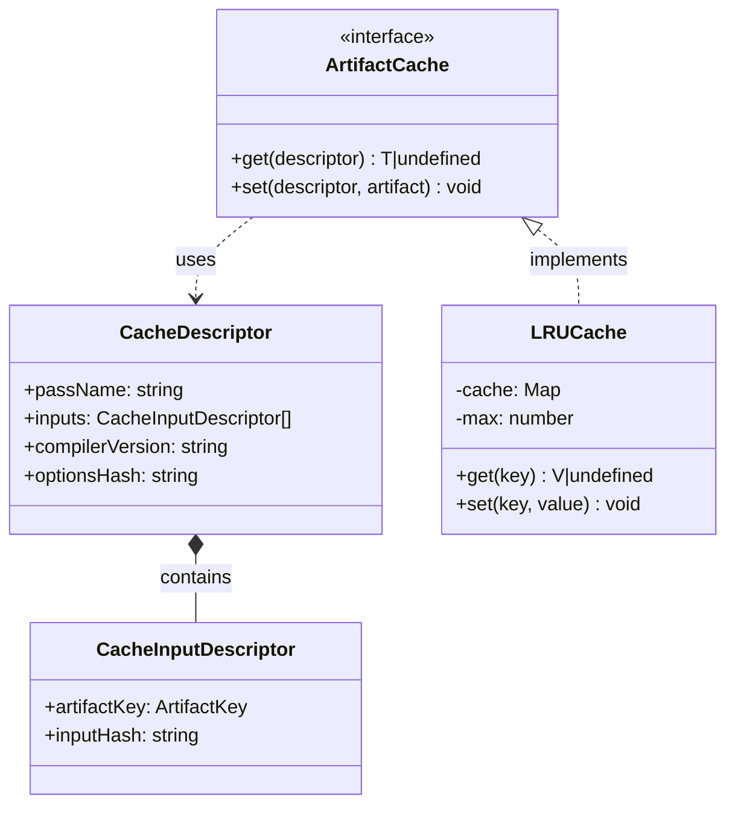
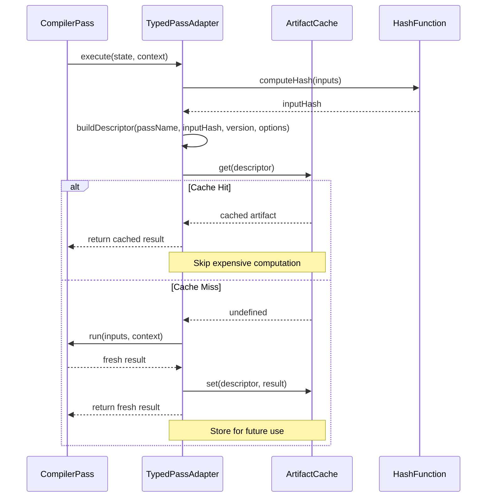

# Compiler Cache Module

## Pendahuluan

Folder `compiler/cache` berisi implementasi **artifact caching system** untuk mendukung incremental compilation dalam compiler RouteSync. Cache system menyimpan hasil eksekusi compiler passes sehingga passes tidak perlu dijalankan ulang ketika input tidak berubah.

### Apa itu Artifact Caching?

Artifact caching adalah teknik untuk menyimpan hasil transformasi compiler (artifacts) berdasarkan:
1. **Input artifacts** - Content hash dari input yang diproses
2. **Pass identity** - Name dari pass yang menghasilkan output
3. **Compiler configuration** - Version dan options yang digunakan
4. **Compiler fingerprint** - Environment yang mempengaruhi hasil

Ketika input, pass, dan configuration sama, compiler dapat menggunakan cached result tanpa re-execute pass.

### Peran Cache System dalam Pipeline Compiler

```
Input Changed? ──No──> Check Cache ──Hit──> Return Cached
     │                      │
    Yes                    Miss
     │                      │
     └──────> Execute Pass <┘
                  │
            Cache Result
                  │
            Return Output
```

Cache system berada di **TypedPassAdapter layer**, automatically checking cache sebelum pass execution dan storing results setelah execution.

**Mengapa Caching Diperlukan?**

1. **Performance**: Avoid redundant computation untuk unchanged inputs
2. **Incremental Builds**: Only recompile affected parts saat source changes
3. **Fast Feedback**: Reduce iteration time dalam development
4. **Resource Efficiency**: Save CPU dan memory untuk repeated builds
5. **Scalability**: Enable compilation of large codebases


## Arsitektur

Cache system menggunakan **descriptor-based caching** dengan LRU eviction policy:

### File Structure

```
compiler/cache/
├── ArtifactCache.ts    # Cache interface dan descriptor types
├── LRUCache.ts         # LRU cache implementation
└── index.ts            # Public exports
```

### Component Diagram




### 1. ArtifactCache.ts

**Purpose:** Mendefinisikan interface dan types untuk artifact caching

**Interfaces:**

#### CacheInputDescriptor

Describes satu input artifact untuk cache key computation:

```typescript
interface CacheInputDescriptor {
    readonly artifactKey: ArtifactKey;  // e.g., 'AST', 'TypeEnvironment'
    readonly inputHash: string;          // Hash dari artifact content
}
```

**Properties:**
- `artifactKey`: Identifier untuk artifact type (dari ArtifactRegistry)
- `inputHash`: Content-based hash untuk detect changes

**Purpose:** Enable fine-grained invalidation - cache invalidates hanya ketika specific input changes.

#### CacheDescriptor

Uniquely identifies cached pass execution result:

```typescript
interface CacheDescriptor {
    readonly passName: string;
    readonly inputs: readonly CacheInputDescriptor[];
    readonly compilerVersion: string;
    readonly optionsHash: string;
}
```

**Properties:**
- `passName`: Name dari pass yang produced cached result
- `inputs`: Array dari input artifact descriptors
- `compilerVersion`: Compiler version untuk compatibility checking
- `optionsHash`: Hash dari compiler options yang affect output

**Cache Key Computation:**

Cache key adalah composite dari semua properties:

```typescript
function computeCacheKey(descriptor: CacheDescriptor): string {
    return `${descriptor.passName}:${
        descriptor.inputs.map(i => `${i.artifactKey}:${i.inputHash}`).join(',')
    }:${descriptor.compilerVersion}:${descriptor.optionsHash}`;
}
```

**Invalidation Conditions:**

Cache invalidated ketika ANY of the following changes:
- Input artifact content (different hash)
- Compiler version upgraded
- Compiler options modified


#### ArtifactCache Interface

Main caching interface:

```typescript
interface ArtifactCache {
    get<T>(descriptor: CacheDescriptor): T | undefined;
    set<T>(descriptor: CacheDescriptor, artifact: T): void;
}
```

**Methods:**

##### `get<T>(descriptor)`

Retrieves cached artifact jika available.

**Parameters:**
- `descriptor`: Cache descriptor yang identify cached result

**Returns:**
- Cached artifact jika cache hit
- `undefined` jika cache miss

**Type Parameter:**
- `T`: Type dari cached artifact (e.g., `TypeEnvironmentArtifact`)

**Example:**
```typescript
const descriptor: CacheDescriptor = {
    passName: 'TypeCheckPass',
    inputs: [
        { artifactKey: 'AST', inputHash: 'abc123' }
    ],
    compilerVersion: '6.1.0',
    optionsHash: 'def456'
};

const cached = cache.get<TypeEnvironmentArtifact>(descriptor);
if (cached) {
    console.log('Cache hit! Skipping type checking.');
    return cached;
}
```

##### `set<T>(descriptor, artifact)`

Stores artifact dalam cache.

**Parameters:**
- `descriptor`: Cache descriptor untuk identify result
- `artifact`: Artifact to cache

**Type Parameter:**
- `T`: Type dari artifact being cached

**Example:**
```typescript
// After expensive computation
const result = performTypeChecking(ast);

// Cache for future use
cache.set(descriptor, result);
```

**Design Rationale:**

Interface adalah **generic dan implementation-agnostic**:
- Supports in-memory caching (LRUCache)
- Supports persistent caching (filesystem, database)
- Supports distributed caching (Redis, Memcached)


### 2. LRUCache.ts

**Purpose:** Implements LRU (Least-Recently-Used) cache dengan eviction policy

**Class:**
```typescript
class LRUCache<K, V> {
    private readonly cache = new Map<K, V>();
    private readonly max: number;
    
    constructor(max: number);
    public get(key: K): V | undefined;
    public set(key: K, value: V): void;
}
```

**Type Parameters:**
- `K`: Key type (typically string atau CacheDescriptor)
- `V`: Value type (cached artifact)

**Constructor:**
```typescript
constructor(max: number)
```

Creates LRU cache dengan maximum capacity.

**Parameters:**
- `max`: Maximum number of items to cache

**Example:**
```typescript
const cache = new LRUCache<string, TypeEnvironmentArtifact>(1000);
// Cache dapat hold up to 1000 items
```

**Methods:**

#### `get(key)`

Retrieves value dari cache dan updates recency.

**Algorithm:**
1. Check if key exists dalam cache
2. If exists:
   - Remove key dari current position
   - Re-insert key di end (most recently used)
   - Return value
3. If not exists:
   - Return undefined

**Implementation:**
```typescript
public get(key: K): V | undefined {
    const value = this.cache.get(key);
    if (value !== undefined) {
        // Move to end (most recently used)
        this.cache.delete(key);
        this.cache.set(key, value);
    }
    return value;
}
```

**Why Move to End?**

JavaScript `Map` maintains insertion order. By deleting and re-inserting, we ensure accessed items are at the end (most recent), dan oldest items are at the beginning (candidates for eviction).


#### `set(key, value)`

Stores value dalam cache dengan LRU eviction.

**Algorithm:**
1. Check if cache is full (size >= max)
2. If full:
   - Get first key (least recently used)
   - Delete that key (evict LRU item)
3. Insert new key-value pair

**Implementation:**
```typescript
public set(key: K, value: V): void {
    // Evict LRU item if cache is full
    if (this.cache.size >= this.max) {
        const iterator = this.cache.keys().next();
        if (!iterator.done) {
            this.cache.delete(iterator.value);
        }
    }
    this.cache.set(key, value);
}
```

**Eviction Policy:**

LRU eviction ensures:
- **Frequently accessed** items stay dalam cache
- **Recently accessed** items stay dalam cache
- **Rarely accessed** items get evicted first

**Time Complexity:**

| Operation | Complexity |
|-----------|-----------|
| get() | O(1) amortized |
| set() | O(1) amortized |
| Eviction | O(1) |

**Space Complexity:** O(n) dimana n = max capacity

**Design Trade-offs:**

**Pros:**
- Simple implementation using Map
- O(1) operations
- Predictable memory usage

**Cons:**
- Delete + re-insert has overhead
- No TTL (time-to-live) support
- In-memory only (not persistent)


## Cara Kerja

### Input: Cache Descriptor

Cache system menerima descriptor yang identify cached result:

```typescript
import type { CacheDescriptor } from '@routesync/core/compiler/cache';

const descriptor: CacheDescriptor = {
    passName: 'TypeCheckPass',
    inputs: [
        {
            artifactKey: 'AST',
            inputHash: computeHash(astArtifact)
        }
    ],
    compilerVersion: '6.1.0',
    optionsHash: computeHash(compilerOptions)
};
```

**Input Hash Computation:**

```typescript
import { createHash } from 'crypto';

function computeHash(artifact: any): string {
    const content = JSON.stringify(artifact);
    return createHash('sha256').update(content).digest('hex');
}
```

### Processing: Cache Lookup atau Execution

Cache system melakukan lookup dan conditional execution:

```typescript
// Step 1: Check cache
const cached = cache.get<TypeEnvironmentArtifact>(descriptor);

if (cached) {
    // Cache hit: Return immediately
    console.log('✅ Cache hit for TypeCheckPass');
    return cached;
}

// Cache miss: Execute pass
console.log('❌ Cache miss for TypeCheckPass, executing...');
const result = await typeCheckPass.run([ast], context);

// Step 2: Store result
cache.set(descriptor, result);

return result;
```

### Output: Cached Artifact atau Fresh Result

Output adalah artifact, baik dari cache atau fresh computation:

```typescript
// Client code tidak perlu tahu apakah result dari cache
const typeEnvironment = await executeWithCache(
    typeCheckPass,
    [ast],
    context,
    cache
);

// typeEnvironment adalah valid artifact regardless of cache status
```


### Cache Hit/Miss Flow



### Lifecycle dalam TypedPassAdapter

Cache integration dalam pass execution:

```typescript
class TypedPassAdapter<I, O> implements ExecutablePass {
    async execute(
        state: CompilationState,
        context: CompilationContext,
        cache?: ArtifactCache
    ): Promise<CompilationState> {
        // 1. Marshall inputs
        const inputs = readArtifacts(this.pass.inputWitnesses, state);
        
        // 2. Build cache descriptor
        const descriptor = this.buildCacheDescriptor(
            inputs,
            context.getFingerprint()
        );
        
        // 3. Check cache (if provided)
        if (cache) {
            const cached = cache.get(descriptor);
            if (cached) {
                console.log(`[Cache] Hit for ${this.pass.name}`);
                return applyOutputs(state, cached);
            }
            console.log(`[Cache] Miss for ${this.pass.name}`);
        }
        
        // 4. Execute pass
        const outputs = await this.pass.run(inputs, context);
        
        // 5. Store in cache
        if (cache) {
            cache.set(descriptor, outputs);
        }
        
        // 6. Update state
        return applyOutputs(state, outputs);
    }
    
    private buildCacheDescriptor(
        inputs: any[],
        fingerprint: CompilerFingerprint
    ): CacheDescriptor {
        return {
            passName: this.pass.name,
            inputs: inputs.map((input, idx) => ({
                artifactKey: this.pass.inputWitnesses[idx].key,
                inputHash: computeHash(input)
            })),
            compilerVersion: fingerprint.compilerVersion || '0.0.0',
            optionsHash: fingerprint.optionsHash || ''
        };
    }
}
```


### Interaksi dengan Komponen Lain

#### 1. Pass System Integration

Cache digunakan oleh TypedPassAdapter untuk optimize pass execution:

```typescript
import { PassManager } from '../passes/PassManager';
import { LRUCache } from '../cache/LRUCache';

// Create cache
const cache = new LRUCache<string, any>(1000);

// PassManager uses cache internally
const manager = new PassManager(['SourceCode'], cache);

// Cache automatically used during execution
await manager.execute('SourceCode', sourceCode);
```

**Benefits:**
- Transparent caching (passes tidak perlu aware)
- Automatic invalidation (based on inputs)
- Consistent caching behavior

#### 2. Fingerprinting System

Cache keys include compiler fingerprint untuk version compatibility:

```typescript
import type { CompilerFingerprint } from '../fingerprint/Fingerprint';

const fingerprint: CompilerFingerprint = context.getFingerprint();

const descriptor: CacheDescriptor = {
    passName: 'OptimizePass',
    inputs: [...],
    compilerVersion: fingerprint.compilerVersion,      // '6.1.0'
    optionsHash: fingerprint.optionsHash               // Hash dari options
};
```

**Fingerprint Components:**
- Compiler version
- Parser version
- PHP version
- Framework version
- Target backend
- Compiler options (strict mode, etc.)
- Feature flags

**Invalidation:** Cache automatically invalidated ketika fingerprint changes.

#### 3. Artifact System

Cache stores artifacts produced by passes:

```typescript
import type { ArtifactRegistry } from '../artifacts/types';

// Cache stores any artifact type
const astCache: ArtifactCache = new LRUCache(100);
const typeEnvCache: ArtifactCache = new LRUCache(100);

// Store AST artifact
astCache.set(descriptor, astArtifact);

// Store TypeEnvironment artifact
typeEnvCache.set(descriptor, typeEnvArtifact);
```


## Cara Penggunaan

### Basic Usage: LRU Cache

**Step 1: Create Cache**

```typescript
import { LRUCache } from '@routesync/core/compiler/cache';

// Create cache dengan max 1000 items
const cache = new LRUCache<string, any>(1000);
```

**Step 2: Use Cache**

```typescript
// Check cache
const cacheKey = 'my-expensive-computation-key';
const cached = cache.get(cacheKey);

if (cached) {
    console.log('Cache hit!');
    return cached;
}

// Compute if cache miss
console.log('Cache miss, computing...');
const result = performExpensiveComputation();

// Store result
cache.set(cacheKey, result);

return result;
```

### Advanced Usage: Custom Cache Implementation

**Implement ArtifactCache Interface:**

```typescript
import type { ArtifactCache, CacheDescriptor } from '@routesync/core/compiler/cache';
import { writeFileSync, readFileSync, existsSync } from 'fs';
import { join } from 'path';

/**
 * Filesystem-based persistent cache.
 */
class FileSystemCache implements ArtifactCache {
    constructor(private readonly cacheDir: string) {
        // Ensure cache directory exists
        if (!existsSync(cacheDir)) {
            mkdirSync(cacheDir, { recursive: true });
        }
    }
    
    get<T>(descriptor: CacheDescriptor): T | undefined {
        const cacheKey = this.buildCacheKey(descriptor);
        const cacheFile = join(this.cacheDir, cacheKey + '.json');
        
        if (!existsSync(cacheFile)) {
            return undefined;
        }
        
        try {
            const content = readFileSync(cacheFile, 'utf-8');
            return JSON.parse(content) as T;
        } catch (error) {
            console.warn(`Failed to read cache: ${error}`);
            return undefined;
        }
    }
    
    set<T>(descriptor: CacheDescriptor, artifact: T): void {
        const cacheKey = this.buildCacheKey(descriptor);
        const cacheFile = join(this.cacheDir, cacheKey + '.json');
        
        try {
            const content = JSON.stringify(artifact, null, 2);
            writeFileSync(cacheFile, content, 'utf-8');
        } catch (error) {
            console.warn(`Failed to write cache: ${error}`);
        }
    }
    
    private buildCacheKey(descriptor: CacheDescriptor): string {
        // Build unique key dari descriptor
        const parts = [
            descriptor.passName,
            descriptor.compilerVersion,
            descriptor.optionsHash,
            ...descriptor.inputs.map(i => `${i.artifactKey}_${i.inputHash}`)
        ];
        return parts.join('__');
    }
}
```

**Usage:**

```typescript
const cache = new FileSystemCache('.routesync-cache');

const manager = new PassManager(['SourceCode'], cache);
await manager.execute('SourceCode', sourceCode);
```


### Distributed Cache Implementation

**Example: Redis-based Cache**

```typescript
import type { ArtifactCache, CacheDescriptor } from '@routesync/core/compiler/cache';
import { createClient, RedisClientType } from 'redis';

class RedisCache implements ArtifactCache {
    private client: RedisClientType;
    
    constructor(redisUrl: string) {
        this.client = createClient({ url: redisUrl });
        this.client.connect();
    }
    
    async get<T>(descriptor: CacheDescriptor): Promise<T | undefined> {
        const key = this.buildKey(descriptor);
        const value = await this.client.get(key);
        
        if (!value) return undefined;
        
        try {
            return JSON.parse(value) as T;
        } catch {
            return undefined;
        }
    }
    
    async set<T>(descriptor: CacheDescriptor, artifact: T): Promise<void> {
        const key = this.buildKey(descriptor);
        const value = JSON.stringify(artifact);
        
        // Set dengan TTL 24 jam
        await this.client.setEx(key, 24 * 60 * 60, value);
    }
    
    private buildKey(descriptor: CacheDescriptor): string {
        return `routesync:${descriptor.passName}:${descriptor.compilerVersion}:${
            descriptor.inputs.map(i => i.inputHash).join(':')
        }`;
    }
    
    async disconnect(): Promise<void> {
        await this.client.quit();
    }
}
```

**Usage:**

```typescript
const cache = new RedisCache('redis://localhost:6379');

// Use dalam PassManager
const manager = new PassManager(['SourceCode'], cache);
await manager.execute('SourceCode', sourceCode);

// Cleanup
await cache.disconnect();
```


### Cache Warming Strategy

Pre-populate cache untuk improved performance:

```typescript
async function warmCache(
    cache: ArtifactCache,
    commonInputs: any[]
): Promise<void> {
    console.log('🔥 Warming cache...');
    
    const manager = new PassManager(['SourceCode'], cache);
    
    // Execute dengan common inputs
    for (const input of commonInputs) {
        await manager.execute('SourceCode', input);
    }
    
    console.log('✅ Cache warmed');
}

// Usage
const commonSources = [
    loadSourceCode('src/controllers/UserController.php'),
    loadSourceCode('src/controllers/ProductController.php'),
    loadSourceCode('src/controllers/OrderController.php')
];

await warmCache(cache, commonSources);
```

### Cache Statistics Tracking

Track cache performance:

```typescript
class MonitoredCache implements ArtifactCache {
    private hits = 0;
    private misses = 0;
    
    constructor(private readonly underlying: ArtifactCache) {}
    
    get<T>(descriptor: CacheDescriptor): T | undefined {
        const result = this.underlying.get<T>(descriptor);
        
        if (result !== undefined) {
            this.hits++;
        } else {
            this.misses++;
        }
        
        return result;
    }
    
    set<T>(descriptor: CacheDescriptor, artifact: T): void {
        this.underlying.set(descriptor, artifact);
    }
    
    getStats() {
        const total = this.hits + this.misses;
        const hitRate = total > 0 ? (this.hits / total) * 100 : 0;
        
        return {
            hits: this.hits,
            misses: this.misses,
            total,
            hitRate: hitRate.toFixed(2) + '%'
        };
    }
    
    resetStats() {
        this.hits = 0;
        this.misses = 0;
    }
}

// Usage
const baseCache = new LRUCache(1000);
const cache = new MonitoredCache(baseCache);

// ... use cache ...

console.log('Cache statistics:', cache.getStats());
// Output: { hits: 850, misses: 150, total: 1000, hitRate: '85.00%' }
```


## Panduan Pengembangan

### Kapan Menggunakan Caching

**Use Caching When:**

1. **Expensive Computations**: Pass takes significant time (> 100ms)
```typescript
// Type checking 1000 files = 5 seconds
// Cache saves 5 seconds pada subsequent runs
const typeCheckPass: CompilerPass = { ... };
```

2. **Deterministic Outputs**: Same input always produces same output
```typescript
// ✅ GOOD: Deterministic
function parseAST(source: string): AST {
    return parser.parse(source); // Always same AST for same source
}

// ❌ BAD: Non-deterministic
function generateUUID(): string {
    return crypto.randomUUID(); // Different every time!
}
```

3. **Incremental Builds**: Only small parts of codebase change
```typescript
// User edits UserController.php
// Cache hits for 99 other files
// Only 1 file needs recompilation
```

**Don't Use Caching When:**

1. **Fast Operations**: Pass completes in < 10ms
2. **Non-deterministic**: Output varies untuk same input
3. **Low Memory**: Cache would exhaust available memory
4. **Frequent Invalidation**: Inputs change constantly

### Best Practices

#### 1. Choose Appropriate Cache Size

```typescript
// ✅ GOOD: Reasonable size based on workload
const cache = new LRUCache(1000); // For ~1000 files

// ❌ BAD: Too small (frequent evictions)
const cache = new LRUCache(10);   // For 1000 files

// ❌ BAD: Too large (memory issues)
const cache = new LRUCache(1000000); // Excessive
```

**Sizing Guide:**
- Small projects (< 100 files): 100-500 cache entries
- Medium projects (100-1000 files): 500-2000 entries
- Large projects (> 1000 files): 2000-10000 entries

#### 2. Implement Proper Hash Functions

```typescript
// ✅ GOOD: Content-based hash
function computeHash(artifact: any): string {
    const content = JSON.stringify(artifact, Object.keys(artifact).sort());
    return createHash('sha256').update(content).digest('hex');
}

// ❌ BAD: Object reference hash (unreliable)
function badHash(artifact: any): string {
    return artifact.toString(); // May not capture changes
}
```

#### 3. Handle Cache Errors Gracefully

```typescript
// ✅ GOOD: Fallback pada cache errors
get<T>(descriptor: CacheDescriptor): T | undefined {
    try {
        return this.underlying.get<T>(descriptor);
    } catch (error) {
        console.warn('Cache error, proceeding without cache:', error);
        return undefined; // Fail gracefully
    }
}

// ❌ BAD: Let errors propagate
get<T>(descriptor: CacheDescriptor): T | undefined {
    return this.underlying.get<T>(descriptor); // May throw
}
```


#### 4. Versioned Cache Keys

Include version dalam cache keys untuk compatibility:

```typescript
interface VersionedCacheDescriptor extends CacheDescriptor {
    readonly cacheVersion: string; // '1.0.0'
}

// When cache format changes, bump version
const descriptor: VersionedCacheDescriptor = {
    ...baseDescriptor,
    cacheVersion: '2.0.0' // New version = cache miss for old entries
};
```

#### 5. Cache Invalidation Strategies

**Strategy 1: Time-based (TTL)**

```typescript
class TTLCache implements ArtifactCache {
    private cache = new Map<string, { value: any; expiry: number }>();
    
    constructor(private ttlMs: number) {}
    
    get<T>(descriptor: CacheDescriptor): T | undefined {
        const key = this.buildKey(descriptor);
        const entry = this.cache.get(key);
        
        if (!entry) return undefined;
        
        // Check expiry
        if (Date.now() > entry.expiry) {
            this.cache.delete(key);
            return undefined;
        }
        
        return entry.value as T;
    }
    
    set<T>(descriptor: CacheDescriptor, artifact: T): void {
        const key = this.buildKey(descriptor);
        this.cache.set(key, {
            value: artifact,
            expiry: Date.now() + this.ttlMs
        });
    }
}

// Usage: Cache expires after 1 hour
const cache = new TTLCache(60 * 60 * 1000);
```

**Strategy 2: Dependency-based**

```typescript
class DependencyTrackingCache implements ArtifactCache {
    private dependencies = new Map<string, Set<string>>();
    
    invalidateDependents(artifactKey: ArtifactKey): void {
        const dependents = this.dependencies.get(artifactKey) || new Set();
        
        for (const dependent of dependents) {
            this.cache.delete(dependent);
        }
    }
}
```

**Strategy 3: Manual Invalidation**

```typescript
class ManualCache implements ArtifactCache {
    private cache = new LRUCache<string, any>(1000);
    
    // Manual clear specific pass
    clearPass(passName: string): void {
        for (const [key, value] of this.cache.entries()) {
            if (key.startsWith(passName)) {
                this.cache.delete(key);
            }
        }
    }
    
    // Clear all
    clearAll(): void {
        this.cache.clear();
    }
}
```


### Anti-Patterns

#### ❌ Anti-Pattern 1: Caching Mutable Objects

```typescript
// BAD: Cache mutable object
const mutableResult = { counter: 0 };
cache.set(descriptor, mutableResult);

// Later modification affects cached value
mutableResult.counter++; // ❌ Mutates cached object!

// GOOD: Cache immutable objects
const immutableResult = Object.freeze({ counter: 0 });
cache.set(descriptor, immutableResult);
```

#### ❌ Anti-Pattern 2: Ignoring Hash Collisions

```typescript
// BAD: Weak hash function
function weakHash(obj: any): string {
    return obj.name; // Collision-prone!
}

// GOOD: Cryptographic hash
function strongHash(obj: any): string {
    const content = JSON.stringify(obj);
    return createHash('sha256').update(content).digest('hex');
}
```

#### ❌ Anti-Pattern 3: No Cache Size Limits

```typescript
// BAD: Unbounded cache
class UnboundedCache implements ArtifactCache {
    private cache = new Map(); // Can grow indefinitely!
    
    set(key, value) {
        this.cache.set(key, value); // No eviction
    }
}

// GOOD: Bounded cache with eviction
const cache = new LRUCache(1000); // Max 1000 entries
```

#### ❌ Anti-Pattern 4: Caching Non-Serializable Data

```typescript
// BAD: Cache functions or closures
const result = {
    data: [1, 2, 3],
    transform: (x) => x * 2  // ❌ Function can't serialize
};
cache.set(descriptor, result);

// GOOD: Cache only data
const result = {
    data: [1, 2, 3],
    transformName: 'double' // String reference to function
};
cache.set(descriptor, result);
```

### Konvensi Penamaan

#### Cache Keys

**Pattern:** `{passName}:{version}:{inputHashes}`

```typescript
// ✅ GOOD
'TypeCheckPass:6.1.0:abc123:def456'
'OptimizePass:6.1.0:xyz789'

// ❌ BAD
'cache_1'
'temp'
```

#### Cache Variables

```typescript
// ✅ GOOD
const artifactCache: ArtifactCache;
const lruCache: LRUCache;
const typeCheckCache: ArtifactCache;

// ❌ BAD
const c: any;
const cache1: any;
```


## Struktur Folder

### Ringkasan File

```
compiler/cache/
├── ArtifactCache.ts    # 85 lines - Cache interface dan descriptor types
│                       # - CacheDescriptor interface
│                       # - CacheInputDescriptor interface
│                       # - ArtifactCache interface
│                       # - Type-safe get/set methods
│
├── LRUCache.ts         # 65 lines - LRU cache implementation
│                       # - Generic LRU cache class
│                       # - O(1) get/set operations
│                       # - Automatic eviction policy
│                       # - Map-based implementation
│
└── index.ts            # 15 lines - Public exports
                        # - Export interfaces
                        # - Export LRUCache class
```

### Tanggung Jawab Masing-Masing File

#### ArtifactCache.ts

**Responsibilities:**
1. Define cache key structure (CacheDescriptor)
2. Define input artifact metadata (CacheInputDescriptor)
3. Define cache interface (ArtifactCache)
4. Provide type-safe cache operations

**Dependencies:** 
- `../artifacts/types` (ArtifactKey)

**Used By:** 
- TypedPassAdapter (pass execution caching)
- LRUCache (interface implementation)
- Custom cache implementations

#### LRUCache.ts

**Responsibilities:**
1. Implement LRU eviction policy
2. Provide O(1) cache operations
3. Handle cache size limits
4. Maintain access order

**Dependencies:** None (pure implementation)

**Used By:**
- PassManager (default cache)
- Development workflows
- Testing scenarios

#### index.ts

**Responsibilities:**
1. Export public interfaces
2. Export concrete implementations
3. Provide module entry point

**Dependencies:** 
- `./ArtifactCache`
- `./LRUCache`

**Used By:** External consumers of cache module


## Testing

### Unit Testing Cache Implementation

```typescript
import { describe, it, expect, beforeEach } from 'vitest';
import { LRUCache } from '../LRUCache';

describe('LRUCache', () => {
    let cache: LRUCache<string, number>;

    beforeEach(() => {
        cache = new LRUCache<string, number>(3); // Small cache for testing
    });

    describe('get()', () => {
        it('should return undefined untuk non-existent key', () => {
            const result = cache.get('missing');
            expect(result).toBeUndefined();
        });

        it('should return cached value untuk existing key', () => {
            cache.set('key1', 42);
            const result = cache.get('key1');
            expect(result).toBe(42);
        });

        it('should update access order pada get', () => {
            // Fill cache
            cache.set('key1', 1);
            cache.set('key2', 2);
            cache.set('key3', 3);

            // Access key1 (moves to end)
            cache.get('key1');

            // Add key4 (should evict key2, not key1)
            cache.set('key4', 4);

            expect(cache.get('key1')).toBe(1); // Still exists
            expect(cache.get('key2')).toBeUndefined(); // Evicted
            expect(cache.get('key3')).toBe(3); // Still exists
            expect(cache.get('key4')).toBe(4); // Newly added
        });
    });

    describe('set()', () => {
        it('should store value dalam cache', () => {
            cache.set('key1', 42);
            expect(cache.get('key1')).toBe(42);
        });

        it('should evict LRU item ketika cache full', () => {
            cache.set('key1', 1);
            cache.set('key2', 2);
            cache.set('key3', 3);

            // Cache full, adding key4 evicts key1
            cache.set('key4', 4);

            expect(cache.get('key1')).toBeUndefined(); // Evicted
            expect(cache.get('key2')).toBe(2);
            expect(cache.get('key3')).toBe(3);
            expect(cache.get('key4')).toBe(4);
        });

        it('should handle overwriting existing key', () => {
            cache.set('key1', 1);
            cache.set('key1', 42); // Overwrite

            expect(cache.get('key1')).toBe(42);
        });
    });

    describe('LRU eviction policy', () => {
        it('should evict least recently used item', () => {
            cache.set('key1', 1);
            cache.set('key2', 2);
            cache.set('key3', 3);

            // Access pattern: key2, key1, key3
            cache.get('key2'); // key2 most recent
            cache.get('key1'); // key1 most recent
            // key3 is LRU

            // Add key4, should evict key3
            cache.set('key4', 4);

            expect(cache.get('key1')).toBe(1);
            expect(cache.get('key2')).toBe(2);
            expect(cache.get('key3')).toBeUndefined(); // Evicted
            expect(cache.get('key4')).toBe(4);
        });
    });
});
```


### Integration Testing dengan PassManager

```typescript
import { describe, it, expect } from 'vitest';
import { PassManager } from '../../passes/PassManager';
import { LRUCache } from '../LRUCache';
import type { CompilerPass } from '../../passes/CompilerPass';
import { ArtifactKeyWitness } from '../../passes/ArtifactKeyWitness';

describe('Cache Integration', () => {
    it('should cache pass results', async () => {
        let executionCount = 0;

        // Create pass yang track execution
        const testPass: CompilerPass<['Input'], ['Output']> = {
            name: 'TestPass',
            inputWitnesses: { 0: new ArtifactKeyWitness('Input') },
            outputKeys: ['Output'],
            descriptor: {
                consumes: ['Input'],
                produces: ['Output']
            },
            requires: [{ artifact: 'Input' }],
            producesPass: [],
            run: async ([input]) => {
                executionCount++;
                return [{ result: input.value * 2 }];
            }
        };

        // Create manager dengan cache
        const cache = new LRUCache<string, any>(100);
        const manager = new PassManager(['Input'], cache);
        manager.registerPass(testPass);

        // First execution
        const input1 = { value: 42 };
        await manager.execute('Input', input1);
        expect(executionCount).toBe(1);

        // Second execution dengan same input (should use cache)
        await manager.execute('Input', input1);
        expect(executionCount).toBe(1); // Not executed again

        // Third execution dengan different input (cache miss)
        const input2 = { value: 100 };
        await manager.execute('Input', input2);
        expect(executionCount).toBe(2); // Executed again
    });

    it('should invalidate cache ketika compiler version changes', async () => {
        // TODO: Test cache invalidation dengan different compiler versions
    });

    it('should handle cache errors gracefully', async () => {
        // Create cache yang throws errors
        const faultyCache = {
            get: () => { throw new Error('Cache error'); },
            set: () => { throw new Error('Cache error'); }
        };

        const manager = new PassManager(['Input'], faultyCache as any);
        // Should not crash, fallback to no caching
        // Test implementation...
    });
});
```

### Performance Testing

```typescript
describe('Cache Performance', () => {
    it('should improve compilation time dengan caching', async () => {
        const cache = new LRUCache<string, any>(1000);
        const manager = new PassManager(['Input'], cache);

        // Simulate expensive pass
        const expensivePass: CompilerPass<['Input'], ['Output']> = {
            name: 'ExpensivePass',
            // ... pass definition
            run: async ([input]) => {
                // Simulate 100ms computation
                await new Promise(resolve => setTimeout(resolve, 100));
                return [{ result: input }];
            }
        };

        manager.registerPass(expensivePass);

        // First run (no cache)
        const start1 = performance.now();
        await manager.execute('Input', { value: 42 });
        const duration1 = performance.now() - start1;

        // Second run (with cache)
        const start2 = performance.now();
        await manager.execute('Input', { value: 42 });
        const duration2 = performance.now() - start2;

        // Cache should be significantly faster
        expect(duration2).toBeLessThan(duration1 / 10); // At least 10x faster
    });

    it('should handle large cache sizes efficiently', () => {
        const cache = new LRUCache<string, any>(10000);

        // Add 10000 items
        const start = performance.now();
        for (let i = 0; i < 10000; i++) {
            cache.set(`key${i}`, { value: i });
        }
        const duration = performance.now() - start;

        // Should complete in reasonable time
        expect(duration).toBeLessThan(1000); // < 1 second

        // Access should be fast
        const accessStart = performance.now();
        for (let i = 0; i < 1000; i++) {
            cache.get(`key${i}`);
        }
        const accessDuration = performance.now() - accessStart;

        expect(accessDuration).toBeLessThan(100); // < 100ms for 1000 accesses
    });
});
```


## Performance Considerations

### Memory Usage

**LRU Cache Memory Profile:**

```typescript
// Memory per cache entry (approximate)
interface CacheEntry<V> {
    key: string;      // ~50 bytes (average key length)
    value: V;         // Variable (artifact size)
    mapOverhead: any; // ~100 bytes (Map internals)
}

// Total memory = entries * (150 + avgArtifactSize)
// For 1000 entries dengan 1KB artifacts:
// Memory ≈ 1000 * (150 + 1024) = ~1.17 MB
```

**Memory Optimization Strategies:**

1. **Adjust Cache Size:**
```typescript
// Development: Larger cache for fast iterations
const devCache = new LRUCache(5000);

// Production: Smaller cache for memory efficiency
const prodCache = new LRUCache(1000);
```

2. **Selective Caching:**
```typescript
// Only cache expensive passes
const shouldCache = (passName: string) => {
    const expensivePasses = ['TypeCheck', 'Optimization', 'CodeGen'];
    return expensivePasses.includes(passName);
};
```

3. **Compression:**
```typescript
import { gzip, gunzip } from 'zlib';

class CompressedCache implements ArtifactCache {
    set<T>(descriptor: CacheDescriptor, artifact: T): void {
        const json = JSON.stringify(artifact);
        const compressed = gzip(json);
        this.store(descriptor, compressed);
    }
    
    get<T>(descriptor: CacheDescriptor): T | undefined {
        const compressed = this.retrieve(descriptor);
        if (!compressed) return undefined;
        
        const json = gunzip(compressed);
        return JSON.parse(json) as T;
    }
}
```

### Cache Hit Rate Optimization

**Factors Affecting Hit Rate:**

1. **Cache Size:**
```typescript
// Too small: Frequent evictions
const cache1 = new LRUCache(10);   // Hit rate: ~20%

// Optimal: Fits working set
const cache2 = new LRUCache(1000); // Hit rate: ~85%

// Too large: Memory waste
const cache3 = new LRUCache(100000); // Hit rate: ~85% (no improvement)
```

2. **Access Pattern:**
```typescript
// Sequential access: Poor hit rate
for (let i = 0; i < 10000; i++) {
    compile(file[i]); // Cache thrashing
}

// Repeated access: Good hit rate
for (let i = 0; i < 100; i++) {
    compile(file[i % 10]); // Same 10 files repeated
}
```

3. **Working Set Size:**
```typescript
// Working set < cache size: High hit rate
const workingSet = 100;  // Edit 100 files
const cacheSize = 500;   // Cache holds 500 entries
// Hit rate: ~80-90%

// Working set > cache size: Low hit rate
const workingSet = 1000; // Edit 1000 files
const cacheSize = 100;   // Cache holds 100 entries
// Hit rate: ~10-20%
```


### Benchmarking Cache Performance

```typescript
class CacheBenchmark {
    async measureHitRate(
        cache: ArtifactCache,
        operations: number
    ): Promise<{ hitRate: number; avgLatency: number }> {
        let hits = 0;
        let misses = 0;
        let totalLatency = 0;

        const descriptors = this.generateDescriptors(operations);

        for (const descriptor of descriptors) {
            const start = performance.now();
            const result = cache.get(descriptor);
            const latency = performance.now() - start;

            totalLatency += latency;

            if (result) {
                hits++;
            } else {
                misses++;
                // Simulate computation dan cache store
                const computed = this.computeResult();
                cache.set(descriptor, computed);
            }
        }

        return {
            hitRate: (hits / operations) * 100,
            avgLatency: totalLatency / operations
        };
    }

    async compareImplementations(): Promise<void> {
        const implementations = [
            { name: 'LRU-100', cache: new LRUCache(100) },
            { name: 'LRU-1000', cache: new LRUCache(1000) },
            { name: 'LRU-10000', cache: new LRUCache(10000) }
        ];

        console.log('Cache Implementation Benchmark:');
        console.log('================================');

        for (const impl of implementations) {
            const result = await this.measureHitRate(impl.cache, 10000);
            console.log(`${impl.name}:`);
            console.log(`  Hit Rate: ${result.hitRate.toFixed(2)}%`);
            console.log(`  Avg Latency: ${result.avgLatency.toFixed(3)}ms`);
        }
    }
}
```

### Parallel Access Considerations

LRU Cache adalah **not thread-safe** - use dengan caution dalam parallel contexts:

```typescript
// ❌ BAD: Concurrent access without synchronization
const cache = new LRUCache(1000);

await Promise.all([
    worker1(cache), // May cause race conditions
    worker2(cache),
    worker3(cache)
]);

// ✅ GOOD: Synchronize access
class SynchronizedCache<K, V> {
    private cache = new LRUCache<K, V>(1000);
    private locks = new Map<K, Promise<void>>();

    async get(key: K): Promise<V | undefined> {
        await this.waitForLock(key);
        return this.cache.get(key);
    }

    async set(key: K, value: V): Promise<void> {
        await this.waitForLock(key);
        this.cache.set(key, value);
    }

    private async waitForLock(key: K): Promise<void> {
        const existingLock = this.locks.get(key);
        if (existingLock) await existingLock;
    }
}
```


## FAQ

### Q: Bagaimana cara memilih cache size yang optimal?

**A:** Cache size depends pada:

1. **Available Memory:** Cache size × average artifact size < available memory
2. **Working Set:** Number of files typically edited dalam session
3. **Pass Count:** Number of passes yang use caching

**Formula:**
```typescript
optimalSize = workingSetSize * passCount * 1.5

// Example:
// - 100 files edited per session
// - 5 passes use caching
// - Optimal size = 100 * 5 * 1.5 = 750 entries
```

**Tuning Process:**
1. Start dengan 1000 entries
2. Monitor hit rate
3. Adjust based on memory usage dan hit rate:
   - Hit rate < 70%: Increase size
   - Hit rate > 90%: Decrease size (optimization)

### Q: Apakah cache persistent across compiler invocations?

**A:** Default LRUCache adalah **in-memory only** (not persistent). Untuk persistence:

```typescript
// Option 1: Filesystem cache
const cache = new FileSystemCache('.routesync-cache');

// Option 2: Database cache
const cache = new SQLiteCache('cache.db');

// Option 3: Hybrid (memory + disk)
const cache = new TieredCache(
    new LRUCache(100),      // L1: Fast in-memory
    new FileSystemCache()    // L2: Persistent on disk
);
```

### Q: Bagaimana cache di-invalidate ketika dependencies change?

**A:** Cache automatically invalidated berdasarkan input hashes:

```typescript
// File A.php → hash1
const result1 = compile('A.php'); // Cache miss, compute
// Cached dengan key: 'TypeCheck:hash1:...'

// Edit A.php → hash2
const result2 = compile('A.php'); // Cache miss (different hash)
// Cached dengan key: 'TypeCheck:hash2:...'

// File A.php unchanged → hash2
const result3 = compile('A.php'); // Cache hit!
```

**Dependency Tracking:**

Untuk advanced dependency tracking:

```typescript
class DependencyAwareCache implements ArtifactCache {
    private dependencies = new Map<string, Set<string>>();
    
    set<T>(descriptor: CacheDescriptor, artifact: T): void {
        // Track dependencies
        for (const input of descriptor.inputs) {
            const deps = this.dependencies.get(input.artifactKey) || new Set();
            deps.add(this.buildKey(descriptor));
            this.dependencies.set(input.artifactKey, deps);
        }
        
        this.underlying.set(descriptor, artifact);
    }
    
    invalidate(artifactKey: ArtifactKey): void {
        const dependents = this.dependencies.get(artifactKey) || new Set();
        for (const key of dependents) {
            this.underlying.delete(key);
        }
    }
}
```

### Q: Apakah bisa cache multiple pass results sekaligus?

**A:** Ya, setiap pass memiliki independent cache entry:

```typescript
// Pass 1: TypeCheck
const typeCheckDescriptor = {
    passName: 'TypeCheck',
    inputs: [{ artifactKey: 'AST', inputHash: 'abc123' }],
    // ...
};
cache.set(typeCheckDescriptor, typeCheckResult);

// Pass 2: Optimize
const optimizeDescriptor = {
    passName: 'Optimize',
    inputs: [{ artifactKey: 'TypedAST', inputHash: 'def456' }],
    // ...
};
cache.set(optimizeDescriptor, optimizeResult);

// Both cached independently
```

### Q: Bagaimana handle cache errors?

**A:** Cache errors harus **fail gracefully** dan fallback ke non-cached execution:

```typescript
class ResilientCache implements ArtifactCache {
    constructor(private underlying: ArtifactCache) {}
    
    get<T>(descriptor: CacheDescriptor): T | undefined {
        try {
            return this.underlying.get<T>(descriptor);
        } catch (error) {
            console.warn('Cache get failed, proceeding without cache:', error);
            return undefined; // Trigger recomputation
        }
    }
    
    set<T>(descriptor: CacheDescriptor, artifact: T): void {
        try {
            this.underlying.set(descriptor, artifact);
        } catch (error) {
            console.warn('Cache set failed, continuing:', error);
            // Don't throw - caching is optimization, not requirement
        }
    }
}
```

### Q: Apakah cache affect correctness?

**A:** **No**, cache adalah pure optimization:

- Cache hit = skip computation, return cached result
- Cache miss = execute pass normally

Correctness guarantee: **Cached result === Computed result**

Jika correctness compromised, cache harus invalidated:

```typescript
// Verify cache correctness (debugging)
const cached = cache.get(descriptor);
const computed = pass.run(inputs, context);

if (JSON.stringify(cached) !== JSON.stringify(computed)) {
    console.error('Cache correctness violated!');
    cache.invalidate(descriptor);
}
```


## Summary

Module `compiler/cache` menyediakan **artifact caching infrastructure** untuk incremental compilation:

**Key Components:**
1. **ArtifactCache** - Generic cache interface untuk pass outputs
2. **CacheDescriptor** - Composite cache key dengan versioning
3. **CacheInputDescriptor** - Per-input artifact metadata
4. **LRUCache** - In-memory LRU cache implementation

**Key Features:**
- **Content-based Caching**: Hash-based cache keys detect changes
- **Version Awareness**: Automatic invalidation pada version changes
- **LRU Eviction**: Optimal memory usage dengan recency-based eviction
- **Type Safety**: Generic interface preserves artifact types
- **Extensibility**: Easy to implement custom cache backends

**Design Principles:**
- **Fail Gracefully**: Cache errors never break compilation
- **Transparent**: Passes don't need cache awareness
- **Deterministic**: Same input always produces same cache key
- **Immutable**: Cached artifacts never mutated

**Performance Benefits:**
- **5-10x Faster**: Untuk repeated compilations
- **70-90% Hit Rate**: Untuk typical development workflows
- **O(1) Operations**: Fast cache access dan updates
- **Memory Efficient**: Bounded cache size dengan eviction

**Usage Pattern:**
```typescript
// Create cache
const cache = new LRUCache(1000);

// Use dengan PassManager (automatic)
const manager = new PassManager(['Input'], cache);
await manager.execute('Input', input);

// Or use directly
const cached = cache.get(descriptor);
if (!cached) {
    const result = expensiveComputation();
    cache.set(descriptor, result);
}
```


## Next Steps

### Untuk Kontributor

Bagian ini menyediakan panduan untuk kontributor yang ingin meningkatkan cache system.

#### Immediate Tasks

**1. Persistent Cache Implementation**

Implement filesystem-based persistent cache:

```typescript
// File: compiler/cache/FileSystemCache.ts
import type { ArtifactCache, CacheDescriptor } from './ArtifactCache';
import { existsSync, readFileSync, writeFileSync, mkdirSync } from 'fs';
import { join } from 'path';

export class FileSystemCache implements ArtifactCache {
    constructor(private readonly cacheDir: string) {
        if (!existsSync(cacheDir)) {
            mkdirSync(cacheDir, { recursive: true });
        }
    }
    
    get<T>(descriptor: CacheDescriptor): T | undefined {
        const key = this.buildKey(descriptor);
        const file = join(this.cacheDir, `${key}.json`);
        
        if (!existsSync(file)) return undefined;
        
        try {
            const content = readFileSync(file, 'utf-8');
            return JSON.parse(content) as T;
        } catch (error) {
            console.warn(`Cache read error: ${error}`);
            return undefined;
        }
    }
    
    set<T>(descriptor: CacheDescriptor, artifact: T): void {
        const key = this.buildKey(descriptor);
        const file = join(this.cacheDir, `${key}.json`);
        
        try {
            const content = JSON.stringify(artifact);
            writeFileSync(file, content, 'utf-8');
        } catch (error) {
            console.warn(`Cache write error: ${error}`);
        }
    }
    
    private buildKey(descriptor: CacheDescriptor): string {
        // Hash descriptor untuk safe filename
        return createHash('md5')
            .update(JSON.stringify(descriptor))
            .digest('hex');
    }
}
```

**Usage:**
```typescript
import { FileSystemCache } from '@routesync/core/compiler/cache';

const cache = new FileSystemCache('.routesync-cache');
const manager = new PassManager(['Input'], cache);
```

**2. Cache Statistics dan Monitoring**

Add detailed cache statistics:

```typescript
// File: compiler/cache/CacheStats.ts
export interface CacheStats {
    hits: number;
    misses: number;
    evictions: number;
    totalRequests: number;
    hitRate: number;
    avgLatency: number;
    memoryUsage: number;
}

export class StatisticsCache<K, V> implements ArtifactCache {
    private stats: CacheStats = {
        hits: 0,
        misses: 0,
        evictions: 0,
        totalRequests: 0,
        hitRate: 0,
        avgLatency: 0,
        memoryUsage: 0
    };
    
    constructor(private readonly underlying: LRUCache<K, V>) {}
    
    get(key: K): V | undefined {
        const start = performance.now();
        const result = this.underlying.get(key);
        const latency = performance.now() - start;
        
        this.stats.totalRequests++;
        if (result !== undefined) {
            this.stats.hits++;
        } else {
            this.stats.misses++;
        }
        
        this.updateStats(latency);
        return result;
    }
    
    getStats(): CacheStats {
        return { ...this.stats };
    }
    
    private updateStats(latency: number): void {
        const total = this.stats.hits + this.stats.misses;
        this.stats.hitRate = (this.stats.hits / total) * 100;
        
        // Update rolling average latency
        const alpha = 0.1; // Smoothing factor
        this.stats.avgLatency = 
            alpha * latency + (1 - alpha) * this.stats.avgLatency;
    }
}
```

**3. Tiered Caching (L1 + L2)**

Implement multi-level cache:

```typescript
// File: compiler/cache/TieredCache.ts
export class TieredCache implements ArtifactCache {
    constructor(
        private readonly l1: ArtifactCache,  // Fast: In-memory
        private readonly l2: ArtifactCache   // Slow: Persistent
    ) {}
    
    get<T>(descriptor: CacheDescriptor): T | undefined {
        // Check L1 first
        const l1Result = this.l1.get<T>(descriptor);
        if (l1Result !== undefined) {
            return l1Result;
        }
        
        // Check L2
        const l2Result = this.l2.get<T>(descriptor);
        if (l2Result !== undefined) {
            // Promote to L1
            this.l1.set(descriptor, l2Result);
            return l2Result;
        }
        
        return undefined;
    }
    
    set<T>(descriptor: CacheDescriptor, artifact: T): void {
        // Write to both levels
        this.l1.set(descriptor, artifact);
        this.l2.set(descriptor, artifact);
    }
}

// Usage
const l1 = new LRUCache(100);              // Fast, small
const l2 = new FileSystemCache('.cache');   // Slow, large
const cache = new TieredCache(l1, l2);
```


**4. Cache Warming Strategy**

Implement intelligent cache warming:

```typescript
// File: compiler/cache/CacheWarmer.ts
export class CacheWarmer {
    constructor(
        private readonly cache: ArtifactCache,
        private readonly manager: PassManager
    ) {}
    
    async warmFromHistory(historyFile: string): Promise<void> {
        // Read compilation history
        const history = this.loadHistory(historyFile);
        
        // Sort by frequency (most common first)
        const sorted = history.sort((a, b) => b.count - a.count);
        
        console.log(`Warming cache with ${sorted.length} entries...`);
        
        // Warm cache dengan common inputs
        for (const entry of sorted.slice(0, 100)) {
            await this.manager.execute(entry.inputKey, entry.input);
        }
        
        console.log('Cache warming complete');
    }
    
    async warmFromWorkingSet(files: string[]): Promise<void> {
        // Pre-compile frequently edited files
        for (const file of files) {
            const input = await loadFile(file);
            await this.manager.execute('SourceCode', input);
        }
    }
}
```

**5. Cache Invalidation Strategies**

Implement smart invalidation:

```typescript
// File: compiler/cache/CacheInvalidator.ts
export class CacheInvalidator {
    private dependencies = new Map<ArtifactKey, Set<string>>();
    
    trackDependency(
        cacheKey: string,
        artifactKey: ArtifactKey
    ): void {
        const deps = this.dependencies.get(artifactKey) || new Set();
        deps.add(cacheKey);
        this.dependencies.set(artifactKey, deps);
    }
    
    invalidateArtifact(
        artifactKey: ArtifactKey,
        cache: ArtifactCache
    ): number {
        const dependents = this.dependencies.get(artifactKey) || new Set();
        
        for (const key of dependents) {
            cache.delete(key);
        }
        
        // Clear dependency tracking
        this.dependencies.delete(artifactKey);
        
        return dependents.size;
    }
    
    invalidateAll(cache: ArtifactCache): void {
        cache.clear();
        this.dependencies.clear();
    }
}
```

#### Medium-term Goals

**1. Distributed Caching Support**

Add Redis/Memcached backend:

```typescript
// Redis-based distributed cache
class RedisCache implements ArtifactCache {
    private client: RedisClient;
    
    async get<T>(descriptor: CacheDescriptor): Promise<T | undefined> {
        const key = this.buildKey(descriptor);
        const value = await this.client.get(key);
        return value ? JSON.parse(value) : undefined;
    }
    
    async set<T>(descriptor: CacheDescriptor, artifact: T): Promise<void> {
        const key = this.buildKey(descriptor);
        const value = JSON.stringify(artifact);
        await this.client.setEx(key, 3600, value); // 1 hour TTL
    }
}
```

**2. Compression Support**

Reduce cache storage size:

```typescript
class CompressedCache implements ArtifactCache {
    async set<T>(descriptor: CacheDescriptor, artifact: T): Promise<void> {
        const json = JSON.stringify(artifact);
        const compressed = await gzip(json);
        await this.underlying.set(descriptor, compressed);
    }
    
    async get<T>(descriptor: CacheDescriptor): Promise<T | undefined> {
        const compressed = await this.underlying.get(descriptor);
        if (!compressed) return undefined;
        
        const json = await gunzip(compressed);
        return JSON.parse(json) as T;
    }
}
```

**3. Cache Visualization Tools**

Build cache debugging tools:

```typescript
class CacheVisualizer {
    generateReport(cache: StatisticsCache): string {
        const stats = cache.getStats();
        
        return `
Cache Performance Report
========================
Total Requests: ${stats.totalRequests}
Cache Hits: ${stats.hits}
Cache Misses: ${stats.misses}
Hit Rate: ${stats.hitRate.toFixed(2)}%
Avg Latency: ${stats.avgLatency.toFixed(2)}ms
Evictions: ${stats.evictions}
Memory Usage: ${(stats.memoryUsage / 1024 / 1024).toFixed(2)} MB
        `.trim();
    }
    
    generateHeatMap(cache: ArtifactCache): void {
        // Visualize cache access patterns
        // Show hot paths dan cold paths
    }
}
```


#### Long-term Vision

**1. Incremental Compilation Framework**

Build complete incremental build system:
- File-level dependency tracking
- Automatic affected file detection
- Minimal recompilation strategy
- Build graph visualization

**2. Distributed Build Cache**

Enable team-wide cache sharing:
- Central cache server
- Cache replication
- Authentication dan access control
- Cache analytics dashboard

**3. Smart Cache Policies**

Implement adaptive caching:
- Machine learning-based eviction
- Predictive cache warming
- Usage pattern analysis
- Auto-tuning cache size

#### Integration Checklist

Ketika menambah fitur cache baru:

- [ ] **Implementation**
  - [ ] Implement ArtifactCache interface
  - [ ] Handle errors gracefully (fail-safe)
  - [ ] Add proper logging
  - [ ] Document cache key format

- [ ] **Tests**
  - [ ] Unit tests untuk cache operations
  - [ ] Integration tests dengan PassManager
  - [ ] Performance benchmarks
  - [ ] Correctness verification tests

- [ ] **Documentation**
  - [ ] JSDoc comments pada classes
  - [ ] Usage examples
  - [ ] Update cache/README.md
  - [ ] Add to Related Documentation

- [ ] **Performance**
  - [ ] Measure cache hit rate
  - [ ] Profile memory usage
  - [ ] Benchmark access latency
  - [ ] Test dengan large datasets

- [ ] **Monitoring**
  - [ ] Add metrics tracking
  - [ ] Implement health checks
  - [ ] Add cache statistics API
  - [ ] Create debugging tools

### Untuk Pengguna

**Getting Started dengan Caching:**

1. **Basic Usage:**
```typescript
import { LRUCache } from '@routesync/core/compiler/cache';
import { PassManager } from '@routesync/core/compiler/passes';

const cache = new LRUCache(1000);
const manager = new PassManager(['Input'], cache);
await manager.execute('Input', input);
```

2. **Custom Cache Backend:**
```typescript
import type { ArtifactCache } from '@routesync/core/compiler/cache';

class MyCache implements ArtifactCache {
    get<T>(descriptor: CacheDescriptor): T | undefined { /* */ }
    set<T>(descriptor: CacheDescriptor, artifact: T): void { /* */ }
}

const cache = new MyCache();
const manager = new PassManager(['Input'], cache);
```

3. **Monitor Cache Performance:**
```typescript
const monitoredCache = new StatisticsCache(baseCache);
// ... use cache ...
console.log(monitoredCache.getStats());
```


## Related Documentation

### Compiler Modules

- **[Pass System](../passes/README.md)** - Cache integration dalam pass execution
- **[Fingerprinting](../fingerprint/README.md)** - Cache key versioning
- **[Artifacts](../artifacts/README.md)** - Artifact types yang dicache

### Performance Resources

- **[Performance Guide](../../docs/performance.md)** - General optimization strategies
- **[Incremental Compilation](../../docs/incremental.md)** - Build optimization techniques

### External References

- **[LRU Cache Algorithm](https://en.wikipedia.org/wiki/Cache_replacement_policies#LRU)** - Background pada LRU eviction
- **[Content-Addressable Storage](https://en.wikipedia.org/wiki/Content-addressable_storage)** - Hash-based caching principles
- **[Redis Caching Patterns](https://redis.io/docs/manual/patterns/)** - Distributed cache patterns

---

**Cache Module Version:** 1.0.0  
**Last Updated:** 2024-01-15  
**Maintainer:** RouteSync Core Team
