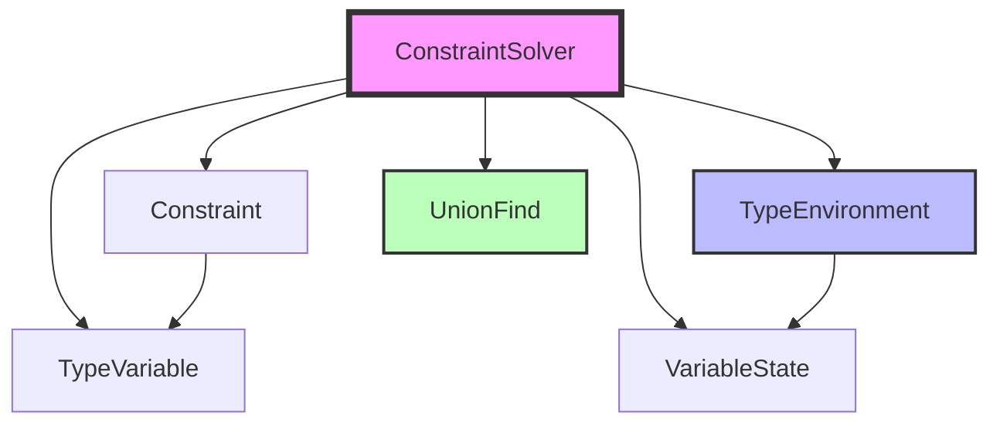
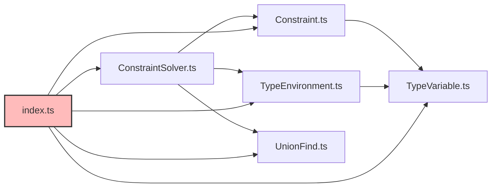
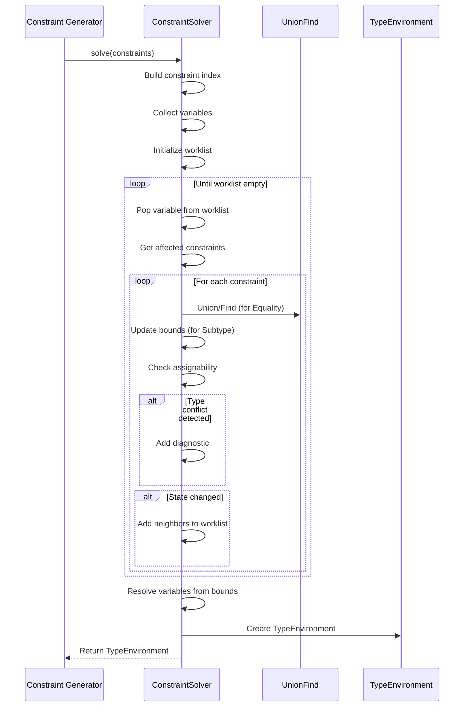
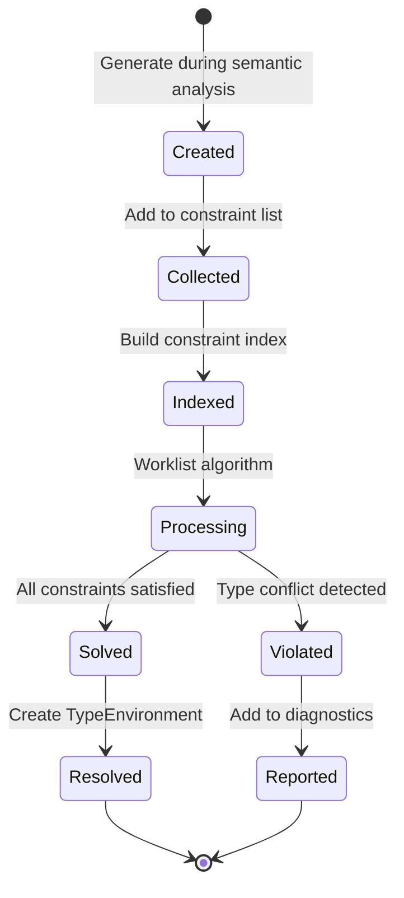
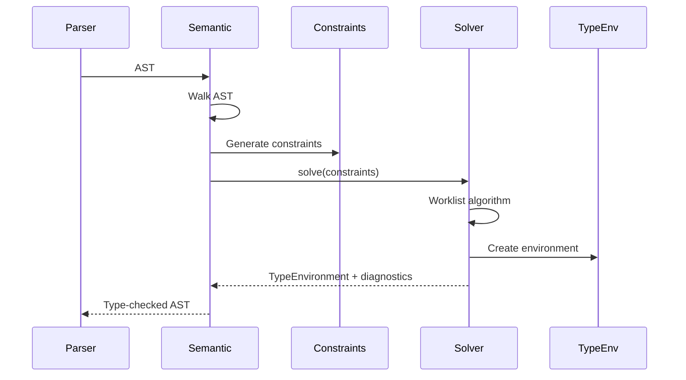

# Compiler Constraints

## Pendahuluan

### Apa itu Constraint?

Folder `compiler/constraints` berisi sistem **constraint solving** untuk type inference dalam compiler RouteSync. Constraint adalah representasi dari **hubungan type** yang harus dipenuhi dalam program. Sistem constraint solving mengumpulkan constraint-constraint ini dan menyelesaikannya untuk menemukan tipe yang paling tepat untuk setiap variabel dalam program.

Constraint solving adalah teknik fundamental dalam type inference yang digunakan oleh banyak compiler modern. Alih-alih melakukan type checking secara langsung, compiler mengumpulkan constraint tentang hubungan antar types, kemudian menyelesaikan sistem constraint ini untuk menemukan solusi yang konsisten.

### Tujuan Folder `compiler/constraints`

Folder ini menyediakan:

1. **Constraint Definitions** - Berbagai jenis constraint yang dapat digunakan
2. **Constraint Solver** - Algorithm untuk menyelesaikan sistem constraint
3. **Type Environment** - Environment untuk menyimpan hasil type inference
4. **Type Variable** - Representasi variabel type yang belum diketahui
5. **Union-Find** - Data structure untuk equivalence class management


### Peran Constraint dalam Pipeline Compiler

Constraint system berada di tahap **type checking** dalam compiler pipeline:

```
Scanner → Parser → Semantic Analysis → Constraint Generation → Constraint Solving → IR Building
                                              ↓                        ↓
                                        Constraints            Type Environment
```

Peran utama:

- **Type Inference** - Menentukan tipe untuk expressions yang tidak memiliki type annotation
- **Type Checking** - Memverifikasi bahwa types dalam program konsisten
- **Error Detection** - Menemukan type conflicts dan incompatibilities
- **Subtype Relationships** - Menangani inheritance dan interface implementations

### Mengapa Sistem Constraint Diperlukan?

Tanpa sistem constraint:

1. **Type Inference Tidak Mungkin** - Tidak ada mekanisme untuk infer types dari usage
2. **Type Checking Terlalu Rigid** - Harus ada explicit annotation untuk semua types
3. **Subtyping Sulit** - Tidak ada cara handle polymorphism dan inheritance properly
4. **Error Messages Buruk** - Sulit melacak root cause dari type conflicts
5. **Circular Dependencies** - Tidak bisa handle mutual recursion dan circular references

Constraint solving menyediakan framework yang flexible dan powerful untuk type inference dan checking.


## Arsitektur

### Struktur Folder

Folder `compiler/constraints` berisi 6 file utama:

```
compiler/constraints/
├── Constraint.ts           # Constraint type definitions
├── ConstraintSolver.ts     # Main constraint solver
├── TypeEnvironment.ts      # Type binding environment
├── TypeVariable.ts         # Type variable representation
├── UnionFind.ts           # Union-Find data structure
└── index.ts               # Public API exports
```

### Komponen Utama

#### 1. Constraint.ts

File ini mendefinisikan **tipe-tipe constraint** yang dapat digunakan dalam type inference.

**Type Constraint:**

```typescript
type Constraint =
  | { kind: 'PropertyExists'; source: TypeVariable; property: string; expected: TypeVariable; span?: FileSpan }
  | { kind: 'Equality'; source: TypeVariable; target: TypeVariable; span?: FileSpan }
  | { kind: 'Subtype'; source: TypeVariable; target: TypeVariable; span?: FileSpan }
  | { kind: 'ReturnType'; source: TypeVariable; expected: TypeVariable; span?: FileSpan }
  | { kind: 'HasType'; source: TypeVariable; type: SemanticType; span?: FileSpan };
```


**Jenis-jenis Constraint:**

- **`PropertyExists`** - Constraint bahwa suatu type memiliki property tertentu
  - `source`: Type variable yang harus memiliki property
  - `property`: Nama property yang harus ada
  - `expected`: Type variable untuk tipe property tersebut
  
- **`Equality`** - Constraint bahwa dua type harus sama (unifikasi)
  - `source`: Type variable pertama
  - `target`: Type variable kedua
  
- **`Subtype`** - Constraint bahwa source adalah subtype dari target
  - `source`: Type variable yang harus menjadi subtype
  - `target`: Type variable supertype
  
- **`ReturnType`** - Constraint untuk return type dari function
  - `source`: Type variable untuk function
  - `expected`: Type variable untuk return type
  
- **`HasType`** - Constraint bahwa variable memiliki concrete type tertentu
  - `source`: Type variable
  - `type`: Concrete semantic type

**Interface ConstraintViolation:**

```typescript
interface ConstraintViolation {
  readonly code: string;      // Error code (e.g., 'RS1023')
  readonly message: string;   // Human-readable error message
  readonly location?: FileSpan; // Optional source location
}
```

Digunakan untuk melaporkan type errors yang ditemukan saat constraint solving.


#### 2. ConstraintSolver.ts

File ini mengimplementasikan **algorithm constraint solving**.

**Class `ConstraintSolver`:**

```typescript
class ConstraintSolver {
  public readonly diagnostics: ConstraintViolation[];
  
  public solve(constraints: readonly Constraint[]): TypeEnvironment
  
  private checkAssignability(source: SemanticType, target: SemanticType): boolean
  private typeName(type: SemanticType): string
  private join(types: Set<SemanticType>): SemanticType | undefined
  private resolveVariable(id: number, state: VariableState): SemanticType | undefined
  private collectVariables(constraints: readonly Constraint[]): readonly number[]
  private getAffectedConstraints(variable: number, index: Map<number, Constraint[]>): readonly Constraint[]
  private solveConstraint(constraint: Constraint, uf: UnionFind, states: Map<number, VariableState>): boolean
}
```

**Fungsi:**
- Menyelesaikan sistem constraint menggunakan **worklist algorithm**
- Menggunakan **Union-Find** untuk manage equivalence classes
- Melacak **lower bounds** dan **upper bounds** untuk setiap type variable
- Men-generate **ConstraintViolation** untuk type conflicts
- Menghasilkan **TypeEnvironment** dengan resolved types

**Algorithm Overview:**
1. Build constraint index dan dependency graph
2. Collect semua type variables
3. Initialize worklist dengan semua variables
4. Process worklist: solve constraints dan propagate changes
5. Merge equivalent variables menggunakan Union-Find
6. Resolve final types dari bounds
7. Return TypeEnvironment dengan hasil


#### 3. TypeEnvironment.ts

File ini mengimplementasikan **environment untuk type bindings**.

**Class `TypeEnvironment`:**

```typescript
class TypeEnvironment {
  constructor(private readonly bindings: ReadonlyMap<number, SemanticType>)
  
  public bind(id: number, type: SemanticType): TypeEnvironment
  public resolve(variable: number): SemanticType | undefined
}
```

**Fungsi:**
- Menyimpan mapping dari type variable ID ke resolved type
- Immutable - setiap `bind()` menghasilkan environment baru
- Digunakan sebagai hasil dari constraint solving

**Interface `VariableState`:**

```typescript
interface VariableState {
  readonly lowerBounds: Set<SemanticType>;
  readonly upperBounds: Set<SemanticType>;
}
```

Menyimpan bounds untuk type variable selama constraint solving:
- **lowerBounds**: Types yang harus menjadi supertype dari variable
- **upperBounds**: Types yang harus menjadi subtype dari variable

#### 4. TypeVariable.ts

File ini mendefinisikan **representasi type variable**.

**Interface `TypeVariable`:**

```typescript
interface TypeVariable {
  readonly id: number;      // Unique identifier
  readonly name: string;    // Human-readable name
}
```

Type variable adalah placeholder untuk type yang belum diketahui. Constraint solver akan mencari concrete type yang memenuhi semua constraint untuk setiap type variable.


#### 5. UnionFind.ts

File ini mengimplementasikan **Union-Find (Disjoint Set) data structure**.

**Class `UnionFind`:**

```typescript
class UnionFind {
  private parent: Map<number, number>;
  private rank: Map<number, number>;
  
  public find(id: number): number
  public union(a: number, b: number): void
}
```

**Fungsi:**
- Mengelola equivalence classes untuk type variables
- `find()`: Mencari representative dari equivalence class dengan path compression
- `union()`: Menggabungkan dua equivalence classes dengan union by rank
- Digunakan untuk Equality constraints (type unification)

**Time Complexity:**
- `find()`: O(α(n)) - hampir constant time dengan path compression
- `union()`: O(α(n)) - hampir constant time dengan union by rank
- α(n) adalah inverse Ackermann function, sangat kecil dalam praktik

#### 6. index.ts

File ini meng-export public API dari module constraints.

```typescript
export type { TypeVariable } from './TypeVariable';
export type { Constraint, ConstraintViolation } from './Constraint';
export { TypeEnvironment, type VariableState } from './TypeEnvironment';
export { UnionFind } from './UnionFind';
export { ConstraintSolver } from './ConstraintSolver';
```

**Fungsi:**
- Menyediakan clean public API
- Mengekspos semua types dan classes yang diperlukan
- Entry point untuk consumers


### Hubungan Antar Komponen



### Dependency Antar File



**Dependency Detail:**

- `Constraint.ts` bergantung pada `TypeVariable` dan types dari `../types/`
- `ConstraintSolver.ts` bergantung pada semua komponen lain
- `TypeEnvironment.ts` standalone, hanya bergantung pada `../types/SemanticType`
- `TypeVariable.ts` standalone, tidak ada dependency
- `UnionFind.ts` standalone, tidak ada dependency
- `index.ts` meng-aggregate semua exports


## Cara Kerja

### Pembuatan Constraint

Constraints dibuat selama **semantic analysis** phase:

```typescript
import { Constraint, TypeVariable } from './compiler/constraints';

// Create type variables
const var1: TypeVariable = { id: 1, name: 'T1' };
const var2: TypeVariable = { id: 2, name: 'T2' };
const var3: TypeVariable = { id: 3, name: 'T3' };

// Create constraints
const constraints: Constraint[] = [];

// Equality constraint: T1 = T2
constraints.push({
  kind: 'Equality',
  source: var1,
  target: var2,
  span: { filePath: 'test.ts', start: 0, length: 10, line: 1, column: 1 }
});

// Subtype constraint: T1 <: T3
constraints.push({
  kind: 'Subtype',
  source: var1,
  target: var3
});

// HasType constraint: T3 has concrete type 'string'
constraints.push({
  kind: 'HasType',
  source: var3,
  type: { kind: 'primitive', type: 'string' }
});
```

### Proses Constraint Solving




### Algorithm Detail

#### 1. Initialization

```typescript
// Build constraint index untuk efficient lookup
const constraintIndex = new Map<number, Constraint[]>();
for (const constraint of constraints) {
  const list = constraintIndex.get(constraint.source.id) ?? [];
  list.push(constraint);
  constraintIndex.set(constraint.source.id, list);
}

// Build dependency graph untuk propagation
const neighbors = new Map<number, Set<number>>();
// Add edges for Subtype constraints
```

#### 2. Worklist Processing

```typescript
const worklist: number[] = collectVariables(constraints);

while (worklist.length > 0) {
  const variable = worklist.pop()!;
  
  // Process all constraints affecting this variable
  for (const constraint of getAffectedConstraints(variable)) {
    const changed = solveConstraint(constraint, uf, states);
    
    // If state changed, propagate to neighbors
    if (changed) {
      const adj = neighbors.get(variable) ?? new Set();
      worklist.push(...adj);
    }
  }
}
```

#### 3. Constraint Resolution

**Equality Constraint:**
```typescript
// Merge equivalence classes
const rootA = uf.find(source.id);
const rootB = uf.find(target.id);
uf.union(source.id, target.id);

// Merge bounds dari both variables
const merged: VariableState = {
  lowerBounds: new Set([...stateA.lowerBounds, ...stateB.lowerBounds]),
  upperBounds: new Set([...stateA.upperBounds, ...stateB.upperBounds])
};
```

**Subtype Constraint:**
```typescript
// Propagate lower bounds forward
for (const lower of sourceState.lowerBounds) {
  destState.lowerBounds.add(lower);
  
  // Check against upper bounds
  for (const upper of destState.upperBounds) {
    if (!checkAssignability(lower, upper)) {
      diagnostics.push({
        code: 'RS1023',
        message: 'Type conflict detected'
      });
    }
  }
}

// Propagate upper bounds backward
for (const upper of destState.upperBounds) {
  sourceState.upperBounds.add(upper);
}
```


#### 4. Variable Resolution

```typescript
// For each variable, resolve to concrete type
for (const [id, state] of states.entries()) {
  const rep = uf.find(id);  // Get representative
  const repState = states.get(rep) || state;
  
  // Prefer lower bounds (most specific type)
  const resolved = resolveVariable(rep, repState);
  if (resolved) {
    environment = environment.bind(id, resolved);
  }
}

// Join multiple types into union if needed
function join(types: Set<SemanticType>): SemanticType | undefined {
  if (types.size === 0) return undefined;
  if (types.size === 1) return Array.from(types)[0];
  return new UnionType(new ImmutableSet(types));
}
```

### Lifecycle Constraint



### Penggunaan oleh Komponen Lain

Constraints digunakan dalam type checking phase:

```typescript
// Type checker generates constraints
class TypeChecker {
  private constraints: Constraint[] = [];
  private varCounter = 0;
  
  check(program: Program): TypeEnvironment {
    // Generate constraints from program
    this.generateConstraints(program);
    
    // Solve constraints
    const solver = new ConstraintSolver();
    const env = solver.solve(this.constraints);
    
    // Report errors
    if (solver.diagnostics.length > 0) {
      this.reportErrors(solver.diagnostics);
    }
    
    return env;
  }
}
```


## Cara Penggunaan

### Membuat Type Variable

```typescript
import { TypeVariable } from './compiler/constraints';

// Create type variable manually
const typeVar: TypeVariable = {
  id: 1,
  name: 'T'
};

// Dalam praktik, biasanya menggunakan counter
let nextVarId = 0;

function freshTypeVariable(name?: string): TypeVariable {
  return {
    id: nextVarId++,
    name: name ?? `T${nextVarId}`
  };
}

const t1 = freshTypeVariable('User');
const t2 = freshTypeVariable('Response');
```

### Membuat Berbagai Jenis Constraint

#### PropertyExists Constraint

Digunakan untuk memastikan object memiliki property tertentu:

```typescript
import { Constraint, TypeVariable } from './compiler/constraints';

const objVar = freshTypeVariable('obj');
const propVar = freshTypeVariable('prop');

const constraint: Constraint = {
  kind: 'PropertyExists',
  source: objVar,        // Object yang harus punya property
  property: 'userId',    // Nama property
  expected: propVar,     // Type dari property tersebut
  span: {
    filePath: 'user.ts',
    start: 100,
    length: 15,
    line: 5,
    column: 10
  }
};

// Contoh: obj.userId → userId harus exist dan bertipe propVar
```

#### Equality Constraint

Digunakan untuk unifikasi dua type variables:

```typescript
const t1 = freshTypeVariable('source');
const t2 = freshTypeVariable('target');

const equalityConstraint: Constraint = {
  kind: 'Equality',
  source: t1,
  target: t2,
  span: { filePath: 'test.ts', start: 0, length: 5, line: 1, column: 1 }
};

// T1 = T2
// Kedua variables akan diselesaikan ke type yang sama
```


#### Subtype Constraint

Digunakan untuk relationship subtype/supertype:

```typescript
const userType = freshTypeVariable('User');
const personType = freshTypeVariable('Person');

const subtypeConstraint: Constraint = {
  kind: 'Subtype',
  source: userType,
  target: personType
};

// User <: Person
// User adalah subtype dari Person
```

#### ReturnType Constraint

Digunakan untuk menghubungkan function dengan return type-nya:

```typescript
const funcVar = freshTypeVariable('getUser');
const returnVar = freshTypeVariable('UserResponse');

const returnConstraint: Constraint = {
  kind: 'ReturnType',
  source: funcVar,
  expected: returnVar
};

// getUser() returns UserResponse
```

#### HasType Constraint

Digunakan untuk memberikan concrete type pada variable:

```typescript
import { SemanticType } from '../types/SemanticType';

const stringVar = freshTypeVariable('name');

const hasTypeConstraint: Constraint = {
  kind: 'HasType',
  source: stringVar,
  type: { kind: 'primitive', type: 'string' } as SemanticType
};

// name: string
```

### Menggunakan ConstraintSolver

```typescript
import { ConstraintSolver, Constraint, TypeVariable } from './compiler/constraints';

// 1. Buat constraints
const constraints: Constraint[] = [];

const t1 = freshTypeVariable('x');
const t2 = freshTypeVariable('y');
const t3 = freshTypeVariable('z');

// x = y
constraints.push({
  kind: 'Equality',
  source: t1,
  target: t2
});

// y <: z
constraints.push({
  kind: 'Subtype',
  source: t2,
  target: t3
});

// z: string
constraints.push({
  kind: 'HasType',
  source: t3,
  type: { kind: 'primitive', type: 'string' }
});

// 2. Solve constraints
const solver = new ConstraintSolver();
const env = solver.solve(constraints);

// 3. Check for errors
if (solver.diagnostics.length > 0) {
  for (const diag of solver.diagnostics) {
    console.error(`[${diag.code}] ${diag.message}`);
    if (diag.location) {
      console.error(`  at ${diag.location.filePath}:${diag.location.line}:${diag.location.column}`);
    }
  }
}

// 4. Resolve types
const t1Type = env.resolve(t1.id);
const t2Type = env.resolve(t2.id);
const t3Type = env.resolve(t3.id);

console.log(`t1: ${t1Type}`); // t1: string
console.log(`t2: ${t2Type}`); // t2: string
console.log(`t3: ${t3Type}`); // t3: string
```


### Menggunakan TypeEnvironment

```typescript
import { TypeEnvironment } from './compiler/constraints';
import { SemanticType } from '../types/SemanticType';

// Create empty environment
let env = new TypeEnvironment(new Map());

// Bind types
const stringType: SemanticType = { kind: 'primitive', type: 'string' };
const numberType: SemanticType = { kind: 'primitive', type: 'number' };

env = env.bind(1, stringType);
env = env.bind(2, numberType);

// Resolve types
const type1 = env.resolve(1); // { kind: 'primitive', type: 'string' }
const type2 = env.resolve(2); // { kind: 'primitive', type: 'number' }
const type3 = env.resolve(3); // undefined (not bound)
```

### Contoh Lengkap: Type Inference untuk Function Call

```typescript
import { ConstraintSolver, Constraint, TypeVariable } from './compiler/constraints';
import { SemanticType } from '../types/SemanticType';

// Function: function getUser(id: number): User
// Call: const result = getUser(42);

let varId = 0;
const freshVar = (name?: string) => ({ 
  id: varId++, 
  name: name ?? `T${varId}` 
});

const constraints: Constraint[] = [];

// Type variables
const funcType = freshVar('getUser');
const paramType = freshVar('id');
const returnType = freshVar('result');
const numberLiteral = freshVar('42');

// Constraint 1: getUser returns result
constraints.push({
  kind: 'ReturnType',
  source: funcType,
  expected: returnType
});

// Constraint 2: parameter id has type number
constraints.push({
  kind: 'HasType',
  source: paramType,
  type: { kind: 'primitive', type: 'number' }
});

// Constraint 3: literal 42 has type number
constraints.push({
  kind: 'HasType',
  source: numberLiteral,
  type: { kind: 'primitive', type: 'number' }
});

// Constraint 4: argument must match parameter
constraints.push({
  kind: 'Equality',
  source: numberLiteral,
  target: paramType
});

// Solve
const solver = new ConstraintSolver();
const env = solver.solve(constraints);

// Get result type
const resultType = env.resolve(returnType.id);
console.log('Result type:', resultType); // User type (from function signature)
```


## Panduan Pengembangan

### Kapan Membuat Constraint Baru

Pertimbangkan menambah jenis constraint baru ketika:

1. **Type Relationship Baru** - Ada hubungan type yang tidak dapat diekspresikan dengan constraint yang ada
2. **Language Feature Baru** - Menambahkan fitur bahasa yang membutuhkan type checking khusus
3. **Optimization Opportunity** - Constraint khusus dapat membuat solving lebih efisien
4. **Better Error Messages** - Constraint spesifik dapat memberikan diagnostic yang lebih baik

**Contoh kapan perlu constraint baru:**
- Generic type parameters dengan bounds
- Conditional types
- Mapped types
- Template literal types

### Best Practices

#### 1. Membuat Constraint yang Modular

```typescript
// ✅ Good: Constraint focused dan single-purpose
const equalityConstraint: Constraint = {
  kind: 'Equality',
  source: t1,
  target: t2
};

// ❌ Bad: Jangan combine multiple concerns dalam satu constraint
const complexConstraint = {
  kind: 'ComplexRelationship',
  source: t1,
  targets: [t2, t3, t4],
  conditions: ['subtype', 'equality', 'property']
};
```

#### 2. Always Provide Source Location

```typescript
// ✅ Good: Include span untuk better error messages
const constraint: Constraint = {
  kind: 'Subtype',
  source: userType,
  target: personType,
  span: {
    filePath: 'models/user.ts',
    start: 245,
    length: 10,
    line: 12,
    column: 5
  }
};

// ⚠️ Acceptable: Span optional, tapi less useful for debugging
const constraint: Constraint = {
  kind: 'Subtype',
  source: userType,
  target: personType
};
```

#### 3. Menggunakan Type Variables dengan Nama Deskriptif

```typescript
// ✅ Good: Descriptive names
const userType = freshTypeVariable('User');
const userIdType = freshTypeVariable('User.id');
const responseType = freshTypeVariable('ApiResponse<User>');

// ❌ Bad: Cryptic names
const t1 = freshTypeVariable('T1');
const t2 = freshTypeVariable('T2');
```

#### 4. Constraint Generation Harus Deterministik

```typescript
// ✅ Good: Consistent order
function generateConstraints(nodes: ASTNode[]): Constraint[] {
  const constraints: Constraint[] = [];
  
  // Process dalam order yang consistent
  for (const node of nodes.sort((a, b) => a.id - b.id)) {
    constraints.push(...analyzeNode(node));
  }
  
  return constraints;
}

// ❌ Bad: Non-deterministic order
function generateConstraints(nodes: Set<ASTNode>): Constraint[] {
  const constraints: Constraint[] = [];
  
  // Set iteration order tidak dijamin
  for (const node of nodes) {
    constraints.push(...analyzeNode(node));
  }
  
  return constraints;
}
```


#### 5. Handle Circular Constraints dengan Hati-hati

```typescript
// ⚠️ Perhatian: Circular constraints dapat menyebabkan infinite loop
const t1 = freshTypeVariable('A');
const t2 = freshTypeVariable('B');

// A <: B, B <: A → A = B (handled by solver)
constraints.push({ kind: 'Subtype', source: t1, target: t2 });
constraints.push({ kind: 'Subtype', source: t2, target: t1 });

// ✅ Solver harus detect dan handle circular dependencies
// Union-Find structure membantu menangani ini
```

### Anti-Patterns yang Harus Dihindari

#### 1. ❌ Mutating Constraints Setelah Dibuat

```typescript
// ❌ Bad: Mengubah constraint setelah dibuat
const constraint: Constraint = {
  kind: 'Equality',
  source: t1,
  target: t2
};

// Don't do this!
(constraint as any).target = t3;
```

#### 2. ❌ Mengabaikan Diagnostics

```typescript
// ❌ Bad: Tidak check errors
const solver = new ConstraintSolver();
const env = solver.solve(constraints);
// Langsung menggunakan env tanpa check errors

// ✅ Good: Always check diagnostics
const solver = new ConstraintSolver();
const env = solver.solve(constraints);

if (solver.diagnostics.length > 0) {
  // Handle errors properly
  throw new TypeCheckError(solver.diagnostics);
}
```

#### 3. ❌ Over-constraining

```typescript
// ❌ Bad: Terlalu banyak constraint yang redundant
constraints.push({ kind: 'Equality', source: t1, target: t2 });
constraints.push({ kind: 'Equality', source: t2, target: t1 }); // Redundant
constraints.push({ kind: 'Subtype', source: t1, target: t2 });  // Redundant
constraints.push({ kind: 'Subtype', source: t2, target: t1 });  // Redundant

// ✅ Good: Minimal necessary constraints
constraints.push({ kind: 'Equality', source: t1, target: t2 });
```

#### 4. ❌ Mixing Concerns

```typescript
// ❌ Bad: Constraint solver tidak boleh melakukan code generation
class BadConstraintSolver extends ConstraintSolver {
  solve(constraints: Constraint[]): TypeEnvironment {
    const env = super.solve(constraints);
    
    // Don't generate code here!
    this.generateTypeScript(env);
    
    return env;
  }
}

// ✅ Good: Separation of concerns
const env = solver.solve(constraints);
const code = emitter.emit(env); // Separate step
```

### Konvensi Penamaan

- **Type Variables**: PascalCase untuk concrete types (`User`, `Response`)
- **Constraint Variables**: camelCase untuk descriptive names (`userId`, `returnType`)
- **Diagnostic Codes**: Format `RS####` (e.g., `RS1023`)
- **Error Messages**: Clear, actionable, include context

### Menjaga Modularitas

Constraint system harus tetap modular dan independent:

```typescript
// ✅ Good: Pure constraint solving
class ConstraintSolver {
  solve(constraints: Constraint[]): TypeEnvironment {
    // Only concern: solving constraints
    // No AST manipulation, no code generation
  }
}

// ✅ Good: Constraint generation terpisah
class TypeChecker {
  generateConstraints(ast: AST): Constraint[] {
    // Generate constraints from AST
  }
  
  check(ast: AST): TypeEnvironment {
    const constraints = this.generateConstraints(ast);
    const solver = new ConstraintSolver();
    return solver.solve(constraints);
  }
}
```


## Struktur Folder

### Ringkasan File

| File | Tanggung Jawab | Ukuran (Lines) | Kompleksitas |
|------|----------------|----------------|--------------|
| `Constraint.ts` | Type definitions untuk constraints | ~30 | Sederhana |
| `ConstraintSolver.ts` | Main solving algorithm | ~250 | Tinggi |
| `TypeEnvironment.ts` | Type binding storage | ~40 | Sederhana |
| `TypeVariable.ts` | Type variable definition | ~10 | Sederhana |
| `UnionFind.ts` | Equivalence class management | ~60 | Sedang |
| `index.ts` | Public API exports | ~10 | Sederhana |

### Detail Tanggung Jawab

#### Constraint.ts
- Mendefinisikan semua jenis constraint
- Mendefinisikan ConstraintViolation interface
- Tidak ada logic, hanya type definitions

#### ConstraintSolver.ts
- Core constraint solving logic
- Worklist algorithm implementation
- Type assignability checking
- Bound propagation
- Diagnostic generation
- Paling kompleks dari semua file

#### TypeEnvironment.ts
- Immutable type binding storage
- Simple get/set interface
- Juga mendefinisikan VariableState untuk bounds tracking

#### TypeVariable.ts
- Minimal interface definition
- Just ID and name
- Paling sederhana

#### UnionFind.ts
- Classic Union-Find data structure
- Path compression optimization
- Union by rank optimization
- Standalone, tidak ada dependency ke compiler lain

#### index.ts
- Re-export public API
- Entry point untuk consumers
- Tidak ada logic


## Referensi Implementasi

### Interaksi dengan Type System

Constraint system bergantung pada `SemanticType` dari `../types/`:

```typescript
import { SemanticType } from '../types/SemanticType';

// Constraint dapat reference concrete types
const hasTypeConstraint: Constraint = {
  kind: 'HasType',
  source: typeVar,
  type: semanticType  // SemanticType from type system
};
```

Semantic types yang umum digunakan:
- **Primitive types**: `{ kind: 'primitive', type: 'string' | 'number' | 'boolean' }`
- **Object types**: Dengan properties dan methods
- **Union types**: Kombinasi multiple types
- **Array types**: Collections
- **Function types**: Callable types

### Integrasi dengan Compiler Pipeline

Constraint system digunakan dalam semantic analysis phase:



**Typical usage pattern:**

1. **Parser** menghasilkan AST
2. **Semantic Analyzer** melakukan traversal AST dan generate constraints
3. **ConstraintSolver** menyelesaikan constraints
4. **TypeEnvironment** hasil digunakan untuk annotate AST dengan types
5. **Diagnostics** dilaporkan ke user

### Performance Characteristics

#### Time Complexity

- **Constraint Generation**: O(n) dimana n = jumlah AST nodes
- **Constraint Solving**: O(m × α(k)) dimana:
  - m = jumlah constraints
  - k = jumlah type variables
  - α = inverse Ackermann function (hampir constant)
- **Worst case**: O(m × k) jika banyak propagation

#### Space Complexity

- **Constraint Storage**: O(m) untuk m constraints
- **Type Environment**: O(k) untuk k type variables
- **Union-Find**: O(k) untuk k variables
- **Variable States**: O(k × b) dimana b = average bounds per variable

#### Optimization Strategies

1. **Union-Find dengan Path Compression** - Membuat find() hampir O(1)
2. **Constraint Indexing** - Fast lookup untuk affected constraints
3. **Worklist Algorithm** - Hanya process variables yang berubah
4. **Early Termination** - Stop ketika menemukan contradiction

### Limitasi Implementasi Saat Ini

Berdasarkan analisis source code, implementasi saat ini memiliki beberapa limitasi:

1. **Generic Types** - Belum ada constraint untuk generic type parameters
2. **Intersection Types** - Hanya union types yang di-handle, tidak ada intersection
3. **Conditional Types** - Tidak ada support untuk conditional type inference
4. **Recursive Types** - Handling untuk recursive type definitions terbatas

### Potential Extensions

Kemungkinan pengembangan di masa depan:

1. **Generic Constraint**: `{ kind: 'Generic', typeParam: T, bounds: Constraint[] }`
2. **Intersection Constraint**: `{ kind: 'Intersection', sources: TypeVariable[] }`
3. **Conditional Constraint**: `{ kind: 'Conditional', condition: Constraint, then: Constraint, else: Constraint }`
4. **Recursive Constraint**: Dengan detection untuk infinite recursion

### Testing Recommendations

Untuk menguji constraint system:

```typescript
describe('ConstraintSolver', () => {
  it('should unify equal types', () => {
    const t1 = { id: 1, name: 'T1' };
    const t2 = { id: 2, name: 'T2' };
    
    const constraints: Constraint[] = [
      { kind: 'Equality', source: t1, target: t2 },
      { kind: 'HasType', source: t2, type: { kind: 'primitive', type: 'string' } }
    ];
    
    const solver = new ConstraintSolver();
    const env = solver.solve(constraints);
    
    expect(env.resolve(1)).toEqual({ kind: 'primitive', type: 'string' });
    expect(env.resolve(2)).toEqual({ kind: 'primitive', type: 'string' });
  });
  
  it('should detect type conflicts', () => {
    const t = { id: 1, name: 'T' };
    
    const constraints: Constraint[] = [
      { kind: 'HasType', source: t, type: { kind: 'primitive', type: 'string' } },
      { kind: 'HasType', source: t, type: { kind: 'primitive', type: 'number' } }
    ];
    
    const solver = new ConstraintSolver();
    solver.solve(constraints);
    
    expect(solver.diagnostics.length).toBeGreaterThan(0);
    expect(solver.diagnostics[0].code).toBe('RS1023');
  });
});
```

---

## Kesimpulan

Folder `compiler/constraints` menyediakan sistem constraint solving yang powerful untuk type inference dan checking. Dengan architecture yang modular dan algorithm yang efisien, sistem ini dapat handle complex type relationships sambil memberikan error messages yang helpful.

Key takeaways:

- **Modular Design** - Setiap komponen memiliki responsibility yang jelas
- **Efficient Algorithm** - Union-Find dan worklist algorithm membuat solving cepat
- **Extensible** - Mudah menambah constraint types baru
- **Type Safe** - Semua types explicit, tidak ada `any`
- **Error Reporting** - Diagnostic system yang comprehensive

Untuk kontributor: Pahami constraint generation → solving → resolution pipeline sebelum melakukan modifikasi. Pastikan tests comprehensive untuk setiap perubahan pada constraint system.
