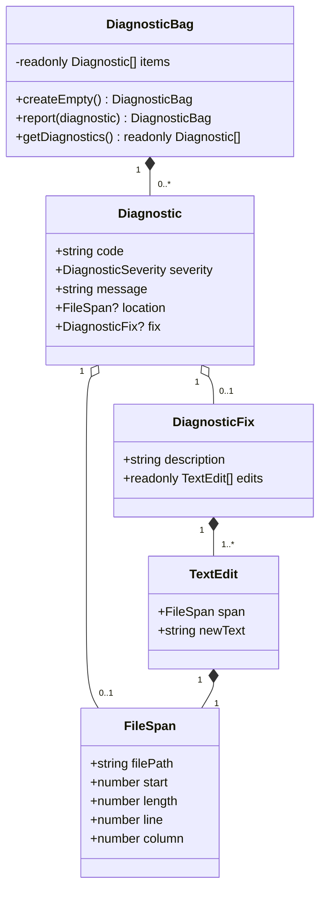
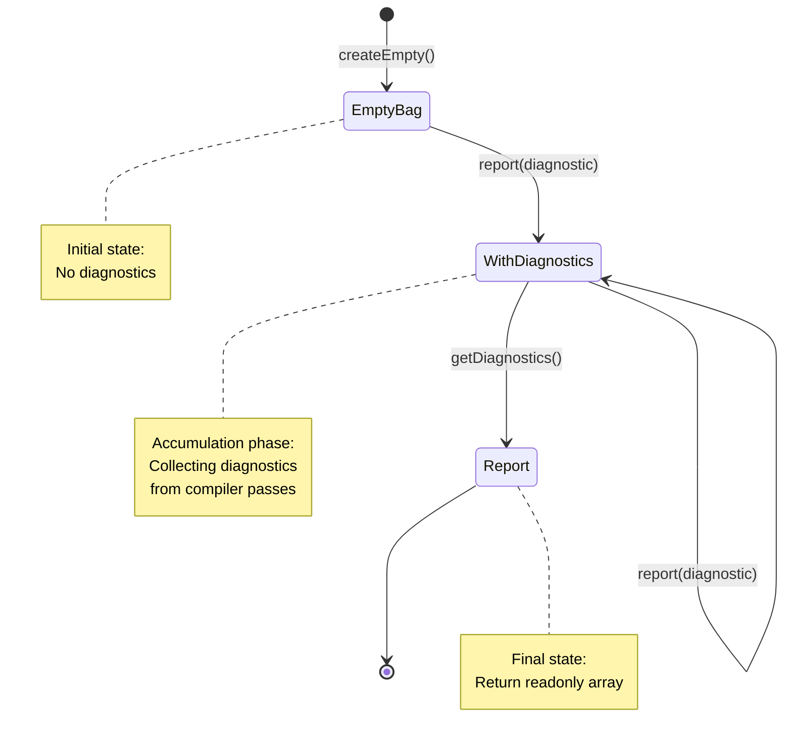
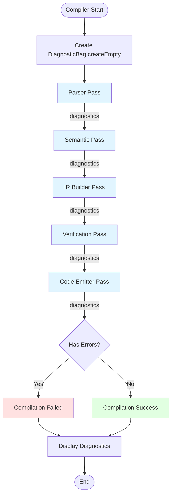

# Compiler Diagnostics

## Pendahuluan

### Apa itu Diagnostics dalam Arsitektur Compiler RouteSync

Modul **Diagnostics** adalah sistem pelaporan error dan warning compiler yang dirancang dengan pendekatan immutable dan type-safe. Diagnostics mengumpulkan semua error, warning, dan informasi tambahan yang dihasilkan selama proses kompilasi, mulai dari tahap parsing, semantic analysis, IR building, hingga code emission.

Dalam arsitektur compiler modern seperti Rust Compiler, TypeScript Compiler, dan LLVM, diagnostics merupakan komponen krusial yang memisahkan antara:
- **Detection**: Mendeteksi masalah dalam kode
- **Reporting**: Melaporkan masalah dengan informasi yang jelas
- **Recovery**: Memberikan saran perbaikan (code fixes)

### Peran Diagnostics dalam Pipeline Compiler

Diagnostics berperan sebagai **error reporting layer** yang:

1. **Mengumpulkan error dan warning** dari semua tahap kompilasi
2. **Menyediakan context lokasi** dengan informasi file, line, dan column
3. **Memberikan code fixes** untuk masalah yang dapat diperbaiki otomatis
4. **Mendukung error recovery** untuk melanjutkan kompilasi setelah menemukan error
5. **Immutable by design** untuk mendukung concurrent compilation dan caching

Diagnostics **tidak** melakukan:
- Parsing atau syntax analysis
- Type checking atau semantic analysis
- Code generation atau transformation

Diagnostics hanya **melaporkan hasil** dari operasi-operasi tersebut.

### Mengapa Tahap Diagnostics Diperlukan

Tanpa sistem diagnostics yang terstruktur, compiler akan:

1. **Sulit di-debug**: Error messages tersebar di berbagai tempat tanpa struktur konsisten
2. **Tidak user-friendly**: Pesan error tidak memberikan context lokasi yang jelas
3. **Tidak extensible**: Sulit menambahkan code fixes atau suggestions
4. **Tidak testable**: Tidak ada cara standar untuk memverifikasi error messages
5. **Tidak composable**: Tidak bisa mengakumulasi errors dari multiple passes

Dengan sistem diagnostics yang terstruktur seperti ini, compiler dapat:
- Memberikan error messages yang **precise dan actionable**
- Menyediakan **code fixes otomatis** untuk masalah umum
- Mendukung **IDE integration** (LSP, diagnostics panel)
- Memungkinkan **batch error reporting** untuk compile-time checks
- Mendukung **incremental compilation** dengan error caching


## Arsitektur

### Struktur File

Folder `compiler/diagnostics` berisi tiga file utama:

```
compiler/diagnostics/
├── Diagnostic.ts        # Type definitions untuk diagnostic, fixes, dan edits
├── DiagnosticBag.ts     # Immutable collection untuk diagnostics
└── index.ts             # Public API exports
```

### Komponen Inti

#### 1. `Diagnostic.ts` - Type Definitions

File ini mendefinisikan semua tipe data yang berhubungan dengan diagnostic system.

##### `FileSpan`

Type yang merepresentasikan lokasi dalam source code menggunakan **byte offset**:

```typescript
interface FileSpan {
    readonly filePath: string;  // Path ke source file
    readonly start: number;      // Zero-indexed UTF-16 offset
    readonly length: number;     // Panjang span dalam UTF-16 units
    readonly line: number;       // One-indexed line number
    readonly column: number;     // Zero-indexed column number
}
```

**Design Rationale:**
- Menggunakan **byte offset** (bukan line/column) sebagai canonical representation
- Line/column disediakan untuk display purposes saja
- Offset-based representation mendukung **incremental compilation** dan **fast invalidation**
- Compatible dengan compiler design modern (Rust, TypeScript, LLVM)

**Catatan UTF-16:**
JavaScript strings menggunakan UTF-16 encoding, sehingga emoji dan karakter non-BMP dihitung sebagai 2 code units:

```typescript
const text = "Hello 😀 World";
console.log(text.length); // 14 (bukan 13)
// '😀' dihitung sebagai 2 UTF-16 code units
```

##### `TextEdit`

Merepresentasikan perubahan teks untuk code fix:

```typescript
interface TextEdit {
    readonly span: FileSpan;    // Lokasi yang akan diubah
    readonly newText: string;   // Text pengganti
}
```

`TextEdit` digunakan untuk mendefinisikan transformasi text secara atomic. Contoh:
- Replace identifier name
- Insert missing import
- Remove unused code

##### `DiagnosticFix`

Code fix suggestion yang dapat diaplikasikan otomatis:

```typescript
interface DiagnosticFix {
    readonly description: string;         // Deskripsi fix untuk user
    readonly edits: readonly TextEdit[];  // Sequence of text edits
}
```


`DiagnosticFix` dapat berisi **multiple edits** yang diaplikasikan secara atomic. Hal ini mendukung code fixes yang kompleks seperti:
- Rename symbol di multiple locations
- Add import dan update usage
- Refactor pattern dengan multiple changes

##### `DiagnosticSeverity`

Type literal untuk severity level:

```typescript
type DiagnosticSeverity = 'error' | 'warning';
```

Hanya ada dua severity level:
- **`'error'`**: Masalah yang membuat compilation gagal (type error, syntax error, dll)
- **`'warning'`**: Masalah yang tidak membuat compilation gagal tapi perlu perhatian (unused variables, deprecated API, dll)

**Tidak ada** `'info'` atau `'hint'` level karena mereka tidak relevan untuk compiler diagnostic. Jika di masa depan diperlukan, dapat ditambahkan dengan mudah.

##### `Diagnostic`

Interface utama yang merepresentasikan satu diagnostic (error atau warning):

```typescript
interface Diagnostic {
    readonly code: string;                // e.g., 'E0001', 'W0042'
    readonly severity: DiagnosticSeverity;
    readonly message: string;
    readonly location?: FileSpan;         // Optional
    readonly fix?: DiagnosticFix;         // Optional
}
```


**Field descriptions:**

- **`code`**: Unique identifier untuk diagnostic (contoh: `'E0001'` untuk error, `'W0042'` untuk warning). Code ini memungkinkan:
  - Error suppression (`@routesync-ignore E0001`)
  - Documentation linking (`See: docs.routesync.com/errors/E0001`)
  - Automated fix application

- **`severity`**: Level keparahan (`'error'` atau `'warning'`)

- **`message`**: Human-readable error message yang menjelaskan masalah

- **`location`**: Optional. Lokasi di source code. Jika tidak ada, diagnostic berlaku untuk keseluruhan compilation unit.

- **`fix`**: Optional. Code fix suggestion yang dapat diaplikasikan secara otomatis atau ditampilkan ke user.

#### 2. `DiagnosticBag.ts` - Immutable Collection

`DiagnosticBag` adalah **immutable collection** untuk mengumpulkan diagnostics selama kompilasi.

##### Class Definition

```typescript
class DiagnosticBag {
    private constructor(private readonly items: readonly Diagnostic[] = []) { }
    
    public static createEmpty(): DiagnosticBag
    public report(diagnostic: Diagnostic): DiagnosticBag
    public getDiagnostics(): readonly Diagnostic[]
}
```


##### Design Pattern: Immutability

`DiagnosticBag` mengimplementasikan **persistent data structure** dengan copy-on-write semantics:

1. **Constructor private**: Mencegah instantiation langsung
2. **Factory method**: `createEmpty()` sebagai starting point
3. **Copy-on-write**: `report()` return new instance, tidak modify existing
4. **Readonly return**: `getDiagnostics()` return readonly array

**Keuntungan immutability:**
- **Thread-safe**: Dapat digunakan di concurrent compilation tanpa locking
- **Cacheable**: Diagnostic state dapat di-cache dengan aman
- **Traceable**: Setiap state change menghasilkan new object yang dapat di-track
- **Composable**: Multiple DiagnosticBag dapat di-merge tanpa side effects

##### Method: `createEmpty()`

Factory method untuk membuat empty DiagnosticBag:

```typescript
public static createEmpty(): DiagnosticBag {
    return new DiagnosticBag([]);
}
```

Selalu gunakan factory method ini untuk membuat DiagnosticBag baru, **jangan** langsung instantiate class.

##### Method: `report(diagnostic)`

Menambahkan diagnostic ke collection dan return new DiagnosticBag:

```typescript
public report(diagnostic: Diagnostic): DiagnosticBag {
    return new DiagnosticBag([...this.items, diagnostic]);
}
```


**Implementasi detail:**
- Menggunakan spread operator `[...this.items, diagnostic]` untuk create new array
- Original `this.items` tidak berubah (immutability)
- Return new `DiagnosticBag` instance dengan updated array

**Usage pattern:**

```typescript
let diagnostics = DiagnosticBag.createEmpty();

// Report error
diagnostics = diagnostics.report({
    code: 'E0001',
    severity: 'error',
    message: 'Type mismatch: expected string, got number'
});

// Report another error
diagnostics = diagnostics.report({
    code: 'E0002',
    severity: 'error',
    message: 'Undefined variable: foo'
});

// Original diagnostics tidak berubah
```

##### Method: `getDiagnostics()`

Mengambil semua diagnostics sebagai readonly array:

```typescript
public getDiagnostics(): readonly Diagnostic[] {
    return this.items;
}
```

Return `readonly Diagnostic[]` untuk mencegah external modification. Caller tidak bisa modify array yang dikembalikan.

#### 3. `index.ts` - Public API

File ini mengexport semua types dan classes yang merupakan public API:


```typescript
export {
    Diagnostic,
    DiagnosticSeverity,
    DiagnosticFix,
    TextEdit,
    FileSpan
} from './Diagnostic';

export { DiagnosticBag } from './DiagnosticBag';
```

**Catatan:** `FileSpan` diimport dari `./Diagnostic` tapi sebenarnya didefinisikan di `compiler/types/FileSpan.ts`. Ini adalah re-export untuk convenience.

### Hubungan Antar Komponen




**Dependency:**

- `DiagnosticBag` bergantung pada `Diagnostic`
- `Diagnostic` bergantung pada `FileSpan`, `DiagnosticFix`
- `DiagnosticFix` bergantung pada `TextEdit`
- `TextEdit` bergantung pada `FileSpan`
- `FileSpan` adalah leaf type (tidak bergantung pada type lain)

**Tidak ada circular dependency** dalam diagnostic system.

## Cara Kerja

### Input ke Diagnostics

Diagnostics menerima input dari berbagai tahap compiler:

1. **Parser**: Syntax errors, malformed input
2. **Semantic Analyzer**: Type errors, undefined symbols
3. **IR Builder**: Invalid transformations, constraint violations
4. **Code Generator**: Generation failures, output errors
5. **Verification Passes**: Invariant violations, consistency checks

Setiap komponen compiler yang menemukan masalah akan **report** ke DiagnosticBag.

### Output dari Diagnostics

Diagnostics menghasilkan:

1. **Collection of diagnostics**: Array of `Diagnostic` objects
2. **Error count**: Jumlah errors (severity === 'error')
3. **Warning count**: Jumlah warnings (severity === 'warning')
4. **Has errors flag**: Boolean indicating compilation failure

Output ini dapat digunakan untuk:
- Display error messages ke user
- Decide apakah compilation harus dihentikan
- Apply code fixes automatically
- Generate diagnostic reports
- Send diagnostics ke IDE (LSP integration)

### Lifecycle Diagnostics



**Penjelasan lifecycle:**

1. **Initialization**: Compiler creates empty DiagnosticBag via `createEmpty()`
2. **Accumulation**: Selama kompilasi, setiap pass report diagnostics via `report()`
3. **Propagation**: DiagnosticBag di-pass antar passes (immutable, copy-on-write)
4. **Finalization**: Setelah kompilasi selesai, call `getDiagnostics()` untuk get final result
5. **Consumption**: Diagnostics dapat diproses untuk display, logging, atau IDE integration


### Alur Diagnostics dalam Compiler Pipeline



Setiap pass dalam pipeline:
1. Menerima DiagnosticBag dari pass sebelumnya
2. Melakukan operasinya (parsing, analysis, dll)
3. Report diagnostics jika menemukan masalah
4. Return updated DiagnosticBag ke pass berikutnya

Jika ada error dengan severity `'error'`, compilation dapat dihentikan atau dilanjutkan dengan error recovery.


## Cara Penggunaan

### Membuat DiagnosticBag Baru

Selalu gunakan factory method `createEmpty()`:

```typescript
import { DiagnosticBag } from '@routesync/core/compiler/diagnostics';

// ✅ Correct
let diagnostics = DiagnosticBag.createEmpty();

// ❌ Wrong - constructor is private
// let diagnostics = new DiagnosticBag();
```

### Melaporkan Error

Report error dengan severity `'error'`:

```typescript
diagnostics = diagnostics.report({
    code: 'E0001',
    severity: 'error',
    message: 'Type mismatch: expected string, got number',
    location: {
        filePath: 'src/routes/api.php',
        start: 150,
        length: 10,
        line: 12,
        column: 5
    }
});
```

### Melaporkan Warning

Report warning dengan severity `'warning'`:

```typescript
diagnostics = diagnostics.report({
    code: 'W0042',
    severity: 'warning',
    message: 'Unused variable: userId',
    location: {
        filePath: 'src/controllers/UserController.php',
        start: 520,
        length: 6,
        line: 28,
        column: 12
    }
});
```


### Melaporkan Diagnostic dengan Code Fix

Report diagnostic disertai suggestion untuk perbaikan:

```typescript
diagnostics = diagnostics.report({
    code: 'E0003',
    severity: 'error',
    message: "Undefined type 'Usr'. Did you mean 'User'?",
    location: {
        filePath: 'src/types.ts',
        start: 230,
        length: 3,
        line: 15,
        column: 8
    },
    fix: {
        description: "Change 'Usr' to 'User'",
        edits: [
            {
                span: {
                    filePath: 'src/types.ts',
                    start: 230,
                    length: 3,
                    line: 15,
                    column: 8
                },
                newText: 'User'
            }
        ]
    }
});
```

### Melaporkan Diagnostic Tanpa Location

Untuk error yang tidak terkait dengan source location tertentu:

```typescript
diagnostics = diagnostics.report({
    code: 'E0099',
    severity: 'error',
    message: 'Compilation failed: out of memory'
    // Tidak ada location atau fix
});
```


### Mengambil Semua Diagnostics

Setelah kompilasi selesai, ambil semua diagnostics:

```typescript
const allDiagnostics = diagnostics.getDiagnostics();

console.log(`Total diagnostics: ${allDiagnostics.length}`);

// Count errors and warnings
const errors = allDiagnostics.filter(d => d.severity === 'error');
const warnings = allDiagnostics.filter(d => d.severity === 'warning');

console.log(`Errors: ${errors.length}, Warnings: ${warnings.length}`);
```

### Pattern: Pass DiagnosticBag Antar Functions

Karena immutable, DiagnosticBag di-pass antar functions dan di-update:

```typescript
function parseInput(input: string, diagnostics: DiagnosticBag): DiagnosticBag {
    // Parse input
    if (hasError) {
        diagnostics = diagnostics.report({
            code: 'E0001',
            severity: 'error',
            message: 'Parse error'
        });
    }
    return diagnostics;
}

function analyzeSemantics(ast: AST, diagnostics: DiagnosticBag): DiagnosticBag {
    // Analyze semantics
    if (typeError) {
        diagnostics = diagnostics.report({
            code: 'E0002',
            severity: 'error',
            message: 'Type error'
        });
    }
    return diagnostics;
}

// Usage
let diag = DiagnosticBag.createEmpty();
diag = parseInput(source, diag);
diag = analyzeSemantics(ast, diag);
```


### Pattern: Check for Errors

Check apakah ada error sebelum melanjutkan kompilasi:

```typescript
function hasErrors(diagnostics: DiagnosticBag): boolean {
    return diagnostics.getDiagnostics().some(d => d.severity === 'error');
}

let diagnostics = DiagnosticBag.createEmpty();
diagnostics = parsePhase(input, diagnostics);

if (hasErrors(diagnostics)) {
    console.error('Parse phase failed with errors');
    displayDiagnostics(diagnostics);
    process.exit(1);
}

diagnostics = semanticPhase(ast, diagnostics);

if (hasErrors(diagnostics)) {
    console.error('Semantic phase failed with errors');
    displayDiagnostics(diagnostics);
    process.exit(1);
}

// Continue compilation...
```

### Pattern: Display Diagnostics

Format dan display diagnostics ke user:

```typescript
function displayDiagnostics(diagnostics: DiagnosticBag): void {
    for (const diagnostic of diagnostics.getDiagnostics()) {
        const prefix = diagnostic.severity === 'error' ? 'ERROR' : 'WARNING';
        const code = diagnostic.code;
        const message = diagnostic.message;
        
        if (diagnostic.location) {
            const loc = diagnostic.location;
            console.log(`${prefix} [${code}]: ${loc.filePath}:${loc.line}:${loc.column}`);
            console.log(`  ${message}`);
        } else {
            console.log(`${prefix} [${code}]: ${message}`);
        }
        
        if (diagnostic.fix) {
            console.log(`  Fix: ${diagnostic.fix.description}`);
        }
    }
}
```


### Pattern: Apply Code Fixes

Apply code fixes otomatis jika tersedia:

```typescript
function applyFix(diagnostic: Diagnostic, sourceCode: string): string {
    if (!diagnostic.fix || !diagnostic.location) {
        return sourceCode;
    }
    
    let result = sourceCode;
    
    // Apply edits in reverse order (from end to start)
    // to preserve offsets
    const sortedEdits = [...diagnostic.fix.edits].sort(
        (a, b) => b.span.start - a.span.start
    );
    
    for (const edit of sortedEdits) {
        const before = result.substring(0, edit.span.start);
        const after = result.substring(edit.span.start + edit.span.length);
        result = before + edit.newText + after;
    }
    
    return result;
}

// Usage
const diagnostics = compilationResult.getDiagnostics();
let fixedSource = originalSource;

for (const diagnostic of diagnostics) {
    if (diagnostic.fix) {
        console.log(`Applying fix: ${diagnostic.fix.description}`);
        fixedSource = applyFix(diagnostic, fixedSource);
    }
}
```

**Catatan:** Saat apply multiple fixes, edits harus diaplikasikan dari end ke start untuk preserve offsets. Jika tidak, offset akan berubah setelah setiap edit.


### Contoh Lengkap: Compiler Pass dengan Diagnostics

Berikut contoh lengkap implementasi compiler pass yang menggunakan diagnostics:

```typescript
import { DiagnosticBag } from '@routesync/core/compiler/diagnostics';
import type { FileSpan } from '@routesync/core/compiler/types';

interface TypeCheckResult {
    diagnostics: DiagnosticBag;
    success: boolean;
}

class TypeChecker {
    typeCheck(ast: AST, diagnostics: DiagnosticBag): TypeCheckResult {
        for (const node of ast.nodes) {
            if (node.kind === 'VariableDeclaration') {
                diagnostics = this.checkVariable(node, diagnostics);
            } else if (node.kind === 'FunctionDeclaration') {
                diagnostics = this.checkFunction(node, diagnostics);
            }
        }
        
        const hasErrors = diagnostics.getDiagnostics()
            .some(d => d.severity === 'error');
        
        return {
            diagnostics,
            success: !hasErrors
        };
    }
    
    private checkVariable(
        node: VariableDeclaration, 
        diagnostics: DiagnosticBag
    ): DiagnosticBag {
        if (!node.type) {
            return diagnostics.report({
                code: 'E1001',
                severity: 'error',
                message: `Variable '${node.name}' must have a type annotation`,
                location: node.span,
                fix: {
                    description: `Add type annotation ': string'`,
                    edits: [{
                        span: {
                            ...node.span,
                            start: node.span.start + node.name.length,
                            length: 0
                        },
                        newText: ': string'
                    }]
                }
            });
        }
        
        return diagnostics;
    }
    
    private checkFunction(
        node: FunctionDeclaration,
        diagnostics: DiagnosticBag
    ): DiagnosticBag {
        if (node.parameters.length > 5) {
            diagnostics = diagnostics.report({
                code: 'W2001',
                severity: 'warning',
                message: `Function '${node.name}' has too many parameters (${node.parameters.length}). Consider using an object parameter.`,
                location: node.span
            });
        }
        
        return diagnostics;
    }
}

// Usage
const checker = new TypeChecker();
let diagnostics = DiagnosticBag.createEmpty();

const result = checker.typeCheck(ast, diagnostics);

if (!result.success) {
    console.error('Type checking failed');
    displayDiagnostics(result.diagnostics);
} else {
    console.log('Type checking passed');
    if (result.diagnostics.getDiagnostics().length > 0) {
        console.log('But with warnings:');
        displayDiagnostics(result.diagnostics);
    }
}
```


## Panduan Pengembangan

### Kapan Membuat Diagnostic Baru

Buat diagnostic baru ketika:

1. **Menemukan error yang membuat kompilasi gagal**
   - Type error, syntax error, semantic error
   - Severity: `'error'`
   - Code: `'E####'` (e.g., `'E0001'`)

2. **Menemukan masalah yang perlu attention tapi tidak critical**
   - Unused variables, deprecated API usage
   - Severity: `'warning'`
   - Code: `'W####'` (e.g., `'W0042'`)

3. **Dapat memberikan code fix yang helpful**
   - Typo dalam identifier name
   - Missing import statement
   - Add fix dengan clear description dan edits

### Best Practices

#### 1. Gunakan Diagnostic Codes yang Konsisten

```typescript
// ✅ Good - consistent code format
'E0001', 'E0002', 'W0001', 'W0002'

// ❌ Bad - inconsistent format
'ERR1', 'Error-002', 'warn1', 'WARNING_2'
```

**Convention:**
- Errors: `E` + 4 digit number (e.g., `E0001`)
- Warnings: `W` + 4 digit number (e.g., `W0001`)
- Gunakan leading zeros untuk sortability


#### 2. Tulis Error Messages yang Clear dan Actionable

```typescript
// ✅ Good - clear, specific, actionable
diagnostics.report({
    code: 'E0001',
    severity: 'error',
    message: "Type mismatch: expected 'string', found 'number'. Cast the value or change the type annotation."
});

// ❌ Bad - vague, tidak helpful
diagnostics.report({
    code: 'E0001',
    severity: 'error',
    message: "Type error"
});
```

**Error message guidelines:**
- State **what** is wrong
- State **why** it's wrong
- Suggest **how** to fix it
- Include **relevant context** (types, values, names)

#### 3. Provide Location Information Bila Memungkinkan

```typescript
// ✅ Good - includes location
diagnostics.report({
    code: 'E0001',
    severity: 'error',
    message: 'Undefined variable: userId',
    location: variableSpan  // FileSpan dari AST node
});

// ❌ Bad - no location (only for global errors)
diagnostics.report({
    code: 'E0001',
    severity: 'error',
    message: 'Undefined variable: userId'
});
```

Location information sangat penting untuk:
- User dapat langsung jump ke masalah
- IDE dapat underline masalah
- Code fixes dapat apply dengan precise


#### 4. Provide Code Fixes Bila Applicable

```typescript
// ✅ Good - provides fix
diagnostics.report({
    code: 'E0003',
    severity: 'error',
    message: "Unknown identifier 'usr'. Did you mean 'user'?",
    location: span,
    fix: {
        description: "Change 'usr' to 'user'",
        edits: [{ span, newText: 'user' }]
    }
});

// ⚠️ Acceptable - no fix for complex problems
diagnostics.report({
    code: 'E0004',
    severity: 'error',
    message: 'Circular dependency detected: A -> B -> C -> A',
    location: span
    // No fix - too complex for automatic repair
});
```

Provide code fixes untuk:
- Simple typos (identifier names, keywords)
- Missing imports
- Missing type annotations
- Simple refactoring

Jangan provide code fixes untuk:
- Complex logic errors
- Architectural problems
- Ambiguous situations


### Anti-Patterns yang Harus Dihindari

#### 1. Mutating DiagnosticBag

```typescript
// ❌ Bad - trying to mutate
const diagnostics = DiagnosticBag.createEmpty();
diagnostics.items.push(newDiagnostic); // Error: items is private

// ❌ Bad - not reassigning
let diagnostics = DiagnosticBag.createEmpty();
diagnostics.report(diagnostic); // DiagnosticBag not updated!

// ✅ Good - reassign after report
let diagnostics = DiagnosticBag.createEmpty();
diagnostics = diagnostics.report(diagnostic);
```

#### 2. Reporting Duplicate Diagnostics

```typescript
// ❌ Bad - reporting same error multiple times
for (const node of nodes) {
    diagnostics = diagnostics.report({
        code: 'E0001',
        message: 'Type error' // Same message for all nodes
    });
}

// ✅ Good - report once per unique issue
const reportedErrors = new Set<string>();
for (const node of nodes) {
    const errorKey = `${node.id}-${errorCode}`;
    if (!reportedErrors.has(errorKey)) {
        diagnostics = diagnostics.report({
            code: 'E0001',
            message: `Type error in ${node.name}`,
            location: node.span
        });
        reportedErrors.add(errorKey);
    }
}
```


#### 3. Generic Error Messages

```typescript
// ❌ Bad - tidak helpful
diagnostics.report({
    code: 'E0001',
    message: 'Error occurred'
});

// ❌ Bad - tidak specific
diagnostics.report({
    code: 'E0002',
    message: 'Invalid type'
});

// ✅ Good - specific dan actionable
diagnostics.report({
    code: 'E0002',
    message: "Type 'string' is not assignable to type 'number'. Use parseInt() to convert string to number."
});
```

### Konvensi Penamaan

#### Diagnostic Codes

**Format:** `[E|W]` + 4-digit number

- `E####` untuk errors (e.g., `E0001`, `E0042`, `E1000`)
- `W####` untuk warnings (e.g., `W0001`, `W0042`, `W1000`)

**Grouping by category:**
- `E0001-E0999`: General errors
- `E1000-E1999`: Type errors
- `E2000-E2999`: Semantic errors
- `E3000-E3999`: Generation errors

- `W0001-W0999`: General warnings
- `W1000-W1999`: Code quality warnings
- `W2000-W2999`: Performance warnings


### Prinsip Design Diagnostics

#### 1. Immutability First

DiagnosticBag harus selalu immutable untuk mendukung:
- Concurrent compilation
- Artifact caching
- State tracking
- Time-travel debugging

#### 2. User-Focused Messages

Error messages harus:
- Jelas menjelaskan apa yang salah
- Memberikan context yang cukup
- Menyarankan cara memperbaiki
- Menggunakan bahasa yang user-friendly

#### 3. Location Precision

Selalu provide location information bila memungkinkan untuk:
- User dapat langsung jump ke problem
- IDE dapat highlight masalah
- Code fixes dapat apply dengan precise

#### 4. Actionable Code Fixes

Code fixes harus:
- Safe untuk apply (tidak breaking code lain)
- Clear description tentang apa yang akan dilakukan
- Atomic (semua edits apply atau tidak sama sekali)

## Struktur Folder

Folder `compiler/diagnostics` memiliki struktur minimalis:

- **`Diagnostic.ts`**: Type definitions untuk diagnostic, fixes, edits, dan severity
- **`DiagnosticBag.ts`**: Immutable collection untuk accumulate diagnostics
- **`index.ts`**: Public API exports

Tidak ada sub-folder karena diagnostic system sengaja di-keep simple dan focused.


## Referensi Implementasi

### Komponen Utama

Berdasarkan implementasi yang ada, berikut adalah ringkasan seluruh komponen diagnostics:

#### Types (dari `Diagnostic.ts`)

1. **`FileSpan`**: Location representation dengan offset-based design
2. **`TextEdit`**: Single text edit untuk code fix
3. **`DiagnosticFix`**: Code fix dengan array of edits
4. **`DiagnosticSeverity`**: Type literal `'error' | 'warning'`
5. **`Diagnostic`**: Main diagnostic interface

#### Classes (dari `DiagnosticBag.ts`)

1. **`DiagnosticBag`**: Immutable collection dengan:
   - `createEmpty()`: Factory method
   - `report()`: Add diagnostic (return new bag)
   - `getDiagnostics()`: Get all diagnostics (readonly)

### Interaksi dengan Komponen Lain

Berdasarkan implementasi yang dibaca, diagnostic system **tidak memiliki dependency langsung** ke komponen compiler lain. Ini adalah design choice yang baik karena:

- Diagnostics adalah **leaf module** yang digunakan oleh semua komponen
- Tidak ada circular dependency
- Dapat di-test secara independent

Komponen yang **menggunakan** diagnostics:

1. **Passes**: Report diagnostics selama analysis
2. **Parser**: Report syntax errors
3. **Type Checker**: Report type errors
4. **IR Builder**: Report constraint violations
5. **Code Generator**: Report generation errors


Namun, **tidak ada bukti** dalam source code yang dibaca tentang bagaimana diagnostics berinteraksi dengan:
- Artifact system (tidak terlihat di implementasi)
- Verification passes (tidak terlihat di implementasi)
- Type system (tidak terlihat di implementasi)
- Compiler pipeline (tidak terlihat di implementasi)

Interaksi tersebut mungkin ada di komponen lain yang tidak dibaca dalam scope ini.

### Tidak Ada dalam Implementasi

Berikut adalah fitur yang **tidak ditemukan** dalam implementasi saat ini:

1. **Helper functions** untuk create common diagnostics
2. **Diagnostic filtering** (by severity, by code)
3. **Diagnostic sorting** (by location, by severity)
4. **Diagnostic formatting** utilities
5. **LSP integration** utilities
6. **Diagnostic statistics** (error count, warning count)
7. **Diagnostic deduplication** logic
8. **Multiple fix alternatives** per diagnostic

Fitur-fitur ini mungkin akan ditambahkan di masa depan sesuai kebutuhan.

## Kesimpulan

Modul Diagnostics di folder `compiler/diagnostics` adalah implementasi **minimalis namun powerful** untuk error reporting dalam compiler RouteSync. Dengan design yang immutable, type-safe, dan focused, modul ini menyediakan foundation yang solid untuk:

- Melaporkan errors dan warnings dengan clear messages
- Menyediakan code fixes yang actionable
- Mendukung IDE integration
- Memungkinkan concurrent compilation
- Mendukung error recovery dan incremental compilation

Dokumentasi ini disusun berdasarkan **implementasi aktual** yang ada di source code, tanpa asumsi terhadap fitur yang belum diimplementasikan.
