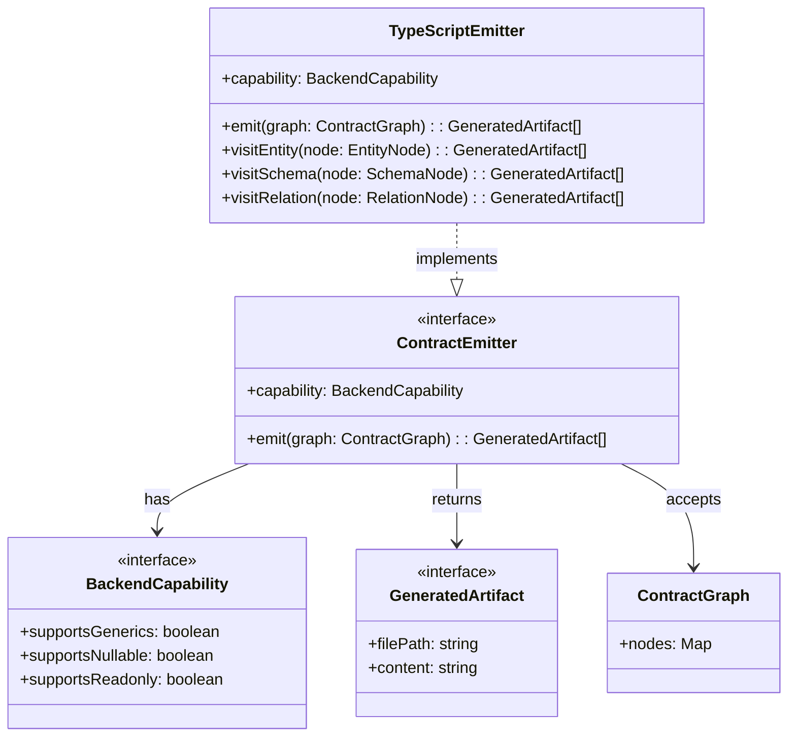
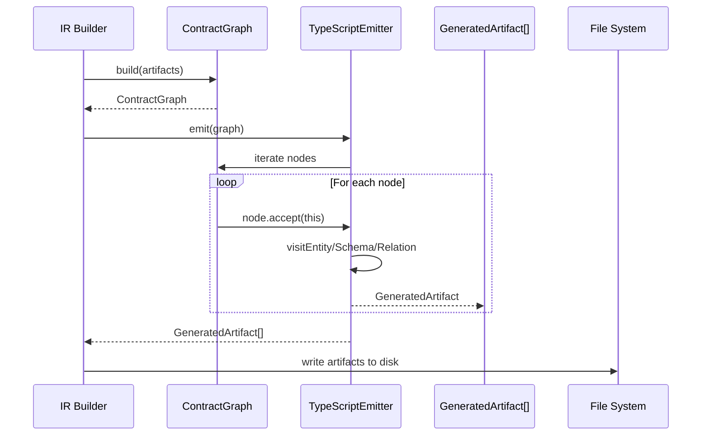

# Compiler Emitter Module

## Pendahuluan

Folder `compiler/emitters` berisi implementasi sistem **Code Emitter** yang bertanggung jawab untuk menghasilkan output code dari Contract Graph dalam arsitektur compiler RouteSync. Emitter adalah tahap akhir dalam compilation pipeline yang mentransform representasi intermediate (IR) menjadi source code dalam target language.

### Apa itu Emitter?

Emitter adalah komponen yang mengimplementasikan **code generation** dari intermediate representation. Dalam konteks compiler RouteSync, Emitter:

1. **Menerima Contract Graph**: Input berupa high-level representation dari API contracts
2. **Mentransform ke Target Language**: Convert abstract representation ke concrete syntax
3. **Menghasilkan Output Files**: Generate actual source code files yang dapat digunakan

Emitter berbeda dengan IR (Intermediate Representation) yang masih abstrak. IR fokus pada **what** (apa yang harus digenerate), sedangkan Emitter fokus pada **how** (bagaimana generate dalam syntax spesifik).

### Peran Emitter dalam Pipeline Compiler

```
Source Code → Parser → AST → Semantic Analysis → IR/Contract Graph → Emitter → Output Code
```

Emitter berada di tahap terakhir compilation pipeline:


1. **Input**: ContractGraph dari IR phase
2. **Processing**: Traverse graph nodes menggunakan visitor pattern
3. **Output**: GeneratedArtifact[] (file paths + content)

**Mengapa Emitter Diperlukan?**

1. **Language-Specific Syntax**: Setiap target language memiliki syntax berbeda (TypeScript, JavaScript, Python, etc.)
2. **Separation of Concerns**: IR tetap language-agnostic, Emitter handle language specifics
3. **Multiple Targets**: Satu IR dapat di-emit ke multiple target languages
4. **Capability Awareness**: Emitter dapat adjust output berdasarkan target language capabilities (generics, nullable types, etc.)

## Arsitektur

Folder `compiler/emitters` menggunakan **Strategy Pattern** dan **Visitor Pattern** untuk extensible code generation:

### File Structure

```
compiler/emitters/
├── BackendCapability.ts    # Interface untuk capability flags
├── ContractEmitter.ts       # Base interface untuk semua emitters
├── GeneratedArtifact.ts     # Output artifact type
├── TypeScriptEmitter.ts     # TypeScript implementation
└── index.ts                 # Public exports
```


### 1. BackendCapability.ts

**Purpose:** Mendefinisikan capability flags untuk different backend targets

**Interface:**
```typescript
export interface BackendCapability {
    readonly supportsGenerics: boolean;
    readonly supportsNullable: boolean;
    readonly supportsReadonly: boolean;
}
```

**Properties:**
- `supportsGenerics`: Apakah language support generic types (e.g., `Array<T>`)
- `supportsNullable`: Apakah language support explicit nullable types (e.g., `string | null`)
- `supportsReadonly`: Apakah language support readonly/immutable markers

**Design Rationale:**

Capability flags memungkinkan Emitter untuk adjust code generation berdasarkan fitur yang tersedia di target language:

```typescript
// TypeScript - supports all features
const tsCapability: BackendCapability = {
    supportsGenerics: true,
    supportsNullable: true,
    supportsReadonly: true
};

// JavaScript - supports none
const jsCapability: BackendCapability = {
    supportsGenerics: false,
    supportsNullable: false,
    supportsReadonly: false
};
```

Ini memungkinkan conditional code generation:

```typescript
// Jika supports generics
"Array<User>"

// Jika tidak support generics
"User[]"
```


### 2. GeneratedArtifact.ts

**Purpose:** Merepresentasikan single output file dari code generation

**Interface:**
```typescript
export interface GeneratedArtifact {
    readonly filePath: string;
    readonly content: string;
}
```

**Properties:**
- `filePath`: Path untuk generated file (relative atau absolute)
- `content`: Actual content dari generated file

**Usage Example:**
```typescript
const artifact: GeneratedArtifact = {
    filePath: 'src/api/types.ts',
    content: `export interface User {
    id: number;
    name: string;
    email: string;
}`
};

// Write to file system
fs.writeFileSync(artifact.filePath, artifact.content);
```

**Design Note:** GeneratedArtifact adalah pure data structure (no methods). Ini memudahkan:
- Serialization untuk caching
- Testing (easy to assert content)
- Multiple output formats (file, memory, stream)


### 3. ContractEmitter.ts

**Purpose:** Base interface untuk semua contract emitters

**Interface:**
```typescript
export interface ContractEmitter {
    readonly capability: BackendCapability;
    emit(graph: ContractGraph): readonly GeneratedArtifact[];
}
```

**Methods:**
- `emit(graph)`: Main entry point untuk code generation, menerima ContractGraph dan returns array of GeneratedArtifact

**Properties:**
- `capability`: Backend capability flags

**Design Pattern:** Strategy Pattern

ContractEmitter adalah interface yang mendefinisikan contract untuk semua emitters. Ini memungkinkan:

1. **Pluggable Backends**: Easy to add new target languages
2. **Dependency Inversion**: High-level code depends on interface, not concrete implementations
3. **Testing**: Easy to mock emitters

**Example Implementation:**
```typescript
class MyCustomEmitter implements ContractEmitter {
    public readonly capability: BackendCapability = {
        supportsGenerics: true,
        supportsNullable: false,
        supportsReadonly: true
    };
    
    public emit(graph: ContractGraph): readonly GeneratedArtifact[] {
        const artifacts: GeneratedArtifact[] = [];
        
        // Process graph nodes
        for (const [id, node] of graph.nodes.entries()) {
            const generated = this.processNode(node);
            artifacts.push(generated);
        }
        
        return artifacts;
    }
}
```


### 4. TypeScriptEmitter.ts

**Purpose:** Concrete implementation untuk TypeScript code generation

**Class:**
```typescript
export class TypeScriptEmitter implements ContractEmitter, ContractVisitor<GeneratedArtifact[]>
```

**Implements:**
1. `ContractEmitter` - Base emitter interface
2. `ContractVisitor<GeneratedArtifact[]>` - Visitor pattern untuk graph traversal

**Capability:**
```typescript
public readonly capability: BackendCapability = {
    supportsGenerics: true,
    supportsNullable: true,
    supportsReadonly: true
};
```

TypeScript mendukung semua modern type system features.

**Methods:**

#### `emit(graph: ContractGraph): readonly GeneratedArtifact[]`

Main entry point yang:
1. Iterate through all nodes dalam graph
2. Call `node.accept(this)` untuk visitor pattern
3. Collect generated artifacts
4. Return array of artifacts

**Implementation:**
```typescript
public emit(graph: ContractGraph): readonly GeneratedArtifact[] {
    const artifacts: GeneratedArtifact[] = [];

    for (const [_, node] of graph.nodes.entries()) {
        artifacts.push(...node.accept(this));
    }

    return artifacts;
}
```


#### `visitEntity(node: EntityNode): GeneratedArtifact[]`

Visit entity node dan generate TypeScript interface.

**Purpose:** Generate TypeScript code untuk entity representations (models, DTOs, etc.)

**Status:** TODO in implementation - interface code generation not yet implemented

**Expected Output Example:**
```typescript
export interface User {
    readonly id: number;
    name: string;
    email: string;
}
```

#### `visitSchema(node: SchemaNode): GeneratedArtifact[]`

Visit schema node dan generate TypeScript type definition.

**Purpose:** Generate type definitions untuk schemas (validation schemas, API schemas, etc.)

**Status:** TODO in implementation

**Expected Output Example:**
```typescript
export type UserSchema = {
    id: number;
    name: string;
    email: string;
};
```

#### `visitRelation(node: RelationNode): GeneratedArtifact[]`

Visit relation node dan generate relationship code.

**Purpose:** Generate code untuk entity relationships (belongs to, has many, etc.)

**Status:** TODO in implementation

**Expected Output Example:**
```typescript
export interface Post {
    id: number;
    authorId: number;
    author?: User;
    comments: Comment[];
}
```


### 5. index.ts

**Purpose:** Public API exports untuk emitter module

**Exports:**
```typescript
// Types
export type { GeneratedArtifact } from './GeneratedArtifact';
export type { BackendCapability } from './BackendCapability';
export type { ContractEmitter } from './ContractEmitter';

// Implementations
export { TypeScriptEmitter } from './TypeScriptEmitter';
```

**Design:** Barrel export pattern untuk clean module interface

### Hubungan Antar Komponen




### Dependency Graph

```
ContractEmitter (interface)
    ↓ depends on
BackendCapability (interface)
GeneratedArtifact (interface)
ContractGraph (from IR)
    
TypeScriptEmitter (class)
    ↓ implements
ContractEmitter
ContractVisitor
    ↓ uses
BackendCapability
GeneratedArtifact
ContractGraph nodes
```

## Cara Kerja

### Input: ContractGraph

Emitter menerima `ContractGraph` dari IR phase. ContractGraph berisi:

- **Nodes**: Map of contract nodes (Entity, Schema, Relation)
- **Edges**: Relationships between nodes
- **Metadata**: Additional information untuk code generation

**Example ContractGraph Structure:**
```typescript
const graph: ContractGraph = {
    nodes: new Map([
        ['User', entityNode],
        ['Post', entityNode],
        ['UserSchema', schemaNode]
    ]),
    // ... other properties
};
```

### Processing: Visitor Pattern

TypeScriptEmitter menggunakan **Visitor Pattern** untuk traverse graph:

```typescript
public emit(graph: ContractGraph): readonly GeneratedArtifact[] {
    const artifacts: GeneratedArtifact[] = [];

    // Iterate all nodes
    for (const [nodeId, node] of graph.nodes.entries()) {
        // Visitor pattern: node decides which visit method to call
        const nodeArtifacts = node.accept(this);
        artifacts.push(...nodeArtifacts);
    }

    return artifacts;
}
```

**Visitor Pattern Benefits:**
1. **Extensibility**: Easy to add new node types
2. **Separation**: Node structure separate from processing logic
3. **Type Safety**: Compiler ensures all node types handled


### Output: GeneratedArtifact Array

Setiap visitor method returns `GeneratedArtifact[]`:

```typescript
visitEntity(node: EntityNode): GeneratedArtifact[] {
    return [{
        filePath: `src/types/${node.name}.ts`,
        content: this.generateEntityCode(node)
    }];
}
```

Final output adalah flat array dari semua artifacts:

```typescript
const artifacts = emitter.emit(graph);

// artifacts = [
//   { filePath: 'src/types/User.ts', content: '...' },
//   { filePath: 'src/types/Post.ts', content: '...' },
//   { filePath: 'src/schemas/UserSchema.ts', content: '...' }
// ]
```

### Interaction dengan Komponen Lain

#### 1. ContractGraph (IR)

**Input dari IR phase:**

```typescript
// IR phase builds ContractGraph
const graph = contractGraphBuilder.build(artifacts);

// Emitter consumes graph
const emitter = new TypeScriptEmitter();
const generatedFiles = emitter.emit(graph);
```

**Data Flow:**
```
Artifacts → ContractGraph → Emitter → GeneratedArtifact[]
```

#### 2. File System Writer

**Output ke file system:**

```typescript
const artifacts = emitter.emit(graph);

// Write artifacts to disk
for (const artifact of artifacts) {
    const dirPath = path.dirname(artifact.filePath);
    await fs.promises.mkdir(dirPath, { recursive: true });
    await fs.promises.writeFile(artifact.filePath, artifact.content);
}
```


### Lifecycle Emitter dalam Kompilasi



**Stages:**

1. **Graph Construction**: IR Builder creates ContractGraph
2. **Emit Initialization**: Create emitter instance
3. **Node Traversal**: Iterate through graph nodes
4. **Visitor Dispatch**: Each node calls appropriate visit method
5. **Code Generation**: Generate code for each node
6. **Artifact Collection**: Collect all generated artifacts
7. **File Writing**: Write artifacts to file system


## Cara Penggunaan

### Menggunakan TypeScriptEmitter

**Basic Usage:**

```typescript
import { TypeScriptEmitter } from '@routesync/core/compiler/emitters';
import type { ContractGraph } from '@routesync/core/compiler/ir';

// Assume graph sudah dibuild dari IR phase
const graph: ContractGraph = buildContractGraph();

// Create emitter instance
const emitter = new TypeScriptEmitter();

// Generate code
const artifacts = emitter.emit(graph);

// Process artifacts
for (const artifact of artifacts) {
    console.log(`Generated: ${artifact.filePath}`);
    console.log(artifact.content);
}
```

### Membuat Custom Emitter

**Step 1: Implement ContractEmitter Interface**

```typescript
import type {
    ContractEmitter,
    BackendCapability,
    GeneratedArtifact
} from '@routesync/core/compiler/emitters';
import type { ContractGraph } from '@routesync/core/compiler/ir';

export class JavaScriptEmitter implements ContractEmitter {
    // Define capabilities
    public readonly capability: BackendCapability = {
        supportsGenerics: false,  // JS doesn't have generics
        supportsNullable: false,  // JS doesn't have explicit nullable types
        supportsReadonly: false   // JS doesn't have readonly
    };
    
    // Implement emit method
    public emit(graph: ContractGraph): readonly GeneratedArtifact[] {
        const artifacts: GeneratedArtifact[] = [];
        
        // Process nodes
        for (const [nodeId, node] of graph.nodes.entries()) {
            const generated = this.processNode(node);
            if (generated) {
                artifacts.push(generated);
            }
        }
        
        return artifacts;
    }
    
    private processNode(node: any): GeneratedArtifact | null {
        // Generate JavaScript code based on node type
        // ...
        return null;
    }
}
```


**Step 2: Implement Visitor Pattern (Optional)**

Untuk better extensibility, implement `ContractVisitor`:

```typescript
import type { ContractVisitor, EntityNode, SchemaNode, RelationNode } 
    from '@routesync/core/compiler/ir';

export class JavaScriptEmitter implements ContractEmitter, ContractVisitor<GeneratedArtifact[]> {
    public readonly capability: BackendCapability = {
        supportsGenerics: false,
        supportsNullable: false,
        supportsReadonly: false
    };
    
    public emit(graph: ContractGraph): readonly GeneratedArtifact[] {
        const artifacts: GeneratedArtifact[] = [];
        
        for (const [_, node] of graph.nodes.entries()) {
            artifacts.push(...node.accept(this));
        }
        
        return artifacts;
    }
    
    public visitEntity(node: EntityNode): GeneratedArtifact[] {
        const content = this.generateJSClass(node);
        return [{
            filePath: `src/models/${node.name}.js`,
            content
        }];
    }
    
    public visitSchema(node: SchemaNode): GeneratedArtifact[] {
        // Generate schema validation code
        return [];
    }
    
    public visitRelation(node: RelationNode): GeneratedArtifact[] {
        // Generate relationship helper functions
        return [];
    }
    
    private generateJSClass(node: EntityNode): string {
        // Generate JavaScript class code
        return `export class ${node.name} { /* ... */ }`;
    }
}
```


### Kapan Menggunakan Setiap Emitter

#### TypeScriptEmitter

**Use When:**
- Target language adalah TypeScript
- Need strong type safety
- Want generic types support
- Need nullable types (`string | null`)
- Want readonly properties

**Example Use Cases:**
- Generating TypeScript SDK untuk API clients
- Creating type definitions untuk data models
- Building type-safe form schemas

**Output Example:**
```typescript
// Generated by TypeScriptEmitter
export interface User {
    readonly id: number;
    name: string;
    email: string | null;
    roles: Array<string>;
}

export type UserCreateInput = Omit<User, 'id'>;
```

#### Custom Emitters

Create custom emitter untuk:
- **Different Languages**: Python, Java, C#, Go, etc.
- **Different Styles**: Classes vs Functions, OOP vs Functional
- **Different Frameworks**: React, Vue, Angular specific code
- **Different Formats**: JSON Schema, OpenAPI, GraphQL Schema


## Panduan Pengembangan

### Kapan Membuat Emitter Baru

Buat emitter baru ketika:

1. **New Target Language**: Need to generate code untuk language yang berbeda
   ```typescript
   // Example: Python Emitter
   class PythonEmitter implements ContractEmitter { ... }
   ```

2. **Different Output Format**: Same language, different format
   ```typescript
   // Example: TypeScript Declaration Files (.d.ts) only
   class DeclarationEmitter implements ContractEmitter { ... }
   ```

3. **Framework-Specific Code**: Generate code tailored untuk specific framework
   ```typescript
   // Example: React Component Generator
   class ReactComponentEmitter implements ContractEmitter { ... }
   ```

4. **Custom Requirements**: Special formatting, naming conventions, or structure
   ```typescript
   // Example: Enterprise-style Java Code
   class EnterpriseJavaEmitter implements ContractEmitter { ... }
   ```

### Best Practices

#### 1. Implement ContractEmitter Interface

**Always implement base interface:**

```typescript
// ✅ GOOD: Implements interface
export class MyEmitter implements ContractEmitter {
    public readonly capability: BackendCapability = { /* ... */ };
    public emit(graph: ContractGraph): readonly GeneratedArtifact[] { /* ... */ }
}

// ❌ BAD: Doesn't implement interface
export class MyEmitter {
    public generate(graph: any): any[] { /* ... */ }
}
```

**Benefits:**
- Type safety
- Consistent API
- Easy integration
- Better maintainability


#### 2. Use Visitor Pattern

**Leverage visitor pattern untuk extensibility:**

```typescript
// ✅ GOOD: Implements visitor
export class MyEmitter implements ContractEmitter, ContractVisitor<GeneratedArtifact[]> {
    public emit(graph: ContractGraph): readonly GeneratedArtifact[] {
        const artifacts: GeneratedArtifact[] = [];
        for (const [_, node] of graph.nodes.entries()) {
            artifacts.push(...node.accept(this));
        }
        return artifacts;
    }
    
    public visitEntity(node: EntityNode): GeneratedArtifact[] { /* ... */ }
    public visitSchema(node: SchemaNode): GeneratedArtifact[] { /* ... */ }
    public visitRelation(node: RelationNode): GeneratedArtifact[] { /* ... */ }
}

// ❌ BAD: Manual type checking
export class MyEmitter implements ContractEmitter {
    public emit(graph: ContractGraph): readonly GeneratedArtifact[] {
        const artifacts: GeneratedArtifact[] = [];
        for (const [_, node] of graph.nodes.entries()) {
            if (node.type === 'entity') { /* ... */ }
            else if (node.type === 'schema') { /* ... */ }
            // Hard to maintain, not type-safe
        }
        return artifacts;
    }
}
```

#### 3. Separate Concerns

**Keep code generation logic modular:**

```typescript
// ✅ GOOD: Separate helper methods
class TypeScriptEmitter implements ContractEmitter {
    public visitEntity(node: EntityNode): GeneratedArtifact[] {
        const content = this.generateInterface(node);
        return [{ filePath: this.getFilePath(node), content }];
    }
    
    private generateInterface(node: EntityNode): string {
        const properties = this.generateProperties(node);
        const methods = this.generateMethods(node);
        return `export interface ${node.name} {\n${properties}\n${methods}\n}`;
    }
    
    private generateProperties(node: EntityNode): string { /* ... */ }
    private generateMethods(node: EntityNode): string { /* ... */ }
    private getFilePath(node: EntityNode): string { /* ... */ }
}
```


#### 4. Use Capability Flags

**Conditional generation based on target capabilities:**

```typescript
class MyEmitter implements ContractEmitter {
    public readonly capability: BackendCapability = {
        supportsGenerics: true,
        supportsNullable: false,
        supportsReadonly: true
    };
    
    private generateType(type: string, isArray: boolean): string {
        if (isArray) {
            // ✅ GOOD: Check capability
            return this.capability.supportsGenerics 
                ? `Array<${type}>` 
                : `${type}[]`;
        }
        return type;
    }
    
    private generateNullable(type: string, nullable: boolean): string {
        if (!nullable) return type;
        
        // ✅ GOOD: Adapt to capability
        return this.capability.supportsNullable 
            ? `${type} | null` 
            : `${type} /* nullable */`;
    }
}
```

#### 5. Immutable Output

**GeneratedArtifact harus immutable:**

```typescript
// ✅ GOOD: Return new artifacts
public visitEntity(node: EntityNode): GeneratedArtifact[] {
    return [{
        filePath: `src/${node.name}.ts`,
        content: this.generate(node)
    }];
}

// ❌ BAD: Mutate shared state
private artifacts: GeneratedArtifact[] = [];

public visitEntity(node: EntityNode): GeneratedArtifact[] {
    this.artifacts.push({ /* ... */ }); // Mutation!
    return this.artifacts;
}
```


### Anti-Patterns

#### ❌ Anti-Pattern 1: Hardcoded File Paths

```typescript
// BAD: Hardcoded paths
public visitEntity(node: EntityNode): GeneratedArtifact[] {
    return [{
        filePath: '/usr/local/src/types/User.ts', // Absolute path!
        content: '...'
    }];
}

// GOOD: Configurable paths
class TypeScriptEmitter implements ContractEmitter {
    constructor(private config: { outputDir: string }) {}
    
    public visitEntity(node: EntityNode): GeneratedArtifact[] {
        return [{
            filePath: `${this.config.outputDir}/types/${node.name}.ts`,
            content: '...'
        }];
    }
}
```

#### ❌ Anti-Pattern 2: Mixing Concerns

```typescript
// BAD: File I/O dalam emitter
public visitEntity(node: EntityNode): GeneratedArtifact[] {
    const content = this.generate(node);
    fs.writeFileSync('output.ts', content); // ❌ Side effect!
    return [{ filePath: 'output.ts', content }];
}

// GOOD: Pure generation
public visitEntity(node: EntityNode): GeneratedArtifact[] {
    return [{
        filePath: 'output.ts',
        content: this.generate(node)
    }];
}
// File writing happens outside emitter
```

#### ❌ Anti-Pattern 3: Ignoring Capabilities

```typescript
// BAD: Assume all features available
private generateType(type: string): string {
    return `Array<${type}>`; // Assumes generics support!
}

// GOOD: Check capabilities
private generateType(type: string): string {
    return this.capability.supportsGenerics
        ? `Array<${type}>`
        : `${type}[]`;
}
```


#### ❌ Anti-Pattern 4: String Concatenation untuk Complex Code

```typescript
// BAD: Complex string concatenation
private generateClass(node: EntityNode): string {
    let code = 'export class ' + node.name + ' {\n';
    for (const prop of node.properties) {
        code += '  ' + prop.name + ': ' + prop.type + ';\n';
    }
    code += '}';
    return code;
}

// GOOD: Template literals atau builder pattern
private generateClass(node: EntityNode): string {
    const properties = node.properties
        .map(p => `  ${p.name}: ${p.type};`)
        .join('\n');
    
    return `export class ${node.name} {
${properties}
}`;
}

// BETTER: Use dedicated builder
class CodeBuilder {
    private lines: string[] = [];
    
    addLine(line: string): this {
        this.lines.push(line);
        return this;
    }
    
    indent(level: number = 1): this {
        const lastLine = this.lines[this.lines.length - 1];
        this.lines[this.lines.length - 1] = '  '.repeat(level) + lastLine;
        return this;
    }
    
    toString(): string {
        return this.lines.join('\n');
    }
}
```

### Konvensi Penamaan

#### Emitter Classes

**Pattern:** `{Language}Emitter`

```typescript
// ✅ GOOD
TypeScriptEmitter
JavaScriptEmitter
PythonEmitter
JavaEmitter

// ❌ BAD
TSCodeGen
JSGenerator
PyEmit
```


#### Method Names

**Visitor Methods:** `visit{NodeType}`

```typescript
// ✅ GOOD
visitEntity(node: EntityNode)
visitSchema(node: SchemaNode)
visitRelation(node: RelationNode)

// ❌ BAD
handleEntity(node: EntityNode)
processSchemaNode(node: SchemaNode)
emitRelation(node: RelationNode)
```

**Helper Methods:** Descriptive verbs

```typescript
// ✅ GOOD
generateInterface(node: EntityNode)
formatPropertyName(name: string)
buildImportStatements(dependencies: string[])

// ❌ BAD
doInterface(node: EntityNode)
prop(name: string)
imports(deps: string[])
```

### Prinsip Modular dan Extensible

#### 1. Single Responsibility

Setiap emitter hanya bertanggung jawab untuk **satu target language/format**:

```typescript
// ✅ GOOD: Focused on TypeScript
class TypeScriptEmitter implements ContractEmitter {
    // Only TypeScript generation logic
}

// ❌ BAD: Mixed responsibilities
class MultiLanguageEmitter implements ContractEmitter {
    emit(graph: ContractGraph, language: 'ts' | 'js' | 'py'): GeneratedArtifact[] {
        if (language === 'ts') { /* TS logic */ }
        else if (language === 'js') { /* JS logic */ }
        else if (language === 'py') { /* Python logic */ }
    }
}
```


#### 2. Open/Closed Principle

Emitters harus **open for extension, closed for modification**:

```typescript
// ✅ GOOD: Extensible through inheritance/composition
class BaseTypeScriptEmitter implements ContractEmitter {
    protected generateImports(node: any): string { /* ... */ }
    protected generateExports(node: any): string { /* ... */ }
}

class StrictTypeScriptEmitter extends BaseTypeScriptEmitter {
    // Override untuk stricter output
    protected generateImports(node: any): string {
        return super.generateImports(node) + '\n// @ts-strict';
    }
}

// ❌ BAD: Requires modifying base class untuk new behavior
class TypeScriptEmitter {
    generate(node: any, strict: boolean = false, comments: boolean = true, ...) {
        // Adding new features requires modifying this method
    }
}
```

#### 3. Dependency Injection

Inject dependencies daripada hardcode:

```typescript
// ✅ GOOD: Configurable
interface EmitterConfig {
    outputDir: string;
    fileExtension: string;
    indentSize: number;
    addComments: boolean;
}

class TypeScriptEmitter implements ContractEmitter {
    constructor(private config: EmitterConfig) {}
    
    private getFilePath(name: string): string {
        return `${this.config.outputDir}/${name}${this.config.fileExtension}`;
    }
}

// ❌ BAD: Hardcoded configuration
class TypeScriptEmitter {
    private readonly OUTPUT_DIR = 'src/types';
    private readonly FILE_EXT = '.ts';
}
```


## Struktur Folder

### Ringkasan File

```
compiler/emitters/
├── BackendCapability.ts     # 31 lines - Capability interface
│                            # - supportsGenerics flag
│                            # - supportsNullable flag
│                            # - supportsReadonly flag
│
├── GeneratedArtifact.ts     # 15 lines - Output artifact type
│                            # - filePath property
│                            # - content property
│
├── ContractEmitter.ts       # 32 lines - Base emitter interface
│                            # - capability property
│                            # - emit method
│
├── TypeScriptEmitter.ts     # 85 lines - TypeScript implementation
│                            # - Full capability support
│                            # - Visitor pattern implementation
│                            # - visitEntity/Schema/Relation methods
│
└── index.ts                 # 13 lines - Public exports
                             # - Re-exports types
                             # - Re-exports implementations
```

### Tanggung Jawab Masing-Masing File

#### BackendCapability.ts

**Responsibilities:**
1. Define capability flags interface
2. Document what each flag means
3. Provide examples untuk different backends

**Dependencies:** None

**Used By:**
- ContractEmitter (requires capability)
- All emitter implementations


#### GeneratedArtifact.ts

**Responsibilities:**
1. Define output artifact structure
2. Type safety untuk generated files
3. Simple, serializable data structure

**Dependencies:** None

**Used By:**
- ContractEmitter (returns artifacts)
- File writers
- Caching systems

#### ContractEmitter.ts

**Responsibilities:**
1. Define base interface untuk all emitters
2. Establish emit method contract
3. Require capability declaration

**Dependencies:**
- BackendCapability (capability type)
- GeneratedArtifact (return type)
- ContractGraph (input type from IR)

**Used By:**
- TypeScriptEmitter (implements)
- Custom emitters (implements)
- Compiler pipeline (uses interface)

#### TypeScriptEmitter.ts

**Responsibilities:**
1. Implement TypeScript code generation
2. Implement visitor pattern untuk graph traversal
3. Handle all ContractGraph node types
4. Generate TypeScript-specific syntax

**Dependencies:**
- BackendCapability
- GeneratedArtifact
- ContractEmitter (implements)
- ContractGraph and node types (from IR)

**Status:** Partially implemented (visitor methods are stubs)


#### index.ts

**Responsibilities:**
1. Public API surface untuk emitter module
2. Re-export types dan implementations
3. Enforce encapsulation boundary

**Pattern:** Barrel export untuk clean module interface

## Referensi Implementasi

### Komponen Emitter Utama

#### BackendCapability

**Location:** `compiler/emitters/BackendCapability.ts`

**Interface Definition:**
```typescript
export interface BackendCapability {
    readonly supportsGenerics: boolean;
    readonly supportsNullable: boolean;
    readonly supportsReadonly: boolean;
}
```

**Purpose:** Feature detection untuk conditional code generation

**Example Implementations:**

```typescript
// Full-featured languages
const typescript: BackendCapability = {
    supportsGenerics: true,
    supportsNullable: true,
    supportsReadonly: true
};

const java: BackendCapability = {
    supportsGenerics: true,
    supportsNullable: false, // @Nullable annotations
    supportsReadonly: true   // final keyword
};

// Basic languages
const javascript: BackendCapability = {
    supportsGenerics: false,
    supportsNullable: false,
    supportsReadonly: false
};

const python: BackendCapability = {
    supportsGenerics: true,  // Type hints
    supportsNullable: true,  // Optional[T]
    supportsReadonly: false  // No readonly
};
```


#### GeneratedArtifact

**Location:** `compiler/emitters/GeneratedArtifact.ts`

**Interface Definition:**
```typescript
export interface GeneratedArtifact {
    readonly filePath: string;
    readonly content: string;
}
```

**Properties:**
- `filePath`: Where to write the file (relative recommended)
- `content`: Complete file content as string

**Usage Patterns:**

```typescript
// Single file
const artifact: GeneratedArtifact = {
    filePath: 'src/models/User.ts',
    content: 'export interface User { /* ... */ }'
};

// Multiple related files
const artifacts: GeneratedArtifact[] = [
    {
        filePath: 'src/models/User.ts',
        content: '/* User model */'
    },
    {
        filePath: 'src/models/Post.ts',
        content: '/* Post model */'
    },
    {
        filePath: 'src/models/index.ts',
        content: "export * from './User';\nexport * from './Post';"
    }
];
```

#### ContractEmitter Interface

**Location:** `compiler/emitters/ContractEmitter.ts`

**Full Definition:**
```typescript
export interface ContractEmitter {
    readonly capability: BackendCapability;
    emit(graph: ContractGraph): readonly GeneratedArtifact[];
}
```

**Contract Requirements:**
1. Must provide capability flags
2. Must implement emit method
3. Must accept ContractGraph
4. Must return readonly array of artifacts
5. Must be pure function (no side effects)


#### TypeScriptEmitter Implementation

**Location:** `compiler/emitters/TypeScriptEmitter.ts`

**Class Structure:**
```typescript
export class TypeScriptEmitter implements ContractEmitter, ContractVisitor<GeneratedArtifact[]> {
    public readonly capability: BackendCapability;
    
    public emit(graph: ContractGraph): readonly GeneratedArtifact[];
    public visitEntity(node: EntityNode): GeneratedArtifact[];
    public visitSchema(node: SchemaNode): GeneratedArtifact[];
    public visitRelation(node: RelationNode): GeneratedArtifact[];
}
```

**Implementation Status:**

| Method | Status | Description |
|--------|--------|-------------|
| `capability` | ✅ Complete | All TypeScript features supported |
| `emit()` | ✅ Complete | Visitor pattern traversal implemented |
| `visitEntity()` | ⚠️ TODO | Stub with TODO comment |
| `visitSchema()` | ⚠️ TODO | Stub with TODO comment |
| `visitRelation()` | ⚠️ TODO | Stub with TODO comment |

**Note:** Visitor methods currently return empty arrays. Implementation untuk actual code generation belum complete.

### Interaksi dengan Komponen Lain

#### 1. ContractGraph (dari IR module)

**Dependency:**
```typescript
import type { ContractGraph } from '../ir/ContractGraph';
```

**Usage:**
```typescript
// Emitter receives graph from IR
const graph: ContractGraph = buildGraph(artifacts);

// Traverse nodes
for (const [id, node] of graph.nodes.entries()) {
    // Process each node
}
```

**Data Flow:**
```
IR Builder → ContractGraph → Emitter → GeneratedArtifact[]
```


#### 2. Visitor Pattern (dari IR module)

**Dependency:**
```typescript
import type { ContractVisitor, EntityNode, SchemaNode, RelationNode } 
    from '../ir/ContractGraph';
```

**Pattern:**
```typescript
// Node calls appropriate visitor method
node.accept(visitor)

// Visitor implements methods untuk each node type
visitor.visitEntity(node)
visitor.visitSchema(node)
visitor.visitRelation(node)
```

**Benefits:**
- Type-safe dispatch
- Extensible untuk new node types
- Separation of data structure dari processing

#### 3. File System (external)

**Output tidak langsung ke FS:**

Emitter **tidak** directly write files. Output berupa artifacts yang kemudian di-write oleh external component:

```typescript
// Emitter produces artifacts
const artifacts = emitter.emit(graph);

// External writer handles I/O
for (const artifact of artifacts) {
    await fs.writeFile(artifact.filePath, artifact.content);
}
```

**Reasoning:** Separation of concerns - emitter focuses on generation, not I/O.

## Testing

### Unit Testing Emitters

```typescript
import { TypeScriptEmitter } from '@routesync/core/compiler/emitters';
import type { ContractGraph } from '@routesync/core/compiler/ir';

describe('TypeScriptEmitter', () => {
    let emitter: TypeScriptEmitter;
    
    beforeEach(() => {
        emitter = new TypeScriptEmitter();
    });
    
    it('should have correct capabilities', () => {
        expect(emitter.capability.supportsGenerics).toBe(true);
        expect(emitter.capability.supportsNullable).toBe(true);
        expect(emitter.capability.supportsReadonly).toBe(true);
    });
    
    it('should emit artifacts from graph', () => {
        const graph: ContractGraph = createTestGraph();
        
        const artifacts = emitter.emit(graph);
        
        expect(artifacts).toBeInstanceOf(Array);
        // Verify artifact structure
    });
});
```


### Testing Generated Output

```typescript
describe('TypeScriptEmitter Output', () => {
    it('should generate valid TypeScript interface', () => {
        const emitter = new TypeScriptEmitter();
        const graph = createGraphWithEntity('User', [
            { name: 'id', type: 'number' },
            { name: 'name', type: 'string' }
        ]);
        
        const artifacts = emitter.emit(graph);
        
        // Verify content
        expect(artifacts[0].content).toContain('export interface User');
        expect(artifacts[0].content).toContain('id: number');
        expect(artifacts[0].content).toContain('name: string');
        
        // Verify TypeScript compiles
        const result = compileTypeScript(artifacts[0].content);
        expect(result.errors).toHaveLength(0);
    });
    
    it('should use generics when supported', () => {
        const emitter = new TypeScriptEmitter();
        // Test generic type generation
    });
    
    it('should handle nullable types', () => {
        const emitter = new TypeScriptEmitter();
        // Test nullable type generation
    });
});
```

### Integration Testing

```typescript
describe('Emitter Integration', () => {
    it('should integrate with IR builder', async () => {
        // Build graph from artifacts
        const artifacts = await scanAndAnalyze();
        const graph = buildContractGraph(artifacts);
        
        // Emit code
        const emitter = new TypeScriptEmitter();
        const generated = emitter.emit(graph);
        
        // Verify output
        expect(generated.length).toBeGreaterThan(0);
        expect(generated[0].filePath).toBeTruthy();
        expect(generated[0].content).toBeTruthy();
    });
});
```


## Performance Considerations

### Memory Efficiency

**Artifact Creation:**
```typescript
// ✅ GOOD: Create artifacts incrementally
public emit(graph: ContractGraph): readonly GeneratedArtifact[] {
    const artifacts: GeneratedArtifact[] = [];
    
    for (const [_, node] of graph.nodes.entries()) {
        const nodeArtifacts = node.accept(this);
        artifacts.push(...nodeArtifacts);
    }
    
    return artifacts;
}

// ❌ BAD: Build large string first
public emit(graph: ContractGraph): readonly GeneratedArtifact[] {
    let allCode = '';
    for (const [_, node] of graph.nodes.entries()) {
        allCode += this.generate(node); // Memory intensive!
    }
    return [{ filePath: 'output.ts', content: allCode }];
}
```

### Streaming for Large Outputs

Untuk large codebases, consider streaming:

```typescript
interface StreamingEmitter extends ContractEmitter {
    emitStream(graph: ContractGraph): AsyncGenerator<GeneratedArtifact>;
}

class StreamingTypeScriptEmitter implements StreamingEmitter {
    async *emitStream(graph: ContractGraph): AsyncGenerator<GeneratedArtifact> {
        for (const [_, node] of graph.nodes.entries()) {
            const artifacts = node.accept(this);
            for (const artifact of artifacts) {
                yield artifact;
            }
        }
    }
}

// Usage
const emitter = new StreamingTypeScriptEmitter();
for await (const artifact of emitter.emitStream(graph)) {
    await writeFile(artifact.filePath, artifact.content);
}
```


### Caching Generated Code

```typescript
class CachedEmitter implements ContractEmitter {
    private cache = new Map<string, GeneratedArtifact[]>();
    
    constructor(private baseEmitter: ContractEmitter) {}
    
    public get capability(): BackendCapability {
        return this.baseEmitter.capability;
    }
    
    public emit(graph: ContractGraph): readonly GeneratedArtifact[] {
        // Hash graph untuk cache key
        const cacheKey = this.hashGraph(graph);
        
        if (this.cache.has(cacheKey)) {
            return this.cache.get(cacheKey)!;
        }
        
        const artifacts = this.baseEmitter.emit(graph);
        this.cache.set(cacheKey, artifacts as GeneratedArtifact[]);
        
        return artifacts;
    }
    
    private hashGraph(graph: ContractGraph): string {
        // Implement graph fingerprinting
        return JSON.stringify(Array.from(graph.nodes.keys()).sort());
    }
}
```

## FAQ

### Q: Mengapa tidak langsung write ke file system?

**A:** Separation of concerns. Emitter fokus pada **generation**, bukan I/O. Benefits:
- Easier testing (no file system mocking)
- Flexibility (can write to memory, network, etc.)
- Composability (can transform artifacts before writing)
- Atomicity (can validate all artifacts before writing any)

### Q: Bagaimana handle target language yang tidak support semua features?

**A:** Use `BackendCapability` flags untuk conditional generation:

```typescript
const type = this.capability.supportsGenerics 
    ? `Array<${elementType}>` 
    : `${elementType}[]`;
```

### Q: Apakah bisa emit multiple languages sekaligus?

**A:** Ya, run multiple emitters:

```typescript
const tsEmitter = new TypeScriptEmitter();
const jsEmitter = new JavaScriptEmitter();
const pyEmitter = new PythonEmitter();

const tsArtifacts = tsEmitter.emit(graph);
const jsArtifacts = jsEmitter.emit(graph);
const pyArtifacts = pyEmitter.emit(graph);
```


### Q: Bagaimana cara debug generated code yang salah?

**A:** Several debugging strategies:

1. **Unit Test Individual Nodes:**
```typescript
const artifact = emitter.visitEntity(singleEntityNode);
console.log(artifact[0].content);
```

2. **Add Debug Logging:**
```typescript
public visitEntity(node: EntityNode): GeneratedArtifact[] {
    console.log('Processing entity:', node.name);
    const content = this.generateInterface(node);
    console.log('Generated:', content);
    return [{ filePath: '...', content }];
}
```

3. **Compare with Expected Output:**
```typescript
expect(artifact.content).toMatchSnapshot();
```

4. **Validate Generated Code:**
```typescript
import * as ts from 'typescript';

function validateTypeScript(code: string): boolean {
    const result = ts.transpileModule(code, {
        compilerOptions: { noEmit: true }
    });
    return result.diagnostics?.length === 0;
}
```

### Q: Apakah visitor methods harus return array?

**A:** Ya. Alasannya:
- Single node dapat generate multiple files (e.g., interface + schema + validator)
- Consistent return type untuk semua visitors
- Easy to flatten dengan spread operator

```typescript
// Single artifact
visitSimpleEntity(node): GeneratedArtifact[] {
    return [{ filePath: '...', content: '...' }];
}

// Multiple artifacts
visitComplexEntity(node): GeneratedArtifact[] {
    return [
        { filePath: 'interface.ts', content: '...' },
        { filePath: 'schema.ts', content: '...' },
        { filePath: 'validator.ts', content: '...' }
    ];
}
```

### Q: Bagaimana handle circular dependencies dalam generated code?

**A:** Beberapa strategi:

1. **Forward Declarations:**
```typescript
// TypeScript interface forwarding
export interface User {
    id: number;
    posts: Post[]; // Forward reference
}

export interface Post {
    id: number;
    author: User;
}
```

2. **Separate Files dengan Index:**
```typescript
// models/User.ts
export interface User { /* ... */ }

// models/Post.ts
export interface Post { /* ... */ }

// models/index.ts
export * from './User';
export * from './Post';
```

3. **Lazy Types untuk Runtime:**
```typescript
export interface User {
    posts: () => Post[]; // Lazy evaluation
}
```

### Q: Bagaimana menambahkan comments atau documentation ke generated code?

**A:** Implementasikan di dalam generation methods:

```typescript
private generateInterface(node: EntityNode): string {
    const doc = node.documentation 
        ? `/**\n * ${node.documentation}\n */\n`
        : '';
    
    const properties = this.generateProperties(node);
    
    return `${doc}export interface ${node.name} {\n${properties}\n}`;
}

// Output:
/**
 * Represents a user in the system
 */
export interface User {
    id: number;
    name: string;
}
```

## Summary

Module `compiler/emitters` menyediakan infrastructure untuk **code generation** dari Contract Graph:

**Key Components:**
1. **BackendCapability** - Feature detection interface
2. **GeneratedArtifact** - Output file representation
3. **ContractEmitter** - Base interface untuk all emitters
4. **TypeScriptEmitter** - Reference implementation untuk TypeScript

**Design Principles:**
- **Visitor Pattern**: Type-safe node traversal
- **Strategy Pattern**: Pluggable language backends
- **Separation of Concerns**: Generation separate from I/O
- **Capability-Aware**: Adapt output berdasarkan target features

**Status:**
- ✅ Architecture complete
- ✅ TypeScript emitter structure complete
- ⚠️ Visitor methods implementation pending (TODO)

**Usage Pattern:**
```typescript
const graph = buildContractGraph(artifacts);
const emitter = new TypeScriptEmitter();
const artifacts = emitter.emit(graph);
// Write artifacts to file system
```

## Next Steps

### Untuk Kontributor

**Immediate Tasks:**

1. **Implement Visitor Methods** (HIGH PRIORITY)
   - `visitEntity()` - Generate TypeScript interfaces
   - `visitSchema()` - Generate type schemas
   - `visitRelation()` - Generate relationship types
   
2. **Add Code Formatting**
   - Integrate prettier atau custom formatter
   - Consistent indentation and style
   
3. **Add Import Management**
   - Auto-generate import statements
   - Handle circular dependencies
   - Organize imports by source

**Medium-term Goals:**

1. **Additional Emitters**
   - JavaScriptEmitter (ES6+ classes)
   - JSONSchemaEmitter (for validation)
   - OpenAPIEmitter (for documentation)

2. **Enhanced Features**
   - Documentation comment generation
   - Source map support
   - Incremental generation (only changed files)

3. **Testing Infrastructure**
   - Snapshot testing untuk generated code
   - Compilation testing (ensure output compiles)
   - Performance benchmarks

### Untuk Pengguna

**Getting Started:**

1. **Use TypeScriptEmitter:**
```typescript
import { TypeScriptEmitter } from '@routesync/core/compiler/emitters';
const emitter = new TypeScriptEmitter();
const artifacts = emitter.emit(graph);
```

2. **Create Custom Emitter:**
```typescript
class MyEmitter implements ContractEmitter {
    public readonly capability: BackendCapability = { /* ... */ };
    public emit(graph: ContractGraph): readonly GeneratedArtifact[] {
        // Implementation
    }
}
```

3. **Integrate dengan Pipeline:**
```typescript
// In your build pipeline
const graph = await buildGraph();
const emitter = new TypeScriptEmitter();
const artifacts = emitter.emit(graph);
await writeArtifacts(artifacts);
```

## Related Documentation

### Compiler Modules

- **[AST Module](../ast/README.md)** - Abstract Syntax Tree representation
- **[Analysis Module](../analysis/README.md)** - Semantic analysis dan data flow
- **[IR Module](../ir/README.md)** - Contract Graph intermediate representation
- **[Artifacts Module](../artifacts/README.md)** - Artifact management system

### Compiler Pipeline

- **[Compiler Architecture](../../README.md)** - High-level compiler overview
- **[Pass System](../passes/README.md)** - Compilation pass architecture
- **[Verification](../verification/README.md)** - Output verification

### Code Generation

- **[Template System](../templates/README.md)** - Code template engine (if exists)
- **[Formatting](../formatting/README.md)** - Code formatting utilities (if exists)

## Appendix

### Glossary

- **Emitter**: Component yang generate source code dari IR
- **Artifact**: Generated file dengan path dan content
- **Capability**: Feature flags untuk target language
- **Visitor Pattern**: Design pattern untuk traversing graph nodes
- **Contract Graph**: IR representation dari API contracts
- **Backend**: Target language atau platform

### Code Examples Repository

Untuk complete examples, lihat:
- `packages/core/src/compiler/emitters/__tests__/` - Unit tests
- `packages/cli/src/generators/` - Real-world usage
- `examples/custom-emitters/` - Custom emitter examples (if exists)

---

**Document Version:** 1.0.0  
**Last Updated:** 2024-01-XX  
**Module:** `@routesync/core/compiler/emitters`  
**Status:** Architecture Complete, Implementation In Progress
