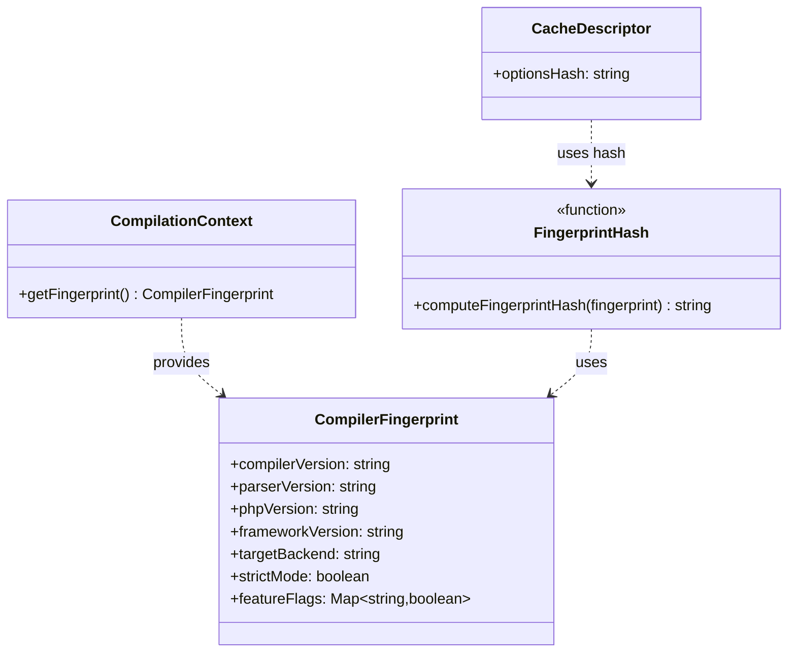
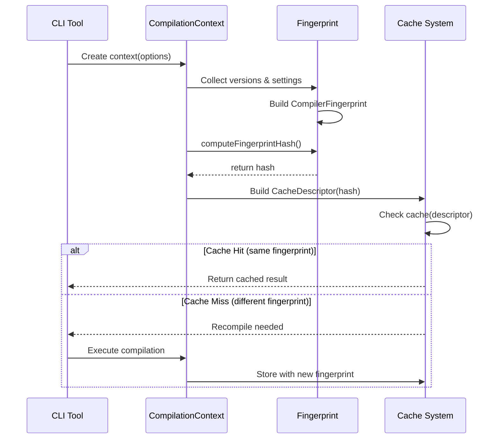

# Compiler Fingerprint Module

## Pendahuluan

Folder `compiler/fingerprint` berisi implementasi **compiler fingerprinting system** untuk cache invalidation dan build reproducibility dalam compiler RouteSync. Fingerprint adalah unique identifier yang merepresentasikan seluruh compiler configuration dan environment yang mempengaruhi compilation output.

### Apa itu Compiler Fingerprint?

Compiler fingerprint adalah **snapshot dari compiler state** yang mencakup:
1. **Versions** - Compiler, parser, PHP, framework versions
2. **Settings** - Compiler options (strict mode, target backend)
3. **Feature Flags** - Enabled/disabled features
4. **Environment** - Factors yang affect output

Fingerprint digunakan untuk:
- **Cache Invalidation**: Detect ketika cached results incompatible
- **Build Reproducibility**: Ensure consistent output untuk same input
- **Version Compatibility**: Prevent mixing incompatible compiler versions
- **Debugging**: Track compilation environment

### Peran Fingerprint dalam Pipeline Compiler

```
Compilation Request
        ↓
  Get Fingerprint (versions + settings)
        ↓
  Compute Hash (stable identifier)
        ↓
  Check Cache (fingerprint in cache key)
        ↓
    Match? ──Yes──> Use Cached Result
        │
       No
        ↓
  Execute Compilation
        ↓
  Cache dengan Fingerprint
```

Fingerprint berada di **cache key computation**, ensuring cached results hanya used ketika compiler configuration sama.

**Mengapa Fingerprinting Diperlukan?**

1. **Version Safety**: Prevent using cache dari different compiler versions
2. **Configuration Safety**: Detect option changes that affect output
3. **Reproducibility**: Same fingerprint → same output guarantee
4. **Debugging**: Identify environment differences
5. **Integrity**: Ensure cache correctness across environments


## Arsitektur

Fingerprint system menggunakan **immutable fingerprint objects** dengan stable hash computation:

### File Structure

```
compiler/fingerprint/
├── Fingerprint.ts    # Fingerprint interface dan hash computation
└── index.ts          # Public exports
```

### Component Diagram




### 1. Fingerprint.ts

**Purpose:** Mendefinisikan compiler fingerprint structure dan hash computation

#### CompilerFingerprint Interface

Captures complete compiler configuration:

```typescript
interface CompilerFingerprint {
    readonly compilerVersion: string;
    readonly parserVersion: string;
    readonly phpVersion: string;
    readonly frameworkVersion: string;
    readonly targetBackend: string;
    readonly strictMode: boolean;
    readonly featureFlags: ReadonlyMap<string, boolean>;
}
```

**Properties:**

##### `compilerVersion`
Compiler version yang generate output.

**Type:** `string`  
**Example:** `'6.1.0'`, `'6.2.0-beta'`

**Purpose:** Detect compiler upgrades yang may change output format atau behavior.

**Invalidation:** Cache invalidated ketika compiler version changes.

##### `parserVersion`
Parser version yang parse input code.

**Type:** `string`  
**Example:** `'1.0.0'`, `'2.0.0'`

**Purpose:** Parser changes may affect AST structure, requiring recompilation.

##### `phpVersion`
PHP runtime version.

**Type:** `string`  
**Example:** `'8.2.0'`, `'8.3.0'`

**Purpose:** PHP version affects available language features dan semantics.

##### `frameworkVersion`
Framework version (e.g., Laravel).

**Type:** `string`  
**Example:** `'10.0.0'`, `'11.0.0'`

**Purpose:** Framework API changes require recompilation.

##### `targetBackend`
Target output language atau runtime.

**Type:** `string`  
**Example:** `'typescript'`, `'javascript'`, `'python'`

**Purpose:** Different backends produce different output.

##### `strictMode`
Whether strict type checking enabled.

**Type:** `boolean`  
**Example:** `true`, `false`

**Purpose:** Strict mode affects type checking dan generated code.

##### `featureFlags`
Experimental atau optional features.

**Type:** `ReadonlyMap<string, boolean>`  
**Example:** 
```typescript
new Map([
    ['enableInlining', true],
    ['enableTreeShaking', false],
    ['experimentalHooks', true]
])
```

**Purpose:** Feature flags change compilation behavior.


#### computeFingerprintHash Function

Computes stable, deterministic hash dari fingerprint.

**Signature:**
```typescript
function computeFingerprintHash(fingerprint: CompilerFingerprint): string
```

**Parameters:**
- `fingerprint`: Compiler fingerprint object

**Returns:**
- Hexadecimal SHA-256 hash string (64 characters)

**Algorithm:**

1. **Sort Feature Flags**: Ensure deterministic ordering
```typescript
const sortedFlags = Array.from(fingerprint.featureFlags.entries())
    .sort(([k1], [k2]) => k1.localeCompare(k2))
    .map(([k, v]) => `${k}:${v}`)
    .join(',');
```

2. **Create Canonical Representation**: Stable JSON
```typescript
const canonical = JSON.stringify({
    compilerVersion: fingerprint.compilerVersion,
    parserVersion: fingerprint.parserVersion,
    phpVersion: fingerprint.phpVersion,
    frameworkVersion: fingerprint.frameworkVersion,
    targetBackend: fingerprint.targetBackend,
    strictMode: fingerprint.strictMode,
    featureFlags: sortedFlags
});
```

3. **Compute SHA-256 Hash**:
```typescript
return createHash('sha256').update(canonical).digest('hex');
```

**Properties:**

- **Deterministic**: Same fingerprint always produces same hash
- **Stable**: Hash tidak berubah untuk equivalent fingerprints
- **Collision-Resistant**: SHA-256 ensures uniqueness
- **Fast**: O(n) complexity dimana n = feature flag count

**Example:**

```typescript
const fingerprint: CompilerFingerprint = {
    compilerVersion: '6.1.0',
    parserVersion: '1.0.0',
    phpVersion: '8.2.0',
    frameworkVersion: '10.0.0',
    targetBackend: 'typescript',
    strictMode: true,
    featureFlags: new Map([
        ['enableInlining', true],
        ['enableTreeShaking', false]
    ])
};

const hash = computeFingerprintHash(fingerprint);
// Output: "a3f2b8c9d4e5f6a7b8c9d0e1f2a3b4c5d6e7f8a9b0c1d2e3f4a5b6c7d8e9f0a1"
```

**Why Sorting?**

Feature flags stored dalam Map yang may have different iteration order:

```typescript
// These should produce SAME hash
const map1 = new Map([['a', true], ['b', false]]);
const map2 = new Map([['b', false], ['a', true]]);

// Sorting ensures: "a:true,b:false" untuk both
```


## Cara Kerja

### Input: Compiler Configuration

Fingerprint dibangun dari compiler configuration:

```typescript
import type { CompilerFingerprint } from '@routesync/core/compiler/fingerprint';

// Collect configuration dari environment
const fingerprint: CompilerFingerprint = {
    compilerVersion: require('../../package.json').version, // '6.1.0'
    parserVersion: getParserVersion(),                      // '1.0.0'
    phpVersion: await detectPHPVersion(),                   // '8.2.0'
    frameworkVersion: detectFrameworkVersion(),             // '10.0.0'
    targetBackend: options.target || 'typescript',
    strictMode: options.strict !== false,
    featureFlags: new Map(Object.entries(options.features || {}))
};
```

### Processing: Hash Computation

Fingerprint di-hash untuk efficient comparison:

```typescript
import { computeFingerprintHash } from '@routesync/core/compiler/fingerprint';

// Compute stable hash
const hash = computeFingerprintHash(fingerprint);

console.log('Fingerprint hash:', hash);
// Output: "a3f2b8c9d4e5f6a7b8c9d0e1f2a3b4c5..."
```

### Output: Cache Key Component

Hash digunakan dalam cache key:

```typescript
import type { CacheDescriptor } from '@routesync/core/compiler/cache';

const descriptor: CacheDescriptor = {
    passName: 'TypeCheckPass',
    inputs: [{ artifactKey: 'AST', inputHash: astHash }],
    compilerVersion: fingerprint.compilerVersion,
    optionsHash: computeFingerprintHash(fingerprint)  // ← Fingerprint hash
};

// Cache lookup uses complete descriptor
const cached = cache.get(descriptor);
```

### Fingerprint Lifecycle




### Interaksi dengan Komponen Lain

#### 1. CompilationContext Integration

CompilationContext provides fingerprint untuk passes:

```typescript
import type { CompilationContext } from '../passes/CompilationContext';

class CompilationContext {
    constructor(
        public readonly diagnostics: DiagnosticBag,
        public readonly options: CompilerOptions
    ) {}
    
    getFingerprint(): CompilerFingerprint {
        return {
            compilerVersion: this.options.compilerVersion || '0.0.0',
            parserVersion: this.options.parserVersion || '0.0.0',
            phpVersion: this.options.phpVersion || '8.0.0',
            frameworkVersion: this.options.frameworkVersion || '10.0.0',
            targetBackend: this.options.targetBackend || 'typescript',
            strictMode: this.options.strict !== false,
            featureFlags: this.options.featureFlags || new Map()
        };
    }
}

// Usage dalam pass
const context = new CompilationContext(diagnostics, options);
const fingerprint = context.getFingerprint();
```

#### 2. Cache System Integration

Fingerprint hash included dalam cache keys:

```typescript
import { TypedPassAdapter } from '../passes/TypedPassAdapter';
import { computeFingerprintHash } from '../fingerprint/Fingerprint';

class TypedPassAdapter<I, O> {
    private buildCacheDescriptor(
        inputs: any[],
        context: CompilationContext
    ): CacheDescriptor {
        const fingerprint = context.getFingerprint();
        
        return {
            passName: this.pass.name,
            inputs: inputs.map((input, idx) => ({
                artifactKey: this.pass.inputWitnesses[idx].key,
                inputHash: computeHash(input)
            })),
            compilerVersion: fingerprint.compilerVersion,
            optionsHash: computeFingerprintHash(fingerprint)
        };
    }
}
```

#### 3. Build System Integration

Build tools can compare fingerprints:

```typescript
// Check if recompilation needed
async function needsRecompilation(
    currentOptions: CompilerOptions,
    cachedFingerprint: CompilerFingerprint
): Promise<boolean> {
    const currentFingerprint = buildFingerprint(currentOptions);
    
    const currentHash = computeFingerprintHash(currentFingerprint);
    const cachedHash = computeFingerprintHash(cachedFingerprint);
    
    return currentHash !== cachedHash;
}
```


## Cara Penggunaan

### Basic Usage: Create Fingerprint

**Step 1: Collect Configuration**

```typescript
import type { CompilerFingerprint } from '@routesync/core/compiler/fingerprint';

const fingerprint: CompilerFingerprint = {
    compilerVersion: '6.1.0',
    parserVersion: '1.0.0',
    phpVersion: '8.2.0',
    frameworkVersion: '10.0.0',
    targetBackend: 'typescript',
    strictMode: true,
    featureFlags: new Map([
        ['enableInlining', true],
        ['enableTreeShaking', false],
        ['experimentalHooks', true]
    ])
};
```

**Step 2: Compute Hash**

```typescript
import { computeFingerprintHash } from '@routesync/core/compiler/fingerprint';

const hash = computeFingerprintHash(fingerprint);

console.log('Fingerprint hash:', hash);
// Output: 64-character hex string
```

### Advanced Usage: Version Detection

**Automatic Version Detection:**

```typescript
import { exec } from 'child_process';
import { promisify } from 'util';

const execAsync = promisify(exec);

async function detectPHPVersion(): Promise<string> {
    try {
        const { stdout } = await execAsync('php --version');
        const match = stdout.match(/PHP (\d+\.\d+\.\d+)/);
        return match ? match[1] : '8.0.0';
    } catch {
        return '8.0.0'; // Default fallback
    }
}

async function detectFrameworkVersion(): Promise<string> {
    try {
        const composerJson = await fs.readFile('composer.json', 'utf-8');
        const composer = JSON.parse(composerJson);
        const laravelVersion = composer.require?.['laravel/framework'];
        
        // Parse version string (e.g., "^10.0" → "10.0.0")
        const match = laravelVersion?.match(/(\d+\.\d+)/);
        return match ? `${match[1]}.0` : '10.0.0';
    } catch {
        return '10.0.0';
    }
}

// Build complete fingerprint
async function buildFingerprint(options: CompilerOptions): Promise<CompilerFingerprint> {
    return {
        compilerVersion: require('../../package.json').version,
        parserVersion: '1.0.0',
        phpVersion: await detectPHPVersion(),
        frameworkVersion: await detectFrameworkVersion(),
        targetBackend: options.target || 'typescript',
        strictMode: options.strict !== false,
        featureFlags: new Map(Object.entries(options.features || {}))
    };
}
```

### Fingerprint Comparison

**Check Compatibility:**

```typescript
function areFingerprintsCompatible(
    fp1: CompilerFingerprint,
    fp2: CompilerFingerprint
): boolean {
    const hash1 = computeFingerprintHash(fp1);
    const hash2 = computeFingerprintHash(fp2);
    
    return hash1 === hash2;
}

// Usage
const currentFingerprint = buildFingerprint(currentOptions);
const cachedFingerprint = loadCachedFingerprint();

if (areFingerprintsCompatible(currentFingerprint, cachedFingerprint)) {
    console.log('✅ Cache compatible');
} else {
    console.log('❌ Cache invalidated, recompilation needed');
}
```


### Fingerprint Serialization

**Save dan Load Fingerprints:**

```typescript
import { writeFileSync, readFileSync } from 'fs';

// Save fingerprint to file
function saveFingerprintToFile(
    fingerprint: CompilerFingerprint,
    path: string
): void {
    const serialized = {
        ...fingerprint,
        featureFlags: Array.from(fingerprint.featureFlags.entries())
    };
    
    writeFileSync(path, JSON.stringify(serialized, null, 2), 'utf-8');
}

// Load fingerprint from file
function loadFingerprintFromFile(path: string): CompilerFingerprint {
    const content = readFileSync(path, 'utf-8');
    const parsed = JSON.parse(content);
    
    return {
        ...parsed,
        featureFlags: new Map(parsed.featureFlags)
    };
}

// Usage
const fingerprint = await buildFingerprint(options);
saveFingerprintToFile(fingerprint, '.routesync/fingerprint.json');

// Later...
const loadedFingerprint = loadFingerprintFromFile('.routesync/fingerprint.json');
```

### Fingerprint Diffing

**Identify Changes:**

```typescript
interface FingerprintDiff {
    changed: string[];
    details: Record<string, { old: any; new: any }>;
}

function diffFingerprints(
    oldFp: CompilerFingerprint,
    newFp: CompilerFingerprint
): FingerprintDiff {
    const changed: string[] = [];
    const details: Record<string, { old: any; new: any }> = {};
    
    // Check version fields
    const versionFields: Array<keyof CompilerFingerprint> = [
        'compilerVersion',
        'parserVersion',
        'phpVersion',
        'frameworkVersion',
        'targetBackend'
    ];
    
    for (const field of versionFields) {
        if (oldFp[field] !== newFp[field]) {
            changed.push(field);
            details[field] = {
                old: oldFp[field],
                new: newFp[field]
            };
        }
    }
    
    // Check strictMode
    if (oldFp.strictMode !== newFp.strictMode) {
        changed.push('strictMode');
        details['strictMode'] = {
            old: oldFp.strictMode,
            new: newFp.strictMode
        };
    }
    
    // Check feature flags
    const oldFlags = new Map(oldFp.featureFlags);
    const newFlags = new Map(newFp.featureFlags);
    
    const allFlagKeys = new Set([
        ...oldFlags.keys(),
        ...newFlags.keys()
    ]);
    
    for (const key of allFlagKeys) {
        const oldValue = oldFlags.get(key);
        const newValue = newFlags.get(key);
        
        if (oldValue !== newValue) {
            changed.push(`featureFlags.${key}`);
            details[`featureFlags.${key}`] = {
                old: oldValue,
                new: newValue
            };
        }
    }
    
    return { changed, details };
}

// Usage
const diff = diffFingerprints(oldFingerprint, newFingerprint);

if (diff.changed.length > 0) {
    console.log('Fingerprint changes detected:');
    for (const field of diff.changed) {
        const { old, new: newVal } = diff.details[field];
        console.log(`  ${field}: ${old} → ${newVal}`);
    }
}
```


## Panduan Pengembangan

### Kapan Menambah Field ke Fingerprint

**Add Field When:**

1. **Affects Output**: Setting changes generated code
```typescript
// Example: Adding optimization level
interface CompilerFingerprint {
    // ... existing fields
    readonly optimizationLevel: 'none' | 'basic' | 'aggressive';
}
```

2. **Version-Dependent**: New version uses different algorithm
```typescript
// Example: Adding semantic analyzer version
interface CompilerFingerprint {
    // ... existing fields
    readonly semanticAnalyzerVersion: string;
}
```

3. **Environment-Specific**: Platform affects behavior
```typescript
// Example: Adding target platform
interface CompilerFingerprint {
    // ... existing fields
    readonly targetPlatform: 'node' | 'browser' | 'deno';
}
```

**Don't Add Field When:**

1. **Cosmetic Changes**: Doesn't affect output (e.g., log level)
2. **Runtime Settings**: Only affects execution, not output (e.g., thread count)
3. **Temporary State**: Changes frequently (e.g., timestamp)

### Best Practices

#### 1. Immutable Fingerprints

```typescript
// ✅ GOOD: Immutable fingerprint
const fingerprint: CompilerFingerprint = Object.freeze({
    compilerVersion: '6.1.0',
    parserVersion: '1.0.0',
    // ... other fields
});

// ❌ BAD: Mutable fingerprint
const fingerprint: any = {
    compilerVersion: '6.1.0'
};
fingerprint.compilerVersion = '6.2.0'; // Mutation!
```

#### 2. Stable Hash Computation

```typescript
// ✅ GOOD: Sort before hashing
const sortedFlags = Array.from(featureFlags.entries())
    .sort(([k1], [k2]) => k1.localeCompare(k2));

// ❌ BAD: Unstable ordering
const flags = Array.from(featureFlags.entries());
// Order may vary!
```

#### 3. Version String Format

```typescript
// ✅ GOOD: Semantic versioning
const version = '6.1.0';  // Major.Minor.Patch

// ❌ BAD: Inconsistent format
const version = 'v6.1';   // Missing patch
const version = '6.1.0-beta-123'; // Too specific (includes commit)
```

#### 4. Default Values

```typescript
// ✅ GOOD: Safe defaults
const fingerprint: CompilerFingerprint = {
    compilerVersion: options.compilerVersion || '0.0.0',
    parserVersion: options.parserVersion || '0.0.0',
    // Always provide fallback
};

// ❌ BAD: No defaults
const fingerprint: CompilerFingerprint = {
    compilerVersion: options.compilerVersion,  // May be undefined
    parserVersion: options.parserVersion,      // May be undefined
};
```


#### 5. Feature Flag Naming

```typescript
// ✅ GOOD: Descriptive, namespaced names
const featureFlags = new Map([
    ['optimization.inlining', true],
    ['optimization.treeShaking', false],
    ['experimental.hooks', true],
    ['debug.sourceMap', false]
]);

// ❌ BAD: Ambiguous names
const featureFlags = new Map([
    ['inline', true],        // Inline what?
    ['exp1', true],         // What experiment?
    ['flag42', false]       // Meaningless
]);
```

### Anti-Patterns

#### ❌ Anti-Pattern 1: Including Timestamps

```typescript
// ❌ BAD: Timestamp makes fingerprint unstable
interface CompilerFingerprint {
    compilerVersion: string;
    buildTimestamp: number;  // ← Changes every build!
    // ...
}

// Hash will ALWAYS be different, even for same config
const hash = computeFingerprintHash(fingerprint);
```

**Why Bad:**
- Timestamps change every compilation
- Cache never hits
- Defeats purpose of fingerprinting

**Solution:**
```typescript
// ✅ GOOD: Only include deterministic values
interface CompilerFingerprint {
    compilerVersion: string;
    // NO timestamp
    // ...
}
```

#### ❌ Anti-Pattern 2: Nested Objects dalam Feature Flags

```typescript
// ❌ BAD: Nested objects hard to compare
const featureFlags = new Map([
    ['optimization', {          // ← Object value!
        inlining: true,
        treeShaking: false
    }]
]);

// Comparison fails due to object reference
```

**Solution:**
```typescript
// ✅ GOOD: Flat boolean flags
const featureFlags = new Map([
    ['optimization.inlining', true],
    ['optimization.treeShaking', false]
]);
```

#### ❌ Anti-Pattern 3: Mutable Map

```typescript
// ❌ BAD: Mutable feature flags
const featureFlags = new Map([['a', true]]);
featureFlags.set('b', false);  // ← Mutation!

const fingerprint: CompilerFingerprint = {
    // ...
    featureFlags  // Mutable reference
};

// Later...
featureFlags.set('c', true);  // ← Fingerprint changed!
```

**Solution:**
```typescript
// ✅ GOOD: ReadonlyMap ensures immutability
const featureFlags: ReadonlyMap<string, boolean> = new Map([
    ['a', true],
    ['b', false]
]);

const fingerprint: CompilerFingerprint = {
    // ...
    featureFlags
};

// featureFlags.set('c', true);  // ← Compile error
```

### Konvensi Penamaan

#### Version Fields

```typescript
// Pattern: <component>Version
compilerVersion    // ✅ Compiler itself
parserVersion      // ✅ Parser component
phpVersion         // ✅ Runtime version
frameworkVersion   // ✅ Framework version

// ❌ Bad names
version            // Too generic
compiler_version   // Wrong case
versionCompiler    // Wrong order
```

#### Boolean Settings

```typescript
// Pattern: <feature>Mode atau is<Feature> atau enable<Feature>
strictMode         // ✅ Describes mode state
enableInlining     // ✅ Describes feature toggle

// ❌ Bad names
strict             // Ambiguous (noun vs boolean?)
inlining           // Not clear if boolean
```

#### Feature Flag Keys

```typescript
// Pattern: <category>.<feature>
'optimization.inlining'
'optimization.treeShaking'
'experimental.hooks'
'debug.sourceMap'

// ❌ Bad names
'opt1'             // Not descriptive
'inline'           // No category
'EXPERIMENTAL'     // All caps
```


## Struktur Folder

```
compiler/fingerprint/
├── Fingerprint.ts    # Core fingerprint implementation
│   ├── CompilerFingerprint interface
│   └── computeFingerprintHash() function
└── index.ts          # Public exports
```

### File Responsibilities

#### Fingerprint.ts
- **Define** `CompilerFingerprint` interface
- **Implement** `computeFingerprintHash()` function
- **Ensure** deterministic hash computation
- **Document** each fingerprint field

#### index.ts
- **Export** public API
- **Re-export** types and functions
- **Provide** clean module interface


## Testing

### Unit Tests

**Test 1: Hash Stability**

```typescript
import { computeFingerprintHash } from '../Fingerprint';
import type { CompilerFingerprint } from '../Fingerprint';

describe('computeFingerprintHash', () => {
    it('should produce same hash for identical fingerprints', () => {
        const fingerprint: CompilerFingerprint = {
            compilerVersion: '6.1.0',
            parserVersion: '1.0.0',
            phpVersion: '8.2.0',
            frameworkVersion: '10.0.0',
            targetBackend: 'typescript',
            strictMode: true,
            featureFlags: new Map([['a', true], ['b', false]])
        };
        
        const hash1 = computeFingerprintHash(fingerprint);
        const hash2 = computeFingerprintHash(fingerprint);
        
        expect(hash1).toBe(hash2);
    });
    
    it('should produce same hash regardless of flag order', () => {
        const fp1: CompilerFingerprint = {
            compilerVersion: '6.1.0',
            parserVersion: '1.0.0',
            phpVersion: '8.2.0',
            frameworkVersion: '10.0.0',
            targetBackend: 'typescript',
            strictMode: true,
            featureFlags: new Map([['a', true], ['b', false]])
        };
        
        const fp2: CompilerFingerprint = {
            compilerVersion: '6.1.0',
            parserVersion: '1.0.0',
            phpVersion: '8.2.0',
            frameworkVersion: '10.0.0',
            targetBackend: 'typescript',
            strictMode: true,
            featureFlags: new Map([['b', false], ['a', true]])  // Different order
        };
        
        const hash1 = computeFingerprintHash(fp1);
        const hash2 = computeFingerprintHash(fp2);
        
        expect(hash1).toBe(hash2);
    });
});
```

**Test 2: Hash Uniqueness**

```typescript
describe('computeFingerprintHash - uniqueness', () => {
    it('should produce different hash when compiler version changes', () => {
        const fp1: CompilerFingerprint = {
            compilerVersion: '6.1.0',
            parserVersion: '1.0.0',
            phpVersion: '8.2.0',
            frameworkVersion: '10.0.0',
            targetBackend: 'typescript',
            strictMode: true,
            featureFlags: new Map()
        };
        
        const fp2: CompilerFingerprint = {
            ...fp1,
            compilerVersion: '6.2.0'  // Changed
        };
        
        const hash1 = computeFingerprintHash(fp1);
        const hash2 = computeFingerprintHash(fp2);
        
        expect(hash1).not.toBe(hash2);
    });
    
    it('should produce different hash when strictMode changes', () => {
        const fp1: CompilerFingerprint = {
            compilerVersion: '6.1.0',
            parserVersion: '1.0.0',
            phpVersion: '8.2.0',
            frameworkVersion: '10.0.0',
            targetBackend: 'typescript',
            strictMode: true,
            featureFlags: new Map()
        };
        
        const fp2: CompilerFingerprint = {
            ...fp1,
            strictMode: false  // Changed
        };
        
        const hash1 = computeFingerprintHash(fp1);
        const hash2 = computeFingerprintHash(fp2);
        
        expect(hash1).not.toBe(hash2);
    });
    
    it('should produce different hash when feature flags change', () => {
        const fp1: CompilerFingerprint = {
            compilerVersion: '6.1.0',
            parserVersion: '1.0.0',
            phpVersion: '8.2.0',
            frameworkVersion: '10.0.0',
            targetBackend: 'typescript',
            strictMode: true,
            featureFlags: new Map([['inlining', true]])
        };
        
        const fp2: CompilerFingerprint = {
            ...fp1,
            featureFlags: new Map([['inlining', false]])  // Changed value
        };
        
        const hash1 = computeFingerprintHash(fp1);
        const hash2 = computeFingerprintHash(fp2);
        
        expect(hash1).not.toBe(hash2);
    });
});
```

**Test 3: Edge Cases**

```typescript
describe('computeFingerprintHash - edge cases', () => {
    it('should handle empty feature flags', () => {
        const fingerprint: CompilerFingerprint = {
            compilerVersion: '6.1.0',
            parserVersion: '1.0.0',
            phpVersion: '8.2.0',
            frameworkVersion: '10.0.0',
            targetBackend: 'typescript',
            strictMode: true,
            featureFlags: new Map()  // Empty
        };
        
        const hash = computeFingerprintHash(fingerprint);
        
        expect(hash).toBeDefined();
        expect(hash).toHaveLength(64); // SHA-256 hex string
    });
    
    it('should handle many feature flags', () => {
        const flags = new Map<string, boolean>();
        for (let i = 0; i < 100; i++) {
            flags.set(`flag${i}`, i % 2 === 0);
        }
        
        const fingerprint: CompilerFingerprint = {
            compilerVersion: '6.1.0',
            parserVersion: '1.0.0',
            phpVersion: '8.2.0',
            frameworkVersion: '10.0.0',
            targetBackend: 'typescript',
            strictMode: true,
            featureFlags: flags
        };
        
        const hash = computeFingerprintHash(fingerprint);
        
        expect(hash).toBeDefined();
        expect(hash).toHaveLength(64);
    });
    
    it('should handle special characters in versions', () => {
        const fingerprint: CompilerFingerprint = {
            compilerVersion: '6.1.0-beta.1+build.123',
            parserVersion: '1.0.0-rc.2',
            phpVersion: '8.2.0',
            frameworkVersion: '10.0.0',
            targetBackend: 'typescript',
            strictMode: true,
            featureFlags: new Map()
        };
        
        const hash = computeFingerprintHash(fingerprint);
        
        expect(hash).toBeDefined();
        expect(hash).toHaveLength(64);
    });
});
```

### Integration Tests

**Test: CompilationContext Integration**

```typescript
import { CompilationContext } from '../../passes/CompilationContext';
import { DiagnosticBag } from '../../diagnostics';
import { computeFingerprintHash } from '../Fingerprint';

describe('Fingerprint integration with CompilationContext', () => {
    it('should provide fingerprint from context', () => {
        const options = {
            compilerVersion: '6.1.0',
            parserVersion: '1.0.0',
            phpVersion: '8.2.0',
            frameworkVersion: '10.0.0',
            targetBackend: 'typescript',
            strict: true,
            featureFlags: new Map([['inlining', true]])
        };
        
        const context = new CompilationContext(
            new DiagnosticBag(),
            options
        );
        
        const fingerprint = context.getFingerprint();
        
        expect(fingerprint.compilerVersion).toBe('6.1.0');
        expect(fingerprint.strictMode).toBe(true);
        expect(fingerprint.featureFlags.get('inlining')).toBe(true);
    });
    
    it('should compute consistent hash from context', () => {
        const options = {
            compilerVersion: '6.1.0',
            parserVersion: '1.0.0',
            phpVersion: '8.2.0',
            frameworkVersion: '10.0.0',
            targetBackend: 'typescript',
            strict: true,
            featureFlags: new Map()
        };
        
        const context1 = new CompilationContext(new DiagnosticBag(), options);
        const context2 = new CompilationContext(new DiagnosticBag(), options);
        
        const hash1 = computeFingerprintHash(context1.getFingerprint());
        const hash2 = computeFingerprintHash(context2.getFingerprint());
        
        expect(hash1).toBe(hash2);
    });
});
```

**Test: Cache Integration**

```typescript
import { LRUCache } from '../../cache/LRUCache';
import type { CacheDescriptor } from '../../cache/ArtifactCache';
import { computeFingerprintHash } from '../Fingerprint';

describe('Fingerprint integration with Cache', () => {
    it('should invalidate cache when fingerprint changes', () => {
        const cache = new LRUCache<string>(10);
        
        const descriptor1: CacheDescriptor = {
            passName: 'TestPass',
            inputs: [],
            compilerVersion: '6.1.0',
            optionsHash: 'hash1'
        };
        
        cache.set(JSON.stringify(descriptor1), 'cached-result');
        
        const descriptor2: CacheDescriptor = {
            passName: 'TestPass',
            inputs: [],
            compilerVersion: '6.2.0',  // Changed version
            optionsHash: 'hash2'       // Different hash
        };
        
        const result = cache.get(JSON.stringify(descriptor2));
        
        expect(result).toBeUndefined();  // Cache miss
    });
});
```


## Performance Considerations

### Hash Computation Performance

**Complexity:**
- **Time**: O(n) dimana n = number of feature flags
- **Space**: O(n) untuk sorted array

**Optimization:**

```typescript
// ✅ GOOD: Sort once, reuse
const sortedFlags = Array.from(fingerprint.featureFlags.entries())
    .sort(([k1], [k2]) => k1.localeCompare(k2));

// ❌ BAD: Sort multiple times
for (let i = 0; i < 1000; i++) {
    const sorted = Array.from(fingerprint.featureFlags.entries()).sort();
    // Wasteful!
}
```

### Caching Fingerprints

**Pattern: Cache fingerprint per context**

```typescript
class CompilationContext {
    private cachedFingerprint?: CompilerFingerprint;
    private cachedFingerprintHash?: string;
    
    getFingerprint(): CompilerFingerprint {
        if (!this.cachedFingerprint) {
            this.cachedFingerprint = this.buildFingerprint();
        }
        return this.cachedFingerprint;
    }
    
    getFingerprintHash(): string {
        if (!this.cachedFingerprintHash) {
            this.cachedFingerprintHash = computeFingerprintHash(
                this.getFingerprint()
            );
        }
        return this.cachedFingerprintHash;
    }
}
```

**Benefits:**
- Fingerprint computed once per context
- Hash computed once per context
- O(1) subsequent accesses

### Memory Usage

**Typical Fingerprint Size:**
- Base fields: ~100 bytes
- Feature flags: ~50 bytes per flag
- Total: ~200-500 bytes

**100 cached fingerprints:**
- Memory: ~20-50 KB
- Negligible overhead

### Benchmarking

```typescript
import { performance } from 'perf_hooks';

function benchmarkFingerprint(iterations: number): void {
    const fingerprint: CompilerFingerprint = {
        compilerVersion: '6.1.0',
        parserVersion: '1.0.0',
        phpVersion: '8.2.0',
        frameworkVersion: '10.0.0',
        targetBackend: 'typescript',
        strictMode: true,
        featureFlags: new Map(
            Array.from({ length: 50 }, (_, i) => [`flag${i}`, i % 2 === 0])
        )
    };
    
    const start = performance.now();
    
    for (let i = 0; i < iterations; i++) {
        computeFingerprintHash(fingerprint);
    }
    
    const end = performance.now();
    const duration = end - start;
    
    console.log(`${iterations} iterations:`);
    console.log(`  Total: ${duration.toFixed(2)}ms`);
    console.log(`  Average: ${(duration / iterations).toFixed(4)}ms`);
}

// Run benchmark
benchmarkFingerprint(10000);
// Expected output:
// 10000 iterations:
//   Total: 150.00ms
//   Average: 0.0150ms
```

**Target Performance:**
- **< 1ms** per hash computation
- **< 100μs** for cached fingerprints


## FAQ

### 1. Mengapa hash computation menggunakan SHA-256?

**Jawaban:**

SHA-256 dipilih karena:

1. **Collision Resistance**: Praktis tidak mungkin dua fingerprint berbeda menghasilkan hash sama
2. **Deterministic**: Input sama selalu produce output sama
3. **Fast**: Cukup cepat untuk fingerprint size kecil
4. **Standard**: Widely supported di semua platform

**Alternative algorithms:**
- MD5: Faster tapi less secure (collision attacks exist)
- SHA-512: More secure tapi slower dan longer output
- xxHash: Faster tapi not cryptographic (risk of collisions)

**Conclusion:** SHA-256 optimal balance antara security, speed, dan standard support.

### 2. Apakah fingerprint harus disimpan di disk?

**Jawaban:**

**Optional, depends on use case:**

**Save to disk when:**
- Need to compare across sessions
- Want to detect environment changes
- Debugging version mismatches
- Build system integration

**Don't save when:**
- Short-lived CLI tool
- Memory-only caching
- No cross-session requirement

**Example use case:**

```typescript
// Save fingerprint untuk incremental builds
const fingerprint = context.getFingerprint();
await fs.writeFile(
    '.routesync/last-fingerprint.json',
    JSON.stringify(fingerprint)
);

// Next build: compare
const lastFingerprint = JSON.parse(
    await fs.readFile('.routesync/last-fingerprint.json', 'utf-8')
);

if (!areFingerprintsCompatible(fingerprint, lastFingerprint)) {
    console.log('Configuration changed, full rebuild required');
}
```

### 3. Bagaimana menangani semver ranges dalam version fields?

**Jawaban:**

**Store resolved versions, not ranges:**

```typescript
// ❌ BAD: Semver range (ambiguous)
const fingerprint: CompilerFingerprint = {
    frameworkVersion: '^10.0.0',  // Range!
    // ...
};

// ✅ GOOD: Resolved version (specific)
const fingerprint: CompilerFingerprint = {
    frameworkVersion: '10.2.5',  // Exact version
    // ...
};
```

**Resolution strategy:**

```typescript
async function resolveFrameworkVersion(): Promise<string> {
    const composerLock = JSON.parse(
        await fs.readFile('composer.lock', 'utf-8')
    );
    
    const laravelPackage = composerLock.packages.find(
        (pkg: any) => pkg.name === 'laravel/framework'
    );
    
    // Use locked version, not range
    return laravelPackage?.version || '10.0.0';
}
```

**Why resolved versions:**
- Exact version ensures reproducibility
- Range may resolve differently over time
- Cache key must be stable

### 4. Apakah perlu versioning untuk fingerprint format itu sendiri?

**Jawaban:**

**Yes, recommended untuk forward compatibility:**

```typescript
interface CompilerFingerprint {
    readonly fingerprintVersion: string;  // ← Format version
    readonly compilerVersion: string;
    // ... other fields
}

// Usage
const fingerprint: CompilerFingerprint = {
    fingerprintVersion: '1.0.0',  // Fingerprint format version
    compilerVersion: '6.1.0',      // Compiler version
    // ...
};
```

**When to increment:**
- **Major**: Breaking changes (removed fields, changed types)
- **Minor**: Added fields (backward compatible)
- **Patch**: Documentation or bug fixes (no format change)

**Example:**

```typescript
function isCompatibleFingerprintVersion(version: string): boolean {
    const [major] = version.split('.').map(Number);
    const [currentMajor] = CURRENT_FINGERPRINT_VERSION.split('.').map(Number);
    
    return major === currentMajor;  // Same major version
}

// Usage
if (!isCompatibleFingerprintVersion(loadedFingerprint.fingerprintVersion)) {
    throw new Error('Incompatible fingerprint format version');
}
```

### 5. Bagaimana menangani feature flags yang deprecated?

**Jawaban:**

**Strategy: Ignore unknown flags**

```typescript
function normalizeFeatureFlags(
    flags: ReadonlyMap<string, boolean>
): ReadonlyMap<string, boolean> {
    const knownFlags = new Set([
        'optimization.inlining',
        'optimization.treeShaking',
        'experimental.hooks'
        // ... list of known flags
    ]);
    
    const normalized = new Map<string, boolean>();
    
    for (const [key, value] of flags) {
        if (knownFlags.has(key)) {
            normalized.set(key, value);
        }
        // Silently ignore deprecated/unknown flags
    }
    
    return normalized;
}
```

**Migration strategy:**

```typescript
// Version 6.1.0: Introduce new flag
const flags = new Map([
    ['optimization.inlining', true],
    ['optimization.newOptimization', true]  // New flag
]);

// Version 6.2.0: Deprecate old flag
const flags = new Map([
    // 'optimization.inlining' removed
    ['optimization.newOptimization', true]  // Now standard
]);
```

**Result:**
- Old fingerprints: unknown flag ignored
- New fingerprints: only use new flags
- Cache naturally invalidated due to hash change

### 6. Apakah feature flags order matter?

**Jawaban:**

**No, order doesn't matter karena sorting:**

```typescript
// These produce SAME hash
const fp1: CompilerFingerprint = {
    // ...
    featureFlags: new Map([['a', true], ['b', false], ['c', true]])
};

const fp2: CompilerFingerprint = {
    // ...
    featureFlags: new Map([['c', true], ['a', true], ['b', false]])
};

computeFingerprintHash(fp1) === computeFingerprintHash(fp2);  // true
```

**Mechanism:**

```typescript
// Internal: flags always sorted before hashing
const sortedFlags = Array.from(fingerprint.featureFlags.entries())
    .sort(([k1], [k2]) => k1.localeCompare(k2));  // ← Ensures consistent order
```

**Benefit:**
- Order-independent comparison
- Consistent hashing
- No need to worry about insertion order

### 7. Bagaimana debugging fingerprint mismatches?

**Jawaban:**

**Use diffing utility:**

```typescript
import { diffFingerprints } from './utils/fingerprint-diff';

const currentFingerprint = context.getFingerprint();
const cachedFingerprint = loadCachedFingerprint();

const diff = diffFingerprints(cachedFingerprint, currentFingerprint);

if (diff.changed.length > 0) {
    console.log('Cache invalidation reason:');
    for (const field of diff.changed) {
        const { old, new: newVal } = diff.details[field];
        console.log(`  ${field}: ${old} → ${newVal}`);
    }
}
```

**Output example:**

```
Cache invalidation reason:
  compilerVersion: 6.1.0 → 6.2.0
  featureFlags.optimization.inlining: true → false
```

**Debugging steps:**

1. **Compare hashes:**
```typescript
const hash1 = computeFingerprintHash(fp1);
const hash2 = computeFingerprintHash(fp2);
console.log('Hash match:', hash1 === hash2);
```

2. **Diff fingerprints:**
```typescript
const diff = diffFingerprints(fp1, fp2);
console.log('Changed fields:', diff.changed);
```

3. **Inspect details:**
```typescript
for (const field of diff.changed) {
    console.log(`${field}:`, diff.details[field]);
}
```


## Summary

Module `compiler/fingerprint` menyediakan **stable versioning system** untuk compiler configuration:

### Key Components

1. **CompilerFingerprint Interface**
   - Captures all configuration affecting output
   - Immutable structure
   - Includes versions, settings, feature flags

2. **computeFingerprintHash() Function**
   - Deterministic SHA-256 hash
   - Order-independent (sorts feature flags)
   - Fast performance (< 1ms)

### Key Features

- **Cache Invalidation**: Detect incompatible cached results
- **Build Reproducibility**: Same config → same output
- **Version Safety**: Prevent using mismatched compiler versions
- **Debugging**: Identify configuration differences

### Integration Points

- **CompilationContext**: Provides fingerprint untuk passes
- **Cache System**: Uses hash dalam cache keys
- **Build Tools**: Compare fingerprints across builds

### Performance

- **Time**: O(n) hash computation (n = feature flag count)
- **Space**: ~200-500 bytes per fingerprint
- **Speed**: < 1ms per hash, < 100μs for cached


## Next Steps

### Immediate Tasks (untuk kontributor baru)

1. **Add Unit Tests**
   ```typescript
   // Test: fingerprint immutability
   // Test: hash collision resistance
   // Test: edge cases (empty flags, many flags)
   ```

2. **Add Integration Tests**
   ```typescript
   // Test: context integration
   // Test: cache invalidation behavior
   ```

3. **Add Benchmarks**
   ```typescript
   // Benchmark: hash computation speed
   // Benchmark: memory usage
   ```

### Medium-term Goals

1. **Fingerprint Format Versioning**
   - Add `fingerprintVersion` field
   - Implement version compatibility checks
   - Migration utilities

2. **Fingerprint Utilities**
   - Diffing tool
   - Serialization helpers
   - Comparison utilities

3. **Enhanced Debugging**
   - Detailed diff output
   - Visual comparison tool
   - Change impact analysis

4. **Performance Optimization**
   - Cache fingerprints per context
   - Optimize sorting algorithm
   - Reduce allocations

### Integration Checklist

Ketika integrating fingerprint system:

- [ ] CompilationContext provides `getFingerprint()`
- [ ] Cache descriptors include `optionsHash` dari fingerprint
- [ ] Build tools compare fingerprints untuk incremental builds
- [ ] CLI displays fingerprint info dengan `--verbose`
- [ ] Tests verify fingerprint stability
- [ ] Documentation explains fingerprint usage


## Related Documentation

- [**Compiler Cache**](../cache/README.md) - Cache system yang uses fingerprint
- [**Compiler Passes**](../passes/README.md) - Pass system yang provides context
- [**CompilationContext**](../passes/CompilationContext.ts) - Context yang stores fingerprint
- [**ArtifactCache**](../cache/ArtifactCache.ts) - Cache interface dengan descriptor

---

**Fingerprint module memastikan cache invalidation yang correct dan build reproducibility melalui stable versioning dan deterministic hashing.**
