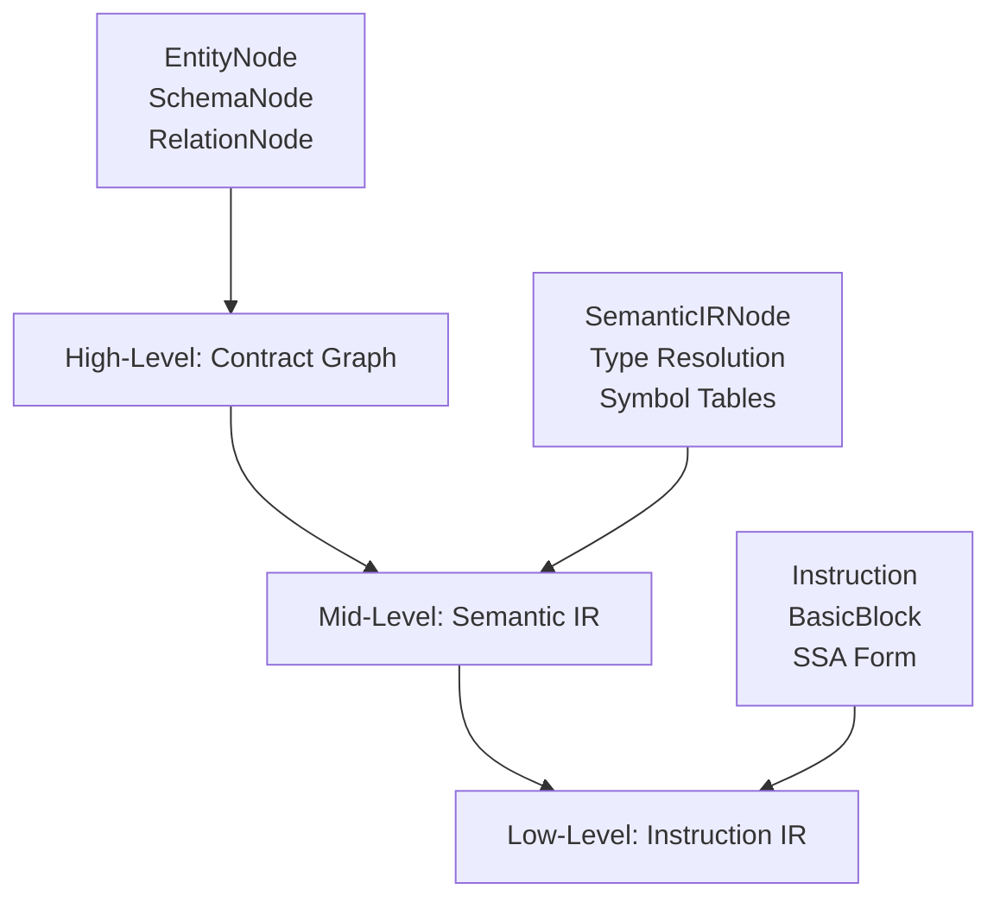
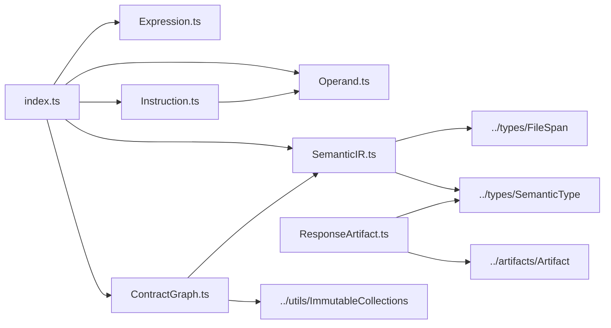
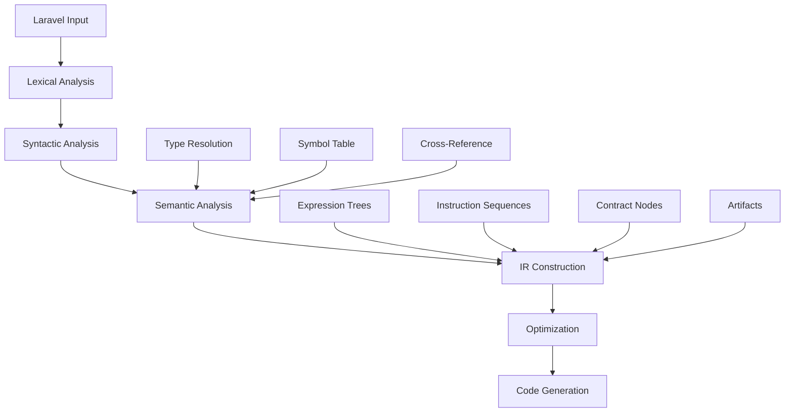
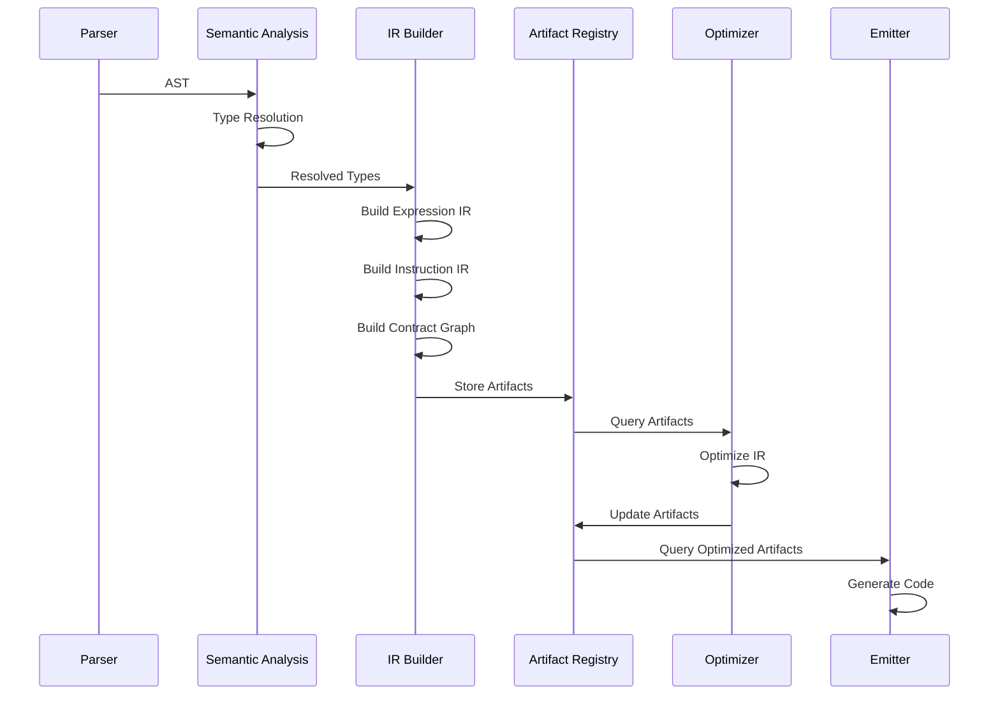
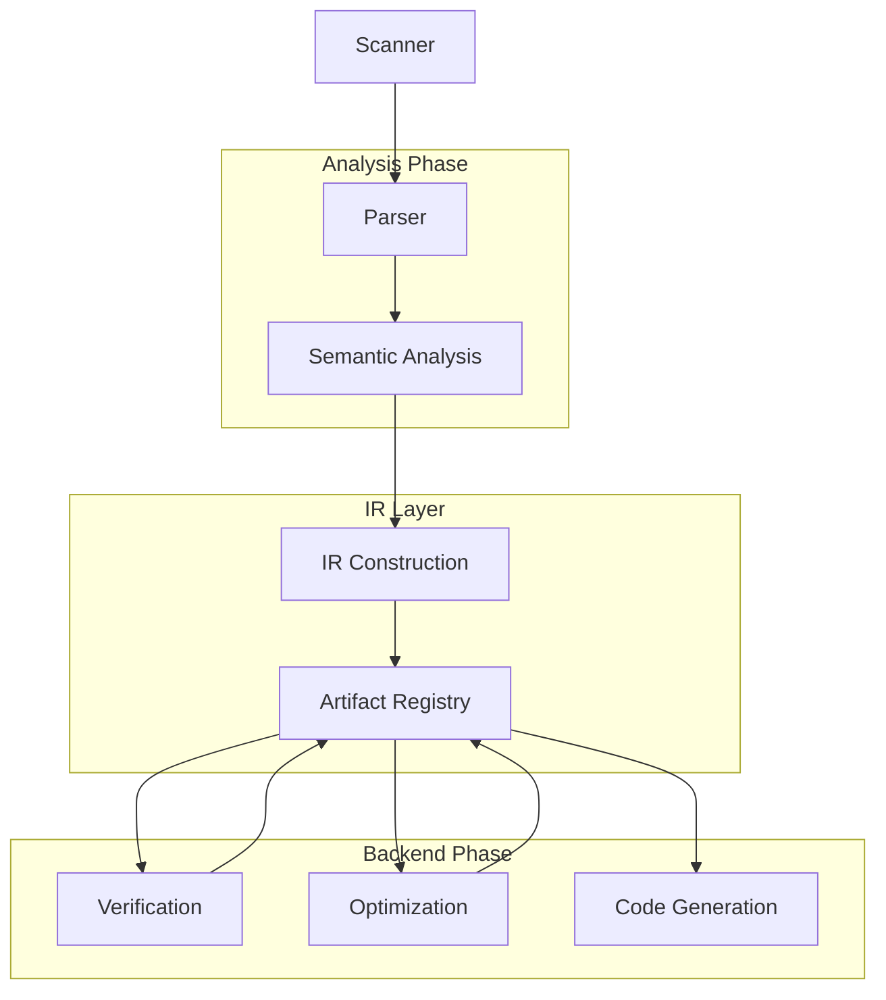

# RouteSync Compiler IR (Intermediate Representation)

## Pendahuluan

Folder `compiler/ir` berisi implementasi **Intermediate Representation (IR)** untuk RouteSync compiler. IR adalah representasi internal yang digunakan compiler untuk menyimpan dan memanipulasi informasi program selama proses kompilasi, sebelum menghasilkan kode akhir.

### Apa itu Intermediate Representation (IR)

Intermediate Representation adalah struktur data perantara yang berfungsi sebagai jembatan antara frontend compiler (parsing dan semantic analysis) dengan backend compiler (code generation dan optimization). IR memungkinkan compiler untuk:

1. **Memisahkan parsing dari generasi kode** - Frontend fokus memahami input (Laravel routes, controllers, models), backend fokus menghasilkan output (TypeScript, React hooks, Zod schemas)
2. **Melakukan optimisasi** - IR dalam bentuk yang mudah dianalisis dan ditransformasi
3. **Mendukung multiple backends** - Satu IR dapat menghasilkan TypeScript, Kotlin, OpenAPI, dll
4. **Memfasilitasi analisis** - Type checking, dependency analysis, dead code elimination

### Peran IR dalam Arsitektur RouteSync

Dalam arsitektur compiler RouteSync, IR berperan sebagai **Single Source of Truth** untuk semua informasi yang telah dianalisis:

```
Laravel Input → Frontend Parser → Semantic Analysis → IR → Backend Emitters → Generated Code
     ↓               ↓                ↓             ↓           ↓               ↓
  routes/api.php  Route AST     Type Resolution  Artifacts  TypeScript     React Hooks
  Controllers     Resource AST   Model Analysis   IR Nodes   Interfaces     Zod Schemas
  Resources       Model AST      Validation       Contract   API Client     Vue Composables
```

IR memastikan bahwa analisis dilakukan sekali dan hasil dapat digunakan oleh berbagai emitters tanpa re-analysis.

### Mengapa IR Diperlukan

RouteSync membutuhkan IR karena kompleksitas analisis Laravel framework:

1. **Type Inference Complexity** - Menentukan tipe response dari `UserResource::collection(User::all())` membutuhkan analisis Resource class, Model relationship, dan HTTP transport
2. **Multiple Analysis Phases** - Validation rules, model schemas, controller logic, dan resource transformations harus dianalisis dalam urutan yang tepat
3. **Cross-Reference Resolution** - Resource mereference Model, Controller mereference Resource, Route mereference Controller
4. **Framework Abstraction** - IR memisahkan Laravel-specific parsing dari language-agnostic code generation

## Arsitektur

Folder `compiler/ir` terdiri dari beberapa file yang masing-masing menangani aspek berbeda dari representasi IR:

### Struktur File

| File | Tanggung Jawab | Komponen Utama |
|------|---------------|----------------|
| `index.ts` | Barrel exports untuk IR module | Re-export semua public interfaces |
| `Expression.ts` | Constant values dan expressions | `ConstantValue`, `Expression`, `SymbolReference` |
| `Operand.ts` | Operand types untuk instructions | `Operand` union type dengan `Constant`, `Variable`, `SSAValue` |
| `Instruction.ts` | Low-level IR instructions | `Instruction` union, `BasicBlock` untuk control flow |
| `SemanticIR.ts` | High-level semantic nodes | `SemanticIRNode`, `SemanticIRArena` untuk memory management |
| `ContractGraph.ts` | Contract graph representation | `ContractNode` hierarchy dengan visitor pattern |
| `ResponseArtifact.ts` | HTTP response analysis artifacts | `ResponseArtifact` dan artifact family |

### Hirarki IR

RouteSync menggunakan **multi-level IR architecture** dengan tiga tingkat abstraksi:


### Interface dan Class Utama

#### 1. Expression dan Constant Values (`Expression.ts`)

`ConstantValue` adalah union type yang merepresentasikan nilai konstan yang dapat dievaluasi pada compile time:

```typescript
type ConstantValue =
    | string | number | boolean | null
    | ArrayConstant     // Array dari constants
    | ClassConstant     // PHP class reference
    | EnumCase          // Enum value
    | SymbolReference;  // Reference ke symbol
```

`Expression` merepresentasikan operasi yang dapat dievaluasi:

```typescript
type Expression =
    | { kind: 'Literal'; value: ConstantValue }
    | { kind: 'Call'; callee: string; arguments: readonly Expression[] }
    | { kind: 'PropertyAccess'; target: Expression; property: string }
    | { kind: 'MethodCall'; target: Expression; method: string; arguments: readonly Expression[] };
```

#### 2. Operand Types (`Operand.ts`)

`Operand` merepresentasikan sumber nilai dalam IR instructions:

```typescript
type Operand =
    | { kind: 'Constant'; value: unknown }    // Nilai konstan
    | { kind: 'Variable'; id: number }        // Variable yang bisa dimutasi
    | { kind: 'SSAValue'; id: number };       // SSA value (immutable)
```

#### 3. Instruction Set (`Instruction.ts`)

RouteSync menggunakan instruction set yang mendukung operasi data dan control flow:

- `Assign` - Assignment ke target
- `Jump`/`Branch` - Control flow operations  
- `Call` - Function/method calls
- `Return` - Return dari function
- `Phi` - SSA phi nodes untuk merge values
- `LoadProperty`/`StoreProperty` - Object property access

`BasicBlock` mengorganisir instructions dalam unit control flow dengan single entry/exit point.
#### 4. Semantic IR (`SemanticIR.ts`)

`SemanticIRNode` adalah unit dasar untuk representasi semantic high-level:

```typescript
interface SemanticIRNode {
    readonly id: IRNodeId;
    readonly kind: SemanticIRNodeKind;  // 'EntityDeclaration' | 'EndpointDeclaration' | etc
    readonly type: SemanticType;
    readonly inputs: readonly IRNodeId[];
    readonly origin?: SemanticOrigin;   // Source location tracking
    readonly ownerModule: string;
    readonly symbolId: number;
    readonly dependencyEdges: readonly IRNodeId[];
}
```

`SemanticIRArena` menyediakan memory management untuk IR nodes dengan arena allocation pattern.

#### 5. Contract Graph (`ContractGraph.ts`)

Contract graph menggunakan visitor pattern untuk traversal yang type-safe:

```typescript
abstract class ContractBaseNode {
    abstract accept<T>(visitor: ContractVisitor<T>): T;
}

// Concrete implementations
class EntityNode extends ContractBaseNode    // Domain entities (User, Product)
class SchemaNode extends ContractBaseNode    // Type schemas
class RelationNode extends ContractBaseNode  // Relationships antar entities
```

Contract graph dibangun menggunakan builder pattern:

```typescript
const graph = new ContractGraphBuilder()
    .addNode(new EntityNode(...))
    .addNode(new SchemaNode(...))
    .build();
```

#### 6. Response Artifacts (`ResponseArtifact.ts`)

ResponseArtifact adalah artifact family yang mengikuti compiler artifact pattern. Menggunakan **discriminated unions** untuk type safety dan **separation of concerns** antara transport mechanism dan data content:

```typescript
// Transport mechanism (HOW response dikirim)
interface ResponseDescriptor {
    transport: "resource" | "model" | "json" | "primitive" | "binary" | "stream" | "redirect" | "empty";
    status?: number;
    contentType?: string;
    nullable?: boolean;
}

// Response content (WHAT response berisi)  
type ResponseBody = ResourceBody | ModelBody | ObjectBody | PrimitiveBody;
```
### Dependency Antar File



**Dependency Rules:**
- `index.ts` hanya melakukan re-exports, tidak ada logic
- `Instruction.ts` depends on `Operand.ts` untuk instruction operands
- `ContractGraph.ts` depends on `SemanticIR.ts` untuk `SemanticOrigin`
- `ResponseArtifact.ts` adalah special case, extends dari `../artifacts/Artifact`
- Semua file IR tidak depend pada compiler passes atau emitters (layering principle)

## Cara Kerja

### Proses Pembentukan IR

IR terbentuk melalui pipeline transformation yang sistematis:



#### 1. Expression Construction

Dari parser AST ke Expression IR:

```typescript
// Input: return new UserResource($user);
// Output: Expression IR
{
    kind: 'Call',
    callee: 'UserResource::__construct',
    arguments: [
        { kind: 'PropertyAccess', target: { kind: 'Literal', value: '$user' }, property: 'id' }
    ]
}
```


#### 2. Instruction Sequence Construction

Dari semantic analysis ke instruction IR:

```typescript
// Input: UserResource::collection($users)
// Output: Instruction sequence
const instructions: Instruction[] = [
    { kind: 'Assign', target: 1, value: { kind: 'Variable', id: 0 } }, // $users
    { kind: 'Call', target: 'UserResource::collection', args: [{ kind: 'Variable', id: 1 }] },
    { kind: 'Return', value: { kind: 'Variable', id: 2 } }
];
```

#### 3. Contract Graph Construction

Dari resolved types ke contract graph:

```typescript
const builder = new ContractGraphBuilder();

// Add entity node untuk User model
builder.addNode(new EntityNode(
    { layer: 'entity', name: 'User' },
    'User',
    'hash123',
    new ImmutableMap([
        ['id', { kind: 'primitive', name: 'number' }],
        ['name', { kind: 'primitive', name: 'string' }],
        ['email', { kind: 'primitive', name: 'string' }]
    ])
));

// Add schema node untuk UserResource
builder.addNode(new SchemaNode(
    { layer: 'schema', name: 'UserResource' },
    'UserResource',
    'hash456',
    { kind: 'resource', resource: 'UserResource', model: 'User' }
));

const graph = builder.build();
```

#### 4. Response Artifact Construction

Dari controller analysis ke ResponseArtifact:

```typescript
const artifact = new ResponseArtifactBuilder()
    .id('users.show.Response')
    .transport('resource')
    .body({
        type: 'resource',
        resource: 'UserResource',
        model: 'User',
        shape: 'single'
    })
    .confidence({
        score: 1.0,
        reasons: ['Explicit UserResource return type'],
        method: 'explicit'
    })
    .status(200)
    .build();
```


### Penggunaan IR oleh Analysis dan Optimization

IR digunakan oleh berbagai compiler passes untuk analisis dan optimisasi:

#### 1. Type Checking Pass

Type checking pass membaca SemanticIRNode dan ContractGraph untuk memverifikasi type correctness:

```typescript
class TypeCheckPass {
    async execute(state: CompilationState): Promise<void> {
        const graph = state.artifacts.get<ContractGraph>('contract.graph');
        
        for (const [key, node] of graph.nodes) {
            // Verify type consistency
            if (node.kind === 'entity') {
                this.checkEntityTypes(node);
            }
        }
    }
}
```

#### 2. Dead Code Elimination

Dead code elimination menggunakan instruction IR untuk mendeteksi unreachable code:

```typescript
function eliminateDeadCode(blocks: BasicBlock[]): BasicBlock[] {
    const reachable = new Set<number>();
    
    // Mark reachable blocks dari entry point
    const queue = [0]; // Block 0 adalah entry
    while (queue.length > 0) {
        const blockId = queue.shift()!;
        if (reachable.has(blockId)) continue;
        
        reachable.add(blockId);
        const block = blocks[blockId];
        queue.push(...block.successors);
    }
    
    // Remove unreachable blocks
    return blocks.filter(b => reachable.has(b.id));
}
```

#### 3. Dependency Analysis

Contract graph digunakan untuk dependency analysis:

```typescript
function analyzeDependencies(graph: ContractGraph): Map<string, string[]> {
    const deps = new Map<string, string[]>();
    
    for (const [key, node] of graph.nodes) {
        if (node.kind === 'relation') {
            const sourceKey = `${node.source.layer}:${node.source.name}`;
            const targetKey = `${node.target.layer}:${node.target.name}`;
            
            if (!deps.has(sourceKey)) {
                deps.set(sourceKey, []);
            }
            deps.get(sourceKey)!.push(targetKey);
        }
    }
    
    return deps;
}
```


### Alur Transformasi Data



**Tahapan Detail:**

1. **Parser → Semantic Analysis**: Parser menghasilkan AST, semantic analysis melakukan type resolution
2. **Semantic → IR Builder**: Resolved types ditransformasi menjadi IR nodes
3. **IR Builder → Artifact Registry**: IR disimpan sebagai artifacts di registry (SSOT)
4. **Artifact Registry → Optimizer**: Optimizer membaca artifacts untuk analisis
5. **Optimizer → Artifact Registry**: Optimized IR disimpan kembali
6. **Artifact Registry → Emitter**: Emitter membaca final artifacts untuk code generation

## Cara Penggunaan

### Membuat Expression IR

```typescript
import { ArrayConstant, ClassConstant } from '@routesync/core/compiler/ir';

// Array constant
const arrayConst = new ArrayConstant([1, 2, 3]);

// Class constant (untuk PHP class reference)
const classConst = new ClassConstant('App\\Models', 'User');

// Expression tree
const expression: Expression = {
    kind: 'MethodCall',
    target: { kind: 'Literal', value: classConst },
    method: 'where',
    arguments: [
        { kind: 'Literal', value: 'status' },
        { kind: 'Literal', value: 'active' }
    ]
};
```


### Membuat Instruction IR

```typescript
import type { Instruction, BasicBlock } from '@routesync/core/compiler/ir';

// Create basic block dengan instructions
const block: BasicBlock = {
    id: 0,
    instructions: [
        // Load variable
        { 
            kind: 'Assign', 
            target: 1, 
            value: { kind: 'Constant', value: 42 } 
        },
        // Call function
        {
            kind: 'Call',
            target: 'validate',
            args: [{ kind: 'Variable', id: 1 }]
        },
        // Conditional branch
        {
            kind: 'Branch',
            condition: { kind: 'Variable', id: 2 },
            trueBlockId: 1,
            falseBlockId: 2
        }
    ],
    successors: [1, 2],
    predecessors: []
};

// SSA form dengan Phi node
const ssaBlock: BasicBlock = {
    id: 3,
    instructions: [
        {
            kind: 'Phi',
            target: 5,
            incoming: new Map([
                [1, { kind: 'Variable', id: 3 }],
                [2, { kind: 'Variable', id: 4 }]
            ])
        },
        {
            kind: 'Return',
            value: { kind: 'SSAValue', id: 5 }
        }
    ],
    successors: [],
    predecessors: [1, 2]
};
```

### Membuat Semantic IR

```typescript
import { SemanticIRArena } from '@routesync/core/compiler/ir';
import type { SemanticType } from '@routesync/core/compiler/types';

const arena = new SemanticIRArena();

// Allocate entity declaration node
const userEntityId = arena.allocate(
    'EntityDeclaration',
    { kind: 'entity', name: 'User', properties: new Map() } as SemanticType,
    [], // No inputs
    { 
        span: { file: 'User.php', start: 0, end: 100 },
        symbolId: 1
    },
    'App\\Models',
    1,
    [] // No dependencies yet
);

// Allocate property declaration
const namePropertyId = arena.allocate(
    'PropertyDeclaration',
    { kind: 'primitive', name: 'string' } as SemanticType,
    [userEntityId], // Input adalah parent entity
    {
        span: { file: 'User.php', start: 50, end: 70 },
        symbolId: 2
    },
    'App\\Models',
    2,
    [userEntityId] // Depends on User entity
);

// Query node
const node = arena.get(userEntityId);
console.log(node.kind); // 'EntityDeclaration'
console.log(node.symbolId); // 1
```


### Membuat Contract Graph

```typescript
import { 
    ContractGraphBuilder, 
    EntityNode, 
    SchemaNode, 
    RelationNode 
} from '@routesync/core/compiler/ir';
import { ImmutableMap } from '@routesync/core/compiler/utils';

const builder = new ContractGraphBuilder();

// Add User entity
const userEntity = new EntityNode(
    { layer: 'entity', name: 'User' },
    'User',
    'version-hash-1',
    new ImmutableMap([
        ['id', { kind: 'primitive', name: 'number' }],
        ['name', { kind: 'primitive', name: 'string' }],
        ['email', { kind: 'primitive', name: 'string' }]
    ]),
    { 
        span: { file: 'User.php', start: 0, end: 500 },
        symbolId: 100
    }
);

// Add UserResource schema
const userSchema = new SchemaNode(
    { layer: 'schema', name: 'UserResource' },
    'UserResource',
    'version-hash-2',
    { 
        kind: 'resource',
        resource: 'UserResource',
        model: 'User',
        shape: 'single'
    } as any,
    {
        span: { file: 'UserResource.php', start: 0, end: 300 },
        symbolId: 101
    }
);

// Add relation
const relation = new RelationNode(
    { layer: 'relation', name: 'UserResource->User' },
    'transforms',
    'version-hash-3',
    { layer: 'schema', name: 'UserResource' },
    { layer: 'entity', name: 'User' },
    undefined
);

// Build graph
const graph = builder
    .addNode(userEntity)
    .addNode(userSchema)
    .addNode(relation)
    .build();

// Query graph
const userNode = graph.node({ layer: 'entity', name: 'User' });
console.log(userNode?.kind); // 'entity'
```


### Membuat Response Artifact

```typescript
import { 
    ResponseArtifactBuilder,
    ResponseArtifact 
} from '@routesync/core/compiler/ir';

// Example 1: Resource single response
const singleResource = new ResponseArtifactBuilder()
    .id('users.show.Response')
    .resource('UserResource', 'User', 'single', 1.0, 'Explicit return type')
    .status(200)
    .contentType('application/json')
    .metadata({
        producer: 'ResponseAnalysisPass',
        dependencies: ['User', 'UserResource'],
        revision: '1.0.0'
    })
    .build();

// Example 2: Collection dengan confidence tracking
const collection = new ResponseArtifactBuilder()
    .id('products.index.Response')
    .transport('resource')
    .body({
        type: 'resource',
        resource: 'ProductResource',
        model: 'Product',
        shape: 'collection'
    })
    .confidence({
        score: 0.85,
        reasons: [
            'Inferred from Resource::collection() call',
            'No explicit type annotation'
        ],
        method: 'inferred'
    })
    .status(200)
    .build();

// Example 3: Binary download
const download = new ResponseArtifactBuilder()
    .id('files.download.Response')
    .transport('binary')
    .contentType('application/pdf')
    .contentDisposition('attachment', 'document.pdf')
    .confidence({
        score: 1.0,
        reasons: ['Explicit download() method'],
        method: 'explicit'
    })
    .status(200)
    .build();

// Query artifact
if (singleResource.descriptor.transport === 'resource' && singleResource.body) {
    console.log(singleResource.body.type); // 'resource'
}

// Type guards
import { isResourceBody, hasBody, isHighConfidence } from '@routesync/core/compiler/ir';

if (hasBody(singleResource) && isResourceBody(singleResource.body)) {
    console.log(singleResource.body.resource); // 'UserResource'
    console.log(singleResource.body.model); // 'User'
}

if (isHighConfidence(collection)) {
    console.log('High confidence response');
}
```


### Visitor Pattern untuk Contract Graph

```typescript
import type { ContractVisitor } from '@routesync/core/compiler/ir';

class TypeScriptEmitterVisitor implements ContractVisitor<string> {
    visitEntity(node: EntityNode): string {
        const properties = Array.from(node.properties.entries())
            .map(([name, type]) => `  ${name}: ${this.formatType(type)};`)
            .join('\n');
        
        return `export interface ${node.name} {\n${properties}\n}`;
    }
    
    visitSchema(node: SchemaNode): string {
        // Generate schema definition
        return `export const ${node.name}Schema = z.object({ ... });`;
    }
    
    visitRelation(node: RelationNode): string {
        // Relations biasanya tidak di-emit langsung
        return '';
    }
    
    private formatType(type: SemanticType): string {
        if (type.kind === 'primitive') {
            return type.name;
        }
        // ... handle other types
        return 'unknown';
    }
}

// Usage
const visitor = new TypeScriptEmitterVisitor();
const graph = /* ... build graph ... */;

for (const [key, node] of graph.nodes) {
    const code = node.accept(visitor);
    console.log(code);
}
```

## Panduan Pengembangan

### Kapan Menambahkan Struktur IR Baru

Tambahkan struktur IR baru ketika:

1. **Semantic concept baru** - Jika ada konsep semantic baru yang perlu direpresentasikan (misalnya, GraphQL queries, WebSocket endpoints)
2. **Optimization opportunity** - Jika optimisasi membutuhkan representasi yang lebih detail
3. **Cross-cutting analysis** - Jika analisis membutuhkan representasi yang berbeda dari yang ada
4. **New backend target** - Jika target output baru membutuhkan informasi yang tidak ada di IR saat ini

**Contoh:** Menambahkan WebSocket endpoint IR:

```typescript
// SemanticIR.ts
export type SemanticIRNodeKind =
    | 'EntityDeclaration'
    | 'EndpointDeclaration'
    | 'PropertyDeclaration'
    | 'RelationDeclaration'
    | 'WebSocketEndpoint'; // NEW

// ContractGraph.ts
export class WebSocketNode implements ContractBaseNode {
    readonly kind = 'websocket';
    
    constructor(
        readonly id: NodeId,
        readonly name: string,
        readonly versionHash: string,
        readonly channel: string,
        readonly events: readonly string[],
        readonly origin?: SemanticOrigin
    ) {}
    
    accept<T>(visitor: ContractVisitor<T>): T {
        return visitor.visitWebSocket(this);
    }
}

// Update visitor interface
export interface ContractVisitor<T> {
    visitEntity(node: EntityNode): T;
    visitSchema(node: SchemaNode): T;
    visitRelation(node: RelationNode): T;
    visitWebSocket(node: WebSocketNode): T; // NEW
}
```


### Best Practices

#### 1. Immutability

Semua IR structures harus immutable untuk memfasilitasi caching, parallel processing, dan incremental compilation:

```typescript
// ✅ Good: Immutable dengan readonly
export interface SemanticIRNode {
    readonly id: IRNodeId;
    readonly kind: SemanticIRNodeKind;
    readonly type: SemanticType;
    readonly inputs: readonly IRNodeId[];
}

// ❌ Bad: Mutable
export interface SemanticIRNode {
    id: IRNodeId;
    kind: SemanticIRNodeKind;
    type: SemanticType;
    inputs: IRNodeId[];
}
```

#### 2. Discriminated Unions

Gunakan discriminated unions dengan `kind` field untuk type-safe pattern matching:

```typescript
// ✅ Good: Discriminated union
type ResponseBody =
    | { type: "resource"; resource: string; model?: string; shape: string }
    | { type: "model"; model: string; shape: string }
    | { type: "object"; schema: ObjectSchema; shape: string }
    | { type: "primitive"; primitiveType: string; shape: "single" };

// Usage dengan type narrowing
function processBody(body: ResponseBody) {
    if (body.type === 'resource') {
        console.log(body.resource); // Type-safe access
    }
}

// ❌ Bad: Single interface dengan optional fields
interface ResponseBody {
    type: string;
    resource?: string;
    model?: string;
    schema?: ObjectSchema;
}
```

#### 3. Arena Allocation

Untuk IR nodes yang banyak, gunakan arena allocation pattern untuk efficient memory management:

```typescript
// ✅ Good: Arena allocation
const arena = new SemanticIRArena();
const id1 = arena.allocate('EntityDeclaration', ...);
const id2 = arena.allocate('PropertyDeclaration', ...);
const node = arena.get(id1);

// ❌ Bad: Individual allocation
const nodes: SemanticIRNode[] = [];
nodes.push({ id: 0, ... });
nodes.push({ id: 1, ... });
```

#### 4. Builder Pattern

Gunakan builder pattern untuk complex IR construction:

```typescript
// ✅ Good: Builder pattern
const artifact = new ResponseArtifactBuilder()
    .id('users.show')
    .resource('UserResource', 'User', 'single')
    .status(200)
    .build();

// ❌ Bad: Constructor dengan banyak parameters
const artifact = new ResponseArtifact(
    'users.show',
    { transport: 'resource', status: 200 },
    { type: 'resource', resource: 'UserResource', model: 'User', shape: 'single' },
    { score: 1.0, reasons: [], method: 'explicit' },
    undefined,
    { hash: '...', producer: '...', dependencies: [], timestamp: 0, revision: '1.0.0' }
);
```


### Anti-Patterns yang Harus Dihindari

#### 1. Backend-Specific Logic dalam IR

```typescript
// ❌ Bad: TypeScript-specific naming dalam IR
interface ResponseArtifact {
    typescriptInterfaceName: string;  // Generator concern!
    reactHookName: string;            // Generator concern!
}

// ✅ Good: Backend-agnostic semantic information
interface ResponseArtifact {
    id: string;              // Semantic identifier
    descriptor: ResponseDescriptor;  // Pure HTTP transport
    body: ResponseBody;      // Pure data structure
}
```

#### 2. Mutation Setelah Construction

```typescript
// ❌ Bad: Mutation setelah creation
const node = new EntityNode(...);
node.properties.set('newField', type); // Mutate!

// ✅ Good: Create new node dengan changes
const updatedNode = new EntityNode(
    node.id,
    node.name,
    node.versionHash,
    new ImmutableMap([...node.properties, ['newField', type]]),
    node.origin
);
```

#### 3. Framework Coupling dalam IR Types

```typescript
// ❌ Bad: Laravel-specific details di IR
interface SemanticIRNode {
    laravelControllerMethod: string;
    eloquentRelationshipType: 'hasMany' | 'belongsTo';
}

// ✅ Good: Framework-agnostic representation
interface SemanticIRNode {
    kind: SemanticIRNodeKind;  // Generic semantic type
    type: SemanticType;        // Universal type system
}
```

#### 4. Circular Dependencies dalam IR Files

```typescript
// ❌ Bad: Circular dependency
// Expression.ts
import { Instruction } from './Instruction';

// Instruction.ts
import { Expression } from './Expression';

// ✅ Good: Unidirectional dependency
// Expression.ts (no imports dari IR files)

// Instruction.ts
import type { Expression } from './Expression'; // Only type import
```

### Konvensi Penamaan

| Komponen | Konvensi | Contoh |
|----------|----------|--------|
| IR Node Types | PascalCase dengan suffix "Node" | `EntityNode`, `SchemaNode` |
| IR Node Kind | PascalCase dengan suffix "Declaration" | `EntityDeclaration`, `PropertyDeclaration` |
| Instruction Types | PascalCase | `Assign`, `Branch`, `Call` |
| Operand Types | PascalCase | `Constant`, `Variable`, `SSAValue` |
| Artifact Classes | PascalCase dengan suffix "Artifact" | `ResponseArtifact`, `ValidationArtifact` |
| Type Guards | camelCase dengan prefix "is" | `isResourceBody`, `hasBody` |
| Builder Classes | PascalCase dengan suffix "Builder" | `ResponseArtifactBuilder`, `ContractGraphBuilder` |


### Prinsip Framework Independence

IR harus tetap independen dari implementasi framework untuk memungkinkan multiple backends:

```typescript
// ✅ Good: Framework-agnostic IR
interface ResponseDescriptor {
    transport: "resource" | "model" | "json" | "binary";
    status?: number;
    contentType?: string;
}

// Backend-specific emitter menginterpretasi IR
class TypeScriptEmitter {
    emit(artifact: ResponseArtifact): string {
        if (artifact.descriptor.transport === 'resource') {
            return this.emitResourceType(artifact);
        }
        // ... handle other transports
    }
}

class KotlinEmitter {
    emit(artifact: ResponseArtifact): string {
        if (artifact.descriptor.transport === 'resource') {
            return this.emitDataClass(artifact);
        }
        // ... handle other transports
    }
}

// ❌ Bad: Framework-coupled IR
interface ResponseDescriptor {
    laravelResourceClass: string;     // Laravel-specific!
    typeScriptInterfaceName: string;  // TypeScript-specific!
}
```

## Struktur Folder Detail

```
compiler/ir/
├── index.ts                    # Barrel exports untuk public API
├── Expression.ts               # Expression trees dan constant values
├── Operand.ts                  # Operand types untuk instructions
├── Instruction.ts              # Low-level instruction IR
├── SemanticIR.ts              # High-level semantic IR dengan arena
├── ContractGraph.ts           # Contract graph dengan visitor pattern
└── ResponseArtifact.ts        # Response analysis artifacts (artifact family)
```

### Tanggung Jawab Per File

#### `index.ts`
- Re-export semua public interfaces dan types
- Tidak ada logic, hanya barrel exports
- Menyediakan clean public API

#### `Expression.ts`
- Definisi `ConstantValue` union type
- Expression AST structures (`Literal`, `Call`, `PropertyAccess`, `MethodCall`)
- Symbol reference tracking
- Constant classes (`ArrayConstant`, `ClassConstant`, `EnumCase`)

#### `Operand.ts`
- Operand union type untuk instruction values
- `Constant`, `Variable`, dan `SSAValue` variants
- Minimal file dengan fokus pada operand representation

#### `Instruction.ts`
- Complete instruction set definition
- `BasicBlock` dengan control flow tracking
- Support untuk SSA form dengan Phi nodes
- Data operations dan control flow operations


#### `SemanticIR.ts`
- High-level semantic node definitions
- `SemanticIRNode` interface dengan dependency tracking
- `SemanticIRArena` untuk efficient memory management
- Source location tracking via `SemanticOrigin`
- Support untuk module ownership dan symbol IDs

#### `ContractGraph.ts`
- Contract node hierarchy (`EntityNode`, `SchemaNode`, `RelationNode`)
- Visitor pattern implementation untuk type-safe traversal
- `ContractGraphBuilder` untuk incremental graph construction
- Immutable graph representation dengan `ImmutableMap`
- Node lookup by layer dan name

#### `ResponseArtifact.ts`
- **Largest file** - Complete artifact family untuk HTTP analysis
- `ResponseArtifact` sebagai main artifact
- Supporting artifacts: `ValidationArtifact`, `ModelArtifact`, `ResourceArtifact`, `RouteArtifact`
- Separation of concerns: `ResponseDescriptor` (transport) vs `ResponseBody` (content)
- Confidence scoring dengan transparency
- Builder pattern untuk construction
- Type guards untuk type narrowing
- Examples dan usage patterns

## Referensi Implementasi

### Komponen IR Utama

#### 1. Expression System

Expression system mendukung:
- **Literal values**: string, number, boolean, null
- **Complex constants**: Arrays, class references, enum cases
- **Symbol references**: Link ke symbol table
- **Operations**: Calls, property access, method calls

Digunakan untuk merepresentasikan PHP expressions yang dievaluasi pada compile time atau runtime.

#### 2. Instruction System

Instruction system adalah low-level IR yang mendukung:
- **Data operations**: Assignment, property load/store
- **Control flow**: Jump, branch, return
- **Function calls**: Regular calls dengan arguments
- **SSA form**: Phi nodes untuk value merging

Digunakan untuk analisis control flow dan optimisasi.

#### 3. Semantic IR

Semantic IR adalah high-level representation yang menyimpan:
- **Declarations**: Entity, endpoint, property, relation declarations
- **Type information**: Semantic types untuk setiap node
- **Dependencies**: Explicit dependency edges antar nodes
- **Source mapping**: Precise source location untuk setiap node
- **Module ownership**: Namespace/module tracking

Digunakan oleh semantic analysis passes dan type checking.

#### 4. Contract Graph

Contract graph menyediakan:
- **Structured representation**: Entities, schemas, relations as nodes
- **Visitor pattern**: Type-safe traversal mechanism
- **Version tracking**: Hash-based versioning per node
- **Immutability**: Full immutable structure dengan ImmutableMap
- **Query interface**: Lookup nodes by ID

Digunakan untuk dependency analysis dan code generation planning.


#### 5. Response Artifacts

Response artifact family adalah **compiler artifact implementation** yang mengikuti pattern dari `../artifacts/Artifact`:

**Design Principles:**
- **Pure analysis**: Hanya semantic information, tidak ada generation decisions
- **Separation of concerns**: Transport (HOW) terpisah dari body (WHAT)
- **Discriminated unions**: Type-safe dengan TypeScript
- **Confidence tracking**: Transparency untuk inference quality
- **Immutability**: Readonly fields untuk compiler pipeline
- **Deterministic**: Content-based hashing tanpa timestamp

**Artifact Family:**
- `ResponseArtifact` - Complete HTTP response analysis
- `ValidationArtifact` - FormRequest validation rules
- `ModelArtifact` - Eloquent model structure
- `ResourceArtifact` - Laravel Resource metadata
- `RouteArtifact` - Umbrella artifact dengan references

### Hubungan dengan Compiler Components

#### Dengan Analysis Passes

IR digunakan oleh analysis passes untuk query dan update:

```typescript
class ResponseAnalysisPass extends CompilerPass {
    async execute(state: CompilationState): Promise<void> {
        // Read dari artifact registry
        const routes = state.artifacts.getAllOfType<RouteArtifact>('RouteAnalysis');
        
        for (const route of routes) {
            // Analyze response
            const artifact = this.analyzeResponse(route);
            
            // Write ke artifact registry
            state.artifacts.set(`response.${route.id}`, artifact);
        }
    }
}
```

#### Dengan Verification Passes

Verification passes membaca IR untuk validasi:

```typescript
class TypeConsistencyVerification {
    verify(state: CompilationState): VerificationResult[] {
        const graph = state.artifacts.get<ContractGraph>('contract.graph');
        const issues: VerificationResult[] = [];
        
        for (const [key, node] of graph.nodes) {
            if (node.kind === 'relation') {
                const source = graph.node(node.source);
                const target = graph.node(node.target);
                
                if (!this.areTypesCompatible(source, target)) {
                    issues.push({
                        severity: 'error',
                        message: `Type mismatch in relation ${key}`
                    });
                }
            }
        }
        
        return issues;
    }
}
```

#### Dengan Optimization Passes

Optimization passes transform IR:

```typescript
class ConstantFoldingPass {
    optimize(blocks: BasicBlock[]): BasicBlock[] {
        return blocks.map(block => ({
            ...block,
            instructions: block.instructions.map(inst => {
                if (inst.kind === 'Assign' && inst.value.kind === 'Constant') {
                    // Fold constant
                    return this.foldConstant(inst);
                }
                return inst;
            })
        }));
    }
}
```


#### Dengan Emitters

Emitters membaca IR untuk code generation:

```typescript
class TypeScriptEmitter {
    emit(artifact: ResponseArtifact): string {
        const { descriptor, body } = artifact;
        
        // Transport-specific generation
        if (descriptor.transport === 'resource' && body && body.type === 'resource') {
            return this.emitResourceInterface(body);
        }
        
        if (descriptor.transport === 'binary') {
            return this.emitBinaryType(descriptor);
        }
        
        return 'unknown';
    }
    
    private emitResourceInterface(body: ResourceBody): string {
        const typeName = body.resource.replace('Resource', '');
        const collectionSuffix = body.shape === 'collection' ? '[]' : '';
        
        return `export type ${typeName}Response = ${body.model}${collectionSuffix};`;
    }
}
```

### Integration dengan Compiler Pipeline

IR terintegrasi dalam compiler pipeline sebagai **central data structure**:



**Pipeline Flow:**
1. Scanner/Parser menghasilkan raw AST
2. Semantic Analysis resolve types dan creates semantic IR
3. IR Construction builds complete IR structures (expressions, instructions, graphs, artifacts)
4. Artifact Registry stores IR sebagai SSOT
5. Verification passes query artifacts untuk validation
6. Optimization passes transform artifacts
7. Code Generation passes query final artifacts untuk output

### Memory Management

IR menggunakan berbagai strategi memory management:

#### Arena Allocation

`SemanticIRArena` menggunakan arena pattern untuk efficient allocation:

```typescript
class SemanticIRArena {
    private nodes: SemanticIRNode[] = [];
    
    allocate(...): IRNodeId {
        const id = this.nodes.length;
        this.nodes.push(node);
        return id;  // Return index as ID
    }
    
    get(id: IRNodeId): SemanticIRNode {
        return this.nodes[id];  // O(1) lookup
    }
}
```

**Benefits:**
- O(1) allocation dan lookup
- No memory fragmentation
- Batch deallocation (clear entire arena)
- Cache-friendly memory layout

#### Immutable Collections

`ContractGraph` menggunakan `ImmutableMap` untuk structural sharing:

```typescript
const map1 = new ImmutableMap([['a', 1]]);
const map2 = map1.set('b', 2);  // map1 tidak berubah

// map1 dan map2 share memory untuk 'a' entry
```

**Benefits:**
- Safe sharing across threads/passes
- Enable efficient diffing
- Support incremental compilation


## Advanced Topics

### SSA Form Implementation

Static Single Assignment (SSA) form didukung melalui instruction IR:

```typescript
// Non-SSA form (same variable assigned multiple times)
const instructions: Instruction[] = [
    { kind: 'Assign', target: 1, value: { kind: 'Constant', value: 10 } },
    { kind: 'Branch', condition: { kind: 'Variable', id: 0 }, trueBlockId: 1, falseBlockId: 2 },
    // Block 1: x = 20
    { kind: 'Assign', target: 1, value: { kind: 'Constant', value: 20 } },
    // Block 2: x = 30
    { kind: 'Assign', target: 1, value: { kind: 'Constant', value: 30 } }
];

// SSA form (phi node merges values)
const ssaInstructions: Instruction[] = [
    { kind: 'Assign', target: 1, value: { kind: 'Constant', value: 10 } },
    { kind: 'Branch', condition: { kind: 'Variable', id: 0 }, trueBlockId: 1, falseBlockId: 2 },
    // Block 1: x1 = 20
    { kind: 'Assign', target: 2, value: { kind: 'Constant', value: 20 } },
    // Block 2: x2 = 30
    { kind: 'Assign', target: 3, value: { kind: 'Constant', value: 30 } },
    // Block 3: x3 = phi(x1, x2)
    {
        kind: 'Phi',
        target: 4,
        incoming: new Map([
            [1, { kind: 'SSAValue', id: 2 }],  // dari block 1
            [2, { kind: 'SSAValue', id: 3 }]   // dari block 2
        ])
    }
];
```

SSA form memudahkan optimisasi seperti constant propagation dan dead code elimination.

### Control Flow Graph Construction

BasicBlock structures membentuk control flow graph:

```typescript
function buildCFG(blocks: BasicBlock[]): Map<number, Set<number>> {
    const cfg = new Map<number, Set<number>>();
    
    for (const block of blocks) {
        cfg.set(block.id, new Set(block.successors));
    }
    
    return cfg;
}

// Reverse CFG untuk dataflow analysis
function buildReverseCFG(blocks: BasicBlock[]): Map<number, Set<number>> {
    const rcfg = new Map<number, Set<number>>();
    
    for (const block of blocks) {
        for (const succ of block.successors) {
            if (!rcfg.has(succ)) {
                rcfg.set(succ, new Set());
            }
            rcfg.get(succ)!.add(block.id);
        }
    }
    
    return rcfg;
}
```

### Type System Integration

IR terintegrasi dengan compiler type system melalui `SemanticType`:

```typescript
import type { SemanticType } from '../types/SemanticType';

// SemanticIRNode carries type information
interface SemanticIRNode {
    readonly type: SemanticType;
    // ...
}

// ContractGraph nodes use SemanticType
class EntityNode {
    constructor(
        readonly properties: ImmutableMap<string, SemanticType>
    ) {}
}

// Type checking pass validates types
class TypeChecker {
    checkNode(node: SemanticIRNode): boolean {
        return this.isValidType(node.type);
    }
}
```


### Incremental Compilation Support

IR mendukung incremental compilation melalui:

#### 1. Content-Based Hashing

```typescript
class ResponseArtifactBuilder {
    private computeHash(): string {
        const content = JSON.stringify({
            id: this._id,
            descriptor: this._descriptor,
            body: this._body,
            confidence: this._confidence,
        });
        // Hash computation (deterministic, no timestamp!)
        return computeContentHash(content);
    }
}
```

#### 2. Dependency Tracking

```typescript
interface ArtifactMetadata {
    hash: string;
    dependencies: readonly string[];  // IDs of artifacts this depends on
    // ...
}

// Invalidation strategy
function invalidateArtifact(
    artifactId: string,
    registry: ArtifactRegistry
): Set<string> {
    const affected = new Set<string>([artifactId]);
    const queue = [artifactId];
    
    while (queue.length > 0) {
        const current = queue.shift()!;
        
        // Find artifacts that depend on current
        for (const [id, artifact] of registry.entries()) {
            if (artifact.metadata.dependencies.includes(current)) {
                if (!affected.has(id)) {
                    affected.add(id);
                    queue.push(id);
                }
            }
        }
    }
    
    return affected;
}
```

#### 3. Fingerprinting

Integration dengan fingerprint system untuk change detection:

```typescript
import { Fingerprint } from '../fingerprint/Fingerprint';

function hasChanged(
    oldArtifact: ResponseArtifact,
    newArtifact: ResponseArtifact
): boolean {
    return oldArtifact.metadata.hash !== newArtifact.metadata.hash;
}

// Only rebuild changed artifacts
function incrementalBuild(
    oldRegistry: ArtifactRegistry,
    newRegistry: ArtifactRegistry
): Set<string> {
    const changed = new Set<string>();
    
    for (const [id, newArtifact] of newRegistry.entries()) {
        const oldArtifact = oldRegistry.get(id);
        
        if (!oldArtifact || hasChanged(oldArtifact, newArtifact)) {
            changed.add(id);
        }
    }
    
    return changed;
}
```

## Performance Considerations

### Memory Efficiency

IR menggunakan beberapa teknik untuk memory efficiency:

1. **Arena Allocation**: Batch allocation untuk semantic IR nodes
2. **Structural Sharing**: ImmutableMap shares unchanged subtrees
3. **ID-Based References**: Reference by ID daripada nested objects
4. **Lazy Evaluation**: Compute properties on-demand

```typescript
// ❌ Bad: Nested objects (high memory)
interface RouteArtifact {
    response: ResponseArtifact;  // Full nested artifact
    validation: ValidationArtifact;
}

// ✅ Good: ID references (low memory)
interface RouteArtifact {
    responseRef: string;      // Reference by ID
    validationRef: string;
}

// Query dari registry saat needed
const response = registry.get<ResponseArtifact>(route.responseRef);
```


### Compilation Speed

IR design mempengaruhi compilation speed:

1. **Fast Lookup**: Arena dan Map-based structures untuk O(1) access
2. **Parallel Processing**: Immutable IR enables safe parallelization
3. **Incremental Updates**: Hash-based change detection
4. **Minimal Cloning**: Structural sharing reduces copying

```typescript
// Parallel processing example
async function parallelAnalysis(
    routes: RouteArtifact[],
    registry: ArtifactRegistry
): Promise<ResponseArtifact[]> {
    // Safe to process in parallel karena immutable IR
    const results = await Promise.all(
        routes.map(route => analyzeResponse(route, registry))
    );
    
    return results;
}
```

## Testing IR Structures

### Unit Testing Strategies

```typescript
import { describe, it, expect } from 'vitest';
import { SemanticIRArena } from '@routesync/core/compiler/ir';

describe('SemanticIRArena', () => {
    it('should allocate nodes sequentially', () => {
        const arena = new SemanticIRArena();
        
        const id1 = arena.allocate('EntityDeclaration', mockType, [], undefined, 'module', 1, []);
        const id2 = arena.allocate('PropertyDeclaration', mockType, [id1], undefined, 'module', 2, [id1]);
        
        expect(id1).toBe(0);
        expect(id2).toBe(1);
    });
    
    it('should retrieve nodes by ID', () => {
        const arena = new SemanticIRArena();
        const id = arena.allocate('EntityDeclaration', mockType, [], undefined, 'module', 1, []);
        
        const node = arena.get(id);
        expect(node.kind).toBe('EntityDeclaration');
        expect(node.symbolId).toBe(1);
    });
});
```

### Integration Testing

```typescript
describe('Response Artifact Construction', () => {
    it('should build complete artifact with builder', () => {
        const artifact = new ResponseArtifactBuilder()
            .id('test.response')
            .resource('TestResource', 'Test', 'single')
            .status(200)
            .build();
        
        expect(artifact.id).toBe('test.response');
        expect(artifact.descriptor.transport).toBe('resource');
        expect(artifact.body?.type).toBe('resource');
        
        if (artifact.body && artifact.body.type === 'resource') {
            expect(artifact.body.resource).toBe('TestResource');
            expect(artifact.body.model).toBe('Test');
        }
    });
    
    it('should compute deterministic hash', () => {
        const builder = new ResponseArtifactBuilder()
            .id('test')
            .primitive('string');
        
        const artifact1 = builder.build();
        const artifact2 = builder.build();
        
        expect(artifact1.metadata.hash).toBe(artifact2.metadata.hash);
    });
});
```

## Migration Guide

### Dari Legacy IR ke New IR

Jika ada legacy IR implementation, berikut migration path:

```typescript
// Legacy IR
interface LegacyResponseInfo {
    resourceName: string;
    isCollection: boolean;
    modelName?: string;
}

// Migration function
function migrateToNewIR(legacy: LegacyResponseInfo): ResponseArtifact {
    return new ResponseArtifactBuilder()
        .id('migrated')
        .transport('resource')
        .body({
            type: 'resource',
            resource: legacy.resourceName,
            model: legacy.modelName,
            shape: legacy.isCollection ? 'collection' : 'single'
        })
        .confidence({
            score: 0.8,
            reasons: ['Migrated from legacy IR'],
            method: 'heuristic'
        })
        .metadata({
            producer: 'Migration',
            dependencies: [],
            revision: '1.0.0'
        })
        .build();
}
```


## Debugging IR

### IR Inspection Tools

```typescript
// Pretty print IR node
function printIRNode(node: SemanticIRNode, indent: number = 0): void {
    const prefix = '  '.repeat(indent);
    console.log(`${prefix}${node.kind} (id: ${node.id}, symbol: ${node.symbolId})`);
    console.log(`${prefix}  type: ${JSON.stringify(node.type)}`);
    console.log(`${prefix}  inputs: [${node.inputs.join(', ')}]`);
    console.log(`${prefix}  dependencies: [${node.dependencyEdges.join(', ')}]`);
}

// Dump contract graph
function dumpContractGraph(graph: ContractGraph): void {
    console.log('Contract Graph:');
    for (const [key, node] of graph.nodes) {
        console.log(`  ${key} (${node.kind})`);
        if (node.kind === 'entity') {
            console.log(`    properties: ${node.properties.size}`);
        }
    }
}

// Visualize CFG
function visualizeCFG(blocks: BasicBlock[]): string {
    let dot = 'digraph CFG {\n';
    
    for (const block of blocks) {
        dot += `  B${block.id} [label="Block ${block.id}\\n${block.instructions.length} instructions"];\n`;
        
        for (const succ of block.successors) {
            dot += `  B${block.id} -> B${succ};\n`;
        }
    }
    
    dot += '}';
    return dot;
}
```

### Debug Mode

```typescript
// Enable debug mode via environment variable
const DEBUG_IR = process.env.DEBUG_IR === 'true';

class ResponseArtifactBuilder {
    build(): ResponseArtifact {
        const artifact = new ResponseArtifact(...);
        
        if (DEBUG_IR) {
            console.log('[IR Debug] ResponseArtifact built:', {
                id: artifact.id,
                transport: artifact.descriptor.transport,
                bodyType: artifact.body?.type,
                confidence: artifact.confidence.score
            });
        }
        
        return artifact;
    }
}
```

## Future Extensions

### Planned IR Enhancements

1. **GraphQL IR**: Support untuk GraphQL queries dan mutations
2. **WebSocket IR**: Real-time endpoint representations
3. **Event IR**: Event-driven architecture support
4. **Middleware IR**: Middleware chain representation
5. **Policy IR**: Authorization policy IR

### Extensibility Points

IR dirancang untuk extensible tanpa breaking changes:

```typescript
// Add new node kind
export type SemanticIRNodeKind =
    | 'EntityDeclaration'
    | 'EndpointDeclaration'
    | 'PropertyDeclaration'
    | 'RelationDeclaration'
    | 'GraphQLQueryDeclaration';  // New!

// Add new contract node
export class GraphQLNode implements ContractBaseNode {
    readonly kind = 'graphql';
    // ...implementation
}

// Extend visitor
export interface ContractVisitor<T> {
    visitEntity(node: EntityNode): T;
    visitSchema(node: SchemaNode): T;
    visitRelation(node: RelationNode): T;
    visitGraphQL(node: GraphQLNode): T;  // New!
}
```

## Summary

Folder `compiler/ir` menyediakan **multi-level intermediate representation** untuk RouteSync compiler:

- **Expression IR**: Constant values dan expression trees
- **Instruction IR**: Low-level operations dengan SSA support
- **Semantic IR**: High-level semantic nodes dengan arena allocation
- **Contract Graph**: Structured graph dengan visitor pattern
- **Artifact IR**: Complete analysis results dengan confidence tracking

IR berfungsi sebagai **Single Source of Truth** dalam compiler pipeline, memungkinkan:
- Framework-agnostic representation
- Efficient analysis dan optimization
- Incremental compilation
- Multiple backend targets
- Type-safe transformations

Dengan mengikuti prinsip immutability, discriminated unions, dan builder patterns, IR RouteSync menyediakan foundation yang solid untuk compiler infrastructure yang scalable dan maintainable.
