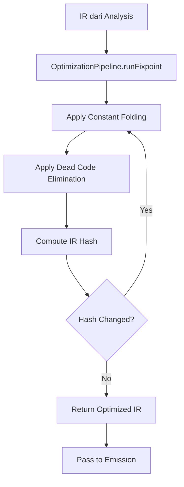
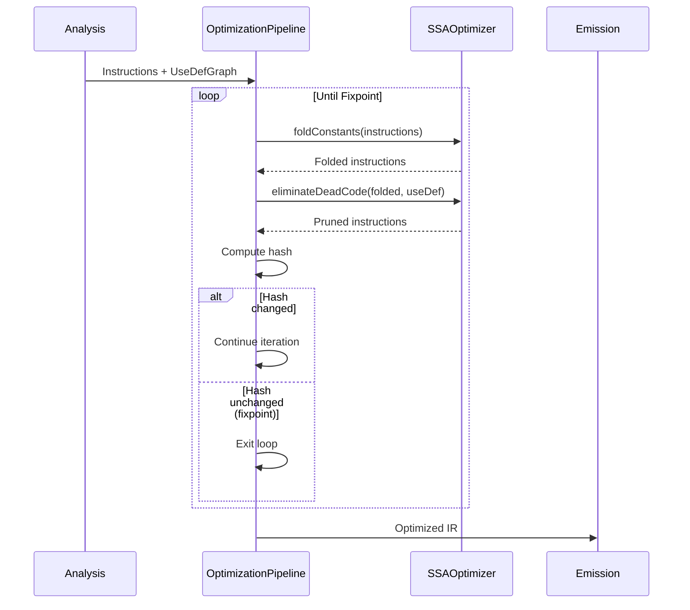
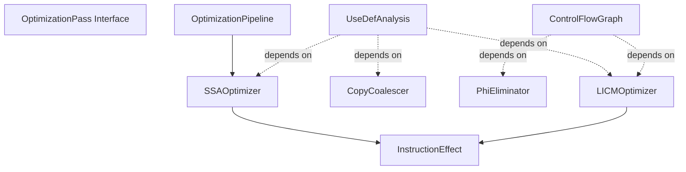

# Compiler Optimization

## Pendahuluan

### Apa itu Optimization dalam Arsitektur Compiler Ini

Folder `compiler/optimization` berisi komponen-komponen yang bertanggung jawab untuk **mengoptimalkan Intermediate Representation (IR)** yang telah dihasilkan oleh tahap parsing dan analysis. Optimization adalah tahap dalam pipeline compiler yang bertujuan meningkatkan kualitas kode yang dihasilkan tanpa mengubah semantik program.

Dalam konteks RouteSync, optimization beroperasi pada **SSA-form IR** (Static Single Assignment) yang merepresentasikan API contracts, type operations, dan data transformations. Tujuannya adalah:


- **Mengurangi ukuran kode yang dihasilkan** - Menghilangkan instruksi yang tidak diperlukan
- **Meningkatkan performa runtime** - Mengurangi komputasi redundan
- **Menyederhanakan struktur IR** - Membuat IR lebih mudah untuk di-emit ke target language
- **Mempertahankan correctness** - Semua optimisasi harus preserving program semantics

### Peran Optimization dalam Pipeline Compiler

Optimization adalah tahap **setelah analysis** dan **sebelum emission**. Berikut posisinya dalam pipeline:

```
Input (Laravel Routes)
    ↓
Parsing (AST Construction)
    ↓
Analysis (Data Flow, Control Flow, Use-Def)
    ↓
**Optimization** ← Tahap ini
    ↓
IR to Target AST
    ↓
Code Emission (TypeScript, etc.)
```

Optimization menerima IR dari tahap analysis yang sudah diperkaya dengan informasi seperti:
- Use-definition chains (dari `UseDefAnalysis`)
- Control flow graph (dari `ControlFlowGraph`)
- Loop structure information (dari `LoopAnalysis`)


Hasil optimization kemudian diteruskan ke tahap emission untuk menghasilkan kode target (TypeScript).

### Mengapa Tahap Optimization Diperlukan

Tanpa optimization, kode yang dihasilkan compiler akan:

1. **Berisi komputasi redundan** - Misalnya menghitung nilai konstan berulang kali dalam loop
2. **Memiliki instruksi yang tidak digunakan** - Dead code yang tidak berkontribusi pada output
3. **Tidak efisien** - Operasi yang bisa dilakukan sekali malah dilakukan berulang kali
4. **Sulit dibaca** - Kode yang dihasilkan penuh dengan intermediate values yang tidak perlu


Optimization memastikan bahwa kode output berkualitas tinggi dengan meminimalkan overhead dan maksimalkan performance.

---

## Arsitektur

### Struktur Komponen Optimization

Folder `compiler/optimization` terdiri dari 8 file utama:

```
optimization/
├── OptimizationPass.ts       # Interface untuk optimization passes
├── OptimizationPipeline.ts   # Fixpoint iteration framework
├── SSAOptimizer.ts           # Constant folding & dead code elimination
├── InstructionEffect.ts      # Side effect classification
├── CopyCoalescing.ts         # Redundant copy elimination
├── PhiElimination.ts         # SSA deconstruction
├── LICM.ts                   # Loop-invariant code motion
└── index.ts                  # Public API exports
```

### OptimizationPass Interface

**File:** `OptimizationPass.ts`

Interface ini mendefinisikan kontrak yang harus dipenuhi oleh semua optimization passes dalam compiler pipeline.

```typescript
export interface OptimizationPass {
    readonly name: string;
    readonly requires: ReadonlySet<AnalysisKey<unknown>>;
    readonly preserves: ReadonlySet<AnalysisKey<unknown>>;
    readonly invalidates: ReadonlySet<AnalysisKey<unknown>>;
}
```

**Tanggung Jawab:**
- Mendeklarasikan **nama pass** untuk debugging dan logging
- Menspesifikasikan **analyses yang dibutuhkan** (`requires`) sebelum pass dijalankan
- Menspesifikasikan **analyses yang dipertahankan** (`preserves`) setelah pass selesai
- Menspesifikasikan **analyses yang invalidated** (`invalidates`) oleh transformasi pass

**Contoh Implementasi:**


```typescript
class MyOptimization implements OptimizationPass {
  readonly name = 'MyOptimization';
  readonly requires = new Set([CFGAnalysis, UseDefAnalysis]);
  readonly preserves = new Set([CFGAnalysis]);
  readonly invalidates = new Set([UseDefAnalysis]);

  run(cfg: ControlFlowGraph, manager: AnalysisManager): PassResult {
    // Perform optimization
    return { changed: true, preservedAnalyses: this.preserves };
  }
}
```

Interface ini memungkinkan **pass manager** untuk:
- Mengatur execution order berdasarkan dependencies
- Menghindari re-computation analyses yang masih valid

- Menjamin correctness dengan memastikan dependencies terpenuhi

### OptimizationPipeline

**File:** `OptimizationPipeline.ts`

Pipeline yang menjalankan optimization passes secara iteratif hingga mencapai **fixpoint** (tidak ada perubahan lebih lanjut).

```typescript
export class OptimizationPipeline {
    public static runFixpoint(
        instructions: readonly Instruction[],
        useDef: UseDefGraph
    ): readonly Instruction[]
}
```

**Tanggung Jawab:**
- Menjalankan optimization passes berulang kali
- Mendeteksi fixpoint menggunakan **IR hashing**

- Mengembalikan IR yang fully optimized

**Algoritma Fixpoint:**

1. Mulai dengan IR awal
2. Apply constant folding (via `SSAOptimizer.foldConstants`)
3. Apply dead code elimination (via `SSAOptimizer.eliminateDeadCode`)
4. Hash IR yang baru
5. Jika hash berbeda dari sebelumnya, ulangi dari langkah 2
6. Jika hash sama (fixpoint tercapai), return hasil

**Mengapa Fixpoint Iteration Diperlukan:**

Optimization passes saling berinteraksi. Contoh:
- Constant folding menciptakan opportunities untuk dead code elimination
- Dead code elimination membuat lebih banyak constants tersedia

Iterasi berulang hingga fixpoint memastikan **maximum optimization benefit**.

### SSAOptimizer

**File:** `SSAOptimizer.ts`

Class yang menyediakan dua optimization passes fundamental untuk SSA-form IR:

```typescript
export class SSAOptimizer {
    public static foldConstants(
        instructions: readonly Instruction[]
    ): readonly Instruction[]

    public static eliminateDeadCode(
        instructions: readonly Instruction[],
        useDef: UseDefGraph
    ): readonly Instruction[]
}
```

**Tanggung Jawab:**


#### 1. Constant Folding

Mengevaluasi ekspresi dengan operand konstan pada compile-time.

**Contoh Transformasi:**
```typescript
// Before:
v2 = 5 + 3
v3 = v2 * 2

// After constant folding iteration 1:
v2 = 8
v3 = v2 * 2

// After constant folding iteration 2:
v2 = 8
v3 = 16
```

**Catatan Implementasi:**
Saat ini implementasi `foldConstants` masih TODO dan mengembalikan instructions unchanged. Ini placeholder untuk future optimization.


#### 2. Dead Code Elimination

Menghilangkan instruksi pure (tanpa side effects) yang hasilnya tidak pernah digunakan.

**Algoritma:**
1. Untuk setiap `Assign` instruction:
   - Check effect category via `getInstructionEffect()`
   - Jika effect bukan `Pure`, keep instruction (ada side effects)
   - Jika effect adalah `Pure`, check apakah target variable punya uses
   - Jika tidak ada uses, eliminate instruction

**Contoh Transformasi:**
```typescript
// Before:
v1 = 5 + 3      // used
v2 = v1 * 2     // not used anywhere
v3 = v1 + 10    // used
return v3

// After dead code elimination:
v1 = 5 + 3
v3 = v1 + 10    // v2 eliminated
return v3
```

Dead code elimination bergantung pada **use-def analysis** untuk menentukan apakah suatu value digunakan.

### InstructionEffect

**File:** `InstructionEffect.ts`

Module untuk mengklasifikasikan side effects dari instructions dan menentukan safety optimization operations.

```typescript
export type InstructionEffect =
    | 'Pure'
    | 'ReadMemory'
    | 'WriteMemory'
    | 'Allocate'
    | 'IO'
    | 'Throw'
    | 'CallUnknown';
```


**Fungsi Utama:**

#### `getInstructionEffect(inst: Instruction): InstructionEffect`

Menganalisis instruction dan menentukan kategori side effect-nya:

- **Pure**: Tidak ada side effects, aman untuk eliminate jika unused
- **ReadMemory**: Membaca dari memory (property access)
- **WriteMemory**: Modifikasi memory (property assignment)
- **CallUnknown**: Function call dengan unknown effects

**Contoh Penggunaan:**
```typescript
const effect = getInstructionEffect(instruction);

if (effect === 'Pure' && !hasUses(instruction.target)) {
  // Aman untuk eliminate
  removeInstruction(instruction);
}
```


#### `isSpeculatable(inst: Instruction): boolean`

Menentukan apakah instruction aman untuk **speculative execution** (dijalankan meskipun hasilnya mungkin tidak digunakan).

Speculatable instructions:
- Pure (no side effects)
- Tidak akan throw exceptions
- Aman untuk execute bahkan jika result tidak digunakan

**Use Cases:**
- Loop hoisting (LICM)
- Code motion optimizations
- Speculative execution

#### `hasSideEffects(inst: Instruction): boolean`

Helper function untuk check apakah instruction memiliki observable side effects.

**Tanggung Jawab:**
- Provide information untuk optimization safety decisions
- Enable conservative optimizations yang preserve program semantics
- Support multiple optimization passes dengan consistent effect classification

### CopyCoalescer

**File:** `CopyCoalescing.ts`

Optimizer untuk menghilangkan redundant copy operations dengan variable renaming.

```typescript
export class CopyCoalescer {
    public static coalesce(
        instructions: readonly Instruction[],
        useDef: UseDefGraph
    ): readonly Instruction[]
}
```

**Tanggung Jawab:**
- Identifikasi copy instructions (`v_target = v_source`)
- Build renaming map untuk transitively eliminate copies
- Apply renaming ke seluruh instruction sequence

**Algoritma:**

1. **Build Phase**: Scan seluruh instructions untuk menemukan copy operations
   - Detect pattern `Assign` dengan `SSAValue` sebagai value
   - Record renaming: `target → source`

2. **Apply Phase**: Rename semua references ke copied values
   - Update target registers dengan mapped values
   - Update source operands dengan mapped values

**Contoh Transformasi:**
```typescript
// Before:
v2 = v1        // copy
v3 = v2        // copy
return v3

// After coalescing:
return v1      // both copies eliminated, v3 renamed to v1
```

**Benefit:**
- Mengurangi jumlah virtual registers
- Menyederhanakan data flow
- Enable further optimizations

### PhiEliminator

**File:** `PhiElimination.ts`

Pass yang mengkonversi SSA form kembali ke conventional form dengan menghilangkan phi nodes.

```typescript
export class PhiEliminator {
    public static eliminate(cfg: ControlFlowGraph): ControlFlowGraph
}
```

**Tanggung Jawab:**
- Replace phi instructions dengan explicit copy operations
- Insert copies di predecessor blocks
- Preserve program semantics selama deconstruction

**Algoritma:**

1. **Separation Phase**: Untuk setiap block, pisahkan phi nodes dari non-phi instructions

2. **Insertion Phase**: Untuk setiap phi node:
   - Iterate over incoming values dari predecessor blocks
   - Create copy instruction: `target = operand`
   - Insert copy ke predecessor block sebelum terminator

3. **Removal Phase**: Remove semua phi nodes dari current block

**Contoh Transformasi:**
```typescript
// Before (SSA with phi):
// Block 2:
//   v3 = phi(v1 from Block 0, v2 from Block 1)
//   return v3

// After (conventional form):
// Block 0:
//   v3 = v1        // copy inserted
//   jump Block 2
// Block 1:
//   v3 = v2        // copy inserted
//   jump Block 2
// Block 2:
//   return v3      // phi removed
```

**Use Case:**
- Persiapan untuk code generation
- Simplify control flow untuk target platforms yang tidak support SSA
- Enable register allocation

### LICMOptimizer

**File:** `LICM.ts`

Loop-Invariant Code Motion optimizer yang hoists invariant computations keluar dari loop body.


```typescript
export class LICMOptimizer {
    public static hoistInvariants(
        cfg: ControlFlowGraph,
        loopBlocks: ReadonlySet<number>,
        preHeaderId: number,
        useDef: UseDefGraph
    ): ControlFlowGraph
}
```

**Tanggung Jawab:**
- Identifikasi loop-invariant instructions dalam loop body
- Hoist instructions tersebut ke loop preheader
- Reduce redundant computation di setiap iterasi loop

**Algoritma:**

1. **Scanning Phase**: Iterate through loop blocks
   - Check setiap `Assign` instruction untuk invariance
   - Instruction invariant jika semua operands defined outside loop


2. **Safety Check**: Verify instruction is speculatable
   - Use `isSpeculatable()` untuk ensure safety
   - Only hoist instructions tanpa side effects

3. **Hoisting Phase**: Move invariant instructions
   - Collect semua hoistable instructions
   - Insert ke preheader sebelum terminator
   - Remove dari original positions

**Contoh Transformasi:**
```typescript
// Before:
// Preheader:
//   jump Loop
// Loop Header:
//   v2 = x + 1     // x is loop-invariant
//   v3 = v2 * i    // i is loop variable
//   i = i + 1
//   if i < 10 jump Loop

// After LICM:
// Preheader:
//   v2 = x + 1     // hoisted!
//   jump Loop
// Loop Header:
//   v3 = v2 * i    // v2 computed once, not per iteration
//   i = i + 1
//   if i < 10 jump Loop
```

**Dependency:**
LICM membutuhkan loop preheader yang proper. File ini juga re-exports `LoopNormalizer` dari analysis module untuk convenience.

**Benefit:**
- Dramatic performance improvement untuk tight loops
- Reduce computation dari O(n) ke O(1) per invariant
- Enable further optimizations

---

## Cara Kerja


### Proses Optimization Dijalankan

Optimization berjalan dalam **fixpoint iteration loop** yang dikoordinasi oleh `OptimizationPipeline`:



### Input yang Diterima Optimization


Optimization menerima beberapa artifacts dari tahap sebelumnya:

1. **Instruction Sequence** (`readonly Instruction[]`)
   - IR dalam SSA form
   - Sudah di-normalize dan di-analyze

2. **UseDefGraph** (dari `UseDefAnalysis`)
   - Use-definition chains
   - Information tentang variable lifetimes
   - Dependency information

3. **ControlFlowGraph** (untuk loop optimizations)
   - CFG structure
   - Loop information
   - Block predecessors/successors

### Output yang Dihasilkan Optimization

Optimization menghasilkan:


1. **Optimized Instruction Sequence**
   - Reduced instruction count
   - Simplified data flow
   - Constants folded
   - Dead code removed

2. **Optimized ControlFlowGraph** (untuk CFG-based passes)
   - Simplified control flow
   - Phi nodes eliminated (jika perlu)
   - Loop invariants hoisted

Hasil ini kemudian diteruskan ke **emission stage** untuk code generation.

### Lifecycle Optimization

Berikut lifecycle lengkap optimization dalam compiler pipeline:



**Stages:**


1. **Initialization**: Receive IR dan analysis results
2. **Iteration**: Apply passes repeatedly
3. **Convergence Detection**: Check IR hash untuk detect fixpoint
4. **Completion**: Return fully optimized IR

---

## Cara Penggunaan

### Menjalankan Optimization Pipeline

Untuk menjalankan optimization dengan fixpoint iteration:

```typescript
import { OptimizationPipeline } from './compiler/optimization';
import { UseDefGraph } from './compiler/analysis/UseDefAnalysis';
import type { Instruction } from './compiler/ir/Instruction';

// Assume instructions dan cfg sudah tersedia dari analysis
const instructions: readonly Instruction[] = /* dari parsing */;

const cfg: ControlFlowGraph = /* dari CFG analysis */;

// Build use-def graph
const useDef = UseDefGraph.build(cfg);

// Run optimization to fixpoint
const optimized = OptimizationPipeline.runFixpoint(instructions, useDef);

// Use optimized IR untuk emission
emitCode(optimized);
```

### Menggunakan Individual Optimization Passes

Setiap optimizer dapat digunakan secara independent:

#### Dead Code Elimination

```typescript
import { SSAOptimizer } from './compiler/optimization';

const pruned = SSAOptimizer.eliminateDeadCode(instructions, useDef);
```

#### Copy Coalescing

```typescript
import { CopyCoalescer } from './compiler/optimization';


const coalesced = CopyCoalescer.coalesce(instructions, useDef);
```

#### Phi Elimination

```typescript
import { PhiEliminator } from './compiler/optimization';

const dephied = PhiEliminator.eliminate(cfg);
```

#### Loop-Invariant Code Motion

```typescript
import { LICMOptimizer } from './compiler/optimization';

// Identify loop blocks dan preheader
const loopBlocks = new Set([1, 2, 3]); // Block IDs dalam loop
const preHeaderId = 0; // Preheader block ID

const optimized = LICMOptimizer.hoistInvariants(
  cfg, 
  loopBlocks, 
  preHeaderId, 
  useDef
);
```

### Menggunakan Effect Analysis


Untuk membuat optimization decisions berdasarkan instruction effects:

```typescript
import { 
  getInstructionEffect, 
  isSpeculatable,
  hasSideEffects 
} from './compiler/optimization';

// Check effect category
const effect = getInstructionEffect(instruction);

if (effect === 'Pure') {
  // Aman untuk eliminate jika unused
  if (!useDef.getUses(instruction.target).size) {
    removeInstruction(instruction);
  }
}

// Check if safe untuk hoist
if (isSpeculatable(instruction)) {
  hoistToPreheader(instruction);
}

// Check for side effects
if (!hasSideEffects(instruction)) {
  // Can safely reorder
}
```


### Kapan Menggunakan Setiap Komponen

| Komponen | Use Case |
|----------|----------|
| `OptimizationPipeline` | Full optimization dengan iterative refinement |
| `SSAOptimizer` | Basic optimizations (folding, DCE) |
| `CopyCoalescer` | Setelah SSA construction untuk simplify |
| `PhiEliminator` | Sebelum code generation (SSA → conventional) |
| `LICMOptimizer` | Untuk loops dengan invariant computations |
| `InstructionEffect` | Safety checks dalam custom optimizations |

---

## Panduan Pengembangan

### Kapan Perlu Membuat Optimization Pass Baru


Pertimbangkan membuat optimization pass baru ketika:

1. **Pattern Inefficiency Teridentifikasi**
   - Profiling menunjukkan bottleneck patterns
   - Generated code memiliki redundancy yang dapat dihilangkan

2. **Domain-Specific Optimization Opportunities**
   - API contract transformations khusus RouteSync
   - Type system optimizations
   - Response transformation optimizations

3. **Analysis Results Dapat Dieksploitasi**
   - Analysis baru menghasilkan information yang enable optimization
   - Existing analysis belum fully utilized

### Best Practices dalam Mengembangkan Optimization

#### 1. Implement OptimizationPass Interface


Semua optimization passes harus implement interface standar:

```typescript
export class MyOptimization implements OptimizationPass {
  readonly name = 'MyOptimization';
  
  // Declare dependencies
  readonly requires = new Set([
    UseDefAnalysis,
    CFGAnalysis
  ]);
  
  // Analyses preserved setelah pass
  readonly preserves = new Set([
    CFGAnalysis  // CFG structure tidak berubah
  ]);
  
  // Analyses invalidated oleh pass
  readonly invalidates = new Set([
    UseDefAnalysis  // Use-def chains may change
  ]);
  
  run(/* parameters */): PassResult {
    // Implementation
  }
}
```


#### 2. Preserve Program Semantics

**Critical Rule**: Optimization tidak boleh mengubah observable behavior program.

```typescript
// ✅ CORRECT: Pure instruction elimination
if (effect === 'Pure' && !hasUses(inst.target)) {
  removeInstruction(inst);
}

// ❌ WRONG: Eliminating instruction dengan side effects
if (!hasUses(inst.target)) {
  removeInstruction(inst);  // May remove I/O, throws, etc!
}
```

#### 3. Use Effect Analysis untuk Safety

Selalu check instruction effects sebelum transformation:

```typescript
const effect = getInstructionEffect(instruction);

// Only optimize pure instructions
if (effect !== 'Pure') {
  return instruction; // Keep unchanged
}
```


#### 4. Design for Composability

Optimization passes harus composable dan order-independent ketika possible:

```typescript
// ✅ GOOD: Independent passes
const dce = SSAOptimizer.eliminateDeadCode(ir, useDef);
const coalesced = CopyCoalescer.coalesce(dce, useDef);

// Atau order sebaliknya juga valid:
const coalesced = CopyCoalescer.coalesce(ir, useDef);
const dce = SSAOptimizer.eliminateDeadCode(coalesced, useDef);
```

#### 5. Implement Fixpoint-Aware Passes

Jika pass enable further optimizations, design untuk fixpoint iteration:

```typescript
// Pass should report if changes made
public static optimize(ir: IR): { ir: IR; changed: boolean } {

  let changed = true;
  // ... perform transformation
  return { ir: transformedIR, changed };
}
```

### Anti-Pattern yang Harus Dihindari

#### ❌ Anti-Pattern 1: Mengubah Instruction dengan Side Effects

```typescript
// WRONG: Eliminating instruction tanpa check effect
instructions.filter(inst => !hasUses(inst.target));

// CORRECT: Check effect first
instructions.filter(inst => {
  const effect = getInstructionEffect(inst);
  return effect === 'Pure' ? hasUses(inst.target) : true;
});
```

#### ❌ Anti-Pattern 2: Tidak Preserve Analysis Results

```typescript
// WRONG: Modifying CFG tanpa update analysis
cfg.removeBlock(blockId);
// useDef masih references removed block!

// CORRECT: Rebuild analysis atau invalidate
cfg.removeBlock(blockId);
useDef = UseDefGraph.build(cfg); // Rebuild
```


#### ❌ Anti-Pattern 3: Infinite Loop dalam Fixpoint

```typescript
// WRONG: Always returning changed
public static optimize(ir: IR): IR {
  // ... transformation
  return ir; // No change detection!
}

// CORRECT: Detect changes via hashing
const hash = computeIRHash(ir);
const transformed = transform(ir);
const newHash = computeIRHash(transformed);
return { ir: transformed, changed: hash !== newHash };
```

### Konvensi Penamaan

1. **Class Names**: `PascalCase` dengan suffix sesuai fungsi
   - `SSAOptimizer` - Optimizer untuk SSA form
   - `CopyCoalescer` - Copy coalescing pass
   - `PhiEliminator` - Phi elimination pass

2. **Method Names**: `camelCase` yang descriptive
   - `foldConstants()` - Fold constant expressions
   - `eliminateDeadCode()` - Remove dead instructions
   - `hoistInvariants()` - Hoist loop-invariant code

3. **Type Names**: `PascalCase` untuk types/interfaces
   - `InstructionEffect` - Effect categories
   - `OptimizationPass` - Pass interface

4. **Function Names**: `camelCase` dengan prefix sesuai action
   - `getInstructionEffect()` - Query effect
   - `isSpeculatable()` - Predicate check
   - `hasSideEffects()` - Boolean query

### Prinsip Modular dan Independen

Setiap optimization pass dirancang untuk:

1. **Independence**: Tidak depend pada internal state pass lain
2. **Composability**: Dapat dikombinasikan dalam berbagai urutan
3. **Immutability**: Tidak memodifikasi input, return new IR
4. **Pure Functions**: Static methods tanpa shared mutable state

---

## Struktur Folder

### Ringkasan File dan Tanggung Jawab

| File | Tanggung Jawab | Exports |
|------|----------------|---------|
| `OptimizationPass.ts` | Interface definition untuk passes | `OptimizationPass` interface |
| `OptimizationPipeline.ts` | Fixpoint iteration framework | `OptimizationPipeline` class |
| `SSAOptimizer.ts` | Constant folding & DCE | `SSAOptimizer` class |
| `InstructionEffect.ts` | Side effect classification | Types & functions untuk effect analysis |
| `CopyCoalescing.ts` | Copy elimination | `CopyCoalescer` class |
| `PhiElimination.ts` | SSA deconstruction | `PhiEliminator` class |
| `LICM.ts` | Loop optimization | `LICMOptimizer` & `LoopNormalizer` |
| `index.ts` | Public API | All exports dari module |

### Dependency Graph



---

## Referensi Implementasi

### Komponen Penting

#### 1. OptimizationPass Interface
- **Purpose**: Standard contract untuk optimization passes
- **Properties**: `name`, `requires`, `preserves`, `invalidates`
- **Usage**: Implement untuk create custom passes

#### 2. OptimizationPipeline
- **Method**: `runFixpoint(instructions, useDef)`
- **Algorithm**: Iterative optimization sampai convergence
- **Hash-based**: Detect fixpoint via `computeIRHash()`

#### 3. SSAOptimizer
- **Methods**: `foldConstants()`, `eliminateDeadCode()`
- **Current**: DCE implemented, constant folding TODO
- **Dependencies**: `UseDefGraph`, `InstructionEffect`


#### 4. InstructionEffect
- **Type**: Union type dengan 7 categories
- **Functions**: `getInstructionEffect()`, `isSpeculatable()`, `hasSideEffects()`
- **Safety**: Critical untuk optimization correctness

#### 5. CopyCoalescer
- **Method**: `coalesce(instructions, useDef)`
- **Algorithm**: Build renaming map, apply transitively
- **Benefit**: Reduce virtual registers

#### 6. PhiEliminator
- **Method**: `eliminate(cfg)`
- **Transform**: SSA → Conventional form
- **Implementation**: Insert copies in predecessors

#### 7. LICMOptimizer
- **Method**: `hoistInvariants(cfg, loopBlocks, preHeaderId, useDef)`
- **Requires**: Proper loop preheader (via LoopNormalizer)
- **Safety**: Only hoist speculatable instructions


### Interaksi dengan Komponen Lain

#### Dengan Analysis Module

Optimization **strongly depends** pada analysis results:

```typescript
// Analysis provides data flow information
const useDef = UseDefGraph.build(cfg);

// Optimization uses analysis untuk make decisions
const optimized = SSAOptimizer.eliminateDeadCode(instructions, useDef);
```

**Dependency Terlihat:**
- Import `UseDefGraph` dari `../analysis/UseDefAnalysis`
- Import `LoopNormalizer` dari `../analysis/LoopAnalysis`

#### Dengan IR Module

Optimization operates pada IR structures:

```typescript
import type { Instruction } from '../ir/Instruction';
import type { Expression } from '../ir/Expression';
```


**Operations:**
- Read instruction kinds (`inst.kind`)
- Check operand types (`value.kind === 'SSAValue'`)
- Create new instructions dengan same structure

#### Dengan Utils Module

```typescript
import type { ControlFlowGraph, BasicBlock } from '../utils/ControlFlowGraph';
import { computeIRHash } from '../utils/Hash';
```

**Usage:**
- CFG structure untuk loop analysis
- Hashing untuk fixpoint detection

#### Dengan Passes Module

```typescript
import type { AnalysisKey } from '../passes/PassResult';
```

**Integration:**
- OptimizationPass interface menggunakan `AnalysisKey`
- Support untuk pass manager integration


### Catatan Implementasi

#### Current State

Berdasarkan code yang dibaca:

1. **Implemented**:
   - Dead code elimination (full implementation)
   - Copy coalescing (full implementation)
   - Phi elimination (full implementation)
   - LICM (full implementation)
   - Fixpoint iteration framework
   - Instruction effect classification

2. **TODO/Placeholder**:
   - Constant folding (marked TODO, returns unchanged)

3. **Limitations**:
   - LICM requires manual loop identification
   - No automatic loop detection in pipeline
   - Hash function not visible (imported from utils)

#### Type Safety

Semua components menggunakan TypeScript types yang strict:
- `readonly` arrays untuk immutability
- `ReadonlySet` untuk set parameters
- Type guards untuk instruction kinds


---

## Kesimpulan

Folder `compiler/optimization` menyediakan infrastructure untuk **optimizing SSA-form IR** melalui:

1. **Standardized Interface** (`OptimizationPass`) untuk extensibility
2. **Fixpoint Framework** (`OptimizationPipeline`) untuk iterative refinement
3. **Core Optimizations** (DCE, copy coalescing, phi elimination, LICM)
4. **Safety Mechanisms** (effect analysis, speculatability checks)

Optimizations dirancang untuk:
- **Preserve semantics** - No observable behavior changes
- **Composable** - Dapat dikombinasikan flexibly
- **Incremental** - Support fixpoint iteration
- **Type-safe** - Strong TypeScript types throughout

Sistem ini menyediakan foundation yang solid untuk future optimization passes dan integration dengan compiler pipeline yang lebih besar.
