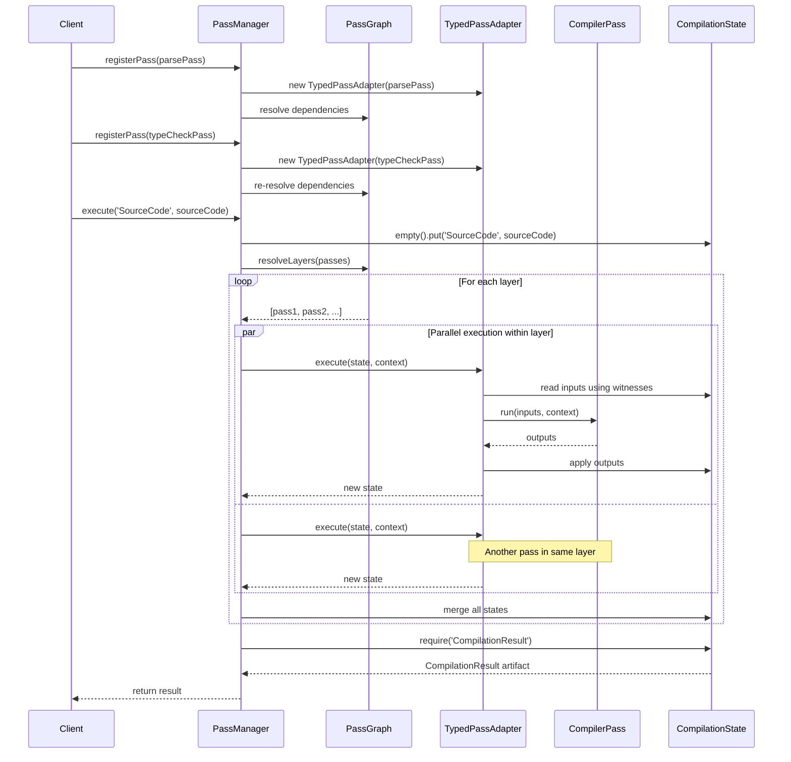

# Compiler Pass System Module

## Pendahuluan

Folder `compiler/passes` berisi implementasi **Pass System** yang merupakan jantung dari arsitektur compiler RouteSync. Pass system menyediakan infrastructure untuk menjalankan transformasi multi-stage pada artifacts dengan type safety, dependency resolution otomatis, dan support untuk parallel execution.

### Apa itu Pass System?

Pass system adalah framework untuk mengorganisir compiler operations sebagai series of independent transformations (passes). Setiap pass:

1. **Menerima Input Artifacts**: Artifacts yang dihasilkan oleh passes sebelumnya
2. **Melakukan Transformasi**: Type checking, optimization, code generation, dll.
3. **Menghasilkan Output Artifacts**: Artifacts baru untuk consumed oleh passes berikutnya

Pass system RouteSync mengimplementasikan **typed, artifact-based compilation pipeline** dengan fitur advanced:

- **Type-Safe Pass Definitions**: Input/output artifacts dengan type witnesses
- **Automatic Dependency Resolution**: Topological sorting berdasarkan artifact dependencies
- **Parallel Execution**: Wave-based execution untuk passes yang independent
- **Incremental Compilation**: Caching artifacts berdasarkan fingerprints
- **Immutable State**: Functional approach untuk compilation state


### Peran Pass System dalam Pipeline Compiler

```
Source Code → Parser → AST
                        ↓
            [Pass System Execution]
                        ↓
        Pass 1: Semantic Analysis
                        ↓
        Pass 2: Type Checking
                        ↓
        Pass 3: IR Generation
                        ↓
        Pass 4: Optimization
                        ↓
        Pass 5: Code Emission
                        ↓
            Generated Output
```

Pass system berada di core compilation pipeline, mengkoordinasikan eksekusi semua compiler passes dari semantic analysis sampai code generation.

**Mengapa Pass System Diperlukan?**

1. **Modularity**: Setiap pass fokus pada satu transformasi
2. **Composability**: Passes dapat di-compose dengan flexible order
3. **Testability**: Setiap pass dapat di-test secara isolated
4. **Performance**: Parallel execution untuk independent passes
5. **Incrementality**: Caching artifacts untuk avoid redundant work
6. **Type Safety**: Compile-time guarantees untuk artifact compatibility


## Arsitektur

Pass system menggunakan **typed artifact-based architecture** dengan dependency injection pattern:

### File Structure

```
compiler/passes/
├── CompilerPass.ts           # Typed pass interface
├── ExecutablePass.ts         # Runtime pass interface
├── TypedPassAdapter.ts       # Adapter untuk typed → executable
├── PassDescriptor.ts         # Input/output specification
├── PassDependency.ts         # (Part of PassDescriptor)
├── PassManager.ts            # Pipeline orchestrator
├── PassGraph.ts              # Dependency resolution algorithms
├── CompilationState.ts       # Immutable artifact container
├── CompilationContext.ts     # Compilation environment
├── ArtifactKeyWitness.ts     # Type witnesses untuk artifacts
├── PassResult.ts             # Pass execution results
├── ResponseAnalysisPass.ts   # Concrete pass example
└── index.ts                  # Public exports
```


### 1. CompilerPass.ts

**Purpose:** Mendefinisikan typed interface untuk compiler passes

**Interface:**
```typescript
export interface CompilerPass<
    I extends readonly ArtifactKey[],
    O extends readonly ArtifactKey[]
> {
    readonly name: string;
    readonly inputWitnesses: { [K in keyof I]: ArtifactKeyWitness<I[K]> };
    readonly outputKeys: O;
    readonly descriptor: PassDescriptor;
    readonly requires: readonly PassDependency[];
    readonly producesPass: readonly string[];
    
    run(
        inputs: ResolveArtifacts<I>,
        context: CompilationContext
    ): ResolveArtifacts<O> | Promise<ResolveArtifacts<O>>;
}
```

**Type Parameters:**
- `I`: Tuple of input artifact keys (e.g., `['AST', 'TypeEnvironment']`)
- `O`: Tuple of output artifact keys (e.g., `['TypedAST']`)

**Properties:**
- `name`: Unique identifier untuk pass
- `inputWitnesses`: Type witnesses yang membuktikan input artifact types
- `outputKeys`: Keys dari artifacts yang dihasilkan
- `descriptor`: Deklarasi consumes/produces artifacts
- `requires`: Dependencies pada artifacts atau passes lain
- `producesPass`: Names of passes yang produced by this pass (ordering)

**Method:**
- `run()`: Main transformation logic, menerima typed inputs dan returns typed outputs

**Design Rationale:**

CompilerPass adalah **typed interface** yang provides compile-time safety:

```typescript
// Compiler knows input types
const parsePass: CompilerPass<['SourceCode'], ['AST']> = {
    run: (inputs) => {
        const [sourceCode] = inputs; // Type: SourceCode
        // sourceCode. ← TypeScript autocomplete works!
        return [ast]; // Type checked: must return AST
    }
};
```


### 2. ExecutablePass.ts

**Purpose:** Runtime interface untuk passes yang dapat dieksekusi oleh PassManager

**Interface:**
```typescript
export interface ExecutablePass {
    readonly name: string;
    readonly descriptor: PassDescriptor;
    readonly requires: readonly PassDependency[];
    
    execute(
        state: CompilationState,
        context: CompilationContext,
        cache?: ArtifactCache
    ): Promise<CompilationState>;
}
```

**Properties:**
- `name`: Unique pass identifier
- `descriptor`: Input/output artifact specification
- `requires`: Pass dependencies

**Method:**
- `execute()`: Performs transformation, menerima state dan returns new state

**Differences from CompilerPass:**

| Aspect | CompilerPass | ExecutablePass |
|--------|--------------|----------------|
| Type Safety | Compile-time typed | Runtime dynamic |
| Input/Output | Typed tuples | CompilationState |
| Marshalling | Automatic via adapter | Manual |
| Caching | Handled by adapter | Manual |
| Target Use | Pass authors | Runtime execution |

ExecutablePass adalah **runtime abstraction** yang uniform interface untuk PassManager terlepas dari underlying implementation.


### 3. TypedPassAdapter.ts

**Purpose:** Adapts typed CompilerPass ke ExecutablePass interface

**Class:**
```typescript
export class TypedPassAdapter<
    I extends readonly ArtifactKey[],
    O extends readonly ArtifactKey[]
> implements ExecutablePass {
    constructor(private readonly pass: CompilerPass<I, O>);
    
    execute(
        state: CompilationState,
        context: CompilationContext,
        cache?: ArtifactCache
    ): Promise<CompilationState>;
}
```

**Responsibilities:**
1. **Artifact Marshalling**: Extract typed inputs dari CompilationState
2. **Pass Execution**: Call underlying typed pass dengan correct types
3. **State Update**: Apply typed outputs ke CompilationState
4. **Caching**: Implement incremental compilation logic
5. **Fingerprinting**: Generate cache keys dari inputs dan compiler options

**Implementation Flow:**

```typescript
async execute(state, context, cache?) {
    // 1. Marshall inputs using witnesses
    const inputs = readArtifacts(this.pass.inputWitnesses, state);
    
    // 2. Check cache (if enabled)
    if (cache) {
        const descriptor = buildCacheDescriptor(inputs, context);
        const cached = cache.get(descriptor);
        if (cached) return applyOutputs(state, cached);
    }
    
    // 3. Execute underlying pass
    const outputs = await this.pass.run(inputs, context);
    
    // 4. Update state
    const nextState = applyOutputs(state, outputs);
    
    // 5. Store in cache
    if (cache) {
        cache.set(descriptor, outputs);
    }
    
    return nextState;
}
```

**Benefits:**
- Pass authors write typed passes (better DX)
- PassManager works dengan uniform ExecutablePass interface
- Caching logic centralized (tidak perlu per-pass)
- Type safety preserved dengan witnesses


### 4. PassDescriptor.ts

**Purpose:** Describes input/output artifacts untuk dependency resolution

**Interfaces:**
```typescript
export interface PassDescriptor {
    readonly consumes: readonly ArtifactKey[];
    readonly produces: readonly ArtifactKey[];
}

export interface PassDependency {
    readonly producer?: string;
    readonly artifact: ArtifactKey;
}
```

**PassDescriptor Properties:**
- `consumes`: Artifact keys yang required sebagai input
- `produces`: Artifact keys yang generated sebagai output

**PassDependency Properties:**
- `artifact`: Required artifact key
- `producer`: Optional specific producer name

**Usage Example:**
```typescript
const typeCheckPass: CompilerPass<['AST'], ['TypedAST', 'TypeErrors']> = {
    descriptor: {
        consumes: ['AST'],
        produces: ['TypedAST', 'TypeErrors']
    },
    requires: [
        { artifact: 'AST' } // Just need AST, any producer OK
    ]
};

const optimizePass: CompilerPass<['TypedAST'], ['OptimizedAST']> = {
    descriptor: {
        consumes: ['TypedAST'],
        produces: ['OptimizedAST']
    },
    requires: [
        { artifact: 'TypedAST', producer: 'TypeCheckPass' } // Specific producer
    ]
};
```

PassDescriptor digunakan oleh PassGraph untuk:
- Build dependency graph
- Detect cycles
- Compute execution order
- Validate artifact availability


### 5. PassManager.ts

**Purpose:** Orchestrates pass registration dan pipeline execution

**Class:**
```typescript
export class PassManager {
    constructor(
        private readonly externalInputs: readonly ArtifactKey[] = []
    );
    
    registerPass<I, O>(pass: CompilerPass<I, O>): void;
    
    execute<K>(
        key: K,
        initialInput: ArtifactRegistry[K]
    ): Promise<CompilationResult>;
}
```

**Constructor:**
- `externalInputs`: Artifact keys yang provided externally (bukan by passes)

**Methods:**

#### `registerPass(pass)`

Registers typed compiler pass dan automatically adapts ke ExecutablePass:

```typescript
const manager = new PassManager(['SourceCode']);
manager.registerPass(parsePass);       // Auto-adapted
manager.registerPass(typeCheckPass);   // Auto-adapted
manager.registerPass(codeGenPass);     // Auto-adapted
```

Setelah registration, passes di-sort berdasarkan dependencies.

#### `execute(key, initialInput)`

Executes compilation pipeline:

**Execution Strategy:**

1. **Initialize State**: Create CompilationState dengan initial input
2. **Create Context**: Setup DiagnosticBag, file system, options
3. **Resolve Layers**: Compute parallel execution waves
4. **Execute Sequentially**: Run each layer dalam order
5. **Parallel Within Layer**: Passes dalam layer run concurrently
6. **Merge Results**: Combine outputs dari all passes dalam layer
7. **Extract Result**: Return final CompilationResult artifact

**Example Execution:**

```typescript
const result = await manager.execute('SourceCode', sourceCode);

// Internally:
// Layer 1: [ParsePass] → produces AST
// Layer 2: [TypeCheckPass, SymbolPass] → parallel, both consume AST
// Layer 3: [OptimizePass] → consumes TypedAST dari TypeCheckPass
// Layer 4: [CodeGenPass] → consumes OptimizedAST
```


### 6. PassGraph.ts

**Purpose:** Implements dependency resolution dan topological sorting algorithms

**Class:**
```typescript
export class PassGraph {
    static buildAdjacency(
        passes: readonly ExecutablePass[]
    ): Map<ArtifactKey, Set<ExecutablePass>>;
    
    static resolve(
        passes: readonly ExecutablePass[],
        externalInputs: readonly ArtifactKey[]
    ): readonly ExecutablePass[];
    
    static resolveLayers(
        passes: readonly ExecutablePass[],
        externalInputs: readonly ArtifactKey[]
    ): readonly (readonly ExecutablePass[])[];
}
```

**Static Methods:**

#### `buildAdjacency(passes)`

Builds adjacency map dari artifact keys ke passes yang consume them:

```typescript
const adj = PassGraph.buildAdjacency(passes);

// adj.get('AST') → Set(TypeCheckPass, OptimizePass, AnalyzePass)
// adj.get('TypedAST') → Set(CodeGenPass)
```

**Used internally** untuk dependency resolution algorithms.

#### `resolve(passes, externalInputs)`

Computes **topologically-sorted linear execution order** menggunakan Kahn's algorithm:

**Algorithm:**
1. Build producer map (detect duplicate producers)
2. Validate all consumed artifacts have providers
3. Compute indegree (# of internal dependencies) untuk each pass
4. Topological sort using Kahn's algorithm
5. Detect cycles jika sort incomplete

**Returns:** Array of passes dalam valid execution order

**Throws:**
- Error jika cycle detected
- Error jika duplicate producers
- Error jika missing providers

**Example:**
```typescript
const sorted = PassGraph.resolve(
    [codeGenPass, typeCheckPass, parsePass, optimizePass],
    ['SourceCode']
);

// Result: [parsePass, typeCheckPass, optimizePass, codeGenPass]
// Valid execution order respecting dependencies
```

#### `resolveLayers(passes, externalInputs)`

Computes **wave-based parallel execution layers**:

**Algorithm:**
1. Compute indegree untuk each pass
2. Find all passes dengan indegree 0 (layer 1)
3. Remove layer passes, decrement indegrees
4. Repeat until all passes assigned
5. Detect cycles jika any pass remains

**Returns:** Array of layers, dimana each layer adalah array of concurrent passes

**Example:**
```typescript
const layers = PassGraph.resolveLayers(passes, ['SourceCode']);

// Layer 1: [ParsePass] → only depends on external input
// Layer 2: [TypeCheckPass, SymbolPass] → both depend on AST, can run parallel
// Layer 3: [OptimizePass] → depends on TypedAST
// Layer 4: [CodeGenPass] → depends on OptimizedAST
```

**Benefits:**
- Maximize parallelism
- Minimize total execution time
- Guarantee correctness (dependencies respected)


### 7. CompilationState.ts

**Purpose:** Immutable container untuk accumulated artifacts

**Class:**
```typescript
export class CompilationState {
    static empty(): CompilationState;
    
    put<K>(key: K, value: ArtifactRegistry[K]): CompilationState;
    merge(other: CompilationState): CompilationState;
    require<K>(witness: ArtifactKeyWitness<K>): ArtifactRegistry[K];
}
```

**Methods:**

#### `static empty()`

Creates empty compilation state:

```typescript
const state = CompilationState.empty();
// No artifacts yet
```

#### `put(key, value)`

Returns **new state** dengan additional artifact:

```typescript
const state1 = CompilationState.empty();
const state2 = state1.put('AST', astArtifact);
const state3 = state2.put('TypedAST', typedAstArtifact);

// state1, state2, state3 all different objects (immutable)
```

#### `merge(other)`

Returns **new state** dengan artifacts merged dari another state:

```typescript
const stateA = state.put('AST', ast);
const stateB = state.put('Symbols', symbols);
const merged = stateA.merge(stateB);

// merged contains both AST and Symbols
```

#### `require(witness)`

Retrieves required artifact, **throws jika not present**:

```typescript
const ast = state.require(new ArtifactKeyWitness('AST'));
// Returns AST artifact or throws Error
```

**Design: Immutability**

CompilationState adalah **fully immutable**:

```typescript
// ❌ BAD: Cannot mutate
state.artifacts['AST'] = newAst; // Compile error

// ✅ GOOD: Create new state
const newState = state.put('AST', newAst);
```

**Benefits:**
- Thread-safe (concurrent pass execution)
- Easy to debug (state history preserved)
- Functional programming style
- Time-travel debugging possible


### 8. CompilationContext.ts

**Purpose:** Encapsulates compilation environment dan configuration

**Class:**
```typescript
export class CompilationContext {
    constructor(
        public readonly diagnostics: DiagnosticBag,
        public readonly fileSystem: VirtualFileSystem,
        public readonly options: CompilerOptions
    );
    
    getFingerprint(): CompilerFingerprint;
    static default(): CompilationContext;
}
```

**Properties:**
- `diagnostics`: DiagnosticBag untuk collecting errors/warnings
- `fileSystem`: VirtualFileSystem abstraction untuk I/O
- `options`: CompilerOptions controlling behavior

**CompilerOptions:**
```typescript
interface CompilerOptions {
    readonly watch: boolean;           // Watch mode
    readonly strict: boolean;          // Strict checking
    readonly compilerVersion?: string;
    readonly parserVersion?: string;
    readonly phpVersion?: string;
    readonly frameworkVersion?: string;
    readonly targetBackend?: string;
    readonly featureFlags?: ReadonlyMap<string, boolean>;
}
```

**VirtualFileSystem:**
```typescript
interface VirtualFileSystem {
    readFile(path: string): string;
    writeFile(path: string, content: string): void;
    snapshot(): readonly FileSnapshot[];
}
```

**Methods:**

#### `getFingerprint()`

Returns compiler fingerprint untuk caching and invalidation:

```typescript
const fingerprint = context.getFingerprint();

// Fingerprint captures:
// - Compiler/parser/PHP/framework versions
// - Target backend
// - Strict mode setting
// - Feature flags

// Used for cache key generation
```

#### `static default()`

Creates default context untuk testing atau simple use cases:

```typescript
const context = CompilationContext.default();
// - Empty diagnostics
// - No-op file system
// - Default options (watch: false, strict: true)
```

**Usage dalam Passes:**

```typescript
const pass: CompilerPass<['AST'], ['TypedAST']> = {
    run: ([ast], context) => {
        // Access diagnostics
        if (invalidNode) {
            context.diagnostics.add({
                severity: 'error',
                message: 'Type error',
                location: node.location
            });
        }
        
        // Check options
        if (context.options.strict) {
            // Perform strict checking
        }
        
        // Access file system
        const content = context.fileSystem.readFile('config.json');
        
        return [typedAst];
    }
};
```


### 9. ArtifactKeyWitness.ts

**Purpose:** Type witnesses untuk compile-time artifact type safety

**Type:**
```typescript
export class ArtifactKeyWitness<K extends ArtifactKey> {
    constructor(public readonly key: K);
}

export type ResolveArtifacts<Keys extends readonly ArtifactKey[]> = {
    [I in keyof Keys]: Keys[I] extends ArtifactKey
        ? ArtifactRegistry[Keys[I]]
        : never;
};
```

**Functions:**
```typescript
export function readArtifacts<I extends readonly ArtifactKey[]>(
    witnesses: { [K in keyof I]: ArtifactKeyWitness<I[K]> },
    state: CompilationState
): ResolveArtifacts<I>;

export function tupleAt<T extends readonly unknown[], I extends number>(
    tuple: T,
    index: I
): T[I];
```

**Purpose:**

ArtifactKeyWitness provides **compile-time type safety** untuk artifact access:

```typescript
// Without witness (unsafe)
const ast = state.get('AST'); // Type: any

// With witness (type-safe)
const witness = new ArtifactKeyWitness('AST');
const ast = state.require(witness); // Type: AST artifact
```

**Usage dalam Pass Definition:**

```typescript
const typeCheckPass: CompilerPass<['AST'], ['TypedAST']> = {
    inputWitnesses: [
        new ArtifactKeyWitness('AST')
    ],
    outputKeys: ['TypedAST'],
    
    run: ([ast], context) => {
        // ast: AST (correctly typed!)
        // ast. ← TypeScript autocomplete works
        
        const typedAst = performTypeChecking(ast);
        return [typedAst]; // Must match ['TypedAST']
    }
};
```

**Type Magic:**

`ResolveArtifacts` transforms artifact key tuple ke artifact type tuple:

```typescript
type Keys = ['AST', 'Symbols', 'TypeEnv'];
type Resolved = ResolveArtifacts<Keys>;
// Resolved = [AST, Symbols, TypeEnvironment]

// Compiler can check input/output types match!
```


### 10. PassResult.ts

**Purpose:** Result types untuk pass execution

**Types:**
```typescript
export class AnalysisKey<T> {
    constructor(readonly name: string);
}

export interface PassResult {
    readonly changed: boolean;
    readonly preservedAnalyses: ReadonlySet<AnalysisKey<unknown>>;
    readonly diagnostics?: DiagnosticBag;
}
```

**AnalysisKey:**

Type-safe key untuk identifying analysis results:

```typescript
const CFGKey = new AnalysisKey<ControlFlowGraph>('CFG');
const DominatorsKey = new AnalysisKey<DominatorTree>('Dominators');
```

**PassResult:**

Describes pass execution outcome:

```typescript
const result: PassResult = {
    changed: true,                       // IR modified?
    preservedAnalyses: new Set([CFGKey]), // Which analyses still valid?
    diagnostics: diagnosticBag           // Errors/warnings
};
```

**Use Case:**

PassResult digunakan untuk **invalidation tracking**:

```typescript
// Pass modifies IR
const result1 = optimizePass.run(ir);
if (result1.changed) {
    // Invalidate all analyses not in preservedAnalyses
    analysisManager.invalidateExcept(result1.preservedAnalyses);
}

// Pass doesn't modify IR
const result2 = analysisPass.run(ir);
if (!result2.changed) {
    // All existing analyses still valid
}
```

**Analysis Preservation:**

Passes declare which analyses they preserve:

```typescript
// Optimization pass that preserves CFG
const licmPass: OptimizationPass = {
    run: (ir) => {
        // Perform LICM optimization
        return {
            changed: true,
            preservedAnalyses: new Set([
                CFGKey,           // CFG unchanged
                DominatorsKey     // Dominators unchanged
            ])
        };
    }
};

// Pass that invalidates everything
const inliningPass: OptimizationPass = {
    run: (ir) => {
        return {
            changed: true,
            preservedAnalyses: new Set() // Nothing preserved
        };
    }
};
```


## Cara Kerja

### Input: Initial Artifact

Pass system dimulai dengan initial artifact yang provided externally:

```typescript
const manager = new PassManager(['SourceCode']);

// Initial input artifact
const sourceCode: SourceCode = {
    content: readFileSync('main.php', 'utf-8'),
    metadata: { hash: computeHash(...) }
};

// Execute pipeline
const result = await manager.execute('SourceCode', sourceCode);
```

### Processing: Multi-Stage Transformation

Pass system executes registered passes dalam topologically-sorted order:

**Stage 1: Dependency Resolution**

```typescript
manager.registerPass(parsePass);
manager.registerPass(typeCheckPass);
manager.registerPass(optimizePass);
manager.registerPass(codeGenPass);

// PassGraph automatically determines execution order
// Result: [parsePass, typeCheckPass, optimizePass, codeGenPass]
```

**Stage 2: Layer Computation**

```typescript
const layers = PassGraph.resolveLayers(passes, ['SourceCode']);

// Layer 1: [ParsePass]
// Layer 2: [TypeCheckPass, SymbolPass] ← parallel
// Layer 3: [OptimizePass]
// Layer 4: [CodeGenPass]
```

**Stage 3: Sequential Layer Execution**

```typescript
for (const layer of layers) {
    // Execute passes dalam layer concurrently
    const results = await Promise.all(
        layer.map(pass => pass.execute(state, context))
    );
    
    // Merge results
    for (const result of results) {
        state = state.merge(result);
    }
}
```


### Output: CompilationResult

Pass system menghasilkan final CompilationResult artifact:

```typescript
const result: CompilationResult = await manager.execute('SourceCode', sourceCode);

// CompilationResult contains:
// - Generated output code
// - Diagnostics (errors/warnings)
// - Metadata (timing, statistics)
```

### Lifecycle Diagram




### Interaksi dengan Komponen Lain

#### 1. Artifact System

Pass system **depends heavily** pada artifact system:

```typescript
// Artifacts define what passes exchange
import type { ArtifactRegistry, ArtifactKey } from '../artifacts/types';

// Passes produce and consume artifacts
const pass: CompilerPass<['AST'], ['TypedAST']> = {
    descriptor: {
        consumes: ['AST'],      // From artifact registry
        produces: ['TypedAST']  // To artifact registry
    }
};
```

**Data Flow:**
```
Artifact Registry ← Pass reads input artifacts
                 ↓
              Pass execution
                 ↓
Artifact Registry ← Pass writes output artifacts
```

#### 2. Cache System

TypedPassAdapter integrates dengan caching:

```typescript
import type { ArtifactCache } from '../cache/ArtifactCache';

const adapter = new TypedPassAdapter(pass);
const cache: ArtifactCache = createCache();

// Cache automatically used during execution
const result = await adapter.execute(state, context, cache);
```

**Caching Strategy:**
- Cache key: Pass name + input hashes + compiler fingerprint
- Cache hit: Skip pass execution, return cached outputs
- Cache miss: Execute pass, store outputs

#### 3. Diagnostics System

Passes collect diagnostics via CompilationContext:

```typescript
const pass: CompilerPass<I, O> = {
    run: ([input], context) => {
        // Report errors
        context.diagnostics.add({
            severity: 'error',
            message: 'Type mismatch',
            location: node.location
        });
        
        // Report warnings
        context.diagnostics.add({
            severity: 'warning',
            message: 'Unused variable',
            location: varDecl.location
        });
        
        return [output];
    }
};
```

#### 4. Fingerprinting System

Fingerprints used untuk cache invalidation:

```typescript
import { computeFingerprintHash } from '../fingerprint/Fingerprint';

// Fingerprint includes:
// - Compiler version
// - Parser version
// - PHP version
// - Framework version
// - Target backend
// - Compiler options

const hash = computeFingerprintHash(context.getFingerprint());
// Used as part of cache key
```


## Cara Penggunaan

### Membuat Simple Pass

**Step 1: Define Input/Output Types**

```typescript
import type { CompilerPass } from '@routesync/core/compiler/passes';
import { ArtifactKeyWitness } from '@routesync/core/compiler/passes';

// Pass: AST → TypedAST
const typeCheckPass: CompilerPass<['AST'], ['TypedAST']> = {
    name: 'TypeCheckPass',
    
    // Type witnesses for inputs
    inputWitnesses: [
        new ArtifactKeyWitness('AST')
    ],
    
    // Output artifact keys
    outputKeys: ['TypedAST'],
    
    // Descriptor for dependency resolution
    descriptor: {
        consumes: ['AST'],
        produces: ['TypedAST']
    },
    
    // Dependencies
    requires: [
        { artifact: 'AST' }
    ],
    
    // Produces passes (for ordering)
    producesPass: [],
    
    // Main transformation logic
    run: ([ast], context) => {
        // Perform type checking
        const typedAst = performTypeChecking(ast, context);
        
        // Report errors if any
        if (typedAst.errors.length > 0) {
            for (const error of typedAst.errors) {
                context.diagnostics.add({
                    severity: 'error',
                    message: error.message,
                    location: error.location
                });
            }
        }
        
        return [typedAst];
    }
};
```

**Step 2: Register dengan PassManager**

```typescript
const manager = new PassManager(['SourceCode']);

// Register passes in any order
manager.registerPass(typeCheckPass);
manager.registerPass(parsePass);
manager.registerPass(codeGenPass);

// PassGraph automatically sorts them
```

**Step 3: Execute Pipeline**

```typescript
const sourceCode = { content: '...' };
const result = await manager.execute('SourceCode', sourceCode);

console.log(result.output);
console.log(result.diagnostics);
```


### Membuat Pass dengan Multiple Inputs

```typescript
// Pass: AST + Symbols → TypedAST
const typeCheckWithSymbolsPass: CompilerPass<
    ['AST', 'Symbols'],
    ['TypedAST']
> = {
    name: 'TypeCheckWithSymbolsPass',
    
    inputWitnesses: [
        new ArtifactKeyWitness('AST'),
        new ArtifactKeyWitness('Symbols')
    ],
    
    outputKeys: ['TypedAST'],
    
    descriptor: {
        consumes: ['AST', 'Symbols'],
        produces: ['TypedAST']
    },
    
    requires: [
        { artifact: 'AST' },
        { artifact: 'Symbols' }
    ],
    
    producesPass: [],
    
    run: ([ast, symbols], context) => {
        // Both ast and symbols are correctly typed!
        const typedAst = typeCheckWithSymbols(ast, symbols);
        return [typedAst];
    }
};
```

### Membuat Pass dengan Multiple Outputs

```typescript
// Pass: SourceCode → AST + Symbols + Errors
const parseAndAnalyzePass: CompilerPass<
    ['SourceCode'],
    ['AST', 'Symbols', 'ParseErrors']
> = {
    name: 'ParseAndAnalyzePass',
    
    inputWitnesses: [
        new ArtifactKeyWitness('SourceCode')
    ],
    
    outputKeys: ['AST', 'Symbols', 'ParseErrors'],
    
    descriptor: {
        consumes: ['SourceCode'],
        produces: ['AST', 'Symbols', 'ParseErrors']
    },
    
    requires: [
        { artifact: 'SourceCode' }
    ],
    
    producesPass: [],
    
    run: ([sourceCode], context) => {
        // Parse source code
        const ast = parse(sourceCode);
        
        // Build symbol table
        const symbols = buildSymbolTable(ast);
        
        // Collect errors
        const errors = collectParseErrors(ast);
        
        // Return all three outputs
        return [ast, symbols, errors];
    }
};
```


### Membuat Async Pass

```typescript
const remoteValidationPass: CompilerPass<
    ['TypedAST'],
    ['ValidatedAST']
> = {
    name: 'RemoteValidationPass',
    
    inputWitnesses: [new ArtifactKeyWitness('TypedAST')],
    outputKeys: ['ValidatedAST'],
    
    descriptor: {
        consumes: ['TypedAST'],
        produces: ['ValidatedAST']
    },
    
    requires: [{ artifact: 'TypedAST' }],
    producesPass: [],
    
    // Async run method
    run: async ([typedAst], context) => {
        // Perform async operation
        const validationResult = await validateRemotely(typedAst);
        
        const validatedAst = {
            ...typedAst,
            validationResult
        };
        
        return [validatedAst];
    }
};
```

### Pass dengan Specific Producer Dependency

```typescript
const optimizePass: CompilerPass<['TypedAST'], ['OptimizedAST']> = {
    name: 'OptimizePass',
    
    inputWitnesses: [new ArtifactKeyWitness('TypedAST')],
    outputKeys: ['OptimizedAST'],
    
    descriptor: {
        consumes: ['TypedAST'],
        produces: ['OptimizedAST']
    },
    
    // Require TypedAST specifically from TypeCheckPass
    requires: [
        {
            artifact: 'TypedAST',
            producer: 'TypeCheckPass' // Specific producer!
        }
    ],
    
    producesPass: [],
    
    run: ([typedAst], context) => {
        const optimized = optimize(typedAst);
        return [optimized];
    }
};
```


## Panduan Pengembangan

### Kapan Membuat Pass Baru

Buat pass baru ketika:

1. **New Transformation Stage**: Need to add new analysis atau transformation step
```typescript
// Example: Add constant folding optimization
const constantFoldingPass: CompilerPass<['AST'], ['OptimizedAST']>;
```

2. **Independent Concerns**: Separate concerns yang dapat di-test independently
```typescript
// Instead of one monolithic pass:
const hugePass: CompilerPass<['Source'], ['Everything']>; // ❌

// Create focused passes:
const parsePass: CompilerPass<['Source'], ['AST']>; // ✅
const typeCheckPass: CompilerPass<['AST'], ['TypedAST']>; // ✅
const optimizePass: CompilerPass<['TypedAST'], ['OptimizedAST']>; // ✅
```

3. **Parallel Opportunities**: Enable parallel execution
```typescript
// These can run in parallel (both consume AST):
const typeCheckPass: CompilerPass<['AST'], ['TypedAST']>;
const symbolPass: CompilerPass<['AST'], ['Symbols']>;
```

4. **Reusable Analysis**: Create analysis passes yang reusable
```typescript
const cfgAnalysisPass: CompilerPass<['IR'], ['CFG']>;
// CFG can be used by multiple optimization passes
```

### Best Practices

#### 1. Single Responsibility

Each pass should have **one clear purpose**:

```typescript
// ✅ GOOD: Focused responsibility
const parsePass: CompilerPass<['Source'], ['AST']> = {
    name: 'ParsePass',
    run: ([source], context) => {
        const ast = parse(source.content);
        return [ast];
    }
};

// ❌ BAD: Multiple responsibilities
const parseAndOptimizePass: CompilerPass<['Source'], ['OptimizedAST']> = {
    run: ([source], context) => {
        const ast = parse(source);
        const typed = typeCheck(ast);
        const optimized = optimize(typed);
        return [optimized]; // Too much in one pass!
    }
};
```

#### 2. Immutable Transformations

Never mutate input artifacts:

```typescript
// ✅ GOOD: Create new artifact
const pass: CompilerPass<['AST'], ['TransformedAST']> = {
    run: ([ast], context) => {
        const transformed = transformAST(ast); // New object
        return [transformed];
    }
};

// ❌ BAD: Mutate input
const pass: CompilerPass<['AST'], ['AST']> = {
    run: ([ast], context) => {
        ast.nodes.push(newNode); // Mutation!
        return [ast];
    }
};
```

#### 3. Type Witnesses for All Inputs

Always use type witnesses untuk type safety:

```typescript
// ✅ GOOD: Type witnesses provided
const pass: CompilerPass<['AST', 'Symbols'], ['TypedAST']> = {
    inputWitnesses: [
        new ArtifactKeyWitness('AST'),
        new ArtifactKeyWitness('Symbols')
    ],
    run: ([ast, symbols], context) => {
        // ast and symbols correctly typed!
        return [typeCheck(ast, symbols)];
    }
};
```

#### 4. Declare All Dependencies

Explicitly declare all artifact dependencies:

```typescript
const pass: CompilerPass<['TypedAST'], ['OptimizedAST']> = {
    descriptor: {
        consumes: ['TypedAST'], // All inputs declared
        produces: ['OptimizedAST'] // All outputs declared
    },
    requires: [
        { artifact: 'TypedAST' } // Dependency declared
    ]
};
```


### Anti-Patterns

#### ❌ Anti-Pattern 1: Stateful Passes

```typescript
// BAD: Mutable state dalam pass
class StatefulPass implements CompilerPass<['AST'], ['TypedAST']> {
    private cache = new Map(); // ❌ Mutable state!
    
    run([ast], context) {
        this.cache.set(ast.id, ast); // Side effect!
        return [typedAst];
    }
}

// GOOD: Stateless pass
const statelessPass: CompilerPass<['AST'], ['TypedAST']> = {
    run: ([ast], context) => {
        // Pure function, no side effects
        const typedAst = typeCheck(ast);
        return [typedAst];
    }
};
```

#### ❌ Anti-Pattern 2: Direct State Mutation

```typescript
// BAD: Mutate compilation state
const pass: CompilerPass<['AST'], ['AST']> = {
    run: ([ast], context) => {
        state.put('AST', modifiedAst); // ❌ Can't access state here!
        return [ast];
    }
};

// GOOD: Return new artifacts
const pass: CompilerPass<['AST'], ['ModifiedAST']> = {
    run: ([ast], context) => {
        const modified = modify(ast);
        return [modified]; // PassManager handles state update
    }
};
```

#### ❌ Anti-Pattern 3: Hidden Dependencies

```typescript
// BAD: Hidden file I/O dependency
const pass: CompilerPass<['AST'], ['TypedAST']> = {
    run: ([ast], context) => {
        const config = JSON.parse(fs.readFileSync('config.json')); // ❌ Hidden!
        return [typeCheck(ast, config)];
    }
};

// GOOD: Explicit dependency via artifact
const pass: CompilerPass<['AST', 'Config'], ['TypedAST']> = {
    descriptor: {
        consumes: ['AST', 'Config'],
        produces: ['TypedAST']
    },
    run: ([ast, config], context) => {
        return [typeCheck(ast, config)];
    }
};
```

#### ❌ Anti-Pattern 4: Cyclic Dependencies

```typescript
// BAD: Circular dependency
const passA: CompilerPass<['ArtifactB'], ['ArtifactA']> = {
    descriptor: {
        consumes: ['ArtifactB'],
        produces: ['ArtifactA']
    }
};

const passB: CompilerPass<['ArtifactA'], ['ArtifactB']> = {
    descriptor: {
        consumes: ['ArtifactA'], // ❌ Depends on PassA output!
        produces: ['ArtifactB']
    }
};
// PassGraph.resolve() will throw "Compiler pass cycle detected"

// GOOD: Linear dependency chain
const passA: CompilerPass<['Input'], ['ArtifactA']>;
const passB: CompilerPass<['ArtifactA'], ['ArtifactB']>;
const passC: CompilerPass<['ArtifactB'], ['Output']>;
```


### Konvensi Penamaan

#### Pass Names

**Pattern:** `{Purpose}Pass`

```typescript
// ✅ GOOD
ParsePass
TypeCheckPass
OptimizationPass
CodeGenerationPass
SemanticAnalysisPass

// ❌ BAD
Parser
DoTypeChecking
OptimizeCode
Gen
```

#### Artifact Keys

**Pattern:** `PascalCase` descriptive names

```typescript
// ✅ GOOD
'AST'
'TypedAST'
'OptimizedIR'
'SymbolTable'
'CompilationResult'

// ❌ BAD
'ast'
'typed_ast'
'ir-optimized'
'symbols'
```

#### Method Names

**Pattern:** Descriptive verbs

```typescript
// ✅ GOOD
run(inputs, context)
execute(state, context)
resolve(passes)
buildAdjacency(passes)

// ❌ BAD
do(inputs, context)
process(state, context)
sort(passes)
```


### Prinsip Modular dan Extensible

#### 1. Composition Over Inheritance

Compose passes daripada inherit:

```typescript
// ✅ GOOD: Composition
const fullPipeline = [
    parsePass,
    typeCheckPass,
    optimizePass,
    codeGenPass
];

manager.registerPass(parsePass);
manager.registerPass(typeCheckPass);
// etc.

// ❌ BAD: Inheritance
class TypeCheckPass extends BasePass {
    // Rigid hierarchy
}
```

#### 2. Plugin Architecture

Passes sebagai plugins:

```typescript
// Pass dapat di-add/remove tanpa modify core
function createOptimizationPipeline(enableAdvanced: boolean) {
    const passes = [
        constantFoldingPass,
        deadCodeEliminationPass
    ];
    
    if (enableAdvanced) {
        passes.push(inliningPass);
        passes.push(loopOptimizationPass);
    }
    
    return passes;
}
```

#### 3. Dependency Injection

Inject dependencies via artifacts:

```typescript
// ✅ GOOD: DI via artifacts
const pass: CompilerPass<['Config', 'AST'], ['TypedAST']> = {
    run: ([config, ast], context) => {
        // Config injected as artifact
        return [typeCheck(ast, config)];
    }
};

// ❌ BAD: Hardcoded dependencies
const pass: CompilerPass<['AST'], ['TypedAST']> = {
    run: ([ast], context) => {
        const config = globalConfig; // ❌ Global dependency
        return [typeCheck(ast, config)];
    }
};
```


## Struktur Folder

### Ringkasan File

```
compiler/passes/
├── CompilerPass.ts           # 60 lines - Typed pass interface
│                             # - Generic type parameters for I/O
│                             # - Type witnesses for inputs
│                             # - run() method signature
│
├── ExecutablePass.ts         # 45 lines - Runtime pass interface
│                             # - execute() method
│                             # - PassDescriptor reference
│                             # - Cache integration
│
├── TypedPassAdapter.ts       # 120 lines - Typed → Executable adapter
│                             # - Artifact marshalling
│                             # - Pass execution
│                             # - Cache management
│                             # - Fingerprinting
│
├── PassDescriptor.ts         # 25 lines - I/O specification
│                             # - consumes/produces arrays
│                             # - PassDependency interface
│
├── PassManager.ts            # 85 lines - Pipeline orchestrator
│                             # - Pass registration
│                             # - Pipeline execution
│                             # - Layer-based parallel execution
│
├── PassGraph.ts              # 180 lines - Dependency resolution
│                             # - buildAdjacency()
│                             # - resolve() topological sort
│                             # - resolveLayers() wave computation
│                             # - Cycle detection
│
├── CompilationState.ts       # 60 lines - Immutable artifact container
│                             # - empty(), put(), merge()
│                             # - require() with witnesses
│
├── CompilationContext.ts     # 120 lines - Compilation environment
│                             # - DiagnosticBag
│                             # - VirtualFileSystem
│                             # - CompilerOptions
│                             # - Fingerprinting
│
├── ArtifactKeyWitness.ts     # 50 lines - Type witnesses
│                             # - ArtifactKeyWitness class
│                             # - ResolveArtifacts type
│                             # - readArtifacts() helper
│
├── PassResult.ts             # 40 lines - Execution results
│                             # - AnalysisKey
│                             # - PassResult interface
│                             # - Analysis preservation
│
├── ResponseAnalysisPass.ts   # 150 lines - Concrete pass example
│                             # - Real-world implementation
│                             # - Response artifact analysis
│
└── index.ts                  # 50 lines - Public exports
                              # - All interfaces and classes
                              # - Type helpers
```


### Tanggung Jawab Masing-Masing File

#### CompilerPass.ts

**Responsibilities:**
1. Define typed pass interface dengan generic type parameters
2. Specify input/output type witnesses
3. Declare run() method signature
4. Provide compile-time type safety

**Dependencies:** ArtifactKeyWitness, PassDescriptor, CompilationContext

**Used By:** Pass implementations, TypedPassAdapter

#### ExecutablePass.ts

**Responsibilities:**
1. Define runtime pass interface
2. Specify execute() method yang works dengan CompilationState
3. Support optional caching
4. Uniform interface untuk PassManager

**Dependencies:** PassDescriptor, CompilationState, CompilationContext, ArtifactCache

**Used By:** TypedPassAdapter, PassManager, PassGraph

#### TypedPassAdapter.ts

**Responsibilities:**
1. Adapt typed CompilerPass ke ExecutablePass
2. Marshall artifacts dari/ke CompilationState
3. Implement caching logic
4. Generate cache keys dengan fingerprints
5. Handle pass execution errors

**Dependencies:** CompilerPass, ExecutablePass, CompilationState, ArtifactCache

**Used By:** PassManager (automatically during registration)

#### PassDescriptor.ts

**Responsibilities:**
1. Declare artifact I/O contracts
2. Define pass dependency specifications
3. Enable dependency graph construction
4. Support validation

**Dependencies:** ArtifactKey (from artifacts module)

**Used By:** CompilerPass, ExecutablePass, PassGraph

#### PassManager.ts

**Responsibilities:**
1. Register passes dan auto-adapt typed passes
2. Orchestrate pipeline execution
3. Manage compilation state lifecycle
4. Coordinate parallel execution layers
5. Extract final compilation result

**Dependencies:** CompilerPass, ExecutablePass, TypedPassAdapter, PassGraph, CompilationState

**Used By:** Compiler main entry point, CLI tools

#### PassGraph.ts

**Responsibilities:**
1. Build dependency adjacency map
2. Perform topological sorting (Kahn's algorithm)
3. Compute parallel execution layers
4. Detect cycles dan missing providers
5. Validate pass dependencies

**Dependencies:** ExecutablePass, ArtifactKey

**Used By:** PassManager

#### CompilationState.ts

**Responsibilities:**
1. Store accumulated artifacts immutably
2. Provide functional API untuk artifact management
3. Support merging states
4. Enforce artifact presence dengan witnesses

**Dependencies:** ArtifactRegistry, ArtifactKeyWitness

**Used By:** PassManager, TypedPassAdapter, ExecutablePass implementations

#### CompilationContext.ts

**Responsibilities:**
1. Provide compilation environment
2. Manage diagnostics collection
3. Abstract file system operations
4. Store compiler options
5. Generate compiler fingerprints

**Dependencies:** DiagnosticBag, CompilerFingerprint

**Used By:** All passes, TypedPassAdapter

#### ArtifactKeyWitness.ts

**Responsibilities:**
1. Provide type witnesses untuk artifacts
2. Enable compile-time type safety
3. Marshall typed artifacts dari CompilationState
4. Implement helper functions untuk tuple access

**Dependencies:** ArtifactRegistry

**Used By:** CompilerPass, TypedPassAdapter, CompilationState

#### PassResult.ts

**Responsibilities:**
1. Define pass execution result structure
2. Provide analysis key types
3. Support analysis invalidation tracking
4. Enable optimization pass coordination

**Dependencies:** DiagnosticBag, AnalysisKey

**Used By:** Optimization passes, analysis managers


## Testing

### Unit Testing Passes

```typescript
import { CompilerPass } from '@routesync/core/compiler/passes';
import { ArtifactKeyWitness } from '@routesync/core/compiler/passes';
import { CompilationContext } from '@routesync/core/compiler/passes';

describe('TypeCheckPass', () => {
    let context: CompilationContext;
    
    beforeEach(() => {
        context = CompilationContext.default();
    });
    
    it('should type check AST correctly', async () => {
        const ast = createTestAST();
        
        const result = await typeCheckPass.run([ast], context);
        
        expect(result).toHaveLength(1);
        expect(result[0]).toHaveProperty('typeInfo');
    });
    
    it('should report type errors in diagnostics', async () => {
        const astWithErrors = createASTWithTypeErrors();
        
        await typeCheckPass.run([astWithErrors], context);
        
        expect(context.diagnostics.hasErrors()).toBe(true);
        expect(context.diagnostics.errors).toContainEqual(
            expect.objectContaining({
                severity: 'error',
                message: expect.stringContaining('type')
            })
        );
    });
});
```

### Testing Pass Dependencies

```typescript
describe('PassGraph', () => {
    it('should resolve dependencies correctly', () => {
        const passes = [
            codeGenPass,    // depends on OptimizedAST
            optimizePass,   // depends on TypedAST
            typeCheckPass,  // depends on AST
            parsePass       // depends on SourceCode
        ];
        
        const sorted = PassGraph.resolve(passes, ['SourceCode']);
        
        expect(sorted[0]).toBe(parsePass);
        expect(sorted[1]).toBe(typeCheckPass);
        expect(sorted[2]).toBe(optimizePass);
        expect(sorted[3]).toBe(codeGenPass);
    });
    
    it('should detect cycles', () => {
        const passA: ExecutablePass = {
            name: 'A',
            descriptor: { consumes: ['B'], produces: ['A'] }
        };
        
        const passB: ExecutablePass = {
            name: 'B',
            descriptor: { consumes: ['A'], produces: ['B'] }
        };
        
        expect(() => {
            PassGraph.resolve([passA, passB], []);
        }).toThrow('Compiler pass cycle detected');
    });
});
```

### Integration Testing

```typescript
describe('PassManager Integration', () => {
    it('should execute full pipeline', async () => {
        const manager = new PassManager(['SourceCode']);
        
        manager.registerPass(parsePass);
        manager.registerPass(typeCheckPass);
        manager.registerPass(codeGenPass);
        
        const sourceCode = { content: 'test code' };
        const result = await manager.execute('SourceCode', sourceCode);
        
        expect(result).toBeDefined();
        expect(result.output).toBeTruthy();
    });
    
    it('should execute passes in parallel layers', async () => {
        const manager = new PassManager(['AST']);
        
        const startTimes = new Map<string, number>();
        
        // Two passes yang dapat run parallel
        const pass1 = createTimingPass('Pass1', ['AST'], ['Out1'], startTimes);
        const pass2 = createTimingPass('Pass2', ['AST'], ['Out2'], startTimes);
        
        manager.registerPass(pass1);
        manager.registerPass(pass2);
        
        await manager.execute('AST', testAST);
        
        // Verify parallel execution (start times close)
        const diff = Math.abs(
            startTimes.get('Pass1')! - startTimes.get('Pass2')!
        );
        expect(diff).toBeLessThan(10); // Started within 10ms
    });
});
```


## Performance Considerations

### Parallel Execution

Pass system automatically parallelizes independent passes:

```typescript
// Layer resolution enables parallelism
const layers = PassGraph.resolveLayers(passes, externalInputs);

// Layer 2: [TypeCheckPass, SymbolPass] ← run concurrently
// Both consume AST, produce different outputs
```

**Benefits:**
- Reduced total compilation time
- Utilizes multi-core CPUs
- Automatic scheduling

**Measurement:**

```typescript
const start = performance.now();
await manager.execute('SourceCode', source);
const duration = performance.now() - start;

console.log(`Compilation took ${duration}ms`);
```

### Caching Strategy

TypedPassAdapter implements automatic caching:

```typescript
// Cache key includes:
// - Pass name
// - Input artifact hashes
// - Compiler fingerprint (versions, options, flags)

const descriptor: CacheDescriptor = {
    passName: 'TypeCheckPass',
    inputs: [
        { artifactKey: 'AST', inputHash: astHash }
    ],
    compilerVersion: '6.1.0',
    optionsHash: fingerprintHash
};

// Check cache
const cached = cache.get(descriptor);
if (cached) {
    return applyOutputs(state, cached); // Skip execution
}
```

**Cache Invalidation:**

Cache automatically invalidated ketika:
- Input artifact changed (different hash)
- Compiler version changed
- Compiler options changed
- Feature flags changed

### Memory Efficiency

**Immutable State:**

CompilationState immutability enables structural sharing:

```typescript
const state1 = CompilationState.empty();
const state2 = state1.put('AST', ast);
const state3 = state2.put('Symbols', symbols);

// state1, state2, state3 share underlying storage
// Only changed artifacts allocated new memory
```

**Artifact Cleanup:**

```typescript
// Old states can be garbage collected
let state = CompilationState.empty();
state = state.put('AST', ast);        // Old state GC-able
state = state.put('TypedAST', typed);  // Previous state GC-able

// Only keep final state
return state;
```


## FAQ

### Q: Apa perbedaan antara CompilerPass dan ExecutablePass?

**A:** CompilerPass adalah **typed interface** untuk pass authors yang provides compile-time type safety. ExecutablePass adalah **runtime interface** yang digunakan oleh PassManager untuk execution. TypedPassAdapter automatically converts CompilerPass ke ExecutablePass.

```typescript
// Pass author writes typed pass (better DX)
const pass: CompilerPass<['AST'], ['TypedAST']> = { ... };

// PassManager works with executable pass (uniform interface)
manager.registerPass(pass); // Auto-adapted to ExecutablePass
```

### Q: Bagaimana cara membuat pass yang menghasilkan multiple artifacts?

**A:** Specify multiple output keys dalam type parameters dan outputKeys:

```typescript
const pass: CompilerPass<
    ['Source'],
    ['AST', 'Symbols', 'Errors'] // Three outputs
> = {
    outputKeys: ['AST', 'Symbols', 'Errors'],
    run: ([source], context) => {
        const ast = parse(source);
        const symbols = extractSymbols(ast);
        const errors = collectErrors(ast);
        
        return [ast, symbols, errors]; // Return tuple
    }
};
```

### Q: Apakah passes harus pure functions?

**A:** Ya, passes harus **pure functions** (no side effects, immutable inputs):

```typescript
// ✅ GOOD: Pure function
run: ([ast], context) => {
    const transformed = transform(ast); // New object
    return [transformed];
}

// ❌ BAD: Side effects
run: ([ast], context) => {
    ast.nodes.push(newNode);  // Mutation!
    writeFile('log.txt', ''); // I/O side effect!
    return [ast];
}
```

**Exception:** Diagnostics via CompilationContext adalah acceptable side effect:

```typescript
run: ([ast], context) => {
    context.diagnostics.add(error); // OK - designed for this
    return [typedAst];
}
```

### Q: Bagaimana cara handle pass yang butuh external resources?

**A:** Inject resources sebagai artifacts atau via CompilationContext:

```typescript
// Option 1: Inject as artifact
const pass: CompilerPass<['AST', 'Config'], ['TypedAST']> = {
    run: ([ast, config], context) => {
        return [typeCheck(ast, config)];
    }
};

// Option 2: Access via context file system
const pass: CompilerPass<['AST'], ['TypedAST']> = {
    run: ([ast], context) => {
        const config = JSON.parse(
            context.fileSystem.readFile('config.json')
        );
        return [typeCheck(ast, config)];
    }
};
```

### Q: Apakah pass execution order guaranteed?

**A:** Ya, PassGraph guarantees execution order yang respects dependencies:

- **Linear Order**: `resolve()` returns topologically-sorted list
- **Layer Order**: `resolveLayers()` returns waves, each layer guaranteed to execute after previous
- **Within Layer**: Passes dalam layer dapat execute dalam any order (parallel)

### Q: Bagaimana cara debug pass execution?

**A:** Several strategies:

1. **Console Logging:**
```typescript
run: ([ast], context) => {
    console.log('Pass input:', ast);
    const result = transform(ast);
    console.log('Pass output:', result);
    return [result];
}
```

2. **Diagnostics:**
```typescript
run: ([ast], context) => {
    context.diagnostics.add({
        severity: 'info',
        message: `Processing ${ast.nodes.length} nodes`
    });
    return [transform(ast)];
}
```

3. **Performance Tracking:**
```typescript
run: ([ast], context) => {
    const start = performance.now();
    const result = transform(ast);
    const duration = performance.now() - start;
    console.log(`Pass took ${duration}ms`);
    return [result];
}
```

### Q: Apakah bisa skip certain passes conditionally?

**A:** Ya, gunakan conditional registration:

```typescript
const manager = new PassManager(['SourceCode']);

// Always register
manager.registerPass(parsePass);
manager.registerPass(typeCheckPass);

// Conditional
if (options.enableOptimization) {
    manager.registerPass(optimizePass);
}

if (options.enableInlining) {
    manager.registerPass(inlinePass);
}

manager.registerPass(codeGenPass);
```


## Summary

Module `compiler/passes` menyediakan **typed, artifact-based compilation pipeline** dengan fitur advanced:

**Key Components:**
1. **CompilerPass** - Typed interface untuk pass authors
2. **ExecutablePass** - Runtime interface untuk PassManager
3. **TypedPassAdapter** - Automatic adaptation dengan caching
4. **PassManager** - Pipeline orchestration dan execution
5. **PassGraph** - Dependency resolution dan parallelization
6. **CompilationState** - Immutable artifact storage
7. **CompilationContext** - Compilation environment

**Key Features:**
- **Type Safety**: Compile-time guarantees via witnesses
- **Auto Resolution**: Topological sorting dari dependencies
- **Parallelization**: Wave-based concurrent execution
- **Caching**: Automatic incremental compilation
- **Immutability**: Functional programming approach
- **Extensibility**: Easy to add new passes

**Design Principles:**
- Single Responsibility (each pass one purpose)
- Immutability (no side effects)
- Dependency Injection (via artifacts)
- Open/Closed (extensible without modification)

**Usage Pattern:**
```typescript
// Define passes
const pass: CompilerPass<I, O> = { ... };

// Register passes
manager.registerPass(pass1);
manager.registerPass(pass2);

// Execute pipeline
const result = await manager.execute(key, input);
```

## Next Steps

### Untuk Kontributor

Bagian ini menyediakan panduan lengkap untuk kontributor yang ingin membuat pass baru atau meningkatkan pass system.

#### Step-by-Step: Membuat Pass Pertama Anda

**Langkah 1: Tentukan Purpose Pass Anda**

Sebelum menulis kode, jawab pertanyaan berikut:

1. **Apa transformasi yang dilakukan pass ini?**
   - Example: "Menganalisis response endpoints untuk mendeteksi collection vs single"

2. **Apa input artifacts yang dibutuhkan?**
   - Example: "RouteArtifact" (dari parser)

3. **Apa output artifacts yang dihasilkan?**
   - Example: "ResponseAnalysis" (map dari route name ke response metadata)

4. **Apakah pass ini independent atau depends pada pass lain?**
   - Example: "Depends pada RouteParser yang menghasilkan RouteArtifact"

**Langkah 2: Definisikan Type Signature**

Mulai dengan type signature yang clear:

```typescript
import type { CompilerPass } from './CompilerPass';
import { ArtifactKeyWitness } from './ArtifactKeyWitness';
import type { CompilationContext } from './CompilationContext';

// Type: ['InputKey1', 'InputKey2'] → ['OutputKey1', 'OutputKey2']
const myNewPass: CompilerPass<
    ['RouteArtifact'],        // Input tuple
    ['ResponseAnalysis']      // Output tuple
> = {
    name: 'ResponseAnalysisPass',
    
    // Input witnesses (untuk type safety)
    inputWitnesses: [
        new ArtifactKeyWitness('RouteArtifact')
    ],
    
    // Output keys
    outputKeys: ['ResponseAnalysis'],
    
    // Descriptor (untuk dependency resolution)
    descriptor: {
        consumes: ['RouteArtifact'],
        produces: ['ResponseAnalysis']
    },
    
    // Dependencies
    requires: [
        { artifact: 'RouteArtifact' }
    ],
    
    // Ordering constraints (optional)
    producesPass: [],
    
    // Implementation (placeholder)
    run: async ([routeArtifact], context) => {
        // TODO: Implement transformation logic
        const responseAnalysis = new Map();
        return [responseAnalysis];
    }
};
```

**Langkah 3: Implement Transformation Logic**

Gunakan ResponseAnalysisPass sebagai template konkret:

```typescript
// File: packages/core/src/compiler/passes/MyNewPass.ts
import type { CompilerPass } from './CompilerPass';
import { ArtifactKeyWitness, type ResolveArtifacts } from './ArtifactKeyWitness';
import type { PassDescriptor, PassDependency } from './PassDescriptor';
import type { CompilationContext } from './CompilationContext';

/**
 * MyNewPass
 * 
 * [Deskripsi purpose pass Anda]
 * 
 * INPUT: [Input artifact descriptions]
 * OUTPUT: [Output artifact descriptions]
 * 
 * ANALYSIS STAGES:
 * 1. [Stage 1 description]
 * 2. [Stage 2 description]
 * 3. [Stage 3 description]
 */
export class MyNewPass implements CompilerPass<['InputArtifact'], ['OutputArtifact']> {
    readonly name = 'MyNewPass';

    readonly inputWitnesses = {
        0: new ArtifactKeyWitness('InputArtifact')
    };

    readonly outputKeys = ['OutputArtifact'] as const;

    readonly descriptor: PassDescriptor = {
        consumes: ['InputArtifact'],
        produces: ['OutputArtifact']
    };

    readonly requires: PassDependency[] = [
        { artifact: 'InputArtifact' }
    ];

    readonly producesPass: string[] = [];

    /**
     * Execute transformation
     */
    async run(
        inputs: ResolveArtifacts<['InputArtifact']>,
        context: CompilationContext
    ): Promise<ResolveArtifacts<['OutputArtifact']>> {
        const [inputArtifact] = inputs;
        
        console.log(`🔍 ${this.name}: Processing ${inputArtifact.items.length} items`);

        // Main transformation logic
        const outputArtifact = this.transformInput(inputArtifact, context);

        console.log(`✅ ${this.name}: Generated output`);

        return [outputArtifact];
    }

    /**
     * Core transformation logic
     */
    private transformInput(input: any, context: CompilationContext): any {
        // TODO: Implement your transformation
        
        // Example: Iterate over input items
        const results = new Map();
        
        for (const item of input.items) {
            try {
                const analyzed = this.analyzeItem(item, context);
                results.set(item.id, analyzed);
            } catch (error) {
                // Report errors via diagnostics
                context.diagnostics.add({
                    severity: 'error',
                    message: `Failed to analyze item ${item.id}: ${error}`,
                    location: item.location
                });
            }
        }
        
        return results;
    }

    /**
     * Analyze individual item
     */
    private analyzeItem(item: any, context: CompilationContext): any {
        // TODO: Implement item analysis
        
        // Example: Validation
        if (!item.requiredField) {
            context.diagnostics.add({
                severity: 'warning',
                message: `Item ${item.id} missing required field`,
                location: item.location
            });
        }
        
        return {
            id: item.id,
            analyzed: true,
            // ... other properties
        };
    }
}
```

**Langkah 4: Write Unit Tests**

Test pass secara isolated:

```typescript
// File: packages/core/src/compiler/passes/__tests__/MyNewPass.test.ts
import { describe, it, expect, beforeEach } from 'vitest';
import { MyNewPass } from '../MyNewPass';
import { CompilationContext } from '../CompilationContext';

describe('MyNewPass', () => {
    let pass: MyNewPass;
    let context: CompilationContext;

    beforeEach(() => {
        pass = new MyNewPass();
        context = CompilationContext.default();
    });

    describe('run()', () => {
        it('should transform input correctly', async () => {
            // Arrange
            const inputArtifact = {
                items: [
                    { id: '1', requiredField: 'value1' },
                    { id: '2', requiredField: 'value2' }
                ]
            };

            // Act
            const [outputArtifact] = await pass.run([inputArtifact], context);

            // Assert
            expect(outputArtifact).toBeDefined();
            expect(outputArtifact.size).toBe(2);
            expect(outputArtifact.get('1')).toEqual({
                id: '1',
                analyzed: true
            });
        });

        it('should report errors via diagnostics', async () => {
            // Arrange
            const inputArtifact = {
                items: [
                    { id: '1' } // Missing requiredField
                ]
            };

            // Act
            await pass.run([inputArtifact], context);

            // Assert
            expect(context.diagnostics.hasWarnings()).toBe(true);
            const warnings = context.diagnostics.getAll();
            expect(warnings[0].message).toContain('missing required field');
        });

        it('should handle empty input gracefully', async () => {
            // Arrange
            const inputArtifact = { items: [] };

            // Act
            const [outputArtifact] = await pass.run([inputArtifact], context);

            // Assert
            expect(outputArtifact.size).toBe(0);
            expect(context.diagnostics.hasErrors()).toBe(false);
        });
    });

    describe('descriptor', () => {
        it('should declare correct dependencies', () => {
            expect(pass.descriptor.consumes).toEqual(['InputArtifact']);
            expect(pass.descriptor.produces).toEqual(['OutputArtifact']);
        });
    });
});
```

**Langkah 5: Integration Test dengan PassManager**

Test pass dalam pipeline context:

```typescript
// File: packages/core/src/compiler/passes/__tests__/MyNewPass.integration.test.ts
import { describe, it, expect } from 'vitest';
import { PassManager } from '../PassManager';
import { MyNewPass } from '../MyNewPass';
import { CompilationState } from '../CompilationState';

describe('MyNewPass Integration', () => {
    it('should work in PassManager pipeline', async () => {
        // Arrange
        const manager = new PassManager(['InputArtifact']);
        const pass = new MyNewPass();
        manager.registerPass(pass);

        const inputArtifact = {
            items: [
                { id: '1', requiredField: 'value1' }
            ]
        };

        // Act
        const result = await manager.execute('InputArtifact', inputArtifact);

        // Assert
        expect(result).toBeDefined();
        
        // Verify output artifact was produced
        const state = result as unknown as CompilationState;
        const outputArtifact = state.require(
            new ArtifactKeyWitness('OutputArtifact')
        );
        expect(outputArtifact).toBeDefined();
    });

    it('should execute after dependency pass', async () => {
        // Arrange
        const manager = new PassManager(['InitialInput']);
        
        // Pass 1: Produces InputArtifact
        const producerPass: CompilerPass<['InitialInput'], ['InputArtifact']> = {
            name: 'ProducerPass',
            inputWitnesses: { 0: new ArtifactKeyWitness('InitialInput') },
            outputKeys: ['InputArtifact'],
            descriptor: {
                consumes: ['InitialInput'],
                produces: ['InputArtifact']
            },
            requires: [{ artifact: 'InitialInput' }],
            producesPass: [],
            run: async ([input]) => {
                return [{ items: input.data }];
            }
        };

        // Pass 2: Consumes InputArtifact
        const consumerPass = new MyNewPass();

        manager.registerPass(producerPass);
        manager.registerPass(consumerPass);

        // Act
        const result = await manager.execute('InitialInput', {
            data: [{ id: '1', requiredField: 'value' }]
        });

        // Assert
        expect(result).toBeDefined();
    });
});
```

**Langkah 6: Add ke Index Exports**

Export pass agar dapat digunakan:

```typescript
// File: packages/core/src/compiler/passes/index.ts

// ... existing exports

// New pass
export { MyNewPass } from './MyNewPass';
export type { MyNewPassInput, MyNewPassOutput } from './MyNewPass';
```

**Langkah 7: Documentation**

Tambahkan JSDoc lengkap:

```typescript
/**
 * MyNewPass - [One-line description]
 * 
 * ## Purpose
 * [Detailed purpose explanation]
 * 
 * ## Input
 * - `InputArtifact`: [Description of input artifact]
 * 
 * ## Output
 * - `OutputArtifact`: [Description of output artifact]
 * 
 * ## Algorithm
 * 1. [Step 1]
 * 2. [Step 2]
 * 3. [Step 3]
 * 
 * ## Example
 * ```typescript
 * const manager = new PassManager(['InputArtifact']);
 * manager.registerPass(new MyNewPass());
 * const result = await manager.execute('InputArtifact', input);
 * ```
 * 
 * ## Design Decisions
 * - [Decision 1 and rationale]
 * - [Decision 2 and rationale]
 * 
 * @see {ResponseAnalysisPass} Similar pattern
 * @see {PassManager} Pipeline orchestration
 */
export class MyNewPass implements CompilerPass<I, O> {
    // ...
}
```

#### Common Pitfalls dan Cara Menghindarinya

**Pitfall 1: Mutating Input Artifacts**

```typescript
// ❌ BAD: Mutate input
run: ([input], context) => {
    input.items.push(newItem);  // Mutation!
    return [input];
}

// ✅ GOOD: Create new artifact
run: ([input], context) => {
    const output = {
        ...input,
        items: [...input.items, newItem]  // New array
    };
    return [output];
}
```

**Pitfall 2: Forgetting Type Witnesses**

```typescript
// ❌ BAD: Missing witness
const pass: CompilerPass<['AST'], ['TypedAST']> = {
    inputWitnesses: [], // Empty! Type safety lost
    // ...
};

// ✅ GOOD: Include witnesses
const pass: CompilerPass<['AST'], ['TypedAST']> = {
    inputWitnesses: {
        0: new ArtifactKeyWitness('AST')
    },
    // ...
};
```

**Pitfall 3: Inconsistent Descriptor**

```typescript
// ❌ BAD: Mismatch between type params and descriptor
const pass: CompilerPass<['AST'], ['TypedAST']> = {
    descriptor: {
        consumes: ['SourceCode'],  // ❌ Should be 'AST'
        produces: ['Output']        // ❌ Should be 'TypedAST'
    }
};

// ✅ GOOD: Consistent
const pass: CompilerPass<['AST'], ['TypedAST']> = {
    descriptor: {
        consumes: ['AST'],       // ✅ Matches type param
        produces: ['TypedAST']   // ✅ Matches type param
    }
};
```

**Pitfall 4: Uncaught Errors**

```typescript
// ❌ BAD: Error crashes pipeline
run: ([input], context) => {
    const result = riskyOperation(input);  // May throw
    return [result];
}

// ✅ GOOD: Handle errors gracefully
run: ([input], context) => {
    try {
        const result = riskyOperation(input);
        return [result];
    } catch (error) {
        context.diagnostics.add({
            severity: 'error',
            message: `Operation failed: ${error}`,
            location: input.location
        });
        
        // Return safe fallback
        return [createFallbackResult(input)];
    }
}
```

**Pitfall 5: Hidden Side Effects**

```typescript
// ❌ BAD: Hidden file I/O
run: ([input], context) => {
    const config = readFileSync('config.json');  // Side effect!
    return [process(input, config)];
}

// ✅ GOOD: Explicit dependency
const pass: CompilerPass<['Input', 'Config'], ['Output']> = {
    descriptor: {
        consumes: ['Input', 'Config'],  // Config as artifact
        produces: ['Output']
    },
    run: ([input, config], context) => {
        return [process(input, config)];
    }
};
```

**Pitfall 6: Blocking Async Operations**

```typescript
// ❌ BAD: Synchronous in async context
run: ([input], context) => {
    // Heavy computation blocks event loop
    for (let i = 0; i < 1000000; i++) {
        heavyComputation();
    }
    return [result];
}

// ✅ GOOD: Yield control periodically
run: async ([input], context) => {
    for (let i = 0; i < 1000000; i++) {
        heavyComputation();
        
        // Yield every 1000 iterations
        if (i % 1000 === 0) {
            await Promise.resolve(); // Yield to event loop
        }
    }
    return [result];
}
```

#### Integration Checklist

Ketika menambah pass baru, update komponen berikut:

- [ ] **Pass Implementation**
  - [ ] Implement `CompilerPass` interface
  - [ ] Define correct type parameters `<I, O>`
  - [ ] Provide input witnesses
  - [ ] Declare descriptor (consumes/produces)
  - [ ] Implement `run()` method
  - [ ] Handle errors dengan diagnostics

- [ ] **Tests**
  - [ ] Unit tests untuk pass logic
  - [ ] Integration tests dengan PassManager
  - [ ] Edge case tests (empty input, errors, etc.)
  - [ ] Performance tests untuk large inputs

- [ ] **Documentation**
  - [ ] JSDoc comments pada class dan methods
  - [ ] Usage examples dalam comments
  - [ ] Update compiler/passes/README.md
  - [ ] Add ke "Related Documentation" section

- [ ] **Exports**
  - [ ] Export dari `index.ts`
  - [ ] Export types jika ada

- [ ] **Artifact Registry**
  - [ ] Add input/output artifact types ke `ArtifactRegistry`
  - [ ] Document artifact structure

- [ ] **Dependencies**
  - [ ] Verify dependencies declared correctly
  - [ ] Test dependency resolution dengan PassGraph
  - [ ] Check for circular dependencies

#### Debugging Tips untuk Pass Development

**Teknik 1: Logging Strategy**

```typescript
run: async ([input], context) => {
    console.log(`[${this.name}] Starting with ${input.items.length} items`);
    
    const output = this.transform(input);
    
    console.log(`[${this.name}] Produced ${output.size} results`);
    console.log(`[${this.name}] Diagnostics:`, {
        errors: context.diagnostics.errors.length,
        warnings: context.diagnostics.warnings.length
    });
    
    return [output];
}
```

**Teknik 2: Diagnostic Breadcrumbs**

```typescript
private analyzeItem(item: any, context: CompilationContext): any {
    // Add info diagnostics untuk debugging
    context.diagnostics.add({
        severity: 'info',
        message: `Analyzing item ${item.id}`,
        location: item.location
    });
    
    const result = performAnalysis(item);
    
    context.diagnostics.add({
        severity: 'info',
        message: `Analysis complete for ${item.id}: ${result.status}`,
        location: item.location
    });
    
    return result;
}
```

**Teknik 3: Snapshot Testing**

```typescript
it('should produce expected output structure', async () => {
    const input = createTestInput();
    const [output] = await pass.run([input], context);
    
    // Snapshot test untuk detect unintended changes
    expect(output).toMatchSnapshot();
});
```

**Teknik 4: Performance Profiling**

```typescript
run: async ([input], context) => {
    const start = performance.now();
    
    const output = this.transform(input);
    
    const duration = performance.now() - start;
    console.log(`[${this.name}] Execution time: ${duration.toFixed(2)}ms`);
    
    if (duration > 1000) {
        context.diagnostics.add({
            severity: 'warning',
            message: `Slow pass execution: ${duration.toFixed(0)}ms`,
            location: null
        });
    }
    
    return [output];
}
```

**Teknik 5: Interactive Debugging**

```typescript
// Add breakpoint-friendly code
run: async ([input], context) => {
    // debugger; // Uncomment untuk Chrome DevTools
    
    const intermediateResult = this.step1(input);
    // debugger; // Check intermediate state
    
    const finalResult = this.step2(intermediateResult);
    // debugger; // Check final state
    
    return [finalResult];
}
```

#### Immediate Tasks untuk Kontributor Baru

1. **Add More Analysis Passes**
   - Validation analysis (check type constraints)
   - Dependency analysis (detect unused imports)
   - Complexity analysis (cyclomatic complexity)

2. **Enhance Caching**
   - Persistent cache storage (filesystem-based)
   - Cache statistics tracking
   - Cache pruning strategies (LRU, time-based)

3. **Performance Optimization**
   - Profile existing passes
   - Optimize hot paths (frequently executed code)
   - Memory usage optimization (reduce allocations)

#### Medium-term Goals

1. **Watch Mode Support**
   - Incremental recompilation (only recompile changed)
   - Smart invalidation (invalidate affected artifacts only)
   - Fast feedback loop (< 100ms untuk small changes)

2. **Pass Instrumentation**
   - Timing metrics per pass
   - Memory profiling per pass
   - Execution visualization (GraphViz output)

3. **Error Recovery**
   - Continue compilation after errors
   - Partial results (return best-effort output)
   - Error recovery strategies (skip vs fallback)

#### Resources untuk Kontributor

**Code Examples:**
- `ResponseAnalysisPass.ts` - Real-world pass implementation
- `PassGraph.test.ts` - Dependency resolution tests
- `PassManager.test.ts` - Integration tests

**Related Documentation:**
- [Artifacts Module](../artifacts/README.md) - Understanding artifact types
- [Analysis Module](../analysis/README.md) - Data flow analysis patterns
- [IR Module](../ir/README.md) - Intermediate representation

**External Resources:**
- [Compiler Design Patterns](https://en.wikipedia.org/wiki/Compiler) - General compiler architecture
- [LLVM Pass System](https://llvm.org/docs/WritingAnLLVMPass.html) - Similar pass architecture
- [TypeScript Compiler](https://github.com/microsoft/TypeScript/wiki/Architectural-Overview) - Production compiler example

### Untuk Pengguna

**Getting Started:**

1. **Define Your Pass:**
```typescript
import { CompilerPass, ArtifactKeyWitness } from '@routesync/core/compiler/passes';

const myPass: CompilerPass<['Input'], ['Output']> = {
    name: 'MyPass',
    inputWitnesses: [new ArtifactKeyWitness('Input')],
    outputKeys: ['Output'],
    descriptor: { consumes: ['Input'], produces: ['Output'] },
    requires: [{ artifact: 'Input' }],
    producesPass: [],
    run: ([input], context) => {
        const output = transform(input);
        return [output];
    }
};
```

2. **Register with PassManager:**
```typescript
const manager = new PassManager(['InitialInput']);
manager.registerPass(myPass);
```

3. **Execute Pipeline:**
```typescript
const result = await manager.execute('InitialInput', initialData);
```

## Related Documentation

### Compiler Modules

- **[Artifacts Module](../artifacts/README.md)** - Artifact types dan registry
- **[Analysis Module](../analysis/README.md)** - Data flow analysis
- **[Optimization Module](../optimization/README.md)** - Optimization passes
- **[IR Module](../ir/README.md)** - Intermediate representation
- **[Emitters Module](../emitters/README.md)** - Code generation

### Core Concepts

- **[Cache Module](../cache/README.md)** - Artifact caching system
- **[Diagnostics Module](../diagnostics/README.md)** - Error reporting
- **[Fingerprint Module](../fingerprint/README.md)** - Cache invalidation

### Examples

- **[ResponseAnalysisPass.ts](./ResponseAnalysisPass.ts)** - Real-world pass implementation
- Integration tests - Complete pipeline examples

---

**Document Version:** 1.0.0  
**Last Updated:** 2024-01-XX  
**Module:** `@routesync/core/compiler/passes`  
**Status:** Production Ready
