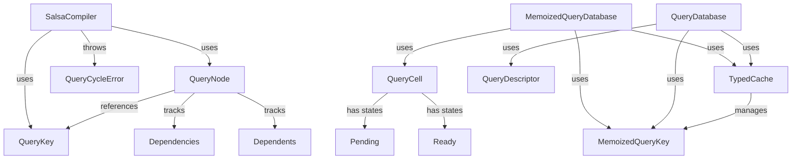
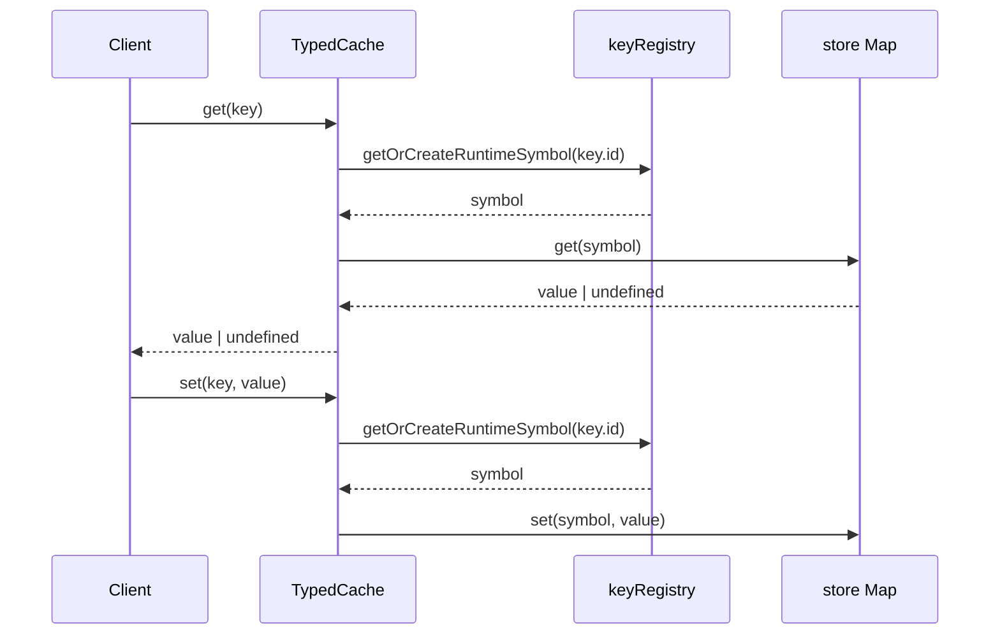
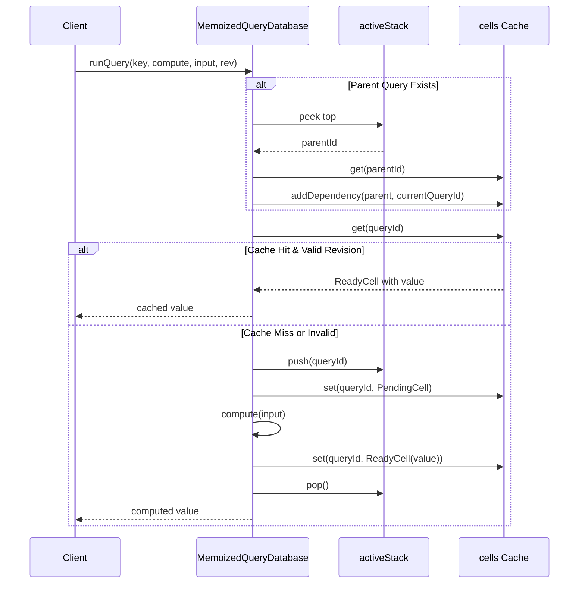
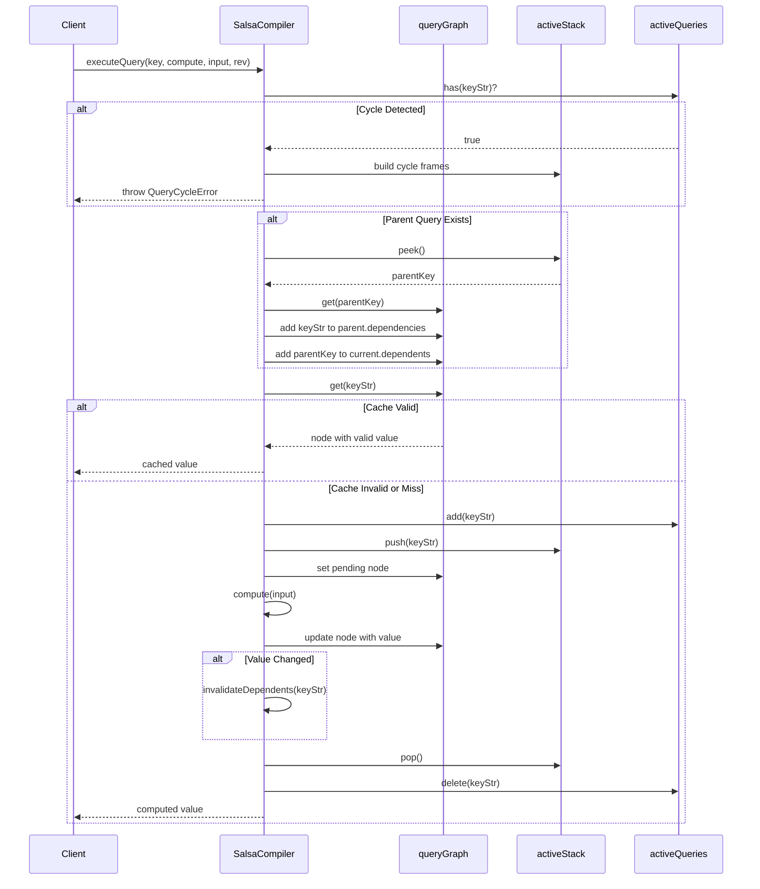

# Query System - Sistem Komputasi Inkremental

## 1. Pendahuluan

### 1.1. Apa Itu Query System?

Query System adalah infrastruktur untuk **komputasi inkremental** (incremental computation) yang diimplementasikan dalam compiler RouteSync. System ini terinspirasi dari framework **Salsa** (https://salsa-rs.github.io/salsa/) dan menyediakan mekanisme untuk melakukan komputasi dengan caching otomatis, tracking dependensi, dan invalidasi selektif.

### 1.2. Tujuan Query System

Query system dirancang untuk:

- **Menghindari re-komputasi yang tidak perlu**: Menyimpan hasil komputasi dan menggunakannya kembali jika input dan dependensi tidak berubah
- **Tracking dependensi otomatis**: Merekam dependensi antar query secara otomatis selama eksekusi
- **Invalidasi selektif**: Hanya meng-invalidate query yang benar-benar terpengaruh oleh perubahan
- **Deteksi cycle**: Mendeteksi dan melaporkan dependency cycle dalam query graph
- **Type safety**: Menyediakan API yang type-safe dengan TypeScript generics

### 1.3. Peran dalam Pipeline Compiler

Query system berada di level infrastruktur dan digunakan oleh berbagai komponen compiler:

```
┌─────────────────────────────────────────────────────┐
│              Compiler Pipeline                       │
├─────────────────────────────────────────────────────┤
│  Scanner → Parser → Semantic → IR → Optimization    │
│     ↓         ↓         ↓       ↓         ↓          │
│  [Query System - Incremental Computation Layer]     │
│     • Type resolution caching                        │
│     • Symbol lookup memoization                      │
│     • Dependency tracking                            │
│     • Selective invalidation                         │
└─────────────────────────────────────────────────────┘
```

### 1.4. Mengapa Query System Diperlukan?

Tanpa query system, compiler harus melakukan re-komputasi penuh setiap kali ada perubahan, bahkan jika hanya sebagian kecil input yang berubah. Query system memungkinkan:


1. **Performa watch mode**: Saat file berubah, hanya bagian yang terpengaruh yang di-recompile
2. **Skalabilitas**: Dapat menangani large codebase dengan efisien
3. **Developer experience**: Feedback cycle yang cepat saat development
4. **Resource efficiency**: Menghemat CPU dan memory dengan menghindari work redundan

## 2. Arsitektur

### 2.1. Komponen Utama

Query system terdiri dari 5 komponen utama:

```
query/
├── TypedCache.ts           # Type-safe caching dengan symbol-based keys
├── QueryCell.ts            # State management untuk query results
├── QueryDatabase.ts        # Input-based caching untuk queries
├── SalsaCompiler.ts        # Demand-driven incremental compiler
└── index.ts                # Public API exports
```

### 2.2. TypedCache - Type-Safe Caching

#### Tujuan
Menyediakan mekanisme caching yang type-safe menggunakan runtime symbols untuk menghindari key collision dan memastikan type correctness.

#### Komponen Utama

**MemoizedQueryKey<O>**
```typescript
interface MemoizedQueryKey<O> {
    readonly id: string;
    readonly [memoizedQueryBrand]: (value: O) => O;
}
```

Key yang type-safe untuk query results. Generic type `O` memastikan bahwa nilai yang di-cache dan di-retrieve memiliki tipe yang konsisten.

**TypedCache Class**
```typescript
class TypedCache {
    private store: Map<symbol, unknown>
    private keyRegistry: Map<string, symbol>
    
    get<T>(key: MemoizedQueryKey<T>): T | undefined
    set<T>(key: MemoizedQueryKey<T>, value: T): void
    has<T>(key: MemoizedQueryKey<T>): boolean
    delete<T>(key: MemoizedQueryKey<T>): boolean
}
```


Cache yang menggunakan runtime symbols sebagai key internal untuk efisiensi dan type safety. Setiap string key di-map ke unique symbol.

#### Cara Kerja

1. **Key Creation**: String key "users:123" → unique symbol via `Symbol("users:123")`
2. **Symbol Registry**: Map string → symbol untuk reuse symbols yang sama
3. **Type-Safe Access**: Generic methods memastikan type consistency
4. **Storage**: Internal Map<symbol, unknown> menyimpan actual values

### 2.3. QueryCell - Computation State

#### Tujuan
Merepresentasikan state dari sebuah query computation, apakah masih pending atau sudah ready dengan value.

#### State Machine

```
┌──────────┐
│ Pending  │  ← Computation in progress
└────┬─────┘
     │ compute()
     ↓
┌──────────┐
│  Ready   │  ← Value available
└──────────┘
```

#### Type Definition

```typescript
type QueryCell<V> =
    | { kind: 'Pending'; dependencies: readonly string[]; verifiedAtRevision: string }
    | { kind: 'Ready'; value: V; dependencies: readonly string[]; verifiedAtRevision: string }
```

**Pending State**: Query sedang di-compute atau dependencies sedang di-track
**Ready State**: Computation selesai, value tersedia untuk digunakan

#### Factory Functions

- `createPendingCell<V>(revision, deps)`: Membuat cell pending
- `createReadyCell<V>(value, revision, deps)`: Membuat cell ready dengan value
- `isReady<V>(cell)`: Type guard untuk check ready state
- `isPending<V>(cell)`: Type guard untuk check pending state
- `addDependency<V>(cell, dep)`: Menambah dependency ke cell


### 2.4. QueryDatabase - Input-Based Caching

#### Tujuan
Menyediakan simple input-based caching untuk queries dengan dependency fingerprinting.

#### Komponen Utama

**QueryDescriptor<I, O>**
```typescript
interface QueryDescriptor<I, O> {
    readonly key: MemoizedQueryKey<O>
    readonly inputHash: string
    compute(input: I): O
}
```

Descriptor yang mendeskripsikan bagaimana sebuah query di-compute. Mengandung:
- `key`: Unique identifier untuk query type
- `inputHash`: Hash dari input untuk cache key
- `compute`: Function untuk compute value jika cache miss

**QueryDatabase Class**
```typescript
class QueryDatabase {
    executeQuery<I, O>(
        query: QueryDescriptor<I, O>,
        input: I,
        dependencyFingerprint: string
    ): O
}
```

Simple database yang cache berdasarkan kombinasi query key, input hash, dan dependency fingerprint.

**MemoizedQueryDatabase Class**
```typescript
class MemoizedQueryDatabase {
    runQuery<I, O>(
        key: MemoizedQueryKey<O>,
        compute: (input: I) => O,
        input: I,
        revision: string
    ): O
}
```

Advanced database dengan:
- Dependency tracking otomatis
- Query stack untuk detect parent-child relationship
- Revision-based validation
- QueryCell untuk state management

#### Perbedaan QueryDatabase vs MemoizedQueryDatabase

| Feature | QueryDatabase | MemoizedQueryDatabase |
|---------|---------------|----------------------|
| Dependency Tracking | Manual via fingerprint | Automatic via stack |
| Cache Key | key+input+deps | key+revision |
| State Management | Simple Map | QueryCell |
| Invalidation | Manual clear | Revision-based |


### 2.5. SalsaCompiler - Incremental Compilation Engine

#### Tujuan
Implementasi demand-driven incremental compilation dengan fine-grained dependency tracking, cycle detection, dan selective invalidation.

#### Komponen Utama

**QueryKey Interface**
```typescript
interface QueryKey {
    readonly queryName: string    // Nama jenis query (e.g., "typecheck")
    readonly targetId: string      // ID target computation (e.g., "User")
    readonly optionsHash: string   // Hash dari options (e.g., "default")
}
```

**QueryNode Interface**
```typescript
interface QueryNode {
    readonly key: QueryKey
    readonly value: unknown
    readonly dependencies: ReadonlySet<string>      // Queries ini depend on
    readonly dependents: ReadonlySet<string>        // Queries yang depend on ini
    readonly lastChangedRevision: number
    readonly lastVerifiedRevision: number
}
```

Node dalam dependency graph. Menyimpan:
- Query result value
- Bidirectional dependencies (dependencies & dependents)
- Revision tracking untuk invalidation

**QueryContext Interface**
```typescript
interface QueryContext {
    readonly packageId?: string
    readonly moduleId?: string
    readonly symbolId?: string
}
```

Context information untuk debugging dan error reporting.

**QueryFrame Interface**
```typescript
interface QueryFrame {
    readonly key: QueryKey
    readonly queryKind: string
    readonly context?: QueryContext
    readonly span?: FileSpan
}
```

Stack frame untuk query execution tracking dan error reporting.


**QueryCycleError Class**
```typescript
class QueryCycleError extends Error {
    constructor(
        message: string,
        public readonly queryStack: readonly QueryFrame[]
    )
}
```

Error yang thrown saat cycle terdeteksi. Menyertakan full query stack untuk debugging.

**SalsaCompiler Class**
```typescript
class SalsaCompiler {
    constructor(private readonly symbolDb: SymbolDatabase)
    
    executeQuery<I, O>(
        key: QueryKey,
        compute: (input: I) => O,
        input: I,
        currentRevision: number
    ): O
    
    typecheck(symbolId: string, revision: number): SemanticType
    invalidateDependents(keyStr: string, revision: number): void
}
```

Main compiler engine dengan:
- `queryGraph`: Map<string, QueryNode> untuk dependency graph
- `activeQueries`: Set<string> untuk cycle detection
- `activeQueryStack`: string[] untuk tracking execution stack
- `queryKeys`: Map<string, QueryKey> untuk lookup

#### Algoritma Kunci

**Cycle Detection**
```
IF query_key IN activeQueries:
    → Build cycle frames from activeQueryStack
    → THROW QueryCycleError
```

**Cache Validation**
```
FOR EACH dependency IN cached.dependencies:
    IF dependency.lastChangedRevision > cached.lastVerifiedRevision:
        → Cache invalid, re-compute
```

**Dependency Tracking**
```
WHEN executing query Q:
    IF parent query P exists IN stack:
        → Add Q to P.dependencies
        → Add P to Q.dependents
```

**Invalidation Propagation**
```
WHEN query Q value changes:
    → Mark Q.lastChangedRevision = current
    → BFS traversal melalui Q.dependents
    → Mark dependents.lastVerifiedRevision = current - 1
```


### 2.6. Hubungan Antar Komponen



### 2.7. Dependency Graph

```
TypedCache (Foundation)
    ↑
    ├── QueryDatabase (Simple input-based caching)
    └── MemoizedQueryDatabase (Dependency tracking)
         ↑
         └── QueryCell (State management)

SalsaCompiler (Standalone incremental engine)
    ├── QueryKey
    ├── QueryNode
    ├── QueryContext
    └── QueryCycleError
```

Tidak ada circular dependency. TypedCache adalah foundation yang digunakan oleh databases. SalsaCompiler adalah engine standalone yang bisa digunakan independent dari databases.

## 3. Cara Kerja

### 3.1. Lifecycle Computation di TypedCache




**Penjelasan Step-by-Step:**

1. **Key Creation**: Client membuat `MemoizedQueryKey<T>` dengan string id
2. **Symbol Lookup**: Cache check jika symbol sudah ada untuk id tersebut
3. **Symbol Creation**: Jika belum ada, create `Symbol(id)` dan register di keyRegistry
4. **Value Access**: Gunakan symbol sebagai key untuk access Map internal
5. **Type Safety**: Generic type `T` memastikan value yang di-return type-correct

### 3.2. Lifecycle Computation di MemoizedQueryDatabase



**Penjelasan Step-by-Step:**

1. **Parent Tracking**: Jika ada query parent di stack, add current query sebagai dependency
2. **Cache Check**: Lookup existing cell untuk query id
3. **Validation**: Check jika cell ready DAN revision masih valid
4. **Cache Hit**: Return cached value langsung
5. **Cache Miss**: Push ke stack, create pending cell, execute compute
6. **Result Storage**: Update cell dengan ready state dan value
7. **Stack Cleanup**: Pop query dari stack setelah selesai


### 3.3. Lifecycle Computation di SalsaCompiler



**Penjelasan Step-by-Step:**

1. **Cycle Detection**: Check jika query key sudah ada di activeQueries Set
2. **Cycle Error**: Jika cycle detected, build QueryFrame[] dari stack dan throw error
3. **Parent Tracking**: Jika ada parent di stack, establish bidirectional dependency
4. **Cache Lookup**: Cari existing QueryNode di graph
5. **Dependency Validation**: Check apakah dependencies masih valid berdasarkan revision
6. **Cache Hit**: Return cached value jika valid
7. **Execution**: Mark query active, push ke stack, execute compute function
8. **Value Comparison**: Compare old vs new value untuk detect changes
9. **Invalidation**: Jika value changed, invalidate dependent queries
10. **Cleanup**: Remove dari activeQueries, pop dari stack


### 3.4. Invalidation Propagation Algorithm

```
function invalidateDependents(keyStr, revision):
    queue = [keyStr]
    visited = new Set()
    
    while queue not empty:
        current = queue.dequeue()
        visited.add(current)
        
        node = queryGraph.get(current)
        for each dependent in node.dependents:
            if dependent not in visited:
                depNode = queryGraph.get(dependent)
                depNode.lastVerifiedRevision = revision - 1
                queue.enqueue(dependent)
```

**Karakteristik:**
- **BFS Traversal**: Menggunakan queue untuk breadth-first search
- **Visited Tracking**: Mencegah infinite loops di cyclic graphs
- **Revision Marking**: Set lastVerifiedRevision ke revision - 1 untuk force recomputation
- **Cascading**: Invalidation propagates ke semua transitive dependents

### 3.5. Revision-Based Caching

System menggunakan revision numbers untuk menentukan apakah cached value masih valid:

```
Revision Timeline:
rev1: Query A computed → result = X
rev2: Query A dependencies unchanged → return cached X
rev3: Dependency B changed → invalidate A (lastVerified = rev2)
rev4: Query A accessed → recompute because lastVerified < rev4
```

**Keuntungan Revision-Based:**
- Tidak perlu explicit invalidation calls dari client
- Automatic staleness detection
- Support untuk batched updates (multiple changes dalam 1 revision)
- Clear semantics untuk "when is data fresh"

## 4. Cara Penggunaan

### 4.1. TypedCache - Basic Usage

```typescript
import { TypedCache, createMemoizedQueryKey } from '@compiler/query';

// Create cache instance
const cache = new TypedCache();

// Create typed keys
const userKey = createMemoizedQueryKey<User>('users:123');
const countKey = createMemoizedQueryKey<number>('count');

// Store values
cache.set(userKey, { id: 123, name: 'Alice' });
cache.set(countKey, 42);

// Retrieve values (type-safe)
const user = cache.get(userKey);    // Type: User | undefined
const count = cache.get(countKey);  // Type: number | undefined

// Check existence
if (cache.has(userKey)) {
    console.log('User is cached');
}

// Remove specific key
cache.delete(userKey);

// Clear all
cache.clear();

// Get stats
console.log(cache.size); // Number of cached items
```


### 4.2. QueryCell - State Management

```typescript
import { 
    createPendingCell, 
    createReadyCell, 
    isReady, 
    isPending,
    addDependency 
} from '@compiler/query';

// Create pending cell
let cell = createPendingCell<number>('rev1', ['dep1']);
console.log(isPending(cell)); // true

// Execute computation
const result = compute(); // returns 42

// Update to ready state
cell = createReadyCell(result, 'rev1', ['dep1', 'dep2']);
console.log(isReady(cell)); // true

// Access value (type-safe with guard)
if (isReady(cell)) {
    console.log(cell.value); // 42 (type: number)
}

// Add more dependencies
cell = addDependency(cell, 'dep3');
console.log(cell.dependencies); // ['dep1', 'dep2', 'dep3']

// Check revision
console.log(cell.verifiedAtRevision); // 'rev1'
```

### 4.3. QueryDatabase - Simple Caching

```typescript
import { QueryDatabase, createMemoizedQueryKey } from '@compiler/query';

const db = new QueryDatabase();

// Define query descriptor
interface UserInput {
    userId: string;
}

interface UserResult {
    id: string;
    name: string;
    email: string;
}

const userQuery = {
    key: createMemoizedQueryKey<UserResult>('user-query'),
    inputHash: hashInput({ userId: '123' }), // Hash function for input
    compute: (input: UserInput) => {
        // Expensive computation
        return fetchUserFromDatabase(input.userId);
    }
};

// Execute query (will compute on first call)
const user1 = db.executeQuery(
    userQuery,
    { userId: '123' },
    'deps-fingerprint-v1'
);

// Second call with same inputs returns cached result
const user2 = db.executeQuery(
    userQuery,
    { userId: '123' },
    'deps-fingerprint-v1'
);

// Different dependency fingerprint triggers recomputation
const user3 = db.executeQuery(
    userQuery,
    { userId: '123' },
    'deps-fingerprint-v2' // Changed
);

// Get stats
console.log(db.getStats()); // { size: number }

// Clear cache
db.clear();
```


### 4.4. MemoizedQueryDatabase - Dependency Tracking

```typescript
import { MemoizedQueryDatabase, createMemoizedQueryKey } from '@compiler/query';

const db = new MemoizedQueryDatabase();
let revision = 1;

// Define query keys
const typeKey = createMemoizedQueryKey<SemanticType>('type');
const fieldKey = createMemoizedQueryKey<Field[]>('fields');

// Parent query that depends on child query
const parentResult = db.runQuery(
    typeKey,
    (userId: string) => {
        // This query depends on fields query
        const fields = db.runQuery(
            fieldKey,
            (uid: string) => getFieldsForUser(uid),
            userId,
            `rev${revision}`
        );
        
        return buildTypeFromFields(fields);
    },
    'user-123',
    `rev${revision}`
);

// Dependency automatically tracked: type -> fields

// Later, increment revision and requery
revision++;

// If fields hasn't changed, both queries use cache
const cachedResult = db.runQuery(
    typeKey,
    (userId: string) => {
        const fields = db.runQuery(fieldKey, getFieldsForUser, userId, `rev${revision}`);
        return buildTypeFromFields(fields);
    },
    'user-123',
    `rev${revision}`
);

// Get debugging info
console.log(db.getActiveStack()); // Current query stack
console.log(db.getStats()); // { size, activeQueries }

// Clear all
db.clear();
```

### 4.5. SalsaCompiler - Incremental Compilation

```typescript
import { SalsaCompiler, QueryCycleError } from '@compiler/query';
import type { SymbolDatabase } from '@compiler/analysis';

// Initialize compiler with symbol database
const symbolDb: SymbolDatabase = createSymbolDatabase();
const compiler = new SalsaCompiler(symbolDb);

let currentRevision = 1;

// Define query key
const typecheckKey = {
    queryName: 'typecheck',
    targetId: 'User',
    optionsHash: 'default'
};

// First execution - computes result
const type1 = compiler.executeQuery(
    typecheckKey,
    (symbolId: string) => {
        // Expensive type checking logic
        return performTypeChecking(symbolId);
    },
    'User',
    currentRevision
);

// Second execution - returns cached result
const type2 = compiler.executeQuery(
    typecheckKey,
    (symbolId: string) => performTypeChecking(symbolId),
    'User',
    currentRevision
);

console.log(type1 === type2); // true (same cached result)

// Increment revision to simulate changes
currentRevision++;

// Will recompute if dependencies changed
const type3 = compiler.executeQuery(
    typecheckKey,
    (symbolId: string) => performTypeChecking(symbolId),
    'User',
    currentRevision
);
```


### 4.6. Handling Query Cycles

```typescript
import { SalsaCompiler, QueryCycleError } from '@compiler/query';

const compiler = new SalsaCompiler(symbolDb);

try {
    // This will create a cycle: A -> B -> A
    const result = compiler.executeQuery(
        { queryName: 'resolveType', targetId: 'A', optionsHash: 'default' },
        () => {
            // Query A depends on query B
            return compiler.executeQuery(
                { queryName: 'resolveType', targetId: 'B', optionsHash: 'default' },
                () => {
                    // Query B depends on query A (cycle!)
                    return compiler.executeQuery(
                        { queryName: 'resolveType', targetId: 'A', optionsHash: 'default' },
                        () => ({ type: 'A' }),
                        'A',
                        1
                    );
                },
                'B',
                1
            );
        },
        'A',
        1
    );
} catch (error) {
    if (error instanceof QueryCycleError) {
        console.error('Query cycle detected!');
        console.error('Cycle path:', error.message);
        
        // Access detailed stack frames
        error.queryStack.forEach((frame, i) => {
            console.log(`  ${i + 1}. ${frame.queryKind}:${frame.context?.symbolId}`);
        });
        
        // Example output:
        // 1. resolveType:A
        // 2. resolveType:B
        // 3. resolveType:A (cycle!)
    }
}
```

### 4.7. Built-in Typecheck Query

```typescript
// SalsaCompiler menyediakan example typecheck query
const compiler = new SalsaCompiler(symbolDb);

// Simple typecheck usage
const userType = compiler.typecheck('User', 1);
console.log(userType); // SemanticType

// Subsequent calls use cache
const cachedType = compiler.typecheck('User', 1);
console.log(userType === cachedType); // true

// Different revision may trigger recomputation
const newType = compiler.typecheck('User', 2);
```

### 4.8. Query Statistics and Debugging

```typescript
// TypedCache stats
const cache = new TypedCache();
console.log(cache.size); // Number of entries

// QueryDatabase stats
const queryDb = new QueryDatabase();
console.log(queryDb.getStats()); // { size }

// MemoizedQueryDatabase stats
const memoDb = new MemoizedQueryDatabase();
console.log(memoDb.getStats()); 
// { size, activeQueries }
console.log(memoDb.getActiveStack()); 
// Current query execution stack

// SalsaCompiler stats
const compiler = new SalsaCompiler(symbolDb);
console.log(compiler.getStats());
// { totalQueries, activeQueries, graphSize }
```


## 5. Panduan Pengembangan

### 5.1. Kapan Menggunakan Query System?

**Gunakan TypedCache ketika:**
- Butuh simple key-value caching dengan type safety
- Tidak perlu dependency tracking
- Cache invalidation manual sudah cukup
- Ingin kontrol penuh atas cache lifecycle

**Gunakan QueryDatabase ketika:**
- Butuh input-based caching
- Dependency tracking manual via fingerprint
- Query computation pure function
- Butuh simple descriptor-based queries

**Gunakan MemoizedQueryDatabase ketika:**
- Butuh automatic dependency tracking
- Query bisa nested (query calls query)
- Revision-based invalidation sesuai kebutuhan
- Ingin minimize boilerplate untuk dependency management

**Gunakan SalsaCompiler ketika:**
- Butuh full incremental compilation infrastructure
- Cycle detection penting
- Bidirectional dependency graph diperlukan
- Fine-grained invalidation krusial untuk performa
- Building compiler atau analysis tool

### 5.2. Best Practices

#### 5.2.1. Key Design

```typescript
// ✅ GOOD: Descriptive, hierarchical keys
const userTypeKey = createMemoizedQueryKey<SemanticType>('type:user:User');
const fieldKey = createMemoizedQueryKey<Field[]>('fields:user:User');

// ❌ BAD: Generic, collision-prone keys
const key1 = createMemoizedQueryKey<any>('data');
const key2 = createMemoizedQueryKey<any>('result');
```

**Konvensi Penamaan:**
- Format: `category:subcategory:identifier`
- Gunakan colon (`:`) sebagai separator
- Sertakan type information dalam key
- Hindari special characters selain colon dan dash

#### 5.2.2. Query Granularity

```typescript
// ✅ GOOD: Fine-grained queries
const fieldQuery = (fieldName: string) => 
    db.runQuery(fieldKey(fieldName), resolveField, fieldName, rev);

const typeQuery = (typeName: string) =>
    db.runQuery(typeKey(typeName), resolveType, typeName, rev);

// ❌ BAD: Coarse-grained monolithic query
const allDataQuery = () =>
    db.runQuery(allKey, () => ({
        fields: resolveAllFields(),
        types: resolveAllTypes(),
        // ... everything
    }), null, rev);
```

**Prinsip:**
- Smaller queries = better cache granularity
- Query per logical unit of computation
- Avoid bundling unrelated computations


#### 5.2.3. Revision Management

```typescript
// ✅ GOOD: Consistent revision tracking
class CompilerState {
    private currentRevision = 0;
    
    incrementRevision(): number {
        return ++this.currentRevision;
    }
    
    getCurrentRevision(): number {
        return this.currentRevision;
    }
}

// Usage
const state = new CompilerState();
const result1 = compiler.executeQuery(key, compute, input, state.getCurrentRevision());

// After source change
state.incrementRevision();
const result2 = compiler.executeQuery(key, compute, input, state.getCurrentRevision());

// ❌ BAD: Inconsistent or random revisions
const result = compiler.executeQuery(key, compute, input, Math.random());
```

#### 5.2.4. Error Handling

```typescript
// ✅ GOOD: Comprehensive error handling
try {
    const result = compiler.executeQuery(key, compute, input, revision);
    return result;
} catch (error) {
    if (error instanceof QueryCycleError) {
        // Handle cycle specifically
        logCycleError(error.queryStack);
        return fallbackValue;
    }
    // Handle other errors
    throw new CompilationError('Query failed', { cause: error });
}

// ❌ BAD: Silent failures
const result = compiler.executeQuery(key, compute, input, revision) || defaultValue;
```

#### 5.2.5. Cache Maintenance

```typescript
// ✅ GOOD: Strategic cache clearing
class QueryManager {
    private cache = new TypedCache();
    
    onSourceFileChanged(file: string): void {
        // Clear only affected queries
        this.clearQueriesForFile(file);
    }
    
    onFullRebuild(): void {
        // Clear everything
        this.cache.clear();
    }
}

// ❌ BAD: Never clearing cache or clearing too aggressively
class BadManager {
    onAnyChange(): void {
        this.cache.clear(); // Too aggressive
    }
}
```

### 5.3. Anti-Patterns

#### Anti-Pattern 1: Cache Everything

```typescript
// ❌ BAD: Caching trivial computations
const trivialKey = createMemoizedQueryKey<number>('add');
cache.set(trivialKey, 1 + 1); // Overhead > benefit

// ✅ GOOD: Cache expensive computations only
const expensiveKey = createMemoizedQueryKey<TypeGraph>('type-graph');
cache.set(expensiveKey, buildComplexTypeGraph()); // Worth caching
```


#### Anti-Pattern 2: Ignoring Cycles

```typescript
// ❌ BAD: Assuming no cycles exist
function resolveType(name: string): Type {
    const related = resolveType(getRelatedType(name)); // Potential cycle!
    return buildType(name, related);
}

// ✅ GOOD: Design to prevent cycles
function resolveType(name: string, visited = new Set<string>()): Type {
    if (visited.has(name)) {
        throw new Error(`Cycle detected: ${name}`);
    }
    visited.add(name);
    
    const related = resolveType(getRelatedType(name), visited);
    return buildType(name, related);
}

// ✅ BETTER: Use SalsaCompiler for automatic cycle detection
const type = compiler.executeQuery(key, resolveType, name, revision);
```

#### Anti-Pattern 3: Mutable Query Results

```typescript
// ❌ BAD: Returning mutable objects
const arrayKey = createMemoizedQueryKey<string[]>('items');
const items = cache.get(arrayKey) || [];
items.push('new'); // Mutates cached value!

// ✅ GOOD: Return immutable or defensive copies
const arrayKey = createMemoizedQueryKey<readonly string[]>('items');
const items = cache.get(arrayKey) || [];
const newItems = [...items, 'new']; // Create new array
cache.set(arrayKey, newItems);
```

#### Anti-Pattern 4: Over-Granular Queries

```typescript
// ❌ BAD: Too many tiny queries
for (const field of fields) {
    db.runQuery(keyFor(field), () => field.type, field.name, rev);
}

// ✅ GOOD: Batch related data
db.runQuery(fieldsKey, () => 
    fields.map(f => ({ name: f.name, type: f.type })),
    fields,
    rev
);
```

#### Anti-Pattern 5: String Concatenation for Keys

```typescript
// ❌ BAD: Error-prone string building
const key = createMemoizedQueryKey(`type-${name}-${version}`);

// ✅ GOOD: Template literals or helper functions
const key = createMemoizedQueryKey<Type>(`type:${name}:v${version}`);

// ✅ BETTER: Key builder helper
function buildTypeKey(name: string, version: number): MemoizedQueryKey<Type> {
    return createMemoizedQueryKey(`type:${name}:v${version}`);
}
```

### 5.4. Performance Optimization

#### 5.4.1. Lazy Evaluation

```typescript
// ✅ GOOD: Compute only when needed
function getTypeIfNeeded(name: string): Type | undefined {
    if (!shouldResolveType(name)) {
        return undefined;
    }
    return compiler.executeQuery(typeKey(name), resolveType, name, rev);
}
```


#### 5.4.2. Batch Operations

```typescript
// ✅ GOOD: Batch related queries
function resolveTypes(names: string[]): Type[] {
    return names.map(name => 
        compiler.executeQuery(typeKey(name), resolveType, name, rev)
    );
}

// ✅ BETTER: Single query for batch
const batchKey = createMemoizedQueryKey<Type[]>('types:batch');
const types = compiler.executeQuery(
    batchKey,
    (names: string[]) => names.map(resolveType),
    names,
    rev
);
```

#### 5.4.3. Early Return for Cache Hits

```typescript
// ✅ GOOD: Check cache before expensive setup
function expensiveQuery(input: ComplexInput): Result {
    const key = buildKey(input);
    const cached = cache.get(key);
    
    if (cached) {
        return cached; // Early return
    }
    
    // Expensive setup only if cache miss
    const context = buildExpensiveContext();
    const result = compute(input, context);
    cache.set(key, result);
    return result;
}
```

### 5.5. Testing Query System

```typescript
import { TypedCache, MemoizedQueryDatabase, SalsaCompiler } from '@compiler/query';

describe('Query System Tests', () => {
    describe('TypedCache', () => {
        let cache: TypedCache;
        
        beforeEach(() => {
            cache = new TypedCache();
        });
        
        it('should cache and retrieve values', () => {
            const key = createMemoizedQueryKey<number>('test');
            cache.set(key, 42);
            expect(cache.get(key)).toBe(42);
        });
        
        it('should return undefined for missing keys', () => {
            const key = createMemoizedQueryKey<number>('missing');
            expect(cache.get(key)).toBeUndefined();
        });
    });
    
    describe('MemoizedQueryDatabase', () => {
        let db: MemoizedQueryDatabase;
        let computeCount: number;
        
        beforeEach(() => {
            db = new MemoizedQueryDatabase();
            computeCount = 0;
        });
        
        it('should cache query results', () => {
            const key = createMemoizedQueryKey<number>('compute');
            
            const result1 = db.runQuery(key, () => {
                computeCount++;
                return 42;
            }, null, 'rev1');
            
            const result2 = db.runQuery(key, () => {
                computeCount++;
                return 42;
            }, null, 'rev1');
            
            expect(result1).toBe(42);
            expect(result2).toBe(42);
            expect(computeCount).toBe(1); // Computed only once
        });
    });
    
    describe('SalsaCompiler', () => {
        let compiler: SalsaCompiler;
        
        beforeEach(() => {
            const mockSymbolDb = createMockSymbolDatabase();
            compiler = new SalsaCompiler(mockSymbolDb);
        });
        
        it('should detect query cycles', () => {
            const keyA = { queryName: 'test', targetId: 'A', optionsHash: 'default' };
            
            expect(() => {
                compiler.executeQuery(keyA, () => {
                    // Recursive call creates cycle
                    return compiler.executeQuery(keyA, () => 1, 'A', 1);
                }, 'A', 1);
            }).toThrow(QueryCycleError);
        });
    });
});
```


## 6. Struktur Folder

### 6.1. File Organization

```
compiler/query/
├── index.ts              # Public API exports
├── TypedCache.ts         # Type-safe caching foundation
├── QueryCell.ts          # Query computation state
├── QueryDatabase.ts      # Query execution databases
└── SalsaCompiler.ts      # Incremental compilation engine
```

### 6.2. Tanggung Jawab Per File

**index.ts**
- Exports public API dari semua modules
- Type exports dan function exports
- Entry point untuk consumer code

**TypedCache.ts**
- `MemoizedQueryKey<O>`: Type-safe key interface
- `createMemoizedQueryKey<O>()`: Key factory
- `TypedCache`: Symbol-based cache implementation
- Runtime symbol management untuk type safety

**QueryCell.ts**
- `QueryCell<V>`: Union type untuk Pending | Ready state
- `createPendingCell()`: Factory untuk pending state
- `createReadyCell()`: Factory untuk ready state
- `isReady()`, `isPending()`: Type guards
- `addDependency()`: Dependency management

**QueryDatabase.ts**
- `QueryDescriptor<I, O>`: Query specification interface
- `QueryDatabase`: Simple input-based caching
- `MemoizedQueryDatabase`: Advanced dependency tracking
- Revision-based cache validation
- Automatic parent-child dependency tracking

**SalsaCompiler.ts**
- `QueryKey`: Unique query identifier
- `QueryNode`: Dependency graph node
- `QueryContext`, `QueryFrame`: Debug dan error context
- `QueryCycleError`: Cycle detection error
- `SalsaCompiler`: Main incremental compiler
- Bidirectional dependency tracking
- Cycle detection algorithm
- Invalidation propagation

## 7. Referensi Implementasi

### 7.1. Core Types Summary

```typescript
// TypedCache
interface MemoizedQueryKey<O>
class TypedCache

// QueryCell
type QueryCell<V> = Pending | Ready
function createPendingCell<V>()
function createReadyCell<V>()

// QueryDatabase
interface QueryDescriptor<I, O>
class QueryDatabase
class MemoizedQueryDatabase

// SalsaCompiler
interface QueryKey
interface QueryNode
interface QueryContext
interface QueryFrame
class QueryCycleError
class SalsaCompiler
```


### 7.2. Interaksi dengan Komponen Lain

Berdasarkan implementasi yang ada, Query system berinteraksi dengan:

**SymbolDatabase** (dari `compiler/analysis`)
- SalsaCompiler constructor menerima `SymbolDatabase`
- Digunakan untuk example `typecheck()` query
- Provides symbol lookup untuk type resolution

**SemanticType** (dari `compiler/types`)
- Return type dari `typecheck()` query
- Digunakan sebagai example cached value type
- Represents hasil dari type analysis

**FileSpan** (dari `compiler/types`)
- Optional field dalam `QueryFrame`
- Untuk error reporting dengan location information

### 7.3. Design Patterns Implemented

**1. Memoization Pattern**
- Cache computation results untuk avoid re-execution
- Key-based retrieval dengan type safety
- Implemented by TypedCache, QueryDatabase, MemoizedQueryDatabase

**2. State Pattern**
- QueryCell menggunakan discriminated union untuk state management
- Pending vs Ready states dengan different properties
- Type-safe state transitions

**3. Observer Pattern (Implicit)**
- Dependency tracking creates implicit observer relationships
- When dependency changes, dependents automatically invalidated
- Implemented by SalsaCompiler dependency graph

**4. Factory Pattern**
- `createMemoizedQueryKey()` factory function
- `createPendingCell()` dan `createReadyCell()` factories
- Encapsulates object creation logic

**5. Strategy Pattern**
- Different query execution strategies (simple vs memoized)
- QueryDatabase vs MemoizedQueryDatabase implement different caching strategies
- Client code can choose appropriate strategy

### 7.4. Complexity Analysis

**TypedCache Operations:**
- `get()`: O(1) - Map lookup via symbol
- `set()`: O(1) - Map insertion
- `has()`: O(1) - Map membership check
- `delete()`: O(1) - Map deletion
- `clear()`: O(n) - Clear all entries

**MemoizedQueryDatabase:**
- `runQuery()`: O(1) for cache hit, O(compute) for cache miss
- Dependency tracking: O(1) per dependency add
- Stack operations: O(1) push/pop

**SalsaCompiler:**
- `executeQuery()`: O(1) for cache hit, O(compute) for cache miss
- Cycle detection: O(n) where n = stack depth
- Dependency tracking: O(1) per edge add
- Invalidation: O(d) where d = number of transitive dependents (BFS)


### 7.5. Memory Characteristics

**TypedCache:**
- Memory: O(n) where n = number of cached entries
- Symbol overhead: Minimal (symbols are lightweight)
- Key registry: O(k) where k = number of unique keys

**QueryCell:**
- Memory per cell: O(1) + O(d) where d = number of dependencies
- Dependencies stored as readonly arrays (immutable)

**QueryDatabase:**
- Memory: O(n × s) where n = queries, s = average result size
- No dependency graph overhead

**MemoizedQueryDatabase:**
- Memory: O(n × s) + O(d) where d = dependency edges
- Active stack: O(h) where h = max query nesting depth

**SalsaCompiler:**
- Memory: O(n × s) + O(e) where e = dependency graph edges
- Bidirectional edges: 2x edge storage compared to directed graph
- Query key map: O(n) additional overhead

### 7.6. Thread Safety Considerations

**Current Implementation:**
- **Not thread-safe** - designed for single-threaded use
- No synchronization primitives
- Shared mutable state (Maps, Sets, Arrays)

**If Multi-threading Needed:**
- Add mutex/lock around cache operations
- Use concurrent data structures
- Consider immutable updates with copy-on-write

### 7.7. Extensibility Points

**Adding Custom Cache Backend:**
```typescript
// Current: In-memory Map
// Can extend to: Redis, LRU cache, disk-based, etc.

class CustomCache implements ICacheBackend<symbol, unknown> {
    get(key: symbol): unknown | undefined { /* custom impl */ }
    set(key: symbol, value: unknown): void { /* custom impl */ }
    // ...
}
```

**Custom Query Types:**
```typescript
// Define domain-specific query keys
const customKey = (id: string) => 
    createMemoizedQueryKey<CustomType>(`custom:${id}`);

// Use with any database
db.runQuery(customKey('123'), computeCustom, input, revision);
```

**Custom Invalidation Strategies:**
```typescript
// Override invalidation behavior
class CustomCompiler extends SalsaCompiler {
    protected invalidateDependents(keyStr: string, revision: number): void {
        // Custom invalidation logic
        super.invalidateDependents(keyStr, revision);
    }
}
```


## 8. Contoh Integrasi Real-World

### 8.1. Type Resolution dengan Caching

```typescript
import { SalsaCompiler, createMemoizedQueryKey } from '@compiler/query';
import type { SemanticType } from '@compiler/types';
import type { SymbolDatabase } from '@compiler/analysis';

class TypeResolver {
    private compiler: SalsaCompiler;
    private revision = 0;
    
    constructor(symbolDb: SymbolDatabase) {
        this.compiler = new SalsaCompiler(symbolDb);
    }
    
    resolveType(symbolId: string): SemanticType {
        const key = {
            queryName: 'resolve-type',
            targetId: symbolId,
            optionsHash: 'default'
        };
        
        return this.compiler.executeQuery(
            key,
            (id: string) => this.performTypeResolution(id),
            symbolId,
            this.revision
        );
    }
    
    private performTypeResolution(symbolId: string): SemanticType {
        // Complex type resolution logic here
        // May recursively call resolveType for dependencies
        return computeType(symbolId);
    }
    
    invalidateAll(): void {
        this.revision++;
        this.compiler.clear();
    }
    
    getStats() {
        return this.compiler.getStats();
    }
}
```

### 8.2. Incremental Compilation Pipeline

```typescript
import { MemoizedQueryDatabase, createMemoizedQueryKey } from '@compiler/query';

class IncrementalCompiler {
    private db = new MemoizedQueryDatabase();
    private currentRevision = 'rev0';
    
    compile(sourceFile: string): CompilationResult {
        // Each compilation step is a query
        const ast = this.parseStep(sourceFile);
        const semantic = this.semanticStep(ast);
        const ir = this.irStep(semantic);
        const output = this.emitStep(ir);
        
        return output;
    }
    
    private parseStep(source: string) {
        const key = createMemoizedQueryKey<AST>(`parse:${source}`);
        return this.db.runQuery(
            key,
            (src) => parseSource(src),
            source,
            this.currentRevision
        );
    }
    
    private semanticStep(ast: AST) {
        const key = createMemoizedQueryKey<SemanticResult>(`semantic:${ast.id}`);
        return this.db.runQuery(
            key,
            (tree) => analyzeSemantics(tree),
            ast,
            this.currentRevision
        );
    }
    
    private irStep(semantic: SemanticResult) {
        const key = createMemoizedQueryKey<IR>(`ir:${semantic.id}`);
        return this.db.runQuery(
            key,
            (sem) => buildIR(sem),
            semantic,
            this.currentRevision
        );
    }
    
    private emitStep(ir: IR) {
        const key = createMemoizedQueryKey<Output>(`emit:${ir.id}`);
        return this.db.runQuery(
            key,
            (intermediate) => emitCode(intermediate),
            ir,
            this.currentRevision
        );
    }
    
    onSourceChanged(file: string): void {
        // Increment revision to invalidate affected queries
        const revNum = parseInt(this.currentRevision.slice(3)) + 1;
        this.currentRevision = `rev${revNum}`;
    }
}
```


### 8.3. Watch Mode dengan Query System

```typescript
import { SalsaCompiler } from '@compiler/query';
import * as chokidar from 'chokidar';

class WatchModeCompiler {
    private compiler: SalsaCompiler;
    private revision = 0;
    private watcher: chokidar.FSWatcher | null = null;
    
    constructor(symbolDb: SymbolDatabase) {
        this.compiler = new SalsaCompiler(symbolDb);
    }
    
    startWatch(sourceDir: string): void {
        this.watcher = chokidar.watch(sourceDir, {
            ignoreInitial: true
        });
        
        this.watcher.on('change', (path) => {
            console.log(`File changed: ${path}`);
            this.onFileChanged(path);
        });
        
        console.log(`Watching ${sourceDir}...`);
    }
    
    private onFileChanged(filePath: string): void {
        // Increment revision
        this.revision++;
        
        // Queries will automatically recompute on next access
        // because dependencies will be detected as stale
        
        console.log(`Revision: ${this.revision}`);
        this.recompileAffected(filePath);
    }
    
    private recompileAffected(filePath: string): void {
        // Only recompile queries that depend on changed file
        const affectedSymbols = this.getSymbolsInFile(filePath);
        
        for (const symbolId of affectedSymbols) {
            try {
                const type = this.compiler.typecheck(symbolId, this.revision);
                console.log(`✓ Recompiled ${symbolId}`);
            } catch (error) {
                console.error(`✗ Failed to recompile ${symbolId}:`, error);
            }
        }
        
        // Log stats
        const stats = this.compiler.getStats();
        console.log(`Cache: ${stats.totalQueries} queries, ${stats.activeQueries} active`);
    }
    
    stopWatch(): void {
        if (this.watcher) {
            this.watcher.close();
            this.watcher = null;
        }
    }
}
```

### 8.4. Multi-Stage Pipeline dengan Dependency Tracking

```typescript
import { MemoizedQueryDatabase, createMemoizedQueryKey } from '@compiler/query';

class PipelineCompiler {
    private db = new MemoizedQueryDatabase();
    private revision = 'v1';
    
    // Stage 1: Parsing
    parse(sourceId: string): AST {
        const key = createMemoizedQueryKey<AST>(`stage1:parse:${sourceId}`);
        return this.db.runQuery(
            key,
            (id) => {
                console.log(`[Stage 1] Parsing ${id}`);
                return parseSource(id);
            },
            sourceId,
            this.revision
        );
    }
    
    // Stage 2: Type Checking (depends on Stage 1)
    typecheck(sourceId: string): TypeInfo {
        const key = createMemoizedQueryKey<TypeInfo>(`stage2:typecheck:${sourceId}`);
        return this.db.runQuery(
            key,
            (id) => {
                console.log(`[Stage 2] Typechecking ${id}`);
                const ast = this.parse(id); // Depends on parse
                return performTypecheck(ast);
            },
            sourceId,
            this.revision
        );
    }
    
    // Stage 3: Optimization (depends on Stage 2)
    optimize(sourceId: string): OptimizedIR {
        const key = createMemoizedQueryKey<OptimizedIR>(`stage3:optimize:${sourceId}`);
        return this.db.runQuery(
            key,
            (id) => {
                console.log(`[Stage 3] Optimizing ${id}`);
                const typeInfo = this.typecheck(id); // Depends on typecheck
                return optimizeCode(typeInfo);
            },
            sourceId,
            this.revision
        );
    }
    
    // Stage 4: Code Generation (depends on Stage 3)
    codegen(sourceId: string): string {
        const key = createMemoizedQueryKey<string>(`stage4:codegen:${sourceId}`);
        return this.db.runQuery(
            key,
            (id) => {
                console.log(`[Stage 4] Generating code for ${id}`);
                const ir = this.optimize(id); // Depends on optimize
                return generateCode(ir);
            },
            sourceId,
            this.revision
        );
    }
    
    // Full pipeline
    compile(sourceId: string): string {
        return this.codegen(sourceId);
    }
    
    // Demo: Watch execution with caching
    demo(): void {
        console.log('=== First compilation ===');
        this.compile('main.ts');
        
        console.log('\n=== Second compilation (all cached) ===');
        this.compile('main.ts');
        
        console.log('\n=== After source change ===');
        this.revision = 'v2';
        this.compile('main.ts');
    }
}
```


## 9. Troubleshooting

### 9.1. Common Issues

#### Issue 1: Cache Not Invalidating

**Symptoms:**
```typescript
// Update source but still getting old results
const result = compiler.executeQuery(key, compute, input, revision);
// Result is stale
```

**Diagnosis:**
- Check if revision number is actually incrementing
- Verify dependency tracking is working
- Check if cache is being cleared when it should

**Solution:**
```typescript
// Ensure revision increments on changes
this.revision++; // Must increment before re-query

// Or explicitly clear cache
compiler.clear();
```

#### Issue 2: Query Cycle Not Detected

**Symptoms:**
```typescript
// Stack overflow instead of QueryCycleError
```

**Diagnosis:**
- Check if using SalsaCompiler (other databases don't detect cycles)
- Verify query keys are consistent

**Solution:**
```typescript
// Use SalsaCompiler for cycle detection
const compiler = new SalsaCompiler(symbolDb);

// Ensure query keys are deterministic
const key = {
    queryName: 'resolve',
    targetId: symbolId,
    optionsHash: 'default' // Must be same for same query
};
```

#### Issue 3: Memory Leak

**Symptoms:**
- Memory usage grows indefinitely
- Cache never clears old entries

**Diagnosis:**
```typescript
console.log(cache.size); // Growing without bound
```

**Solution:**
```typescript
// Implement periodic cleanup
setInterval(() => {
    if (cache.size > MAX_SIZE) {
        cache.clear();
    }
}, CLEANUP_INTERVAL);

// Or use LRU cache (from compiler/cache)
import { LRUCache } from '@compiler/cache';
const lruCache = new LRUCache(MAX_ENTRIES);
```

#### Issue 4: Type Errors

**Symptoms:**
```typescript
const key = createMemoizedQueryKey<number>('count');
cache.set(key, 'string'); // Type error!
```

**Solution:**
```typescript
// Ensure type consistency
const key = createMemoizedQueryKey<number>('count');
cache.set(key, 42); // Correct type

// Or update key type if needed
const key = createMemoizedQueryKey<string | number>('value');
```

### 9.2. Debugging Techniques

#### Logging Query Execution

```typescript
class DebugCompiler extends SalsaCompiler {
    executeQuery<I, O>(
        key: QueryKey,
        compute: (input: I) => O,
        input: I,
        currentRevision: number
    ): O {
        console.log(`[Query] ${key.queryName}:${key.targetId} @ rev${currentRevision}`);
        const start = Date.now();
        
        try {
            const result = super.executeQuery(key, compute, input, currentRevision);
            const duration = Date.now() - start;
            console.log(`[Query] ✓ Completed in ${duration}ms`);
            return result;
        } catch (error) {
            console.error(`[Query] ✗ Failed:`, error);
            throw error;
        }
    }
}
```


#### Visualizing Dependency Graph

```typescript
class VisualizingCompiler extends SalsaCompiler {
    visualizeDependencyGraph(): string {
        const stats = this.getStats();
        const nodes: string[] = [];
        const edges: string[] = [];
        
        // This is conceptual - actual implementation would need
        // to expose queryGraph from SalsaCompiler
        // For now, we show what it would look like
        
        return `
            Dependency Graph:
            Nodes: ${stats.totalQueries}
            Active: ${stats.activeQueries}
            
            Example visualization:
            typeA -> typeB
            typeB -> typeC
            typeA -> typeC (transitive)
        `;
    }
}
```

#### Performance Profiling

```typescript
class ProfilingCache extends TypedCache {
    private hitCount = 0;
    private missCount = 0;
    
    get<T>(key: MemoizedQueryKey<T>): T | undefined {
        const result = super.get(key);
        if (result !== undefined) {
            this.hitCount++;
        } else {
            this.missCount++;
        }
        return result;
    }
    
    getHitRate(): number {
        const total = this.hitCount + this.missCount;
        return total === 0 ? 0 : this.hitCount / total;
    }
    
    resetStats(): void {
        this.hitCount = 0;
        this.missCount = 0;
    }
}
```

## 10. Kesimpulan

Query system menyediakan infrastruktur incremental computation yang powerful untuk compiler RouteSync:

### Key Takeaways

1. **Type Safety**: Semua caching operations type-safe dengan TypeScript generics
2. **Automatic Dependencies**: MemoizedQueryDatabase dan SalsaCompiler track dependencies secara otomatis
3. **Cycle Detection**: SalsaCompiler mendeteksi dan melaporkan query cycles
4. **Flexible Architecture**: Multiple abstraction levels untuk different use cases
5. **Performance**: Efficient caching menghindari unnecessary recomputation

### Kapan Menggunakan Apa

| Use Case | Recommended Component |
|----------|----------------------|
| Simple key-value cache | TypedCache |
| Input-based caching | QueryDatabase |
| Nested queries | MemoizedQueryDatabase |
| Full compiler | SalsaCompiler |
| State management | QueryCell |

### Next Steps

Untuk menggunakan query system dalam compiler RouteSync:

1. Import komponen yang diperlukan dari `@compiler/query`
2. Pilih abstraction level yang sesuai dengan kebutuhan
3. Design query keys dengan hierarchical naming
4. Implement compute functions yang pure dan deterministic
5. Setup revision tracking untuk cache invalidation
6. Add error handling untuk QueryCycleError
7. Monitor performance dengan stats methods

### Resources

- **Salsa Framework**: https://salsa-rs.github.io/salsa/
- **Incremental Computation**: Academic papers on demand-driven evaluation
- **Compiler Construction**: Dragon book chapter on optimization passes

### Contributing

Jika ingin menambah fitur atau improve query system:

1. Pastikan backwards compatibility
2. Add comprehensive tests
3. Update documentation
4. Consider performance implications
5. Follow existing patterns dan conventions

---

**Dokumentasi ini berdasarkan implementasi aktual** di folder `compiler/query` dan menjelaskan seluruh komponen yang tersedia tanpa asumsi terhadap fitur yang tidak ada.
