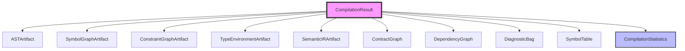
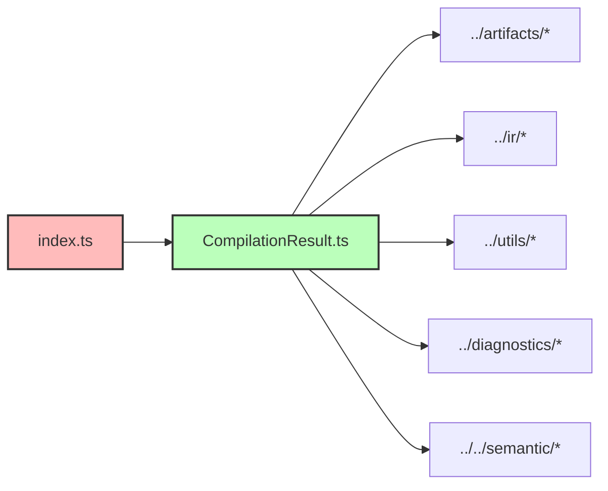
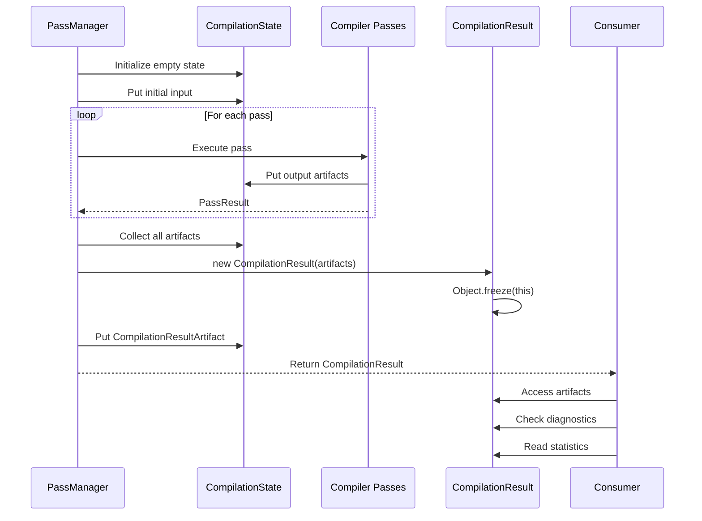

# Compiler Result

## Pendahuluan

### Apa itu Compilation Result?

Folder `compiler/result` berisi representasi **hasil akhir kompilasi** dalam compiler RouteSync. Compilation Result adalah output final dari seluruh pipeline compiler yang mengumpulkan semua artifacts, diagnostics, statistics, dan metadata yang dihasilkan selama proses kompilasi.

Compilation Result merupakan **culmination point** dari semua tahap compiler - dari parsing, semantic analysis, type checking, constraint solving, IR building, hingga optimization. Result ini berfungsi sebagai kontainer yang mengkonsolidasikan semua informasi penting yang dihasilkan oleh compiler passes.

### Tujuan Folder `compiler/result`

Folder ini menyediakan:

1. **CompilationResult Class** - Class utama yang menyimpan semua compilation artifacts
2. **CompilationStatistics Interface** - Metadata tentang performa dan statistik kompilasi
3. **Public API Exports** - Interface yang rapi untuk mengakses hasil kompilasi

### Peran Compilation Result dalam Pipeline Compiler

Compilation Result berada di **ujung akhir** pipeline compiler RouteSync:

```
Scanner → Parser → Semantic Analysis → Type Checking → IR Building → Optimization
                                                                           ↓
                                                                  CompilationResult
```


Peran utama Compilation Result:

- **Consolidation Point** - Mengumpulkan semua artifacts dari berbagai tahap kompilasi
- **Final Output** - Menjadi output yang dikembalikan kepada consumer setelah kompilasi selesai
- **Information Hub** - Menyediakan akses terpusat ke semua informasi hasil kompilasi
- **Statistics Reporting** - Melaporkan metrics dan performa kompilasi
- **Diagnostic Aggregation** - Mengkonsolidasikan semua error, warning, dan info messages

### Mengapa Hasil Kompilasi Direpresentasikan Melalui Komponen Ini?

Tanpa Compilation Result yang terstruktur:

1. **Tidak Ada Single Point of Access** - Consumer harus mengumpulkan artifacts dari berbagai tempat
2. **Sulit Melacak State** - Tidak jelas state akhir dari semua compilation artifacts
3. **Statistics Hilang** - Informasi performa dan metrics tidak tersimpan
4. **Diagnostics Tersebar** - Error dan warning tidak terkonsolidasi
5. **Sulit Testing** - Tidak ada struktur yang jelas untuk memverifikasi hasil kompilasi

Compilation Result menyediakan **single source of truth** untuk semua output kompilasi, memudahkan testing, debugging, dan penggunaan hasil kompilasi.

## Arsitektur

### Struktur Folder

Folder `compiler/result` berisi 2 file utama:

```
compiler/result/
├── CompilationResult.ts    # Class dan interface untuk hasil kompilasi
└── index.ts                # Public API exports
```


### Komponen Utama

#### 1. CompilationResult.ts

File ini mendefinisikan **final compilation result representation**.

**Interface yang Tersedia:**

**a) `CompilationStatistics`**

Interface untuk metadata dan statistik kompilasi.

```typescript
interface CompilationStatistics {
  readonly durationMs: number;           // Total durasi kompilasi dalam milliseconds
  readonly files: number;                // Jumlah file yang diproses
  readonly cacheHits: number;            // Jumlah cache hits (incremental compilation)
  readonly cacheMisses: number;          // Jumlah cache misses
  readonly invalidatedNodes: number;     // Jumlah nodes yang di-invalidate
}
```

**Fungsi:**
- Melacak performa kompilasi (duration)
- Menghitung efektivitas caching (hits vs misses)
- Memberikan insights untuk optimization
- Mendukung debugging performa issues

**b) `CompilationResult` Class**

Class utama yang menyimpan semua hasil kompilasi.

```typescript
class CompilationResult {
  constructor(
    public readonly astSnapshot: ASTArtifact,
    public readonly symbolGraph: SymbolGraphArtifact,
    public readonly constraintGraph: ConstraintGraphArtifact,
    public readonly typeEnvironment: TypeEnvironmentArtifact,
    public readonly semanticIR: SemanticIRArtifact,
    public readonly graph: ContractGraph,
    public readonly dependencyGraph: DependencyGraph,
    public readonly diagnostics: DiagnosticBag,
    public readonly symbolTable: SymbolTable,
    public readonly statistics: CompilationStatistics
  )
}
```


**Properties Detail:**

- **`astSnapshot`** (`ASTArtifact`) - Snapshot dari Abstract Syntax Tree hasil parsing
- **`symbolGraph`** (`SymbolGraphArtifact`) - Graph dari semua symbols dalam program
- **`constraintGraph`** (`ConstraintGraphArtifact`) - Graph dari type constraints
- **`typeEnvironment`** (`TypeEnvironmentArtifact`) - Environment dengan semua resolved types
- **`semanticIR`** (`SemanticIRArtifact`) - Semantic Intermediate Representation
- **`graph`** (`ContractGraph`) - Contract dependency graph
- **`dependencyGraph`** (`DependencyGraph`) - Module/artifact dependency graph
- **`diagnostics`** (`DiagnosticBag`) - Collection of errors, warnings, dan info messages
- **`symbolTable`** (`SymbolTable`) - Symbol lookup table
- **`statistics`** (`CompilationStatistics`) - Compilation metrics dan performa data

**Immutability:**

CompilationResult di-freeze setelah konstruksi untuk memastikan immutability:

```typescript
constructor(...) {
  Object.freeze(this);
}
```

Ini memastikan bahwa Result tidak dapat dimodifikasi setelah dibuat, menjaga consistency dan predictability.

#### 2. index.ts

File ini meng-export public API dari module result.

```typescript
export type { CompilationStatistics } from './Result';
export { CompilationResult } from './Result';
```

**Catatan:** Terdapat inkonsistensi dalam import path. Index.ts mengimpor dari `'./Result'` tetapi file actual bernama `CompilationResult.ts`. Ini kemungkinan adalah sisa dari refactoring yang belum selesai.

**Fungsi:**
- Menyediakan clean public API
- Mengekspos hanya types dan classes yang diperlukan
- Memisahkan internal implementation dari public interface


### Hubungan Antar Komponen



### Dependency Antar File



**Dependency Detail:**

CompilationResult.ts bergantung pada:
- `ASTArtifact` dari `../artifacts/ASTArtifact`
- `SymbolGraphArtifact` dari `../artifacts/SymbolGraphArtifact`
- `ConstraintGraphArtifact` dari `../artifacts/ConstraintGraphArtifact`
- `TypeEnvironmentArtifact` dari `../artifacts/TypeEnvironmentArtifact`
- `SemanticIRArtifact` dari `../artifacts/SemanticIRArtifact`
- `ContractGraph` dari `../ir/ContractGraph`
- `DependencyGraph` dari `../utils`
- `DiagnosticBag` dari `../diagnostics`
- `SymbolTable` dari `../../semantic/SymbolTable`


## Cara Kerja

### Proses Pembentukan Compilation Result

Compilation Result dibentuk sebagai tahap final dari compiler pipeline:

#### 1. Pipeline Execution

PassManager menjalankan semua compiler passes dan mengumpulkan artifacts:

```typescript
import { PassManager } from './compiler/passes';
import { CompilationState } from './compiler/passes';

const passManager = new PassManager();

// Register passes
passManager.registerPass(parsePass);
passManager.registerPass(semanticPass);
passManager.registerPass(typeCheckPass);
passManager.registerPass(irBuildPass);

// Execute pipeline
const result = await passManager.execute(
  initialArtifactKey,
  initialInput
);
// result is CompilationResult
```

#### 2. Artifact Collection

Setiap pass dalam pipeline menghasilkan artifacts yang disimpan dalam CompilationState:

```typescript
// Pass A produces ASTArtifact
state = state.put('AST', astArtifact);

// Pass B produces SymbolGraphArtifact
state = state.put('SymbolGraph', symbolGraphArtifact);

// Pass C produces TypeEnvironmentArtifact
state = state.put('TypeEnvironment', typeEnvArtifact);

// ... dan seterusnya
```

#### 3. Result Construction

Di akhir pipeline, semua artifacts dikumpulkan untuk membuat CompilationResult:

```typescript
const compilationResult = new CompilationResult(
  state.require('AST').astSnapshot,
  state.require('SymbolGraph'),
  state.require('ConstraintGraph'),
  state.require('TypeEnvironment'),
  state.require('SemanticIR'),
  state.require('ContractGraph').graph,
  dependencyGraph,
  diagnosticBag,
  symbolTable,
  statistics
);
```


#### 4. Wrapping dalam Artifact

CompilationResult kemudian dibungkus dalam `CompilationResultArtifact` untuk consistency:

```typescript
const resultArtifact = new CompilationResultArtifact(
  compilationResult,
  {
    hash: computeHash(compilationResult),
    producer: 'FinalPass',
    dependencies: allDependencies,
    timestamp: Date.now(),
    revision: version
  }
);
```

### Data yang Dikumpulkan ke dalam Result

CompilationResult mengumpulkan data dari semua tahap kompilasi:

**Dari Parsing Stage:**
- AST snapshot dengan semua nodes yang di-parse

**Dari Semantic Analysis:**
- Symbol graph dengan semua symbol relationships
- Symbol table untuk lookup

**Dari Type Checking:**
- Constraint graph dengan type constraints
- Type environment dengan resolved types

**Dari IR Building:**
- Semantic IR representation
- Contract graph untuk dependency tracking

**Dari Diagnostics:**
- Semua errors yang terdeteksi
- Warning messages
- Info messages

**Dari Statistics Tracking:**
- Duration kompilasi
- Cache metrics
- File counts
- Invalidation counts

### Lifecycle Compilation Result




### Bagaimana Result Digunakan oleh Tahap Selanjutnya

CompilationResult adalah **terminal output** - tidak ada tahap setelahnya dalam compiler pipeline. Result ini digunakan oleh **consumers eksternal**:

**Code Generators:**
```typescript
const result = await compiler.compile(input);

// Generate TypeScript code
const tsCode = typeScriptGenerator.generate(result.semanticIR);

// Generate contract code
const contractCode = contractEmitter.emit(result.graph);
```

**Diagnostic Reporting:**
```typescript
const result = await compiler.compile(input);

if (result.diagnostics.hasErrors()) {
  console.error('Compilation failed:');
  result.diagnostics.errors.forEach(err => {
    console.error(`  ${err.message} at ${err.location}`);
  });
}
```

**Incremental Compilation:**
```typescript
const result = await compiler.compile(input);

// Save for next compilation
cache.save({
  dependencyGraph: result.dependencyGraph,
  statistics: result.statistics
});
```

**Testing & Verification:**
```typescript
const result = await compiler.compile(testInput);

// Verify no errors
expect(result.diagnostics.hasErrors()).toBe(false);

// Verify symbols resolved
expect(result.symbolTable.size).toBeGreaterThan(0);

// Verify performance
expect(result.statistics.durationMs).toBeLessThan(1000);
```

## Cara Penggunaan

### Memperoleh Compilation Result

Compilation Result diperoleh dengan menjalankan compiler pipeline:

```typescript
import { PassManager, CompilationResult } from '@routesync/core';

// Create pass manager
const passManager = new PassManager();

// Register passes
passManager.registerPass(yourPasses);

// Execute compilation
const result: CompilationResult = await passManager.execute(
  artifactKey,
  initialInput
);
```


### Membaca Data dari Result

```typescript
import { CompilationResult } from '@routesync/core';

function processCompilationResult(result: CompilationResult) {
  // 1. Check for compilation errors
  if (result.diagnostics.hasErrors()) {
    console.error('Compilation failed with errors:');
    result.diagnostics.errors.forEach(error => {
      console.error(`  [${error.severity}] ${error.message}`);
      console.error(`    at ${error.location.filePath}:${error.location.line}`);
    });
    return;
  }
  
  // 2. Access AST
  const ast = result.astSnapshot;
  console.log('AST root:', ast.root);
  
  // 3. Access symbols
  const symbols = result.symbolGraph;
  console.log('Total symbols:', symbols.nodes.size);
  
  // 4. Access types
  const typeEnv = result.typeEnvironment;
  console.log('Resolved types:', typeEnv.types.size);
  
  // 5. Access IR
  const ir = result.semanticIR;
  console.log('IR blocks:', ir.blocks.length);
  
  // 6. Access contracts
  const contracts = result.graph;
  console.log('Contract nodes:', contracts.nodes.size);
  
  // 7. Check statistics
  const stats = result.statistics;
  console.log(`Compilation took ${stats.durationMs}ms`);
  console.log(`Processed ${stats.files} files`);
  console.log(`Cache hits: ${stats.cacheHits}, misses: ${stats.cacheMisses}`);
  
  // 8. Access symbol table
  const symbolTable = result.symbolTable;
  const userSymbol = symbolTable.lookup('User');
  if (userSymbol) {
    console.log('Found User symbol:', userSymbol);
  }
  
  // 9. Access dependency graph
  const deps = result.dependencyGraph;
  console.log('Dependency graph:', deps.toString());
}
```

### Contoh: Generating Code dari Result

```typescript
import { CompilationResult } from '@routesync/core';

class TypeScriptCodeGenerator {
  generate(result: CompilationResult): string {
    if (result.diagnostics.hasErrors()) {
      throw new Error('Cannot generate code with compilation errors');
    }
    
    const code: string[] = [];
    
    // Generate from semantic IR
    result.semanticIR.blocks.forEach(block => {
      code.push(this.generateBlock(block));
    });
    
    // Generate type definitions dari type environment
    result.typeEnvironment.types.forEach((type, name) => {
      code.push(this.generateTypeDefinition(name, type));
    });
    
    // Generate contracts
    result.graph.nodes.forEach(contract => {
      code.push(this.generateContract(contract));
    });
    
    return code.join('\n\n');
  }
  
  private generateBlock(block: any): string {
    // Implementation...
    return `// Block ${block.id}`;
  }
  
  private generateTypeDefinition(name: string, type: any): string {
    return `type ${name} = ${this.typeToString(type)};`;
  }
  
  private generateContract(contract: any): string {
    return `// Contract ${contract.name}`;
  }
  
  private typeToString(type: any): string {
    // Implementation...
    return 'unknown';
  }
}

// Usage
const result = await compiler.compile(input);
const generator = new TypeScriptCodeGenerator();
const generatedCode = generator.generate(result);
console.log(generatedCode);
```


### Contoh: Diagnostic Reporting

```typescript
import { CompilationResult, DiagnosticSeverity } from '@routesync/core';

class DiagnosticReporter {
  report(result: CompilationResult): void {
    const diagnostics = result.diagnostics;
    
    // Summary
    console.log('\n=== Compilation Summary ===');
    console.log(`Duration: ${result.statistics.durationMs}ms`);
    console.log(`Files: ${result.statistics.files}`);
    console.log(`Errors: ${diagnostics.errorCount}`);
    console.log(`Warnings: ${diagnostics.warningCount}`);
    
    // Errors
    if (diagnostics.hasErrors()) {
      console.log('\n=== Errors ===');
      diagnostics.errors.forEach((error, index) => {
        console.log(`\n${index + 1}. ${error.message}`);
        console.log(`   at ${error.location.filePath}:${error.location.line}:${error.location.column}`);
        if (error.suggestion) {
          console.log(`   Suggestion: ${error.suggestion}`);
        }
      });
    }
    
    // Warnings
    if (diagnostics.hasWarnings()) {
      console.log('\n=== Warnings ===');
      diagnostics.warnings.forEach((warning, index) => {
        console.log(`\n${index + 1}. ${warning.message}`);
        console.log(`   at ${warning.location.filePath}:${warning.location.line}`);
      });
    }
    
    // Performance metrics
    console.log('\n=== Performance ===');
    const stats = result.statistics;
    const cacheRate = (stats.cacheHits / (stats.cacheHits + stats.cacheMisses)) * 100;
    console.log(`Cache hit rate: ${cacheRate.toFixed(2)}%`);
    console.log(`Invalidated nodes: ${stats.invalidatedNodes}`);
  }
}

// Usage
const result = await compiler.compile(input);
const reporter = new DiagnosticReporter();
reporter.report(result);
```

### Contoh: Incremental Compilation

```typescript
import { CompilationResult } from '@routesync/core';

class IncrementalCompiler {
  private lastResult?: CompilationResult;
  
  async compile(input: any): Promise<CompilationResult> {
    const startTime = Date.now();
    
    // If we have previous result, use dependency graph for incremental
    if (this.lastResult) {
      const changedFiles = this.detectChanges(input);
      const affectedNodes = this.lastResult.dependencyGraph
        .getAffectedNodes(changedFiles);
      
      console.log(`Incremental: ${affectedNodes.size} nodes need recompilation`);
    }
    
    // Run compilation
    const result = await this.runFullCompilation(input);
    
    // Store for next compilation
    this.lastResult = result;
    
    const duration = Date.now() - startTime;
    console.log(`Compilation completed in ${duration}ms`);
    
    return result;
  }
  
  private detectChanges(input: any): Set<string> {
    // Implementation to detect changed files
    return new Set(['file1.ts', 'file2.ts']);
  }
  
  private async runFullCompilation(input: any): Promise<CompilationResult> {
    // Implementation...
    return {} as CompilationResult;
  }
}
```


### Kapan Menggunakan Setiap Komponen

**CompilationResult:**
- Gunakan sebagai return type dari compiler pipeline
- Akses untuk mendapatkan semua compilation outputs
- Pass ke code generators dan emitters
- Gunakan untuk diagnostic reporting

**CompilationStatistics:**
- Gunakan untuk performance monitoring
- Track cache effectiveness
- Profiling compilation speed
- Optimization decisions

**Artifacts dalam Result:**
- `astSnapshot` - Ketika perlu inspect AST structure
- `symbolGraph` - Untuk symbol relationship analysis
- `constraintGraph` - Untuk understanding type constraints
- `typeEnvironment` - Untuk accessing resolved types
- `semanticIR` - Untuk code generation
- `graph` - Untuk contract dependency analysis
- `dependencyGraph` - Untuk incremental compilation
- `diagnostics` - Untuk error reporting
- `symbolTable` - Untuk symbol lookup

## Panduan Pengembangan

### Kapan Menambahkan Komponen Baru

Tambahkan komponen baru pada folder `compiler/result` ketika:

1. **New Compilation Output** - Ada output baru dari pipeline yang perlu disimpan
2. **Additional Statistics** - Perlu track metrics baru
3. **New Artifact Type** - Ada artifact type baru yang harus tersedia di result
4. **Enhanced Diagnostics** - Perlu menyimpan diagnostic information tambahan

### Best Practices

#### 1. Immutability

**✅ Good:**
```typescript
class CompilationResult {
  constructor(
    public readonly astSnapshot: ASTArtifact,
    public readonly symbolGraph: SymbolGraphArtifact,
    // ... other readonly properties
  ) {
    Object.freeze(this); // Enforce immutability
  }
}
```

**❌ Bad:**
```typescript
class CompilationResult {
  public astSnapshot: ASTArtifact; // Mutable!
  
  updateAST(newAST: ASTArtifact) {
    this.astSnapshot = newAST; // Breaks immutability!
  }
}
```


#### 2. Complete Information

**✅ Good:**
```typescript
const result = new CompilationResult(
  astArtifact,
  symbolGraph,
  constraintGraph,
  typeEnvironment,
  semanticIR,
  contractGraph,
  dependencyGraph,
  diagnosticBag,     // All diagnostics included
  symbolTable,
  {
    durationMs: 150,
    files: 10,
    cacheHits: 5,
    cacheMisses: 5,
    invalidatedNodes: 2
  }
);
```

**❌ Bad:**
```typescript
const result = new CompilationResult(
  astArtifact,
  symbolGraph,
  null as any,           // Missing required artifact
  typeEnvironment,
  semanticIR,
  contractGraph,
  dependencyGraph,
  emptyDiagnosticBag,    // Lost error information
  symbolTable,
  { durationMs: 0 } as any  // Incomplete statistics
);
```

#### 3. Consistent Construction

**✅ Good:**
```typescript
// Factory method untuk consistent construction
class ResultBuilder {
  static fromState(state: CompilationState): CompilationResult {
    return new CompilationResult(
      state.require('AST'),
      state.require('SymbolGraph'),
      state.require('ConstraintGraph'),
      state.require('TypeEnvironment'),
      state.require('SemanticIR'),
      state.require('ContractGraph').graph,
      state.dependencyGraph,
      state.diagnostics,
      state.symbolTable,
      state.computeStatistics()
    );
  }
}
```

**❌ Bad:**
```typescript
// Inconsistent manual construction everywhere
const result1 = new CompilationResult(ast, sg, cg, ...);
const result2 = new CompilationResult(ast2, null, cg2, ...); // Missing artifact
```


#### 4. Meaningful Statistics

**✅ Good:**
```typescript
interface CompilationStatistics {
  readonly durationMs: number;
  readonly files: number;
  readonly cacheHits: number;
  readonly cacheMisses: number;
  readonly invalidatedNodes: number;
  // Add more meaningful metrics
  readonly memoryUsedMB?: number;
  readonly passExecutions?: number;
}
```

**❌ Bad:**
```typescript
interface CompilationStatistics {
  readonly durationMs: number;
  // Missing important metrics
}
```

### Anti-Patterns yang Harus Dihindari

#### ❌ Anti-Pattern 1: Mutation Setelah Construction

```typescript
// Bad: Mutating result after creation
const result = await compiler.compile(input);
(result as any).astSnapshot = newAST; // Breaks immutability!
```

**Fix:** Create new CompilationResult jika perlu update.

#### ❌ Anti-Pattern 2: Incomplete Result

```typescript
// Bad: Creating result dengan missing information
const result = new CompilationResult(
  astArtifact,
  null as any,  // Missing!
  null as any,  // Missing!
  // ...
);
```

**Fix:** Ensure all artifacts are collected sebelum create result.

#### ❌ Anti-Pattern 3: Ignored Diagnostics

```typescript
// Bad: Not checking diagnostics
const result = await compiler.compile(input);
const code = generator.generate(result.semanticIR); // May have errors!
```

**Fix:**
```typescript
const result = await compiler.compile(input);
if (result.diagnostics.hasErrors()) {
  throw new Error('Compilation failed');
}
const code = generator.generate(result.semanticIR);
```

#### ❌ Anti-Pattern 4: Lost Statistics

```typescript
// Bad: Creating result tanpa proper statistics
const result = new CompilationResult(
  /* artifacts */,
  { durationMs: 0 } as CompilationStatistics  // No real tracking!
);
```

**Fix:** Track statistics properly during compilation.


### Konvensi Penamaan

#### Class Names

- `CompilationResult` - Main result class
- `CompilationStatistics` - Statistics interface
- Gunakan suffix `Result` untuk result-related classes
- Gunakan suffix `Statistics` untuk metrics interfaces

#### Properties

- Gunakan `camelCase` untuk property names
- Gunakan descriptive names: `astSnapshot`, `symbolGraph`, `typeEnvironment`
- Gunakan `readonly` untuk semua properties
- Prefix boolean properties dengan `has` atau `is` jika applicable

#### Methods

Karena CompilationResult adalah data class, methods minimal:
- Accessor methods jika needed: `getArtifact()`, `hasErrors()`
- No mutation methods (immutable)
- Static factory methods: `fromState()`, `empty()`

### Prinsip Design Result

#### 1. Single Source of Truth

CompilationResult harus menjadi **single source** untuk semua compilation output:

```typescript
// Good: All output dari single result
const result = await compiler.compile(input);
const ast = result.astSnapshot;
const types = result.typeEnvironment;
const diagnostics = result.diagnostics;

// Bad: Multiple sources
const ast = await parsePhase.run();
const types = await typeCheckPhase.run();
const diagnostics = getDiagnosticsFromSomewhere();
```

#### 2. Complete Snapshot

Result harus berisi **complete snapshot** dari compilation state:

```typescript
// Result can be used standalone tanpa perlu state eksternal
function analyzeResult(result: CompilationResult) {
  // All information available dalam result
  const symbols = result.symbolGraph;
  const types = result.typeEnvironment;
  const diagnostics = result.diagnostics;
  
  // No need to fetch from external sources
}
```

#### 3. Immutable dan Thread-Safe

Result harus immutable untuk safe sharing:

```typescript
const result = await compiler.compile(input);

// Safe to share across threads/async contexts
await Promise.all([
  analyzeInThread1(result),
  analyzeInThread2(result),
  analyzeInThread3(result)
]);

// No risk of concurrent modification
```


## Struktur Folder Detail

### File-by-File Breakdown

| File | Lines | Tanggung Jawab | Dependencies |
|------|-------|----------------|--------------|
| `CompilationResult.ts` | ~60 | Final result representation | Artifacts, IR, Utils, Diagnostics, Semantic |
| `index.ts` | ~10 | Public API exports | CompilationResult.ts |

### Tanggung Jawab Detail

**CompilationResult.ts:**
- Mendefinisikan `CompilationStatistics` interface untuk compilation metrics
- Mengimplementasikan `CompilationResult` class sebagai container untuk semua outputs
- Menyimpan references ke semua compilation artifacts
- Enforce immutability melalui `Object.freeze()`
- Menyediakan readonly access ke compilation data

**index.ts:**
- Meng-export public API types dan classes
- Re-export `CompilationStatistics` dan `CompilationResult`
- Bertindak sebagai entry point untuk module
- Memisahkan internal implementation dari public interface

**Catatan tentang Inconsistency:**

File `index.ts` mengimpor dari `'./Result'`:
```typescript
export type { CompilationStatistics } from './Result';
export { CompilationResult } from './Result';
```

Tetapi file actual bernama `CompilationResult.ts`, bukan `Result.ts`. Ini kemungkinan adalah:
1. Placeholder untuk refactoring yang akan datang
2. Sisa dari rename yang belum selesai
3. Intentional abstraction layer

Untuk consistency, import path harus diperbaiki menjadi:
```typescript
export type { CompilationStatistics } from './CompilationResult';
export { CompilationResult } from './CompilationResult';
```

## Referensi Implementasi

### Komponen Result Penting

#### 1. CompilationResult Class

Class ini adalah **culmination** dari seluruh compiler pipeline. Properties yang disimpan:

- **Artifacts dari berbagai stages:**
  - AST dari parsing
  - Symbol graph dari semantic analysis
  - Constraint graph dari type checking
  - Type environment dari type resolution
  - Semantic IR dari IR building

- **Metadata dan utilities:**
  - Contract graph untuk dependency tracking
  - Dependency graph untuk incremental compilation
  - Diagnostic bag untuk error/warning collection
  - Symbol table untuk symbol lookup

- **Statistics:**
  - Compilation duration
  - File counts
  - Cache effectiveness metrics


#### 2. CompilationStatistics Interface

Interface ini menyediakan insights tentang compilation performance:

```typescript
interface CompilationStatistics {
  durationMs: number;         // Total time taken
  files: number;              // Number of files processed
  cacheHits: number;          // Successful cache lookups
  cacheMisses: number;        // Failed cache lookups
  invalidatedNodes: number;   // Nodes that needed recompilation
}
```

Metrics ini berguna untuk:
- Performance profiling
- Optimization decisions
- Cache effectiveness analysis
- Debugging slow compilations

### Interaksi dengan Komponen Lain

Berdasarkan implementasi yang ada, CompilationResult berinteraksi dengan:

#### Dengan PassManager

PassManager mengeksekusi pipeline dan menghasilkan CompilationResult:

```typescript
// Di PassManager.execute()
async execute<K extends keyof ArtifactRegistry>(
  key: K,
  initialInput: ArtifactRegistry[K]
): Promise<CompilationResult> {
  let state = CompilationState.empty().put(key, initialInput);
  
  // Execute passes...
  
  return state.require(new ArtifactKeyWitness('CompilationResult')).result;
}
```

#### Dengan CompilationResultArtifact

CompilationResult dibungkus dalam artifact untuk consistency:

```typescript
class CompilationResultArtifact extends TypedArtifact<'CompilationResult'> {
  constructor(
    public readonly result: CompilationResult,
    public readonly metadata: ArtifactMetadata
  ) {
    super();
  }
}
```

#### Dengan Artifacts System

CompilationResult mengonsumsi artifacts dari berbagai stages:
- `ASTArtifact` dari parsing stage
- `SymbolGraphArtifact` dari semantic analysis
- `ConstraintGraphArtifact` dari constraint solving
- `TypeEnvironmentArtifact` dari type checking
- `SemanticIRArtifact` dari IR building

#### Dengan Diagnostics

CompilationResult menyimpan `DiagnosticBag` yang mengumpulkan semua errors/warnings:

```typescript
if (result.diagnostics.hasErrors()) {
  // Handle compilation errors
}
```


### Implementation Status

Berdasarkan komentar dalam `CompilationResult.ts`:

```typescript
/**
 * CompilationResult.ts
 * 
 * Final compilation result representation.
 * 
 * NOTE: This is a stub. The full implementation will be extracted from compiler.ts
 * in a later refactoring step.
 */
```

**Current Status:**
- Basic structure sudah ada
- Properties sudah defined
- Immutability sudah enforced
- Terintegrasi dengan PassManager

**Planned Improvements:**
- Full implementation akan di-extract dari `compiler.ts`
- Kemungkinan akan ada additional methods
- Statistics mungkin akan diperluas
- Factory methods untuk construction

**File Inconsistency:**
- `index.ts` mengimpor dari `'./Result'`
- File actual bernama `CompilationResult.ts`
- Perlu synchronization

### Design Patterns Terapan

#### 1. Value Object Pattern

CompilationResult adalah **value object** - immutable dan defined by its content:

```typescript
class CompilationResult {
  constructor(...) {
    Object.freeze(this); // Immutable value object
  }
}
```

#### 2. Aggregate Root Pattern

CompilationResult bertindak sebagai **aggregate root** untuk semua compilation artifacts:

```typescript
// Single access point untuk semua compilation data
const result: CompilationResult = await compiler.compile(input);

// Access nested artifacts through root
const ast = result.astSnapshot;
const symbols = result.symbolGraph;
```

#### 3. Snapshot Pattern

CompilationResult adalah **snapshot** dari compilation state pada waktu tertentu:

```typescript
// Captures complete state at compilation completion
const result = new CompilationResult(
  /* all artifacts at this point in time */
);

// State cannot change after creation
Object.freeze(result);
```


### Performance Characteristics

**Memory Usage:**
- CompilationResult menyimpan references ke semua artifacts
- Memory footprint = sum of all artifact sizes
- Immutability memungkinkan safe sharing tanpa copying
- Frozen objects tidak dapat reallocate

**Access Time:**
- O(1) untuk akses property (direct field access)
- No computation overhead
- All data sudah computed dan ready

**Construction Time:**
- Minimal - hanya assignment dan freeze
- Majority of time spent dalam artifact collection
- Tidak ada deep copying

### Extension Points

Jika perlu extend CompilationResult:

```typescript
// Option 1: Extend class (not recommended karena frozen)
class ExtendedCompilationResult extends CompilationResult {
  constructor(
    ...baseArgs: ConstructorParameters<typeof CompilationResult>,
    public readonly additionalData: any
  ) {
    super(...baseArgs);
    // Note: super() will freeze, so additionalData must be set before
  }
}

// Option 2: Composition (recommended)
interface EnhancedResult {
  readonly base: CompilationResult;
  readonly extensions: {
    additionalData: any;
    customMetrics: any;
  };
}

function enhanceResult(result: CompilationResult): EnhancedResult {
  return {
    base: result,
    extensions: {
      additionalData: computeAdditionalData(result),
      customMetrics: computeCustomMetrics(result)
    }
  };
}
```

### Testing Strategies

```typescript
import { CompilationResult } from '@routesync/core';

describe('CompilationResult', () => {
  it('should be immutable', () => {
    const result = createTestResult();
    
    expect(() => {
      (result as any).astSnapshot = null;
    }).toThrow(); // Frozen object
  });
  
  it('should contain all required artifacts', () => {
    const result = createTestResult();
    
    expect(result.astSnapshot).toBeDefined();
    expect(result.symbolGraph).toBeDefined();
    expect(result.typeEnvironment).toBeDefined();
    expect(result.semanticIR).toBeDefined();
    expect(result.diagnostics).toBeDefined();
    expect(result.statistics).toBeDefined();
  });
  
  it('should report compilation errors', () => {
    const result = createResultWithErrors();
    
    expect(result.diagnostics.hasErrors()).toBe(true);
    expect(result.diagnostics.errorCount).toBeGreaterThan(0);
  });
  
  it('should include accurate statistics', () => {
    const result = createTestResult();
    
    expect(result.statistics.durationMs).toBeGreaterThan(0);
    expect(result.statistics.files).toBeGreaterThan(0);
    expect(result.statistics.cacheHits).toBeGreaterThanOrEqual(0);
  });
});
```


## Kesimpulan

Folder `compiler/result` menyediakan representasi final dari hasil kompilasi dalam compiler RouteSync. Meskipun implementasi saat ini masih dalam bentuk stub (berdasarkan komentar dalam source code), struktur dasarnya sudah solid dan terintegrasi dengan baik dalam compiler pipeline.

### Key Takeaways

1. **CompilationResult adalah Terminal Output** - Output final dari compiler pipeline yang mengkonsolidasikan semua artifacts
2. **Immutable by Design** - Result di-freeze setelah construction untuk consistency dan thread-safety
3. **Complete Snapshot** - Berisi semua information yang dihasilkan selama kompilasi
4. **Statistics Tracking** - Menyimpan metrics untuk performance analysis
5. **Diagnostic Aggregation** - Mengumpulkan semua errors, warnings, dan info messages

### Usage Summary

**Obtaining Result:**
```typescript
const result = await passManager.execute(key, input);
```

**Checking Status:**
```typescript
if (result.diagnostics.hasErrors()) {
  // Handle errors
}
```

**Accessing Data:**
```typescript
const ast = result.astSnapshot;
const types = result.typeEnvironment;
const ir = result.semanticIR;
```

**Reading Statistics:**
```typescript
console.log(`Compiled in ${result.statistics.durationMs}ms`);
console.log(`Cache hits: ${result.statistics.cacheHits}`);
```

### Future Considerations

Berdasarkan comment dalam source code, full implementation akan di-extract dari `compiler.ts` dalam future refactoring. Improvements yang mungkin:

- Additional helper methods untuk querying result
- Enhanced statistics dengan more granular metrics
- Factory methods untuk different construction scenarios
- Serialization/deserialization support untuk caching
- Fix import path inconsistency dalam `index.ts`

CompilationResult adalah cornerstone dari compiler output system, menyediakan clean interface untuk mengakses semua compilation artifacts dan metadata dalam single, immutable object.

